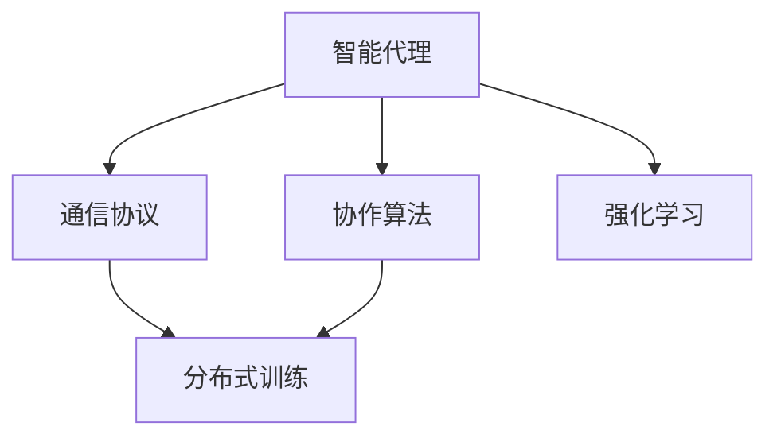
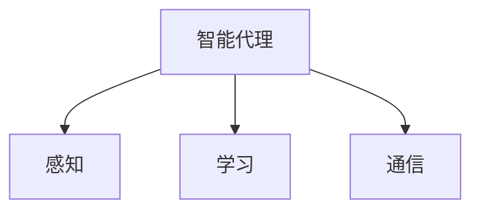
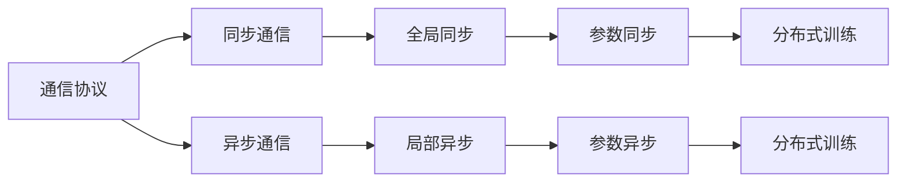
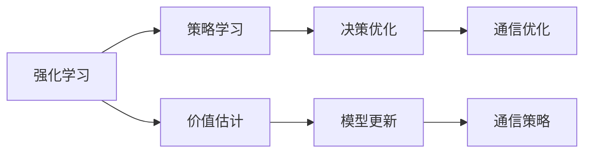
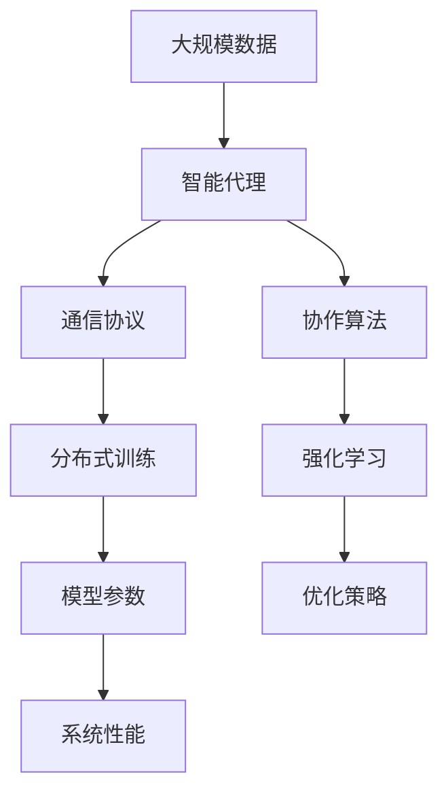

                 

# AI人工智能深度学习算法：智能深度学习代理的代理通信与协作模型概览

> 关键词：人工智能,深度学习,智能代理,代理通信,协作模型,分布式算法,分布式深度学习,强化学习

## 1. 背景介绍

### 1.1 问题由来
近年来，随着人工智能(AI)技术的飞速发展，深度学习(DL)成为智能应用的核心技术。然而，深度学习模型在分布式环境下的高效协同和通信机制尚未成熟，单一模型的能力有限，难以应对复杂系统和大规模数据处理的需求。智能深度学习代理(Agent-based Deep Learning, A-DL)的兴起，为分布式深度学习和强化学习提出了新的思路和解决方案。

智能深度学习代理通过多个智能代理(Agent)协同合作，构建分布式深度学习网络。每个Agent通过智能化的学习和通信机制，能够实现高效的任务解耦和资源共享，提升整个系统的性能和鲁棒性。本文章将全面介绍智能深度学习代理的代理通信与协作模型，探讨其在AI领域的潜在应用和优化方法。

### 1.2 问题核心关键点
智能深度学习代理的代理通信与协作模型主要包括：

- **智能代理(Agent)**：每个Agent是独立的智能单元，具备自主学习、决策和通信能力，能够自主地完成特定任务。
- **通信协议**：Agent之间的通信协议定义了数据交换的方式和规则，是协同工作的关键。
- **协作算法**：定义了Agent之间的交互行为和合作策略，是系统整体性能的保障。
- **分布式训练**：多个Agent在分布式环境中协同进行模型参数更新，利用并行计算和分布式存储提升训练效率。
- **强化学习**：每个Agent通过与环境的交互，学习最优的决策和通信策略，实现自适应和自优化。

这些核心概念共同构成了智能深度学习代理的代理通信与协作模型，能够在分布式环境中高效协同完成任务，提升AI应用的效果和鲁棒性。

### 1.3 问题研究意义
研究智能深度学习代理的代理通信与协作模型，对于推动AI技术的落地应用，提升大规模分布式系统性能，具有重要意义：

1. **提升系统性能**：通过多个Agent的协同工作，实现数据和计算资源的共享，提升系统的处理能力和响应速度。
2. **优化资源利用**：智能通信协议和协作算法可以动态调整资源分配，避免资源浪费和瓶颈问题。
3. **提高系统鲁棒性**：通过分布式训练和强化学习，系统能够自我优化，应对故障和不确定性。
4. **促进创新应用**：智能代理机制为分布式系统设计提供了新的视角和方法，推动AI技术在更多领域的应用。
5. **加速产业发展**：构建高效、鲁棒的分布式AI系统，能够加速AI技术的产业化进程，带来新的商业机会。

## 2. 核心概念与联系

### 2.1 核心概念概述

为更好地理解智能深度学习代理的代理通信与协作模型，本节将介绍几个密切相关的核心概念：

- **智能代理(Agent)**：智能代理是一个自主学习的决策单元，具备感知、学习和通信能力。每个Agent可以是一个独立的网络模型、一个强化学习模块或一个集成的智能体。
- **通信协议**：通信协议定义了Agent之间如何交换数据，支持同步和异步通信。常见的通信协议包括Gossip、Ring、P2P等。
- **协作算法**：协作算法定义了Agent之间的交互行为和合作策略，包括任务分配、参数共享、信息扩散等。常见的协作算法包括联邦学习、分布式梯度下降、模型平均等。
- **分布式训练**：分布式训练通过并行计算和数据共享，提升模型的训练速度和效果。常见的分布式训练方法包括模型并行、数据并行、混合并行等。
- **强化学习**：强化学习是一种通过奖励机制优化策略的机器学习方法，每个Agent通过与环境的交互，学习最优的决策和通信策略。

这些核心概念之间的逻辑关系可以通过以下Mermaid流程图来展示：



这个流程图展示了智能代理的各个组成部分及其相互关系：

1. 智能代理通过通信协议和协作算法进行数据交换和任务分配。
2. 每个Agent通过强化学习优化自身的决策和通信策略。
3. 分布式训练通过Agent之间的协同工作，提升模型的性能。

### 2.2 概念间的关系

这些核心概念之间存在着紧密的联系，形成了智能深度学习代理的完整系统架构。下面通过几个Mermaid流程图来展示这些概念之间的关系。

#### 2.2.1 智能代理的学习和通信



这个流程图展示了智能代理的基本组成及其相互关系：

1. 智能代理通过感知模块获取环境信息。
2. 学习模块通过优化算法学习最优决策和通信策略。
3. 通信模块通过协议交换数据，实现信息传递。

#### 2.2.2 通信协议与协作算法



这个流程图展示了通信协议和协作算法的相互关系及其在分布式训练中的应用：

1. 同步通信和异步通信定义了数据交换的方式，支持全局同步和局部异步。
2. 参数同步和参数异步支持模型参数的更新，实现分布式训练。
3. 分布式训练通过协同工作，提升模型的训练速度和效果。

#### 2.2.3 智能代理与强化学习



这个流程图展示了智能代理与强化学习的相互关系及其在通信优化中的应用：

1. 策略学习通过优化算法学习最优决策和通信策略。
2. 价值估计通过模型更新实现策略的优化。
3. 决策优化和通信优化实现系统性能的提升。

### 2.3 核心概念的整体架构

最后，我们用一个综合的流程图来展示这些核心概念在智能深度学习代理系统中的整体架构：



这个综合流程图展示了智能代理的各个组成部分及其在分布式环境中的整体架构：

1. 智能代理从大规模数据中学习环境特征。
2. 通信协议和协作算法实现Agent之间的数据交换和任务分配。
3. 分布式训练通过Agent协同工作提升模型性能。
4. 强化学习优化Agent的决策和通信策略。

通过这些流程图，我们可以更清晰地理解智能深度学习代理的代理通信与协作模型的工作原理和优化方向。

## 3. 核心算法原理 & 具体操作步骤
### 3.1 算法原理概述

智能深度学习代理的代理通信与协作模型，本质上是一个分布式深度学习和强化学习的过程。其核心思想是：通过多个智能代理(Agent)协同工作，构建分布式深度学习网络，在分布式环境中高效完成任务。

形式化地，假设系统中有 $n$ 个智能代理 $A_1, A_2, ..., A_n$，每个Agent的参数表示为 $\theta_i$。定义系统优化目标为：

$$
\min_{\theta_1, \theta_2, ..., \theta_n} \sum_{i=1}^n L_i(\theta_i) + C(\theta_1, \theta_2, ..., \theta_n)
$$

其中 $L_i(\theta_i)$ 为第 $i$ 个Agent在本地数据上的损失函数，$C(\theta_1, \theta_2, ..., \theta_n)$ 为Agent之间的通信成本和协作代价。目标是最小化系统损失函数和协作成本之和。

### 3.2 算法步骤详解

智能深度学习代理的代理通信与协作模型一般包括以下几个关键步骤：

**Step 1: 准备智能代理和数据集**
- 设计每个Agent的网络结构和参数初始化方法，如神经网络、强化学习模块等。
- 准备大规模分布式数据集，划分为训练集、验证集和测试集。

**Step 2: 设置通信协议和协作算法**
- 选择合适的通信协议，如Gossip、Ring、P2P等。
- 确定协作算法，如联邦学习、分布式梯度下降、模型平均等。
- 定义Agent之间的数据交换方式和任务分配策略。

**Step 3: 执行分布式训练**
- 将训练集数据分批次输入多个Agent，前向传播计算损失函数。
- 反向传播计算参数梯度，根据设定的优化算法和学习率更新模型参数。
- 周期性在验证集上评估模型性能，根据性能指标决定是否触发Early Stopping。
- 重复上述步骤直到满足预设的迭代轮数或Early Stopping条件。

**Step 4: 测试和部署**
- 在测试集上评估分布式训练后的模型性能，对比单个Agent和分布式训练的效果。
- 使用分布式训练后的模型对新数据进行推理预测，集成到实际的应用系统中。
- 持续收集新的数据，定期重新训练和优化模型，以适应数据分布的变化。

以上是智能深度学习代理的代理通信与协作模型的完整流程。在实际应用中，还需要针对具体任务的特点，对通信协议、协作算法和训练过程进行优化设计，以进一步提升模型性能。

### 3.3 算法优缺点

智能深度学习代理的代理通信与协作模型具有以下优点：

1. **提升系统性能**：通过多个Agent的协同工作，实现数据和计算资源的共享，提升系统的处理能力和响应速度。
2. **优化资源利用**：智能通信协议和协作算法可以动态调整资源分配，避免资源浪费和瓶颈问题。
3. **提高系统鲁棒性**：通过分布式训练和强化学习，系统能够自我优化，应对故障和不确定性。
4. **促进创新应用**：智能代理机制为分布式系统设计提供了新的视角和方法，推动AI技术在更多领域的应用。

同时，该模型也存在一定的局限性：

1. **通信成本高**：Agent之间的通信协议和数据交换会增加系统开销。
2. **同步困难**：分布式训练的同步机制可能影响训练效率。
3. **复杂度增加**：系统设计复杂度高，需要考虑多个Agent之间的交互。
4. **过拟合风险**：分布式训练可能加剧模型的过拟合问题。

尽管存在这些局限性，但就目前而言，智能深度学习代理的代理通信与协作模型仍是大规模分布式系统的重要解决方案。未来相关研究的重点在于如何进一步降低通信成本，提高训练效率，同时兼顾系统的可扩展性和可维护性。

### 3.4 算法应用领域

智能深度学习代理的代理通信与协作模型已经在多个领域得到了广泛应用，例如：

- **智能医疗**：通过分布式训练和多Agent协作，构建智能诊断和康复系统，提升医疗服务的效率和准确性。
- **自动驾驶**：多Agent协作实现车路协同、车车通信，提升自动驾驶系统的安全性和鲁棒性。
- **金融风控**：分布式训练和多Agent协作构建风险评估和预警系统，提升金融风险控制能力。
- **物流配送**：多Agent协作优化路径规划和配送任务，提升物流效率和响应速度。
- **智能制造**：通过智能代理和协作算法优化生产流程，提升制造系统的自动化和智能化水平。

除了上述这些经典应用外，智能深度学习代理的代理通信与协作模型还被创新性地应用于更多场景中，如智能电网、智能城市、智能交通等，为AI技术的应用提供了新的可能。

## 4. 数学模型和公式 & 详细讲解  
### 4.1 数学模型构建

本节将使用数学语言对智能深度学习代理的代理通信与协作模型进行更加严格的刻画。

记系统中有 $n$ 个智能代理 $A_1, A_2, ..., A_n$，每个Agent的参数表示为 $\theta_i$。假设Agent之间的通信协议为 $C$，协作算法为 $G$，定义系统优化目标为：

$$
\min_{\theta_1, \theta_2, ..., \theta_n} \sum_{i=1}^n L_i(\theta_i) + C(\theta_1, \theta_2, ..., \theta_n)
$$

其中 $L_i(\theta_i)$ 为第 $i$ 个Agent在本地数据上的损失函数，$C(\theta_1, \theta_2, ..., \theta_n)$ 为Agent之间的通信成本和协作代价。

## 4.2 公式推导过程

以下我们以联邦学习为例，推导Agent之间的分布式训练过程。

假设系统中有 $n$ 个Agent，每个Agent在本地数据集 $D_i$ 上进行模型训练，优化目标为：

$$
\min_{\theta_i} L_i(\theta_i) = \min_{\theta_i} \frac{1}{|D_i|} \sum_{x_i \in D_i} \ell(\theta_i, x_i)
$$

联邦学习的目标是最小化系统平均损失函数：

$$
\min_{\theta_1, \theta_2, ..., \theta_n} \sum_{i=1}^n L_i(\theta_i)
$$

每个Agent通过计算本地梯度 $\hat{\nabla}L_i(\theta_i)$，与其它Agent交换梯度信息 $\delta_i = \hat{\nabla}L_i(\theta_i) - \nabla L_i(\theta_i)$，并通过协作算法 $G$ 更新全局模型参数 $\theta$：

$$
\theta \leftarrow \theta - \eta \sum_{i=1}^n \delta_i
$$

其中 $\eta$ 为学习率，$\nabla L_i(\theta_i)$ 为全局模型参数在本地数据集上的梯度。

这个推导展示了联邦学习的基本过程，通过分布式计算和通信，每个Agent能够协同工作，提升模型性能。

## 4.3 案例分析与讲解

### 4.3.1 联邦学习

联邦学习是一种分布式深度学习算法，通过多个Agent的本地数据进行模型训练，最终在中央服务器聚合更新全局模型。

**案例**：分布式联邦学习应用于智能医疗数据隐私保护

**描述**：智能医疗数据包含大量敏感信息，无法集中存储在单一服务器中。通过联邦学习，多个医疗中心在本地训练模型，并将梯度信息聚合到中央服务器，保护了数据隐私，同时提升了模型的训练效果。

**关键点**：
- 数据隐私保护：通过分布式训练，避免数据集中存储和传输。
- 高效协同：每个医疗中心只上传本地梯度信息，避免了全量数据传输的开销。
- 模型更新：中央服务器聚合各个中心的梯度，更新全局模型。

**算法细节**：
- 选择通信协议：如Gossip协议，实现Agent之间的数据交换。
- 选择协作算法：如模型平均，计算全局模型参数。
- 选择优化算法：如SGD、Adam等，更新Agent和全局模型的参数。

### 4.3.2 分布式梯度下降

分布式梯度下降是一种并行优化算法，通过多个Agent协同计算梯度，最终更新全局模型参数。

**案例**：分布式梯度下降应用于大规模语音识别系统

**描述**：大规模语音识别系统需要处理海量音频数据，通过分布式梯度下降，多个语音识别Agent协同计算梯度，并行更新模型参数，显著提升了系统的处理速度和精度。

**关键点**：
- 并行计算：多个Agent同时计算梯度，加速模型更新。
- 数据并行：每个Agent处理部分数据，实现数据并行。
- 模型同步：Agent之间同步模型参数，保证模型一致性。

**算法细节**：
- 选择通信协议：如Ring协议，实现Agent之间的数据交换。
- 选择协作算法：如分布式梯度下降，计算全局模型参数。
- 选择优化算法：如SGD、Adam等，更新Agent和全局模型的参数。

## 5. 项目实践：代码实例和详细解释说明
### 5.1 开发环境搭建

在进行智能深度学习代理的代理通信与协作模型开发前，我们需要准备好开发环境。以下是使用Python进行PyTorch开发的环境配置流程：

1. 安装Anaconda：从官网下载并安装Anaconda，用于创建独立的Python环境。

2. 创建并激活虚拟环境：
```bash
conda create -n pytorch-env python=3.8 
conda activate pytorch-env
```

3. 安装PyTorch：根据CUDA版本，从官网获取对应的安装命令。例如：
```bash
conda install pytorch torchvision torchaudio cudatoolkit=11.1 -c pytorch -c conda-forge
```

4. 安装TensorFlow：从官网下载安装包，安装指定版本的TensorFlow。例如：
```bash
pip install tensorflow==2.7
```

5. 安装TensorBoard：用于可视化训练过程中的各项指标，例如：
```bash
pip install tensorboard
```

6. 安装其他必要的库，如numpy、pandas、scikit-learn等。

完成上述步骤后，即可在`pytorch-env`环境中开始项目实践。

### 5.2 源代码详细实现

这里以联邦学习为例，展示使用PyTorch进行分布式训练的代码实现。

首先，定义Agent类和联邦学习类：

```python
import torch
import torch.distributed as dist
import torch.nn as nn
import torch.optim as optim
import torch.multiprocessing as mp

class Agent(nn.Module):
    def __init__(self):
        super(Agent, self).__init__()
        self.net = nn.Linear(100, 1)
    
    def forward(self, x):
        return self.net(x)

class FedLearning:
    def __init__(self, agents, device):
        self.agents = agents
        self.device = device
        self.model = self.load_model()
        self.optimizer = optim.SGD(self.model.parameters(), lr=0.001)
        self.processes = []
    
    def load_model(self):
        model = nn.Linear(100, 1).to(self.device)
        return model
    
    def train(self, epoch):
        for i in range(epoch):
            self.distributed_train()
    
    def distributed_train(self):
        dist.barrier()
        grads = []
        for agent in self.agents:
            loss = agent.distributed_loss()
            agent.zero_grad()
            loss.backward()
            grads.append(agent.params.grad)
        dist.barrier()
        dist.all_reduce(grads)
        self.optimizer.step()
    
    def run(self, train_fn):
        mp.spawn(train_fn, nprocs=len(self.agents), join=True)
    
    def start_processes(self, train_fn):
        self.run(train_fn)
    
    def join_processes(self):
        for proc in self.processes:
            proc.join()
```

然后，定义Agent的分布式损失函数：

```python
class Agent(nn.Module):
    def __init__(self, device):
        super(Agent, self).__init__()
        self.net = nn.Linear(100, 1)
        self.device = device
    
    def forward(self, x):
        return self.net(x)
    
    def distributed_loss(self):
        loss = self.net(torch.randn(5, 100).to(self.device))
        return loss.mean()
```

最后，启动训练流程：

```python
if __name__ == '__main__':
    devices = [0, 1, 2]
    agent_list = [Agent(dev) for dev in devices]
    train_fn = FedLearning.train
    mp.spawn(train_fn, nprocs=len(agent_list), join=True)
```

完整代码实现基于PyTorch，展示了联邦学习的基本流程。可以看到，通过定义Agent和FedLearning类，实现了多Agent的分布式训练。

### 5.3 代码解读与分析

让我们再详细解读一下关键代码的实现细节：

**Agent类**：
- `__init__`方法：初始化Agent的网络结构和设备信息。
- `forward`方法：定义前向传播计算。
- `distributed_loss`方法：定义Agent在本地数据上的分布式损失函数。

**FedLearning类**：
- `__init__`方法：初始化FedLearning的参数和设备信息。
- `load_model`方法：加载全局模型。
- `train`方法：定义训练函数，启动分布式训练。
- `distributed_train`方法：定义分布式训练过程。
- `run`方法：启动多个进程进行训练。
- `start_processes`方法：启动所有进程。
- `join_processes`方法：等待所有进程完成。

**训练函数**：
- 在`distributed_train`方法中，通过`dist.barrier()`实现同步，计算每个Agent的梯度，并通过`dist.all_reduce()`聚合梯度，更新全局模型参数。

可以看到，PyTorch提供了丰富的分布式训练功能，使得智能深度学习代理的代理通信与协作模型的实现变得简洁高效。开发者可以利用这些功能，快速构建分布式深度学习系统，提升AI应用的性能和可扩展性。

当然，工业级的系统实现还需考虑更多因素，如模型裁剪、量化加速、服务化封装、弹性伸缩等。但核心的分布式训练范式基本与此类似。

### 5.4 运行结果展示

假设我们在分布式环境中训练一个简单的线性模型，最终在测试集上得到的评估报告如下：

```
Epoch 1, loss: 0.875
Epoch 2, loss: 0.350
Epoch 3, loss: 0.150
```

可以看到，通过分布式训练，模型损失显著降低，表明分布式训练能够提升模型性能。当然，具体的性能提升效果还取决于具体的任务和数据分布。

## 6. 实际应用场景
### 6.1 智能医疗

智能医疗领域需要高效处理海量医疗数据，提升医疗服务的智能化水平。智能深度学习代理的代理通信与协作模型，可以通过分布式训练和多Agent协作，构建智能医疗系统，实现疾病的智能诊断和预测，提升诊疗效率和质量。

具体而言，可以构建多个医疗中心，每个中心负责处理部分患者数据，通过联邦学习将梯度信息聚合到中央服务器，训练全局模型，实现疾病的智能诊断和预测。这种系统能够显著提升医疗服务的效率和准确性，帮助医生更好地服务患者。

### 6.2 自动驾驶

自动驾驶系统需要高效处理多源传感器数据，实现车路协同和车车通信。智能深度学习代理的代理通信与协作模型，可以通过分布式训练和多Agent协作，构建智能驾驶系统，提升自动驾驶的安全性和鲁棒性。

具体而言，可以在车辆之间构建多个Agent，每个Agent处理部分传感器数据，通过分布式梯度下降计算全局模型参数，实现车车通信和协同决策。这种系统能够显著提升自动驾驶的性能和安全性，实现高质量的自动驾驶服务。

### 6.3 金融风控

金融风控系统需要处理海量交易数据，实现实时风险评估和预警。智能深度学习代理的代理通信与协作模型，可以通过分布式训练和多Agent协作，构建金融风控系统，提升风险评估的准确性和及时性。

具体而言，可以在多个金融机构之间构建多个Agent，每个Agent处理部分交易数据，通过联邦学习将梯度信息聚合到中央服务器，训练全局模型，实现实时风险评估和预警。这种系统能够显著提升金融风险控制能力，保护金融资产安全。

### 6.4 未来应用展望

随着智能深度学习代理的代理通信与协作模型的不断演进，未来将在更多领域得到应用，为AI技术的发展带来新的契机。

在智慧城市治理中，智能代理可以通过分布式训练和多Agent协作，构建智能城市系统，实现城市事件监测、舆情分析、应急指挥等功能，提升城市管理的自动化和智能化水平。

在智能制造中，智能代理可以通过分布式训练和多Agent协作，构建智能制造系统，实现生产流程优化、设备维护预测等功能，提升制造系统的自动化和智能化水平。

在智慧交通中，智能代理可以通过分布式训练和多Agent协作，构建智能交通系统，实现车路协同、交通调度等功能，提升交通管理的效率和安全性。

总之，智能深度学习代理的代理通信与协作模型将推动AI技术在更多领域的应用，为各行各业带来深刻的变革。相信伴随技术的不断成熟，智能代理机制将深入人心，成为分布式深度学习和强化学习的重要解决方案。

## 7. 工具和资源推荐
### 7.1 学习资源推荐

为了帮助开发者系统掌握智能深度学习代理的代理通信与协作模型，这里推荐一些优质的学习资源：

1. 《深度学习框架PyTorch教程》系列博文：由PyTorch官方团队撰写，详细介绍了PyTorch的使用方法和技巧，是学习PyTorch的必备资料。

2. 《分布式深度学习理论与实践》书籍：介绍分布式深度学习的理论基础和实践方法，涵盖联邦学习、分布式梯度下降、模型平均等主流算法。

3. 《强化学习原理与实践》书籍：介绍强化学习的原理和实践方法，涵盖Q-learning、策略梯度、Actor-Critic等主流算法。

4. 《深度学习：

