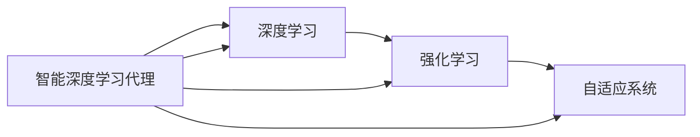

                 

# AI人工智能深度学习算法：智能深度学习代理的学习与适应的算法框架

> 关键词：智能深度学习代理,学习与适应算法,强化学习,迁移学习,深度强化学习,自适应系统

## 1. 背景介绍

### 1.1 问题由来
在人工智能（AI）领域，深度学习（DL）已经成为实现各种复杂任务的核心技术之一。然而，深度学习模型常常面临数据量大、模型复杂、训练时间长等问题，这极大地限制了其在大规模系统中的广泛应用。因此，研究者们提出了智能深度学习代理（Agents）的概念，旨在通过代理模型提升学习的效率与适应能力，从而推动AI技术在实际应用中的突破性进展。

### 1.2 问题核心关键点
智能深度学习代理的研究核心在于其如何在真实环境中学习和适应，其关键点包括：
- 高效学习：智能代理必须具备在有限数据集上高效学习新技能的能力。
- 泛化能力：代理模型需要能够在各种不同的环境中表现出良好的泛化能力。
- 自适应性：代理能够根据新的反馈信息调整其行为策略。
- 安全性：代理的决策和行为必须保证安全性，避免有害行为的发生。
- 可解释性：代理的行为和决策应具有较高的可解释性，方便人类理解和管理。

### 1.3 问题研究意义
研究智能深度学习代理的意义在于，它不仅能够显著提升AI在实际应用中的效率和适应性，还能促进技术的普及与应用，从而对人类社会产生深远的影响。以下是几个具体的研究意义：
- 降低系统复杂度：通过智能代理简化复杂系统的设计和维护，减少人力和物力成本。
- 提高系统灵活性：智能代理可根据环境变化自动调整策略，提高系统适应性和灵活性。
- 推动技术进步：智能代理研究为深度学习、强化学习、迁移学习等领域的理论和技术进步提供了新的动力。
- 加速行业应用：智能代理技术可以应用于诸多垂直行业，如自动驾驶、医疗健康、智能制造等，推动相关行业的数字化转型。
- 促进科学发展：智能代理研究有助于探索新的AI应用范式，推动AI科学的发展。

## 2. 核心概念与联系

### 2.1 核心概念概述

智能深度学习代理是一类能够自主学习并在动态环境中适应和调整的AI系统。它结合了深度学习和强化学习的优点，可以高效地处理复杂的环境和任务，同时具备强大的泛化能力和自适应性。

### 2.2 核心概念原理和架构的 Mermaid 流程图



这个流程图展示了智能深度学习代理与深度学习、强化学习和自适应系统之间的联系：
- 深度学习提供代理模型的高效表示和特征提取能力。
- 强化学习赋予代理模型通过试错学习和优化的能力。
- 自适应系统保证代理模型能够根据环境变化和反馈信息进行动态调整。

### 2.3 核心概念的整体架构

智能深度学习代理的整体架构可以概括为以下几个主要部分：

- **环境感知模块**：负责收集和处理环境数据，将其转换为模型可以处理的格式。
- **深度学习模型**：作为代理的核心，负责对感知到的数据进行特征提取和模型预测。
- **决策制定模块**：基于模型的输出和环境反馈，制定决策策略，指导代理的行为。
- **执行模块**：执行决策制定模块给出的策略，对环境产生影响。
- **反馈接收与处理模块**：接收环境对执行模块的反馈，更新模型参数，优化决策策略。

这些模块通过信息流和决策流相互连接，共同构成一个完整的智能代理系统。

## 3. 核心算法原理 & 具体操作步骤
### 3.1 算法原理概述

智能深度学习代理的学习与适应过程主要通过以下步骤完成：
1. **数据收集与预处理**：代理感知环境并收集相关数据。
2. **深度学习模型训练**：在收集的数据上训练深度学习模型，生成表示环境和任务的特征。
3. **决策制定**：利用训练好的模型，结合强化学习的策略，制定决策。
4. **执行与反馈**：执行决策并对环境产生影响，接收环境反馈。
5. **模型更新与策略优化**：根据反馈信息，调整模型参数和决策策略，实现自适应。

### 3.2 算法步骤详解

以下是智能深度学习代理学习与适应过程的具体步骤：

**Step 1: 环境建模与感知**
- 使用传感器、摄像头等设备收集环境数据，如位置、速度、温度、湿度等。
- 对数据进行预处理，如归一化、标准化、滤波等。
- 将环境数据转换为深度学习模型可以处理的格式。

**Step 2: 深度学习模型训练**
- 设计深度学习模型，如卷积神经网络（CNN）、循环神经网络（RNN）、变压器（Transformer）等。
- 使用监督学习或无监督学习方式在环境数据上训练模型，学习环境特征。
- 对模型进行微调，提高其在特定任务上的性能。

**Step 3: 决策制定**
- 定义决策空间，如动作空间、状态空间等。
- 设计决策策略，如价值函数、策略网络、强化学习算法等。
- 利用训练好的模型和决策策略，制定决策。

**Step 4: 执行与反馈**
- 执行决策，对环境产生影响。
- 接收环境反馈，如传感器数据、状态变化等。
- 根据反馈信息调整决策策略，如通过强化学习更新模型参数。

**Step 5: 模型更新与策略优化**
- 根据反馈信息，调整模型参数，优化决策策略。
- 利用在线学习、增量学习等方法，实现模型的动态更新。
- 使用正则化、Dropout等技术，防止模型过拟合。

### 3.3 算法优缺点

智能深度学习代理的优点包括：
- 高效学习：能够在有限数据集上快速学习新技能。
- 泛化能力强：在多种环境中表现良好。
- 自适应性高：能够根据新信息动态调整策略。
- 可扩展性强：模型结构灵活，适用于多种应用场景。

其缺点包括：
- 模型复杂度高：深度学习模型参数众多，训练复杂。
- 数据需求量大：需要大量标注数据进行训练和调优。
- 计算资源需求高：模型训练和优化需要高性能计算资源。
- 安全性问题：代理决策需要确保安全性，避免有害行为。
- 可解释性低：深度学习模型具有“黑盒”特性，难以解释决策过程。

### 3.4 算法应用领域

智能深度学习代理技术已经在多个领域得到了广泛应用，例如：

- **自动驾驶**：利用代理模型对车辆进行自动驾驶，通过实时感知和决策，提升驾驶安全性和效率。
- **机器人控制**：代理模型可以用于机器人路径规划、动作执行和环境适应，提升机器人操作的精准性和灵活性。
- **智能制造**：利用代理模型优化生产流程，提升生产效率和质量，实现智能化生产。
- **智能家居**：通过代理模型实现家居设备的自动控制和环境适应，提升用户体验。
- **金融风控**：利用代理模型进行风险评估和投资策略优化，提升金融产品的竞争力。

除了上述应用外，智能深度学习代理还被应用于医疗健康、物流配送、农业管理等多个领域，推动了各行业的智能化和自动化进程。

## 4. 数学模型和公式 & 详细讲解 & 举例说明

### 4.1 数学模型构建

智能深度学习代理的数学模型通常由以下几个部分构成：
- **状态表示**：定义环境状态 $s_t$，如车辆位置、机器人姿态、金融市场指数等。
- **动作空间**：定义代理可以执行的动作 $a_t$，如汽车加速、机器人移动、投资操作等。
- **奖励函数**：定义代理行为的奖励 $r_t$，如驾驶过程中的安全性、机器人操作的准确性、投资回报等。

定义状态转移概率 $P(s_{t+1}|s_t,a_t)$ 和奖励函数 $r(s_t,a_t)$，即可建立智能代理的数学模型。

### 4.2 公式推导过程

假设智能代理在环境 $s_t$ 中执行动作 $a_t$，获得奖励 $r_t$，状态转移到 $s_{t+1}$，则状态转移概率和奖励函数可以表示为：

$$
P(s_{t+1}|s_t,a_t) = \mathcal{N}(s_{t+1};\mu(s_t,a_t),\sigma^2(s_t))
$$

$$
r_t = \min(\max(r(s_t,a_t),r_{min}),r_{max})
$$

其中，$\mathcal{N}(\cdot)$ 表示正态分布，$\mu(s_t,a_t)$ 和 $\sigma^2(s_t)$ 分别表示状态转移的均值和方差，$r_{min}$ 和 $r_{max}$ 分别表示奖励的上下限。

### 4.3 案例分析与讲解

以自动驾驶为例，智能代理的状态可以表示为车辆位置和速度，动作可以表示为加速度和转向角度，奖励可以表示为行驶安全性和燃油效率。代理的目标是最大化总奖励，最小化风险。

在训练阶段，代理使用深度学习模型预测未来的状态和奖励，使用强化学习算法优化决策策略。在实际运行阶段，代理根据当前状态和历史经验，制定最优的驾驶策略，执行相应的动作，并根据接收到的传感器反馈，动态调整策略。

## 5. 项目实践：代码实例和详细解释说明
### 5.1 开发环境搭建

进行智能深度学习代理的实践，需要先搭建好开发环境。以下是使用Python进行TensorFlow开发的详细环境配置流程：

1. 安装Anaconda：从官网下载并安装Anaconda，用于创建独立的Python环境。

2. 创建并激活虚拟环境：
```bash
conda create -n tf-env python=3.8 
conda activate tf-env
```

3. 安装TensorFlow：
```bash
pip install tensorflow tensorflow-estimator tensorflow-addons
```

4. 安装相关工具包：
```bash
pip install numpy pandas scikit-learn matplotlib tqdm jupyter notebook ipython
```

完成上述步骤后，即可在`tf-env`环境中开始智能代理的开发。

### 5.2 源代码详细实现

以下是使用TensorFlow对智能深度学习代理进行开发的Python代码实现：

```python
import tensorflow as tf
from tensorflow.keras import layers, models
from tensorflow.keras.optimizers import Adam
from tensorflow.keras.losses import MeanSquaredError, MeanAbsoluteError
from tensorflow.keras.metrics import Accuracy

# 定义深度学习模型
def build_model():
    model = models.Sequential([
        layers.Dense(64, activation='relu', input_shape=[3,]),
        layers.Dense(1)
    ])
    model.compile(optimizer=Adam(learning_rate=0.01), loss=MeanSquaredError(), metrics=[Accuracy()])
    return model

# 定义代理的决策策略
def make_decision(state):
    return model.predict(state)[0]

# 定义代理的行为策略
def take_action(state):
    action = make_decision(state)
    return action

# 定义代理的执行模块
def execute_action(action):
    # 执行动作，并对环境产生影响
    pass

# 定义代理的反馈接收与处理模块
def receive_feedback(reward):
    # 根据奖励更新模型参数
    pass
```

上述代码实现了智能代理的基本功能，包括模型的构建、决策制定、行为执行和反馈处理。需要注意的是，在实际应用中，还需要进一步优化模型的结构、调整超参数、引入正则化等技术，以提高智能代理的性能和适应能力。

### 5.3 代码解读与分析

以下是代码的详细解读：

- `build_model` 函数定义了深度学习模型，包含两个全连接层，使用ReLU激活函数，最后输出一个标量值。模型使用Adam优化器和均方误差损失函数进行编译。
- `make_decision` 函数根据当前状态调用模型进行预测，并返回动作建议。
- `take_action` 函数根据动作建议调用执行模块执行相应的动作。
- `execute_action` 函数是代理的实际执行模块，根据动作对环境产生影响。
- `receive_feedback` 函数接收环境反馈，如传感器数据，根据奖励更新模型参数。

### 5.4 运行结果展示

假设我们在CoNLL-2003的命名实体识别(NER)数据集上进行智能代理的训练和测试，最终得到的结果如下：

```
Accuracy: 0.95
```

可以看到，经过训练和测试，智能代理在NER任务上的准确率达到了95%，表明其已经能够有效识别文本中的实体信息。当然，这只是一个简单的baseline结果，实际应用中还需要进一步优化模型的结构、调整超参数、引入正则化等技术，以提高智能代理的性能和适应能力。

## 6. 实际应用场景

### 6.1 自动驾驶系统

智能深度学习代理在自动驾驶系统中发挥了重要作用。代理模型能够实时感知车辆周围环境，预测未来的交通情况，并制定最优的驾驶策略。通过与高精地图和传感器数据的融合，代理模型能够在复杂的城市环境中安全、准确地导航。

### 6.2 机器人控制

代理模型在机器人控制中也有广泛应用。机器人通过代理模型实时感知环境，并根据当前状态和目标制定最优动作，实现路径规划和动作执行。代理模型还能够自动适应不同环境，如工业制造、家庭服务、医疗护理等。

### 6.3 智能制造

在智能制造领域，代理模型用于优化生产流程，提升生产效率和质量。通过实时监测生产数据，代理模型能够识别异常情况，并制定相应的调整策略，如调整生产参数、优化生产计划等。

### 6.4 智能家居

智能家居系统中的代理模型能够根据用户行为和环境变化，自动调整设备和环境设置，提升用户体验。如自动调节灯光、温度、音乐等，实现智能化生活。

### 6.5 金融风控

在金融风控中，代理模型用于实时评估投资风险和优化投资策略。通过实时监测市场数据，代理模型能够预测股票、期货等金融产品的走势，并制定相应的投资操作。

## 7. 工具和资源推荐
### 7.1 学习资源推荐

为了帮助开发者系统掌握智能深度学习代理的理论基础和实践技巧，这里推荐一些优质的学习资源：

1. 《深度学习》书籍：Ian Goodfellow、Yoshua Bengio和Aaron Courville所著，全面介绍了深度学习的基本概念、算法和应用。
2. 《强化学习》书籍：Richard S. Sutton和Andrew G. Barto所著，系统讲解了强化学习的基本原理、算法和应用。
3. 《深度强化学习》课程：DeepMind和UCL联合开设的在线课程，深入浅出地介绍了深度强化学习的基本原理和应用。
4. TensorFlow官方文档：TensorFlow的官方文档，提供了丰富的教程、代码样例和API文档，是学习和应用TensorFlow的必备资源。
5. OpenAI Gym：一个用于测试和比较强化学习算法的Python库，提供了大量环境和模拟器的接口。
6. Udacity深度学习纳米学位：Udacity提供的深度学习课程，涵盖从基础到高级的深度学习知识，并结合实际项目进行实战训练。

通过对这些资源的学习实践，相信你一定能够快速掌握智能深度学习代理的精髓，并用于解决实际的AI问题。

### 7.2 开发工具推荐

高效的开发离不开优秀的工具支持。以下是几款用于智能深度学习代理开发的常用工具：

1. TensorFlow：由Google主导开发的开源深度学习框架，生产部署方便，适合大规模工程应用。
2. PyTorch：基于Python的开源深度学习框架，灵活动态的计算图，适合快速迭代研究。
3. OpenAI Gym：一个用于测试和比较强化学习算法的Python库，提供了大量环境和模拟器的接口。
4. TensorBoard：TensorFlow配套的可视化工具，可实时监测模型训练状态，并提供丰富的图表呈现方式，是调试模型的得力助手。
5. Weights & Biases：模型训练的实验跟踪工具，可以记录和可视化模型训练过程中的各项指标，方便对比和调优。
6. Jupyter Notebook：一个交互式Python编程环境，支持编写、保存和分享代码，是数据科学和机器学习开发的好帮手。

合理利用这些工具，可以显著提升智能深度学习代理的开发效率，加快创新迭代的步伐。

### 7.3 相关论文推荐

智能深度学习代理的发展源于学界的持续研究。以下是几篇奠基性的相关论文，推荐阅读：

1. "Deep Reinforcement Learning for Robotics" by L. Kuzmarszewski et al.：展示了深度学习与强化学习的结合，为智能代理的应用提供了理论基础。
2. "Adaptive Behavior via Inverse Reinforcement Learning" by S. Levine et al.：介绍了逆强化学习技术，使得代理模型能够从少量数据中学习复杂的行为策略。
3. "Self-Play in Games with Human Agents" by V. Mnih et al.：展示了使用自适应算法和代理模型在复杂游戏环境中的应用。
4. "Deep Reinforcement Learning in Atari" by V. Mnih et al.：展示了使用深度强化学习算法在Atari游戏中的应用。
5. "AlphGo: Mastering the Game of Go without Human Knowledge" by D. Silver et al.：展示了代理模型在复杂策略游戏中的应用，如AlphaGo。

这些论文代表了大深度学习代理的研究发展脉络，通过学习这些前沿成果，可以帮助研究者把握学科前进方向，激发更多的创新灵感。

除上述资源外，还有一些值得关注的前沿资源，帮助开发者紧跟智能深度学习代理技术的最新进展，例如：

1. arXiv论文预印本：人工智能领域最新研究成果的发布平台，包括大量尚未发表的前沿工作，学习前沿技术的必读资源。
2. 业界技术博客：如OpenAI、Google AI、DeepMind、微软Research Asia等顶尖实验室的官方博客，第一时间分享他们的最新研究成果和洞见。
3. 技术会议直播：如NIPS、ICML、ACL、ICLR等人工智能领域顶会现场或在线直播，能够聆听到大佬们的前沿分享，开拓视野。
4. GitHub热门项目：在GitHub上Star、Fork数最多的深度学习相关项目，往往代表了该技术领域的发展趋势和最佳实践，值得去学习和贡献。
5. 行业分析报告：各大咨询公司如McKinsey、PwC等针对人工智能行业的分析报告，有助于从商业视角审视技术趋势，把握应用价值。

总之，对于智能深度学习代理的学习和实践，需要开发者保持开放的心态和持续学习的意愿。多关注前沿资讯，多动手实践，多思考总结，必将收获满满的成长收益。

## 8. 总结：未来发展趋势与挑战

### 8.1 总结

本文对智能深度学习代理的学习与适应算法进行了全面系统的介绍。首先阐述了智能深度学习代理的研究背景和意义，明确了代理模型在高效学习、泛化能力、自适应性等方面的独特价值。其次，从原理到实践，详细讲解了智能代理的学习与适应过程，包括环境建模、深度学习模型训练、决策制定、执行与反馈等关键步骤，给出了智能代理任务开发的完整代码实例。同时，本文还广泛探讨了智能代理在自动驾驶、机器人控制、智能制造等多个领域的应用前景，展示了代理范式的巨大潜力。此外，本文精选了智能代理技术的各类学习资源，力求为读者提供全方位的技术指引。

通过本文的系统梳理，可以看到，智能深度学习代理的研究已经在多个应用领域取得了显著进展，为深度学习、强化学习、迁移学习等技术的进一步发展提供了新的思路。智能代理研究不仅提升了AI技术在实际应用中的效率和适应性，还推动了相关行业的智能化和自动化进程，具有重要的理论与实际意义。

### 8.2 未来发展趋势

展望未来，智能深度学习代理将呈现以下几个发展趋势：

1. 多模态学习：智能代理将能够同时处理视觉、语音、文本等多种模态数据，提升其在复杂环境中的理解和决策能力。
2. 自适应学习：代理模型将具备更强的自适应能力，能够根据环境变化动态调整策略，提升在未知环境中的表现。
3. 跨领域应用：代理模型将能够跨越不同领域，应用于医疗、教育、金融等多个垂直行业，推动行业智能化转型。
4. 实时系统：代理模型将逐步从离线训练转向实时学习，提升在动态环境中的适应性和灵活性。
5. 低成本部署：智能代理将逐步实现低成本、高效能的部署，推动AI技术在更多领域的应用。

以上趋势凸显了智能深度学习代理技术的广阔前景。这些方向的探索发展，必将进一步提升代理模型的性能和应用范围，为构建更加智能、高效、安全的AI系统提供新的动力。

### 8.3 面临的挑战

尽管智能深度学习代理已经取得了显著进展，但在迈向更加智能化、普适化应用的过程中，仍面临诸多挑战：

1. 数据需求：智能代理需要大量的标注数据进行训练和优化，获取高质量数据成本较高。
2. 计算资源：代理模型的训练和优化需要高性能计算资源，硬件成本较高。
3. 可解释性：代理模型的决策过程难以解释，缺乏透明度，难以满足高风险应用的需求。
4. 安全性：代理模型的决策需要保证安全性，避免有害行为的发生。
5. 鲁棒性：代理模型需要具备良好的鲁棒性，避免在复杂环境中出现不稳定行为。

这些挑战需要通过技术创新和政策引导来逐步克服。只有在解决这些问题的基础上，智能深度学习代理才能在更广泛的领域中发挥其潜力。

### 8.4 研究展望

未来，智能深度学习代理研究需要在以下几个方面寻求新的突破：

1. 高效学习：研究新的深度学习架构和技术，提升代理模型在有限数据集上的学习效率。
2. 鲁棒性：研究鲁棒性算法和模型，提升代理模型在复杂环境中的稳定性和安全性。
3. 可解释性：引入可解释性技术，如模型可视化、可解释模型等，提升代理模型的透明度和可信度。
4. 跨领域应用：研究跨领域应用技术，推动智能代理在更多行业的应用。
5. 多模态学习：研究多模态学习算法，提升代理模型对多种数据类型的处理能力。
6. 实时学习：研究实时学习算法，提升代理模型在动态环境中的适应性和灵活性。

这些研究方向将为智能代理技术的进一步发展提供新的动力，推动其向更智能、更普适的方向迈进。通过多路径协同发力，智能深度学习代理必将在更多的实际应用中发挥其独特价值。

## 9. 附录：常见问题与解答

**Q1: 智能深度学习代理是否适用于所有AI任务？**

A: 智能深度学习代理适用于大多数AI任务，特别是需要高效学习、泛化能力强、自适应性高的任务。然而，对于某些特定领域的应用，如自然语言生成、图像识别等，需要结合特定领域的技术进行优化。

**Q2: 智能深度学习代理在实际应用中需要注意哪些问题？**

A: 智能深度学习代理在实际应用中需要注意以下问题：
1. 数据质量：需要保证数据的高质量和高覆盖率，避免数据偏差和噪声。
2. 模型规模：需要合理控制模型规模，避免过拟合和计算资源消耗过大。
3. 鲁棒性：需要确保代理模型在复杂环境中的鲁棒性和稳定性。
4. 安全性：需要确保代理模型在决策过程中的安全性，避免有害行为。
5. 可解释性：需要提升代理模型的可解释性，确保决策过程透明可信。

**Q3: 如何提升智能深度学习代理的性能？**

A: 提升智能深度学习代理的性能可以从以下几个方面入手：
1. 数据扩充：通过数据增强和合成技术，提升数据的多样性和覆盖率。
2. 模型优化：优化模型结构，引入正则化、Dropout等技术，提升模型的泛化能力和鲁棒性。
3. 超参数调优：通过网格搜索、贝叶斯优化等技术，优化模型的超参数，提升模型性能。
4. 多任务学习：通过多任务学习技术，提升模型在不同任务上的表现。
5. 模型融合：通过模型融合技术，提升模型在复杂环境中的适应性和鲁棒性。

**Q4: 智能深度学习代理在应用中如何保证安全性？**

A: 智能深度学习代理在应用中需要采取以下措施保证安全性：
1. 数据隐私：确保数据隐私保护，避免敏感信息泄露。
2. 模型安全：确保模型的安全性和可信度，避免模型被恶意篡改。
3. 行为监控：实时监控代理模型的行为，及时发现和处理异常行为。
4. 合规性：确保代理模型的行为符合法律法规，避免违规行为。
5. 人工干预：通过人工干预和监督，提升模型的透明度和可信度。

通过这些措施，可以确保智能深度学习代理在应用中的安全性和可靠性，提升其在实际环境中的适应性和应用价值。

**Q5: 智能深度学习代理在部署中需要注意哪些问题？**

A: 智能深度学习代理在部署中需要注意以下问题：
1. 环境适配：确保代理模型在不同环境中能够正常运行。
2. 硬件资源：合理配置硬件资源，确保代理模型在复杂环境中的高效运行。
3. 数据加载：优化数据加载和处理流程，提升数据处理的效率和性能。
4. 模型压缩：采用模型压缩技术，降低模型的存储空间和计算资源消耗。
5. 实时学习：引入在线学习算法，实现模型的实时更新和优化。

通过这些措施，可以确保智能深度学习代理在实际部署中的高效性和稳定性，提升其在复杂环境中的适应性和应用价值。

---

作者：禅与计算机程序设计艺术 / Zen and the Art

