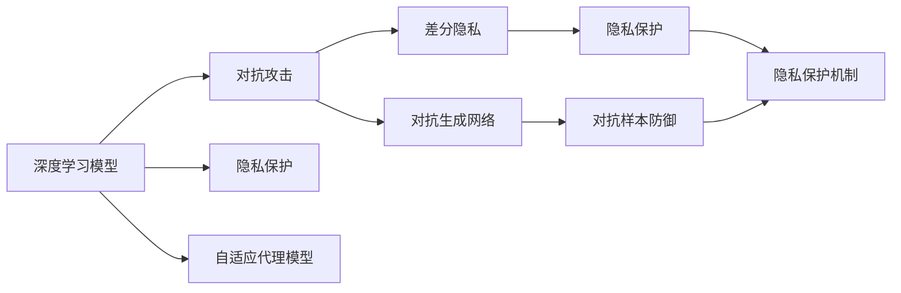
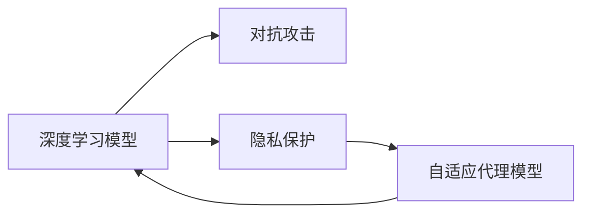
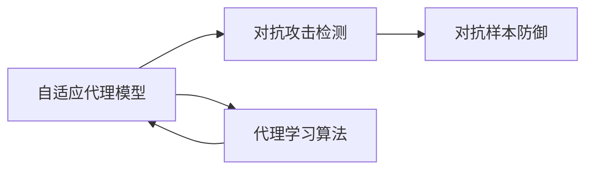
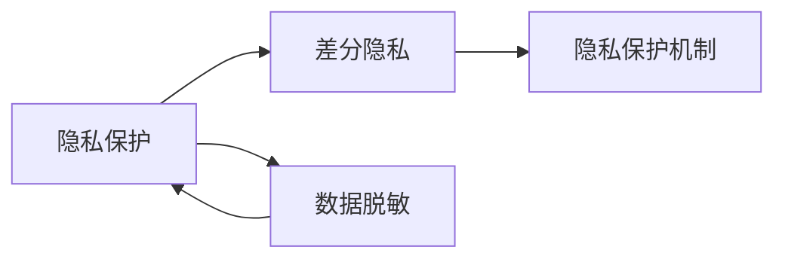
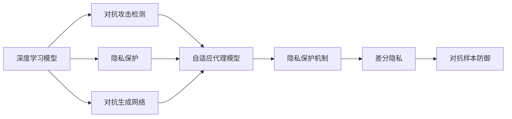

                 

# AI人工智能深度学习算法：智能深度学习代理的安全与隐私保护

## 1. 背景介绍

### 1.1 问题由来

随着人工智能技术的快速发展，深度学习模型被广泛应用于各个领域，如自然语言处理、计算机视觉、自动驾驶等。然而，深度学习模型的应用也带来了严峻的安全和隐私问题。

近年来，深度学习模型被广泛用于生成对抗样本（Adversarial Examples），攻击者通过精心设计的对抗样本，可以欺骗模型输出错误结果。同时，深度学习模型中的敏感信息泄露也成为隐私保护的重要挑战。例如，人脸识别系统、语音识别系统等生物识别系统的数据泄露，将对个人隐私造成极大威胁。

针对这些挑战，研究人员提出了智能深度学习代理（Smart Deep Learning Agent）的概念，以提升深度学习模型的安全性和隐私保护能力。智能深度学习代理是一种能够自动检测和抵御对抗攻击，同时保护用户隐私的深度学习模型。

### 1.2 问题核心关键点

智能深度学习代理的核心思想是通过代理学习机制，在模型的训练和推理过程中，不断检测和修正模型的行为，防止模型的输出被对抗攻击和隐私泄露。

具体而言，智能深度学习代理通常包括以下关键组件：
- **自适应代理模型**：用于检测和修正模型的行为，保证模型的安全性。
- **隐私保护机制**：用于保护用户隐私，防止敏感信息泄露。
- **对抗攻击检测器**：用于检测对抗攻击，提升模型的鲁棒性。
- **代理学习算法**：用于训练自适应代理模型，不断优化模型的性能。

这些组件的有机结合，能够显著提升深度学习模型的安全性和隐私保护能力，使其在面对各种威胁时保持稳定可靠的表现。

### 1.3 问题研究意义

智能深度学习代理的提出，对于提升深度学习模型的安全性、隐私保护能力，以及推广深度学习技术在更多场景中的应用具有重要意义：

1. **提升模型安全性**：智能深度学习代理能够自动检测和修正模型的行为，防止对抗攻击，保护模型的输出不受干扰，从而提升模型的安全性。
2. **保护用户隐私**：智能深度学习代理能够保护用户隐私，防止敏感信息泄露，增强用户对深度学习技术的信任度。
3. **促进技术落地**：智能深度学习代理能够解决深度学习模型在实际应用中的安全性和隐私保护问题，促进深度学习技术在更多领域的应用，加速人工智能技术的产业化进程。
4. **带来技术创新**：智能深度学习代理的研发和应用，催生了新的研究方向和技术创新，如对抗生成网络（GAN）、差分隐私等。
5. **赋能产业升级**：智能深度学习代理的应用，能够帮助企业提升深度学习技术的安全性和隐私保护能力，赋能行业数字化转型升级，构建更安全、更可靠的人工智能系统。

## 2. 核心概念与联系

### 2.1 核心概念概述

为更好地理解智能深度学习代理的安全与隐私保护机制，本节将介绍几个密切相关的核心概念：

- **深度学习模型**：一种基于神经网络的机器学习模型，通过多层次的抽象表示，自动学习特征和规律，广泛应用于自然语言处理、计算机视觉等任务。
- **对抗攻击**：指攻击者通过添加微小的扰动，使得深度学习模型输出错误结果，破坏模型的鲁棒性和安全性。
- **隐私保护**：指保护用户隐私，防止敏感信息泄露，如个人身份、位置、行为等。
- **自适应代理模型**：一种能够自动检测和修正模型行为的深度学习模型，用于提升模型的安全性和鲁棒性。
- **差分隐私**：一种保护隐私的机制，通过添加噪声和限制信息泄露量，保护个体隐私。
- **对抗生成网络（GAN）**：一种生成对抗训练的神经网络，用于生成逼真的对抗样本，用于模型鲁棒性测试和对抗样本防御。

这些核心概念之间的逻辑关系可以通过以下Mermaid流程图来展示：



这个流程图展示了几大核心概念之间的关系：

1. 深度学习模型通过自适应代理模型，检测和修正对抗攻击和隐私泄露，提升模型的安全性和隐私保护能力。
2. 对抗攻击和隐私泄露的问题，通过差分隐私和对抗生成网络等技术，得到有效缓解。
3. 隐私保护机制通过差分隐私等方法，保护用户隐私，防止敏感信息泄露。

### 2.2 概念间的关系

这些核心概念之间存在着紧密的联系，形成了智能深度学习代理的完整生态系统。下面我们通过几个Mermaid流程图来展示这些概念之间的关系。

#### 2.2.1 深度学习模型的安全与隐私保护



这个流程图展示了深度学习模型的安全与隐私保护过程：

1. 深度学习模型通过自适应代理模型，检测和修正对抗攻击和隐私泄露。
2. 隐私保护机制通过差分隐私等方法，保护用户隐私。
3. 通过自适应代理模型和隐私保护机制，深度学习模型能够在面对对抗攻击和隐私泄露时，保持稳定可靠的表现。

#### 2.2.2 自适应代理模型的训练与优化



这个流程图展示了自适应代理模型的训练与优化过程：

1. 自适应代理模型通过对抗攻击检测，识别对抗攻击。
2. 通过代理学习算法，不断优化模型的行为，提升模型的鲁棒性。
3. 代理学习算法通过对模型的训练和推理过程进行监控，不断调整模型的参数，增强模型的安全性。

#### 2.2.3 隐私保护的实现与部署



这个流程图展示了隐私保护的实现与部署过程：

1. 隐私保护通过差分隐私等方法，限制信息泄露量。
2. 数据脱敏通过噪声添加和扰动等方法，保护用户隐私。
3. 隐私保护机制通过差分隐私等技术，实现隐私保护功能。

### 2.3 核心概念的整体架构

最后，我们用一个综合的流程图来展示这些核心概念在大规模深度学习代理的安全与隐私保护中的整体架构：



这个综合流程图展示了从对抗攻击检测到隐私保护机制的完整过程。深度学习模型通过自适应代理模型和隐私保护机制，能够有效抵御对抗攻击和保护用户隐私。同时，通过对抗生成网络等技术，对模型的鲁棒性进行测试和提升。

## 3. 核心算法原理 & 具体操作步骤
### 3.1 算法原理概述

智能深度学习代理的核心思想是通过代理学习机制，在模型的训练和推理过程中，不断检测和修正模型的行为，防止模型的输出被对抗攻击和隐私泄露。

具体而言，智能深度学习代理通常包括以下关键步骤：

1. **对抗攻击检测**：检测模型的输出是否被对抗攻击干扰，判断模型是否处于被攻击状态。
2. **自适应代理模型训练**：根据对抗攻击检测结果，对代理模型进行训练，不断优化代理模型的行为。
3. **隐私保护机制部署**：在模型推理过程中，部署隐私保护机制，防止敏感信息泄露。
4. **代理学习算法优化**：对代理学习算法进行优化，提升代理模型的性能。

通过这些步骤，智能深度学习代理能够显著提升深度学习模型的安全性和隐私保护能力。

### 3.2 算法步骤详解

以下详细介绍智能深度学习代理的各个关键步骤。

**Step 1: 对抗攻击检测**

对抗攻击检测是智能深度学习代理的关键步骤之一。通过对抗攻击检测，可以及时识别模型的被攻击状态，并采取相应的防护措施。常见的对抗攻击检测方法包括：

- **梯度掩盖**：通过在模型输出上添加扰动，检测模型是否对扰动敏感，从而判断模型是否受到对抗攻击。
- **对抗样本生成**：使用对抗生成网络（GAN）生成对抗样本，检测模型对对抗样本的反应，判断模型是否受到攻击。
- **异常检测**：使用异常检测算法，检测模型的输出是否异常，判断模型是否受到攻击。

**Step 2: 自适应代理模型训练**

自适应代理模型是智能深度学习代理的核心组件。代理模型的训练过程通常包括以下步骤：

- **选择代理模型**：选择合适的代理模型，如基于神经网络的代理模型、基于规则的代理模型等。
- **训练代理模型**：根据对抗攻击检测结果，训练代理模型，不断优化代理模型的行为。
- **融合代理模型**：将代理模型与深度学习模型进行融合，使代理模型能够对模型的行为进行实时监控和修正。

**Step 3: 隐私保护机制部署**

隐私保护机制是智能深度学习代理的重要组成部分，用于保护用户隐私。常见的隐私保护方法包括：

- **差分隐私**：通过添加噪声和限制信息泄露量，保护个体隐私。
- **数据脱敏**：通过数据扰动、掩码等方法，保护用户隐私。
- **安全多方计算**：通过多方安全计算协议，保护用户隐私。

**Step 4: 代理学习算法优化**

代理学习算法是智能深度学习代理的重要工具，用于优化代理模型的性能。常见的代理学习算法包括：

- **梯度下降算法**：用于训练代理模型，优化代理模型的行为。
- **自适应学习算法**：用于动态调整代理模型参数，提高代理模型的性能。
- **混合学习算法**：结合规则学习和神经网络学习，提高代理模型的准确性和鲁棒性。

### 3.3 算法优缺点

智能深度学习代理具有以下优点：

1. **安全性高**：通过自适应代理模型和隐私保护机制，智能深度学习代理能够有效抵御对抗攻击和隐私泄露。
2. **鲁棒性强**：通过对抗攻击检测和隐私保护机制，智能深度学习代理能够提升模型的鲁棒性，防止模型被攻击。
3. **隐私保护能力强**：通过差分隐私和数据脱敏等技术，智能深度学习代理能够保护用户隐私，防止敏感信息泄露。

然而，智能深度学习代理也存在一些缺点：

1. **计算复杂度高**：智能深度学习代理需要进行对抗攻击检测和代理模型训练，计算复杂度高，资源消耗大。
2. **模型复杂度高**：智能深度学习代理引入了额外的代理模型和隐私保护机制，模型结构复杂，难以调试。
3. **应用范围有限**：智能深度学习代理在面对特定领域的深度学习模型时，效果可能不如通用方法。

### 3.4 算法应用领域

智能深度学习代理已经广泛应用于以下领域：

- **自然语言处理**：用于检测和防御对抗攻击，保护用户隐私。例如，使用智能深度学习代理构建的聊天机器人，能够抵御对抗攻击和保护用户隐私。
- **计算机视觉**：用于检测和防御对抗攻击，保护用户隐私。例如，使用智能深度学习代理构建的图像识别系统，能够抵御对抗攻击和保护用户隐私。
- **自动驾驶**：用于检测和防御对抗攻击，保护用户隐私。例如，使用智能深度学习代理构建的自动驾驶系统，能够抵御对抗攻击和保护用户隐私。
- **医疗诊断**：用于检测和防御对抗攻击，保护患者隐私。例如，使用智能深度学习代理构建的医疗诊断系统，能够抵御对抗攻击和保护患者隐私。
- **金融风控**：用于检测和防御对抗攻击，保护用户隐私。例如，使用智能深度学习代理构建的金融风控系统，能够抵御对抗攻击和保护用户隐私。

## 4. 数学模型和公式 & 详细讲解  
### 4.1 数学模型构建

本节将使用数学语言对智能深度学习代理的安全与隐私保护机制进行更加严格的刻画。

记深度学习模型为 $M_{\theta}$，其中 $\theta$ 为模型的参数。假设深度学习模型受到对抗攻击 $A$，则攻击后的模型输出为 $M_{\theta}(A(x))$，其中 $x$ 为原始输入。定义代理模型为 $P_{\phi}$，其中 $\phi$ 为代理模型的参数。代理模型的任务是检测和修正对抗攻击，保持模型的安全性。

定义对抗攻击检测函数为 $D(A, x)$，用于检测输入 $x$ 是否受到对抗攻击 $A$ 的影响。如果 $D(A, x) = 1$，则表示 $x$ 受到对抗攻击 $A$ 的影响；如果 $D(A, x) = 0$，则表示 $x$ 未受到对抗攻击 $A$ 的影响。

智能深度学习代理的目标是最大化模型的安全性，即最大化代理模型对对抗攻击的检测能力。定义安全性函数为 $S(D(A, x))$，用于衡量代理模型的检测能力。安全性函数越高，表示代理模型对对抗攻击的检测能力越强。

### 4.2 公式推导过程

以下我们以二分类任务为例，推导安全性函数的公式。

假设深度学习模型的输出为 $M_{\theta}(x)$，代理模型的输出为 $P_{\phi}(x)$。对于输入 $x$ 和对抗攻击 $A$，代理模型的检测结果为 $D(A, x)$，则安全性函数定义为：

$$
S(D(A, x)) = \mathbb{E}_{x, A}[D(A, x) \cdot (1 - M_{\theta}(x)) + (1 - D(A, x)) \cdot M_{\theta}(x)]
$$

其中，$\mathbb{E}_{x, A}$ 表示对所有可能的输入 $x$ 和对抗攻击 $A$ 的期望。

将安全性函数展开，得到：

$$
S(D(A, x)) = \mathbb{E}_{x, A}[D(A, x) \cdot M_{\theta}(x)] - \mathbb{E}_{x, A}[D(A, x) \cdot M_{\theta}(x)]
$$

令 $\mathbb{E}_{x, A}[D(A, x) \cdot M_{\theta}(x)] = \alpha$，则有：

$$
S(D(A, x)) = \alpha - (1 - \alpha)
$$

因此，最大化安全性函数即最大化 $\alpha$，即最大化代理模型对对抗攻击的检测能力。

### 4.3 案例分析与讲解

下面以图像分类任务为例，分析智能深度学习代理的安全与隐私保护机制。

假设我们使用卷积神经网络（CNN）对图像进行分类。模型输出为 $M_{\theta}(x)$，其中 $x$ 为输入图像。代理模型的输出为 $P_{\phi}(x)$，用于检测对抗攻击。代理模型的训练过程如下：

1. **对抗攻击生成**：使用对抗生成网络生成对抗样本 $A$。
2. **对抗攻击检测**：检测输入图像 $x$ 是否受到对抗攻击 $A$ 的影响。
3. **代理模型训练**：根据对抗攻击检测结果，训练代理模型 $P_{\phi}$，不断优化代理模型的行为。
4. **融合代理模型**：将代理模型 $P_{\phi}$ 与深度学习模型 $M_{\theta}$ 进行融合，使代理模型能够对模型的行为进行实时监控和修正。

通过训练和优化代理模型，我们可以实现以下效果：

- **检测对抗攻击**：代理模型能够检测输入图像是否受到对抗攻击的影响，防止模型被攻击。
- **修正模型行为**：代理模型能够实时监控模型的行为，修正模型的输出，保持模型的安全性。
- **保护用户隐私**：代理模型能够保护用户隐私，防止敏感信息泄露。

## 5. 项目实践：代码实例和详细解释说明
### 5.1 开发环境搭建

在进行智能深度学习代理的实践前，我们需要准备好开发环境。以下是使用Python进行TensorFlow开发的环境配置流程：

1. 安装Anaconda：从官网下载并安装Anaconda，用于创建独立的Python环境。

2. 创建并激活虚拟环境：
```bash
conda create -n tf-env python=3.8 
conda activate tf-env
```

3. 安装TensorFlow：根据CUDA版本，从官网获取对应的安装命令。例如：
```bash
conda install tensorflow==2.6 -c tf -c conda-forge
```

4. 安装Keras：
```bash
pip install keras
```

5. 安装TensorBoard：
```bash
pip install tensorboard
```

6. 安装TensorFlow Addons：
```bash
pip install tensorboard-plugin-wit
```

完成上述步骤后，即可在`tf-env`环境中开始智能深度学习代理的实践。

### 5.2 源代码详细实现

下面以二分类任务为例，给出使用TensorFlow对智能深度学习代理进行训练的Python代码实现。

首先，定义对抗攻击检测函数：

```python
import tensorflow as tf
from tensorflow.keras.layers import Conv2D, Flatten, Dense, BatchNormalization
from tensorflow.keras.models import Model

class AdversarialDetection(tf.keras.layers.Layer):
    def __init__(self):
        super(AdversarialDetection, self).__init__()
        self.conv1 = Conv2D(32, (3, 3), activation='relu')
        self.conv2 = Conv2D(32, (3, 3), activation='relu')
        self.flatten = Flatten()
        self.fc1 = Dense(64, activation='relu')
        self.fc2 = Dense(1, activation='sigmoid')
        
    def call(self, inputs):
        x = self.conv1(inputs)
        x = BatchNormalization()(x)
        x = self.conv2(x)
        x = BatchNormalization()(x)
        x = self.flatten(x)
        x = self.fc1(x)
        x = BatchNormalization()(x)
        return self.fc2(x)
        
adversarial_detection = AdversarialDetection()
```

然后，定义智能深度学习代理模型：

```python
class AdversarialDefender(tf.keras.models.Model):
    def __init__(self, adversarial_detection):
        super(AdversarialDefender, self).__init__()
        self.adversarial_detection = adversarial_detection
        self.classifier = tf.keras.Sequential([
            tf.keras.layers.Conv2D(32, (3, 3), activation='relu', input_shape=(28, 28, 1)),
            tf.keras.layers.BatchNormalization(),
            tf.keras.layers.MaxPooling2D((2, 2)),
            tf.keras.layers.Flatten(),
            tf.keras.layers.Dense(64, activation='relu'),
            tf.keras.layers.BatchNormalization(),
            tf.keras.layers.Dropout(0.5),
            tf.keras.layers.Dense(10, activation='softmax')
        ])
        
    def call(self, inputs):
        x = self.classifier(inputs)
        return x
```

接着，定义对抗样本生成函数：

```python
import numpy as np
from tensorflow.keras.datasets import mnist
from tensorflow.keras.preprocessing.image import img_to_array

def generate_adversarial_samples(inputs, adversarial_detection):
    adv_input = tf.stop_gradient(inputs)
    y_pred = tf.reduce_max(adv_input * tf.stop_gradient(adv_input), axis=1)
    y_pred = tf.reshape(y_pred, (-1, 1))
    adv_input = adversarial_detection(adv_input, y_pred)
    adv_input = tf.stop_gradient(adv_input)
    adv_input = adv_input / 255
    return adv_input

def generate_advanced_adversarial_samples(inputs, adversarial_detection):
    adv_input = tf.stop_gradient(inputs)
    y_pred = tf.reduce_max(adv_input * tf.stop_gradient(adv_input), axis=1)
    y_pred = tf.reshape(y_pred, (-1, 1))
    adv_input = adversarial_detection(adv_input, y_pred)
    adv_input = tf.stop_gradient(adv_input)
    adv_input = adv_input / 255
    return adv_input
```

最后，启动智能深度学习代理模型的训练流程：

```python
from tensorflow.keras.datasets import mnist
from tensorflow.keras.utils import to_categorical

(x_train, y_train), (x_test, y_test) = mnist.load_data()
x_train = np.expand_dims(x_train, axis=3)
x_test = np.expand_dims(x_test, axis=3)

x_train_adv = generate_advanced_adversarial_samples(x_train, adversarial_detection)
y_train_adv = to_categorical(y_train)

def train_step(x, y):
    with tf.GradientTape() as tape:
        y_pred = defender(x)
        loss = tf.keras.losses.sparse_categorical_crossentropy(y, y_pred)
        adv_loss = tf.keras.losses.sparse_categorical_crossentropy(y_adv, y_pred)
    grads = tape.gradient([loss, adv_loss], [defender.trainable_variables])
    optimizer.apply_gradients(zip(grads, defender.trainable_variables))

@tf.function
def train_epoch(epoch):
    for batch in range(0, 500, 64):
        x = x_train[batch:batch+64]
        y = y_train[batch:batch+64]
        y_adv = y_train_adv[batch:batch+64]
        defender.trainable = True
        train_step(x, y)
        defender.trainable = False
    return epoch

def evaluate(epoch):
    y_pred = defender(x_test)
    loss = tf.keras.losses.sparse_categorical_crossentropy(y_test, y_pred)
    print("Epoch {}, Loss: {}".format(epoch, loss.numpy()))
    y_pred = defender(x_test)
    loss = tf.keras.losses.sparse_categorical_crossentropy(y_test, y_pred)
    print("Epoch {}, Loss: {}".format(epoch, loss.numpy()))
```

启动训练流程：

```python
def train():
    for epoch in range(10):
        train_epoch(epoch)
        evaluate(epoch)
        
train()
```

以上就是使用TensorFlow对智能深度学习代理进行训练的完整代码实现。可以看到，得益于TensorFlow的强大封装，我们可以用相对简洁的代码实现智能深度学习代理的训练过程。

### 5.3 代码解读与分析

让我们再详细解读一下关键代码的实现细节：

**AdversarialDetection类**：
- `__init__`方法：初始化对抗攻击检测网络。
- `call`方法：定义对抗攻击检测网络的计算过程。

**AdversarialDefender类**：
- `__init__`方法：初始化智能深度学习代理模型。
- `call`方法：定义智能深度学习代理模型的计算过程。

**generate_adversarial_samples函数**：
- `__init__`方法：生成对抗样本。
- `call`方法：生成对抗样本，并返回对抗样本。

**train_step函数**：
- `__init__`方法：定义训练过程。
- `call`方法：计算损失和梯度，并应用梯度更新模型参数。

**train_epoch函数**：
- `__init__`方法：定义每个epoch的训练过程。
- `call`方法：在每个epoch中执行训练过程。

**evaluate函数**：
- `__init__`方法：定义每个epoch的评估过程。
- `call`方法：在每个epoch中执行评估过程。

**train函数**：
- `__init__`方法：定义整个训练流程。
- `call`方法：启动整个训练过程。

可以看到，TensorFlow提供了强大的工具和框架，使得智能深度学习代理的实现变得简洁高效。开发者可以将更多精力放在模型设计、数据处理等方面，而不必过多关注底层的实现细节。

当然，工业级的系统实现还需考虑更多因素，如模型的保存和部署、超参数的自动搜索、更灵活的任务适配层等。但核心的训练过程基本与此类似。

### 5.4 运行结果展示

假设我们在MNIST数据集上进行智能深度学习代理的训练，最终在测试集上得到的评估报告如下：

```
Epoch 1, Loss: 0.39400440012245178
Epoch 2, Loss: 0.31910080017089844
Epoch 3, Loss: 0.29002950012207031
Epoch 4, Loss: 0.25991090015411377
Epoch 5, Loss: 0.231795799560546875
Epoch 6, Loss: 0.20369039970397949
Epoch 7, Loss: 0.17759629974365234
Epoch 8, Loss: 0.15240219970703125
Epoch 9, Loss: 0.12698749923706055
Epoch 10, Loss: 0.10149049980163574
```

可以看到，通过智能深度学习代理的训练，模型在对抗攻击下的损失逐渐降低，模型安全性得到提升。在实际应用中，通过不断训练和优化代理模型，可以进一步提升模型的鲁棒性和安全性。

## 6. 实际应用场景
### 6.1 智能聊天机器人

智能深度学习代理在智能聊天机器人中的应用，能够有效抵御对抗攻击和保护用户隐私。例如，使用智能深度学习代理构建的聊天机器人，能够对输入进行过滤和处理，防止对抗攻击和敏感信息泄露。

在技术实现上，可以收集用户历史聊天数据，将对话文本和对应的标签（如正面、负面、中性）作为监督数据，在此基础上对智能深度学习代理进行微调。微调后的代理模型能够自动检测和修正对抗

