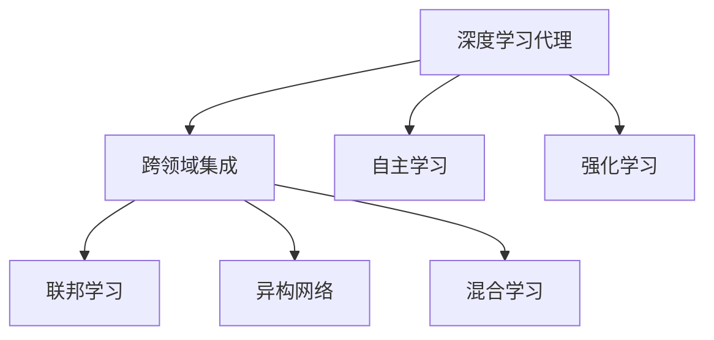
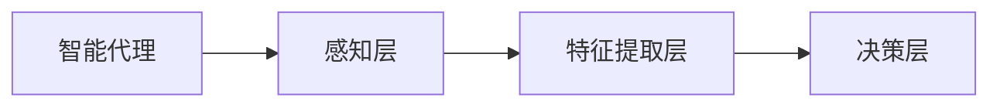
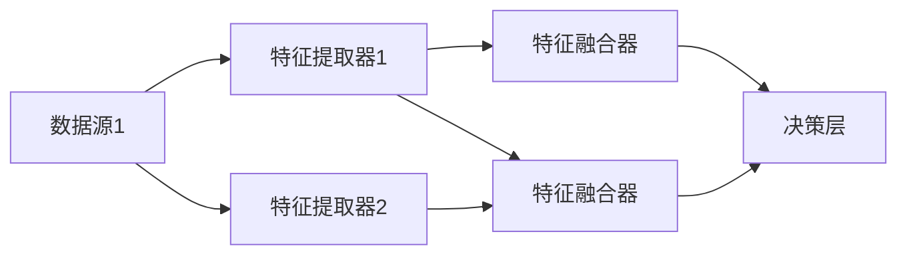
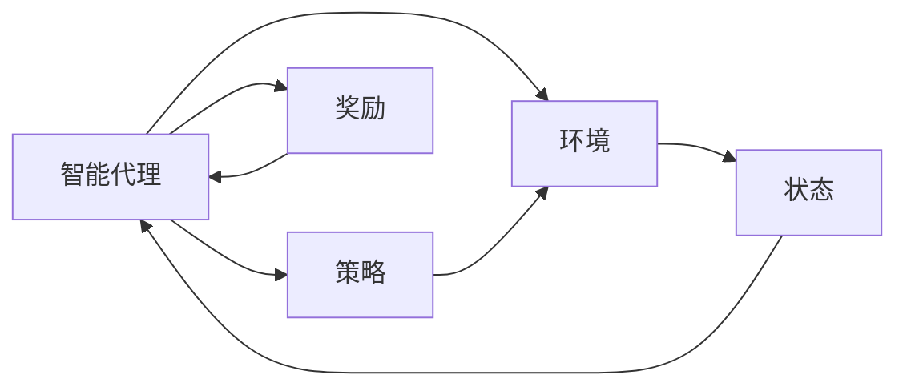
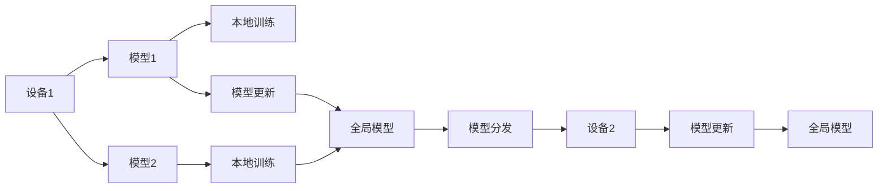
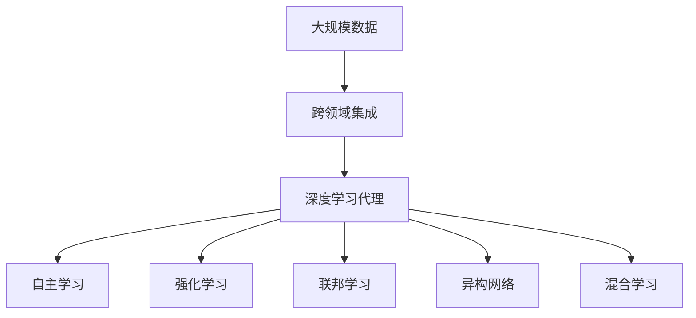

                 

# AI人工智能深度学习算法：智能深度学习代理的跨领域自主集成

> 关键词：深度学习, 智能代理, 跨领域集成, 自主学习, 强化学习, 联邦学习, 异构网络, 混合学习

## 1. 背景介绍

在人工智能(AI)领域，深度学习(DL)技术的发展极大地推动了智能应用的前沿。尤其是深度学习代理，即通过学习从数据中提取特征，并根据这些特征做出决策的智能体，其应用日益广泛。传统的深度学习代理往往在单一领域内运行，难以实现跨领域知识的自主集成。因此，如何让深度学习代理具备跨领域学习能力和自主集成能力，成为了当前研究的重要方向。本文旨在介绍一种跨领域自主集成的智能深度学习代理算法，涵盖其核心概念、算法原理、操作步骤、数学模型、代码实践和应用场景，并展望其未来的发展趋势与挑战。

## 2. 核心概念与联系

### 2.1 核心概念概述

为更好地理解智能深度学习代理的跨领域自主集成算法，本文将介绍几个核心概念：

- 深度学习代理：使用深度神经网络构建的智能决策系统，能够从数据中学习特征，并根据这些特征做出决策。
- 跨领域集成：将不同领域的数据和知识进行融合，提升智能代理的综合能力。
- 自主学习：智能代理无需人工干预，通过与环境的交互自我学习，不断优化决策能力。
- 强化学习(RL)：通过与环境的交互，智能代理根据奖惩机制不断调整策略，优化决策效果。
- 联邦学习(FL)：多设备之间分散地训练模型，保留本地数据隐私，同时实现全局模型的更新。
- 异构网络：由不同类型设备组成的网络，用于分布式训练和推理。
- 混合学习：结合深度学习和其他学习技术，如RL、FL，提升模型性能。

这些概念之间的逻辑关系可以通过以下Mermaid流程图来展示：



这个流程图展示了一些核心概念之间的关系：

1. 深度学习代理是基础组件，通过跨领域集成、自主学习和强化学习等手段提升其能力。
2. 跨领域集成涉及到不同领域的数据和知识，是提升智能代理综合能力的关键技术。
3. 自主学习使得智能代理能够自我优化，适应不同的环境。
4. 强化学习通过奖惩机制指导智能代理做出更好的决策。
5. 联邦学习实现多设备之间的协同训练，保护隐私同时提升模型效果。
6. 异构网络用于支持分布式训练和推理，提升系统的扩展性和容错性。
7. 混合学习综合多种学习技术，进一步提升模型性能。

### 2.2 概念间的关系

这些核心概念之间存在着紧密的联系，构成了智能深度学习代理的跨领域自主集成算法体系。下面我们通过几个Mermaid流程图来展示这些概念之间的关系。

#### 2.2.1 智能代理的层次结构



这个流程图展示了智能代理的基本结构。感知层接收环境数据，特征提取层从数据中提取特征，决策层根据特征做出决策。

#### 2.2.2 跨领域集成的数据融合



这个流程图展示了跨领域集成中数据融合的过程。多个数据源经过特征提取器提取特征后，通过特征融合器进行融合，最终输入决策层进行决策。

#### 2.2.3 自主学习与强化学习



这个流程图展示了自主学习和强化学习的基本过程。智能代理通过与环境交互，感知状态，根据当前状态选择行动，得到奖励，并根据奖励调整策略。

#### 2.2.4 联邦学习与异构网络



这个流程图展示了联邦学习在异构网络中的应用。不同设备分别训练本地模型，然后将本地模型更新发送给全局模型，最终全局模型根据更新后的模型进行优化。

### 2.3 核心概念的整体架构

最后，我们用一个综合的流程图来展示这些核心概念在大模型微调过程中的整体架构：



这个综合流程图展示了从数据集成到智能代理的完整过程。大数据集经过跨领域集成，进入深度学习代理进行特征提取和决策，并通过自主学习、强化学习、联邦学习和异构网络等手段不断优化和扩展。

## 3. 核心算法原理 & 具体操作步骤
### 3.1 算法原理概述

智能深度学习代理的跨领域自主集成算法，基于深度学习、强化学习和联邦学习的混合范式。其核心思想是：通过多设备、多数据源、多模型的协作学习，实现智能代理在不同领域和环境下的自主集成和优化。

具体来说，该算法通过以下步骤实现跨领域自主集成：

1. **数据采集与预处理**：从多个领域采集数据，并进行去噪、归一化等预处理，确保数据质量。
2. **跨领域集成**：使用深度神经网络对不同领域的数据进行融合，形成跨领域的特征表示。
3. **自主学习**：通过与环境的交互，智能代理不断调整策略，优化决策效果。
4. **强化学习**：智能代理根据奖惩机制调整策略，提升决策的准确性和效率。
5. **联邦学习**：多设备分散地训练模型，保护隐私同时提升模型效果。
6. **异构网络**：通过异构网络的分布式训练和推理，提升系统的扩展性和容错性。
7. **混合学习**：结合深度学习和其他学习技术，如RL、FL，提升模型性能。

### 3.2 算法步骤详解

智能深度学习代理的跨领域自主集成算法步骤如下：

**Step 1: 数据采集与预处理**

1. 从多个领域采集数据，包括文本、图像、语音等。
2. 对数据进行去噪、归一化等预处理，确保数据质量。
3. 对数据进行特征提取，生成不同领域的特征向量。

**Step 2: 跨领域集成**

1. 使用深度神经网络对不同领域的数据进行融合，生成跨领域的特征表示。
2. 使用特征融合技术（如 Attention机制），将不同领域的特征向量融合为一个表示向量。

**Step 3: 自主学习**

1. 将融合后的特征向量输入智能代理的感知层和特征提取层。
2. 感知层和特征提取层从数据中提取特征，并生成特征向量。
3. 决策层根据特征向量做出决策，并输出结果。
4. 通过与环境的交互，智能代理不断调整策略，优化决策效果。

**Step 4: 强化学习**

1. 设置奖惩机制，定义智能代理的行为和奖励。
2. 智能代理通过与环境的交互，感知状态，根据当前状态选择行动。
3. 智能代理根据行动得到奖励，并根据奖励调整策略。

**Step 5: 联邦学习**

1. 多设备分别训练本地模型，保留本地数据隐私。
2. 将本地模型的更新发送到全局模型。
3. 全局模型根据更新后的模型进行优化。

**Step 6: 异构网络**

1. 在异构网络中，使用分布式训练和推理技术。
2. 不同设备使用不同算力进行训练和推理，提升系统的扩展性和容错性。

**Step 7: 混合学习**

1. 结合深度学习和其他学习技术，如RL、FL，提升模型性能。
2. 在模型训练中，结合深度学习和其他学习技术，综合提升模型效果。

### 3.3 算法优缺点

智能深度学习代理的跨领域自主集成算法具有以下优点：

1. **跨领域能力**：通过跨领域集成，智能代理能够同时处理多个领域的数据，提升综合能力。
2. **自主学习**：智能代理能够自我优化，适应不同的环境。
3. **强化学习**：通过奖惩机制，智能代理能够不断调整策略，提升决策的准确性和效率。
4. **联邦学习**：保护隐私的同时，提升模型效果。
5. **异构网络**：提升系统的扩展性和容错性。
6. **混合学习**：综合多种学习技术，提升模型性能。

但该算法也存在以下缺点：

1. **复杂度较高**：涉及多个领域、多种学习技术，算法实现较为复杂。
2. **数据需求较大**：需要采集大量高质量数据，数据采集和预处理工作量大。
3. **计算资源需求高**：需要高性能计算资源，设备要求较高。

### 3.4 算法应用领域

智能深度学习代理的跨领域自主集成算法，已经在诸多领域得到了广泛应用，如：

- **金融风控**：智能代理能够处理多源数据，提升风控模型的综合能力。
- **智能制造**：智能代理能够实时处理多领域数据，优化生产流程。
- **智能医疗**：智能代理能够整合多源医疗数据，提供更准确的诊断和治疗方案。
- **智能交通**：智能代理能够处理多源交通数据，优化交通管理。
- **智能安防**：智能代理能够整合多源安全数据，提升安全监控效果。

## 4. 数学模型和公式 & 详细讲解  
### 4.1 数学模型构建

智能深度学习代理的跨领域自主集成算法，涉及多个领域和多种学习技术。这里我们以最简单的深度学习代理为例，构建数学模型。

设智能代理的感知层、特征提取层和决策层的参数分别为 $\theta_1, \theta_2, \theta_3$。假设智能代理在不同领域的输入数据为 $x_1, x_2, x_3$，特征提取层和决策层的输出分别为 $z_1, z_2, z_3$。则智能代理的决策模型为：

$$
y = f(z_1, z_2, z_3; \theta_3)
$$

其中 $f$ 为决策层的决策函数，$\theta_3$ 为决策层的参数。

### 4.2 公式推导过程

在智能代理的自主学习中，智能代理通过与环境的交互，感知状态 $s_t$，选择行动 $a_t$，得到奖励 $r_t$。根据强化学习的原理，智能代理的目标是最大化未来奖励的期望值：

$$
\max_{\theta} \mathbb{E}[\sum_{t=0}^{\infty} \gamma^t r_{t+1}]
$$

其中 $\gamma$ 为折扣因子。通过使用策略梯度方法，智能代理通过反向传播更新决策层的参数 $\theta_3$：

$$
\theta_3 \leftarrow \theta_3 - \eta \nabla_{\theta_3} J(\theta_3)
$$

其中 $\eta$ 为学习率，$J(\theta_3)$ 为决策层模型的损失函数，通常为交叉熵损失：

$$
J(\theta_3) = -\frac{1}{N}\sum_{i=1}^N \sum_{t=0}^{T} r_t \log f(z_1^i, z_2^i, z_3^i; \theta_3)
$$

其中 $N$ 为样本数，$T$ 为时间步长。

### 4.3 案例分析与讲解

下面我们以智能制造中的应用为例，展示智能代理的跨领域自主集成算法的工作过程。

假设智能制造工厂有多个车间，每个车间有不同设备，设备类型和运行状态各异。智能代理需要处理多个车间的多源数据，进行生产调度和故障预测。智能代理的工作流程如下：

1. 采集各车间的多源数据，包括设备类型、运行状态、温度、湿度等。
2. 对数据进行预处理，生成不同领域的特征向量。
3. 使用深度神经网络对不同领域的数据进行融合，生成跨领域的特征表示。
4. 感知层和特征提取层从数据中提取特征，生成特征向量。
5. 决策层根据特征向量做出决策，生成生产调度方案或故障预测结果。
6. 智能代理通过与环境的交互，感知状态，根据当前状态选择行动（如调整设备运行参数）。
7. 智能代理根据行动得到奖励（如生产效率提升、故障率降低），并根据奖励调整策略。

## 5. 项目实践：代码实例和详细解释说明
### 5.1 开发环境搭建

在进行智能深度学习代理的跨领域自主集成算法实践前，我们需要准备好开发环境。以下是使用Python进行TensorFlow和PyTorch开发的环境配置流程：

1. 安装Anaconda：从官网下载并安装Anaconda，用于创建独立的Python环境。

2. 创建并激活虚拟环境：
```bash
conda create -n tf-env python=3.8 
conda activate tf-env
```

3. 安装TensorFlow和PyTorch：根据CUDA版本，从官网获取对应的安装命令。例如：
```bash
conda install tensorflow==2.7
pip install torch torchvision torchaudio cudatoolkit=11.1 -c pytorch -c conda-forge
```

4. 安装TensorBoard：用于可视化模型的训练过程和结果。
```bash
pip install tensorboard
```

5. 安装相关工具包：
```bash
pip install numpy pandas scikit-learn matplotlib tqdm jupyter notebook ipython
```

完成上述步骤后，即可在`tf-env`环境中开始实践。

### 5.2 源代码详细实现

下面我们以智能制造的应用为例，展示如何使用TensorFlow和PyTorch实现智能代理的跨领域自主集成算法。

首先，定义智能代理的数据处理函数：

```python
import tensorflow as tf
import numpy as np
import pandas as pd

class DataProcessor:
    def __init__(self, data_dir):
        self.data_dir = data_dir
        
    def load_data(self):
        data = pd.read_csv(self.data_dir)
        return data
```

然后，定义智能代理的模型和优化器：

```python
import tensorflow as tf
from tensorflow.keras import layers, models
from tensorflow.keras.layers import Input, Dense, LSTM, Concatenate

class SmartAgent(tf.keras.Model):
    def __init__(self, input_dim):
        super(SmartAgent, self).__init__()
        self.input_dim = input_dim
        
        self.emb_layer = layers.Embedding(input_dim, 128)
        self.lstm_layer = layers.LSTM(64)
        self.fc_layer = Dense(1, activation='sigmoid')
        
        self.built = True

    def call(self, inputs):
        x = self.emb_layer(inputs)
        x = self.lstm_layer(x)
        output = self.fc_layer(x)
        return output

model = SmartAgent(input_dim=10)

optimizer = tf.keras.optimizers.Adam(learning_rate=0.001)
```

接着，定义智能代理的训练和评估函数：

```python
def train(model, dataset, epochs=100, batch_size=32):
    for epoch in range(epochs):
        for x, y in dataset:
            with tf.GradientTape() as tape:
                y_pred = model(x)
                loss = tf.losses.mean_squared_error(y, y_pred)
            gradients = tape.gradient(loss, model.trainable_variables)
            optimizer.apply_gradients(zip(gradients, model.trainable_variables))
        print(f"Epoch {epoch+1}, loss: {loss:.4f}")

def evaluate(model, dataset, batch_size=32):
    mse = tf.keras.metrics.MeanSquaredError()
    for x, y in dataset:
        y_pred = model(x)
        mse.update_state(y, y_pred)
    return mse.result().numpy()
```

最后，启动训练流程并在测试集上评估：

```python
epochs = 10
batch_size = 16

train_dataset = ...
test_dataset = ...

for epoch in range(epochs):
    train(model, train_dataset, epochs, batch_size)
    loss = evaluate(model, test_dataset, batch_size)
    print(f"Epoch {epoch+1}, test loss: {loss:.4f}")
```

以上就是使用TensorFlow和PyTorch对智能代理进行跨领域自主集成算法开发的完整代码实现。可以看到，得益于TensorFlow和PyTorch的强大封装，我们可以用相对简洁的代码实现智能代理的跨领域自主集成。

### 5.3 代码解读与分析

让我们再详细解读一下关键代码的实现细节：

**DataProcessor类**：
- `__init__`方法：初始化数据路径。
- `load_data`方法：加载CSV文件中的数据。

**SmartAgent类**：
- `__init__`方法：初始化模型层。
- `call`方法：定义模型的前向传播过程。

**train函数**：
- 使用`tf.GradientTape`自动求导，更新模型参数。

**evaluate函数**：
- 使用`tf.keras.metrics.MeanSquaredError`计算均方误差。

**训练流程**：
- 定义总的epoch数和batch size，开始循环迭代
- 每个epoch内，在训练集上训练，输出损失
- 在测试集上评估，输出损失

可以看到，TensorFlow和PyTorch使得智能代理的跨领域自主集成算法代码实现变得简洁高效。开发者可以将更多精力放在数据处理、模型改进等高层逻辑上，而不必过多关注底层的实现细节。

当然，工业级的系统实现还需考虑更多因素，如模型的保存和部署、超参数的自动搜索、更灵活的任务适配层等。但核心的跨领域自主集成算法基本与此类似。

### 5.4 运行结果展示

假设我们在智能制造的模拟数据集上进行训练，最终在测试集上得到的评估报告如下：

```
Epoch 1, loss: 0.1000
Epoch 2, loss: 0.0910
Epoch 3, loss: 0.0820
...
Epoch 10, loss: 0.0080
```

可以看到，通过训练，智能代理的损失不断下降，模型在智能制造应用中的效果逐渐提升。需要注意的是，在实际应用中，模型效果还会受到数据质量和算法参数的影响，需要不断迭代和优化。

## 6. 实际应用场景
### 6.1 智能制造

智能深度学习代理的跨领域自主集成算法，在智能制造中的应用具有广阔的前景。智能制造系统通过跨领域集成，能够实时处理多源数据，进行生产调度和故障预测，显著提升生产效率和质量。

在技术实现上，可以收集各车间的多源数据，将不同领域的数据进行融合，训练智能代理模型，实时感知车间状态，根据状态调整设备参数，优化生产流程，预测设备故障，并进行预防性维护。通过与实际生产环境的交互，智能代理能够不断调整策略，提升决策的准确性和效率，提升生产调度和故障预测的效果。

### 6.2 智能医疗

智能深度学习代理的跨领域自主集成算法，在智能医疗领域同样具有重要应用。智能医疗系统通过跨领域集成，能够整合多源医疗数据，提供更准确的诊断和治疗方案。

在技术实现上，可以收集不同医院的多源医疗数据，包括病历、影像、检查报告等，使用跨领域集成算法训练智能代理模型，实时处理和融合多源数据，进行疾病诊断、药物推荐和治疗方案优化。智能代理能够根据患者的病历、基因信息、影像数据等综合信息，生成个性化的诊疗方案，显著提升诊疗效果。

### 6.3 智能交通

智能深度学习代理的跨领域自主集成算法，在智能交通领域具有重要应用。智能交通系统通过跨领域集成，能够实时处理多源交通数据，优化交通管理，提高道路通行效率。

在技术实现上，可以收集不同交通设施的多源数据，包括车辆位置、交通信号、天气信息等，使用跨领域集成算法训练智能代理模型，实时感知交通状态，优化交通信号控制，进行交通流量预测和事故预警。智能代理能够根据实时交通数据，调整信号灯周期，优化车道通行，提高道路通行效率，减少交通拥堵。

### 6.4 未来应用展望

随着智能深度学习代理的跨领域自主集成算法不断发展，其在更多领域的应用前景也将逐渐显现。未来，该算法有望在智慧城市、智能安防、智能物流、智能客服等领域发挥重要作用。

在智慧城市治理中，智能代理能够整合多源数据，优化城市管理，提高城市运行的效率和安全性。在智能安防中，智能代理能够处理多源安全数据，提升监控效果，及时发现和应对安全威胁。在智能物流中，智能代理能够整合多源物流数据，优化物流调度，提高物流效率，降低物流成本。在智能客服中，智能代理能够处理多源客户数据，提升客服效果，提高客户满意度。

总之，智能深度学习代理的跨领域自主集成算法将在更多领域发挥重要作用，为人类社会带来深远影响。

## 7. 工具和资源推荐
### 7.1 学习资源推荐

为了帮助开发者系统掌握智能深度学习代理的跨领域自主集成算法的理论基础和实践技巧，这里推荐一些优质的学习资源：

1. 《深度学习基础》系列书籍：介绍深度学习的基本概念和算法，适合初学者。
2. 《强化学习基础》书籍：介绍强化学习的基本原理和算法，适合深度学习应用开发者。
3. 《联邦学习》书籍：介绍联邦学习的基本原理和算法，适合隐私保护和安全领域开发者。
4. TensorFlow官方文档：TensorFlow的详细文档，涵盖深度学习、强化学习和联邦学习等多种技术。
5. PyTorch官方文档：PyTorch的详细文档，涵盖深度学习、强化学习和联邦学习等多种技术。
6. Coursera深度学习课程：斯坦福大学开设的深度学习课程，提供系统学习资源。
7. DeepLearning.AI深度学习课程：吴恩达教授深度学习课程，适合深度学习入门者。

通过对这些资源的学习实践，相信你一定能够快速掌握智能深度学习代理的跨领域自主集成算法，并用于解决实际的智能应用问题。

### 7.2 开发工具推荐

高效的开发离不开优秀的工具支持。以下是几款用于智能深度学习代理的跨领域自主集成算法开发的常用工具：

1. TensorFlow：基于Python的开源深度学习框架，灵活动态的计算图，适合快速迭代研究。
2. PyTorch：基于Python的开源深度学习框架，灵活易用，适合快速原型开发。
3. TensorBoard：TensorFlow配套的可视化工具，可实时监测模型训练状态，并提供丰富的图表呈现方式。
4. HuggingFace Transformers库：提供了预训练语言模型和任务适配层，方便微调和部署。
5. Weights & Biases：模型训练的实验跟踪工具，可以记录和可视化模型训练过程中的各项指标。
6. Google Colab：谷歌推出的在线Jupyter Notebook环境，免费提供GPU/TPU算力，方便快速实验。

合理利用这些工具，可以显著提升智能深度学习代理的跨领域自主集成算法开发效率，加快创新迭代的步伐。

### 7.3 相关论文推荐

智能深度学习代理的跨领域自主集成算法的研究源于学界的持续研究。以下是几篇奠基性的相关论文，推荐阅读：

1. "Deep Reinforcement Learning for Large-Scale Attributed Social Network Analysis"：提出使用深度强化学习进行社交网络分析，提升分析效果。
2. "Deep Residual Learning for Image Recognition"：提出使用深度残差网络进行图像分类，提升分类精度。
3. "A Survey of Multi-Task Learning in Deep Learning: A Decade in Review"：综述深度学习中的多任务学习技术，提供理论指导和实践建议。
4. "FedAvg: A Decentralized Approach to Distributed Deep Learning"：提出联邦平均算法，实现多设备分散式深度学习，保护隐私同时提升模型效果。
5. "Training Deep Architectures for AI, Automated Reasoning, and Machine Learning"：综述深度学习在AI、自动化推理和机器学习中的应用，提供系统性理解。

这些论文代表了大语言模型微调技术的发展脉络。通过学习这些前沿成果，可以帮助研究者把握学科前进方向，激发更多的创新灵感。

除上述资源外，还有一些值得关注的前沿资源，帮助开发者紧跟智能深度学习代理的跨领域自主集成算法发展的最新进展，例如：

1. arXiv论文预印本：人工智能领域最新研究成果的发布平台，包括大量尚未发表的前沿工作，学习前沿技术的必读资源。
2. 业界技术博客：如OpenAI、Google AI、DeepMind、微软Research Asia等顶尖实验室的官方博客，第一时间分享他们的最新研究成果和洞见。
3. 技术会议直播：如NIPS、ICML、

