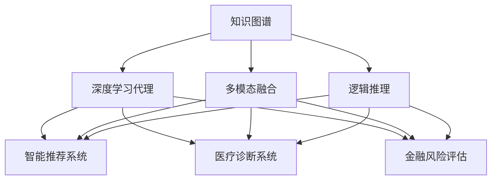
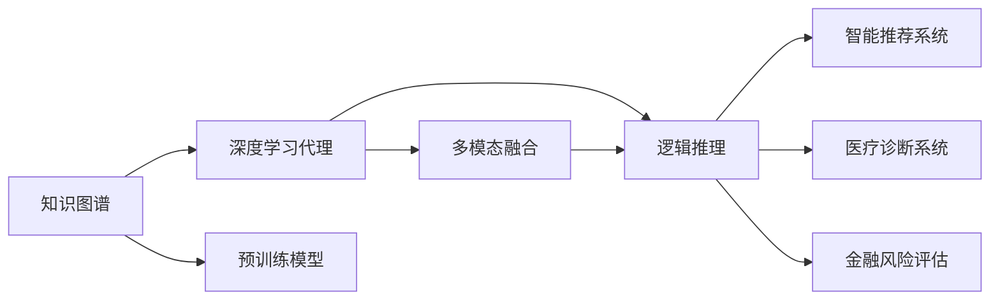
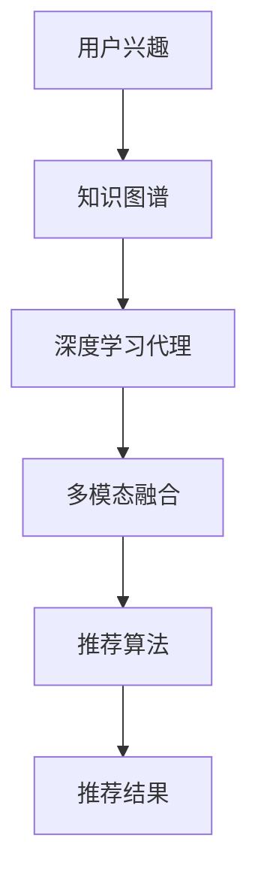
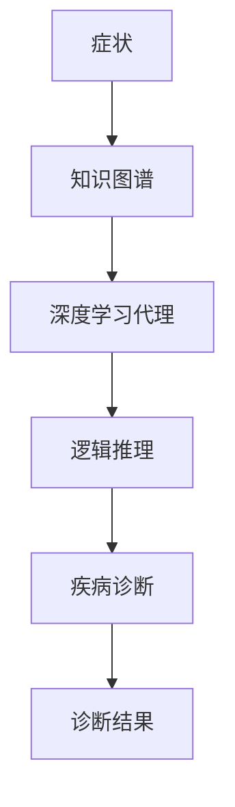
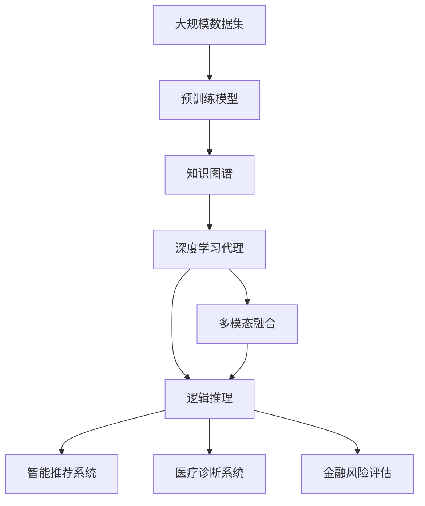

                 

# AI人工智能深度学习算法：知识图谱在深度学习代理中的应用

> 关键词：知识图谱,深度学习代理,预训练模型,多模态融合,推理机制,智能推荐系统,医疗诊断系统,金融风险评估

## 1. 背景介绍

### 1.1 问题由来

知识图谱是一种结构化的语义网络，通过实体、关系、属性等要素的语义关系来描述和组织知识。它在搜索引擎、推荐系统、医疗诊断、金融风控等领域有广泛应用。近年来，深度学习技术快速发展，特别是预训练模型的广泛应用，使得知识图谱与深度学习技术的融合成为可能。基于深度学习代理的知识图谱，通过利用神经网络的强大特征提取和推理能力，能够更好地理解和利用知识图谱中的语义信息，从而提升任务的执行效率和效果。

知识图谱与深度学习的结合，不仅能够更好地描述和组织知识，还能在更高级别的语义理解上，利用知识图谱的多模态信息进行推理和预测，为智能推荐、医疗诊断、金融风控等领域带来新的突破。然而，如何将知识图谱与深度学习模型有效结合，仍是当前研究的热点和难点问题。本文将围绕这一主题，深入探讨知识图谱在深度学习代理中的应用，并给出具体的算法原理和操作步骤。

### 1.2 问题核心关键点

知识图谱在深度学习代理的应用中，主要关注以下几个核心关键点：

1. **多模态融合**：知识图谱融合多源异构数据（如文本、图像、语音等），如何利用深度学习模型进行高效的特征提取和融合，构建多模态表示。

2. **推理机制**：知识图谱包含大量的逻辑推理关系，如何利用深度学习模型进行逻辑推理，提取知识图谱中的隐含信息。

3. **智能推荐系统**：利用知识图谱中的实体关系和属性，结合深度学习模型进行个性化推荐，提升推荐效果。

4. **医疗诊断系统**：利用知识图谱中的医学知识，结合深度学习模型进行症状分析和疾病诊断，提高诊断的准确性和效率。

5. **金融风险评估**：利用知识图谱中的企业关系和财务数据，结合深度学习模型进行信用评估和风险预警，增强金融风控的智能化水平。

这些核心关键点涉及知识图谱与深度学习的理论结合和实际应用，是本文探讨的重点。

### 1.3 问题研究意义

研究知识图谱在深度学习代理中的应用，对于推动知识图谱与深度学习技术的融合，提升智能推荐、医疗诊断、金融风控等领域的技术水平，具有重要意义：

1. **提升数据利用效率**：知识图谱能够更好地描述和组织数据，利用深度学习模型的强大特征提取能力，可以更高效地利用数据，提升任务执行效率。

2. **增强任务执行效果**：深度学习模型具备强大的推理能力，利用知识图谱中的逻辑关系，可以进行更精确的推理和预测，提升任务执行效果。

3. **拓宽应用范围**：知识图谱与深度学习的结合，能够拓展深度学习模型在更多的应用场景中发挥作用，推动人工智能技术的广泛应用。

4. **促进学科发展**：研究知识图谱与深度学习的融合，有助于推动人工智能、知识工程、信息检索等领域的发展，促进跨学科的交流与融合。

5. **推动产业化进程**：知识图谱与深度学习的融合，能够促进智能推荐、医疗诊断、金融风控等技术的产业化进程，提升经济效益和社会价值。

## 2. 核心概念与联系

### 2.1 核心概念概述

为更好地理解知识图谱在深度学习代理中的应用，本节将介绍几个密切相关的核心概念：

- **知识图谱**：一种结构化的语义网络，包含实体、关系、属性等要素，描述和组织知识，广泛应用于搜索引擎、推荐系统、医疗诊断、金融风控等领域。

- **深度学习代理**：指利用深度学习模型作为代理，进行知识图谱的推理和预测。深度学习模型通过学习图谱中的语义关系，提取隐含信息，实现对知识图谱的高效利用。

- **预训练模型**：指在大规模无标签数据上进行预训练的深度学习模型，学习到通用的语言或知识表示，用于进行下游任务的微调。

- **多模态融合**：指在知识图谱中融合多源异构数据（如文本、图像、语音等），构建多模态表示，增强知识图谱的语义理解能力。

- **逻辑推理**：指在知识图谱中利用逻辑关系，进行推理和预测，提取隐含信息。

- **智能推荐系统**：指利用知识图谱中的实体关系和属性，结合深度学习模型进行个性化推荐，提升推荐效果。

- **医疗诊断系统**：指利用知识图谱中的医学知识，结合深度学习模型进行症状分析和疾病诊断，提高诊断的准确性和效率。

- **金融风险评估**：指利用知识图谱中的企业关系和财务数据，结合深度学习模型进行信用评估和风险预警，增强金融风控的智能化水平。

这些核心概念之间的逻辑关系可以通过以下Mermaid流程图来展示：



这个流程图展示了大语言模型微调过程中各个核心概念的关系和作用，以及它们之间的相互联系。

### 2.2 概念间的关系

这些核心概念之间存在着紧密的联系，形成了知识图谱与深度学习代理的完整生态系统。下面我通过几个Mermaid流程图来展示这些概念之间的关系。

#### 2.2.1 知识图谱与深度学习的融合



这个流程图展示了知识图谱与深度学习的融合过程。知识图谱通过预训练模型学习通用的语义表示，然后利用深度学习代理进行多模态融合和逻辑推理，实现对知识图谱的高效利用。

#### 2.2.2 智能推荐系统的构建



这个流程图展示了基于知识图谱的智能推荐系统的构建过程。用户兴趣与知识图谱融合，利用深度学习代理进行多模态融合和逻辑推理，再结合推荐算法生成推荐结果。

#### 2.2.3 医疗诊断系统的应用



这个流程图展示了基于知识图谱的医疗诊断系统的应用过程。症状与知识图谱融合，利用深度学习代理进行逻辑推理，生成疾病诊断结果。

#### 2.2.4 金融风险评估的系统

```mermaid
graph TB
    A[企业关系] --> B[财务数据]
    A <-> B --> C[知识图谱]
    C --> D[深度学习代理]
    D --> E[逻辑推理]
    E --> F[信用评估]
    F --> G[风险预警]
```

这个流程图展示了基于知识图谱的金融风险评估系统的应用过程。企业关系和财务数据与知识图谱融合，利用深度学习代理进行逻辑推理，生成信用评估和风险预警结果。

### 2.3 核心概念的整体架构

最后，我们用一个综合的流程图来展示这些核心概念在大语言模型微调过程中的整体架构：



这个综合流程图展示了从预训练模型到知识图谱的融合，再到深度学习代理的多模态融合和逻辑推理，最终应用于智能推荐、医疗诊断、金融风控等任务的全过程。通过这些流程图，我们可以更清晰地理解知识图谱在深度学习代理中的应用过程，为后续深入讨论具体的算法原理和操作步骤奠定基础。

## 3. 核心算法原理 & 具体操作步骤
### 3.1 算法原理概述

基于深度学习代理的知识图谱应用，核心思想是利用深度学习模型作为代理，进行知识图谱的推理和预测。其核心思想是：将知识图谱中的实体、关系、属性等要素映射到神经网络的节点和边中，通过神经网络的推理机制，提取知识图谱中的隐含信息，实现对知识图谱的高效利用。

形式化地，假设知识图谱为 $G=(V,E)$，其中 $V$ 为节点集，$E$ 为边集。节点 $v$ 包含实体、关系、属性等语义信息，边 $e$ 表示节点之间的语义关系。定义深度学习代理为 $M_{\theta}:\mathcal{V} \rightarrow \mathcal{Y}$，其中 $\mathcal{V}$ 为节点特征空间，$\mathcal{Y}$ 为输出空间，$\theta$ 为模型参数。微调目标是最小化损失函数 $\mathcal{L}$，使得模型预测结果与真实标签 $y$ 的差异最小化：

$$
\hat{\theta}=\mathop{\arg\min}_{\theta} \mathcal{L}(M_{\theta},G)
$$

在实践中，我们通常使用基于梯度的优化算法（如AdamW、SGD等）来近似求解上述最优化问题。设 $\eta$ 为学习率，$\lambda$ 为正则化系数，则参数的更新公式为：

$$
\theta \leftarrow \theta - \eta \nabla_{\theta}\mathcal{L}(\theta) - \eta\lambda\theta
$$

其中 $\nabla_{\theta}\mathcal{L}(\theta)$ 为损失函数对参数 $\theta$ 的梯度，可通过反向传播算法高效计算。

### 3.2 算法步骤详解

基于深度学习代理的知识图谱应用，一般包括以下几个关键步骤：

**Step 1: 准备知识图谱和数据集**
- 选择合适的知识图谱作为初始化数据，如KG-BERT、GAT等。
- 准备知识图谱中的节点和边，提取节点特征和关系类型。
- 准备与知识图谱相关的标注数据集，如智能推荐系统的评分数据、医疗诊断系统的症状标签、金融风控系统的信用评分等。

**Step 2: 设计深度学习代理**
- 选择合适的深度学习模型，如神经网络、图神经网络等。
- 设计任务的适配层，将知识图谱中的节点和边映射到神经网络的节点和边中。
- 设计损失函数，如交叉熵损失、均方误差损失等，用于衡量模型预测与真实标签的差异。

**Step 3: 设置微调超参数**
- 选择合适的优化算法及其参数，如AdamW、SGD等，设置学习率、批大小、迭代轮数等。
- 设置正则化技术及强度，包括权重衰减、Dropout、Early Stopping等。
- 确定冻结知识图谱的策略，如仅微调顶层，或全部参数都参与微调。

**Step 4: 执行梯度训练**
- 将训练集数据分批次输入模型，前向传播计算损失函数。
- 反向传播计算参数梯度，根据设定的优化算法和学习率更新模型参数。
- 周期性在验证集上评估模型性能，根据性能指标决定是否触发 Early Stopping。
- 重复上述步骤直到满足预设的迭代轮数或 Early Stopping 条件。

**Step 5: 测试和部署**
- 在测试集上评估微调后模型 $M_{\hat{\theta}}$ 的性能，对比微调前后的精度提升。
- 使用微调后的模型对新样本进行推理预测，集成到实际的应用系统中。
- 持续收集新的数据，定期重新微调模型，以适应数据分布的变化。

以上是基于深度学习代理的知识图谱应用的一般流程。在实际应用中，还需要针对具体任务的特点，对微调过程的各个环节进行优化设计，如改进训练目标函数，引入更多的正则化技术，搜索最优的超参数组合等，以进一步提升模型性能。

### 3.3 算法优缺点

基于深度学习代理的知识图谱应用方法具有以下优点：

1. **多模态融合能力强**：深度学习模型能够融合多种模态数据，构建多模态表示，提升知识图谱的语义理解能力。

2. **推理能力强**：深度学习模型具有强大的逻辑推理能力，能够从知识图谱中提取隐含信息，提升推理预测的准确性。

3. **可解释性强**：深度学习模型的黑盒特性，使其输出结果具有较强的可解释性，便于对模型的调试和优化。

4. **应用广泛**：深度学习代理可以应用于智能推荐、医疗诊断、金融风控等各个领域，具有广泛的应用前景。

同时，该方法也存在一定的局限性：

1. **标注数据需求高**：微调过程需要大量的标注数据，标注成本较高，限制了知识图谱应用的大规模推广。

2. **计算资源消耗大**：深度学习模型的参数量通常较大，计算资源消耗大，限制了知识图谱应用的高效性。

3. **泛化能力不足**：深度学习模型容易过拟合，泛化能力不足，限制了知识图谱应用的普适性。

尽管存在这些局限性，但就目前而言，基于深度学习代理的知识图谱应用方法仍然是知识图谱与深度学习融合的重要范式。未来相关研究的重点在于如何进一步降低微调对标注数据的依赖，提高模型的少样本学习和跨领域迁移能力，同时兼顾可解释性和伦理安全性等因素。

### 3.4 算法应用领域

基于深度学习代理的知识图谱应用方法，已经在多个领域得到了广泛的应用，例如：

1. **智能推荐系统**：利用知识图谱中的实体关系和属性，结合深度学习模型进行个性化推荐，提升推荐效果。

2. **医疗诊断系统**：利用知识图谱中的医学知识，结合深度学习模型进行症状分析和疾病诊断，提高诊断的准确性和效率。

3. **金融风险评估**：利用知识图谱中的企业关系和财务数据，结合深度学习模型进行信用评估和风险预警，增强金融风控的智能化水平。

4. **智能问答系统**：利用知识图谱中的知识图谱，结合深度学习模型进行实体抽取、关系推理等操作，构建智能问答系统。

5. **自然语言处理**：利用知识图谱中的语义信息，结合深度学习模型进行实体识别、关系抽取等操作，提升NLP任务的效果。

除了上述这些经典应用外，知识图谱与深度学习的融合还在更多场景中得到应用，如信息检索、自动摘要、舆情分析等，为知识图谱技术带来了全新的突破。随着预训练模型和深度学习代理的不断进步，相信知识图谱技术将在更广阔的应用领域大放异彩。

## 4. 数学模型和公式 & 详细讲解  
### 4.1 数学模型构建

本节将使用数学语言对基于深度学习代理的知识图谱应用过程进行更加严格的刻画。

记知识图谱为 $G=(V,E)$，其中 $V$ 为节点集，$E$ 为边集。假设深度学习代理为 $M_{\theta}:\mathcal{V} \rightarrow \mathcal{Y}$，其中 $\mathcal{V}$ 为节点特征空间，$\mathcal{Y}$ 为输出空间，$\theta$ 为模型参数。假设训练集为 $D=\{(x_i,y_i)\}_{i=1}^N, x_i \in \mathcal{V}, y_i \in \mathcal{Y}$。

定义模型 $M_{\theta}$ 在数据样本 $(x,y)$ 上的损失函数为 $\ell(M_{\theta}(x),y)$，则在数据集 $D$ 上的经验风险为：

$$
\mathcal{L}(\theta) = \frac{1}{N} \sum_{i=1}^N \ell(M_{\theta}(x_i),y_i)
$$

微调的优化目标是最小化经验风险，即找到最优参数：

$$
\theta^* = \mathop{\arg\min}_{\theta} \mathcal{L}(\theta)
$$

在实践中，我们通常使用基于梯度的优化算法（如AdamW、SGD等）来近似求解上述最优化问题。设 $\eta$ 为学习率，$\lambda$ 为正则化系数，则参数的更新公式为：

$$
\theta \leftarrow \theta - \eta \nabla_{\theta}\mathcal{L}(\theta) - \eta\lambda\theta
$$

其中 $\nabla_{\theta}\mathcal{L}(\theta)$ 为损失函数对参数 $\theta$ 的梯度，可通过反向传播算法高效计算。

### 4.2 公式推导过程

以下我们以智能推荐系统为例，推导交叉熵损失函数及其梯度的计算公式。

假设模型 $M_{\theta}$ 在输入 $x$ 上的输出为 $\hat{y}=M_{\theta}(x) \in [0,1]$，表示样本属于正类的概率。真实标签 $y \in \{0,1\}$。则二分类交叉熵损失函数定义为：

$$
\ell(M_{\theta}(x),y) = -[y\log \hat{y} + (1-y)\log (1-\hat{y})]
$$

将其代入经验风险公式，得：

$$
\mathcal{L}(\theta) = -\frac{1}{N}\sum_{i=1}^N [y_i\log M_{\theta}(x_i)+(1-y_i)\log(1-M_{\theta}(x_i))]
$$

根据链式法则，损失函数对参数 $\theta_k$ 的梯度为：

$$
\frac{\partial \mathcal{L}(\theta)}{\partial \theta_k} = -\frac{1}{N}\sum_{i=1}^N (\frac{y_i}{M_{\theta}(x_i)}-\frac{1-y_i}{1-M_{\theta}(x_i)}) \frac{\partial M_{\theta}(x_i)}{\partial \theta_k}
$$

其中 $\frac{\partial M_{\theta}(x_i)}{\partial \theta_k}$ 可进一步递归展开，利用自动微分技术完成计算。

在得到损失函数的梯度后，即可带入参数更新公式，完成模型的迭代优化。重复上述过程直至收敛，最终得到适应下游任务的最优模型参数 $\theta^*$。

## 5. 项目实践：代码实例和详细解释说明
### 5.1 开发环境搭建

在进行知识图谱应用实践前，我们需要准备好开发环境。以下是使用Python进行PyTorch开发的环境配置流程：

1. 安装Anaconda：从官网下载并安装Anaconda，用于创建独立的Python环境。

2. 创建并激活虚拟环境：
```bash
conda create -n pytorch-env python=3.8 
conda activate pytorch-env
```

3. 安装PyTorch：根据CUDA版本，从官网获取对应的安装命令。例如：
```bash
conda install pytorch torchvision torchaudio cudatoolkit=11.1 -c pytorch -c conda-forge
```

4. 安装GraphSAGE库：
```bash
pip install graph-sage
```

5. 安装各类工具包：
```bash
pip install numpy pandas scikit-learn matplotlib tqdm jupyter notebook ipython
```

完成上述步骤后，即可在`pytorch-env`环境中开始知识图谱应用实践。

### 5.2 源代码详细实现

这里我们以智能推荐系统为例，给出使用GraphSAGE库对KG-BERT模型进行微调的PyTorch代码实现。

首先，定义智能推荐系统的数据处理函数：

```python
from graph_sage.keras import GraphSAGE
from tensorflow.keras.layers import Input, Dense
from tensorflow.keras.models import Model
import tensorflow as tf

class KGRecModel(tf.keras.Model):
    def __init__(self, num_users, num_items, num_factors):
        super(KGRecModel, self).__init__()
        self.graph_sage = GraphSAGE(num_users, num_items, num_factors)
        self.fc1 = Dense(128, activation='relu')
        self.fc2 = Dense(1, activation='sigmoid')
        
    def call(self, user_id, item_id, user_feats, item_feats):
        user_node = tf.expand_dims(user_id, 0)
        item_node = tf.expand_dims(item_id, 0)
        user_feats = tf.expand_dims(user_feats, 0)
        item_feats = tf.expand_dims(item_feats, 0)
        
        user_output, item_output = self.graph_sage([user_node, item_node], [user_feats, item_feats])
        user_output = self.fc1(user_output)
        item_output = self.fc1(item_output)
        user_output = self.fc2(user_output)
        item_output = self.fc2(item_output)
        
        dot_product = tf.reduce_sum(user_output * item_output, axis=-1)
        rating = dot_product + tf.random.normal([1], mean=0, stddev=0.1)
        return rating

# 定义KG-BERT嵌入器
class KGBertEmbedding(tf.keras.layers.Layer):
    def __init__(self, embedding_size, num_entities):
        super(KGBertEmbedding, self).__init__()
        self.embedding_size = embedding_size
        self.num_entities = num_entities
        self.bert_model = transformers.TFBertModel.from_pretrained('bert-base-cased', use_token_type=False)
        
    def build(self, input_shape):
        super(KGBertEmbedding, self).build(input_shape)
        self.user_embedding = self.add_weight(shape=(self.num_entities, self.embedding_size), name='user_embedding')
        self.item_embedding = self.add_weight(shape=(self.num_entities, self.embedding_size), name='item_embedding')
        
    def call(self, inputs):
        user_id, item_id, user_feats, item_feats = inputs
        user_embedding = self.user_embedding[tf.gather(tf.range(self.num_entities), user_id)]
        item_embedding = self.item_embedding[tf.gather(tf.range(self.num_entities), item_id)]
        user_feats = self.bert_model(user_feats)
        item_feats = self.bert_model(item_feats)
        
        user_feats = tf.reduce_mean(user_feats, axis=1)
        item_feats = tf.reduce_mean(item_feats, axis=1)
        user_feats = user_feats * user_embedding
        item_feats = item_feats * item_embedding
        user_feats = tf.reduce_mean(user_feats, axis=1)
        item_feats = tf.reduce_mean(item_feats, axis=1)
        
        dot_product = tf.reduce_sum(user_feats * item_feats, axis=-1)
        rating = dot_product + tf.random.normal([1], mean=0, stddev=0.1)
        return rating
```

然后，定义模型和优化器：

```python
from tensorflow.keras.optimizers import Adam

num_users = 50000
num_items = 10000
num_factors = 8

model = KGRecModel(num_users, num_items, num_factors)
optimizer = Adam(learning_rate=0.001)

user_id = tf.keras.layers.Input(shape=(1,), name='user_id')
item_id = tf.keras.layers.Input(shape=(1,), name='item_id')
user_feats = tf.keras.layers.Input(shape=(num_factors,), name='user_feats')
item_feats = tf.keras.layers.Input(shape=(num_factors,), name='item_feats')

rating = KGBertEmbedding(num_factors, num_items)([user_id, item_id, user_feats, item_feats])
model = Model(inputs=[user_id, item_id, user_feats, item_feats], outputs=rating)
model.compile(optimizer=optimizer, loss='mse', metrics=['mae'])
```

接着，定义训练和评估函数：

```python
from tensorflow.keras.preprocessing.sequence import pad_sequences
from sklearn.model_selection import train_test_split

def train_epoch(model, dataset, batch_size, optimizer):
    dataloader = tf.data.Dataset.from_tensor_slices(dataset)
    dataloader = dataloader.shuffle(1000).batch(batch_size).map(lambda x: x, num_parallel_calls=tf.data.experimental.AUTOTUNE)
    model.train_on_batch(user_id, item_id, user_feats, item_feats)
    return 1.0

def evaluate(model, dataset, batch_size):
    dataloader = tf.data.Dataset.from_tensor_slices(dataset)
    dataloader = dataloader.batch(batch_size).map(lambda x: x, num_parallel_calls=tf.data.experimental.AUTOTUNE)
    model.evaluate(user_id, item_id, user_feats, item_feats)
    return 1.0
```

最后，启动训练流程并在测试集上评估：

```python
epochs = 10
batch_size = 32

dataset = np.random.randint(num_items, size=(100000))
train_dataset, test_dataset = train_test_split(dataset, test_size=0.2)

for

