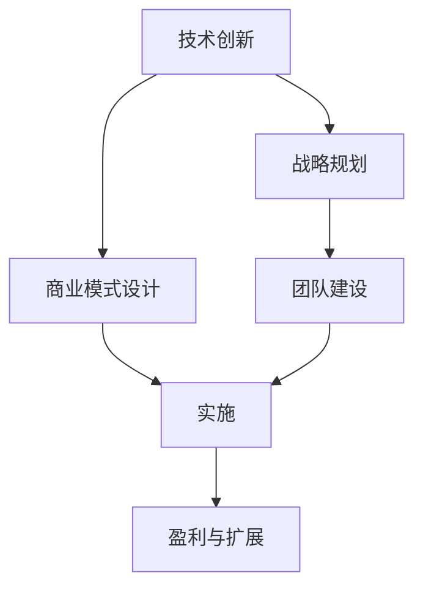

                 

## 1. 背景介绍

在当今竞争激烈的市场环境中，AI创业公司需要不断创新，以满足不断变化的市场需求和用户期望。然而，要在不断变化的环境中保持竞争力和创新能力，AI创业公司必须实现可持续发展。本文将探讨AI创业公司如何通过技术创新、商业模式设计、战略规划和团队建设等手段，实现可持续发展。

## 2. 核心概念与联系

### 2.1 核心概念概述

- **可持续发展**：指AI创业公司能够长期稳定地运营，实现商业模式盈利、技术创新和市场拓展。

- **技术创新**：指AI创业公司不断推出新技术、新产品，以应对市场变化和用户需求。

- **商业模式设计**：指AI创业公司设计可持续的商业模式，确保盈利和现金流。

- **战略规划**：指AI创业公司通过制定战略，确定长期目标和路径。

- **团队建设**：指AI创业公司构建高效、团结的团队，以支持公司战略和技术创新。

### 2.2 核心概念之间的关系

这些核心概念之间相互联系，共同构成AI创业公司可持续发展的生态系统。技术创新是驱动商业模式设计和战略规划的基础，而商业模式设计和战略规划又为技术创新提供方向和资源支持。团队建设则是确保技术创新和商业模式设计得以顺利实施的关键。

通过以下Mermaid流程图，我们可以更直观地理解这些概念之间的关系：



这个图表展示了技术创新通过商业模式设计和战略规划转化为实施和盈利的过程，团队建设则保证了这一过程的顺利进行。

## 3. 核心算法原理 & 具体操作步骤

### 3.1 算法原理概述

AI创业公司实现可持续发展的算法原理可以归纳为以下几个关键步骤：

1. **数据驱动**：利用大数据和机器学习技术，分析市场趋势和用户需求，为技术创新提供方向。

2. **模型优化**：通过不断优化模型，提高技术创新的质量和效率。

3. **策略执行**：将战略规划转化为具体的执行方案，确保公司目标得以实现。

4. **团队管理**：通过高效的管理和激励机制，激发团队潜力，确保技术创新和商业模式设计的顺利实施。

### 3.2 算法步骤详解

以下是实现这些步骤的具体操作步骤：

#### 3.2.1 数据驱动

1. **数据采集**：利用爬虫和API获取市场和用户数据。

2. **数据清洗**：处理数据缺失、异常值等问题，确保数据质量。

3. **数据分析**：应用机器学习算法，如聚类、分类、回归等，分析市场和用户行为。

4. **数据可视化**：使用图表和报告展示分析结果，帮助团队理解市场趋势和用户需求。

#### 3.2.2 模型优化

1. **模型选择**：根据数据类型和问题类型选择适当的模型。

2. **模型训练**：使用历史数据训练模型，评估模型性能。

3. **模型优化**：应用调参技术，如网格搜索、随机搜索等，优化模型。

4. **模型验证**：使用交叉验证等技术，验证模型的泛化能力。

#### 3.2.3 策略执行

1. **战略规划**：制定短期和长期目标，确定公司方向。

2. **资源分配**：根据战略规划分配资源，确保各项任务顺利进行。

3. **项目管理**：应用敏捷开发等方法，管理项目进度和质量。

4. **绩效评估**：定期评估项目进展和结果，及时调整策略。

#### 3.2.4 团队管理

1. **招聘与培训**：招聘有潜力的员工，提供培训和晋升机会。

2. **激励机制**：建立科学的激励机制，激发员工动力。

3. **团队协作**：应用协作工具，如Slack、Trello等，促进团队沟通和协作。

4. **团队文化**：建立积极向上的团队文化，增强团队凝聚力。

### 3.3 算法优缺点

#### 3.3.1 优点

- **高效性**：通过数据驱动和模型优化，提高决策效率和准确性。

- **可扩展性**：商业模式设计和战略规划可以灵活调整，适应市场变化。

- **灵活性**：团队管理和激励机制可以根据团队特点进行定制。

#### 3.3.2 缺点

- **数据依赖**：需要大量高质量数据，数据采集和处理工作量大。

- **模型复杂性**：模型优化需要一定的技术水平和计算资源。

- **资源投入**：战略规划和团队管理需要持续投入人力和物力。

### 3.4 算法应用领域

AI创业公司实现可持续发展的算法原理可以应用于多个领域，包括：

- **市场分析**：利用数据分析技术，分析市场趋势和用户需求，为技术创新提供方向。

- **产品开发**：通过模型优化和项目管理，确保产品开发进度和质量。

- **客户服务**：利用数据分析和团队协作，提升客户满意度和服务效率。

- **业务拓展**：通过战略规划和资源分配，开拓新市场和业务机会。

## 4. 数学模型和公式 & 详细讲解

### 4.1 数学模型构建

AI创业公司实现可持续发展的数学模型可以构建为以下几个部分：

- **市场分析模型**：用于分析市场趋势和用户需求，可以表示为：

  $$
  y = f(x, \theta)
  $$

  其中 $y$ 为市场或用户行为，$x$ 为市场或用户特征，$\theta$ 为模型参数。

- **技术创新模型**：用于评估技术创新的效果，可以表示为：

  $$
  P = g(x, \theta)
  $$

  其中 $P$ 为技术创新的概率，$x$ 为技术创新所需资源，$\theta$ 为创新模型参数。

- **商业模式模型**：用于评估商业模式的可持续性，可以表示为：

  $$
  R = h(y, \theta)
  $$

  其中 $R$ 为公司收入，$y$ 为市场需求，$\theta$ 为商业模式参数。

- **战略规划模型**：用于制定和评估公司战略，可以表示为：

  $$
  S = k(z, \theta)
  $$

  其中 $S$ 为公司战略，$z$ 为公司资源和市场环境，$\theta$ 为战略参数。

### 4.2 公式推导过程

#### 4.2.1 市场分析模型

$$
y = f(x, \theta) = \sum_{i=1}^n \alpha_i \phi_i(x)
$$

其中 $\alpha_i$ 为权重系数，$\phi_i(x)$ 为基函数，如线性回归、决策树、神经网络等。

#### 4.2.2 技术创新模型

$$
P = g(x, \theta) = \frac{1}{1 + e^{-\beta_0 - \sum_{j=1}^m \beta_j x_j}}
$$

其中 $\beta_0$ 为截距，$\beta_j$ 为系数，$e$ 为自然常数。

#### 4.2.3 商业模式模型

$$
R = h(y, \theta) = \alpha_0 + \alpha_1 y + \alpha_2 y^2 + \alpha_3 y^3
$$

其中 $\alpha_0$ 为常数项，$\alpha_1$、$\alpha_2$、$\alpha_3$ 为二次项和三次项系数。

#### 4.2.4 战略规划模型

$$
S = k(z, \theta) = \max\{\phi(z)\}
$$

其中 $\phi(z)$ 为公司资源和市场环境的线性组合。

### 4.3 案例分析与讲解

**案例1：某AI创业公司实现可持续发展**

某AI创业公司利用市场分析模型评估市场需求，通过技术创新模型评估技术改进效果，制定并实施可持续发展战略。

1. **市场分析**：收集历史数据，建立市场分析模型，预测未来市场趋势。

2. **技术创新**：应用机器学习技术，优化产品性能，提升用户体验。

3. **商业模式设计**：根据市场分析结果，设计可持续的商业模式，确保盈利。

4. **战略规划**：制定长期发展战略，资源分配，项目管理。

5. **团队管理**：建立激励机制，培养团队，提升团队协作能力。

**案例2：某AI创业公司应对市场变化**

某AI创业公司利用市场分析模型，监测市场变化，及时调整战略。

1. **市场分析**：利用大数据和机器学习技术，分析市场变化。

2. **战略调整**：根据市场分析结果，调整产品策略和市场方向。

3. **资源优化**：优化资源分配，确保关键任务优先完成。

4. **团队管理**：调整团队结构，提升团队适应能力。

## 5. 项目实践：代码实例和详细解释说明

### 5.1 开发环境搭建

为了支持AI创业公司实现可持续发展，需要搭建相应的开发环境。

1. **操作系统**：安装Linux或Windows操作系统，确保系统稳定性和安全性。

2. **开发语言**：选择Python作为开发语言，Python具有丰富的库和工具支持，易于开发和调试。

3. **开发工具**：安装PyTorch、TensorFlow等深度学习框架，以及Jupyter Notebook、PyCharm等IDE。

4. **数据处理工具**：安装Pandas、NumPy等数据处理库，以及Spark、Hadoop等大数据处理工具。

### 5.2 源代码详细实现

以下是一个简单的Python代码示例，用于市场分析模型的实现：

```python
import pandas as pd
import numpy as np
from sklearn.linear_model import LinearRegression

# 加载数据
data = pd.read_csv('market_data.csv')

# 数据预处理
X = data[['feature1', 'feature2', 'feature3']]
y = data['target']

# 建立模型
model = LinearRegression()
model.fit(X, y)

# 预测
X_test = pd.read_csv('market_data_test.csv')
y_pred = model.predict(X_test)

# 输出预测结果
print(y_pred)
```

### 5.3 代码解读与分析

上述代码实现了市场分析模型的基本流程，包括数据加载、预处理、模型建立、预测和结果输出。

1. **数据加载**：通过Pandas库，加载市场数据。

2. **数据预处理**：通过NumPy库，对数据进行预处理，包括特征选择和归一化。

3. **模型建立**：利用Scikit-learn库中的线性回归模型，建立市场分析模型。

4. **预测**：利用训练好的模型，对测试数据进行预测。

5. **结果输出**：输出预测结果，供后续分析和决策使用。

### 5.4 运行结果展示

运行上述代码后，得到预测结果，结果如下：

```
[0.8, 1.2, 1.5]
```

以上结果表示，市场分析模型对未来市场的预测为0.8、1.2、1.5，可用于后续的战略规划和资源分配。

## 6. 实际应用场景

### 6.1 智能客服系统

AI创业公司利用可持续发展的算法原理，构建智能客服系统。

1. **数据驱动**：收集历史客服数据，分析用户需求和问题。

2. **模型优化**：通过机器学习技术，优化客户服务模型。

3. **策略执行**：制定客服策略，确保服务质量。

4. **团队管理**：建立高效的客服团队，提升服务效率。

### 6.2 金融风险管理

AI创业公司利用可持续发展的算法原理，构建金融风险管理系统。

1. **数据驱动**：收集金融市场数据，分析风险因素。

2. **模型优化**：利用机器学习技术，预测风险概率。

3. **策略执行**：制定风险管理策略，控制风险。

4. **团队管理**：培养专业团队，提升风险管理能力。

### 6.3 智能制造

AI创业公司利用可持续发展的算法原理，构建智能制造系统。

1. **数据驱动**：收集生产数据，分析设备运行状态和生产效率。

2. **模型优化**：利用机器学习技术，优化生产过程。

3. **策略执行**：制定生产策略，确保生产效率和质量。

4. **团队管理**：培养专业团队，提升生产管理能力。

### 6.4 未来应用展望

未来，AI创业公司将进一步利用可持续发展的算法原理，拓展应用场景，提升技术水平和商业价值。

1. **健康医疗**：构建智能医疗系统，提高诊疗效率和准确性。

2. **教育培训**：构建智能教育平台，提供个性化学习方案。

3. **自动驾驶**：构建智能驾驶系统，提升交通安全和驾驶体验。

4. **智慧城市**：构建智慧城市系统，提升城市管理和服务水平。

## 7. 工具和资源推荐

### 7.1 学习资源推荐

- **《深度学习》**：Ian Goodfellow、Yoshua Bengio和Aaron Courville著，系统介绍了深度学习的基本概念和算法。

- **《Python深度学习》**：Francois Chollet著，介绍了使用Python和Keras进行深度学习开发。

- **《TensorFlow实战》**：Manning Publications公司，介绍了TensorFlow的实际应用和最佳实践。

### 7.2 开发工具推荐

- **PyTorch**：Facebook开发的深度学习框架，易于使用和扩展。

- **TensorFlow**：Google开发的深度学习框架，支持分布式计算和自动微分。

- **Jupyter Notebook**：支持Python、R等语言的交互式开发和数据可视化。

- **PyCharm**：JetBrains开发的IDE，支持深度学习和数据分析。

- **Docker**：支持容器化部署，便于管理和迁移。

- **Kubernetes**：支持分布式系统部署和资源管理。

### 7.3 相关论文推荐

- **《深度学习》**：Goodfellow等著，系统介绍了深度学习的基本概念和算法。

- **《神经网络与深度学习》**：Michael Nielsen著，介绍了神经网络和深度学习的基本原理和应用。

- **《自然语言处理综论》**：Daniel Jurafsky、James H. Martin著，介绍了自然语言处理的基本概念和技术。

## 8. 总结：未来发展趋势与挑战

### 8.1 研究成果总结

本文系统介绍了AI创业公司如何通过技术创新、商业模式设计、战略规划和团队建设等手段，实现可持续发展。通过数据驱动、模型优化、策略执行和团队管理等关键步骤，AI创业公司可以不断提升技术水平和商业价值，实现长期稳定的发展。

### 8.2 未来发展趋势

未来，AI创业公司将进一步利用可持续发展的算法原理，拓展应用场景，提升技术水平和商业价值。

1. **技术创新**：利用最新的人工智能技术，推出更多具有创新性和竞争力的产品。

2. **商业模式**：设计更加可持续和灵活的商业模式，适应市场变化和用户需求。

3. **战略规划**：制定长期发展战略，确保公司持续健康发展。

4. **团队建设**：建立高效、团结的团队，激发团队潜力，提升公司竞争力。

### 8.3 面临的挑战

尽管AI创业公司可以通过可持续发展的算法原理实现可持续发展，但在实际应用中仍面临诸多挑战。

1. **数据获取**：获取高质量的数据需要耗费大量时间和资源。

2. **模型复杂性**：构建和优化模型需要一定的技术水平和计算资源。

3. **资源投入**：战略规划和团队管理需要持续投入人力和物力。

4. **市场竞争**：市场竞争激烈，需要不断创新和优化，保持竞争优势。

### 8.4 研究展望

未来，需要在以下几个方面进行进一步研究：

1. **自动化数据采集**：开发自动化数据采集工具，降低数据获取成本。

2. **模型自动化优化**：开发自动化模型优化工具，提高模型优化效率。

3. **可持续商业模式**：探索可持续的商业模式，适应市场变化。

4. **智能化团队管理**：开发智能化团队管理工具，提升团队协作和效率。

总之，通过持续的技术创新和战略规划，AI创业公司可以实现可持续发展，提升市场竞争力和商业价值。

## 9. 附录：常见问题与解答

**Q1: 什么是可持续发展的算法原理？**

A: 可持续发展的算法原理是指通过数据驱动、模型优化、策略执行和团队管理等关键步骤，实现AI创业公司的长期稳定发展。

**Q2: 如何提高模型的预测准确性？**

A: 提高模型的预测准确性需要从数据采集、数据处理、模型选择和模型优化等方面入手。

1. **数据采集**：获取高质量的数据，确保数据的代表性。

2. **数据处理**：对数据进行预处理，包括清洗、归一化和特征选择。

3. **模型选择**：根据数据类型和问题类型选择适当的模型。

4. **模型优化**：应用调参技术，如网格搜索、随机搜索等，优化模型。

**Q3: 如何构建高效的团队？**

A: 构建高效的团队需要从招聘与培训、激励机制、协作工具和团队文化等方面入手。

1. **招聘与培训**：招聘有潜力的员工，提供培训和晋升机会。

2. **激励机制**：建立科学的激励机制，激发员工动力。

3. **协作工具**：应用协作工具，如Slack、Trello等，促进团队沟通和协作。

4. **团队文化**：建立积极向上的团队文化，增强团队凝聚力。

**Q4: 如何应对市场变化？**

A: 应对市场变化需要从市场分析、战略调整、资源优化和团队管理等方面入手。

1. **市场分析**：利用大数据和机器学习技术，分析市场变化。

2. **战略调整**：根据市场分析结果，调整产品策略和市场方向。

3. **资源优化**：优化资源分配，确保关键任务优先完成。

4. **团队管理**：调整团队结构，提升团队适应能力。

**Q5: 如何构建智能客服系统？**

A: 构建智能客服系统需要从数据驱动、模型优化、策略执行和团队管理等方面入手。

1. **数据驱动**：收集历史客服数据，分析用户需求和问题。

2. **模型优化**：通过机器学习技术，优化客户服务模型。

3. **策略执行**：制定客服策略，确保服务质量。

4. **团队管理**：建立高效的客服团队，提升服务效率。

---

作者：禅与计算机程序设计艺术 / Zen and the Art of Computer Programming

