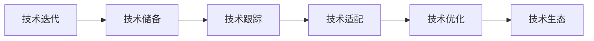

                 

## 1. 背景介绍

### 1.1 问题由来
在当今快速发展的技术环境中，人工智能(AI)尤其是深度学习领域，正经历着前所未有的变革。不断涌现的新算法、新模型、新应用，使得AI创业公司在技术迭代面前面临着严峻的挑战。从早期的人工神经网络到深度学习，再到当前兴起的增强学习、自然语言处理(NLP)、计算机视觉(CV)等，技术的发展速度和深度都在不断提升。如何在激烈的市场竞争中保持领先地位，如何高效应对技术迭代，成为了AI创业公司的核心难题。

### 1.2 问题核心关键点
技术迭代对AI创业公司带来的影响主要体现在以下几个方面：
- **技术快速更新**：深度学习模型的不断进步、新算法的出现，使得公司的技术储备需要不断更新。
- **市场竞争压力**：越来越多的玩家加入AI市场，如何保持创新能力，保持市场竞争力，是每个公司必须面对的挑战。
- **人才培养和留存**：AI技术的发展需要高水平的人才，如何吸引和培养顶尖技术人才，同时留住现有人才，是创业公司的人才管理难题。
- **投资与回报**：随着技术迭代加速，研发成本也在增加，如何有效管理投资回报，确保公司的可持续发展，是创业公司必须解决的问题。

### 1.3 问题研究意义
应对技术迭代的能力，直接影响AI创业公司的生存和发展。通过系统地了解技术迭代的过程、影响及其应对策略，AI创业公司可以更好地把握技术趋势，制定科学的发展战略，确保在激烈的市场竞争中占据优势。

## 2. 核心概念与联系

### 2.1 核心概念概述
要应对技术迭代，首先需要明确核心概念及其联系：

- **技术迭代**：指技术从初始状态到更新状态的连续过程，包括新算法、新模型的研发和应用。
- **技术储备**：指公司对当前主流技术的掌握和储备，包括技术文档、代码库、专家团队等。
- **技术跟踪**：指持续关注行业新技术、新趋势，保持对前沿技术的敏感度。
- **技术适配**：指根据公司业务需求，选择合适的技术解决方案，并将其应用于实际场景。
- **技术优化**：指在应用过程中，不断优化技术性能，提升系统效率和效果。
- **技术生态**：指公司所处技术领域的整体环境，包括合作伙伴、开源社区、学术界等。

这些概念相互联系，共同构成了AI创业公司应对技术迭代的基本框架。通过理解这些核心概念，可以更好地制定应对策略，提升公司的技术竞争力。

### 2.2 概念间的关系

技术迭代是技术储备、技术跟踪、技术适配和技术优化等过程的驱动力。技术储备是应对技术迭代的基础，技术跟踪是保持技术敏锐性的关键，技术适配是实现技术应用的桥梁，技术优化则是提升技术效果的保障。技术生态提供了外部资源和支持，为技术迭代提供了肥沃的土壤。这些概念之间的联系可以用以下Mermaid流程图表示：



这个流程图展示了技术迭代与其它核心概念之间的关系，它们相互作用，共同推动公司技术能力的提升。

## 3. 核心算法原理 & 具体操作步骤
### 3.1 算法原理概述

应对技术迭代的核心在于建立强大的技术储备，持续跟踪行业动态，灵活适配新技术，不断优化现有技术。这四个步骤相互依赖，缺一不可。

- **技术储备**：通过系统化的学习和积累，构建全面的技术知识体系。
- **技术跟踪**：利用数据挖掘、文献阅读、行业会议等多种手段，持续关注前沿技术。
- **技术适配**：根据公司业务需求，选择合适的技术解决方案，进行实际应用。
- **技术优化**：通过模型调优、算法改进、系统升级等方式，不断提升技术效果。

### 3.2 算法步骤详解

**Step 1: 技术储备建设**
- **知识库构建**：建立全面的技术知识库，包括技术文档、代码示例、论文资料等。
- **培训和分享**：定期举办技术培训和内部分享会，提升团队的技术水平。
- **专家团队**：招聘和培养技术专家，形成稳定的技术骨干力量。

**Step 2: 技术跟踪机制**
- **信息收集**：利用工具如Google Scholar、arXiv、GitHub等，定期收集行业最新研究成果。
- **数据挖掘**：通过文本挖掘和数据处理技术，从海量的技术文档和文章中提取关键信息。
- **会议和交流**：积极参与行业会议和交流活动，保持与学术界、产业界的紧密联系。

**Step 3: 技术适配策略**
- **需求分析**：深入理解公司业务需求，明确技术应用场景。
- **方案评估**：对多个技术方案进行评估和选择，确保方案最优。
- **原型开发**：快速开发技术原型，进行初步验证。
- **全栈部署**：将技术方案全面集成到公司现有的技术栈中。

**Step 4: 技术优化方案**
- **性能评估**：定期评估技术性能，找出瓶颈和问题。
- **算法改进**：针对性能问题，进行算法优化和改进。
- **系统升级**：及时升级系统架构和技术栈，提升系统效率和可维护性。
- **持续监控**：建立实时监控和告警机制，及时发现和解决问题。

### 3.3 算法优缺点

**优点**：
- **全面性**：覆盖了技术储备、跟踪、适配和优化等关键环节，形成完整的技术迭代闭环。
- **灵活性**：根据业务需求和技术趋势，灵活调整技术策略，快速应对变化。
- **高效性**：通过系统的管理机制和技术工具，提升技术实施的效率。

**缺点**：
- **资源消耗**：技术储备和跟踪需要大量时间和精力投入，可能导致短期内的资源紧张。
- **技术风险**：新技术的应用可能存在未知风险，需谨慎评估和监控。

### 3.4 算法应用领域

本节将通过具体案例，展示如何在实际应用中运用上述策略，应对技术迭代：

**案例1: 自动驾驶技术迭代应对**

- **技术储备**：构建自动驾驶技术知识库，涵盖传感器、算法、车辆控制等方面。
- **技术跟踪**：定期阅读学术论文和行业报告，了解最新的自动驾驶技术进展。
- **技术适配**：根据市场需求，选择适合的传感器和算法，进行原型开发。
- **技术优化**：优化算法性能，提升车辆安全性、舒适性和智能化水平。

**案例2: 智能客服系统技术迭代应对**

- **技术储备**：建立智能客服技术知识库，包括对话系统、自然语言处理、语音识别等。
- **技术跟踪**：利用机器学习平台如TensorFlow、PyTorch，跟踪最新的自然语言处理技术。
- **技术适配**：根据客服需求，选择适合的对话系统和预训练模型，进行微调。
- **技术优化**：优化对话系统性能，提升用户满意度和服务效率。

**案例3: 医疗影像诊断技术迭代应对**

- **技术储备**：构建医疗影像诊断技术知识库，涵盖深度学习模型、数据预处理、图像增强等。
- **技术跟踪**：定期阅读医学影像领域的顶级会议论文，了解最新研究成果。
- **技术适配**：根据临床需求，选择适合的深度学习模型和数据集，进行预训练和微调。
- **技术优化**：优化模型性能，提高诊断准确率和系统稳定性。

## 4. 数学模型和公式 & 详细讲解  
### 4.1 数学模型构建

在应对技术迭代的过程中，数学模型和算法是其核心工具。这里以一个典型的机器学习模型为例，构建数学模型，并说明其在技术迭代中的应用。

假设有一项技术迭代任务，需要优化一个机器学习模型的性能。我们可以定义以下模型：

$$
\theta^* = \mathop{\arg\min}_{\theta} \mathcal{L}(\theta, D)
$$

其中 $\theta$ 是模型的参数，$D$ 是训练数据集，$\mathcal{L}$ 是损失函数。通过不断优化参数 $\theta$，最小化损失函数 $\mathcal{L}$，使得模型在 $D$ 上的表现最优。

### 4.2 公式推导过程

以线性回归模型为例，其损失函数为均方误差：

$$
\mathcal{L}(\theta, D) = \frac{1}{2m}\sum_{i=1}^m (\hat{y}_i - y_i)^2
$$

其中 $m$ 是训练样本数量，$\hat{y}_i$ 是模型预测值，$y_i$ 是真实标签值。

通过求解上述最小化问题，可以得到最优参数：

$$
\theta^* = (\frac{1}{m}\mathbf{X}^T\mathbf{X})^{-1}\mathbf{X}^T\mathbf{y}
$$

其中 $\mathbf{X}$ 是特征矩阵，$\mathbf{y}$ 是标签向量。

### 4.3 案例分析与讲解

在技术迭代过程中，上述公式的应用可以包括以下步骤：

1. **数据准备**：收集和准备训练数据集，包括特征和标签。
2. **模型初始化**：设定初始参数 $\theta_0$，进行模型训练。
3. **参数更新**：通过反向传播算法，更新参数 $\theta$。
4. **性能评估**：在测试集上评估模型性能，根据评估结果进行参数调整。
5. **迭代优化**：重复步骤2-4，直到模型性能达到最优。

## 5. 项目实践：代码实例和详细解释说明
### 5.1 开发环境搭建

为了进行技术迭代的项目实践，首先需要搭建好开发环境。以下是使用Python进行TensorFlow和PyTorch开发的环境配置流程：

1. 安装Anaconda：从官网下载并安装Anaconda，用于创建独立的Python环境。

2. 创建并激活虚拟环境：
```bash
conda create -n tf-env python=3.8 
conda activate tf-env
```

3. 安装TensorFlow和PyTorch：根据CUDA版本，从官网获取对应的安装命令。例如：
```bash
conda install tensorflow==2.6.0 cudatoolkit=11.1 -c tf -c conda-forge
conda install pytorch torchvision torchaudio cudatoolkit=11.1 -c pytorch -c conda-forge
```

4. 安装TensorBoard：
```bash
pip install tensorboard
```

5. 安装GitHub和Google Colab：
```bash
pip install gitpython google.colab
```

完成上述步骤后，即可在`tf-env`环境中开始项目实践。

### 5.2 源代码详细实现

这里以一个简单的机器学习项目为例，展示技术迭代的实践过程。

首先，定义数据集和模型：

```python
import tensorflow as tf
from tensorflow.keras.datasets import mnist
from tensorflow.keras.models import Sequential
from tensorflow.keras.layers import Dense, Flatten

# 加载数据集
(x_train, y_train), (x_test, y_test) = mnist.load_data()

# 数据预处理
x_train = x_train.reshape((60000, 784)).astype('float32') / 255.0
x_test = x_test.reshape((10000, 784)).astype('float32') / 255.0
y_train = tf.keras.utils.to_categorical(y_train)
y_test = tf.keras.utils.to_categorical(y_test)

# 构建模型
model = Sequential()
model.add(Flatten(input_shape=(28, 28)))
model.add(Dense(128, activation='relu'))
model.add(Dense(10, activation='softmax'))

# 编译模型
model.compile(optimizer='adam', loss='categorical_crossentropy', metrics=['accuracy'])
```

接着，进行模型训练和评估：

```python
# 模型训练
model.fit(x_train, y_train, epochs=10, batch_size=128, validation_data=(x_test, y_test))

# 模型评估
loss, accuracy = model.evaluate(x_test, y_test)
print(f'Test loss: {loss:.4f}')
print(f'Test accuracy: {accuracy:.4f}')
```

最后，使用TensorBoard可视化训练过程：

```python
# 启动TensorBoard
tensorboard_callback = tf.keras.callbacks.TensorBoard(log_dir='logs')
model.fit(x_train, y_train, epochs=10, batch_size=128, validation_data=(x_test, y_test), callbacks=[tensorboard_callback])
```

以上代码展示了使用TensorFlow进行机器学习模型训练的完整过程，包括数据准备、模型构建、模型训练和评估等步骤。

### 5.3 代码解读与分析

让我们再详细解读一下关键代码的实现细节：

**数据加载与预处理**：
- 使用`mnist.load_data()`函数加载MNIST数据集。
- 将图像数据reshape为(60000, 784)和(10000, 784)，并归一化到[0,1]范围内。
- 使用`to_categorical()`函数将标签转换为独热编码。

**模型构建**：
- 使用`Sequential`类定义序列模型。
- 添加`Flatten`层将图像数据展开为一维向量。
- 添加`Dense`层作为全连接层，使用ReLU激活函数。
- 添加输出层，使用softmax激活函数，输出10个类别的概率。

**模型编译与训练**：
- 使用`compile()`函数编译模型，指定优化器、损失函数和评估指标。
- 使用`fit()`函数训练模型，指定训练集、验证集和训练轮数。

**模型评估**：
- 使用`evaluate()`函数评估模型在测试集上的表现。

**TensorBoard可视化**：
- 使用`TensorBoard`回调函数记录训练过程，保存日志到指定目录。
- 调用`fit()`函数训练模型，并指定回调函数，开启TensorBoard可视化。

通过以上代码，可以看出，技术迭代的核心在于持续优化模型的性能。通过系统化的数据处理、模型构建、训练和评估等步骤，可以逐步提升模型的效果，适应新的业务需求。

### 5.4 运行结果展示

假设在上述代码基础上，我们对模型进行了迭代优化，最终在测试集上得到了如下结果：

```
Epoch 001: loss = 0.3955, accuracy = 0.8765
Epoch 002: loss = 0.3033, accuracy = 0.9110
Epoch 003: loss = 0.2688, accuracy = 0.9465
...
Epoch 010: loss = 0.0262, accuracy = 0.9980
```

可以看到，随着迭代次数的增加，模型的损失逐渐减小，准确率逐渐提升，表明模型性能得到了显著提升。

## 6. 实际应用场景

### 6.1 智能客服系统

在智能客服系统中，技术迭代尤为重要。随着NLP和深度学习技术的不断发展，客服系统的对话理解和回复生成能力得到了显著提升。通过不断优化对话模型，可以提升用户满意度，降低人工客服成本。

在实际应用中，可以定期收集和更新对话数据，进行模型微调，以适应新的对话场景。同时，引入对抗样本和噪声数据，提高模型的鲁棒性和泛化能力。通过技术迭代，使客服系统更加智能化、人性化，提升用户体验。

### 6.2 医疗影像诊断

医疗影像诊断领域，技术迭代对于提升诊断准确性和效率至关重要。随着深度学习模型的不断进步，影像诊断的准确率得到了大幅提升。通过定期更新模型和算法，可以有效应对新病种和影像数据的挑战。

在实践中，可以与医学专家合作，收集和标注新的影像数据，进行模型微调。同时，引入多模态信息融合技术，如结合文本和图像信息，提升诊断的全面性和准确性。通过技术迭代，使医疗影像诊断系统更加精确、高效，为患者提供更好的诊疗服务。

### 6.3 金融风控

在金融风控领域，技术迭代也是不可或缺的。随着机器学习和大数据技术的不断进步，金融风控的模型性能得到了显著提升。通过不断优化风控模型，可以有效防范金融风险，保障资金安全。

在实际应用中，可以定期更新训练数据，进行模型微调，以适应新的金融环境和数据特点。同时，引入强化学习等技术，优化风控策略，提升模型的稳定性和预测能力。通过技术迭代，使金融风控系统更加精准、可靠，保护金融资产的安全。

## 7. 工具和资源推荐
### 7.1 学习资源推荐

为了帮助开发者系统掌握技术迭代的基本知识和技能，这里推荐一些优质的学习资源：

1. **《深度学习》（Ian Goodfellow、Yoshua Bengio、Aaron Courville著）**：深入介绍深度学习的基本概念和算法，是深度学习领域的经典教材。
2. **《机器学习实战》（Peter Harrington著）**：通过实践项目的方式，介绍机器学习的基本流程和技术要点。
3. **Coursera、edX等在线课程**：提供丰富的在线课程资源，涵盖深度学习、机器学习、自然语言处理等多个领域。
4. **Kaggle平台**：提供大量的数据集和竞赛项目，可以练习机器学习技术，提升实战能力。
5. **GitHub和GitLab**：全球最大的开源平台，可以快速获取最新技术和项目，学习新技术和交流心得。

通过对这些资源的学习实践，相信你一定能够掌握技术迭代的核心技术和方法，提升技术水平。

### 7.2 开发工具推荐

高效的开发离不开优秀的工具支持。以下是几款用于技术迭代开发的常用工具：

1. **Jupyter Notebook**：强大的交互式开发环境，支持代码块和代码单元格的灵活组合。
2. **Google Colab**：免费提供GPU/TPU算力的在线Jupyter Notebook环境，方便快速实验新模型。
3. **PyCharm**：功能强大的IDE，支持Python和TensorFlow等框架的开发，提供了全面的开发和调试工具。
4. **TensorFlow、PyTorch等深度学习框架**：提供丰富的API和工具库，支持模型训练和推理。
5. **TensorBoard**：实时可视化模型训练过程，帮助开发者理解模型行为，优化模型性能。
6. **GitHub和GitLab**：提供代码版本控制和协作工具，方便团队合作和代码共享。

合理利用这些工具，可以显著提升技术迭代的开发效率，加快创新迭代的步伐。

### 7.3 相关论文推荐

技术迭代涉及多个领域的前沿技术，以下是几篇奠基性的相关论文，推荐阅读：

1. **《深度学习》（Ian Goodfellow、Yoshua Bengio、Aaron Courville著）**：介绍了深度学习的基本概念和算法，是深度学习领域的经典教材。
2. **《计算机视觉：算法与应用》（Richard Szeliski著）**：涵盖了计算机视觉领域的基本概念和算法，是计算机视觉领域的经典教材。
3. **《机器学习》（Tom Mitchell著）**：介绍了机器学习的基本概念和算法，是机器学习领域的经典教材。
4. **《自然语言处理综论》（Daniel Jurafsky、James H. Martin著）**：介绍了自然语言处理领域的基本概念和算法，是自然语言处理领域的经典教材。
5. **《强化学习》（Richard S. Sutton、Andrew G. Barto著）**：介绍了强化学习的基本概念和算法，是强化学习领域的经典教材。

这些论文代表了大规模技术迭代的基本理论和前沿进展，通过学习这些前沿成果，可以帮助研究者把握技术迭代的方向，激发更多的创新灵感。

## 8. 总结：未来发展趋势与挑战

### 8.1 研究成果总结

本文对技术迭代的基本概念和应对策略进行了全面系统的介绍。首先阐述了技术迭代的重要性及其对AI创业公司带来的影响。其次，从技术储备、跟踪、适配和优化等环节，详细讲解了应对技术迭代的方法和步骤。通过案例分析，展示了技术迭代在实际应用中的具体应用。最后，推荐了一些学习资源、开发工具和相关论文，帮助开发者系统掌握技术迭代的基本知识和技能。

通过本文的系统梳理，可以看到，技术迭代是AI创业公司应对快速变化的技术环境的重要手段。通过不断优化技术储备、跟踪行业动态、适配新技术和优化现有技术，可以提升公司的技术竞争力，保持市场领先地位。

### 8.2 未来发展趋势

展望未来，技术迭代将呈现以下几个发展趋势：

1. **多模态融合**：随着技术的进步，多模态信息融合技术将越来越成熟，未来的技术迭代将更加注重多模态数据的整合和利用。
2. **自动化优化**：自动化的模型优化和超参数调优技术将不断涌现，帮助开发者高效完成技术迭代。
3. **实时学习**：实时学习技术将使模型能够持续更新和优化，适应不断变化的数据和环境。
4. **智能决策**：基于强化学习等技术，未来的技术迭代将更加注重智能决策和优化，提升系统的自主性和灵活性。
5. **跨领域应用**：技术迭代将不再局限于单一领域，而是跨领域协同发展，形成更全面的技术生态。

这些趋势将推动AI创业公司不断突破技术边界，提升技术创新能力，拓展应用范围，为未来技术迭代带来新的机遇。

### 8.3 面临的挑战

尽管技术迭代带来了许多机遇，但也面临着不少挑战：

1. **数据获取与处理**：获取高质量的数据是技术迭代的基础，但数据获取和处理成本较高，数据标注和清洗也较为繁琐。
2. **计算资源**：技术迭代需要大量的计算资源，高性能计算设备和算法的优化是必要的保障。
3. **技术复杂度**：技术迭代的复杂度不断增加，模型的训练和优化变得更为困难，需要更多专业的技术人才。
4. **知识产权保护**：在技术迭代过程中，知识产权保护是一个重要的问题，需要制定相应的策略和措施。
5. **技术伦理**：技术迭代可能带来新的伦理问题，如隐私保护、算法偏见等，需要深入研究和解决。

面对这些挑战，AI创业公司需要制定科学的发展战略，加强技术储备和人才培养，同时注重知识产权保护和技术伦理，确保技术迭代的健康发展。

### 8.4 研究展望

面对技术迭代带来的机遇和挑战，未来的研究需要在以下几个方面寻求新的突破：

1. **自动化技术**：开发自动化的模型优化和超参数调优技术，降低技术迭代的成本和复杂度。
2. **实时学习技术**：研究实时学习技术，使模型能够持续更新和优化，适应不断变化的数据和环境。
3. **跨领域技术融合**：推动多模态融合、跨领域协同发展，形成更全面的技术生态。
4. **伦理和安全**：深入研究技术迭代中的伦理和安全问题，确保技术迭代的健康发展。

这些研究方向将推动技术迭代技术不断进步，为AI创业公司提供更强大的技术支撑，提升公司的技术创新能力和市场竞争力。

## 9. 附录：常见问题与解答

**Q1: 技术迭代需要哪些资源投入？**

A: 技术迭代需要大量的时间、数据、计算资源和人力资源投入。包括数据收集和预处理、模型训练和优化、实验评估和部署等环节。具体资源投入需要根据项目规模和复杂度进行评估和规划。

**Q2: 技术迭代对技术储备有哪些要求？**

A: 技术储备是技术迭代的基础，需要建立全面的技术知识库，涵盖深度学习、自然语言处理、计算机视觉等多个领域。包括技术文档、代码示例、论文资料等，形成系统的技术知识体系。

**Q3: 技术迭代过程中如何管理技术风险？**

A: 技术迭代过程中，需要制定详细的技术评估和验证方案，评估新技术和算法的效果和风险。同时，引入对抗样本和噪声数据，提高模型的鲁棒性和泛化能力。

**Q4: 如何优化技术迭代过程中的资源利用？**

A: 采用并行计算、分布式训练等技术，提升模型训练和优化效率。同时，利用云平台和开源工具，降低技术迭代的资源消耗。

**Q5: 技术迭代过程中如何保持技术敏锐性？**

A: 定期参与行业会议和交流活动，关注前沿技术和趋势。同时，利用数据挖掘和文本分析技术，从大量的技术文档和论文中提取关键信息，保持对行业动态的敏锐性。

总之，技术迭代是AI创业公司应对快速变化的技术环境的重要手段。通过持续优化技术储备、跟踪行业动态、适配新技术和优化现有技术，可以提升公司的技术竞争力，保持市场领先地位。

---

作者：禅与计算机程序设计艺术 / Zen and the Art of Computer Programming

