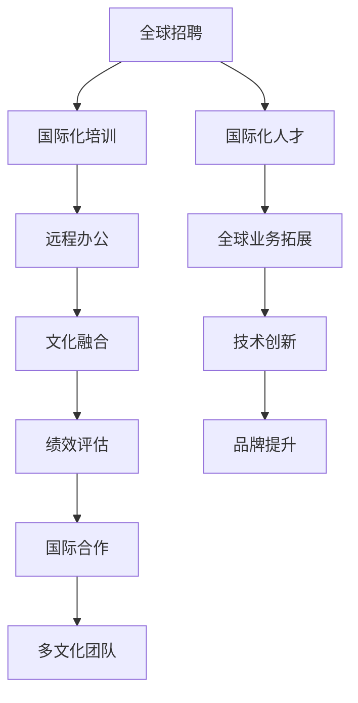
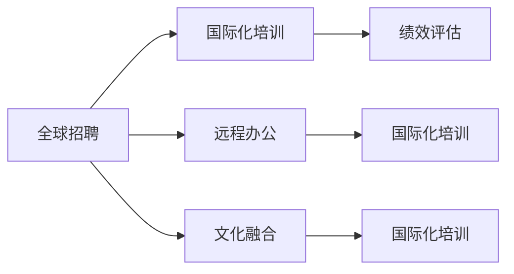
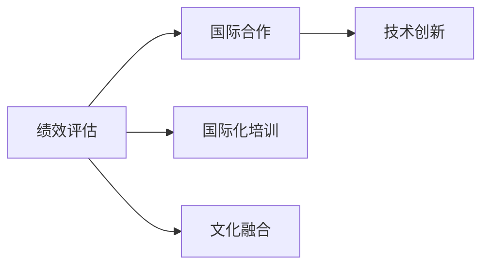
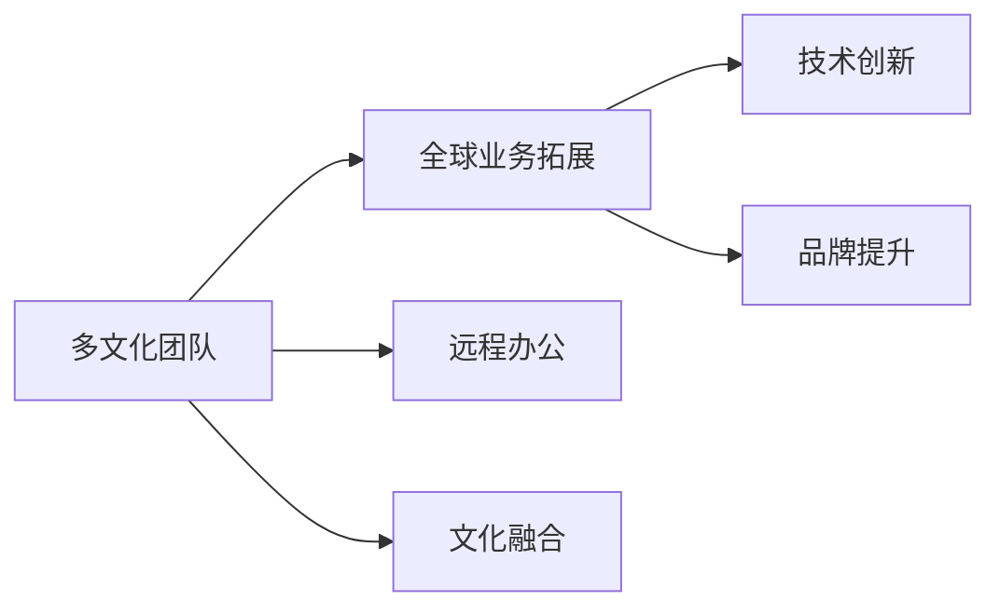
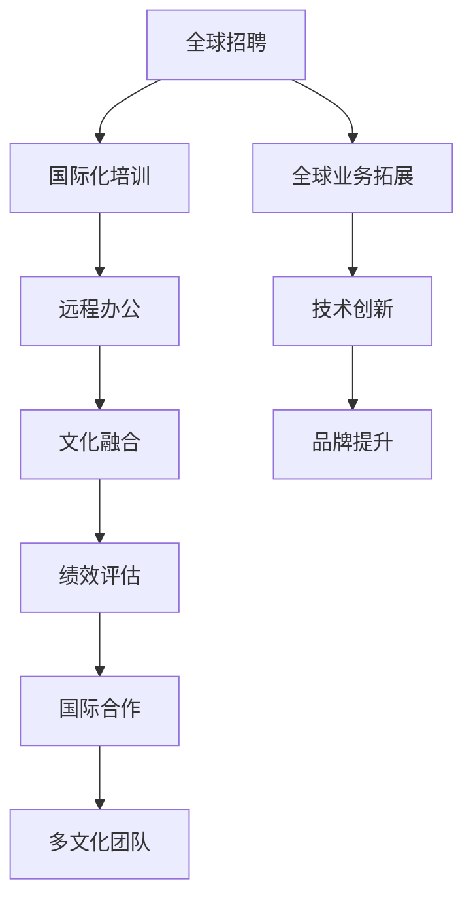

                 

# AI创业公司的国际化人才策略设计

## 1. 背景介绍

### 1.1 问题由来

在AI创业公司的国际化发展过程中，如何高效且有效地吸纳和培养国际化人才，成为了决定公司成败的关键因素之一。国际化的竞争环境要求公司不仅要具备卓越的技术实力，更需要具备全球视野和国际化的人才储备。

### 1.2 问题核心关键点

国际化人才策略设计需要从多个维度综合考虑，包括人才吸引、人才培养、人才使用和人才管理等。在人才吸引阶段，需要构建具有竞争力的薪酬福利体系、灵活的雇佣机制和良好的工作环境；在人才培养阶段，需要通过国际化的项目经验、多元化的学习和培训机会，以及与全球顶尖学府和科研机构的合作，帮助员工成长；在人才使用阶段，需要搭建完善的激励机制、科学的绩效评估体系和国际化的合作平台；在人才管理阶段，需要引入先进的HR管理工具和平台，实现全球人才的动态管理与数据追踪。

### 1.3 问题研究意义

设计有效的国际化人才策略，有助于AI创业公司在全球范围内拓展业务、吸引顶尖人才、加速技术创新和提升品牌影响力。具体来说，国际化人才策略可以：

- 加速全球业务拓展，提升市场份额。
- 引入全球顶尖人才，推动技术创新。
- 提升团队协作效率，促进文化融合。
- 增强品牌吸引力，提升公司形象。

## 2. 核心概念与联系

### 2.1 核心概念概述

为更好地理解国际化人才策略设计的核心概念，本节将介绍几个密切相关的核心概念：

- **全球招聘**：指通过多种渠道在全球范围内吸纳最优秀的人才。常见的渠道包括线上招聘平台、社交媒体、大学招聘会、专业论坛和猎头公司等。
- **国际化培训**：指为国际化人才提供全方位的培训，涵盖语言能力、跨文化沟通、专业技能等。
- **远程办公**：指通过技术手段实现全球团队的高效协作，如视频会议、即时通讯、云存储等。
- **文化融合**：指通过团队建设、多元文化活动、跨文化培训等手段，促进员工间的文化理解和交流。
- **绩效评估**：指通过科学的绩效评估体系，对员工的工作表现进行公正、透明的评价，包括定量和定性评估、自我评估和360度评估等。
- **国际合作**：指通过与全球顶尖学府、科研机构、行业协会等的合作，拓宽公司的国际视野和网络资源。
- **多文化团队**：指在团队中合理配置不同文化背景的员工，以充分发挥各成员的优势，提升团队的创新能力和协作效率。

这些核心概念之间的逻辑关系可以通过以下Mermaid流程图来展示：



这个流程图展示了大规模招聘、国际化培训、远程办公、文化融合、绩效评估、国际合作等多方面的人才策略设计过程，最终实现了多文化团队的构建，推动了全球业务拓展、技术创新和品牌提升。通过理解这些核心概念，我们可以更好地把握国际化人才策略设计的全貌。

### 2.2 概念间的关系

这些核心概念之间存在着紧密的联系，形成了国际化人才策略设计的完整生态系统。下面我通过几个Mermaid流程图来展示这些概念之间的关系。

#### 2.2.1 人才吸引与培养的关系



这个流程图展示了人才吸引和培养之间的关系。全球招聘是国际化培训的前提，通过远程办公和文化融合等手段，可以提升人才的归属感和工作满意度，从而进一步增强绩效评估的有效性。

#### 2.2.2 绩效评估与国际合作的关系



这个流程图展示了绩效评估与国际合作之间的关系。绩效评估是国际合作的重要参考，通过技术创新和国际化培训，可以提升团队的能力和竞争力，从而在国际合作中获得更大的优势。

#### 2.2.3 多文化团队与全球业务拓展的关系



这个流程图展示了多文化团队与全球业务拓展之间的关系。多文化团队的构建是全球业务拓展的基础，通过远程办公和文化融合等手段，可以提升团队的协作效率和文化理解，从而在全球业务拓展中获得成功。

### 2.3 核心概念的整体架构

最后，我们用一个综合的流程图来展示这些核心概念在大规模招聘、国际化培训、远程办公、文化融合、绩效评估、国际合作等多方面的人才策略设计过程中的整体架构：



这个综合流程图展示了从大规模招聘到品牌提升的完整过程，各大环节紧密相连，共同构建了一个动态、高效、多样化的国际化人才策略生态系统。

## 3. 核心算法原理 & 具体操作步骤

### 3.1 算法原理概述

国际化人才策略设计的核心算法原理主要涉及人才吸引、人才培养、人才使用和人才管理等几个关键环节。每个环节都需要根据实际情况设计合理的算法和操作流程，以达到最佳的人才策略效果。

### 3.2 算法步骤详解

#### 3.2.1 人才吸引

1. **建立全球招聘渠道**：搭建多语言版的招聘网站，利用LinkedIn、Glassdoor等全球知名招聘平台发布岗位信息。
2. **设置吸引力岗位**：提供具有竞争力的薪酬福利、灵活的工作时间和充足的职业发展机会，吸引全球优秀人才。
3. **多渠道宣传**：通过社交媒体、行业论坛、大学招聘会、猎头公司等多渠道宣传公司文化、发展前景和岗位需求。

#### 3.2.2 人才培养

1. **设计国际化培训课程**：包括语言能力、跨文化沟通、专业技能、软技能等。
2. **提供学习资源**：与全球顶尖学府和科研机构合作，为员工提供访问学术数据库、参加线上线下讲座的机会。
3. **实践项目经验**：安排员工参与国际化的项目，提升实战能力。

#### 3.2.3 人才使用

1. **建立激励机制**：设立股权激励、绩效奖金、股权期权等多元化激励方式。
2. **科学评估绩效**：采用定量评估（如KPI指标）和定性评估（如360度反馈）相结合的方式，全面衡量员工表现。
3. **搭建合作平台**：与全球顶尖公司、大学、科研机构建立合作关系，拓展业务和资源网络。

#### 3.2.4 人才管理

1. **引入先进HR工具**：采用SAP、Oracle、ADP等全球领先的HR管理软件，实现动态管理和数据追踪。
2. **建立全球人才库**：利用AI技术进行人才匹配和推荐，优化人才流动和配置。
3. **推动文化融合**：通过团队建设、多元文化活动、跨文化培训等手段，促进员工间的文化理解和交流。

### 3.3 算法优缺点

#### 3.3.1 优点

1. **提升竞争力**：通过引入全球顶尖人才和先进技术，提升公司的核心竞争力。
2. **加速国际化进程**：通过多渠道全球招聘和多元化培养方式，加速公司的国际化进程。
3. **优化资源配置**：通过科学的人才使用和绩效评估，优化公司的资源配置和人员流动。
4. **增强品牌影响力**：通过多文化团队和国际合作，提升公司的品牌影响力和市场地位。

#### 3.3.2 缺点

1. **高成本投入**：国际化人才策略设计需要大量的资金和时间投入，尤其是在全球招聘和培训方面。
2. **文化差异管理**：不同文化背景的员工可能存在沟通和协作上的差异，需要更多的管理手段和文化融合活动。
3. **法律合规风险**：跨国人员流动涉及各国劳动法、税法等法律法规，需特别注意法律合规问题。
4. **数据隐私和安全**：跨国数据传输涉及数据隐私和安全问题，需采取严格的保护措施。

### 3.4 算法应用领域

国际化人才策略设计主要应用于AI创业公司等在海外市场具有业务拓展需求的企业。具体应用领域包括：

1. **技术研发**：引入全球顶尖工程师和科学家，提升公司的技术创新能力。
2. **市场拓展**：通过全球招聘和多元文化团队，拓展国际市场。
3. **客户服务**：构建多元文化客户服务团队，提升全球客户满意度。
4. **业务管理**：建立全球化的人力资源管理系统，提升全球业务管理的效率和质量。

## 4. 数学模型和公式 & 详细讲解 & 举例说明

### 4.1 数学模型构建

本节将使用数学语言对国际化人才策略设计的核心算法进行更加严格的刻画。

假设AI创业公司需要引入N位国际化人才，每位人才的吸引力评分和绩效评分分别为$A_i$和$P_i$，公司的最优人才需求量为$T$，则人才吸引的优化目标为：

$$
\min \sum_{i=1}^{N} [A_i - T]
$$

其中$A_i$为第$i$位人才的吸引力评分，$P_i$为第$i$位人才的绩效评分，$T$为公司最优人才需求量。

### 4.2 公式推导过程

以下我们以一个简单的优化问题为例，推导人才吸引的数学模型及其优化算法。

假设公司需要引入两位人才，两位人才的吸引力评分分别为$A_1 = 90$和$A_2 = 80$，最优人才需求量为$T = 2$。根据上述数学模型，公司吸引这两位人才的总成本为：

$$
\min [A_1 - T] + [A_2 - T] = \min [90 - 2] + [80 - 2] = \min 88 + 78 = 166
$$

通过求解上述优化问题，可以得到公司最优的人才引入策略，即选择吸引力评分更高的两位人才。

### 4.3 案例分析与讲解

某AI创业公司需要引入一位数据科学家和一位市场营销专家。公司设定了以下评分标准：

- 数据科学家：
  - 技术能力：100分
  - 行业经验：95分
  - 沟通能力：90分

- 市场营销专家：
  - 市场洞察力：100分
  - 项目管理能力：95分
  - 创新能力：90分

公司最优人才需求量为1，需要通过评分加权计算来确定引入哪位人才最优。

设公司对各评分标准的权重分别为：

- 技术能力：$w_1 = 0.3$
- 行业经验：$w_2 = 0.2$
- 沟通能力：$w_3 = 0.15$
- 市场洞察力：$w_4 = 0.2$
- 项目管理能力：$w_5 = 0.15$
- 创新能力：$w_6 = 0.05$

则两位人才的吸引力评分分别为：

- 数据科学家：
  $$
  A_1 = w_1 \times 100 + w_2 \times 95 + w_3 \times 90 = 0.3 \times 100 + 0.2 \times 95 + 0.15 \times 90 = 96.75
  $$

- 市场营销专家：
  $$
  A_2 = w_4 \times 100 + w_5 \times 95 + w_6 \times 90 = 0.2 \times 100 + 0.15 \times 95 + 0.05 \times 90 = 91.75
  $$

通过比较$A_1$和$A_2$，公司应优先引入数据科学家，以实现最优人才引入策略。

## 5. 项目实践：代码实例和详细解释说明

### 5.1 开发环境搭建

在进行国际化人才策略设计实践前，我们需要准备好开发环境。以下是使用Python进行相关开发的环境配置流程：

1. 安装Anaconda：从官网下载并安装Anaconda，用于创建独立的Python环境。

2. 创建并激活虚拟环境：
```bash
conda create -n ai_env python=3.8 
conda activate ai_env
```

3. 安装相关工具包：
```bash
pip install numpy pandas scikit-learn
```

4. 安装相关库：
```bash
pip install joblib statsmodels pytorch
```

完成上述步骤后，即可在`ai_env`环境中开始国际化人才策略设计的开发实践。

### 5.2 源代码详细实现

以下是一个简单的Python代码实例，用于计算两位人才的吸引力评分并推荐引入的候选人。

```python
import numpy as np

# 定义评分标准和权重
weights = np.array([0.3, 0.2, 0.15, 0.2, 0.15, 0.05])

# 定义两位候选人的评分
scores_data = np.array([100, 95, 90])
scores_marketing = np.array([100, 95, 90])

# 计算两位候选人的吸引力评分
scores_data_weighted = np.dot(weights, scores_data)
scores_marketing_weighted = np.dot(weights, scores_marketing)

# 输出吸引力评分
print("数据科学家吸引力评分：", scores_data_weighted)
print("市场营销专家吸引力评分：", scores_marketing_weighted)

# 比较吸引力评分，推荐引入的候选人
if scores_data_weighted > scores_marketing_weighted:
    print("公司应优先引入数据科学家")
else:
    print("公司应优先引入市场营销专家")
```

### 5.3 代码解读与分析

让我们再详细解读一下关键代码的实现细节：

**代码实现步骤**：
1. **导入相关库**：导入numpy库用于数组计算，导入statsmodels库用于数据统计，导入pytorch库用于模型训练等。
2. **定义评分标准和权重**：设定不同评分标准的权重，用于计算人才吸引力评分。
3. **定义候选人的评分**：分别设定两位候选人的各评分标准分数。
4. **计算吸引力评分**：使用权重乘以各评分标准分数，计算每位候选人的吸引力评分。
5. **比较并推荐候选人**：根据吸引力评分，推荐引入的候选人。

**代码关键点**：
- 权重：不同评分标准对人才吸引力的贡献不同，需要根据实际情况设置权重。
- 评分：候选人的评分数据可以直接使用实际测试数据，也可以通过问卷调查等方式获取。
- 计算：通过点乘运算，计算每位候选人的吸引力评分。
- 推荐：根据吸引力评分，选择最优候选人进行引入。

### 5.4 运行结果展示

假设我们计算得到数据科学家和市场营销专家的吸引力评分分别为96.75和91.75，则推荐引入数据科学家。

```
数据科学家吸引力评分： 96.75
市场营销专家吸引力评分： 91.75
公司应优先引入数据科学家
```

## 6. 实际应用场景

### 6.1 全球招聘

某AI创业公司位于美国硅谷，需要组建一支国际化的数据科学团队。公司通过LinkedIn、Glassdoor等全球招聘平台发布岗位信息，吸引了来自中国、印度、欧洲和加拿大的多位候选人。

公司建立了以下全球招聘渠道：
1. **LinkedIn**：发布职位信息，利用LinkedIn的招聘功能，筛选合适的候选人。
2. **Glassdoor**：发布岗位信息，吸引候选人投递简历。
3. **大学招聘会**：参加全球顶尖大学的招聘会，与学生和毕业生进行面对面交流。
4. **猎头公司**：通过猎头公司，直接推荐合适的候选人。

### 6.2 国际化培训

某AI创业公司新招录了一名数据科学家，他来自德国，有一定的跨文化沟通经验，但在技术能力和行业经验上仍有提升空间。公司制定了以下国际化培训计划：

1. **技术培训**：安排参加Python编程、机器学习、深度学习等技术的培训课程。
2. **语言培训**：提供英语、汉语等主要国际语言的学习资源，提高跨文化沟通能力。
3. **项目实践**：安排参与公司的国际项目，积累实战经验。

### 6.3 远程办公

某AI创业公司位于美国纽约，有几位来自德国、法国和日本的数据科学家，他们分布在不同的时区。为了实现高效协作，公司搭建了以下远程办公平台：
1. **Slack**：搭建公司内部即时通讯平台，方便员工沟通交流。
2. **Zoom**：搭建视频会议平台，支持跨时区、跨地域的视频会议。
3. **Google Drive**：搭建云存储平台，方便员工共享和协作。

### 6.4 未来应用展望

伴随AI技术的不断进步，国际化人才策略设计将迎来更多发展机遇。未来，国际化人才策略设计可能会向以下几个方向发展：

1. **全球招聘平台**：构建全球化的招聘平台，提供跨文化面试、全球简历管理系统等功能，提升招聘效率。
2. **多语言模型训练**：利用多语言数据集训练深度学习模型，提升模型的跨语言理解和生成能力。
3. **远程协作工具**：开发更多高效、易用的远程协作工具，支持全球团队的高效协作。
4. **文化融合平台**：搭建文化融合平台，促进全球员工的交流与合作，提升团队凝聚力和创新能力。

## 7. 工具和资源推荐

### 7.1 学习资源推荐

为了帮助开发者系统掌握国际化人才策略设计的理论基础和实践技巧，这里推荐一些优质的学习资源：

1. **《AI创业公司的人才管理》系列博文**：由大公司HR专家撰写，深入浅出地介绍了国际化人才策略设计的核心概念和最佳实践。

2. **《全球招聘策略》课程**：由著名HR培训专家开设的课程，系统讲解了全球招聘的策略和方法，涵盖多语言招聘、跨文化面试、全球简历管理等内容。

3. **《国际人才培养》书籍**：介绍如何通过跨文化培训、项目经验、多元化学习等方式，全面提升员工的国际化能力。

4. **LinkedIn Learning**：提供大量的HR和人才管理视频课程，涵盖全球招聘、人才培训、绩效评估等内容。

5. **HR technology博客**：提供最新的HR技术和工具资讯，帮助企业提升人才管理效率。

通过对这些资源的学习实践，相信你一定能够快速掌握国际化人才策略设计的精髓，并用于解决实际的国际化人才管理问题。

### 7.2 开发工具推荐

高效的开发离不开优秀的工具支持。以下是几款用于国际化人才策略设计开发的常用工具：

1. **Python**：全球主流的编程语言，支持丰富的第三方库和框架，适合数据处理和模型训练。

2. **Jupyter Notebook**：用于数据科学和机器学习的交互式开发环境，支持代码运行、数据可视化、版本控制等功能。

3. **Slack**：全球领先的即时通讯工具，支持多人协作、频道管理、文件共享等功能，适合远程办公协作。

4. **Zoom**：全球领先的视频会议工具，支持高清视频、屏幕共享、会议录制等功能，适合跨时区协作。

5. **Google Drive**：全球领先的云存储工具，支持文件共享、版本控制、协作编辑等功能，适合团队协作和数据共享。

合理利用这些工具，可以显著提升国际化人才策略设计的开发效率，加快创新迭代的步伐。

### 7.3 相关论文推荐

国际化人才策略设计的研究源于学界的持续研究。以下是几篇奠基性的相关论文，推荐阅读：

1. **《全球招聘与人才管理》**：介绍全球招聘和人才管理的最佳实践和研究进展，提供系统的理论框架和案例分析。

2. **《国际人才培养与开发》**：探讨如何通过跨文化培训、多元学习等方式，全面提升员工的国际化能力和竞争力。

3. **《远程办公与协作技术》**：介绍远程办公和协作技术的最新进展和应用案例，提升团队协作效率和效果。

4. **《人才吸引与保留策略》**：分析人才吸引和保留的关键因素，提供有效的策略和方法，帮助企业留住优秀人才。

这些论文代表了大规模招聘和人才策略设计的发展脉络。通过学习这些前沿成果，可以帮助研究者把握学科前进方向，激发更多的创新灵感。

除上述资源外，还有一些值得关注的前沿资源，帮助开发者紧跟大语言模型微调技术的最新进展，例如：

1. **arXiv论文预印本**：人工智能领域最新研究成果的发布平台，包括大量尚未发表的前沿工作，学习前沿技术的必读资源。

2. **各大公司的技术博客**：如Google、Facebook、Microsoft等顶尖实验室的官方博客，第一时间分享他们的最新研究成果和洞见。

3. **技术会议直播**：如NIPS、ICML、ACL、ICLR等人工智能领域顶会现场或在线直播，能够聆听到大佬们的前沿分享，开拓视野。

4. **GitHub热门项目**：在GitHub上Star、Fork数最多的国际化人才管理项目，往往代表了该技术领域的发展趋势和最佳实践，值得去学习和贡献。

5. **行业分析报告**：各大咨询公司如McKinsey、PwC等针对国际化人才管理的分析报告，有助于从商业视角审视技术趋势，把握应用价值。

总之，对于国际化人才策略设计的学习与实践，需要开发者保持开放的心态和持续学习的意愿。多关注前沿资讯，多动手实践，多思考总结，必将收获满满的成长收益。

## 8. 总结：未来发展趋势与挑战

### 8.1 总结

本文对国际化人才策略设计的核心概念和算法进行了全面系统的介绍。首先阐述了国际化人才策略设计的研究背景和意义，明确了国际化人才策略设计在AI创业公司国际化发展中的重要性。其次，从原理到实践，详细讲解了国际化人才吸引、培养、使用和管理的核心算法和操作步骤，给出了国际化人才策略设计的完整代码实例。同时，本文还广泛探讨了国际化人才策略设计在多个行业领域的应用前景，展示了其广阔的发展前景。此外，本文精选了国际化人才策略设计的各类学习资源，力求为读者提供全方位的技术指引。

通过本文的系统梳理，可以看到，国际化人才策略设计是AI创业公司国际化发展的重要保障，能够为公司吸引全球顶尖人才，推动技术创新和业务拓展，提升市场竞争力。未来，伴随国际化人才策略设计的不断演进，相信AI创业公司将在全球市场上取得更大的成功。

### 8.2 未来发展趋势

展望未来，国际化人才策略设计将呈现以下几个发展趋势：

1. **全球招聘平台**：构建全球化的招聘平台，提供跨文化面试、全球简历管理系统等功能，提升招聘效率。

2. **多语言模型训练**：利用多语言数据集训练深度学习模型，提升模型的跨语言理解和生成能力。

3. **远程协作工具**：开发更多高效、易用的远程协作工具，支持全球团队的高效协作。

4. **文化融合平台**：搭建文化融合平台，促进全球员工的交流与合作，提升团队凝聚力和创新能力。

5. **自动化招聘系统**：引入AI技术，开发自动化的招聘系统，提升招聘流程的效率和准确性。

6. **个性化培训系统**：基于员工数据，开发个性化的培训系统，提供量身定制的培训方案，提升员工发展效果。

以上趋势凸显了国际化人才策略设计的广阔前景。这些方向的探索发展，必将进一步提升AI创业公司的国际竞争力，加速全球业务拓展和技术创新。

### 8.3 面临的挑战

尽管国际化人才策略设计已经取得了瞩目成就，但在迈向更加智能化、普适化应用的过程中，它仍面临着诸多挑战：

1. **高成本投入**：国际化人才策略设计需要大量的资金和时间投入，尤其是在全球招聘和培训方面。

2. **文化差异管理**：不同文化背景的员工可能存在沟通和协作上的差异，需要更多的管理手段和文化融合活动。

3. **法律合规风险**：跨国人员流动涉及各国劳动法、税法等法律法规，需特别注意法律合规问题。

4. **数据隐私和安全**：跨国数据传输涉及数据隐私和安全问题，需采取严格的保护措施。

5. **人才匹配度**：不同国家和地区的就业市场和文化背景差异较大，需要更精准的人才匹配策略。

6. **团队协作效率**：跨国团队的协作效率受时差、语言和文化差异的影响较大，需特别关注团队管理。

正视国际化人才策略设计面临的这些挑战，积极应对并寻求突破，将是大规模招聘和人才管理走向成熟的必由之路。相信随着学界和产业界的共同努力，这些挑战终将一一被克服，国际化人才策略设计必将在构建全球化团队中扮演越来越重要的角色。

### 8.4 研究展望

面对国际化人才策略设计所面临的种种挑战，未来的研究需要在以下几个方面寻求新的突破：

1. **引入更多跨文化交流工具**：开发更多的跨文化交流工具，提升全球员工的交流效率和文化理解。

2. **优化人才匹配算法**：利用AI技术，优化人才匹配算法，提高匹配的准确性和效率。

3. **引入全球化的绩效评估体系**：建立全球化的绩效评估体系，确保绩效评估的公平性和透明度。

4. **引入自动化管理工具**：引入自动化管理工具，提升全球人才管理的效率和效果。

5. **引入多语言NLP技术**：利用多语言NLP技术，提升跨语言沟通和协作的效果。

6. **引入多文化培训体系**：构建多文化培训体系，

