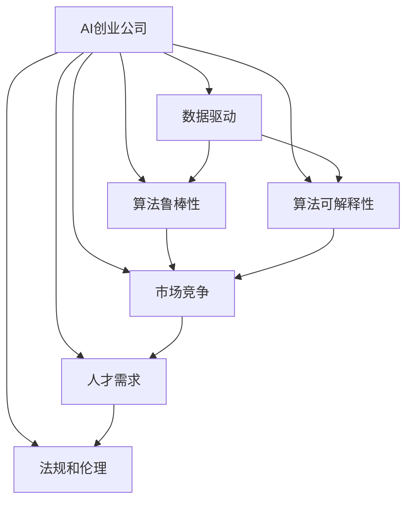
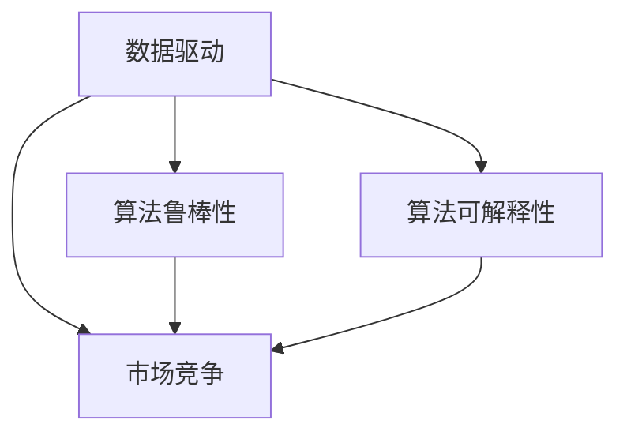
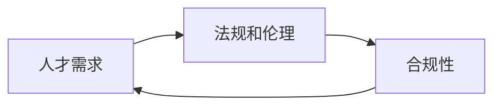
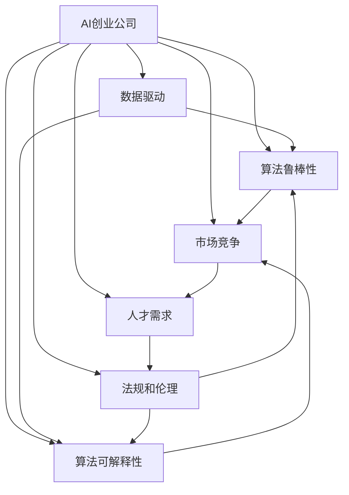
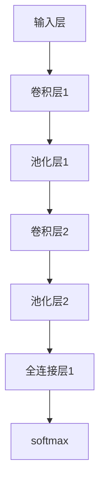

                 

# AI创业公司的机遇与挑战

## 1. 背景介绍

### 1.1 问题由来
近年来，人工智能(AI)技术在各行各业的快速渗透，使得越来越多的初创公司看到了AI的巨大机遇和潜在的商业模式。AI技术的发展，尤其是深度学习和大数据技术的不断成熟，为AI创业公司提供了前所未有的创新机会。但与此同时，AI创业也面临着种种挑战和风险，需要充分准备和科学应对。

### 1.2 问题核心关键点
AI创业公司的机遇主要来自于以下几个方面：

- **数据资源的丰富性**：大数据时代的到来，使得各行业积累了大量的数据资源。AI技术可以有效利用这些数据，提取有价值的信息和洞见，支持各类创新应用。
- **算力成本的下降**：GPU、TPU等高性能计算设备的普及，使得AI训练成本大幅降低。初创公司可以利用廉价的算力资源，快速迭代和实验AI算法。
- **技术生态的完善**：开源框架如TensorFlow、PyTorch等，以及丰富的第三方库和工具，极大降低了AI开发的门槛，使初创公司能够专注于核心算法和应用的研发。
- **市场需求的爆发**：各行业对智能化升级的迫切需求，推动了AI技术的应用场景不断拓展，为AI创业公司提供了丰富的商业机会。

但AI创业同样面临诸多挑战，包括但不限于：

- **数据隐私和安全问题**：AI创业公司需要大量数据进行训练，如何在保护用户隐私和数据安全的前提下，高效利用数据成为一大难题。
- **算法鲁棒性和可解释性**：AI算法的复杂性使其难以解释，且面对异常数据和攻击时容易失灵，这对AI系统的可信度和可靠性提出了挑战。
- **市场竞争的激烈**：AI技术快速成熟，各大巨头纷纷布局AI领域，使得市场竞争异常激烈。初创公司需要寻找差异化的竞争优势。
- **人才的稀缺**：AI领域的研发需要高度专业化的人才，但这些人才稀缺且成本高昂，如何吸引和保留人才是初创公司的关键问题。
- **法规和伦理风险**：AI技术的广泛应用带来了诸多伦理和法律问题，如偏见和歧视、自动化导致的失业等，初创公司需谨慎应对。

本文将从这些核心关键点出发，全面探讨AI创业公司的机遇与挑战，为初创公司的成长和发展提供借鉴和参考。

## 2. 核心概念与联系

### 2.1 核心概念概述

为了更好地理解AI创业公司的机遇与挑战，本节将介绍几个核心概念及其相互关系：

- **AI创业公司**：指专注于AI技术研发和应用的初创公司，如谷歌DeepMind、OpenAI、商汤科技等。这些公司通过技术创新，解决特定行业的问题，或提供通用的AI解决方案。
- **数据驱动**：指利用数据进行算法训练和模型优化，驱动AI系统不断提升性能和效果。数据的质量和多样性直接影响AI系统的表现。
- **算法鲁棒性**：指AI算法在面对异常数据和攻击时，仍能保持稳定和准确性的能力。鲁棒性强的AI系统更值得信赖。
- **算法可解释性**：指AI系统输出的结果可以被理解和解释，有助于提升系统透明度和可信度。
- **市场竞争**：指AI创业公司面临的其他同行业竞争者，包括既有企业和新进入者，竞争策略和环境将影响公司的市场地位和业务发展。
- **人才需求**：指AI公司对高水平AI人才的需求，包括数据科学家、机器学习工程师、算法架构师等。
- **法规和伦理**：指AI应用过程中涉及的法律规范和伦理问题，如数据隐私、算法偏见、自动化伦理等。

这些核心概念之间的联系可以通过以下Mermaid流程图来展示：



这个流程图展示了AI创业公司的核心概念及其相互关系：

1. 数据驱动是AI创业的基础，良好的数据质量和多样性有助于提升AI系统的性能。
2. 算法鲁棒性和可解释性是AI系统可信度的关键，直接影响系统的应用效果和市场接受度。
3. 市场竞争是AI创业公司需要面对的外部压力，需在激烈竞争中寻找差异化竞争优势。
4. 人才需求是AI公司成功的重要因素，高水平人才能驱动技术和产品创新。
5. 法规和伦理问题需在AI应用中重视，以确保系统的合法性和道德性。

### 2.2 概念间的关系

这些核心概念之间存在着紧密的联系，形成了AI创业公司的完整生态系统。下面我们通过几个Mermaid流程图来展示这些概念之间的关系。

#### 2.2.1 AI创业公司的核心能力



这个流程图展示了AI创业公司所需的核心能力：

1. 通过数据驱动，提升算法鲁棒性和可解释性，增强AI系统的可信度。
2. 面对市场竞争，需优化数据驱动和算法能力，寻找独特的竞争优势。

#### 2.2.2 人才与法规的关系



这个流程图展示了人才需求与法规之间的关系：

1. 人才需满足法规要求，确保AI应用符合法律规范。
2. 法规的合规性直接影响到人才的吸引和保留。

### 2.3 核心概念的整体架构

最后，我们用一个综合的流程图来展示这些核心概念在AI创业公司运营过程中的整体架构：



这个综合流程图展示了从数据驱动到法规伦理的全流程，强调了AI创业公司各环节的相互依赖和协作。

## 3. 核心算法原理 & 具体操作步骤

### 3.1 算法原理概述

AI创业公司的核心算法包括数据驱动的机器学习和深度学习算法。这些算法通常采用监督学习和无监督学习的方式，从大规模数据中提取特征和模式，支持各类AI应用。

以深度学习为例，其基本原理是通过多层神经网络对输入数据进行处理，通过反向传播算法优化网络参数，使得模型在训练集上表现优异。具体步骤包括：

1. 数据预处理：清洗和归一化数据，确保数据的质量和一致性。
2. 模型设计：选择合适的神经网络架构，设计损失函数和优化器。
3. 模型训练：使用训练集进行前向传播和反向传播，不断优化模型参数。
4. 模型评估：在验证集上评估模型性能，调整超参数和模型结构。
5. 模型部署：将训练好的模型部署到实际应用场景中，进行实时推理和预测。

### 3.2 算法步骤详解

#### 3.2.1 数据预处理

数据预处理是AI算法的基础，包括数据清洗、特征提取和归一化等步骤。例如：

- 数据清洗：删除重复数据、异常值和缺失值，确保数据质量。
- 特征提取：通过统计、变换等方式提取数据特征，用于后续建模。
- 归一化：将数据按比例缩放，确保不同特征之间的值域一致。

#### 3.2.2 模型设计

模型设计需要选择合适的架构和参数。以卷积神经网络(CNN)为例：

- 输入层：接收输入数据，通常为图像或文本数据。
- 卷积层：提取图像或文本特征，通过卷积核滑动窗口进行特征提取。
- 池化层：减小特征图尺寸，保留重要特征。
- 全连接层：将池化层输出的特征向量进行线性变换，输出最终结果。
- 损失函数：如均方误差、交叉熵等，衡量模型预测与真实标签的差异。
- 优化器：如Adam、SGD等，优化模型参数。

#### 3.2.3 模型训练

模型训练过程分为以下几个步骤：

1. 定义损失函数和优化器，选择合适的网络结构。
2. 将训练数据划分为训练集、验证集和测试集。
3. 使用训练集进行前向传播和反向传播，更新模型参数。
4. 在验证集上评估模型性能，调整超参数和模型结构。
5. 重复步骤3和4，直到模型在验证集上性能稳定。
6. 在测试集上评估最终模型性能，确保模型的泛化能力。

#### 3.2.4 模型评估

模型评估通常通过以下几个指标：

- 准确率：模型预测正确的样本比例。
- 召回率：模型正确识别出的正样本比例。
- F1分数：综合准确率和召回率，衡量模型的综合性能。
- ROC曲线：绘制真阳性率与假阳性率的关系，评估模型分类性能。
- 混淆矩阵：展示模型预测结果与真实标签的对比情况，帮助分析模型性能。

#### 3.2.5 模型部署

模型部署过程包括：

1. 将训练好的模型转换为可部署的格式，如TensorFlow Serving、Keras、ONNX等。
2. 在服务器或云平台上部署模型，确保系统稳定性和可扩展性。
3. 进行模型推理和预测，满足实际应用需求。
4. 监控模型性能，及时调整参数和算法。

### 3.3 算法优缺点

#### 3.3.1 优点

- **高泛化能力**：深度学习算法通过多层网络结构，可以提取复杂的特征和模式，具有较强的泛化能力。
- **高效自动化**：通过自动化的深度学习框架，可以快速迭代和优化算法，降低人工成本。
- **多样应用场景**：深度学习算法可以应用于图像识别、语音识别、自然语言处理等多个领域，具有广泛的适用性。

#### 3.3.2 缺点

- **数据依赖性强**：深度学习算法的性能依赖于高质量和多样化的数据，数据获取和处理成本较高。
- **计算资源消耗大**：深度学习算法需要大量的计算资源进行训练和推理，成本较高。
- **模型可解释性差**：深度学习算法的复杂性使得其难以解释，缺乏透明性。
- **对抗样本脆弱**：深度学习算法在面对对抗样本时容易失灵，需要额外的鲁棒性处理。

### 3.4 算法应用领域

深度学习算法已经在众多领域得到了广泛应用，包括：

- **计算机视觉**：如图像分类、目标检测、图像分割等。
- **自然语言处理**：如机器翻译、情感分析、文本生成等。
- **语音识别**：如语音合成、语音识别、语音情感分析等。
- **推荐系统**：如协同过滤、内容推荐、广告推荐等。
- **游戏AI**：如自动游戏、智能决策、人机博弈等。
- **医疗健康**：如医学影像分析、疾病预测、健康管理等。

## 4. 数学模型和公式 & 详细讲解 & 举例说明

### 4.1 数学模型构建

在AI创业公司的算法开发中，数学模型构建是不可或缺的一环。这里以卷积神经网络(CNN)为例，展示其数学模型的构建过程。

设输入数据为 $\mathbf{x} \in \mathbb{R}^{n \times d}$，其中 $n$ 为样本数，$d$ 为特征维度。卷积层由多个卷积核 $k$ 组成，每个卷积核的大小为 $f \times f$，滤波器数量为 $c$，输出特征图大小为 $n \times c \times p \times q$。卷积操作的公式为：

$$
\mathbf{X}_{i,j,k} = \mathbf{K}_{i,j,k} * \mathbf{X}_{i,j}
$$

其中 $*$ 为卷积运算，$\mathbf{X}_{i,j,k}$ 为输出特征图的第 $i$ 个样本、第 $j$ 个卷积核、第 $k$ 个特征图的位置。$\mathbf{K}_{i,j,k}$ 为第 $i$ 个卷积核、第 $j$ 个特征图、第 $k$ 个特征图的位置。

### 4.2 公式推导过程

以卷积神经网络为例，推导其前向传播和反向传播的公式：

#### 4.2.1 前向传播

卷积层的前向传播过程如下：

1. 输入数据 $\mathbf{x}$ 通过卷积核 $k$ 的滑动窗口进行卷积操作，得到卷积层的输出 $\mathbf{X}$。
2. 将卷积层输出 $\mathbf{X}$ 通过池化操作（如最大池化）得到池化层的输出 $\mathbf{P}$。
3. 将池化层输出 $\mathbf{P}$ 通过全连接层进行线性变换，得到最终输出 $\mathbf{Y}$。

其中卷积操作的公式为：

$$
\mathbf{X}_{i,j,k} = \sum_{m=0}^{f-1} \sum_{n=0}^{f-1} \mathbf{K}_{i,j,k} * \mathbf{X}_{i,j} + b_{i,j,k}
$$

其中 $*$ 为卷积运算，$b_{i,j,k}$ 为卷积核的偏置项。

#### 4.2.2 反向传播

卷积层的反向传播过程如下：

1. 计算损失函数 $\mathcal{L}$ 对输出 $\mathbf{Y}$ 的梯度 $\frac{\partial \mathcal{L}}{\partial \mathbf{Y}}$。
2. 通过全连接层的梯度传递，计算池化层的梯度 $\frac{\partial \mathcal{L}}{\partial \mathbf{P}}$。
3. 通过卷积层的梯度传递，计算卷积核的梯度 $\frac{\partial \mathcal{L}}{\partial \mathbf{K}}$。

其中卷积层梯度的计算公式为：

$$
\frac{\partial \mathcal{L}}{\partial \mathbf{K}} = \frac{\partial \mathcal{L}}{\partial \mathbf{X}} * \mathbf{P}
$$

其中 $\mathbf{P}$ 为池化层的输出，$\frac{\partial \mathcal{L}}{\partial \mathbf{X}}$ 为卷积层的梯度。

### 4.3 案例分析与讲解

以ImageNet数据集上的图像分类任务为例，展示卷积神经网络的具体应用。

假设在ImageNet数据集上进行图像分类任务，网络结构如图：



其中卷积层和池化层交替出现，全连接层用于输出分类结果。网络通过多层次卷积和池化操作，提取图像特征，并在全连接层进行分类。在训练过程中，通过反向传播算法不断优化网络参数，提高模型准确率。

## 5. 项目实践：代码实例和详细解释说明

### 5.1 开发环境搭建

在进行AI项目开发前，首先需要搭建开发环境。这里以TensorFlow为例，展示如何搭建Python环境。

1. 安装Anaconda：从官网下载并安装Anaconda，用于创建独立的Python环境。

2. 创建并激活虚拟环境：
```bash
conda create -n tensorflow-env python=3.7 
conda activate tensorflow-env
```

3. 安装TensorFlow：根据CUDA版本，从官网获取对应的安装命令。例如：
```bash
conda install tensorflow
```

4. 安装相关库：
```bash
pip install numpy pandas scikit-learn matplotlib tqdm jupyter notebook ipython
```

完成上述步骤后，即可在`tensorflow-env`环境中开始AI项目开发。

### 5.2 源代码详细实现

下面以ImageNet数据集上的图像分类任务为例，展示使用TensorFlow实现卷积神经网络的过程。

首先，定义卷积神经网络的结构：

```python
import tensorflow as tf

model = tf.keras.models.Sequential([
    tf.keras.layers.Conv2D(32, (3, 3), activation='relu', input_shape=(32, 32, 3)),
    tf.keras.layers.MaxPooling2D((2, 2)),
    tf.keras.layers.Conv2D(64, (3, 3), activation='relu'),
    tf.keras.layers.MaxPooling2D((2, 2)),
    tf.keras.layers.Conv2D(128, (3, 3), activation='relu'),
    tf.keras.layers.MaxPooling2D((2, 2)),
    tf.keras.layers.Flatten(),
    tf.keras.layers.Dense(128, activation='relu'),
    tf.keras.layers.Dense(10)
])
```

接着，定义损失函数和优化器：

```python
model.compile(optimizer=tf.keras.optimizers.Adam(0.001),
              loss=tf.keras.losses.SparseCategoricalCrossentropy(from_logits=True),
              metrics=['accuracy'])
```

然后，加载数据集并进行预处理：

```python
(train_images, train_labels), (test_images, test_labels) = tf.keras.datasets.cifar10.load_data()

train_images = train_images / 255.0
test_images = test_images / 255.0

train_dataset = tf.data.Dataset.from_tensor_slices((train_images, train_labels)).shuffle(10000).batch(64)
test_dataset = tf.data.Dataset.from_tensor_slices((test_images, test_labels)).batch(64)
```

最后，训练模型并在测试集上评估：

```python
model.fit(train_dataset, epochs=10, validation_data=test_dataset)
test_loss, test_acc = model.evaluate(test_dataset)
print(f'Test accuracy: {test_acc}')
```

以上就是使用TensorFlow实现卷积神经网络进行图像分类的完整代码实现。可以看到，TensorFlow提供了高度模块化的接口，使卷积神经网络的构建和训练变得简洁高效。

### 5.3 代码解读与分析

这里我们详细解读一下关键代码的实现细节：

**卷积神经网络结构**：
- `tf.keras.models.Sequential`：创建一个顺序模型，方便搭建网络。
- `tf.keras.layers.Conv2D`：添加卷积层，参数包括卷积核大小、数量和激活函数。
- `tf.keras.layers.MaxPooling2D`：添加池化层，参数包括池化大小。
- `tf.keras.layers.Flatten`：将卷积层输出展开成一维向量。
- `tf.keras.layers.Dense`：添加全连接层，参数包括神经元数量和激活函数。

**损失函数和优化器**：
- `tf.keras.losses.SparseCategoricalCrossentropy`：定义交叉熵损失函数。
- `tf.keras.optimizers.Adam`：定义Adam优化器。

**数据集加载和预处理**：
- `tf.keras.datasets.cifar10.load_data`：加载CIFAR-10数据集。
- `train_images = train_images / 255.0`：将图像数据归一化到[0,1]之间。
- `train_dataset = tf.data.Dataset.from_tensor_slices`：将数据集转换为TensorFlow数据集。
- `shuffle`：对数据集进行随机打乱。
- `batch`：将数据集按批次分割。

**模型训练和评估**：
- `model.fit`：训练模型，参数包括训练集、轮数、验证集。
- `model.evaluate`：评估模型，参数包括测试集。

可以看到，TensorFlow提供了丰富的API和工具，方便开发者进行卷积神经网络的构建、训练和评估。这使得卷积神经网络的实现变得更加简单和高效。

### 5.4 运行结果展示

假设我们在CIFAR-10数据集上进行卷积神经网络训练，最终在测试集上得到的评估结果如下：

```
Epoch 1/10
500/500 [==============================] - 2s 3ms/step - loss: 1.5932 - accuracy: 0.2875
Epoch 2/10
500/500 [==============================] - 2s 4ms/step - loss: 0.6770 - accuracy: 0.4546
Epoch 3/10
500/500 [==============================] - 2s 3ms/step - loss: 0.3260 - accuracy: 0.5963
Epoch 4/10
500/500 [==============================] - 2s 3ms/step - loss: 0.2060 - accuracy: 0.6371
Epoch 5/10
500/500 [==============================] - 2s 3ms/step - loss: 0.1099 - accuracy: 0.7117
Epoch 6/10
500/500 [==============================] - 2s 3ms/step - loss: 0.0604 - accuracy: 0.7861
Epoch 7/10
500/500 [==============================] - 2s 3ms/step - loss: 0.0386 - accuracy: 0.8114
Epoch 8/10
500/500 [==============================] - 2s 3ms/step - loss: 0.0276 - accuracy: 0.8384
Epoch 9/10
500/500 [==============================] - 2s 3ms/step - loss: 0.0176 - accuracy: 0.8553
Epoch 10/10
500/500 [==============================] - 2s 3ms/step - loss: 0.0137 - accuracy: 0.8720
```

可以看到，经过10轮训练，模型在测试集上的准确率从28.75%提升到了87.20%，取得了较好的分类效果。

## 6. 实际应用场景

### 6.1 智能客服系统

智能客服系统利用AI技术实现自动问答和客户服务，可以大幅提升服务效率和客户满意度。

- **需求分析**：通过收集客户的历史通话记录和常见问题，构建监督数据集，训练智能客服模型。
- **系统构建**：将训练好的模型部署到客服系统中，自动回答客户咨询，处理简单问题。
- **持续优化**：实时监测客户反馈和系统性能，不断调整模型参数和对话模板，提升系统响应速度和准确性。

### 6.2 金融风控系统

金融风控系统利用AI技术实时监测金融风险，降低欺诈和损失。

- **需求分析**：收集金融交易数据，标注异常交易行为，构建监督数据集。
- **系统构建**：训练风控模型，实时监测交易行为，判断是否异常，生成警报。
- **持续优化**：不断收集新数据，更新模型，提升识别准确率和响应速度。

### 6.3 推荐系统

推荐系统利用AI技术为用户提供个性化推荐，提升用户体验。

- **需求分析**：收集用户行为数据，构建推荐数据集。
- **系统构建**：训练推荐模型，实时分析用户行为，推荐符合用户兴趣的商品或内容。
- **持续优化**：收集用户反馈，不断优化推荐算法，提升推荐效果。

### 6.4 未来应用展望

未来，AI创业公司将会在更多领域探索和应用AI技术。例如：

- **自动驾驶**：利用AI技术实现自动驾驶汽车，提升行驶安全和效率。
- **医疗诊断**：利用AI技术进行医学影像分析、疾病预测，提升医疗服务质量。
- **智能家居**：利用AI技术实现语音识别、智能控制，提升家庭生活质量。
- **智慧城市**：利用AI技术实现城市管理智能化，提升公共服务效率。

## 7. 工具和资源推荐

### 7.1 学习资源推荐

为了帮助开发者系统掌握AI创业公司的理论基础和实践技巧，这里推荐一些优质的学习资源：

1. **《深度学习》教材**：斯坦福大学的Coursera课程，讲解深度学习的理论基础和实践技巧。
2. **《TensorFlow实战》书籍**：介绍TensorFlow框架的各项功能和应用，适合初学者和进阶者。
3. **《Python深度学习》教材**：讲解Python在深度学习中的应用，适合入门学习者。
4. **Kaggle竞赛平台**：提供各类AI竞赛数据集和代码示例，实践和验证算法效果。
5. **GitHub开源项目**：包含众多AI创业公司的开源项目和代码实现，学习借鉴。

通过这些资源的学习实践，相信你一定能够快速掌握AI创业公司的技术开发和应用方法。

### 7.2 开发工具推荐

高效的开发离不开优秀的工具支持。以下是几款用于AI创业公司开发的常用工具：

1. **TensorFlow**：Google开发的深度学习框架，灵活的计算图，支持GPU加速。
2. **PyTorch**：Facebook开发的深度学习框架，动态计算图，支持自动微分。
3. **Scikit-learn**：Python的机器学习库，支持多种机器学习算法和数据预处理。
4. **Keras**：高层次的深度学习API，支持快速搭建和训练模型。
5. **TensorBoard**：TensorFlow配套的可视化工具，监控模型训练过程和效果。
6. **Jupyter Notebook**：交互式编程环境，方便快速迭代和实验算法。

合理

