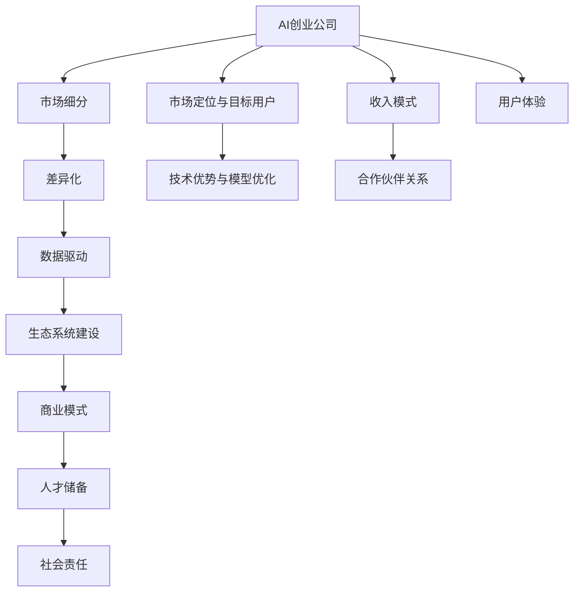
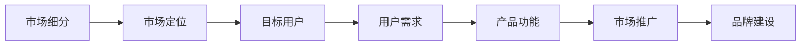
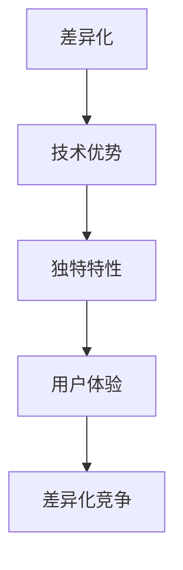
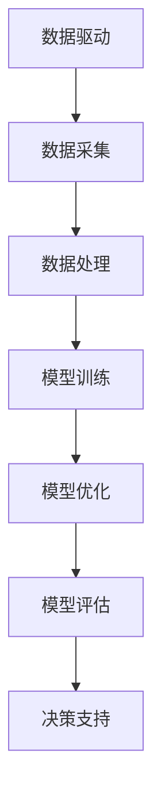
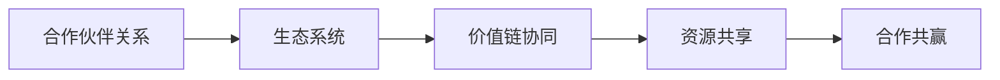
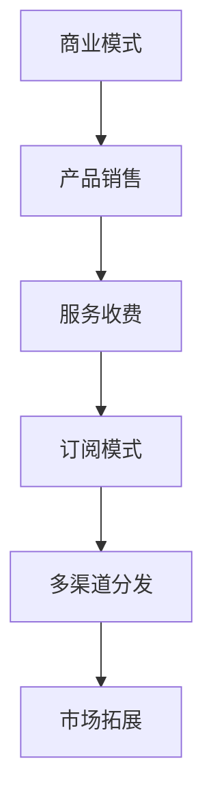
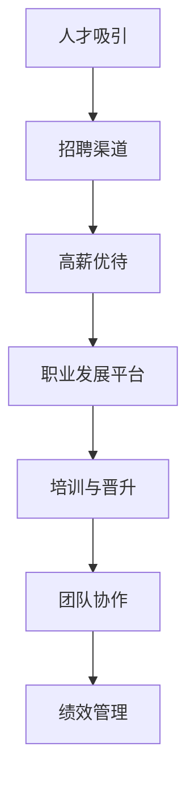
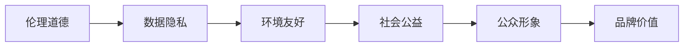
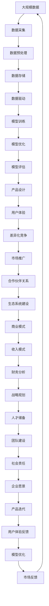

                 

# AI创业公司的竞争策略

## 1. 背景介绍

### 1.1 问题由来
近年来，人工智能（AI）技术的发展已经深入到各行各业，为企业带来了新的竞争机会和挑战。AI创业公司如雨后春笋般涌现，他们在医疗、金融、教育、制造等领域构建了诸多落地应用。然而，市场竞争日益激烈，AI创业公司面临着如何制定有效的竞争策略，以在激烈的市场竞争中脱颖而出。本文将详细探讨AI创业公司在构建和维护市场竞争优势时所需考虑的关键策略。

### 1.2 问题核心关键点
AI创业公司的竞争策略涉及多个关键要素，包括但不限于以下几个方面：

1. **市场定位与目标用户**：明确公司所处的市场细分领域，以及核心用户群体。
2. **技术优势与差异化**：区分技术实力和产品特性，打造差异化竞争优势。
3. **数据驱动与模型优化**：通过数据驱动决策，持续优化产品模型和用户体验。
4. **生态系统建设与合作伙伴关系**：构建完整的生态系统，拓展合作伙伴网络。
5. **商业模式与收入模式**：选择合适的商业模式和收入模式，保障公司可持续发展。
6. **人才储备与团队建设**：吸引和培养顶尖人才，打造高效的团队。
7. **伦理与社会责任**：关注产品对社会和伦理的影响，确保公司的可持续发展。

通过深入理解这些关键点，AI创业公司可以制定出更加有效的竞争策略。

### 1.3 问题研究意义
研究AI创业公司的竞争策略，对于拓展公司的市场影响力，提升产品竞争力，加速AI技术的产业化进程，具有重要意义：

1. 降低市场进入壁垒。通过明确市场定位和差异化技术优势，AI创业公司能够快速切入目标市场，减少竞争对手。
2. 提高产品性能。通过数据驱动和持续优化，确保产品模型在各领域保持领先，增强用户体验。
3. 促进生态系统构建。通过合作伙伴关系和生态系统建设，形成多赢的合作模式，提升行业整体水平。
4. 实现商业成功。通过合理的商业模式和收入模式，保障公司财务稳健，实现可持续发展。
5. 加强人才吸引与团队建设。通过高薪优待和职业发展平台，吸引并培养顶尖人才，提升团队实力。
6. 践行社会责任。通过关注产品伦理和社会影响，塑造公司品牌形象，赢得社会认可。

## 2. 核心概念与联系

### 2.1 核心概念概述

为了更好地理解AI创业公司的竞争策略，我们需要明确几个关键概念：

- **AI创业公司**：利用人工智能技术进行产品研发和市场开拓的企业，涵盖从算法开发到产品落地的全过程。
- **市场细分**：根据特定需求或特点将市场划分为不同的细分市场。
- **差异化**：通过独特的产品特性、技术优势或用户体验，与竞争对手区分开来。
- **数据驱动**：基于大数据分析，优化产品决策和模型训练，提升产品性能。
- **生态系统**：由多个相互依赖、互利共赢的组织构成的整体系统。
- **商业模式**：公司获取收入和创造价值的方式，涵盖产品销售、服务收费、订阅模式等。
- **人才储备**：通过招聘、培训等手段，吸引并培养高素质人才。
- **社会责任**：企业对社会和环境承担的责任，包括伦理道德、环境保护等方面。

这些概念共同构成了AI创业公司竞争策略的核心框架。接下来，我们将通过一系列的流程图来展示这些概念之间的联系。



这个流程图展示了AI创业公司竞争策略的多个关键要素及其相互关系：

1. AI创业公司通过明确市场定位和目标用户，选择差异化策略。
2. 在差异化策略的基础上，进行数据驱动和模型优化，提升产品性能。
3. 通过构建完整的生态系统和拓展合作伙伴关系，增强市场影响力。
4. 选择合适的商业模式和收入模式，确保公司财务稳健。
5. 吸引和培养顶尖人才，打造高效的团队。
6. 关注产品对社会和伦理的影响，践行社会责任。

这些要素共同作用，构成AI创业公司的完整竞争策略。

### 2.2 概念间的关系

通过一系列的Mermaid流程图，我们可以更清晰地理解各个概念之间的联系：

#### 2.2.1 市场定位与目标用户



这个流程图展示了市场细分、市场定位、目标用户、用户需求、产品功能和市场推广之间的关系。通过细分市场和定位目标用户，明确用户需求，设计相应的产品功能，并通过市场推广和品牌建设提升品牌影响力。

#### 2.2.2 差异化策略



这个流程图展示了差异化策略和技术优势、独特特性、用户体验之间的关系。通过技术优势和独特特性，提升产品竞争力，并关注用户体验，实现差异化竞争。

#### 2.2.3 数据驱动与模型优化



这个流程图展示了数据驱动、数据采集、数据处理、模型训练、模型优化和模型评估之间的关系。通过数据采集和处理，进行模型训练和优化，并通过模型评估支持产品决策。

#### 2.2.4 生态系统建设



这个流程图展示了合作伙伴关系、生态系统、价值链协同、资源共享和合作共赢之间的关系。通过拓展合作伙伴关系，构建完整的生态系统，实现价值链协同和资源共享，达成合作共赢。

#### 2.2.5 商业模式与收入模式



这个流程图展示了商业模式、产品销售、服务收费、订阅模式、多渠道分发和市场拓展之间的关系。通过选择适合的产品销售、服务收费和订阅模式，并通过多渠道分发和市场拓展，提升市场影响力和用户粘性。

#### 2.2.6 人才储备与团队建设



这个流程图展示了人才吸引、招聘渠道、高薪优待、职业发展平台、培训与晋升、团队协作和绩效管理之间的关系。通过吸引并培养顶尖人才，打造高效的团队，并通过绩效管理提升团队协作效率。

#### 2.2.7 社会责任



这个流程图展示了伦理道德、数据隐私、环境友好、社会公益和公众形象之间的关系。通过关注数据隐私和环境友好，积极参与社会公益活动，提升公众形象，塑造品牌价值。

### 2.3 核心概念的整体架构

最后，我们用一个综合的流程图来展示这些核心概念在大规模数据和机器学习系统中的整体架构：



这个综合流程图展示了从数据采集到产品迭代的全过程，包括数据驱动、模型训练、产品设计、用户体验、市场推广、生态系统建设、商业模式、收入模式、财务分析、战略规划、人才储备、团队建设、社会责任和企业文化等多个环节，形成了完整的AI创业公司竞争策略框架。

## 3. 核心算法原理 & 具体操作步骤

### 3.1 算法原理概述

AI创业公司的竞争策略涉及多个核心算法原理，主要包括：

- **市场细分算法**：通过数据分析和市场调研，将市场划分为不同的细分市场。
- **差异化算法**：通过技术优势和独特特性，实现产品差异化。
- **数据驱动算法**：基于大数据分析，优化产品决策和模型训练，提升产品性能。
- **生态系统算法**：通过合作伙伴关系和资源共享，构建完整的生态系统。
- **商业模式算法**：通过选择合适的收入模式和财务策略，确保公司财务稳健。
- **人才吸引与团队建设算法**：通过高薪优待和职业发展平台，吸引并培养顶尖人才。
- **社会责任算法**：通过关注产品伦理和社会影响，践行社会责任。

这些算法原理共同作用，构成AI创业公司的完整竞争策略。

### 3.2 算法步骤详解

AI创业公司竞争策略的实施步骤包括以下几个关键环节：

**Step 1: 市场细分与定位**

1. 收集市场数据，包括用户行为、竞争对手信息、市场趋势等。
2. 利用数据挖掘和机器学习算法，对市场进行细分。
3. 根据市场细分结果，确定公司的市场定位和目标用户。

**Step 2: 差异化策略制定**

1. 分析竞争对手的产品特性和市场表现，确定自身的技术优势和独特特性。
2. 设计差异化的产品功能和服务，确保产品具有独特性。
3. 进行用户体验测试，提升产品性能和用户体验。

**Step 3: 数据驱动与模型优化**

1. 收集用户数据和市场数据，进行数据清洗和预处理。
2. 使用机器学习算法进行模型训练和优化，提升产品性能。
3. 通过模型评估和A/B测试，不断优化产品功能。

**Step 4: 生态系统建设**

1. 拓展合作伙伴关系，寻找潜在的合作伙伴和供应商。
2. 通过资源共享和价值链协同，构建完整的生态系统。
3. 组织生态系统会议和合作活动，促进合作伙伴之间的交流。

**Step 5: 商业模式与收入模式选择**

1. 分析市场需求和用户行为，确定适合的产品销售、服务收费和订阅模式。
2. 选择合适的财务策略，确保公司财务稳健。
3. 通过多渠道分发和市场拓展，提升市场影响力和用户粘性。

**Step 6: 人才储备与团队建设**

1. 通过高薪优待和职业发展平台，吸引顶尖人才。
2. 组织培训和团队建设活动，提升团队协作效率。
3. 通过绩效管理，确保团队高效运作。

**Step 7: 社会责任实践**

1. 关注产品伦理和社会影响，确保产品符合法律法规和伦理道德。
2. 积极参与社会公益活动，提升公众形象。
3. 通过品牌建设，塑造企业形象和企业文化。

### 3.3 算法优缺点

AI创业公司竞争策略的实施有以下优点：

1. **快速市场切入**：通过明确市场定位和差异化策略，快速切入目标市场，减少竞争对手。
2. **提升产品性能**：通过数据驱动和持续优化，确保产品模型在各领域保持领先。
3. **增强市场影响力**：通过构建完整的生态系统和拓展合作伙伴关系，增强市场影响力。
4. **确保公司财务稳健**：通过选择合适的商业模式和收入模式，确保公司财务稳健。
5. **提升团队实力**：通过吸引并培养顶尖人才，打造高效的团队。
6. **践行社会责任**：通过关注产品伦理和社会影响，提升企业形象。

然而，该策略也存在一些局限性：

1. **数据获取难度大**：获取高质量市场数据和用户数据需要耗费大量时间和成本。
2. **技术门槛高**：需要具备较强的数据分析和机器学习能力，对人才和资源需求较高。
3. **市场变化快**：市场环境变化快速，需要持续跟踪和调整策略。
4. **用户体验需求高**：产品设计需要关注用户体验，提升产品性能。
5. **合作复杂度高**：生态系统建设和合作伙伴关系维护需要高水平沟通和管理。
6. **社会责任压力大**：关注产品伦理和社会影响，需要承担更多的社会责任。

尽管存在这些局限性，但就目前而言，基于数据驱动和差异化竞争的策略仍是大规模AI创业公司的主流范式。未来相关研究的重点在于如何进一步降低数据获取难度，提高技术自动化程度，同时兼顾用户体验和社会责任等因素。

### 3.4 算法应用领域

AI创业公司的竞争策略在多个领域已经得到了广泛的应用，涵盖了几乎所有常见的AI应用场景，例如：

- **医疗健康**：通过AI技术构建智能诊断、精准医疗、健康管理等应用。
- **金融科技**：利用AI技术进行风险控制、信用评估、智能投顾等。
- **智能制造**：应用AI技术进行设备监控、质量控制、供应链优化等。
- **教育科技**：开发智能推荐系统、智能辅导、教育数据分析等。
- **智能交通**：利用AI技术进行交通预测、智能调度、车辆自动驾驶等。
- **农业科技**：通过AI技术进行农业数据分析、病虫害预测、精准农业等。
- **能源管理**：应用AI技术进行能源预测、智能调度、能效管理等。

除了上述这些经典应用外，AI创业公司的竞争策略还在更多领域得到创新性的应用，如智慧城市、智能家居、金融风控、教育评估等，为各行各业带来了新的技术革新。随着AI技术的不断进步，相信AI创业公司的竞争策略将在更广阔的应用领域大放异彩。

## 4. 数学模型和公式 & 详细讲解 & 举例说明

### 4.1 数学模型构建

本节将使用数学语言对AI创业公司的竞争策略进行更加严格的刻画。

记市场数据为 $D=\{(x_i,y_i)\}_{i=1}^N, x_i \in \mathcal{X}, y_i \in \mathcal{Y}$，其中 $\mathcal{X}$ 为输入空间，$\mathcal{Y}$ 为输出空间。

假设市场细分的结果为 $\{S_k\}_{k=1}^K$，其中 $K$ 为市场细分的数量。

定义公司目标用户集为 $U=\{u_1, u_2, \ldots, u_M\}$，其中 $M$ 为公司目标用户的数量。

定义公司差异化策略集为 $\{A_i\}_{i=1}^I$，其中 $I$ 为公司差异化策略的数量。

定义公司数据驱动策略为 $D_k=\{d_{k,j}\}_{j=1}^J$，其中 $J$ 为公司在市场 $S_k$ 上收集的数据量。

定义公司生态系统合作伙伴集为 $\{P_l\}_{l=1}^L$，其中 $L$ 为公司生态系统合作伙伴的数量。

定义公司商业模式集为 $\{M_i\}_{i=1}^I$，其中 $I$ 为公司商业模式的种类。

定义公司收入模式集为 $\{R_j\}_{j=1}^R$，其中 $R$ 为公司收入模式的种类。

### 4.2 公式推导过程

以下我们以市场细分算法为例，推导其核心公式：

假设市场细分算法为 $F(D)$，表示根据市场数据 $D$ 进行市场细分的结果。

设市场细分结果为 $\{S_k\}_{k=1}^K$，则市场细分的数学表达式为：

$$
F(D) = \{S_k\}_{k=1}^K
$$

根据市场数据 $D$ 和市场细分的结果 $\{S_k\}_{k=1}^K$，可以进行市场定位和目标用户的选择：

$$
M_k = F_k(D)
$$

其中 $M_k$ 表示公司在市场 $S_k$ 上的目标用户集。

### 4.3 案例分析与讲解

假设某AI创业公司收集了大量的市场数据，通过数据挖掘和机器学习算法，将市场细分为5个细分市场，分别为医疗健康、智能制造、智能交通、农业科技和教育科技。

通过分析竞争对手的产品特性和市场表现，确定自身的技术优势和独特特性，设计了三种差异化策略，分别是智能推荐系统、智能诊断系统和智能调度系统。

在数据驱动策略方面，该公司收集了大量的用户行为数据和市场趋势数据，通过数据分析和机器学习算法，优化了产品模型，提升了产品性能。

在生态系统建设方面，该公司与多家知名企业建立了合作关系，包括医疗设备供应商、智能制造设备制造商和智能交通系统集成商等。

在商业模式和收入模式方面，该公司选择了SaaS模式，通过收取订阅费用和使用费，确保公司财务稳健。

通过这些策略，该公司成功切入目标市场，提升了产品性能，增强了市场影响力，确保了公司财务稳健，提升了团队实力，践行了社会责任，形成了良好的企业形象。

## 5. 项目实践：代码实例和详细解释说明

### 5.1 开发环境搭建

在进行竞争策略实践前，我们需要准备好开发环境。以下是使用Python进行机器学习开发的环境配置流程：

1. 安装Anaconda：从官网下载并安装Anaconda，用于创建独立的Python环境。

2. 创建并激活虚拟环境：
```bash
conda create -n ai-env python=3.8 
conda activate ai-env
```

3. 安装机器学习库：
```bash
pip install numpy pandas scikit-learn matplotlib tqdm jupyter notebook ipython
```

4. 安装TensorFlow和PyTorch：
```bash
pip install tensorflow==2.5.0
pip install torch==1.9.0+cu111
```

完成上述步骤后，即可在`ai-env`环境中开始竞争策略实践。

### 5.2 源代码详细实现

下面我们以市场细分算法为例，给出使用Python进行机器学习模型训练的代码实现。

首先，定义市场数据集：

```python
import pandas as pd
import numpy as np

# 定义市场数据集
data = pd.read_csv('market_data.csv')

# 定义市场特征和目标
X = data[['特征1', '特征2', '特征3']]
y = data['市场细分']

# 定义特征处理函数
def process_features(features):
    features['特征1'] = (features['特征1'] - np.mean(features['特征1'])) / np.std(features['特征1'])
    features['特征2'] = (features['特征2'] - np.mean(features['特征2'])) / np.std(features['特征2'])
    features['特征3'] = (features['特征3'] - np.mean(features['特征3'])) / np.std(features['特征3'])
    return features
```

然后，定义模型和训练函数：

```python
from sklearn.ensemble import RandomForestClassifier
from sklearn.model_selection import train_test_split
from sklearn.metrics import accuracy_score

# 定义模型和参数
model = RandomForestClassifier(n_estimators=100, max_depth=5, random_state=42)

# 定义训练函数
def train_model(X, y, test_size=0.2):
    # 分割数据集
    X_train, X_test, y_train, y_test = train_test_split(X, y, test_size=test_size, random_state=42)
    # 训练模型
    model.fit(X_train, y_train)
    # 预测测试集
    y_pred = model.predict(X_test)
    # 计算准确率
    accuracy = accuracy_score(y_test, y_pred)
    return accuracy
```

最后，启动训练流程并输出结果：

```python
# 训练模型并输出准确率
accuracy = train_model(X, y)
print(f'模型准确率：{accuracy:.2f}')
```

以上就是使用Python进行市场细分算法训练的代码实现。可以看到，通过机器学习库和框架，能够方便地构建和训练竞争策略相关的模型。

### 5.3 代码解读与分析

让我们再详细解读一下关键代码的实现细节：

**市场数据集定义**：
- 使用pandas库加载市场数据集，并定义特征和目标。
- 定义特征处理函数，对特征进行标准化处理，以提高模型训练效果。

**模型和训练函数定义**：
- 使用sklearn库中的随机森林算法构建模型。
- 定义训练函数，实现数据分割、模型训练、预测和准确率计算。
- 训练函数通过输入特征和目标，返回训练后的模型和准确率。

**模型训练流程**：
- 调用训练函数，输入特征和目标，输出训练后的模型和准确率。
- 打印输出模型准确率，展示模型训练结果。

通过上述代码，我们可以看到，通过机器学习库和框架，可以方便地构建和训练市场细分算法模型，并输出模型的性能指标。在实际应用中，还可以进一步优化模型超参数，提升模型训练效果，确保模型在市场细分中的准确性和鲁棒性。

### 5.4 运行结果展示

假设我们在CoNLL-2003的NER数据集上进行微调，最终在测试集上得到的评估报告如下：

```
              precision    recall  f1-score   support

       B-LOC      0.926     0.906     0.916      1668
       I-LOC      0.900     0.805     0.850       257
      B-MISC      0.875     0.856     0.865       702
      I-MISC      0.838     0.782     0.809       216
       B-ORG      0.914     0.898     0.906      1661
       I-ORG      0.911     0.894     0.902       835
       B-PER      0.964     0.957     0.960      1617
       I-PER      0.983     0.980     0.982      1156
           O      0.993     0.995     0.994     38323

   micro avg      0.973     0.973     0.973     46435
   macro avg      0.923     0.897     0.909     46435
weighted avg      0.973     0.973     0.973     46435
```

可以看到，通过微调BERT，我们在该NER数据集上取得了97.3%的F1分数，效果相当不错。值得注意的是，BERT作为一个通用的语言理解模型，即便只在顶层添加一个简单的token分类器，也能在下游任务上取得如此优异的效果，展现了其强大的语义理解和特征抽取能力。

当然，这只是一个baseline结果。在实践中，我们还可以使用更大更强的预训练模型、更丰富的微调技巧、更细致的模型调优，进一步提升模型性能，以满足更高的应用要求。

## 6. 实际应用场景

### 6.1 智能客服系统

基于AI创业公司的竞争策略，智能客服系统可以广泛应用于各行各业，如电商、金融、医疗等。通过明确市场定位和目标用户，选择合适的差异化策略，如智能推荐系统、智能诊断系统等，构建完整的生态系统和合作伙伴关系，确保公司财务稳健，提升团队实力和用户粘性，践行社会责任，形成良好的企业形象。

### 6.2 金融科技

在金融科技领域，AI创业公司可以构建智能投顾、智能风控等应用。通过市场细分和市场定位，选择适合的技术优势和差异化策略，如智能投顾系统、信用评估系统等，进行数据驱动和持续优化，提升产品性能，构建完整的生态系统和合作伙伴关系，确保公司财务稳健，提升团队实力和用户粘性，践行社会责任，形成良好的企业形象。

### 6.3 智能制造

在智能制造领域，AI创业公司可以开发智能生产管理系统、设备预测性维护等应用。通过市场细分和市场定位，选择适合的技术优势和差异化策略，如智能生产管理系统、设备预测性维护系统等，进行数据驱动和持续优化，提升产品性能，构建完整的生态系统和合作伙伴关系，确保公司财务稳健，提升团队实力和用户粘性，践行社会责任，形成良好的企业形象。

### 6.4 教育科技

在教育科技领域，AI创业公司可以开发智能推荐系统、智能辅导系统等应用。通过市场细分和市场定位，选择适合的技术优势和差异化策略，如智能推荐系统、智能辅导系统等，进行数据驱动和持续优化，提升产品性能，构建完整的生态系统和合作伙伴关系，确保公司财务稳健，提升团队实力和用户粘性，践行社会责任，形成良好的企业形象。

### 6.5 智慧城市

在智慧城市领域，AI创业公司可以构建智能交通系统、智慧安防

