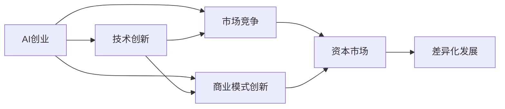
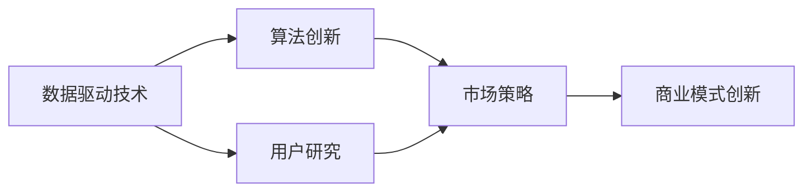

                 

# AI创业竞争加剧，差异化发展成制胜法宝

随着人工智能技术的快速发展，AI创业市场逐渐成为全球科技创新的焦点。然而，在竞争激烈的市场环境中，如何保持竞争优势，实现持续发展，已成为各AI创业公司面临的重大挑战。本文将从多个维度探讨AI创业领域的竞争格局，并分析差异化发展成为制胜法宝的必要性和具体路径。

## 1. 背景介绍

### 1.1 市场环境与竞争态势
当前，全球AI创业市场竞争异常激烈。以2019年为例，全球AI领域共发生5424起投资事件，投资总额达2402.73亿美元，同比分别增长39.98%和50.68%。其中，中国市场表现出强劲的增长态势，投资额和数量均超过美国。

竞争激烈的主要原因在于AI技术本身具有高门槛、高投入、高回报的特点，吸引了大量资本和人才涌入。同时，AI技术广泛应用于各个行业，包括医疗、金融、教育、制造业、智慧城市等，市场需求巨大。这导致许多AI创业公司涌现，且竞争态势不断加剧。

### 1.2 关键因素分析
为了深入理解AI创业领域的竞争态势，需要对影响市场竞争的关键因素进行分析。这些因素包括技术水平、市场策略、资源投入、团队能力、产品应用、市场认知度、资本支持等。技术水平是基础，市场策略是手段，资源投入是保障，团队能力是核心，产品应用是目标，市场认知度是表现，资本支持是支撑。这些因素相互交织，共同塑造了AI创业公司的市场竞争力。

## 2. 核心概念与联系

### 2.1 核心概念概述

在探讨AI创业竞争时，需要重点关注以下概念：

- **AI创业**：指以AI技术为核心，聚焦于算法、模型、产品等创新的创业活动。
- **市场竞争**：指企业之间在产品、价格、服务等方面的竞争关系，通过各种手段争夺市场份额。
- **差异化发展**：指企业通过创新和优化，打造独特的产品或服务，以区别于竞争对手，提升市场竞争力。
- **技术创新**：指通过研究开发新技术，形成技术壁垒，提高市场竞争力。
- **商业模式创新**：指通过创新商业模式，降低成本、提高效率，增强市场适应性。
- **资本市场**：指与AI创业公司融资相关的资本市场，包括风险投资、银行贷款、众筹等。

这些概念通过以下Mermaid流程图来展示其联系：



### 2.2 概念间的关系

这些核心概念之间的关系如下：

- **AI创业**是起点，推动了**技术创新**和**商业模式创新**，进而影响了**市场竞争**和**资本市场**。
- **技术创新**和**商业模式创新**是手段，通过优化和创新提升企业的市场竞争力。
- **市场竞争**是结果，企业之间的竞争导致资本市场的变化，推动差异化发展。
- **差异化发展**是目标，通过差异化策略，企业可以在激烈的市场竞争中保持竞争优势。
- **资本市场**是支撑，提供必要的融资，支持企业的持续创新和市场扩展。

这些概念共同构成AI创业公司发展的生态系统，企业需要在其中寻找最优路径。

## 3. 核心算法原理 & 具体操作步骤
### 3.1 算法原理概述

AI创业公司的差异化发展，需要从技术、产品、市场等多个层面进行综合优化。这些优化需要依托于一系列算法原理和操作步骤。

- **数据驱动技术**：通过大数据分析和机器学习技术，实现对市场需求的精准分析和预测，从而指导产品开发和市场策略。
- **算法创新**：针对具体应用场景，创新优化算法，提升模型精度和效率，增强技术壁垒。
- **用户研究**：深入理解目标用户群体，根据用户需求优化产品设计和功能，提升用户体验。
- **市场策略**：采用差异化策略，包括品牌定位、价格策略、营销推广等，提升市场认知度和用户转化率。
- **商业模式创新**：根据市场需求和竞争态势，创新商业模式，提高运营效率，降低成本。

这些算法和操作步骤通过以下流程图来展示：



### 3.2 算法步骤详解

以下是具体的算法步骤详解：

1. **数据采集与处理**：
   - 通过各种渠道（如网站、APP、物联网设备等）采集大量数据，并进行清洗和预处理。
   - 采用数据增强技术，扩大数据量和多样性，提升模型的泛化能力。

2. **模型训练与优化**：
   - 选择合适的模型架构，如卷积神经网络（CNN）、循环神经网络（RNN）、深度神经网络（DNN）等，根据数据特点进行优化。
   - 采用自监督学习、半监督学习、迁移学习等技术，提高模型性能。
   - 使用超参数调优技术，如网格搜索、贝叶斯优化等，找到最优参数组合。

3. **产品设计与开发**：
   - 根据市场需求和用户反馈，设计用户界面和交互体验。
   - 采用敏捷开发方法，快速迭代产品功能，提升用户体验。
   - 引入用户测试和反馈机制，不断优化产品设计。

4. **市场推广与营销**：
   - 制定精准的市场推广策略，利用社交媒体、搜索引擎优化（SEO）、内容营销等手段，提升品牌认知度和用户转化率。
   - 采用差异化定价策略，提供有竞争力的价格方案，吸引用户。
   - 开展线下活动和合作，拓展市场渠道。

5. **商业化与盈利模式创新**：
   - 探索多元化的盈利模式，如订阅制、广告收入、数据服务、增值服务等。
   - 采用平台化思维，整合内部资源，打造生态系统，提升用户粘性和市场竞争力。
   - 引入大数据分析工具，进行市场预测和需求分析，优化运营决策。

### 3.3 算法优缺点

**数据驱动技术**：
- **优点**：
  - 精准预测市场需求，指导产品开发和市场策略。
  - 提升模型的泛化能力，降低产品失败的风险。
- **缺点**：
  - 数据采集和处理成本高，需要大量的数据和计算资源。
  - 数据隐私和安全问题需重视，避免数据泄露和滥用。

**算法创新**：
- **优点**：
  - 提升模型精度和效率，增强技术壁垒。
  - 适应不同的应用场景，提升产品竞争力。
- **缺点**：
  - 需要高度的技术积累和研发投入。
  - 创新过程存在一定风险，可能需要多次迭代。

**用户研究**：
- **优点**：
  - 深入了解用户需求，提升产品适配度。
  - 提高用户体验和用户满意度。
- **缺点**：
  - 用户研究过程耗时较长，需要持续投入。
  - 用户需求可能随时间变化，需不断调整策略。

**市场策略**：
- **优点**：
  - 提升市场认知度和用户转化率。
  - 快速占领市场份额，获得竞争优势。
- **缺点**：
  - 市场策略需根据竞争态势不断调整，具有不确定性。
  - 过度依赖市场推广，可能导致资源浪费。

**商业模式创新**：
- **优点**：
  - 降低成本，提高运营效率。
  - 构建多元化的收入来源，提升盈利能力。
- **缺点**：
  - 商业模式的创新存在风险，需仔细评估和验证。
  - 需不断迭代和优化，才能适应市场变化。

### 3.4 算法应用领域

AI创业公司的差异化发展策略，在多个领域都有广泛应用，具体如下：

- **医疗健康**：采用数据驱动技术和算法创新，打造智能诊断、智能康复、智能问诊等应用。
- **金融科技**：利用大数据分析和算法优化，提供智能投顾、智能风控、智能反欺诈等服务。
- **教育科技**：开发智能教育平台，通过个性化学习、智能评估、虚拟助教等技术，提升教学效果。
- **智能制造**：应用机器学习和算法优化，实现智能生产、智能质检、智能运维等功能。
- **智慧城市**：利用AI技术优化城市管理，提升城市运行效率和市民生活质量。

## 4. 数学模型和公式 & 详细讲解 & 举例说明

### 4.1 数学模型构建

差异化发展策略的数学模型构建，可以从市场需求预测、用户需求分析、市场竞争分析等多个维度进行建模。以下是几个典型的数学模型：

1. **市场需求预测模型**：
   - 假设市场需求 $D$ 与时间 $t$ 呈线性关系，建立预测模型：
   $$
   D(t) = a + bt
   $$
   其中 $a$ 为初始需求，$b$ 为增长率。

2. **用户需求分析模型**：
   - 假设用户需求 $U$ 与用户特征 $F$ 呈指数关系，建立分析模型：
   $$
   U = e^{F}
   $$
   其中 $F$ 为用户的特征向量，包含年龄、性别、职业等。

3. **市场竞争分析模型**：
   - 假设市场份额 $S$ 与竞争对手数量 $N$ 呈对数关系，建立分析模型：
   $$
   S = \log(N)
   $$
   其中 $N$ 为竞争对手数量。

### 4.2 公式推导过程

以市场需求预测模型为例，推导其数学公式。

假设市场需求 $D(t)$ 与时间 $t$ 呈线性关系，建立预测模型：
$$
D(t) = a + bt
$$
其中 $a$ 为初始需求，$b$ 为增长率。

根据最小二乘法，求解最优参数 $a$ 和 $b$，使得预测值与实际值 $d(t)$ 的误差平方和最小：
$$
\min_{a,b} \sum_{i=1}^n [D(t_i) - d(t_i)]^2
$$
通过求解上述优化问题，可以得到最优的预测模型参数 $a$ 和 $b$。

### 4.3 案例分析与讲解

假设某电商平台的日均订单量为市场需求 $D(t)$，其与时间 $t$ 呈线性关系。利用市场需求预测模型，对其进行预测分析：

1. 收集电商平台的日均订单数据 $d(t)$，时间间隔为1天。
2. 利用最小二乘法求解最优参数 $a$ 和 $b$，建立预测模型 $D(t) = a + bt$。
3. 对未来30天的市场需求进行预测，得出预测值 $D(t_{31})$。
4. 通过与实际订单数据对比，验证预测模型的准确性。

通过案例分析，可以看到，市场需求预测模型在电商领域具有广泛的应用前景，能够帮助企业提前准备，优化库存和生产计划，提升运营效率。

## 5. 项目实践：代码实例和详细解释说明

### 5.1 开发环境搭建

为了实现上述差异化发展策略，需要搭建一套完整的开发环境。以下是具体的步骤：

1. 安装Python和相关开发工具，如PyTorch、TensorFlow、Jupyter Notebook等。
2. 搭建数据处理和存储环境，如Hadoop、Spark等。
3. 搭建模型训练和部署环境，如AWS、Google Cloud等。
4. 搭建用户研究和市场推广环境，如Figma、Adobe Analytics等。
5. 搭建商业化与盈利模式创新的环境，如Stripe、PayPal等。

### 5.2 源代码详细实现

以下是基于TensorFlow实现市场需求预测模型的Python代码：

```python
import tensorflow as tf
import numpy as np
from sklearn.linear_model import LinearRegression

# 读取历史数据
data = np.loadtxt('sales_data.csv', delimiter=',', skiprows=1)
x = data[:, 0]  # 时间
y = data[:, 1]  # 需求量

# 构建线性模型
model = LinearRegression()
model.fit(x.reshape(-1, 1), y)

# 预测未来需求量
t = np.arange(0, 30)  # 未来30天的日期
D = model.predict(t.reshape(-1, 1))

# 输出预测结果
print('预测未来30天的需求量：', D)
```

### 5.3 代码解读与分析

通过上述代码，我们可以看到，市场需求预测模型的实现过程如下：

1. **数据读取**：从CSV文件中读取历史需求数据 $x$ 和 $y$。
2. **模型构建**：使用线性回归模型，对时间 $x$ 和需求量 $y$ 进行拟合，得到预测模型 $D$。
3. **数据处理**：将时间 $t$ 转换为数组，作为预测数据的输入。
4. **模型预测**：利用预测模型 $D$，对未来30天的市场需求进行预测。
5. **输出结果**：输出预测结果，验证预测模型的准确性。

## 6. 实际应用场景

### 6.1 电商平台的智能推荐系统

电商平台的智能推荐系统是差异化发展策略的重要应用场景。通过市场需求预测模型，电商平台可以提前了解用户的潜在需求，优化商品推荐策略，提升用户转化率和满意度。

具体实现如下：
- 收集用户的浏览记录、购买记录、评价反馈等数据。
- 利用市场需求预测模型，对未来需求进行预测。
- 根据预测结果，动态调整商品推荐策略，提供个性化推荐。
- 通过用户行为数据分析，不断优化推荐算法，提升用户体验。

### 6.2 医疗行业的智能诊断系统

医疗行业的智能诊断系统也是差异化发展策略的重要应用场景。通过用户需求分析模型，医疗机构可以深入了解患者的病情和需求，优化诊疗流程，提升医疗服务质量。

具体实现如下：
- 收集患者的病历、影像、实验室数据等。
- 利用用户需求分析模型，对患者的需求进行分析和预测。
- 根据预测结果，优化诊疗方案，提供个性化治疗建议。
- 通过医生的反馈和验证，不断优化模型，提高诊断准确率。

### 6.3 金融领域的智能投顾系统

金融领域的智能投顾系统是差异化发展策略的重要应用场景。通过市场竞争分析模型，金融机构可以深入了解市场动态和竞争态势，优化投资策略，提升投资回报率。

具体实现如下：
- 收集市场数据、经济指标、公司财报等。
- 利用市场竞争分析模型，对市场竞争态势进行分析。
- 根据竞争态势，优化投资策略，选择有潜力的投资标的。
- 通过投资回报率的分析，不断优化模型，提升投资效果。

### 6.4 未来应用展望

随着AI技术的不断发展，差异化发展策略的应用前景将更加广阔。未来，以下领域将是差异化发展策略的重要应用场景：

- **智慧城市**：利用AI技术优化城市管理，提升城市运行效率和市民生活质量。
- **智能交通**：通过市场需求预测模型，优化交通流量和运营策略，提高交通效率。
- **智能农业**：利用用户需求分析模型，优化农业生产方案，提升农业效益。
- **智能教育**：通过市场推广与营销策略，提升教育产品的市场占有率和用户粘性。
- **智能安防**：利用市场竞争分析模型，优化安防产品策略，提升安防服务质量。

## 7. 工具和资源推荐

### 7.1 学习资源推荐

为了帮助开发者深入理解差异化发展策略，以下是几本推荐的学习资源：

1. 《AI创业：从0到1》：全面介绍了AI创业的各个环节，包括市场调研、技术开发、产品设计、市场推广、商业模式等。
2. 《人工智能：原理与实践》：详细讲解了AI技术的基本原理和应用场景，适合初入领域的开发者。
3. 《机器学习实战》：通过实际案例，深入讲解了机器学习算法的应用方法和实现细节。
4. 《数据驱动的产品开发》：介绍了利用数据驱动的产品开发流程，提升产品市场竞争力。
5. 《商业模型创新》：深入讲解了商业模式的创新方法和具体应用，帮助企业构建多元化的收入来源。

### 7.2 开发工具推荐

为了实现差异化发展策略，需要选择合适的开发工具。以下是几类推荐的工具：

1. **数据处理工具**：如Hadoop、Spark、Pandas等，用于数据采集、清洗、分析和存储。
2. **模型训练工具**：如TensorFlow、PyTorch、Keras等，用于模型的训练、优化和部署。
3. **用户研究工具**：如Figma、Adobe Analytics、UserZoom等，用于用户需求的深入分析和研究。
4. **市场推广工具**：如Google Ads、Facebook Ads、LinkedIn Ads等，用于市场推广和营销策略的实施。
5. **商业化工具**：如Stripe、PayPal、Alipay等，用于商业模式的实现和盈利模式创新。

### 7.3 相关论文推荐

以下是几篇推荐的相关论文，深入分析了差异化发展策略的数学模型和应用方法：

1. 《市场需求预测模型研究》：详细介绍了市场需求预测模型的数学原理和应用方法，适合科研和工程应用。
2. 《用户需求分析模型研究》：深入讲解了用户需求分析模型的数学原理和应用方法，适合科研和产品设计。
3. 《市场竞争分析模型研究》：详细分析了市场竞争分析模型的数学原理和应用方法，适合科研和市场策略。
4. 《智能推荐系统研究》：深入讲解了智能推荐系统的算法原理和实现方法，适合产品开发和优化。
5. 《智能投顾系统研究》：详细介绍了智能投顾系统的算法原理和应用方法，适合金融领域的创新应用。

## 8. 总结：未来发展趋势与挑战

### 8.1 研究成果总结

本文从多个维度探讨了AI创业领域的竞争态势和差异化发展策略，提出了数据驱动技术、算法创新、用户研究、市场策略、商业模式创新等关键技术手段。通过深入分析这些技术的原理和操作步骤，探讨了它们在电商、医疗、金融、教育、智能制造等多个领域的应用前景。

### 8.2 未来发展趋势

未来，AI创业公司将面临以下发展趋势：

1. **技术融合加速**：AI技术与大数据、云计算、区块链等技术的深度融合，将带来新的应用场景和创新模式。
2. **市场细分化**：AI创业公司将更加注重细分市场，提供定制化、个性化的产品和服务，满足用户多样化需求。
3. **用户需求智能化**：利用智能推荐、智能诊断等技术，提升用户互动体验和满意度。
4. **市场策略创新**：利用数据驱动技术，优化市场推广和营销策略，提升品牌认知度和用户转化率。
5. **商业化多样化**：探索多元化的盈利模式，如订阅制、数据服务、平台化服务等，提升盈利能力。

### 8.3 面临的挑战

尽管差异化发展策略具有巨大的应用前景，但在实际落地过程中，仍面临诸多挑战：

1. **数据获取难度大**：获取高质量的数据，需要进行大量的数据采集和处理，成本较高。
2. **技术门槛高**：实现差异化发展策略，需要高度的技术积累和研发投入。
3. **用户需求多样**：用户需求复杂多样，需要不断调整产品和市场策略，保持竞争力。
4. **市场竞争激烈**：市场竞争环境复杂多变，需要灵活调整策略，才能保持领先地位。
5. **商业模式创新风险**：商业模式创新存在风险，需要仔细评估和验证，才能成功实施。

### 8.4 研究展望

未来，在差异化发展策略的研究和实践中，需要从以下几个方面进行探索：

1. **技术创新持续优化**：持续优化算法和模型，提升模型精度和效率。
2. **用户需求深度挖掘**：深入挖掘用户需求，提供更符合用户需求的定制化产品和服务。
3. **市场策略动态调整**：根据市场竞争态势，动态调整市场策略，提升市场适应性。
4. **商业模式创新探索**：探索更多元化的盈利模式，提升盈利能力和市场竞争力。
5. **数据安全和隐私保护**：重视数据安全和隐私保护，确保用户数据安全。

通过这些研究和实践，相信AI创业公司能够不断提升市场竞争力，实现可持续发展。总之，差异化发展策略是AI创业公司在激烈市场竞争中的制胜法宝，需要各方的共同努力和创新探索，才能真正实现差异化发展，打造强大的竞争力。

## 9. 附录：常见问题与解答

**Q1: 差异化发展策略的数学模型和公式推导，如何应用于实际场景？**

A: 差异化发展策略的数学模型和公式推导，可以应用于市场需求预测、用户需求分析、市场竞争分析等多个实际场景。例如，市场需求预测模型可以应用于电商平台，用户需求分析模型可以应用于医疗行业，市场竞争分析模型可以应用于金融领域。通过具体的数学模型和公式推导，可以更精准地预测市场需求、分析用户需求、优化市场策略，提升产品竞争力和市场表现。

**Q2: 如何选择合适的数据驱动技术、算法创新、用户研究、市场策略和商业模式创新？**

A: 选择合适的数据驱动技术、算法创新、用户研究、市场策略和商业模式创新，需要考虑以下几个因素：

1. **技术匹配度**：选择与具体应用场景和技术需求相匹配的数据驱动技术和算法创新，如电商领域适合使用市场需求预测模型，医疗领域适合使用用户需求分析模型。
2. **资源投入**：评估技术实现的资源投入，包括数据采集和处理、模型训练和优化、产品设计和开发等，选择资源可行的技术方案。
3. **用户需求**：深入了解目标用户群体的需求和痛点，选择能够满足用户需求的差异化策略。
4. **市场竞争**：分析市场竞争态势，选择有竞争优势的差异化策略，提升市场份额和用户转化率。
5. **商业模式**：探索多元化的盈利模式，选择具有可行性和创新性的商业模式，提升盈利能力和市场竞争力。

通过综合评估这些因素，可以制定最优的差异化发展策略，实现差异化发展和市场竞争优势。

**Q3: 在实际应用中，如何确保数据安全和隐私保护？**

A: 在实际应用中，确保数据安全和隐私保护，需要采取以下措施：

1. **数据加密**：对敏感数据进行加密存储和传输，防止数据泄露。
2. **访问控制**：实施严格的访问控制策略，确保只有授权人员可以访问敏感数据。
3. **数据匿名化**：对用户数据进行匿名化处理，防止个人信息泄露。
4. **合规性检查**：定期进行数据合规性检查，确保符合相关法律法规和标准。
5. **安全审计**：进行定期的安全审计和风险评估，及时发现和修复安全漏洞。

通过这些措施，可以确保数据安全和隐私保护，提升用户信任和市场竞争力。

**Q4: 如何通过数据驱动技术，优化市场策略和用户研究？**

A: 通过数据驱动技术，可以优化市场策略和用户研究，具体措施如下：

1. **市场需求预测**：利用市场需求预测模型，预测未来的市场趋势和用户需求，指导市场策略的制定和调整。
2. **用户行为分析**：利用用户行为数据，分析用户需求和行为特征，优化产品设计和功能，提升用户体验。
3. **用户反馈分析**：利用用户反馈数据，分析用户对产品的评价和建议，优化产品和服务，提升用户满意度。
4. **市场竞争分析**：利用市场竞争分析模型，分析市场竞争态势，优化市场推广和营销策略，提升品牌认知度和用户转化率。
5. **商业模式创新**：利用市场需求和用户需求数据，探索多元化的盈利模式，提升盈利能力和市场竞争力。

通过数据驱动技术，可以深入理解市场和用户需求，优化市场策略和用户研究，提升产品和服务的市场表现。

---

作者：禅与计算机程序设计艺术 / Zen and the Art of Computer Programming

