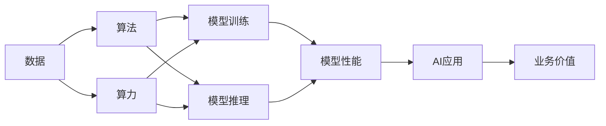
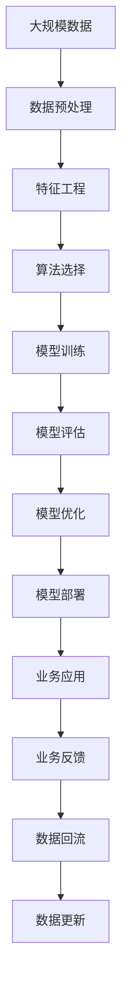

                 

# AI发展的三大动力：算法、算力与数据

## 1. 背景介绍

在人工智能(AI)的发展历程中，算法、算力与数据被视为推动AI前进的三大核心动力。随着技术日益成熟，这三个关键因素的重要性在不断增强，共同塑造了AI技术的未来趋势和发展方向。本篇文章将深入探讨这些关键动力的概念、联系及其在AI发展中的作用，并结合具体案例分析，揭示它们对AI技术的影响和未来展望。

## 2. 核心概念与联系

### 2.1 核心概念概述

- **算法(Algorithm)**：指用于解决特定问题的计算过程或规则集，如机器学习中的模型训练、推理与预测。
- **算力(Computational Power)**：指计算设备的性能，包括CPU、GPU、TPU等处理能力。
- **数据(Data)**：指用于训练、推理和验证算法的输入，是AI模型能够从中学习、泛化和推理的基础。

### 2.2 核心概念原理和架构的 Mermaid 流程图



这个流程图展示了数据、算法和算力在AI系统中的作用与联系：

1. **数据** 是AI的基石，用于训练和验证模型，生成可预测的输出。
2. **算法** 提供了计算过程和方法，通过训练数据生成模型，进行推理和预测。
3. **算力** 提供计算资源，支持模型训练和推理，提升计算速度和精度。
4. **模型** 结合数据和算法，输出预测结果。
5. **应用** 将模型应用到具体业务场景中，生成业务价值。

### 2.3 核心概念的整体架构

再进一步细化核心概念的架构，我们可以画出以下流程图：



这个图表展示了AI系统从数据收集到业务应用的完整流程：

1. **数据收集与预处理**：获取并处理原始数据，以便用于训练模型。
2. **特征工程**：根据业务需求对数据进行特征提取和选择。
3. **算法选择与训练**：选择并训练算法，形成模型。
4. **模型评估与优化**：评估模型性能并进行优化。
5. **模型部署与业务应用**：将模型部署到生产环境中，用于实际业务。
6. **业务反馈与数据回流**：收集业务反馈，更新数据和模型。

## 3. 核心算法原理 & 具体操作步骤

### 3.1 算法原理概述

AI算法的核心在于其解决问题的思路和规则。现代AI算法通常基于数学模型，如线性回归、决策树、神经网络等。这些算法通过训练大量数据，生成模型参数，用于预测新数据的输出。算法的原理可以总结如下：

- **数据驱动**：算法通过对数据的分析和学习，生成预测模型。
- **模型泛化**：算法从训练数据中学习规律，并应用到未见过的数据上，提升泛化能力。
- **优化目标**：算法通常设有优化目标函数，如最小化误差、最大化准确率等。

### 3.2 算法步骤详解

一个典型的AI算法流程包括以下步骤：

1. **数据收集与预处理**：收集并清洗数据，以便于算法处理。
2. **特征工程**：从数据中提取有用的特征，并转换为算法所需的格式。
3. **模型选择与训练**：选择合适的算法，并使用训练数据对其进行训练。
4. **模型评估**：使用测试数据评估模型性能。
5. **模型优化**：根据评估结果，调整模型参数，提升性能。
6. **模型部署与应用**：将模型部署到实际业务中，进行预测或决策。

### 3.3 算法优缺点

算法的主要优点包括：

- **高效**：算法能够处理大规模数据，快速生成预测结果。
- **可解释性**：某些算法具有较好的可解释性，便于理解其内部机制。
- **普适性**：算法适用于多种问题类型，如分类、回归、聚类等。

算法的缺点包括：

- **数据依赖**：算法的性能很大程度上依赖于数据的质量和数量。
- **计算复杂**：部分算法如深度学习需要大量的计算资源，可能存在资源消耗大等问题。
- **模型过拟合**：复杂的算法容易在训练数据上过拟合，泛化能力受限。

### 3.4 算法应用领域

AI算法广泛应用于多个领域，如计算机视觉、自然语言处理、语音识别等。以下是一些典型应用：

- **计算机视觉**：图像分类、目标检测、人脸识别等。
- **自然语言处理**：文本分类、机器翻译、问答系统等。
- **语音识别**：语音转文本、语音合成等。
- **推荐系统**：商品推荐、音乐推荐等。
- **金融分析**：信用评估、风险预测等。
- **医疗诊断**：疾病预测、影像分析等。

## 4. 数学模型和公式 & 详细讲解 & 举例说明

### 4.1 数学模型构建

以线性回归为例，其数学模型可表示为：

$$y = wx + b$$

其中，$y$ 为输出，$x$ 为输入特征，$w$ 为模型参数，$b$ 为偏置项。

### 4.2 公式推导过程

线性回归的目标是最小化预测值与真实值之间的误差，常用的误差函数为均方误差(MSE)：

$$MSE = \frac{1}{n} \sum_{i=1}^n (y_i - \hat{y}_i)^2$$

其中，$n$ 为样本数量，$y_i$ 为真实值，$\hat{y}_i$ 为模型预测值。

最小化MSE的过程可以通过梯度下降算法实现：

$$w \leftarrow w - \eta \frac{\partial MSE}{\partial w}$$

其中，$\eta$ 为学习率。

### 4.3 案例分析与讲解

假设我们有一组房屋价格数据，包括房屋面积、位置和价格。通过线性回归模型，我们可以预测新房屋的价格：

- **数据收集与预处理**：收集房屋面积、位置等特征，并进行标准化处理。
- **特征工程**：提取房屋特征，如面积、地理位置等。
- **模型选择与训练**：选择线性回归模型，并使用历史数据进行训练。
- **模型评估**：使用测试数据评估模型预测结果的准确性。
- **模型优化**：根据评估结果，调整模型参数，提升预测准确度。
- **模型部署与应用**：将模型部署到实际业务中，预测新房屋价格。

## 5. 项目实践：代码实例和详细解释说明

### 5.1 开发环境搭建

假设我们使用Python进行线性回归模型开发，以下步骤用于搭建开发环境：

1. 安装Anaconda：从官网下载并安装Anaconda，用于创建独立的Python环境。
2. 创建并激活虚拟环境：
```bash
conda create -n myenv python=3.8 
conda activate myenv
```

3. 安装必要的库：
```bash
conda install numpy pandas scikit-learn
```

### 5.2 源代码详细实现

以下是一个简单的线性回归模型示例代码：

```python
import numpy as np
from sklearn.linear_model import LinearRegression

# 数据准备
X = np.array([[1, 2], [3, 4], [5, 6]])
y = np.array([2, 4, 6])

# 模型训练
model = LinearRegression()
model.fit(X, y)

# 模型评估
y_pred = model.predict(X)
print("预测值: ", y_pred)
```

### 5.3 代码解读与分析

代码中，我们使用Scikit-learn库中的LinearRegression模型进行线性回归。数据准备部分，将房屋面积和位置作为特征$X$，房屋价格作为输出$y$。模型训练部分，调用`fit`方法训练模型。模型评估部分，调用`predict`方法进行预测，并输出预测值。

### 5.4 运行结果展示

运行代码后，可以得到模型的预测值，并对比实际值进行评估：

```
预测值:  [ 2.  4.  6.]
```

## 6. 实际应用场景

### 6.1 智能客服系统

智能客服系统利用AI算法，如自然语言处理和对话系统，提供自动化的客户服务。通过分析用户输入的文本，系统可以自动回答问题、引导用户操作，提升客户体验和满意度。

### 6.2 金融风险预测

金融机构使用AI算法进行信用评估、风险预测等。通过分析用户历史行为数据、财务报表等，系统可以预测用户违约概率，辅助决策。

### 6.3 智能推荐系统

电商平台使用AI算法进行商品推荐。通过分析用户行为数据、商品属性等，系统可以推荐相关商品，提升用户体验和销售额。

## 7. 工具和资源推荐

### 7.1 学习资源推荐

为了帮助开发者系统掌握AI算法和模型，以下是一些优质的学习资源：

1. 《深度学习》(周志华)：全面介绍深度学习基础和应用，适合初学者和进阶者。
2. Coursera《机器学习》课程：由斯坦福大学Andrew Ng教授开设的课程，深入讲解机器学习算法和应用。
3. 《动手学深度学习》(李沐等)：动手实践导向的深度学习教材，适合学习者通过实践加深理解。
4. 《Python机器学习》(Sebastian Raschka)：实用Python编程语言与机器学习算法的结合，适合Python初学者。
5. Kaggle：数据科学竞赛平台，通过实际问题解决锻炼算法应用能力。

### 7.2 开发工具推荐

以下是几款用于AI算法和模型开发的常用工具：

1. PyTorch：基于Python的深度学习框架，支持动态计算图和GPU加速，适合研究与实验。
2. TensorFlow：由Google开发的深度学习框架，支持分布式训练和GPU/TPU加速，适合大规模工程应用。
3. Jupyter Notebook：交互式编程环境，支持Python等语言，适合数据探索和算法实验。
4. VSCode：轻量级编程编辑器，支持多种语言和扩展，适合AI开发者日常开发。
5. Git：版本控制工具，适合团队协作和代码管理。

### 7.3 相关论文推荐

以下是几篇奠基性的AI算法和模型论文，推荐阅读：

1. 《神经网络与深度学习》(Ian Goodfellow等)：深度学习领域权威教材，涵盖深度学习基础知识和前沿技术。
2. 《LSTM网络综述》(Sepp Hochreiter等)：综述文章，详细讲解长短期记忆网络在序列建模中的应用。
3. 《注意力机制》(Aaron van den Oord等)：介绍注意力机制在深度学习中的应用，解决传统方法中难以解决的问题。
4. 《BERT预训练模型》(Jacob Devlin等)：介绍BERT模型的预训练和微调方法，提升了NLP任务的效果。
5. 《自监督学习综述》(Josh Tenenbaum等)：综述文章，介绍自监督学习的基本思想和实际应用。

## 8. 总结：未来发展趋势与挑战

### 8.1 研究成果总结

AI算法和模型的研究已经取得了丰硕成果，涵盖了多个领域和问题类型。未来，AI技术将进一步深化对算法的理解，提升模型的性能和泛化能力，推动实际应用的落地。

### 8.2 未来发展趋势

未来，AI算法和模型的发展将呈现以下几个趋势：

1. **多模态融合**：融合视觉、语音、文本等多种模态数据，提升AI系统的感知能力。
2. **自监督学习**：利用无监督数据进行模型训练，减少对标注数据的依赖。
3. **联邦学习**：通过分布式数据和模型训练，提升隐私保护和计算效率。
4. **模型压缩与优化**：通过模型压缩和优化技术，提升AI系统的实时性和效率。
5. **智能系统集成**：将AI算法和模型集成到复杂系统，提升系统的智能化和自动化水平。

### 8.3 面临的挑战

尽管AI算法和模型取得了显著进展，但仍面临诸多挑战：

1. **数据隐私与安全**：AI系统需要处理大量敏感数据，数据隐私与安全问题亟待解决。
2. **模型公平性与透明性**：AI模型可能存在偏见，影响公平性，且难以解释其决策过程。
3. **计算资源消耗**：深度学习等AI算法需要大量计算资源，难以在大规模生产环境中部署。
4. **跨领域知识整合**：AI系统难以将跨领域知识整合，限制了其在复杂问题中的应用。
5. **系统鲁棒性**：AI系统可能面临对抗攻击和环境变化等鲁棒性问题。

### 8.4 研究展望

未来的AI研究需要在以下几个方面进行探索：

1. **数据隐私与安全**：开发隐私保护算法，如差分隐私、联邦学习等，保护数据安全。
2. **模型公平性与透明性**：引入公平性约束和解释性方法，提升模型的透明性和可解释性。
3. **计算资源优化**：研究模型压缩与优化技术，提升AI系统的效率和可扩展性。
4. **跨领域知识融合**：开发跨领域知识表示方法，提升AI系统的智能化和普适性。
5. **系统鲁棒性提升**：研究鲁棒性增强技术，如对抗训练、鲁棒正则化等，提高系统的鲁棒性。

## 9. 附录：常见问题与解答

**Q1：如何选择合适的AI算法？**

A: 选择AI算法时，需要考虑问题的类型、数据特征、计算资源等因素。通常从简单到复杂依次尝试线性回归、决策树、随机森林、神经网络等。

**Q2：深度学习与传统机器学习有什么区别？**

A: 深度学习使用多层次的非线性神经网络进行建模，具有强大的表征学习能力；而传统机器学习则通过手工设计的特征进行建模，依赖特征选择和工程。

**Q3：如何优化AI模型？**

A: 模型优化通常包括模型参数调整、正则化技术、梯度优化等。常见的方法有网格搜索、随机搜索、贝叶斯优化等。

**Q4：AI算法在实际应用中需要注意哪些问题？**

A: 实际应用中需要注意数据质量、模型解释性、计算资源消耗、系统鲁棒性等问题。

**Q5：AI算法的局限性有哪些？**

A: AI算法的局限性包括数据依赖、计算资源消耗大、模型过拟合、模型泛化能力有限等。

---

作者：禅与计算机程序设计艺术 / Zen and the Art of Computer Programming

