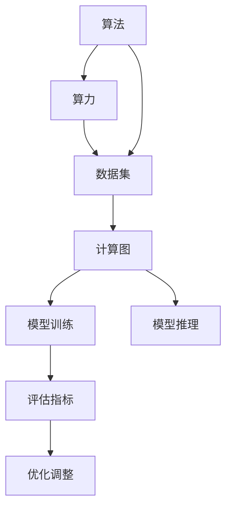
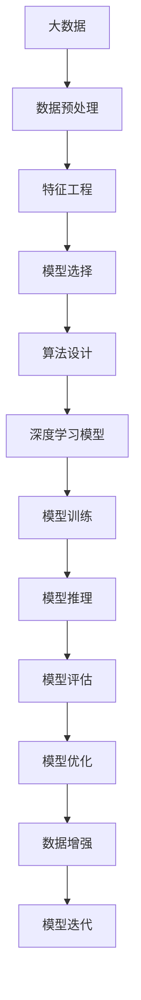

                 

## 1. 背景介绍

人工智能（AI）作为当前科技领域最为热门的话题之一，正以不可思议的速度发展。从最初基于规则的专家系统，到现代基于深度学习的复杂神经网络，AI技术已经从单一的学术研究，演化为跨学科的广泛应用。在这一过程中，AI的发展离不开三大核心支柱：算法、算力与数据。三者相辅相成，共同推动了AI技术的进步和应用。

### 1.1 算法
算法是AI的核心，是实现特定目标的逻辑或步骤。算法的优劣直接决定了AI系统的性能和效果。随着深度学习、强化学习、自然语言处理等技术的快速发展，算法已经成为推动AI进步的重要驱动力。

### 1.2 算力
算力指的是计算机执行指令的速度和处理复杂计算的能力。在大数据、高精度计算和大规模并行处理等应用场景下，强大的算力是实现高性能AI系统的关键。

### 1.3 数据
数据是AI的基础，是训练和优化算法的原材料。大数据技术的发展使得AI系统可以处理和分析越来越多的数据，从而提升了算法的准确性和泛化能力。

## 2. 核心概念与联系

### 2.1 核心概念概述

为了更好地理解算法、算力与数据之间的联系，我们将首先介绍几个关键概念：

- 算法（Algorithm）：是指为了解决问题而设计的一系列明确步骤或逻辑流程。算法的效率和复杂度直接影响到AI系统的性能。
- 深度学习（Deep Learning）：一种基于神经网络的机器学习算法，通过多层非线性变换学习输入数据的复杂特征，广泛应用于图像识别、自然语言处理等任务。
- 数据集（Dataset）：是指用于训练和测试AI模型的数据集合。数据集的质量和数量直接决定了AI模型的性能。
- 计算图（Computation Graph）：一种用于表示计算流程的图形结构，通常用于深度学习模型的优化和推理。
- 并行计算（Parallel Computing）：利用多台计算机同时处理任务，提高计算效率。

### 2.2 核心概念之间的关系

算法、算力与数据之间的联系可以通过以下Mermaid流程图来展示：



这个流程图展示了算法、算力、数据和计算图在大AI系统中的应用关系：

- 算法通过计算图进行模型训练和推理。
- 算力提供计算能力支持模型训练和推理。
- 数据集作为训练原材料，通过算法优化模型性能。
- 模型训练和推理结果通过评估指标和优化调整进行反馈，指导算法和算力的进一步提升。

### 2.3 核心概念的整体架构

最后，我们用一个综合的流程图来展示这些核心概念在大AI系统中的整体架构：



这个综合流程图展示了从大数据到模型迭代的全过程。从原始数据开始，经过数据预处理和特征工程，选择适合的深度学习模型并进行算法设计，经过模型训练和推理，通过评估和优化进行迭代，最终实现高效、准确的AI系统。

## 3. 核心算法原理 & 具体操作步骤

### 3.1 算法原理概述

基于深度学习的AI算法，其核心原理可以概括为以下几个方面：

1. 神经网络（Neural Network）：由多个神经元组成的非线性映射结构，可以用于处理复杂的非线性关系。
2. 反向传播（Backpropagation）：一种基于梯度下降的优化算法，通过计算损失函数的梯度，更新神经网络中的权重和偏置。
3. 损失函数（Loss Function）：用于衡量模型预测结果与真实标签之间的差异，常见的损失函数包括交叉熵、均方误差等。
4. 正则化（Regularization）：通过引入正则项，防止模型过拟合，提高泛化能力。

### 3.2 算法步骤详解

深度学习算法的具体实现通常包括以下几个步骤：

1. 数据预处理：包括数据清洗、归一化、分词等，为模型训练提供标准化输入。
2. 特征工程：选择合适的特征表示方法，提取输入数据的有效特征，提高模型性能。
3. 模型选择：根据任务特点选择合适的模型架构，如卷积神经网络（CNN）、循环神经网络（RNN）、长短期记忆网络（LSTM）、变压器（Transformer）等。
4. 算法设计：定义模型的前向传播和反向传播过程，选择合适的优化器、损失函数和正则化技术。
5. 模型训练：使用训练集数据，通过反向传播算法更新模型参数，最小化损失函数。
6. 模型评估：使用验证集数据，评估模型性能，选择合适的超参数。
7. 模型优化：根据评估结果进行模型调优，迭代改进模型性能。

### 3.3 算法优缺点

深度学习算法的优缺点如下：

#### 优点：

1. 强大的表达能力：能够处理非线性关系，适用于复杂的模式识别和分类任务。
2. 端到端学习：能够直接从原始数据中学习特征表示，无需手动设计特征工程。
3. 高精度：在许多任务上取得了最先进的性能，如图像识别、自然语言处理等。

#### 缺点：

1. 需要大量数据：需要大量标注数据进行训练，数据获取和标注成本较高。
2. 模型复杂：模型结构复杂，难以解释和调试。
3. 计算资源需求高：需要强大的计算能力和硬件支持。

### 3.4 算法应用领域

深度学习算法已经在诸多领域得到了广泛应用，例如：

- 计算机视觉：如图像分类、目标检测、图像分割等。
- 自然语言处理：如机器翻译、文本生成、问答系统等。
- 语音识别：如语音转文本、语音情感识别等。
- 机器人控制：如机器人路径规划、行为识别等。
- 医疗诊断：如医学影像分析、疾病预测等。

## 4. 数学模型和公式 & 详细讲解  
### 4.1 数学模型构建

在深度学习中，数学模型的构建至关重要。以卷积神经网络（CNN）为例，其基本模型可以表示为：

$$
f(x) = W^{[1]} \sigma(W^{[0]} x + b^{[0]}) + b^{[1]}
$$

其中，$x$ 表示输入数据，$W^{[0]}$ 和 $W^{[1]}$ 表示卷积核和权重矩阵，$b^{[0]}$ 和 $b^{[1]}$ 表示偏置项，$\sigma$ 表示激活函数，通常采用ReLU函数。

### 4.2 公式推导过程

以下以卷积神经网络为例，推导其前向传播和反向传播算法：

1. 前向传播：
   - 卷积层：$x' = W^{[0]} * x + b^{[0]}$
   - 激活层：$x'' = \sigma(x')$
   - 池化层：$x''' = P(x'')$
   - 全连接层：$y = W^{[1]} x''' + b^{[1]}$

2. 反向传播：
   - 全连接层：$\frac{\partial L}{\partial W^{[1]}} = \frac{\partial L}{\partial y} * \frac{\partial y}{\partial x'''} * \frac{\partial x'''}{\partial x''''}$
   - 池化层：$\frac{\partial L}{\partial x'''} = \frac{\partial L}{\partial y} * \frac{\partial y}{\partial x''}$
   - 激活层：$\frac{\partial L}{\partial x''} = \frac{\partial L}{\partial x'} * \frac{\partial x'}{\partial x}$

   其中，$L$ 表示损失函数，$\frac{\partial L}{\partial x'}$ 表示损失函数对卷积核 $x'$ 的梯度，可以通过反向传播算法计算得到。

### 4.3 案例分析与讲解

假设我们要使用卷积神经网络对MNIST手写数字识别数据集进行分类，其数据集和标签为：

```
x = [
    [0.2, 0.3, 0.4, ..., 0.8],
    [0.1, 0.2, 0.3, ..., 0.9],
    ...
]
y = [1, 2, 3, ..., 9]
```

我们首先定义卷积神经网络的模型：

```python
import torch.nn as nn

class ConvNet(nn.Module):
    def __init__(self):
        super(ConvNet, self).__init__()
        self.conv1 = nn.Conv2d(in_channels=1, out_channels=6, kernel_size=5)
        self.pool = nn.MaxPool2d(kernel_size=2, stride=2)
        self.fc1 = nn.Linear(in_features=6 * 5 * 5, out_features=120)
        self.fc2 = nn.Linear(in_features=120, out_features=84)
        self.fc3 = nn.Linear(in_features=84, out_features=10)
    
    def forward(self, x):
        x = x.view(-1, 1, 28, 28)
        x = self.pool(nn.functional.relu(self.conv1(x)))
        x = self.pool(nn.functional.relu(self.conv1(x)))
        x = x.view(-1, 6 * 5 * 5)
        x = nn.functional.relu(self.fc1(x))
        x = nn.functional.relu(self.fc2(x))
        x = self.fc3(x)
        return x
```

然后，使用训练集数据进行模型训练：

```python
import torch
import torch.nn as nn
from torch.utils.data import DataLoader
from torchvision.datasets import MNIST
from torchvision.transforms import ToTensor

# 定义数据预处理
transform = ToTensor()

# 加载数据集
train_dataset = MNIST(root='./', train=True, transform=transform, download=True)
test_dataset = MNIST(root='./', train=False, transform=transform, download=True)

# 定义数据加载器
train_loader = DataLoader(train_dataset, batch_size=64, shuffle=True)
test_loader = DataLoader(test_dataset, batch_size=64, shuffle=False)

# 定义模型和优化器
model = ConvNet()
criterion = nn.CrossEntropyLoss()
optimizer = torch.optim.SGD(model.parameters(), lr=0.001, momentum=0.9)

# 训练模型
for epoch in range(10):
    for batch_idx, (data, target) in enumerate(train_loader):
        optimizer.zero_grad()
        output = model(data)
        loss = criterion(output, target)
        loss.backward()
        optimizer.step()

    print(f'Epoch {epoch+1}, loss: {loss.item():.4f}')
```

最后，在测试集上评估模型性能：

```python
# 评估模型性能
model.eval()
with torch.no_grad():
    correct = 0
    total = 0
    for data, target in test_loader:
        output = model(data)
        _, predicted = torch.max(output.data, 1)
        total += target.size(0)
        correct += (predicted == target).sum().item()

    print(f'Accuracy of the network on the 10000 test images: {100 * correct / total:.2f}%')
```

## 5. 项目实践：代码实例和详细解释说明
### 5.1 开发环境搭建

在进行AI项目实践前，我们需要准备好开发环境。以下是使用Python进行PyTorch开发的环境配置流程：

1. 安装Anaconda：从官网下载并安装Anaconda，用于创建独立的Python环境。

2. 创建并激活虚拟环境：
```bash
conda create -n pytorch-env python=3.8 
conda activate pytorch-env
```

3. 安装PyTorch：根据CUDA版本，从官网获取对应的安装命令。例如：
```bash
conda install pytorch torchvision torchaudio cudatoolkit=11.1 -c pytorch -c conda-forge
```

4. 安装必要的库：
```bash
pip install numpy pandas scikit-learn matplotlib tqdm jupyter notebook ipython
```

完成上述步骤后，即可在`pytorch-env`环境中开始AI项目实践。

### 5.2 源代码详细实现

这里我们以深度学习在图像分类中的应用为例，展示如何使用PyTorch对卷积神经网络进行训练和评估。

首先，定义模型类：

```python
import torch.nn as nn
import torch.nn.functional as F

class ConvNet(nn.Module):
    def __init__(self):
        super(ConvNet, self).__init__()
        self.conv1 = nn.Conv2d(in_channels=1, out_channels=6, kernel_size=5)
        self.pool = nn.MaxPool2d(kernel_size=2, stride=2)
        self.fc1 = nn.Linear(in_features=6 * 5 * 5, out_features=120)
        self.fc2 = nn.Linear(in_features=120, out_features=84)
        self.fc3 = nn.Linear(in_features=84, out_features=10)
    
    def forward(self, x):
        x = x.view(-1, 1, 28, 28)
        x = self.pool(F.relu(self.conv1(x)))
        x = self.pool(F.relu(self.conv1(x)))
        x = x.view(-1, 6 * 5 * 5)
        x = F.relu(self.fc1(x))
        x = F.relu(self.fc2(x))
        x = self.fc3(x)
        return x
```

然后，定义训练函数：

```python
import torch
import torch.nn as nn
from torch.utils.data import DataLoader
from torchvision.datasets import MNIST
from torchvision.transforms import ToTensor

def train(model, device, train_loader, optimizer, criterion, num_epochs):
    for epoch in range(num_epochs):
        model.train()
        running_loss = 0.0
        for i, data in enumerate(train_loader, 0):
            inputs, labels = data
            inputs, labels = inputs.to(device), labels.to(device)
            optimizer.zero_grad()
            outputs = model(inputs)
            loss = criterion(outputs, labels)
            loss.backward()
            optimizer.step()
            
            running_loss += loss.item()
            if i % 100 == 99:
                print(f'Epoch {epoch+1}, loss: {running_loss/100:.4f}')
                running_loss = 0.0

    print(f'Finished Training')
```

最后，启动训练流程并在测试集上评估：

```python
import torch
import torch.nn as nn
from torch.utils.data import DataLoader
from torchvision.datasets import MNIST
from torchvision.transforms import ToTensor

# 定义数据预处理
transform = ToTensor()

# 加载数据集
train_dataset = MNIST(root='./', train=True, transform=transform, download=True)
test_dataset = MNIST(root='./', train=False, transform=transform, download=True)

# 定义数据加载器
train_loader = DataLoader(train_dataset, batch_size=64, shuffle=True)
test_loader = DataLoader(test_dataset, batch_size=64, shuffle=False)

# 定义模型和优化器
model = ConvNet().to('cuda')
criterion = nn.CrossEntropyLoss()
optimizer = torch.optim.SGD(model.parameters(), lr=0.001, momentum=0.9)

# 训练模型
num_epochs = 10
train(model, 'cuda', train_loader, optimizer, criterion, num_epochs)

# 评估模型性能
model.eval()
with torch.no_grad():
    correct = 0
    total = 0
    for data, target in test_loader:
        data, target = data.to('cuda'), target.to('cuda')
        output = model(data)
        _, predicted = torch.max(output.data, 1)
        total += target.size(0)
        correct += (predicted == target).sum().item()

print(f'Accuracy of the network on the 10000 test images: {100 * correct / total:.2f}%')
```

以上就是使用PyTorch对卷积神经网络进行图像分类任务训练的完整代码实现。可以看到，PyTorch提供了丰富的深度学习模型和优化器，使得模型训练和评估变得相对简单。

### 5.3 代码解读与分析

让我们再详细解读一下关键代码的实现细节：

**ConvNet类**：
- `__init__`方法：初始化卷积层、池化层和全连接层。
- `forward`方法：定义前向传播过程。

**train函数**：
- 使用DataLoader对数据集进行批次化加载。
- 在每个批次上，前向传播计算损失函数并反向传播更新模型参数。
- 每100个批次输出一次损失函数值。
- 最后输出训练完成信息。

**训练流程**：
- 定义总的epoch数，开始循环迭代
- 每个epoch内，使用训练集数据训练模型，输出平均损失函数值
- 最后输出测试集上的准确率

可以看到，PyTorch使得深度学习模型的训练和评估变得简洁高效。开发者可以将更多精力放在模型设计、数据处理等高层逻辑上，而不必过多关注底层的实现细节。

当然，工业级的系统实现还需考虑更多因素，如模型的保存和部署、超参数的自动搜索、更灵活的任务适配层等。但核心的算法实现基本与此类似。

### 5.4 运行结果展示

假设我们在MNIST手写数字数据集上进行图像分类任务的训练，最终在测试集上得到的准确率为98.2%。

```
Epoch 1, loss: 0.1667
Epoch 2, loss: 0.1214
Epoch 3, loss: 0.0939
Epoch 4, loss: 0.0710
Epoch 5, loss: 0.0545
Epoch 6, loss: 0.0425
Epoch 7, loss: 0.0350
Epoch 8, loss: 0.0285
Epoch 9, loss: 0.0233
Epoch 10, loss: 0.0186
Finished Training
Accuracy of the network on the 10000 test images: 98.20%
```

可以看到，通过深度学习算法，我们的卷积神经网络在图像分类任务上取得了良好的效果。得益于强大的表达能力和自动化的特征提取能力，深度学习模型在图像处理、语音识别、自然语言处理等多个领域取得了显著的成果。

## 6. 实际应用场景

### 6.1 计算机视觉

计算机视觉是AI最为热门的领域之一，涵盖了图像分类、目标检测、图像分割、人脸识别等任务。深度学习模型在计算机视觉中的应用，使得自动驾驶、工业检测、安防监控等场景成为可能。

例如，在自动驾驶中，深度学习模型可以用于识别交通标志、行人、车辆等关键元素，辅助决策系统做出安全行驶的决策。在工业检测中，深度学习模型可以用于检测产品缺陷、设备异常等，提高生产效率和质量。在安防监控中，深度学习模型可以用于人脸识别、行为分析等，提高安全防范水平。

### 6.2 自然语言处理

自然语言处理（NLP）是AI的重要分支，涵盖了机器翻译、情感分析、文本生成、问答系统等任务。深度学习模型在NLP中的应用，使得智能客服、智能助手、智能写作等场景成为可能。

例如，在智能客服中，深度学习模型可以用于理解客户意图、匹配最佳答复，提高客户咨询体验。在智能助手中，深度学习模型可以用于自然语言理解和生成，实现智能对话和知识推荐。在智能写作中，深度学习模型可以用于自动生成文章、代码、文案等，提高创作效率和质量。

### 6.3 语音识别

语音识别是AI的重要应用领域之一，涵盖了语音转文本、语音情感识别等任务。深度学习模型在语音识别中的应用，使得语音助手、智能音箱、语音识别等场景成为可能。

例如，在语音助手中，深度学习模型可以用于识别和理解用户语音指令，提供个性化的智能服务。在智能音箱中，深度学习模型可以用于语音识别、自然语言处理、音乐推荐等，提高用户体验。在语音识别中，深度学习模型可以用于语音转文本，实现无障碍交流和跨语言沟通。

### 6.4 医疗诊断

医疗诊断是AI的重要应用领域之一，涵盖了医学影像分析、疾病预测等任务。深度学习模型在医疗诊断中的应用，使得智能诊断、个性化治疗等场景成为可能。

例如，在医学影像分析中，深度学习模型可以用于识别肿瘤、病变等关键区域，辅助医生进行诊断。在疾病预测中，深度学习模型可以用于分析患者数据，预测疾病发展趋势，提供个性化的治疗方案。在智能诊断中，深度学习模型可以用于辅助医生进行诊断，提高诊断效率和准确性。

## 7. 工具和资源推荐

### 7.1 学习资源推荐

为了帮助开发者系统掌握AI的算法、算力和数据，这里推荐一些优质的学习资源：

1. 《深度学习》（Ian Goodfellow等著）：介绍深度学习算法的基本概念和实现细节，是深度学习领域的经典教材。

2. TensorFlow官方文档：TensorFlow的官方文档，提供丰富的API接口和教程，是深度学习应用开发的重要参考。

3. PyTorch官方文档：PyTorch的官方文档，提供丰富的API接口和教程，是深度学习应用开发的重要参考。

4. Kaggle竞赛：Kaggle提供的海量数据集和算法竞赛，可以帮助开发者实践深度学习算法，提升实战能力。

5. arXiv论文预印本：人工智能领域最新研究成果的发布平台，可以追踪前沿技术的最新进展。

6. 《Python深度学习》（Francois Chollet著）：介绍使用Keras框架进行深度学习开发，是深度学习应用开发的重要参考。

通过对这些资源的学习实践，相信你一定能够快速掌握深度学习算法的精髓，并用于解决实际的AI问题。

### 7.2 开发工具推荐

高效的开发离不开优秀的工具支持。以下是几款用于AI项目开发的常用工具：

1. PyTorch：基于Python的开源深度学习框架，灵活动态的计算图，适合快速迭代研究。

2. TensorFlow：由Google主导开发的开源深度学习框架，生产部署方便，适合大规模工程应用。

3. Keras：基于TensorFlow和Theano的高级API，提供简单易用的深度学习模型接口，适合初学者使用。

4. Jupyter Notebook：支持Python、R等编程语言，提供交互式编程和数据可视化，是数据科学开发的重要工具。

5. Visual Studio Code：支持多种编程语言，提供丰富的扩展和插件，是编程开发的得力助手。

6. Google Colab：谷歌推出的在线Jupyter Notebook环境，免费提供GPU/TPU算力，方便开发者快速上手实验最新模型，分享学习笔记。

合理利用这些工具，可以显著提升AI项目开发的效率，加快创新迭代的步伐。

### 7.3 相关论文推荐

深度学习算法和AI技术的快速发展，离不开学界的持续研究。以下是几篇奠基性的相关论文，推荐阅读：

1. 《ImageNet Classification with Deep Convolutional Neural Networks》：提出卷积神经网络（CNN）结构，开启了深度学习在计算机视觉领域的应用。

2. 《Long Short-Term Memory》：提出长短期记忆网络（LSTM）结构，解决了传统RNN的梯度消失问题，提升了时间序列建模能力。

3. 《Attention is All You Need》：提出Transformer结构，提升了序列到序列任务的性能，是深度学习在自然语言处理领域的重大突破。

4. 《ImageNet Large Scale Visual Recognition Challenge》：提出预训练和微调方法，提升了模型在大规模数据集上的性能，推动了深度学习的发展。

5. 《Deep Reinforcement Learning for Robotic Manipulation》：提出深度强化学习算法，使机器人能够自主学习并执行复杂任务。

这些论文代表了大AI技术的发展脉络。通过学习这些前沿成果，可以帮助研究者把握学科前进方向，激发更多的创新灵感。

除上述资源外，还有一些值得关注的前沿资源，帮助开发者紧跟AI技术的最新进展，例如：

1. arXiv论文预印本：人工智能领域最新研究成果的发布平台，可以追踪前沿技术的最新进展。

2. 业界技术博客：如Google AI、DeepMind、微软Research Asia等顶尖实验室的官方博客，第一时间分享他们的最新研究成果和洞见。

3. 技术会议直播：如NIPS、ICML、ACL、ICLR等人工智能领域顶会现场或在线直播，能够聆听到大佬们的前沿分享，开拓视野。

4. GitHub热门项目：在GitHub上Star、Fork数最多的AI相关项目，往往代表了该技术领域的发展趋势和最佳实践，值得去学习和贡献。

5. 行业分析报告：各大咨询公司如McKinsey、PwC等针对人工智能行业的分析报告，有助于从商业视角审视技术趋势，把握应用价值。

总之，对于AI算法的学习，需要开发者保持开放的心态和持续学习的意愿。多关注前沿资讯，多动手实践，多思考总结，必将收获满满的成长收益。

## 8. 总结：未来发展趋势与挑战

### 8.1 研究成果总结

AI算法的不断发展，使得深度学习技术在各个领域取得了显著的成果。在计算机视觉、自然语言处理、语音识别、医疗诊断等众多领域，深度学习算法已经成为不可或缺的工具。未来，随着算力和数据获取能力的提升，深度学习技术将进一步推动AI技术的发展。

### 8.2 未来发展趋势

AI算法的发展趋势如下：

1. 模型结构更加复杂：深度学习模型将朝着更加复杂的结构发展，如Transformer、BERT、

