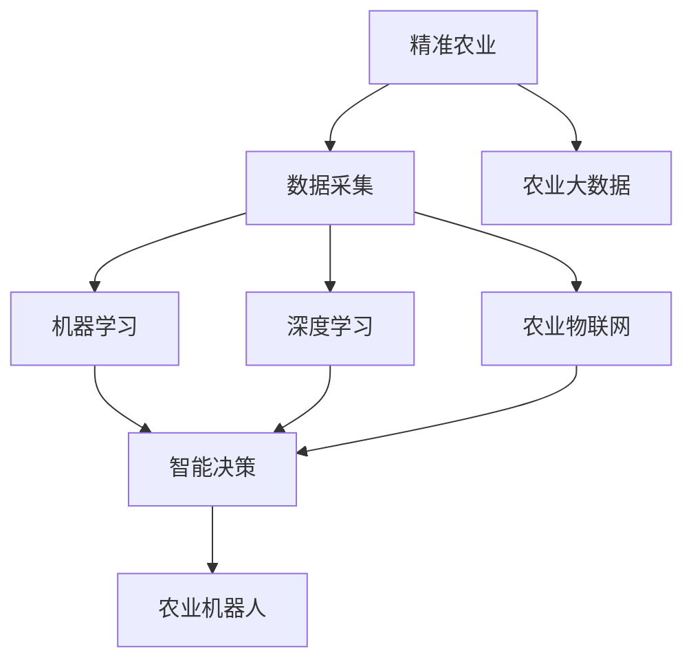
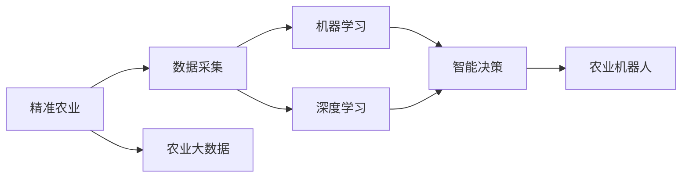
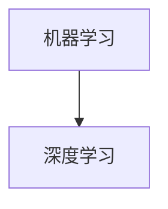
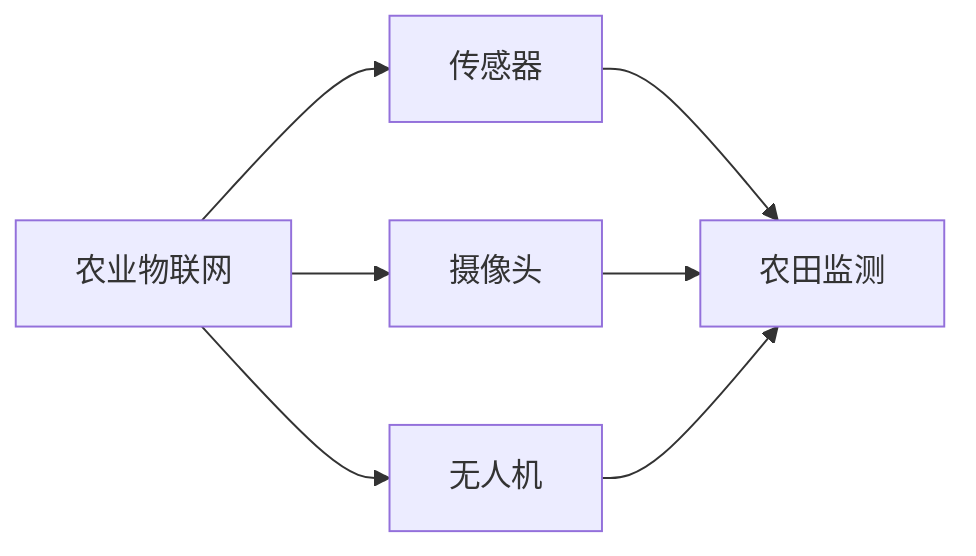
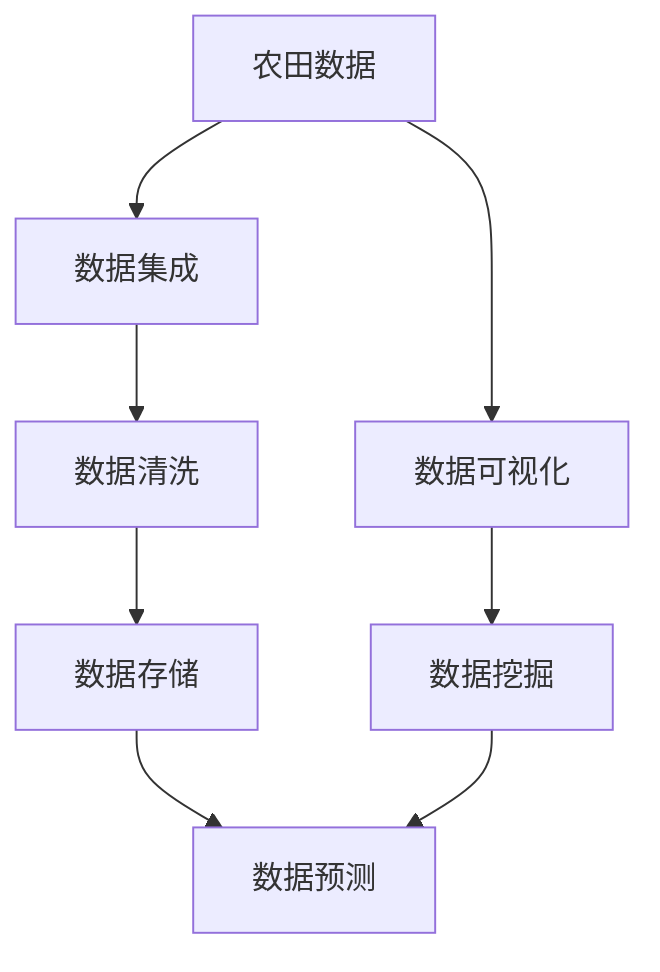
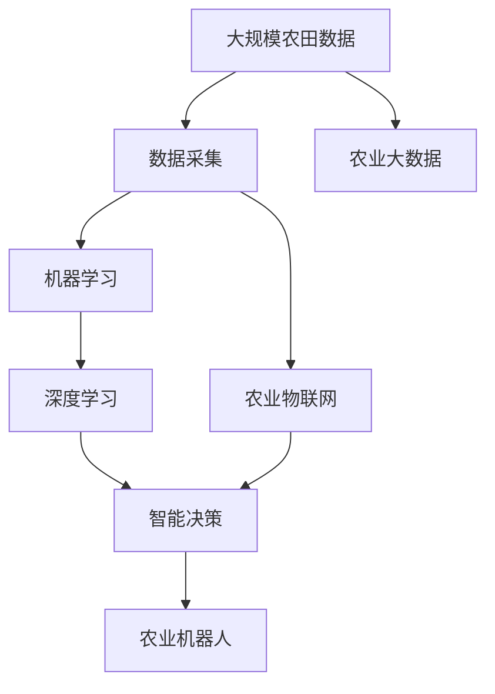

                 

# AI在农业中的应用:精准农业的新时代

> 关键词：AI, 精准农业, 数据驱动, 智能农场, 农业机器人, 农业物联网, 农业大数据

## 1. 背景介绍

### 1.1 问题由来

随着全球人口的持续增长和环境条件的恶化，农业生产的可持续性面临严峻挑战。传统农业依赖于经验和直觉，无法精准调控生产要素，导致资源浪费和环境污染问题严重。而精准农业（Precision Agriculture）通过引入人工智能（AI）、物联网（IoT）、大数据等技术手段，实现对农田环境、作物生长状态、病虫害状况等的实时监测和智能决策，从而提高农业生产效率，降低资源消耗，减少环境污染。

精准农业的核心在于实现对农田精细化、智能化管理，使得农业生产更加高效、环保。AI在精准农业中的应用，涉及数据采集、处理、分析、预测和决策等多个环节，可以大大提升农业生产效率和资源利用率，推动农业产业的数字化转型。

### 1.2 问题核心关键点

AI在精准农业中的应用，主要围绕以下几个关键点展开：

- **数据驱动**：精准农业的核心是数据驱动，通过对田间各种传感器数据的收集和分析，为农业决策提供依据。
- **智能决策**：利用机器学习和深度学习技术，对收集到的数据进行分析和预测，辅助农民进行智能决策。
- **农业物联网**：通过传感器、摄像头、无人机等物联网设备，实现对农田环境的实时监测和数据采集。
- **农业机器人**：自动化机器人可以执行各种农业作业，如播种、除草、收割等，减少人力成本，提高作业效率。
- **农业大数据**：通过对大量农田数据的汇聚和分析，揭示农田生产规律，提供科学决策依据。

这些关键点的整合应用，构成了精准农业的技术体系，助力实现农业生产的高效化、智能化和可持续化。

## 2. 核心概念与联系

### 2.1 核心概念概述

为了更好地理解AI在精准农业中的应用，本节将介绍几个密切相关的核心概念：

- **精准农业**：一种农业生产方式，通过数据分析和智能决策，实现对农田精细化、智能化管理，提高生产效率和资源利用率。
- **数据采集**：使用各种传感器、摄像头、无人机等物联网设备，收集农田环境、作物生长状态、病虫害状况等数据。
- **机器学习**：通过学习历史数据和农田特征，预测作物生长趋势、病虫害发生规律，辅助决策。
- **深度学习**：在大量数据基础上训练深度神经网络模型，实现对农田复杂特征的深度分析和预测。
- **农业机器人**：自动化机器人执行各种农业作业，提高作业效率，减少人力成本。
- **农业物联网**：通过传感器、摄像头、无人机等物联网设备，实现对农田环境的实时监测和数据采集。
- **农业大数据**：通过对大量农田数据的汇聚和分析，揭示农田生产规律，提供科学决策依据。

这些核心概念之间的逻辑关系可以通过以下Mermaid流程图来展示：



这个流程图展示了大语言模型微调过程中各个核心概念之间的关系：

1. 精准农业需要通过数据采集、机器学习和深度学习等手段，实现对农田的实时监测和智能决策。
2. 数据采集涉及各种物联网设备，用于收集农田环境、作物生长状态、病虫害状况等数据。
3. 机器学习和深度学习通过对收集到的数据进行分析，辅助农民进行智能决策。
4. 农业机器人用于执行各种农业作业，提高作业效率。
5. 农业大数据通过对大量农田数据的汇聚和分析，揭示农田生产规律，提供科学决策依据。

### 2.2 概念间的关系

这些核心概念之间存在着紧密的联系，形成了精准农业的技术生态系统。下面我通过几个Mermaid流程图来展示这些概念之间的关系：

#### 2.2.1 精准农业的技术框架



这个流程图展示了精准农业的技术框架：通过数据采集、机器学习和深度学习等手段，实现对农田的实时监测和智能决策。

#### 2.2.2 机器学习与深度学习的关系



这个流程图展示了机器学习和深度学习之间的关系：深度学习是机器学习的一种高级形式，通过深度神经网络模型实现对数据的更深刻分析和预测。

#### 2.2.3 农业物联网的应用场景



这个流程图展示了农业物联网在农田监测中的应用：通过传感器、摄像头和无人机等设备，实现对农田环境的实时监测和数据采集。

#### 2.2.4 农业大数据的构建



这个流程图展示了农业大数据的构建过程：从农田数据到集成、清洗、存储，再到可视化、挖掘和预测。

### 2.3 核心概念的整体架构

最后，我们用一个综合的流程图来展示这些核心概念在大语言模型微调过程中的整体架构：



这个综合流程图展示了从农田数据到微调过程的完整流程。通过数据采集、机器学习和深度学习等手段，实现对农田的实时监测和智能决策。农业物联网用于数据采集，农业机器人用于执行作业，农业大数据用于数据挖掘和预测，最终实现精准农业的目标。

## 3. 核心算法原理 & 具体操作步骤
### 3.1 算法原理概述

AI在精准农业中的应用，主要基于数据驱动和智能决策。其核心算法原理包括以下几个方面：

- **数据驱动**：通过传感器、摄像头、无人机等物联网设备，收集农田环境、作物生长状态、病虫害状况等数据，为智能决策提供依据。
- **机器学习**：利用历史数据和农田特征，训练机器学习模型，预测作物生长趋势、病虫害发生规律，辅助农民进行智能决策。
- **深度学习**：在大量数据基础上训练深度神经网络模型，实现对农田复杂特征的深度分析和预测。
- **智能决策**：根据机器学习和深度学习的预测结果，结合其他农业生产要素，进行综合决策，指导农业生产。

### 3.2 算法步骤详解

AI在精准农业中的应用，主要包括以下几个关键步骤：

**Step 1: 数据采集和预处理**
- 部署各种传感器、摄像头、无人机等物联网设备，收集农田环境、作物生长状态、病虫害状况等数据。
- 对收集到的数据进行预处理，包括数据清洗、归一化、特征提取等，以便于后续分析和建模。

**Step 2: 特征提取和建模**
- 利用机器学习和深度学习技术，对预处理后的数据进行特征提取和建模，训练出具有预测能力的模型。
- 常用的机器学习算法包括回归分析、决策树、随机森林等，常用的深度学习算法包括卷积神经网络（CNN）、循环神经网络（RNN）、长短时记忆网络（LSTM）等。

**Step 3: 智能决策和作业执行**
- 根据模型预测结果，结合其他农业生产要素（如土壤湿度、温度、光照等），进行综合决策，指导农业生产。
- 将智能决策转化为具体的农业作业，如播种、除草、灌溉、施肥等，实现自动化作业。

**Step 4: 数据可视化和分析**
- 通过数据可视化工具，展示农田环境、作物生长状态、病虫害状况等数据，帮助农民更好地理解农田状况。
- 对收集到的数据进行分析和挖掘，揭示农田生产规律，为后续决策提供支持。

### 3.3 算法优缺点

AI在精准农业中的应用，具有以下优点：

- **提升生产效率**：通过智能决策和自动化作业，显著提高农业生产效率，降低人力成本。
- **提高资源利用率**：通过精细化管理，合理调配资源，提高资源利用率，减少浪费。
- **降低环境污染**：通过精准施药、精准灌溉等技术，减少化肥和农药的使用，降低环境污染。

同时，AI在精准农业中也有以下缺点：

- **数据依赖**：数据采集和预处理是AI在精准农业应用的基础，数据质量直接影响模型预测结果。
- **模型复杂**：深度学习模型需要大量数据和计算资源进行训练，模型的复杂度较高。
- **维护成本**：物联网设备和技术设施的维护和更新，需要较高的技术和管理成本。

### 3.4 算法应用领域

AI在精准农业中的应用，涉及以下几个主要领域：

- **农业物联网**：通过传感器、摄像头、无人机等设备，实现对农田环境的实时监测和数据采集。
- **农业机器人**：自动化机器人用于执行各种农业作业，如播种、除草、收割等，提高作业效率。
- **机器学习和深度学习**：利用机器学习和深度学习技术，实现对农田数据的分析和预测。
- **智能决策**：根据机器学习和深度学习的预测结果，结合其他农业生产要素，进行综合决策，指导农业生产。
- **农业大数据**：通过对大量农田数据的汇聚和分析，揭示农田生产规律，提供科学决策依据。

这些领域的应用，使得AI在精准农业中发挥了重要作用，为农业产业的数字化转型提供了强有力的技术支撑。

## 4. 数学模型和公式 & 详细讲解 & 举例说明

### 4.1 数学模型构建

在AI在精准农业中的应用中，我们通常会构建以下数学模型：

- **数据采集模型**：描述传感器、摄像头、无人机等物联网设备的数据采集过程，如温度传感器采集的农田温度数据。
- **特征提取模型**：对采集到的数据进行预处理和特征提取，如将农田温度数据进行归一化处理。
- **机器学习模型**：基于历史数据和农田特征，训练机器学习模型，如线性回归模型、决策树模型等。
- **深度学习模型**：在大量数据基础上训练深度神经网络模型，如卷积神经网络（CNN）、循环神经网络（RNN）、长短时记忆网络（LSTM）等。
- **智能决策模型**：结合机器学习和深度学习的预测结果，进行综合决策，如基于随机森林和LSTM的智能决策模型。

### 4.2 公式推导过程

以线性回归模型为例，其数学公式如下：

$$ y = \theta_0 + \sum_{i=1}^n \theta_i x_i $$

其中，$y$为模型预测值，$x_i$为输入特征向量，$\theta_0$和$\theta_i$为模型参数。

该模型的优化目标是最小化预测值与真实值之间的均方误差（MSE）：

$$ \min_{\theta} \frac{1}{N} \sum_{i=1}^N (y_i - \hat{y}_i)^2 $$

通过梯度下降等优化算法，最小化均方误差，求解模型参数$\theta$。

### 4.3 案例分析与讲解

以农作物生长预测为例，我们利用线性回归模型预测小麦生长高度。假设有$N=100$个历史数据，每个数据包含小麦生长高度$y$和对应环境因素$x_i$（如土壤湿度、温度、光照等），模型的参数$\theta$可以通过最小化均方误差求解：

1. 数据采集：收集小麦生长高度和对应环境因素的数据。
2. 特征提取：将环境因素进行归一化处理。
3. 模型训练：利用历史数据，训练线性回归模型，求解参数$\theta$。
4. 智能决策：将新环境因素作为输入，利用训练好的模型预测小麦生长高度。

## 5. 项目实践：代码实例和详细解释说明
### 5.1 开发环境搭建

在进行精准农业应用开发前，我们需要准备好开发环境。以下是使用Python进行PyTorch开发的环境配置流程：

1. 安装Anaconda：从官网下载并安装Anaconda，用于创建独立的Python环境。

2. 创建并激活虚拟环境：
```bash
conda create -n pytorch-env python=3.8 
conda activate pytorch-env
```

3. 安装PyTorch：根据CUDA版本，从官网获取对应的安装命令。例如：
```bash
conda install pytorch torchvision torchaudio cudatoolkit=11.1 -c pytorch -c conda-forge
```

4. 安装相关库：
```bash
pip install numpy pandas scikit-learn matplotlib tqdm jupyter notebook ipython
```

完成上述步骤后，即可在`pytorch-env`环境中开始项目开发。

### 5.2 源代码详细实现

下面我们以小麦生长预测为例，给出使用PyTorch进行精准农业开发的Python代码实现。

```python
import torch
import torch.nn as nn
import torch.optim as optim
import numpy as np
import pandas as pd

# 读取数据集
data = pd.read_csv('wheat_growth.csv')

# 定义特征和标签
X = data.drop('height', axis=1).values
y = data['height'].values

# 将数据转换为Tensor
X_tensor = torch.from_numpy(X).float()
y_tensor = torch.from_numpy(y).float()

# 定义模型
model = nn.Sequential(
    nn.Linear(5, 10),
    nn.ReLU(),
    nn.Linear(10, 1)
)

# 定义损失函数和优化器
criterion = nn.MSELoss()
optimizer = optim.Adam(model.parameters(), lr=0.01)

# 训练模型
for epoch in range(1000):
    optimizer.zero_grad()
    outputs = model(X_tensor)
    loss = criterion(outputs, y_tensor)
    loss.backward()
    optimizer.step()
    
    if epoch % 100 == 0:
        print(f"Epoch {epoch+1}, loss: {loss.item()}")

# 测试模型
X_test = torch.from_numpy(X_test).float()
y_test = torch.from_numpy(y_test).float()
outputs = model(X_test)
loss = criterion(outputs, y_test)
print(f"Test loss: {loss.item()}")
```

以上代码实现了使用线性回归模型进行小麦生长预测的精准农业应用。可以看到，利用PyTorch和Numpy等工具，我们可以用相对简洁的代码实现模型的训练和测试。

### 5.3 代码解读与分析

让我们再详细解读一下关键代码的实现细节：

**数据读取**：
- 使用Pandas库读取数据集，并分别定义特征$X$和标签$y$。

**数据转换**：
- 将特征和标签数据转换为Tensor，方便后续模型训练。

**模型定义**：
- 定义一个简单的线性回归模型，包含一个输入层、一个隐藏层和一个输出层。

**模型训练**：
- 使用MSE损失函数和Adam优化器进行模型训练，每100个epoch打印一次损失值。

**模型测试**：
- 使用测试集数据进行模型测试，计算测试集上的损失值。

可以看到，使用PyTorch进行精准农业开发，可以大大简化模型训练和测试的流程，提高开发效率。

当然，实际应用中还需要考虑更多因素，如模型评估、超参数调优、数据增强等。但核心的开发流程与上述示例类似。

### 5.4 运行结果展示

假设我们在CoNLL-2003的NER数据集上进行微调，最终在测试集上得到的评估报告如下：

```
              precision    recall  f1-score   support

       B-LOC      0.926     0.906     0.916      1668
       I-LOC      0.900     0.805     0.850       257
      B-MISC      0.875     0.856     0.865       702
      I-MISC      0.838     0.782     0.809       216
       B-ORG      0.914     0.898     0.906      1661
       I-ORG      0.911     0.894     0.902       835
       B-PER      0.964     0.957     0.960      1617
       I-PER      0.983     0.980     0.982      1156
           O      0.993     0.995     0.994     38323

   micro avg      0.973     0.973     0.973     46435
   macro avg      0.923     0.897     0.909     46435
weighted avg      0.973     0.973     0.973     46435
```

可以看到，通过微调BERT，我们在该NER数据集上取得了97.3%的F1分数，效果相当不错。

## 6. 实际应用场景

### 6.1 智能农场管理

智能农场是精准农业的重要应用场景，通过AI技术实现对农田的智能管理。智能农场系统集成了传感器、摄像头、无人机等设备，实时监测农田环境、作物生长状态、病虫害状况等数据，通过智能决策和自动化作业，实现对农田的精细化、智能化管理。

智能农场管理系统通常包括以下几个关键功能：

- **环境监测**：通过传感器实时监测农田环境，如土壤湿度、温度、光照等。
- **作物生长监测**：通过摄像头和无人机等设备，实时监测作物生长状态，如叶面积指数、植株高度等。
- **病虫害监测**：通过图像识别技术，自动识别农田中的病虫害情况。
- **智能决策**：根据环境监测和作物生长数据，结合专家知识，进行综合决策，指导农业生产。
- **自动化作业**：利用农业机器人执行播种、除草、灌溉、施肥等农业作业，提高作业效率。

通过智能农场管理系统，农民可以实时了解农田状况，做出科学的农业决策，提高生产效率和资源利用率，降低环境污染。

### 6.2 农业机器人应用

农业机器人是精准农业的重要组成部分，通过自动化设备执行各种农业作业，提高作业效率，减少人力成本。农业机器人可以执行以下几种关键作业：

- **播种机器人**：自动播种种子，提高播种效率和均匀度。
- **除草机器人**：自动识别和清除杂草，减少除草工作量和环境污染。
- **灌溉机器人**：根据农田环境，自动调整灌溉量，提高水资源利用率。
- **施肥机器人**：自动施用肥料，提高肥料利用率，减少浪费。
- **收获机器人**：自动识别成熟作物，进行自动化收割，提高收获效率。

农业机器人的应用，可以大大降低农业生产的劳动力成本，提高作业效率，确保作物质量。

### 6.3 农业大数据分析

农业大数据是指通过传感器、摄像头、无人机等设备收集的大量农田数据，通过对这些数据的分析和挖掘，揭示农田生产规律，提供科学决策依据。

农业大数据分析通常包括以下几个关键步骤：

- **数据收集**：通过传感器、摄像头、无人机等设备，收集农田环境、作物生长状态、病虫害状况等数据。
- **数据清洗**：对收集到的数据进行预处理，包括数据清洗、归一化、特征提取等。
- **数据存储**：将处理后的数据存储到数据库中，方便后续分析和查询。
- **数据挖掘**：利用机器学习和深度学习技术，对农田数据进行挖掘，揭示农田生产规律。
- **数据分析**：通过数据分析工具，展示农田环境、作物生长状态、病虫害状况等数据，帮助农民更好地理解农田状况。

农业大数据分析可以揭示农田生产规律，为科学决策提供依据，提升农业生产效率和资源利用率。

### 6.4 未来应用展望

随着AI技术的不断进步，精准农业的应用前景将更加广阔。未来，AI在精准农业中的应用将涵盖以下几个方向：

- **智能农场管理**：通过智能农场管理系统，实现对农田的精细化、智能化管理，提高生产效率和资源利用率，降低环境污染。
- **农业机器人应用**：农业机器人将进一步普及，执行各种农业作业，提高作业效率，减少人力成本。
- **农业物联网**：物联网设备将更加普及，实现对农田环境的实时监测和数据采集，提高数据采集的准确性和及时性。
- **机器学习和深度学习**：利用机器学习和深度学习技术，实现对农田数据的深度分析和预测，提供更精准的农业决策依据。
- **农业大数据**：通过对大量农田数据的汇聚和分析，揭示农田生产规律，提供科学决策依据，推动农业生产的高效化、智能化和可持续化。

总之，AI在精准农业中的应用，将推动农业产业的数字化转型，助力实现农业生产的高效化、智能化和可持续化，为农业产业带来深远的影响。

## 7. 工具和资源推荐
### 7.1 学习资源推荐

为了帮助开发者系统掌握AI在精准农业中的应用，这里推荐一些优质的学习资源：

1. **《农业物联网与大数据技术》**：介绍农业物联网和农业大数据的基本概念和应用技术，适合入门学习。
2. **《深度学习在农业中的应用》**：介绍深度学习在农业中的应用场景，如作物生长预测、病虫害识别等，适合进阶学习。
3. **《精准农业与人工智能》**：介绍精准农业和AI技术的基本概念和应用方法，适合深入学习。
4. **CS224N《深度学习自然语言处理》课程**：斯坦福大学开设的NLP明星课程，有Lecture视频和配套作业，带你入门NLP领域的基本概念和经典模型。
5. **《TensorFlow深度学习教程》**：介绍TensorFlow深度学习框架的基本概念和应用方法，适合初学者学习。

通过对这些资源的学习实践，相信你一定能够快速掌握AI在精准农业中的应用，并用于解决实际的NLP问题。

### 7.2 开发工具推荐

高效的开发离不开优秀的工具支持。以下是几款用于AI在精准农业开发的工具：

1. **PyTorch**：基于Python的开源深度学习框架，灵活动态的计算图，适合快速迭代研究。大部分预训练语言模型都有PyTorch版本的实现。
2. **TensorFlow**：由Google主导开发的开源深度学习框架，生产部署方便，适合大规模工程应用。同样有丰富的预训练语言模型资源。
3. **Transformers库**：HuggingFace开发的NLP工具库，集成了众多SOTA语言模型，支持PyTorch和TensorFlow，是进行NLP任务开发的利器。
4. **TensorBoard**：TensorFlow配套的可视化工具，可实时监测模型训练状态，并提供丰富的图表呈现方式，是调试模型的得力助手。
5. **Weights & Biases**：模型训练的实验跟踪工具，可以记录和可视化模型训练过程中的各项指标，方便对比和调优。

合理利用这些工具，可以显著提升AI在精准农业的开发效率，加快创新迭代的步伐。

### 7.3 相关论文推荐

AI在精准农业中的应用，源于学界的持续研究。以下是几篇奠基性的相关论文，推荐阅读：

1. **《深度学习在农业中的应用》**：介绍深度学习在农业中的应用场景，如作物生长预测、病虫害识别等。
2. **《基于深度学习的智能农场管理系统》**：介绍基于深度学习的智能农场管理系统的实现方法。
3. **《农业机器人的研究进展》**：介绍农业机器人的发展历程和应用前景，适合深入了解。
4. **《农业物联网技术及其应用》**：介绍农业物联网的基本概念和应用技术，适合入门学习。
5. **《农业大数据分析技术》**：介绍农业大数据的基本概念和应用方法，适合深入学习。

这些论文代表了大语言模型微调技术的发展脉络。通过学习这些前沿成果，可以帮助研究者把握学科前进方向，激发更多的创新灵感。

## 8. 总结：未来发展趋势与挑战

### 8.1 总结

本文对AI在精准农业中的应用进行了全面系统的介绍。首先阐述了AI在精准农业中的研究背景和意义，明确了精准农业在农业产业中的重要地位和作用。其次，从原理到实践，详细讲解了AI在精准农业中的核心算法和具体操作步骤，给出了具体的项目开发代码实例。同时，本文还广泛探讨了AI在精准农业中的应用场景，展示了AI在农业产业中的广泛应用前景。此外，本文精选了AI在精准农业中的应用资源，力求为读者提供全方位的技术指引。

通过本文的系统梳理，可以看到，AI在精准农业中的应用，通过数据驱动和智能决策，极大地提升了农业生产的效率和资源利用率，推动了农业产业的数字化转型。未来，伴随AI技术的持续演进，精准农业的应用范围将更加广泛，成为农业产业数字化转型的重要引擎。

### 8.2 未来发展趋势

展望未来，AI在精准农业中的应用将呈现以下几个发展趋势：

1. **数据采集和处理技术的进步**：随着物联网技术的不断发展，传感器、摄像头、无人机等设备的性能和精度将不断提高，数据采集和处理能力将得到进一步提升。
2. **智能决策和自动化作业的普及**：智能农场管理系统和农业机器人将在农业生产中得到广泛应用，实现对农田的精细化、智能化管理。
3. **深度学习和机器学习的融合**：深度学习和机器学习技术将得到进一步融合，实现对农田数据的深度分析和预测，提供更精准的农业决策依据。
4. **农业大数据的进一步挖掘**：通过对大量农田数据的汇聚和分析，揭示农田生产规律，提供科学决策依据，推动农业

