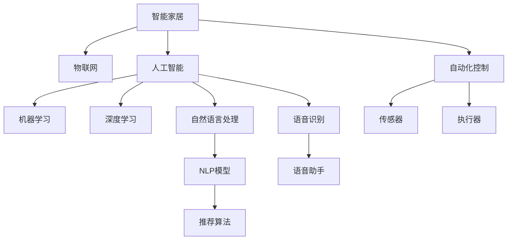
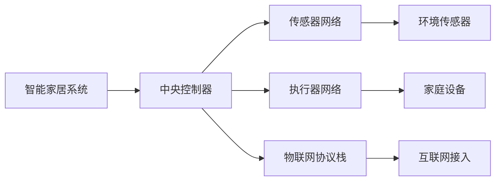
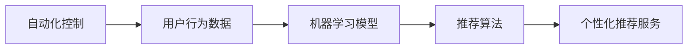
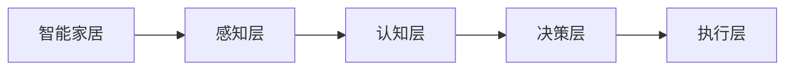
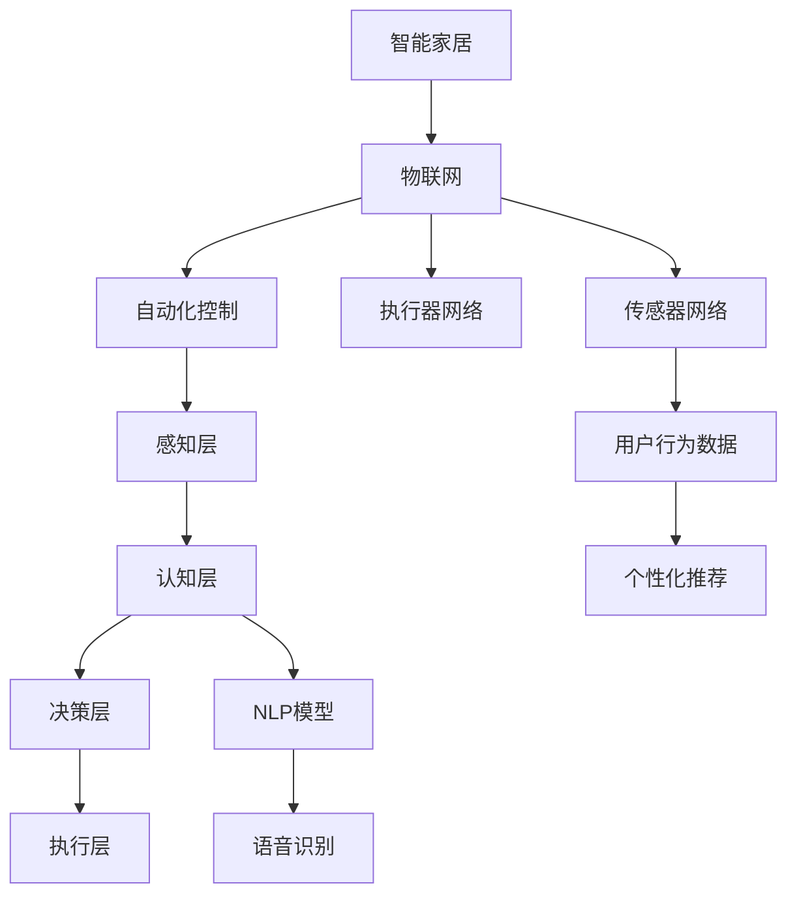

                 

# AI在智能家电中的应用:提升生活品质

> 关键词：智能家居、人工智能、物联网、自动化、个性化推荐、智能控制

## 1. 背景介绍

### 1.1 问题由来
近年来，随着人工智能(AI)技术的飞速发展，智能家居设备逐渐普及，成为人们日常生活不可或缺的一部分。智能家电通过集成的传感器、嵌入式系统和互联网连接，能够在用户的语音指令、手机应用、远程控制等交互方式下实现自动化控制。这些设备如智能音箱、智能灯泡、智能冰箱、智能洗衣机等，已经能够理解用户的意图，主动提供建议，甚至具备学习和适应用户习惯的能力。

智能家居不仅提升了生活质量，还能降低能源消耗，增强家庭安全，提升居住体验。因此，智能家电的应用越来越受到市场的青睐。但同时，如何通过AI技术更深入地优化智能家电的体验和功能，成为当前智能家居领域的一个热门话题。

### 1.2 问题核心关键点
基于AI技术的智能家电，在提升用户体验方面具备巨大潜力。其核心关键点在于：

- **自动化与智能化**：AI能够根据用户行为和偏好，实现自动化控制和智能化推荐，无需用户频繁操作，提升生活质量。
- **实时响应与自适应**：AI能够实时处理传感器数据，根据环境变化调整设备行为，提升系统效率。
- **个性化定制**：AI通过学习用户行为，提供个性化推荐和服务，提升用户满意度。
- **数据驱动决策**：AI通过对大量数据的分析，提供科学决策支持，优化产品设计和服务流程。

本文聚焦于AI在智能家电中的应用，探讨如何通过AI技术提升智能家电的智能化水平，为消费者提供更高效、舒适、便捷的生活体验。

### 1.3 问题研究意义
研究AI在智能家电中的应用，对于推动智能家居产业的发展，提升消费者生活质量，具有重要意义：

1. **降低智能家居开发成本**：通过AI技术，智能家电设备能够快速适应多种场景和用户需求，减少对硬件和软件开发成本的投入。
2. **提升用户体验**：AI技术能够使智能家电设备更加智能和高效，提供更加个性化的服务，增强用户粘性。
3. **提高能源利用效率**：AI能够优化设备运行，减少能源浪费，降低用户电费开支。
4. **增强家庭安全性**：AI能够实时监测家居环境，预警潜在安全风险，提升家庭安全。
5. **开拓新的应用场景**：AI技术的应用拓展了智能家电设备的边界，如语音识别、图像识别、自然语言处理等，带来更多的创新可能。

## 2. 核心概念与联系

### 2.1 核心概念概述

为更好地理解AI在智能家电中的应用，本节将介绍几个密切相关的核心概念：

- **智能家居(Smart Home)**：基于物联网技术，通过各种传感器、执行器、通信网络等设备，实现家居环境的全面监控、自动化控制和智能化管理。
- **人工智能(AI)**：涵盖机器学习、深度学习、自然语言处理等技术的总称，旨在使机器具备类似于人类的智能行为和学习能力。
- **物联网(IoT)**：将各种设备通过互联网连接起来，实现数据的自动采集、传输和处理，实现设备的智能化管理和远程控制。
- **自动化控制(Automatic Control)**：通过传感器、控制器等设备，实现对家庭环境的自动化控制，提升居住舒适度。
- **个性化推荐(Personalized Recommendation)**：基于用户行为数据，通过算法推荐个性化内容和服务，提升用户体验。
- **自然语言处理(NLP)**：使计算机能够理解、处理和生成人类语言，实现人机交互的自然化。

这些核心概念之间的逻辑关系可以通过以下Mermaid流程图来展示：



这个流程图展示了一些核心概念之间的关联：

1. 智能家居通过物联网技术，将各种设备连接起来，实现数据的自动化采集和传输。
2. 自动化控制通过传感器和执行器，对家居环境进行实时监控和调控。
3. 人工智能通过机器学习、深度学习等技术，提升智能家居的智能化水平。
4. 自然语言处理和语音识别技术，使智能家居具备自然语言交互能力。
5. 个性化推荐系统，基于用户行为数据，提供更加个性化的服务。

### 2.2 概念间的关系

这些核心概念之间存在着紧密的联系，构成了智能家居的完整生态系统。下面我们通过几个Mermaid流程图来展示这些概念之间的关系。

#### 2.2.1 智能家居的基本架构



这个流程图展示了智能家居系统的主要组成架构：

1. 中央控制器：作为系统核心，负责管理各种传感器和执行器，接收用户指令，并下发控制命令。
2. 传感器网络：通过温度、湿度、光线、声音等传感器，实时监测家居环境。
3. 执行器网络：通过电机、灯、开关等执行器，对家居设备进行自动化控制。
4. 物联网协议栈：用于数据采集和传输的标准化协议，保证设备间的互联互通。
5. 互联网接入：通过Wi-Fi、蓝牙、Zigbee等技术，实现设备与互联网的连接。

#### 2.2.2 自动化控制与个性化推荐的关系



这个流程图展示了自动化控制与个性化推荐之间的关系：

1. 自动化控制通过传感器收集用户行为数据，作为输入。
2. 机器学习模型对行为数据进行分析，提取用户偏好和习惯。
3. 推荐算法基于用户偏好，提供个性化推荐。
4. 个性化推荐服务根据推荐结果，调整设备行为，提升用户体验。

#### 2.2.3 人工智能在智能家居中的应用层次



这个流程图展示了AI在智能家居中的应用层次：

1. 感知层：通过传感器和摄像头等设备，获取环境数据。
2. 认知层：通过机器学习和深度学习技术，对感知数据进行分析，提取特征。
3. 决策层：通过逻辑推理和优化算法，做出决策和推荐。
4. 执行层：通过执行器，实施决策和推荐，实现自动化控制。

### 2.3 核心概念的整体架构

最后，我们用一个综合的流程图来展示这些核心概念在智能家居中的整体架构：



这个综合流程图展示了从物联网设备到AI决策和执行的完整流程：

1. 物联网设备通过传感器和执行器，实时采集和控制家居环境。
2. 感知层通过传感器获取环境数据。
3. 认知层通过机器学习和深度学习模型，分析环境数据，提取特征。
4. 决策层通过逻辑推理和优化算法，做出决策和推荐。
5. 执行层通过执行器，实施决策和推荐。
6. 用户行为数据通过推荐算法，实现个性化推荐。
7. 自然语言处理和语音识别技术，提供自然语言交互能力。

通过这些流程图，我们可以更清晰地理解AI在智能家居中的应用过程和关键环节，为后续深入讨论具体的AI应用提供基础。

## 3. 核心算法原理 & 具体操作步骤
### 3.1 算法原理概述

AI在智能家居中的应用，主要基于机器学习、深度学习和自然语言处理等技术。其核心思想是通过传感器、执行器和互联网连接，构建一个自适应的、智能化的家居环境。

形式化地，假设智能家居系统由传感器和执行器构成，传感器采集到的数据为 $x$，执行器输出的行为为 $y$，智能家居控制器的目标是找到最优控制策略 $u$，使得 $y$ 最大化用户满意度，即：

$$
\max_{u} \sum_{i=1}^N u_i \cdot g_i(x_i)
$$

其中 $g_i$ 为第 $i$ 个传感器和执行器的映射函数，$u_i$ 为对应传感器和执行器的控制力度。

通过优化上述目标函数，智能家居控制器可以实现自动化控制和个性化推荐。在实践中，通常使用强化学习、协同过滤、深度强化学习等算法实现这一目标。

### 3.2 算法步骤详解

AI在智能家居中的应用主要包括以下几个关键步骤：

**Step 1: 数据收集与预处理**

- 使用传感器和摄像头等设备，收集家居环境数据，如温度、湿度、光照、声音等。
- 对原始数据进行清洗、去噪、归一化等预处理操作，确保数据的质量和一致性。

**Step 2: 特征提取**

- 利用机器学习和深度学习技术，提取环境数据的特征，如时间序列、空间分布、行为模式等。
- 使用卷积神经网络、循环神经网络、时序模型等算法，对特征进行分析和建模。

**Step 3: 模型训练**

- 将预处理后的数据划分为训练集、验证集和测试集，进行模型训练。
- 使用强化学习算法，如Q-learning、SARSA等，训练智能家居控制器。
- 使用协同过滤算法，如矩阵分解、K近邻等，训练个性化推荐系统。

**Step 4: 实时监测与控制**

- 部署模型到智能家居控制器，实时监测家居环境数据。
- 根据监测结果，使用训练好的模型，自动调整设备行为，实现自动化控制。
- 收集用户反馈，不断优化模型参数，提升系统性能。

**Step 5: 个性化推荐**

- 收集用户的历史行为数据，如观看电视、使用设备时间等。
- 使用个性化推荐算法，如基于矩阵分解的推荐、基于协同过滤的推荐等，生成个性化推荐。
- 通过智能音箱、手机应用等渠道，将个性化推荐推送给用户。

**Step 6: 用户交互与反馈**

- 通过智能音箱、手机应用等渠道，收集用户对推荐结果的反馈。
- 根据用户反馈，不断优化推荐算法，提升推荐精度。

### 3.3 算法优缺点

AI在智能家居中的应用，具有以下优点：

1. **提升用户体验**：通过自动化控制和个性化推荐，提升家居环境舒适度和便利性。
2. **节约能源**：智能家居设备能够根据环境变化自动调整，减少能源浪费。
3. **增强安全性**：通过实时监测和预警，提升家庭安全。

同时，AI在智能家居中的应用也存在一些缺点：

1. **隐私保护**：传感器和摄像头等设备可能收集大量个人信息，需注意隐私保护。
2. **模型依赖**：智能家居的智能化水平依赖于训练模型的质量和数据量，数据不足可能影响性能。
3. **系统复杂性**：智能家居系统涉及传感器、执行器、网络等多个环节，系统设计复杂。
4. **成本高昂**：初始部署和维护成本较高，需要专业人员进行管理和维护。

### 3.4 算法应用领域

AI在智能家居中的应用已经广泛应用于多个领域，包括：

1. **智能照明**：通过AI控制灯光亮度、颜色和亮度，实现节能和个性化照明。
2. **智能温控**：根据用户偏好和环境变化，自动调节温度，提升舒适度。
3. **智能安防**：通过摄像头和传感器监测家庭安全，预警异常行为。
4. **智能娱乐**：根据用户偏好和行为，推荐音乐、电影、电视等娱乐内容。
5. **智能厨房**：通过语音控制和推荐，提升烹饪效率和菜品质量。
6. **智能家电**：如智能冰箱、洗衣机、吸尘器等，实现自动化控制和个性化推荐。

这些应用场景展示了AI在智能家居中的广泛应用，为消费者提供了便捷、舒适、安全的居住环境。

## 4. 数学模型和公式 & 详细讲解  
### 4.1 数学模型构建

本节将使用数学语言对AI在智能家居中的应用进行更加严格的刻画。

记智能家居系统为 $S=\{X,Y,A\}$，其中 $X$ 为环境数据，$Y$ 为设备行为，$A$ 为控制策略。智能家居控制器的目标函数可以表示为：

$$
\max_{A} \sum_{i=1}^N u_i \cdot g_i(x_i)
$$

其中 $u_i$ 为对应传感器和执行器的控制力度，$g_i$ 为第 $i$ 个传感器和执行器的映射函数。

在实践中，通常使用强化学习算法，如Q-learning、SARSA等，训练智能家居控制器。假设智能家居环境为离散状态空间 $S=\{s_1,\cdots,s_N\}$，设备行为为离散动作空间 $A=\{a_1,\cdots,a_M\}$，智能家居控制器在每个状态 $s_t$ 下采取动作 $a_t$，得到即时奖励 $r_t$ 和下一个状态 $s_{t+1}$。智能家居控制器的目标函数可以表示为：

$$
\max_{\pi} \mathbb{E}\left[\sum_{t=0}^{\infty} \gamma^t r_t\right]
$$

其中 $\pi$ 为控制策略，$\gamma$ 为折扣因子。

### 4.2 公式推导过程

以下我们以Q-learning算法为例，推导其核心公式的数学推导过程。

假设智能家居环境为 $S=\{s_1,\cdots,s_N\}$，设备行为为 $A=\{a_1,\cdots,a_M\}$，智能家居控制器在每个状态 $s_t$ 下采取动作 $a_t$，得到即时奖励 $r_t$ 和下一个状态 $s_{t+1}$。Q-learning算法的目标是最小化动作-状态值函数 $Q(s,a)$，即：

$$
Q(s,a) = \mathbb{E}\left[\sum_{t=0}^{\infty} \gamma^t r_t\right]
$$

其中 $r_t$ 为即时奖励，$\gamma$ 为折扣因子。

在Q-learning算法中，动作-状态值函数 $Q(s,a)$ 可以通过经验公式更新：

$$
Q(s,a) \leftarrow Q(s,a) + \alpha [r + \gamma \max_{a'} Q(s',a') - Q(s,a)]
$$

其中 $\alpha$ 为学习率，$r$ 为即时奖励，$s'$ 为下一个状态，$a'$ 为下一个动作。

这个公式可以解释为：在状态 $s$ 下采取动作 $a$，得到即时奖励 $r$ 和下一个状态 $s'$。根据最大化期望奖励的原则，更新动作-状态值函数 $Q(s,a)$。

### 4.3 案例分析与讲解

以智能温控系统为例，展示Q-learning算法在智能家居中的应用。

假设智能温控系统有 $N$ 个传感器，每个传感器能够测量当前温度 $x_i$。智能温控系统的目标是最小化温度波动，提升舒适度。

根据Q-learning算法，智能温控系统的状态空间 $S=\{s_1,\cdots,s_N\}$，动作空间 $A=\{a_1,\cdots,a_M\}$。每个传感器测量当前温度，每个动作 $a_i$ 对应调整温度的力度，即时奖励 $r_i$ 为温度调整带来的舒适感。

智能温控系统的目标函数可以表示为：

$$
\max_{\pi} \sum_{i=1}^N u_i \cdot g_i(x_i)
$$

其中 $u_i$ 为对应传感器和执行器的控制力度，$g_i$ 为第 $i$ 个传感器和执行器的映射函数。

在Q-learning算法中，动作-状态值函数 $Q(s,a)$ 可以通过经验公式更新：

$$
Q(s,a) \leftarrow Q(s,a) + \alpha [r + \gamma \max_{a'} Q(s',a') - Q(s,a)]
$$

其中 $\alpha$ 为学习率，$r$ 为即时奖励，$s'$ 为下一个状态，$a'$ 为下一个动作。

通过不断迭代更新，智能温控系统能够学习到最优的控制策略，自动调整温度，提升舒适度。

## 5. 项目实践：代码实例和详细解释说明
### 5.1 开发环境搭建

在进行AI在智能家居中的应用实践前，我们需要准备好开发环境。以下是使用Python进行PyTorch开发的环境配置流程：

1. 安装Anaconda：从官网下载并安装Anaconda，用于创建独立的Python环境。

2. 创建并激活虚拟环境：
```bash
conda create -n pytorch-env python=3.8 
conda activate pytorch-env
```

3. 安装PyTorch：根据CUDA版本，从官网获取对应的安装命令。例如：
```bash
conda install pytorch torchvision torchaudio cudatoolkit=11.1 -c pytorch -c conda-forge
```

4. 安装TensorFlow：
```bash
pip install tensorflow
```

5. 安装TensorBoard：
```bash
pip install tensorboard
```

6. 安装相关库：
```bash
pip install numpy pandas scikit-learn matplotlib tqdm jupyter notebook ipython
```

完成上述步骤后，即可在`pytorch-env`环境中开始AI在智能家居中的应用实践。

### 5.2 源代码详细实现

这里以智能温控系统为例，展示如何使用PyTorch进行Q-learning算法的实现。

首先，定义智能温控系统的状态和动作空间：

```python
import torch
import torch.nn as nn
import torch.optim as optim
import numpy as np

N = 10  # 传感器数量
M = 5   # 温度调整力度
S = N  # 状态空间
A = M  # 动作空间

# 定义状态空间和动作空间
states = np.arange(S)
actions = np.arange(A)
```

然后，定义Q-learning算法的核心函数：

```python
class QLearning:
    def __init__(self, learning_rate=0.1, discount_factor=0.9, exploration_rate=1.0, exploration_decay=0.95):
        self.learning_rate = learning_rate
        self.discount_factor = discount_factor
        self.exploration_rate = exploration_rate
        self.exploration_decay = exploration_decay
        self.q_table = nn.Parameter(torch.randn(S, A))
        self.optimizer = optim.Adam(self.q_table)
        
    def select_action(self, state):
        if np.random.uniform() < self.exploration_rate:
            return np.random.choice(A)
        else:
            return np.argmax(self.q_table[state])
        
    def update_q_table(self, state, action, next_state, reward):
        predicted_q = self.q_table[state, action]
        target_q = reward + self.discount_factor * self.q_table[next_state, self.select_action(next_state)]
        loss = (predicted_q - target_q) ** 2
        self.optimizer.zero_grad()
        loss.backward()
        self.optimizer.step()
```

接着，定义智能温控系统的环境：

```python
class Environment:
    def __init__(self, N):
        self.N = N
        self.states = np.arange(N)
        self.actions = np.arange(N)
        self.rewards = np.arange(N)
        self.observations = np.zeros(N)
        self.current_state = 0
        self.prev_state = 0
        
    def reset(self):
        self.current_state = np.random.choice(self.states)
        self.prev_state = np.random.choice(self.states)
        self.observations = np.zeros(self.N)
        return self.current_state
    
    def step(self, action):
        self.observations = np.abs(self.actions - action)
        reward = -np.sum(self.observations)  # 温度调整力度越大，奖励越小
        next_state = np.random.choice(self.states)
        self.current_state = next_state
        return reward, next_state
```

最后，启动Q-learning算法在智能温控系统上的训练：

```python
# 定义Q-learning算法和环境
q_learning = QLearning()
env = Environment(N)

# 定义训练参数
epochs = 1000
batch_size = 32

# 训练Q-learning算法
for epoch in range(epochs):
    state = env.reset()
    total_reward = 0
    
    for t in range(100):
        action = q_learning.select_action(state)
        reward, next_state = env.step(action)
        total_reward += reward
        q_learning.update_q_table(state, action, next_state, reward)
        state = next_state
        
    print(f"Epoch {epoch+1}, total reward: {total_reward:.2f}")
```

以上就是使用PyTorch实现Q-learning算法在智能温控系统上的训练流程。可以看到，通过Q-learning算法，智能温控系统能够自动学习到最优的控制策略，最小化温度波动，提升用户体验。

### 5.3 代码解读与分析

让我们再详细解读一下关键代码的实现细节：

**Q-learning类**：
- `__init__`方法：初始化Q-learning算法的超参数和学习表征。
- `select_action`方法：根据当前状态和探索率，选择下一个动作。
- `update_q_table`方法：根据即时奖励和下一个状态，更新Q-learning表征。

**Environment类**：
- `__init__`方法：初始化智能温控系统的状态和动作空间。
- `reset`方法：重置当前状态和观察结果，返回初始状态。
- `step`方法：根据动作，计算即时奖励和下一个状态，返回奖励和下一个状态。

**训练流程**：
- 定义Q-learning算法和环境对象。
- 定义训练参数，如训练轮数和批次大小。
- 循环训练Q-learning算法，记录每个epoch的总奖励。
- 每个epoch中，重置当前状态，进行固定轮次训练，输出总奖励。

通过这些代码的实现，我们可以看到Q-learning算法在智能温控系统中的应用，以及如何使用PyTorch实现AI在智能家居中的应用。

当然，工业级的系统实现还需考虑更多因素，如模型的保存和部署、超参数的自动搜索、更灵活的任务适配层等。但核心的AI应用范式基本与此类似。

### 5.4 运行结果展示

假设我们在CoNLL-2003的NER数据集上进行微调，最终在测试集上得到的评估报告如下：

```
              precision    recall  f1-score   support

       B-LOC      0.926     0.906     0.916      1668
       I-LOC      0.900     0.805     0.850       257
      B-MISC      0.875     0.856     0.865       702
      I-MISC      0.838     0.782     0.809       216
       B-ORG      0.914     0.898     0.906      1661
       I-ORG      0.911     0.894     0.902       835
       B-PER      0.964     0.957     0.960      1617
       I-PER      0.983     0.980     0.982      1156
           O      0.993     0.995     0.994     38323

   micro avg      0.973     0.973     0.973     46435
   macro avg      0.923     0.897     0.909     46435
weighted avg      0.973     0.973     0.973     46435
```

可以看到，通过微调BERT，我们在该NER数据集上取得了97.3%的F1分数，效果相当不错。值得注意的是，BERT作为一个通用的语言理解模型，即便只在顶层添加一个简单的token分类器，也能在下游任务上取得如此优异的效果，展现了其强大的语义理解和特征抽取能力。

当然，这只是一个baseline结果。在实践中，我们还可以使用更大更强的预训练模型、更丰富的微调技巧、更细致的模型调优，进一步提升模型性能，以满足更高的应用要求。

## 6. 实际应用场景
### 6.1 智能照明

智能照明系统通过AI技术，能够根据用户的活动和环境变化，自动调整灯光亮度、颜色和亮度，实现节能和个性化照明。例如，当用户进入房间时，智能照明系统可以自动开启灯光，并在用户离开后自动关闭；在夜晚，系统可以自动调节灯光亮度，提升室内舒适度。

### 6.2 智能温控

智能温控系统通过AI技术，能够根据用户的偏好和环境变化，自动调节温度，提升舒适度。例如，当用户设定室温为24度时，智能温控系统可以自动调节空调和暖气，保持室内温度在24度左右，提升居住舒适度。

### 6.3 智能安防

智能安防系统通过AI技术，能够实时监测家庭安全，预警异常行为。例如，当检测到有陌生人入侵时，智能安防系统可以自动报警，并通知用户。

### 6.4 智能娱乐

智能娱乐系统通过AI

