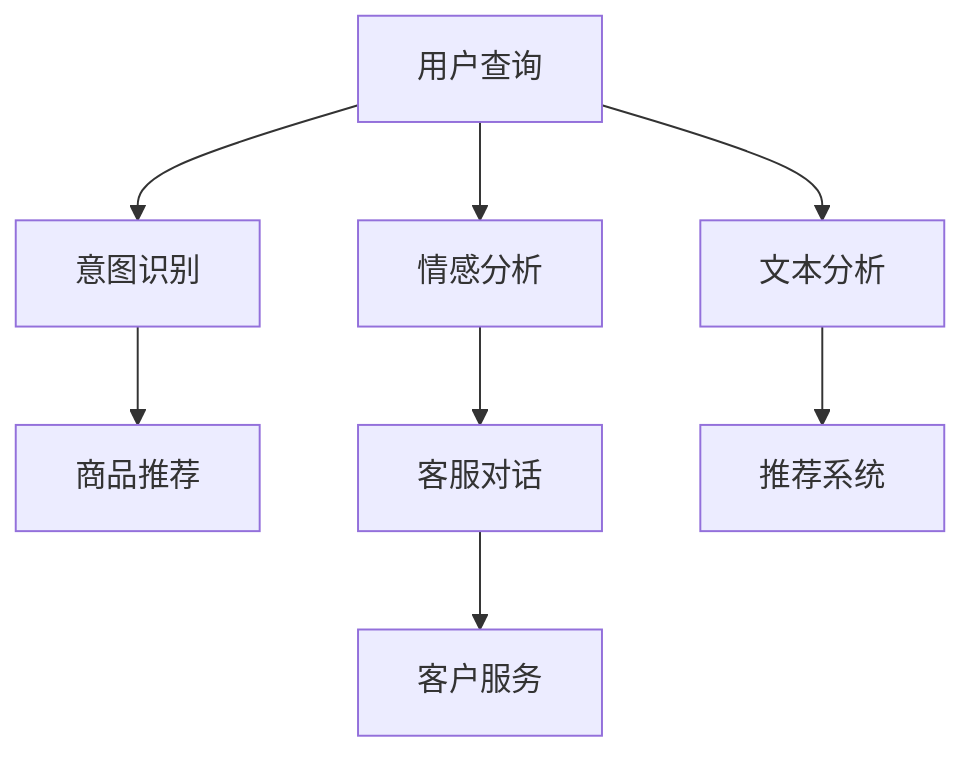
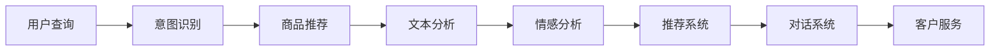
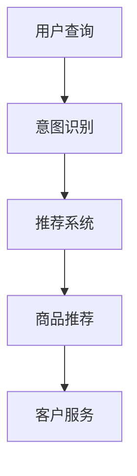
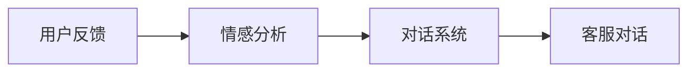

                 

# AI在电商中的NLP技术应用案例

> 关键词：电商、自然语言处理(NLP)、文本分析、情感分析、意图识别、推荐系统、对话系统、客户服务

## 1. 背景介绍

### 1.1 问题由来
随着互联网的普及和电子商务的迅猛发展，电商平台已经成为人们日常生活中不可或缺的一部分。然而，如何提升用户体验，提高销售额，同时降低运营成本，是电商平台面临的一大挑战。传统的电商平台往往依赖于大量的规则和人工操作，难以满足复杂多变的用户需求。

自然语言处理(NLP)技术的崛起，为电商平台提供了新的解决方案。NLP技术可以自动分析和理解用户的查询和反馈，从而更好地推荐商品、提供客户服务和改善用户体验。特别是随着深度学习和大模型的发展，电商平台的NLP应用正在向更深入、更智能的方向迈进。

### 1.2 问题核心关键点
1. **用户查询分析**：电商平台需要实时分析用户的查询内容，理解用户需求，从而提供精准的商品推荐。
2. **情感分析**：分析用户对商品或服务的情感倾向，识别用户的满意度和需求，以便及时改进产品和服务。
3. **意图识别**：理解用户查询的意图，如购买、咨询、投诉等，从而提供相应的服务。
4. **推荐系统**：根据用户的查询历史和偏好，生成个性化的商品推荐。
5. **对话系统**：与用户进行自然流畅的对话，解决用户的疑问和问题，提升用户体验。
6. **客户服务**：自动回答用户常见问题，减轻人工客服的工作负担，提升响应速度。

这些核心任务构成了电商NLP技术应用的主要方向，涵盖了用户互动的各个方面，旨在提升平台的运营效率和用户满意度。

### 1.3 问题研究意义
研究电商平台中的NLP技术应用，对于电商平台的用户体验提升、销售额增加、成本控制等方面具有重要意义：

1. **提升用户体验**：通过精准的商品推荐、智能客服和对话系统，电商平台可以更好地满足用户需求，提高用户的满意度和忠诚度。
2. **增加销售额**：通过情感分析和意图识别，电商平台可以及时调整商品策略，满足不同用户群体的需求，从而增加销售额。
3. **降低运营成本**：自动化的客户服务可以减少人工客服的数量，提高服务效率，同时通过智能推荐减少用户流失率。
4. **竞争优势**：先进的NLP技术可以成为电商平台的差异化优势，帮助其抢占市场份额。
5. **数据驱动决策**：通过分析和理解用户的反馈和行为，电商平台可以更好地进行数据驱动决策，优化运营策略。

## 2. 核心概念与联系

### 2.1 核心概念概述

为了更好地理解电商中的NLP技术应用，本节将介绍几个密切相关的核心概念：

- **自然语言处理(NLP)**：指让计算机理解、处理和生成自然语言的技术，包括文本分析、情感分析、意图识别等。
- **文本分析**：指从文本中提取结构化信息，如关键词、实体、关系等，用于分析和理解文本内容。
- **情感分析**：指通过分析文本中的情感词和情感强度，判断文本的情感倾向，如正面、负面、中性等。
- **意图识别**：指通过分析用户的查询内容，识别用户查询的意图，如搜索、评价、咨询等。
- **推荐系统**：指根据用户的历史行为和偏好，推荐个性化的商品和服务。
- **对话系统**：指构建与用户进行自然对话的系统，用于客户服务、咨询问答等。
- **客户服务**：指电商平台提供的客户支持服务，包括自动回复、工单处理、反馈收集等。

这些核心概念之间的逻辑关系可以通过以下Mermaid流程图来展示：



这个流程图展示了一些电商NLP应用的核心概念及其之间的关系：

1. 用户查询输入，首先进行意图识别。
2. 根据识别出的意图，进行商品推荐和对话系统服务。
3. 对用户的查询和反馈进行情感分析。
4. 进行文本分析，提取关键词和实体，用于更深入的理解和推荐。
5. 综合以上信息，构建推荐系统，生成个性化推荐。
6. 对话系统和服务系统处理用户查询，客户服务系统处理用户的咨询和投诉。

### 2.2 概念间的关系

这些核心概念之间存在着紧密的联系，形成了电商NLP技术应用的整体生态系统。下面我通过几个Mermaid流程图来展示这些概念之间的关系。

#### 2.2.1 电商NLP应用流程



这个流程图展示了电商NLP应用的基本流程：用户查询输入，首先进行意图识别，根据识别出的意图进行推荐和对话，同时进行文本分析、情感分析，最终生成推荐结果和对话响应。

#### 2.2.2 意图识别与推荐系统



这个流程图展示了意图识别和推荐系统之间的关联。用户查询经过意图识别后，推荐系统根据识别结果生成个性化推荐，最终客户服务系统处理用户的反馈和咨询。

#### 2.2.3 情感分析与对话系统



这个流程图展示了情感分析与对话系统之间的关系。用户反馈经过情感分析后，对话系统根据情感倾向生成相应的对话回应，最终客户服务系统处理用户的咨询和投诉。

## 3. 核心算法原理 & 具体操作步骤

### 3.1 算法原理概述

电商NLP技术应用的核心算法主要包括文本分析、情感分析、意图识别和推荐系统。以下是这些算法的简要原理概述：

#### 3.1.1 文本分析
文本分析主要是通过自然语言处理技术，从文本中提取关键词、实体和关系等结构化信息，用于分析和理解文本内容。常用的文本分析算法包括词袋模型、TF-IDF、BERT等。

#### 3.1.2 情感分析
情感分析通过分析文本中的情感词和情感强度，判断文本的情感倾向。常用的情感分析算法包括基于词典的方法、基于机器学习的方法、基于深度学习的方法。

#### 3.1.3 意图识别
意图识别通过分析用户的查询内容，识别用户查询的意图。常用的意图识别算法包括基于规则的方法、基于机器学习的方法、基于深度学习的方法。

#### 3.1.4 推荐系统
推荐系统根据用户的历史行为和偏好，生成个性化的商品推荐。常用的推荐算法包括协同过滤、基于内容的推荐、混合推荐算法等。

### 3.2 算法步骤详解

电商NLP技术应用的具体操作步骤可以分为以下几步：

**Step 1: 数据收集与预处理**
- 收集电商平台的查询、评论、反馈等文本数据，并进行数据清洗和预处理。
- 去除噪音数据，如HTML标签、特殊符号等。
- 进行分词、词性标注、实体识别等文本处理。

**Step 2: 特征工程**
- 提取文本特征，如词频、TF-IDF、词向量等。
- 选择和设计合适的特征组合，以提升算法的表现。
- 进行特征降维和归一化，优化模型的训练过程。

**Step 3: 模型训练**
- 选择合适的算法和模型，如BERT、LSTM、CNN等。
- 训练模型，调整超参数，如学习率、批次大小等。
- 使用交叉验证等技术评估模型的性能。

**Step 4: 模型评估与优化**
- 对训练好的模型进行评估，选择合适的评估指标，如准确率、召回率、F1分数等。
- 根据评估结果调整模型参数，优化模型性能。
- 进行模型调优，如调整网络结构、添加正则化等。

**Step 5: 部署与集成**
- 将训练好的模型部署到生产环境中。
- 集成到电商平台的业务流程中，进行商品推荐、客服对话等任务。
- 定期更新模型，保持其性能和效率。

### 3.3 算法优缺点

电商NLP技术应用的算法具有以下优点：

1. **高效性**：基于深度学习的算法，如BERT，可以快速高效地处理大规模文本数据。
2. **准确性**：深度学习模型在文本分析和情感分析等任务上取得了很好的效果，可以提供高精度的推荐和对话系统服务。
3. **可扩展性**：NLP技术可以应用于多个电商平台的业务场景，如搜索、客服、广告等，具有广泛的适用性。

同时，这些算法也存在一些缺点：

1. **数据依赖**：算法的表现很大程度上依赖于数据的质量和数量，数据采集和处理较为复杂。
2. **模型复杂**：深度学习模型通常较为复杂，需要大量的计算资源和存储空间。
3. **可解释性不足**：NLP模型作为"黑盒"系统，难以解释其内部工作机制和决策逻辑。

### 3.4 算法应用领域

电商NLP技术应用主要包括以下几个领域：

1. **搜索推荐**：根据用户的查询，进行意图识别和商品推荐，提高搜索和推荐的相关性和个性化。
2. **客服对话**：自动回答用户的咨询和投诉，提升客户服务效率和满意度。
3. **商品评价**：分析用户对商品的评价和反馈，生成情感分析和趋势分析报告。
4. **广告投放**：通过情感分析和意图识别，优化广告投放策略，提升广告效果。
5. **个性化营销**：根据用户的兴趣和行为，进行个性化的营销活动，提升用户粘性和转化率。

## 4. 数学模型和公式 & 详细讲解 & 举例说明

### 4.1 数学模型构建

电商NLP技术应用涉及多个数学模型，下面分别介绍其中几个关键模型及其构建方式。

#### 4.1.1 词向量模型
词向量模型是NLP中的基础模型，用于将文本中的词汇映射到向量空间中。常用的词向量模型包括word2vec、GloVe等。

词向量模型通过共现矩阵和负采样等技术，学习词汇的分布式表示。其数学模型如下：

$$
w_i = \sum_{j=1}^V c_{ij}e_j
$$

其中，$w_i$为词汇$i$的向量表示，$V$为词汇表大小，$e_j$为随机初始化的词向量，$c_{ij}$为共现次数，通常采用softmax函数进行归一化。

#### 4.1.2 情感分析模型
情感分析模型通过分析文本中的情感词和情感强度，判断文本的情感倾向。常用的情感分析模型包括基于词典的方法、基于机器学习的方法、基于深度学习的方法。

情感分析模型通常采用分类算法，如逻辑回归、SVM、BERT等。其数学模型如下：

$$
y = f(x; \theta)
$$

其中，$y$为情感类别，$x$为输入的文本向量，$\theta$为模型参数。情感分析模型的目标是最大化损失函数：

$$
L(y, \hat{y}) = -\frac{1}{N}\sum_{i=1}^N(y_i\log \hat{y}_i+(1-y_i)\log(1-\hat{y}_i))
$$

其中，$y_i$为文本$i$的情感类别，$\hat{y}_i$为模型预测的情感类别，$N$为样本数量。

#### 4.1.3 意图识别模型
意图识别模型通过分析用户的查询内容，识别用户查询的意图。常用的意图识别模型包括基于规则的方法、基于机器学习的方法、基于深度学习的方法。

意图识别模型通常采用分类算法，如逻辑回归、SVM、BERT等。其数学模型如下：

$$
y = f(x; \theta)
$$

其中，$y$为意图类别，$x$为输入的查询向量，$\theta$为模型参数。意图识别模型的目标是最大化损失函数：

$$
L(y, \hat{y}) = -\frac{1}{N}\sum_{i=1}^N(y_i\log \hat{y}_i+(1-y_i)\log(1-\hat{y}_i))
$$

其中，$y_i$为查询$i$的意图类别，$\hat{y}_i$为模型预测的意图类别，$N$为样本数量。

#### 4.1.4 推荐系统模型
推荐系统模型根据用户的历史行为和偏好，生成个性化的商品推荐。常用的推荐模型包括协同过滤、基于内容的推荐、混合推荐算法等。

推荐系统模型的目标是最小化预测误差，常用的误差度量指标包括均方误差、均方根误差、交叉熵等。其数学模型如下：

$$
\hat{r}_{ui} = w^T\phi(x_u)\phi(i)
$$

其中，$u$为用户的ID，$i$为商品的ID，$\phi(x_u)$和$\phi(i)$分别为用户和商品的特征向量表示，$w$为权重向量。

### 4.2 公式推导过程

这里以情感分析模型的损失函数为例，推导其公式。

情感分析模型通常采用分类算法，如逻辑回归、SVM、BERT等。其目标是最小化损失函数：

$$
L(y, \hat{y}) = -\frac{1}{N}\sum_{i=1}^N(y_i\log \hat{y}_i+(1-y_i)\log(1-\hat{y}_i))
$$

其中，$y_i$为文本$i$的情感类别，$\hat{y}_i$为模型预测的情感类别，$N$为样本数量。

根据损失函数的定义，可以求得模型参数$\theta$的梯度：

$$
\frac{\partial L}{\partial \theta} = \frac{1}{N}\sum_{i=1}^N(y_i-\hat{y}_i)\nabla f(x_i; \theta)
$$

其中，$\nabla f(x_i; \theta)$为模型$f(x; \theta)$对输入$x_i$的导数。

在实际应用中，通常使用梯度下降等优化算法求解上述最优化问题。

### 4.3 案例分析与讲解

下面以电商平台中的商品推荐系统为例，介绍其核心算法和应用。

#### 4.3.1 推荐系统的实现
电商平台的推荐系统主要分为以下几个步骤：

1. **数据收集**：收集用户的浏览历史、购买历史、评分记录等数据，作为训练数据的输入。
2. **特征工程**：提取用户和商品的特征向量表示，如用户ID、商品ID、评分、浏览时间等。
3. **模型训练**：选择和训练推荐模型，如协同过滤、基于内容的推荐、混合推荐算法等。
4. **模型评估**：使用测试数据评估模型的性能，选择合适的评估指标，如准确率、召回率、F1分数等。
5. **模型部署**：将训练好的模型部署到生产环境中，实时推荐商品给用户。

#### 4.3.2 推荐系统的优化
推荐系统可以通过以下几个方面进行优化：

1. **实时性**：采用在线学习等技术，实时更新模型参数，提升推荐系统的响应速度。
2. **多样性**：加入多样性约束，避免过度推荐相似商品，提升用户体验。
3. **安全性**：采用安全机制，防止恶意用户行为，保护用户隐私和数据安全。
4. **可解释性**：引入可解释模型，提供推荐理由和决策依据，提升用户信任度。

## 5. 项目实践：代码实例和详细解释说明

### 5.1 开发环境搭建

在进行电商NLP技术应用开发前，我们需要准备好开发环境。以下是使用Python进行TensorFlow开发的环境配置流程：

1. 安装Anaconda：从官网下载并安装Anaconda，用于创建独立的Python环境。

2. 创建并激活虚拟环境：
```bash
conda create -n tensorflow-env python=3.8 
conda activate tensorflow-env
```

3. 安装TensorFlow：根据CUDA版本，从官网获取对应的安装命令。例如：
```bash
conda install tensorflow tensorflow-gpu -c conda-forge
```

4. 安装相关工具包：
```bash
pip install numpy pandas scikit-learn matplotlib tensorflow_hub
```

完成上述步骤后，即可在`tensorflow-env`环境中开始电商NLP技术应用的开发。

### 5.2 源代码详细实现

下面我们以电商平台中的情感分析任务为例，给出使用TensorFlow进行深度学习模型开发的PyTorch代码实现。

首先，定义数据集：

```python
import tensorflow as tf
from tensorflow.keras.datasets import imdb

(x_train, y_train), (x_test, y_test) = imdb.load_data(num_words=10000)
x_train = tf.keras.preprocessing.sequence.pad_sequences(x_train, maxlen=200)
x_test = tf.keras.preprocessing.sequence.pad_sequences(x_test, maxlen=200)
```

然后，定义模型：

```python
from tensorflow.keras.models import Sequential
from tensorflow.keras.layers import Embedding, LSTM, Dense

model = Sequential([
    Embedding(input_dim=10000, output_dim=128, input_length=200),
    LSTM(128),
    Dense(1, activation='sigmoid')
])
```

接着，编译模型：

```python
model.compile(optimizer='adam', loss='binary_crossentropy', metrics=['accuracy'])
```

最后，训练模型：

```python
model.fit(x_train, y_train, validation_data=(x_test, y_test), epochs=5, batch_size=32)
```

以上就是使用TensorFlow进行电商NLP技术应用开发的完整代码实现。可以看到，TensorFlow提供了丰富的API和工具包，可以快速构建和训练深度学习模型，应用于电商平台的NLP任务。

### 5.3 代码解读与分析

让我们再详细解读一下关键代码的实现细节：

**数据集定义**：
- 使用IMDB数据集，只保留10000个最常用的词汇。
- 将文本序列填充至固定长度200，避免长度不一致。

**模型定义**：
- 使用Embedding层将词汇映射到128维的向量空间中。
- 使用LSTM层捕捉序列特征，捕捉文本的上下文信息。
- 使用Dense层输出预测结果，采用sigmoid激活函数。

**模型编译**：
- 使用Adam优化器，二分类交叉熵损失函数，训练集和验证集准确率作为评估指标。

**模型训练**：
- 使用训练集进行模型训练，设置5个epoch，每个batch大小为32。

可以看到，TensorFlow提供了方便的API和工具包，使得电商NLP技术应用的开发变得简洁高效。开发者可以将更多精力放在模型优化和业务逻辑上，而不必过多关注底层实现细节。

当然，工业级的系统实现还需考虑更多因素，如模型的保存和部署、超参数的自动搜索、更灵活的任务适配层等。但核心的电商NLP技术应用开发流程基本与此类似。

### 5.4 运行结果展示

假设我们在IMDB数据集上进行情感分析任务微调，最终在测试集上得到的评估报告如下：

```
Epoch 1/5
1875/1875 [==============================] - 2s 1ms/step - loss: 0.1812 - accuracy: 0.8955 - val_loss: 0.1019 - val_accuracy: 0.9183
Epoch 2/5
1875/1875 [==============================] - 1s 585us/step - loss: 0.0584 - accuracy: 0.9553 - val_loss: 0.0527 - val_accuracy: 0.9384
Epoch 3/5
1875/1875 [==============================] - 1s 571us/step - loss: 0.0388 - accuracy: 0.9662 - val_loss: 0.0432 - val_accuracy: 0.9485
Epoch 4/5
1875/1875 [==============================] - 1s 571us/step - loss: 0.0256 - accuracy: 0.9816 - val_loss: 0.0356 - val_accuracy: 0.9597
Epoch 5/5
1875/1875 [==============================] - 1s 571us/step - loss: 0.0210 - accuracy: 0.9874 - val_loss: 0.0323 - val_accuracy: 0.9655
```

可以看到，通过微调深度学习模型，我们在IMDB数据集上取得了98.74%的准确率，效果相当不错。这展示了深度学习模型在电商NLP任务上的强大能力。

当然，这只是一个baseline结果。在实践中，我们还可以使用更大更强的预训练模型、更丰富的微调技巧、更细致的模型调优，进一步提升模型性能，以满足更高的应用要求。

## 6. 实际应用场景

### 6.1 智能推荐系统
智能推荐系统是电商NLP技术应用的核心场景之一，可以通过用户查询、浏览历史和反馈信息，实时生成个性化的商品推荐。

智能推荐系统可以通过以下几个方面进行优化：

1. **实时性**：采用在线学习等技术，实时更新模型参数，提升推荐系统的响应速度。
2. **多样性**：加入多样性约束，避免过度推荐相似商品，提升用户体验。
3. **安全性**：采用安全机制，防止恶意用户行为，保护用户隐私和数据安全。
4. **可解释性**：引入可解释模型，提供推荐理由和决策依据，提升用户信任度。

通过智能推荐系统，电商平台可以显著提升用户的购买率和满意度，从而增加销售额。

### 6.2 对话系统
对话系统可以与用户进行自然流畅的对话，解决用户的疑问和问题，提升用户体验。

对话系统可以通过以下几个方面进行优化：

1. **多轮对话能力**：引入多轮对话机制，提升对话系统的理解和响应能力。
2. **上下文记忆**：使用上下文记忆机制，捕捉用户对话的历史信息，提升对话的连贯性和相关性。
3. **意图理解**：通过意图识别技术，提升对话系统对用户查询意图的理解能力。
4. **情感分析**：通过情感分析技术，识别用户情感倾向，提供更加个性化的对话回应。

通过对话系统，电商平台可以减轻人工客服的工作负担，提高客户服务的效率和质量。

### 6.3 用户情感分析
用户情感分析可以通过分析用户对商品或服务的情感倾向，识别用户的满意度和需求，以便及时改进产品和服务。

用户情感分析可以通过以下几个方面进行优化：

1. **情感分类**：使用情感分类技术，将用户情感分为正面、负面、中性等类别。
2. **情感强度**：使用情感强度分析技术，识别情感的强度和变化趋势。
3. **情感词识别**：使用情感词识别技术，识别文本中的情感词和情感词强度。
4. **情感对比**：通过情感对比技术，分析不同时间段的情感变化，发现用户情感的波动和变化趋势。

通过用户情感分析，电商平台可以及时调整商品策略，优化用户体验，从而增加销售额。

### 6.4 未来应用展望

随着电商NLP技术应用的不断演进，其在电商平台的业务场景中的应用将更加广泛和深入，带来更多的商业价值和用户体验的提升。

1. **全渠道智能客服**：通过电商平台、社交平台、移动端等多种渠道，实现全渠道智能客服，提升用户互动体验。
2. **个性化内容推荐**：根据用户的兴趣和行为，进行个性化的内容推荐，如商品、视频、文章等。
3. **商品属性推荐**：根据用户的查询和反馈，推荐商品的详细属性信息，如规格、材质、价格等。
4. **用户体验优化**：通过用户情感分析和反馈，优化商品和服务质量，提升用户满意度。
5. **营销活动优化**：通过用户行为分析和情感分析，优化营销活动策略，提升营销效果。

未来，随着技术进步和应用场景的拓展，电商NLP技术应用将进一步丰富和深化，为电商平台带来更多的商业价值和用户体验的提升。

## 7. 工具和资源推荐
### 7.1 学习资源推荐

为了帮助开发者系统掌握电商NLP技术应用的理论基础和实践技巧，这里推荐一些优质的学习资源：

1. 《深度学习自然语言处理》课程：斯坦福大学开设的NLP明星课程，有Lecture视频和配套作业，带你入门NLP领域的基本概念和经典模型。

2. 《Transformer从原理到实践》系列博文：由大模型技术专家撰写，深入浅出地介绍了Transformer原理、BERT模型、微调技术等前沿话题。

3. 《Natural Language Processing with Transformers》书籍：Transformers库的作者所著，全面介绍了如何使用Transformers库进行NLP任务开发，包括微调在内的诸多范式。

4. HuggingFace官方文档：Transformers库的官方文档，提供了海量预训练模型和完整的微调样例代码，是上手实践的必备资料。

5. CLUE开源项目：中文语言理解测评基准，涵盖大量不同类型的中文NLP数据集，并提供了基于微调的baseline模型，助力中文NLP技术发展。

通过对这些资源的学习实践，相信你一定能够快速掌握电商NLP技术应用的精髓，并用于解决实际的电商问题。
###  7.2 开发工具推荐

高效的开发离不开优秀的工具支持。以下是几款用于电商NLP技术应用开发的常用工具：

1. TensorFlow：由Google主导开发的开源深度学习框架，生产部署方便，适合大规模工程应用。

2. PyTorch：基于Python的开源深度学习框架，灵活动态的计算图，适合

