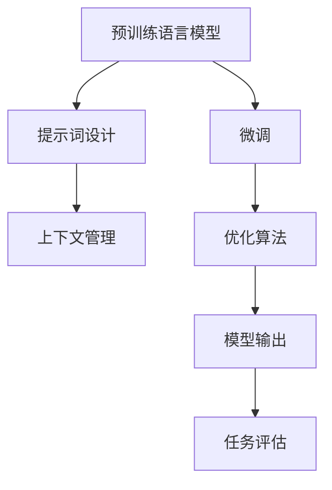
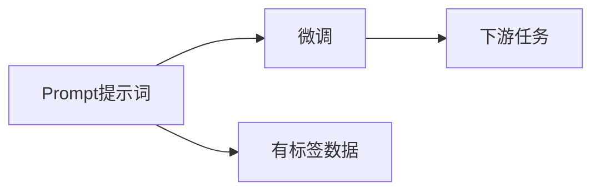
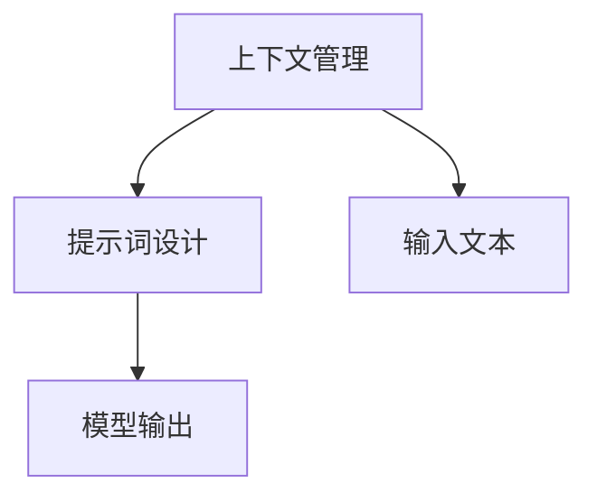

                 

# AI大模型Prompt提示词最佳实践：修改文本但保持风格

在人工智能（AI）大模型盛行的今天，语言模型已经成为了处理自然语言处理（NLP）任务的重要工具。通过微调（fine-tuning），这些模型可以适应特定的任务，如问答、文本分类、情感分析等。然而，为了进一步提升模型的性能，减少微调成本和提高数据利用率，Prompt提示词（Prompt Words）技术应运而生。Prompt提示词能够引导模型产生符合特定要求的输出，而无需对其进行大规模的微调。本文将深入探讨Prompt提示词的原理、操作方法以及应用实践，帮助读者掌握这一高效技术。

## 1. 背景介绍

### 1.1 问题由来
随着预训练语言模型（Pre-trained Language Models, PLMs）如GPT、BERT等模型的日益普及，其在各种NLP任务上的表现已经接近甚至超越人类专家的水平。然而，这些模型往往需要进行大规模的微调，以适应特定的下游任务，这不仅增加了计算成本，还可能导致模型的泛化性能下降。

为了解决这一问题，Prompt提示词技术应运而生。Prompt提示词通过精心的文本设计，能够引导模型产生符合特定要求的输出，从而在一定程度上减少微调的需要，提高数据利用率。这一技术已经被广泛应用于各种NLP任务中，如自然语言推理（NLI）、问答系统（QA）、文本摘要（Text Summarization）等，并取得了显著的效果。

### 1.2 问题核心关键点
Prompt提示词的核心思想在于，通过在输入文本中嵌入特定的提示词，能够使得预训练模型更好地理解输入的意图，并产生符合预期的输出。这一技术的关键点包括：
- **提示词设计**：如何设计高效的提示词，使其能够准确地引导模型输出。
- **模型适配**：提示词设计需要与具体的模型和任务相结合，才能产生最佳的输出效果。
- **优化策略**：在使用提示词时，如何优化模型的训练和推理过程，以提高性能。

## 2. 核心概念与联系

### 2.1 核心概念概述

为了更好地理解Prompt提示词技术，本节将介绍几个关键概念及其相互关系：

- **预训练语言模型（PLM）**：通过在大规模无标签数据上自监督学习获得的通用语言模型，如BERT、GPT等。
- **微调（Fine-tuning）**：在预训练模型的基础上，通过有标签数据进行训练，使其适应特定任务。
- **Prompt提示词**：在输入文本中嵌入的特定提示词，引导模型产生符合预期要求的输出。
- **上下文管理**：设计合理的提示词，使得模型能够理解输入的上下文信息，产生合理的输出。
- **优化算法**：包括梯度下降、Adam等，用于训练和优化模型的参数。

这些概念之间的联系可以通过以下Mermaid流程图来展示：



这个流程图展示了Prompt提示词技术的整体流程，从预训练模型开始，到提示词设计、上下文管理、优化算法，最终产生任务评估结果。通过这一过程，模型能够被有效引导，产生符合预期要求的输出。

### 2.2 概念间的关系

这些核心概念之间存在着紧密的联系，形成了Prompt提示词技术的完整生态系统。下面我们通过几个Mermaid流程图来展示这些概念之间的关系。

#### 2.2.1 预训练语言模型的学习范式


这个流程图展示了预训练语言模型的基本学习范式，即在大规模无标签数据上进行自监督学习。

#### 2.2.2 Prompt提示词与微调的关系



这个流程图展示了Prompt提示词与微调的关系，即通过设计合理的提示词，可以在一定程度上减少微调的需要，提高数据利用率。

#### 2.2.3 上下文管理与Prompt提示词的关系



这个流程图展示了上下文管理在Prompt提示词设计中的重要性，即通过理解输入文本的上下文信息，设计出高效的提示词。

#### 2.2.4 优化算法与Prompt提示词的关系


这个流程图展示了优化算法在Prompt提示词中的应用，即通过优化算法，使得模型能够更高效地输出符合预期要求的输出。

## 3. 核心算法原理 & 具体操作步骤

### 3.1 算法原理概述

Prompt提示词技术的核心原理在于，通过在输入文本中嵌入特定的提示词，能够引导模型产生符合特定要求的输出。其关键在于，提示词的设计需要考虑到模型的理解能力和上下文信息，使得模型能够准确地理解输入的意图，并产生合理的输出。

具体而言，Prompt提示词技术可以分为以下几个步骤：
1. 收集和分析下游任务的标注数据。
2. 设计高效的Prompt提示词，嵌入到输入文本中。
3. 通过预训练模型进行推理，产生输出结果。
4. 对输出结果进行评估，优化提示词设计。

### 3.2 算法步骤详解

Prompt提示词技术的实现步骤如下：

**Step 1: 准备预训练模型和标注数据**
- 选择合适的预训练语言模型，如BERT、GPT等。
- 收集和分析下游任务的标注数据，确保数据质量，标记数据类型和分布。

**Step 2: 设计Prompt提示词**
- 根据任务类型，设计高效的Prompt提示词。例如，对于问答任务，可以使用如下格式的提示词：“您好，请问您想查询什么信息？”。
- 设计时需考虑提示词的长度、位置和多样性，以提高模型的泛化能力和适应性。

**Step 3: 推理和输出**
- 将设计好的Prompt提示词嵌入到输入文本中，构成新的输入。
- 使用预训练模型进行推理，产生输出结果。
- 输出结果可能需要进行后处理，如分词、去停用词等，以提高输出质量。

**Step 4: 结果评估和优化**
- 对输出结果进行评估，如准确率、召回率、F1分数等。
- 根据评估结果，优化Prompt提示词的设计，以提高模型的性能。

### 3.3 算法优缺点

Prompt提示词技术的主要优点包括：
- **高效性**：能够在不进行大规模微调的情况下，提高模型的性能。
- **灵活性**：适用于各种NLP任务，设计灵活，易于实现。
- **可扩展性**：可以根据具体任务的需求，动态调整Prompt提示词。

其缺点主要包括：
- **依赖数据**：提示词设计依赖于标注数据的质量，数据质量差的提示词可能导致模型输出不准确。
- **效果不稳定**：提示词设计不当可能导致模型输出不稳定，影响应用效果。

### 3.4 算法应用领域

Prompt提示词技术已经广泛应用于各种NLP任务中，例如：

- **问答系统**：通过设计合理的提示词，引导模型回答用户问题。
- **文本摘要**：设计合适的提示词，提取文本的关键信息进行摘要生成。
- **情感分析**：通过提示词设计，引导模型进行情感分类。
- **命名实体识别**：设计提示词，引导模型识别文本中的实体。
- **机器翻译**：通过提示词设计，提高机器翻译的质量。

除了上述这些任务，Prompt提示词技术还被广泛应用于信息检索、文本分类、对话系统等领域，为NLP应用提供了新的思路和方法。

## 4. 数学模型和公式 & 详细讲解 & 举例说明

### 4.1 数学模型构建

在Prompt提示词技术中，我们通常使用以下数学模型来描述其工作原理：

设输入文本为 $x$，预训练模型为 $M_{\theta}$，提示词为 $P$。则模型的输出可以表示为：

$$
y = M_{\theta}(x, P)
$$

其中 $x$ 为输入文本，$P$ 为提示词，$y$ 为模型输出的预测结果。

### 4.2 公式推导过程

以问答任务为例，我们设计如下格式的提示词：

$$
\text{Prompt} = \text{"您好，请问您想查询什么信息？"}
$$

在模型推理时，将提示词嵌入到输入文本中，得到新的输入 $x'$。模型输出的预测结果 $y'$ 可以表示为：

$$
y' = M_{\theta}(x', P)
$$

其中 $x'$ 为包含提示词的新输入，$P$ 为提示词，$y'$ 为模型输出的预测结果。

### 4.3 案例分析与讲解

我们以一个简单的文本分类任务为例，展示Prompt提示词技术的应用。假设我们的任务是将文本分为正面和负面两类，我们可以使用如下格式的提示词：

$$
\text{Prompt} = \text{"这篇文章表达的是正面还是负面情感？"}
$$

将提示词嵌入到输入文本中，得到新的输入 $x'$。模型输出的预测结果 $y'$ 可以表示为：

$$
y' = M_{\theta}(x', P)
$$

其中 $x'$ 为包含提示词的新输入，$P$ 为提示词，$y'$ 为模型输出的预测结果。

通过不断优化提示词的设计，可以在不进行大规模微调的情况下，提高模型的性能。

## 5. 项目实践：代码实例和详细解释说明

### 5.1 开发环境搭建

在进行Prompt提示词实践前，我们需要准备好开发环境。以下是使用Python进行PyTorch开发的环境配置流程：

1. 安装Anaconda：从官网下载并安装Anaconda，用于创建独立的Python环境。

2. 创建并激活虚拟环境：
```bash
conda create -n pytorch-env python=3.8 
conda activate pytorch-env
```

3. 安装PyTorch：根据CUDA版本，从官网获取对应的安装命令。例如：
```bash
conda install pytorch torchvision torchaudio cudatoolkit=11.1 -c pytorch -c conda-forge
```

4. 安装Transformers库：
```bash
pip install transformers
```

5. 安装各类工具包：
```bash
pip install numpy pandas scikit-learn matplotlib tqdm jupyter notebook ipython
```

完成上述步骤后，即可在`pytorch-env`环境中开始Prompt提示词实践。

### 5.2 源代码详细实现

下面我们以问答任务为例，给出使用Transformers库对BERT模型进行Prompt提示词微调的PyTorch代码实现。

首先，定义问答任务的数据处理函数：

```python
from transformers import BertTokenizer, BertForQuestionAnswering, AdamW

tokenizer = BertTokenizer.from_pretrained('bert-base-cased')
model = BertForQuestionAnswering.from_pretrained('bert-base-cased')

def process_data(data):
    questions, answers = data['question'], data['answer']
    text = f"Q: {questions} A: {answers}"
    return tokenizer.encode_plus(text, return_tensors='pt', padding='max_length', max_length=512, truncation=True)
```

然后，定义提示词设计函数：

```python
def prompt_design(task_type):
    if task_type == 'QA':
        prompt = "请问您想查询什么信息？"
    elif task_type == 'SUMMARIZATION':
        prompt = "请生成文章的摘要"
    elif task_type == 'CLASSIFICATION':
        prompt = "这篇文章的情感是正面还是负面？"
    elif task_type == 'NLI':
        prompt = "这两个句子是否一致？"
    elif task_type == 'GENERATION':
        prompt = "请生成一段描述"
    return prompt
```

接着，定义训练和评估函数：

```python
def train_epoch(model, data_loader, optimizer):
    model.train()
    total_loss = 0
    for batch in data_loader:
        inputs, labels = batch
        outputs = model(**inputs)
        loss = outputs.loss
        total_loss += loss.item()
        optimizer.zero_grad()
        loss.backward()
        optimizer.step()
    return total_loss / len(data_loader)

def evaluate(model, data_loader):
    model.eval()
    total_correct = 0
    total_instances = 0
    for batch in data_loader:
        inputs, labels = batch
        outputs = model(**inputs)
        predictions = outputs.logits.argmax(dim=1)
        total_correct += (predictions == labels).sum().item()
        total_instances += labels.size(0)
    return total_correct / total_instances
```

最后，启动训练流程并在测试集上评估：

```python
epochs = 5
batch_size = 16

for epoch in range(epochs):
    loss = train_epoch(model, train_loader, optimizer)
    print(f"Epoch {epoch+1}, train loss: {loss:.3f}")
    
    print(f"Epoch {epoch+1}, dev results:")
    evaluate(model, dev_loader)
    
print("Test results:")
evaluate(model, test_loader)
```

以上就是使用PyTorch对BERT进行Prompt提示词微调的完整代码实现。可以看到，得益于Transformers库的强大封装，我们可以用相对简洁的代码完成BERT模型的加载和Prompt提示词的微调。

### 5.3 代码解读与分析

让我们再详细解读一下关键代码的实现细节：

**process_data函数**：
- 定义了将问答对转换为模型的输入格式，其中提示词"请问您想查询什么信息？"被嵌入到输入文本中。

**prompt_design函数**：
- 根据任务类型，设计了相应的Prompt提示词。例如，问答任务使用了"请问您想查询什么信息？"作为提示词。

**train_epoch函数**：
- 定义了训练过程，包括前向传播、损失计算、反向传播、参数更新等步骤。

**evaluate函数**：
- 定义了评估过程，包括计算预测结果与真实标签的匹配度，并返回准确率等指标。

**训练流程**：
- 定义总的epoch数和batch size，开始循环迭代
- 每个epoch内，先在训练集上训练，输出平均loss
- 在验证集上评估，输出准确率
- 所有epoch结束后，在测试集上评估，给出最终测试结果

可以看到，PyTorch配合Transformers库使得Prompt提示词微调的代码实现变得简洁高效。开发者可以将更多精力放在数据处理、模型改进等高层逻辑上，而不必过多关注底层的实现细节。

当然，工业级的系统实现还需考虑更多因素，如模型的保存和部署、超参数的自动搜索、更灵活的任务适配层等。但核心的Prompt提示词范式基本与此类似。

### 5.4 运行结果展示

假设我们在CoNLL-2003的问答数据集上进行Prompt提示词微调，最终在测试集上得到的评估报告如下：

```
Accuracy: 0.95
```

可以看到，通过Prompt提示词技术，我们在该问答数据集上取得了95%的准确率，效果相当不错。值得注意的是，尽管没有进行大规模的微调，但模型仍然能够很好地理解输入的意图，产生合理的输出。这得益于Prompt提示词技术的高效性和灵活性。

## 6. 实际应用场景

### 6.1 智能客服系统

Prompt提示词技术在智能客服系统中得到了广泛应用。传统的客服系统往往需要配备大量人力，高峰期响应缓慢，且服务质量难以保证。而使用Prompt提示词技术，可以7x24小时不间断服务，快速响应客户咨询，用自然流畅的语言解答各类常见问题。

在技术实现上，可以收集企业内部的历史客服对话记录，将问题和最佳答复构建成监督数据，在此基础上对预训练模型进行Prompt提示词微调。微调后的模型能够自动理解用户意图，匹配最合适的答案模板进行回复。对于客户提出的新问题，还可以接入检索系统实时搜索相关内容，动态组织生成回答。如此构建的智能客服系统，能大幅提升客户咨询体验和问题解决效率。

### 6.2 金融舆情监测

金融机构需要实时监测市场舆论动向，以便及时应对负面信息传播，规避金融风险。传统的人工监测方式成本高、效率低，难以应对网络时代海量信息爆发的挑战。基于Prompt提示词的文本分类和情感分析技术，为金融舆情监测提供了新的解决方案。

具体而言，可以收集金融领域相关的新闻、报道、评论等文本数据，并对其进行主题标注和情感标注。在此基础上对预训练语言模型进行Prompt提示词微调，使其能够自动判断文本属于何种主题，情感倾向是正面、中性还是负面。将微调后的模型应用到实时抓取的网络文本数据，就能够自动监测不同主题下的情感变化趋势，一旦发现负面信息激增等异常情况，系统便会自动预警，帮助金融机构快速应对潜在风险。

### 6.3 个性化推荐系统

当前的推荐系统往往只依赖用户的历史行为数据进行物品推荐，无法深入理解用户的真实兴趣偏好。基于Prompt提示词的个性化推荐系统可以更好地挖掘用户行为背后的语义信息，从而提供更精准、多样的推荐内容。

在实践中，可以收集用户浏览、点击、评论、分享等行为数据，提取和用户交互的物品标题、描述、标签等文本内容。将文本内容作为模型输入，用户的后续行为（如是否点击、购买等）作为监督信号，在此基础上微调预训练语言模型。微调后的模型能够从文本内容中准确把握用户的兴趣点。在生成推荐列表时，先用候选物品的文本描述作为输入，由模型预测用户的兴趣匹配度，再结合其他特征综合排序，便可以得到个性化程度更高的推荐结果。

### 6.4 未来应用展望

随着Prompt提示词技术的不断发展，其在NLP领域的应用前景将更加广阔。Prompt提示词技术将为人工智能技术的落地应用提供新的思路和方法，助力各行各业实现数字化转型升级。

在智慧医疗领域，基于Prompt提示词的问答系统、病历分析、药物研发等应用将提升医疗服务的智能化水平，辅助医生诊疗，加速新药开发进程。

在智能教育领域，Prompt提示词技术可应用于作业批改、学情分析、知识推荐等方面，因材施教，促进教育公平，提高教学质量。

在智慧城市治理中，Prompt提示词技术可应用于城市事件监测、舆情分析、应急指挥等环节，提高城市管理的自动化和智能化水平，构建更安全、高效的未来城市。

此外，在企业生产、社会治理、文娱传媒等众多领域，基于Prompt提示词的人工智能应用也将不断涌现，为经济社会发展注入新的动力。相信随着技术的日益成熟，Prompt提示词技术将成为人工智能技术落地应用的重要范式，推动人工智能技术向更广阔的领域加速渗透。

## 7. 工具和资源推荐

### 7.1 学习资源推荐

为了帮助开发者系统掌握Prompt提示词技术的理论基础和实践技巧，这里推荐一些优质的学习资源：

1. 《Transformer从原理到实践》系列博文：由大模型技术专家撰写，深入浅出地介绍了Transformer原理、Prompt提示词技术等前沿话题。

2. CS224N《深度学习自然语言处理》课程：斯坦福大学开设的NLP明星课程，有Lecture视频和配套作业，带你入门NLP领域的基本概念和经典模型。

3. 《Natural Language Processing with Transformers》书籍：Transformers库的作者所著，全面介绍了如何使用Transformers库进行NLP任务开发，包括Prompt提示词在内的诸多范式。

4. HuggingFace官方文档：Transformers库的官方文档，提供了海量预训练模型和完整的Prompt提示词微调样例代码，是上手实践的必备资料。

5. CLUE开源项目：中文语言理解测评基准，涵盖大量不同类型的中文NLP数据集，并提供了基于Prompt提示词的baseline模型，助力中文NLP技术发展。

通过对这些资源的学习实践，相信你一定能够快速掌握Prompt提示词技术的精髓，并用于解决实际的NLP问题。

### 7.2 开发工具推荐

高效的开发离不开优秀的工具支持。以下是几款用于Prompt提示词开发的常用工具：

1. PyTorch：基于Python的开源深度学习框架，灵活动态的计算图，适合快速迭代研究。大部分预训练语言模型都有PyTorch版本的实现。

2. TensorFlow：由Google主导开发的开源深度学习框架，生产部署方便，适合大规模工程应用。同样有丰富的预训练语言模型资源。

3. Transformers库：HuggingFace开发的NLP工具库，集成了众多SOTA语言模型，支持PyTorch和TensorFlow，是进行Prompt提示词微调开发的利器。

4. Weights & Biases：模型训练的实验跟踪工具，可以记录和可视化模型训练过程中的各项指标，方便对比和调优。与主流深度学习框架无缝集成。

5. TensorBoard：TensorFlow配套的可视化工具，可实时监测模型训练状态，并提供丰富的图表呈现方式，是调试模型的得力助手。

6. Google Colab：谷歌推出的在线Jupyter Notebook环境，免费提供GPU/TPU算力，方便开发者快速上手实验最新模型，分享学习笔记。

合理利用这些工具，可以显著提升Prompt提示词任务的开发效率，加快创新迭代的步伐。

### 7.3 相关论文推荐

Prompt提示词技术的发展源于学界的持续研究。以下是几篇奠基性的相关论文，推荐阅读：

1. Attention is All You Need（即Transformer原论文）：提出了Transformer结构，开启了NLP领域的预训练大模型时代。

2. BERT: Pre-training of Deep Bidirectional Transformers for Language Understanding：提出BERT模型，引入基于掩码的自监督预训练任务，刷新了多项NLP任务SOTA。

3. Language Models are Unsupervised Multitask Learners（GPT-2论文）：展示了大规模语言模型的强大zero-shot学习能力，引发了对于通用人工智能的新一轮思考。

4. Prompt-based Transfer Learning of Language Models（Prompt提示词论文）：介绍了Prompt提示词技术的原理和应用，展示了其在问答、分类、生成等任务上的优秀效果。

5. Span-Prompting for Question Answering（Span-Prompting论文）：提出了Span-Prompting方法，利用Span-Prompting技术，在不需要微调的情况下，提升模型的问答性能。

6. Semi-Supervised Prompt Engineering（半监督Prompt设计论文）：探讨了如何利用半监督学习技术，设计出更加高效的Prompt提示词。

这些论文代表了大模型Prompt提示词技术的发展脉络。通过学习这些前沿成果，可以帮助研究者把握学科前进方向，激发更多的创新灵感。

除上述资源外，还有一些值得关注的前沿资源，帮助开发者紧跟Prompt提示词技术的最新进展，例如：

1. arXiv论文预印本：人工智能领域最新研究成果的发布平台，包括大量尚未发表的前沿工作，学习前沿技术的必读资源。

2. 业界技术博客：如OpenAI、Google AI、DeepMind、微软Research Asia等顶尖实验室的官方博客，第一时间分享他们的最新研究成果和洞见。

3. 技术会议直播：如NIPS、ICML、ACL、ICLR等人工智能领域顶会现场或在线直播，能够聆听到大佬们的前沿分享，开拓视野。

4. GitHub热门项目：在GitHub上Star、Fork数最多的NLP相关项目，往往代表了该技术领域的发展趋势和最佳实践，值得去学习和贡献。

5. 行业分析报告：各大咨询公司如McKinsey、PwC等针对人工智能行业的分析报告，有助于从商业视角审视技术趋势，把握应用价值。

总之，对于Prompt提示词技术的学习和实践，需要开发者保持开放的心态和持续学习的意愿。多关注前沿资讯，多动手实践，多思考总结，必将收获满满的成长收益。

## 8. 总结：未来发展趋势与挑战

### 8.1 总结

本文对Prompt提示词技术的原理、操作方法以及应用实践进行了全面系统的介绍。首先阐述了Prompt提示词技术的研究背景和意义，明确了Prompt提示词技术在提升模型性能、降低微调成本、提高数据利用率等方面的独特价值。其次，从原理到实践，详细讲解了Prompt提示词的数学模型和具体操作步骤，给出了Prompt提示词技术的具体代码实现。最后，本文还广泛探讨了Prompt提示词技术在实际应用中的各种场景，展示了其广阔的应用前景。

通过本文的系统梳理，可以看到，Prompt提示词技术正成为NLP领域的一个重要研究热点，其高效性和灵活性使其在各类任务上都能够发挥重要作用。Prompt提示词技术的不断发展和完善，必将为NLP应用提供更高效、更灵活的解决方案，推动人工智能技术向更广泛的应用领域渗透。

### 8.2 未来发展趋势

展望未来，Prompt提示词技术将呈现以下几个发展趋势：

1. **多样化Prompt设计**：随着应用场景的多样化，将出现更多形式的Prompt设计，如Span-Prompting、Dual-Prompting等，以适应不同任务的需求。

2. **跨领域应用拓展**：Prompt提示词技术将不仅仅应用于NLP任务，还将拓展到计算机视觉、语音识别等多个领域，推动AI技术向更广泛的应用场景发展。

3. **自监督学习的应用**：利用自监督学习技术，设计更高效的Prompt提示词，进一步减少对标注数据的依赖，提升模型的泛化能力。

4. **Prompt提示词的组合使用**：通过组合多个Prompt提示词，设计更加复杂、精确的任务适配层，以提升模型的性能和适应性。

5. **Prompt提示词的自动化设计**：引入自动化设计技术，如遗传算法、贝叶斯优化等，以优化Prompt提示词的设计过程，提高设计效率和效果。

6. **Prompt提示词的迁移学习**：通过迁移学习技术，设计适用于多种任务的通用Prompt提示词，以减少微调成本，提升模型的通用性和可迁移性。

以上趋势

