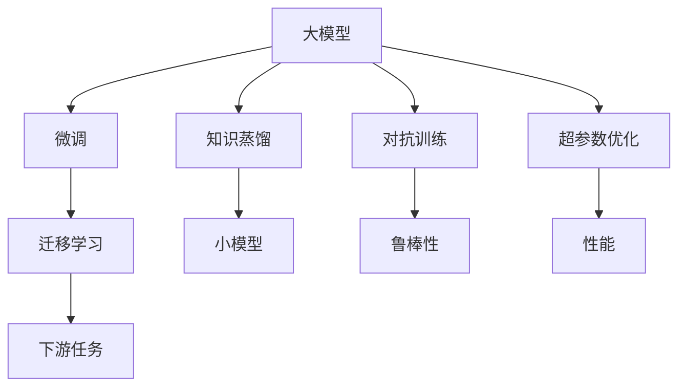

                 

# AI大模型创业：如何应对未来价格战？

在人工智能领域，AI大模型的应用已经渗透到各行各业，从金融、医疗到教育、娱乐，大模型的影响力越来越广泛。然而，随着市场的竞争日益激烈，价格战成为不可忽视的现实。如何在价格战中脱颖而出，不仅考验着创业公司的技术实力，也考验着其商业模式、运营策略和市场营销能力。本文将探讨AI大模型创业公司在价格战中的应对策略，包括产品定位、技术创新、成本控制和市场竞争等方面，以期为创业公司提供有价值的参考。

## 1. 背景介绍

### 1.1 人工智能与大模型发展现状

人工智能技术正以前所未有的速度发展，尤其是在自然语言处理、计算机视觉、语音识别等领域，大模型已经成为行业标准。以BERT、GPT-3、T5等为代表的大模型，不仅具备强大的语言理解和生成能力，还能通过微调应用于各种下游任务，如情感分析、机器翻译、自动摘要等，极大地提升了自然语言处理任务的性能。

### 1.2 价格战的背景

随着人工智能技术的普及，大模型应用的门槛降低，越来越多的公司和创业团队进入了这一领域。竞争的加剧导致市场供求关系变化，价格战成为难以避免的现象。一些公司通过降低价格吸引客户，而另一些公司则通过提供更加优质的服务或技术优势来应对价格战。

## 2. 核心概念与联系

### 2.1 核心概念概述

为更好地理解AI大模型创业公司在价格战中的应对策略，本节将介绍几个关键概念及其之间的关系：

- **大模型（Large Model）**：指包含大量参数的深度神经网络模型，如BERT、GPT-3等，能够处理复杂且大规模的数据集，具有强大的学习能力和泛化能力。

- **微调（Fine-tuning）**：通过在大模型上添加任务适配层，使用下游任务的标注数据进行有监督学习，优化模型在特定任务上的表现。

- **迁移学习（Transfer Learning）**：在大模型上微调，使其能够适应新的任务和数据，实现跨领域的应用。

- **知识蒸馏（Knowledge Distillation）**：将大模型的知识迁移到小模型上，提升小模型的性能。

- **对抗训练（Adversarial Training）**：通过引入对抗样本，提高模型的鲁棒性和泛化能力。

- **超参数优化（Hyperparameter Optimization）**：通过搜索和调整模型的超参数，优化模型的性能和效率。

这些概念之间的关系可以通过以下Mermaid流程图来展示：



这个流程图展示了大模型的核心概念及其之间的关系：大模型通过微调、迁移学习、知识蒸馏、对抗训练和超参数优化等技术，提升其在特定任务上的性能和鲁棒性，从而更好地适应市场竞争。

### 2.2 概念间的关系

这些核心概念之间存在着紧密的联系，形成了大模型创业公司的技术生态系统。以下是这些概念在大模型创业公司中的实际应用：

- **微调和迁移学习**：通过在特定任务上微调或迁移学习，提升大模型在具体应用场景中的性能，满足不同行业的需求。
- **知识蒸馏**：通过知识蒸馏，使用大模型的知识迁移至小模型，降低成本同时保持高质量的输出。
- **对抗训练**：通过对抗训练，提高大模型的鲁棒性，适应各种复杂的输入数据。
- **超参数优化**：通过超参数优化，在大模型训练和微调过程中找到最优的参数组合，提高模型性能和效率。

## 3. 核心算法原理 & 具体操作步骤

### 3.1 算法原理概述

AI大模型创业公司应对价格战的策略主要基于以下几个算法原理：

- **基于迁移学习的微调**：利用大模型在通用领域的知识，通过微调应用于特定任务，降低标注数据需求，提高模型性能。
- **知识蒸馏技术**：将大模型的知识迁移到小模型中，降低成本同时保持高精度。
- **对抗训练**：引入对抗样本，提高模型的鲁棒性和泛化能力。
- **超参数优化**：通过搜索最优的超参数组合，优化模型性能和效率。

### 3.2 算法步骤详解

基于以上算法原理，AI大模型创业公司在应对价格战时可以采取以下具体步骤：

**步骤1：选择合适的模型和任务**
- 选择具有强大泛化能力和高性能的大模型作为基础。
- 确定目标任务，如情感分析、机器翻译、文本分类等，并收集相应的标注数据集。

**步骤2：微调和迁移学习**
- 在大模型基础上进行微调，使用任务适配层和标注数据进行有监督学习。
- 利用迁移学习，将大模型在通用领域的知识应用于特定任务，提高模型性能和泛化能力。

**步骤3：知识蒸馏**
- 使用大模型作为“教师”，小模型作为“学生”，通过知识蒸馏技术，将大模型的知识迁移到小模型中，降低成本。

**步骤4：对抗训练**
- 通过引入对抗样本，提高模型的鲁棒性和泛化能力，使其在面对噪声数据和对抗攻击时仍能保持稳定输出。

**步骤5：超参数优化**
- 通过网格搜索或贝叶斯优化等方法，搜索最优的超参数组合，优化模型性能和效率。

**步骤6：模型部署和测试**
- 将微调后的模型部署到实际应用中，并进行测试和优化。
- 定期收集用户反馈，持续改进模型和优化策略。

### 3.3 算法优缺点

基于迁移学习和微调的大模型创业公司应对价格战的策略，有以下优点和缺点：

**优点**：
- 降低标注数据需求：通过迁移学习和微调，可以在少量标注数据下训练高质量模型。
- 提升模型性能：利用大模型的知识，提高模型在特定任务上的表现。
- 降低成本：通过知识蒸馏和对抗训练，可以降低模型训练和部署的成本。

**缺点**：
- 需要大量计算资源：微调和迁移学习需要较大的计算资源和标注数据。
- 模型复杂度高：大模型和微调过程复杂，训练和优化难度大。
- 模型部署难度高：大规模模型的部署需要高性能硬件和优化策略。

### 3.4 算法应用领域

基于迁移学习和微调的大模型创业公司的策略，可以应用于多个领域，例如：

- **金融科技**：利用大模型进行情感分析、舆情监测、信用评估等。
- **医疗健康**：使用大模型进行疾病诊断、病历分析、药物研发等。
- **智能客服**：通过微调大模型，提供自动回复、情感分析、智能推荐等。
- **电子商务**：利用大模型进行商品推荐、用户画像、营销分析等。
- **教育培训**：使用大模型进行学生评估、学习路径规划、个性化教学等。

## 4. 数学模型和公式 & 详细讲解 & 举例说明

### 4.1 数学模型构建

在AI大模型创业公司应对价格战的过程中，数学模型和公式起到了关键作用。以下是一个典型的数学模型构建过程：

- **输入层**：原始输入数据，如文本、图像、声音等。
- **编码层**：将输入数据转换为高维特征表示。
- **隐层**：进行特征提取和知识表示，捕捉输入数据的内在结构。
- **解码层**：将隐层输出的特征映射到输出空间，如分类、生成、回归等。

### 4.2 公式推导过程

以情感分析任务为例，假设输入为文本 $x$，输出为情感标签 $y$。常用的数学模型为卷积神经网络（CNN）或循环神经网络（RNN），公式推导如下：

$$
\begin{aligned}
\text{Convolutional Layer: } & f(x) = \sum_{i=1}^k w_i x_i + b \\
\text{Recurrent Layer: } & g(x) = \sum_{i=1}^n w_i x_i + b
\end{aligned}
$$

其中，$k$ 和 $n$ 分别表示卷积核和循环单元的数量，$w_i$ 和 $b$ 分别为卷积核和循环单元的权重和偏置。

### 4.3 案例分析与讲解

假设我们使用BERT模型进行情感分析，训练步骤如下：

1. **数据准备**：收集标注情感标签的数据集，分为训练集、验证集和测试集。
2. **模型初始化**：选择预训练的BERT模型作为基础模型。
3. **微调训练**：在大模型基础上进行微调，使用情感分类任务进行有监督学习。
4. **测试评估**：在测试集上评估微调后的模型性能。

## 5. 项目实践：代码实例和详细解释说明

### 5.1 开发环境搭建

在AI大模型创业公司中，开发环境搭建是基础。以下是一些常用的开发环境和工具：

- **Python**：使用Python语言进行模型开发和数据分析。
- **PyTorch**：使用PyTorch框架进行深度学习模型的实现。
- **Jupyter Notebook**：使用Jupyter Notebook进行模型调试和数据可视化。
- **GitHub**：使用GitHub进行代码托管和团队协作。

### 5.2 源代码详细实现

以下是一个使用PyTorch实现情感分析任务的示例代码：

```python
import torch
import torch.nn as nn
import torch.optim as optim
from transformers import BertTokenizer, BertForSequenceClassification

# 定义模型
class SentimentAnalysis(nn.Module):
    def __init__(self):
        super(SentimentAnalysis, self).__init__()
        self.bert = BertForSequenceClassification.from_pretrained('bert-base-uncased', num_labels=2)
        self.dropout = nn.Dropout(0.1)
        self.fc = nn.Linear(768, 2)
    
    def forward(self, input_ids, attention_mask, token_type_ids):
        outputs = self.bert(input_ids, attention_mask=attention_mask, token_type_ids=token_type_ids)
        pooled_output = outputs.pooler_output
        pooled_output = self.dropout(pooled_output)
        logits = self.fc(pooled_output)
        return logits

# 定义训练函数
def train(model, device, train_loader, optimizer, criterion, epochs):
    model.to(device)
    for epoch in range(epochs):
        model.train()
        total_loss = 0
        for batch in train_loader:
            input_ids = batch['input_ids'].to(device)
            attention_mask = batch['attention_mask'].to(device)
            token_type_ids = batch['token_type_ids'].to(device)
            labels = batch['labels'].to(device)
            optimizer.zero_grad()
            logits = model(input_ids, attention_mask=attention_mask, token_type_ids=token_type_ids)
            loss = criterion(logits, labels)
            loss.backward()
            optimizer.step()
            total_loss += loss.item()
        print(f"Epoch {epoch+1}, loss: {total_loss/len(train_loader):.4f}")

# 定义评估函数
def evaluate(model, device, test_loader, criterion):
    model.eval()
    total_loss = 0
    total_correct = 0
    for batch in test_loader:
        input_ids = batch['input_ids'].to(device)
        attention_mask = batch['attention_mask'].to(device)
        token_type_ids = batch['token_type_ids'].to(device)
        labels = batch['labels'].to(device)
        with torch.no_grad():
            logits = model(input_ids, attention_mask=attention_mask, token_type_ids=token_type_ids)
            loss = criterion(logits, labels)
            total_loss += loss.item()
            total_correct += (logits.argmax(dim=1) == labels).sum().item()
    print(f"Test loss: {total_loss/len(test_loader):.4f}, accuracy: {total_correct/len(test_loader):.4f}")
```

### 5.3 代码解读与分析

以上代码实现了使用BERT进行情感分析的任务。具体来说，代码包括以下步骤：

1. **模型定义**：定义一个SentimentAnalysis类，继承自nn.Module，并初始化BERT模型和全连接层。
2. **训练函数**：定义训练函数，在每个epoch内进行前向传播、反向传播和参数更新。
3. **评估函数**：定义评估函数，计算模型在测试集上的损失和准确率。

## 6. 实际应用场景

### 6.1 金融科技

在金融科技领域，AI大模型可以用于情感分析、舆情监测、信用评估等。例如，使用BERT模型进行金融舆情分析，可以实时监测市场情绪变化，预测股市走势，帮助投资者做出明智决策。

### 6.2 医疗健康

在医疗健康领域，大模型可以用于疾病诊断、病历分析、药物研发等。例如，使用BERT模型进行病历文本分析，可以自动提取关键信息，辅助医生进行诊断和治疗。

### 6.3 智能客服

在智能客服领域，大模型可以用于自动回复、情感分析、智能推荐等。例如，使用BERT模型进行情感分析，可以自动理解客户情绪，提供个性化的服务建议。

### 6.4 未来应用展望

随着AI大模型的不断发展和应用，未来在更多领域将会看到其广泛的应用。例如，在教育培训、电子商务、安全监控等领域，大模型将发挥越来越重要的作用。

## 7. 工具和资源推荐

### 7.1 学习资源推荐

为了帮助AI大模型创业公司快速掌握相关技术，以下是一些学习资源推荐：

- **Coursera**：提供深度学习、自然语言处理等领域的课程。
- **Kaggle**：提供大量数据集和竞赛，帮助学习者进行实践和挑战。
- **Transformers官方文档**：详细介绍了大模型的使用方法和最佳实践。

### 7.2 开发工具推荐

为了提高AI大模型创业公司的开发效率，以下是一些推荐开发工具：

- **PyTorch**：提供高效的深度学习框架和API，支持多种模型和算法。
- **TensorFlow**：提供灵活的计算图和分布式训练支持。
- **Jupyter Notebook**：提供交互式环境，方便模型调试和可视化。

### 7.3 相关论文推荐

为了了解AI大模型创业公司的最新研究进展，以下是一些相关论文推荐：

- **BERT: Pre-training of Deep Bidirectional Transformers for Language Understanding**：提出BERT模型，并在情感分析等任务上取得了优异表现。
- **Attention is All You Need**：提出Transformer结构，为后续大模型的发展奠定了基础。
- **Knowledge Distillation**：提出知识蒸馏技术，将大模型的知识迁移到小模型中。

## 8. 总结：未来发展趋势与挑战

### 8.1 研究成果总结

AI大模型创业公司应对价格战的策略主要基于迁移学习、微调、知识蒸馏、对抗训练和超参数优化等技术。通过这些技术，可以在少量标注数据下训练高质量模型，提升模型性能和泛化能力，降低成本。然而，大模型的训练和微调需要大量计算资源和标注数据，模型部署和优化难度大，这些是面临的主要挑战。

### 8.2 未来发展趋势

未来，AI大模型创业公司在应对价格战的过程中，将呈现以下几个发展趋势：

1. **模型的轻量化**：随着计算资源的普及，轻量级模型将成为主流，降低成本的同时保持高质量输出。
2. **边缘计算**：将大模型部署到边缘计算设备上，减少传输延迟，提高实时性。
3. **自动化微调**：通过自动化微调技术，加速模型训练和优化过程，提高生产效率。
4. **多模态融合**：将文本、图像、声音等多模态信息进行融合，提升模型在复杂场景下的表现。
5. **模型解释性**：提高模型的可解释性，增强用户信任和接受度。

### 8.3 面临的挑战

AI大模型创业公司面临的主要挑战包括：

1. **计算资源限制**：大模型的训练和微调需要大量计算资源，如何高效利用资源是关键。
2. **标注数据获取**：大规模标注数据的获取成本高，如何降低标注数据需求是难点。
3. **模型鲁棒性**：大模型容易受到对抗攻击，如何提高模型鲁棒性是重要课题。
4. **模型解释性**：大模型的决策过程缺乏可解释性，如何增强模型解释性是重要研究方向。

### 8.4 研究展望

未来，AI大模型创业公司需要在以下方面进行深入研究：

1. **自动化微调技术**：开发高效的自动化微调方法，降低人工干预和优化难度。
2. **多模态融合技术**：将文本、图像、声音等多模态信息进行融合，提升模型性能。
3. **轻量化模型**：开发轻量级模型，提高模型部署和训练效率。
4. **模型解释性**：提高模型的可解释性，增强用户信任和接受度。

总之，AI大模型创业公司应对价格战需要从技术、商业模式、运营策略等多个方面综合考虑，不断提高自身竞争力，才能在激烈的市场竞争中脱颖而出。

## 9. 附录：常见问题与解答

### Q1: 为什么AI大模型创业公司要应对价格战？

A: AI大模型创业公司面临价格战的原因是多方面的。首先，随着技术的普及，市场竞争加剧，新的创业公司不断涌现，导致价格战不可避免。其次，AI大模型的高昂研发成本和数据需求，使得大模型创业公司的门槛较高，需要快速占领市场以获取更多用户和客户。最后，价格战可以帮助创业公司快速积累市场份额，为后续的创新和发展提供资金支持。

### Q2: 如何选择合适的AI大模型？

A: 选择合适的AI大模型需要考虑多个因素，如模型的性能、泛化能力、可解释性、鲁棒性等。以下是一些选择建议：

1. **性能和泛化能力**：选择具有高精度和高泛化能力的模型，如BERT、GPT等。
2. **可解释性**：选择具有良好可解释性的模型，如基于可解释性模型的决策过程，增强用户信任和接受度。
3. **鲁棒性**：选择具有高鲁棒性的模型，如经过对抗训练的模型，提高模型的稳定性和可靠性。

### Q3: 如何提高AI大模型的可解释性？

A: 提高AI大模型的可解释性可以从以下几个方面入手：

1. **可视化**：使用可视化工具展示模型的决策过程，如使用SHAP、LIME等工具。
2. **特征重要性分析**：分析模型的特征重要性，理解模型主要依赖哪些特征进行决策。
3. **可解释模型**：选择基于可解释性模型的架构，如决策树、线性模型等，提升模型的可解释性。

总之，AI大模型创业公司应对价格战需要从多个方面进行综合考虑，不断提高自身竞争力，才能在激烈的市场竞争中脱颖而出。希望本文能为创业公司提供有价值的参考和指导。

---

作者：禅与计算机程序设计艺术 / Zen and the Art of Computer Programming

