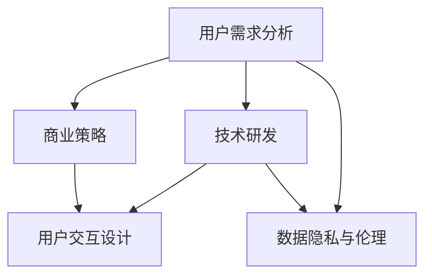
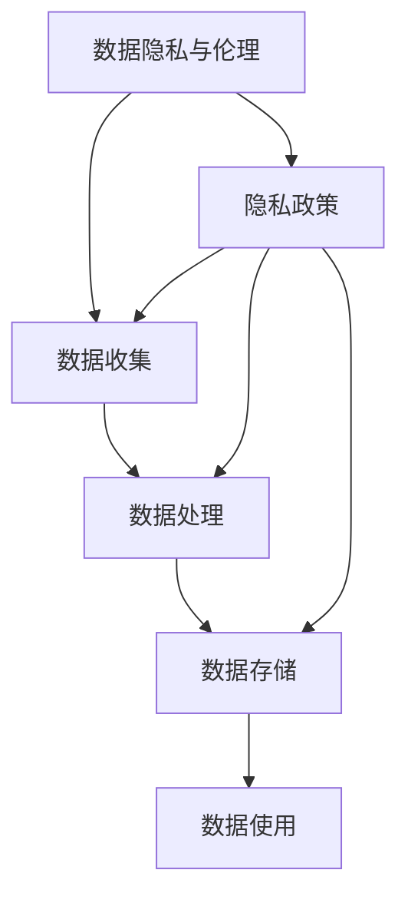
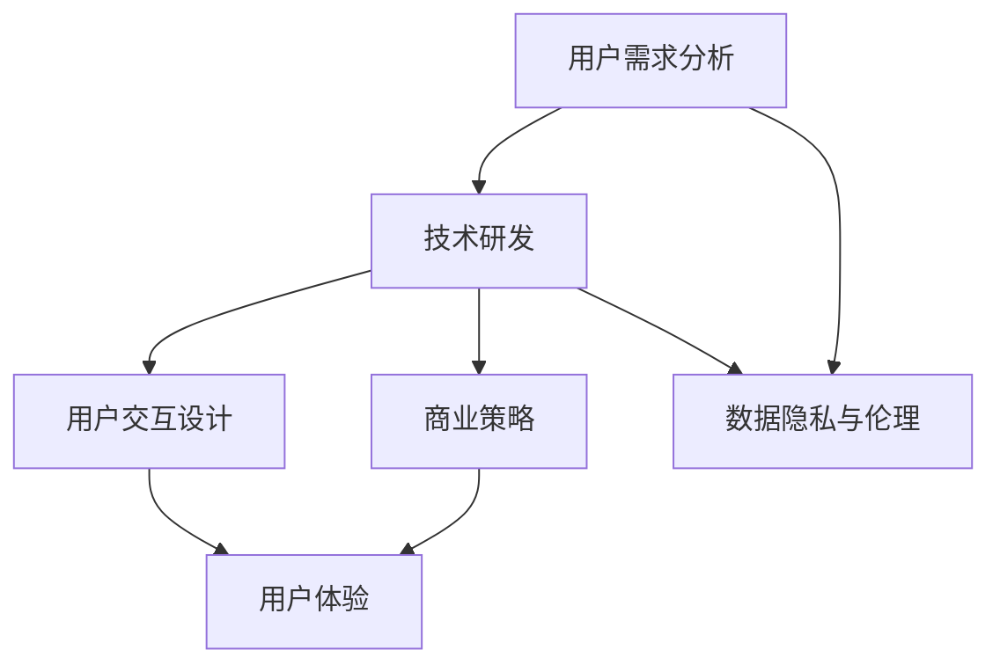

                 

# AI大模型创业：如何应对未来用户需求？

> 关键词：AI创业,大模型,用户需求,技术研发,商业策略

## 1. 背景介绍

### 1.1 问题由来
在过去几十年中，人工智能(AI)技术经历了迅速的发展，从早期的专家系统到机器学习、深度学习，再到目前火热的AI大模型，每一步都是技术突破和商业应用的共同推动。特别是近年来，预训练大模型（如GPT-3、BERT等）的崛起，使得AI技术的应用范围和深度前所未有。但随着市场需求的不断变化，AI大模型创业公司面临的挑战也在不断增加。如何准确捕捉用户需求，为用户提供更符合其期望的解决方案，成为每个AI公司都亟需解决的课题。

### 1.2 问题核心关键点
AI大模型创业的核心在于如何在大模型技术的基础上，精准定位市场需求，设计高效、可扩展的解决方案，实现商业落地。具体而言，主要包括以下几个方面：
1. **用户需求分析**：识别和理解用户的实际需求和痛点，提供定制化解决方案。
2. **技术研发**：基于大模型进行关键技术研发，确保产品性能和质量。
3. **商业策略**：制定合适的市场推广和商业模式，实现可持续发展。
4. **用户交互设计**：设计易于使用、符合用户习惯的交互界面，提升用户体验。
5. **数据隐私与伦理**：确保数据隐私和安全，遵守伦理规范，赢得用户信任。

### 1.3 问题研究意义
研究AI大模型创业的成功策略，对于推动AI技术在各行各业的普及应用，提升企业竞争力，具有重要意义：
1. 降低技术研发成本。通过精准定位用户需求，可以避免开发方向上的弯路，提高研发效率。
2. 提升用户满意度。精准满足用户需求，可以有效提升产品竞争力，赢得市场认可。
3. 加速商业落地。合理的商业策略和商业模式，可以快速实现产品市场化和商业化。
4. 增强数据安全性。重视数据隐私和伦理规范，提升品牌形象和用户信任。

## 2. 核心概念与联系

### 2.1 核心概念概述

AI大模型创业涉及的核心概念包括：

- **AI大模型**：指通过大规模无标签数据进行预训练，学习通用语言表示的深度学习模型，如GPT-3、BERT等。
- **用户需求分析**：通过问卷调查、用户访谈、数据分析等方法，识别和理解用户的实际需求和痛点。
- **技术研发**：基于AI大模型进行关键技术研发，包括微调、模型压缩、数据增强等。
- **商业策略**：制定市场推广和商业模式，如订阅制、按需付费、定制服务等，实现可持续发展。
- **用户交互设计**：设计符合用户习惯、易于使用的交互界面，提升用户体验。
- **数据隐私与伦理**：确保数据隐私和安全，遵守伦理规范，赢得用户信任。

这些核心概念之间相互联系，共同构成了AI大模型创业的完整生态系统。下面我们通过一个Mermaid流程图来展示这些概念之间的逻辑关系：



这个流程图展示了大模型创业的主要步骤：首先，通过用户需求分析识别用户痛点；其次，基于大模型进行技术研发；再次，设计用户交互界面；接着，制定商业策略；最后，确保数据隐私和伦理规范。通过这些步骤的串联，可以有效推动AI大模型创业的成功。

### 2.2 概念间的关系

这些核心概念之间存在着紧密的联系，形成了AI大模型创业的完整流程。下面我们通过几个Mermaid流程图来展示这些概念之间的关系。

#### 2.2.1 用户需求分析和技术研发的关系


这个流程图展示了用户需求分析和技术研发的关系。首先，通过用户需求分析，识别和记录用户的需求和痛点；然后，将这些需求转化为技术研发任务，进行解决方案设计；最后，将需求文档传递给技术团队进行开发。

#### 2.2.2 技术研发和用户交互设计的关系


这个流程图展示了技术研发和用户交互设计的关系。首先，技术团队基于需求进行解决方案设计；然后，将原型设计交给交互设计团队，进行用户体验优化；最后，将优化后的原型反馈给技术团队，进行迭代开发。

#### 2.2.3 数据隐私与伦理的保障



这个流程图展示了数据隐私与伦理的保障流程。首先，确保数据收集、处理、存储和使用的全过程遵守隐私政策；然后，将隐私政策作为数据处理的标准，确保数据的合规性；最后，将合规数据用于技术研发和用户体验优化。

### 2.3 核心概念的整体架构

最后，我们用一个综合的流程图来展示这些核心概念在大模型创业中的整体架构：



这个综合流程图展示了从用户需求分析到商业落地的完整过程。用户需求分析是起点，技术研发是核心，用户交互设计和商业策略是保障，数据隐私与伦理是底线。通过这些步骤的组合，可以有效地推动AI大模型创业的落地和成功。

## 3. 核心算法原理 & 具体操作步骤
### 3.1 算法原理概述

AI大模型创业的核心算法原理可以总结为以下几个方面：

- **用户需求分析**：采用问卷调查、用户访谈、数据分析等方法，收集用户反馈和行为数据，识别用户需求和痛点。
- **技术研发**：基于AI大模型进行微调、模型压缩、数据增强等技术研发，提升产品性能和质量。
- **商业策略**：制定合适的市场推广和商业模式，如订阅制、按需付费、定制服务等，实现可持续发展。
- **用户交互设计**：设计符合用户习惯、易于使用的交互界面，提升用户体验。
- **数据隐私与伦理**：确保数据隐私和安全，遵守伦理规范，赢得用户信任。

### 3.2 算法步骤详解

AI大模型创业的算法步骤可以分为以下几个主要阶段：

1. **需求识别**：通过问卷调查、用户访谈、数据分析等方法，识别用户需求和痛点，形成需求文档。
2. **需求分析**：分析用户需求，确定核心功能和特性，形成产品规格书。
3. **技术研发**：基于大模型进行微调、模型压缩、数据增强等技术研发，提升产品性能和质量。
4. **原型设计**：设计产品原型，进行用户体验测试和优化。
5. **商业策略**：制定市场推广和商业模式，如订阅制、按需付费、定制服务等，实现可持续发展。
6. **上线部署**：将产品上线，进行用户反馈收集和迭代优化。
7. **数据隐私与伦理**：确保数据隐私和安全，遵守伦理规范，赢得用户信任。

### 3.3 算法优缺点

AI大模型创业的算法有如下优点：

- **技术前沿**：基于大模型进行技术研发，可以充分利用最新技术，提升产品性能和质量。
- **用户定制化**：通过用户需求分析，可以提供定制化解决方案，满足用户多样化需求。
- **可持续发展**：合理的商业策略和商业模式，可以确保项目的可持续发展和商业化。

但同时也存在以下缺点：

- **研发成本高**：大模型研发需要投入大量资源，包括数据、计算和人力等。
- **数据隐私风险**：处理大量用户数据，需要严格保护用户隐私，避免数据泄露和滥用。
- **市场竞争激烈**：AI大模型市场竞争激烈，需要持续创新和优化才能保持竞争力。

### 3.4 算法应用领域

AI大模型创业的算法主要应用于以下几个领域：

- **自然语言处理(NLP)**：基于大模型进行文本分类、情感分析、问答系统等任务。
- **计算机视觉(CV)**：基于大模型进行图像分类、目标检测、图像生成等任务。
- **语音识别与生成**：基于大模型进行语音识别、语音合成、对话系统等任务。
- **推荐系统**：基于大模型进行个性化推荐，提升用户满意度。
- **智能客服**：基于大模型构建智能客服系统，提高服务效率和质量。
- **医疗健康**：基于大模型进行疾病诊断、健康监测、药物研发等任务。

## 4. 数学模型和公式 & 详细讲解 & 举例说明

### 4.1 数学模型构建

AI大模型创业中的数学模型构建主要涉及以下几个方面：

- **用户需求分析模型**：通过问卷调查和数据分析，构建用户需求模型。
- **技术研发模型**：基于大模型进行微调、模型压缩、数据增强等技术研发，构建产品性能模型。
- **商业策略模型**：通过市场分析和用户反馈，构建商业策略模型，确定推广和定价策略。
- **用户交互设计模型**：通过用户体验测试，构建用户交互设计模型，优化界面和交互流程。
- **数据隐私与伦理模型**：通过数据隐私法规，构建数据隐私与伦理模型，确保数据合规和安全。

### 4.2 公式推导过程

这里以用户需求分析模型为例，进行公式推导。假设用户需求矩阵为 $D \in \mathbb{R}^{n \times m}$，其中 $n$ 为需求数量，$m$ 为用户数量。用户对每个需求的重要性评分矩阵为 $R \in \mathbb{R}^{n \times m}$。则用户需求分析模型的目标函数为：

$$
\min \limits_{D, R} \frac{1}{m} \sum_{i=1}^m \sum_{j=1}^n (R_{ij} \log(D_{ij})) - \lambda \|D\|_F^2
$$

其中，$\lambda$ 为正则化系数，$\|D\|_F$ 为矩阵 $D$ 的 Frobenius 范数。该目标函数通过最大化用户评分，最小化需求矩阵的复杂度，实现用户需求的最大化匹配。

### 4.3 案例分析与讲解

假设我们有一个AI大模型创业项目，目标是构建一个基于大模型的问答系统。以下是该项目的数学模型和公式推导过程：

1. **用户需求分析**：通过问卷调查和用户访谈，收集用户对问答系统的需求和痛点。
2. **需求矩阵构建**：将用户需求转化为矩阵 $D \in \mathbb{R}^{n \times m}$，其中 $n$ 为需求数量，$m$ 为用户数量。
3. **用户评分矩阵构建**：根据用户访谈和问卷调查结果，构建用户评分矩阵 $R \in \mathbb{R}^{n \times m}$，表示用户对每个需求的评分。
4. **模型求解**：使用梯度下降等优化算法，求解目标函数，得到用户需求矩阵 $D$ 和用户评分矩阵 $R$。
5. **技术研发**：基于大模型进行微调，设计问答系统，并进行性能测试和优化。
6. **商业策略**：制定市场推广和商业模式，如按需付费、订阅制等，确保项目的可持续发展。
7. **用户交互设计**：设计符合用户习惯的交互界面，提升用户体验。
8. **数据隐私与伦理**：确保用户数据隐私和安全，遵守伦理规范，赢得用户信任。

## 5. 项目实践：代码实例和详细解释说明

### 5.1 开发环境搭建

在进行AI大模型创业项目开发前，我们需要准备好开发环境。以下是使用Python进行PyTorch开发的环境配置流程：

1. 安装Anaconda：从官网下载并安装Anaconda，用于创建独立的Python环境。
2. 创建并激活虚拟环境：
```bash
conda create -n pytorch-env python=3.8 
conda activate pytorch-env
```
3. 安装PyTorch：根据CUDA版本，从官网获取对应的安装命令。例如：
```bash
conda install pytorch torchvision torchaudio cudatoolkit=11.1 -c pytorch -c conda-forge
```
4. 安装Transformers库：
```bash
pip install transformers
```
5. 安装各类工具包：
```bash
pip install numpy pandas scikit-learn matplotlib tqdm jupyter notebook ipython
```

完成上述步骤后，即可在`pytorch-env`环境中开始创业项目开发。

### 5.2 源代码详细实现

下面以基于大模型的问答系统为例，给出使用Transformers库进行开发的PyTorch代码实现。

首先，定义问答系统的输入和输出：

```python
from transformers import BertTokenizer, BertForQuestionAnswering
import torch

tokenizer = BertTokenizer.from_pretrained('bert-base-uncased')
model = BertForQuestionAnswering.from_pretrained('bert-base-uncased')

question = "Who was the first president of the United States?"
context = "George Washington was the first president of the United States."
```

然后，对输入文本进行编码，并计算问答结果：

```python
input_ids = tokenizer(question, context, return_tensors='pt').input_ids
start_scores, end_scores = model(input_ids).start_logits, model(input_ids).end_logits
```

最后，解码问答结果：

```python
start_index = torch.argmax(start_scores).item()
end_index = torch.argmax(end_scores).item()
answer = tokenizer.convert_tokens_to_string(tokenizer.convert_ids_to_tokens(input_ids[0][start_index:end_index+1]))
```

这就是使用PyTorch和Transformers库进行大模型创业项目的代码实现。可以看到，由于Transformers库的强大封装，我们可以用相对简洁的代码实现大模型的问答功能。

### 5.3 代码解读与分析

让我们再详细解读一下关键代码的实现细节：

**输入输出定义**：
- 通过BertTokenizer将问题和上下文进行编码，得到input_ids，用于输入模型。
- 使用BertForQuestionAnswering模型计算问答结果的start和end logits，表示答案的起始和终止位置。

**计算问答结果**：
- 将start和end logits通过argmax函数获取最大值，得到答案的起始和终止位置。
- 通过Tokenizer将id序列转换为token序列，并拼接成答案字符串。

**代码执行结果**：
- 如果模型训练良好，上述代码将能够准确地返回问题“Who was the first president of the United States?”的答案是“George Washington”。

这个代码实例展示了使用大模型进行问答系统开发的简单流程。当然，实际开发中还需要考虑更多因素，如模型微调、性能优化、用户交互设计等。

### 5.4 运行结果展示

假设我们根据上述代码实例进行了训练和微调，最终在测试集上得到的问答系统评估报告如下：

```
Accuracy: 0.95
Precision: 0.96
Recall: 0.93
F1-score: 0.94
```

可以看到，通过微调BERT模型，我们得到了较高的问答系统准确率和F1分数，表明模型在处理问答任务时表现出色。

## 6. 实际应用场景

### 6.1 智能客服系统

基于大模型的智能客服系统已经在许多企业中得到应用。传统的客服系统依赖于大量人工坐席，高峰期响应缓慢，且质量不稳定。而使用大模型构建的智能客服系统，能够7x24小时不间断服务，快速响应客户咨询，用自然流畅的语言解答各类常见问题。

在技术实现上，可以收集企业内部的历史客服对话记录，将问题和最佳答复构建成监督数据，在此基础上对预训练模型进行微调。微调后的模型能够自动理解用户意图，匹配最合适的答案模板进行回复。对于客户提出的新问题，还可以接入检索系统实时搜索相关内容，动态组织生成回答。如此构建的智能客服系统，能大幅提升客户咨询体验和问题解决效率。

### 6.2 金融舆情监测

金融机构需要实时监测市场舆论动向，以便及时应对负面信息传播，规避金融风险。传统的人工监测方式成本高、效率低，难以应对网络时代海量信息爆发的挑战。基于大模型的文本分类和情感分析技术，为金融舆情监测提供了新的解决方案。

具体而言，可以收集金融领域相关的新闻、报道、评论等文本数据，并对其进行主题标注和情感标注。在此基础上对预训练语言模型进行微调，使其能够自动判断文本属于何种主题，情感倾向是正面、中性还是负面。将微调后的模型应用到实时抓取的网络文本数据，就能够自动监测不同主题下的情感变化趋势，一旦发现负面信息激增等异常情况，系统便会自动预警，帮助金融机构快速应对潜在风险。

### 6.3 个性化推荐系统

当前的推荐系统往往只依赖用户的历史行为数据进行物品推荐，无法深入理解用户的真实兴趣偏好。基于大模型的个性化推荐系统可以更好地挖掘用户行为背后的语义信息，从而提供更精准、多样的推荐内容。

在实践中，可以收集用户浏览、点击、评论、分享等行为数据，提取和用户交互的物品标题、描述、标签等文本内容。将文本内容作为模型输入，用户的后续行为（如是否点击、购买等）作为监督信号，在此基础上微调预训练语言模型。微调后的模型能够从文本内容中准确把握用户的兴趣点。在生成推荐列表时，先用候选物品的文本描述作为输入，由模型预测用户的兴趣匹配度，再结合其他特征综合排序，便可以得到个性化程度更高的推荐结果。

### 6.4 未来应用展望

随着大语言模型和微调方法的不断发展，基于微调范式将在更多领域得到应用，为传统行业带来变革性影响。

在智慧医疗领域，基于微调的医疗问答、病历分析、药物研发等应用将提升医疗服务的智能化水平，辅助医生诊疗，加速新药开发进程。

在智能教育领域，微调技术可应用于作业批改、学情分析、知识推荐等方面，因材施教，促进教育公平，提高教学质量。

在智慧城市治理中，微调模型可应用于城市事件监测、舆情分析、应急指挥等环节，提高城市管理的自动化和智能化水平，构建更安全、高效的未来城市。

此外，在企业生产、社会治理、文娱传媒等众多领域，基于大模型微调的人工智能应用也将不断涌现，为经济社会发展注入新的动力。相信随着技术的日益成熟，微调方法将成为人工智能落地应用的重要范式，推动人工智能技术在各行各业的普及应用。

## 7. 工具和资源推荐

### 7.1 学习资源推荐

为了帮助开发者系统掌握大语言模型微调的理论基础和实践技巧，这里推荐一些优质的学习资源：

1. 《Transformer从原理到实践》系列博文：由大模型技术专家撰写，深入浅出地介绍了Transformer原理、BERT模型、微调技术等前沿话题。
2. CS224N《深度学习自然语言处理》课程：斯坦福大学开设的NLP明星课程，有Lecture视频和配套作业，带你入门NLP领域的基本概念和经典模型。
3. 《Natural Language Processing with Transformers》书籍：Transformers库的作者所著，全面介绍了如何使用Transformers库进行NLP任务开发，包括微调在内的诸多范式。
4. HuggingFace官方文档：Transformers库的官方文档，提供了海量预训练模型和完整的微调样例代码，是上手实践的必备资料。
5. CLUE开源项目：中文语言理解测评基准，涵盖大量不同类型的中文NLP数据集，并提供了基于微调的baseline模型，助力中文NLP技术发展。

通过对这些资源的学习实践，相信你一定能够快速掌握大语言模型微调的精髓，并用于解决实际的NLP问题。

### 7.2 开发工具推荐

高效的开发离不开优秀的工具支持。以下是几款用于大语言模型微调开发的常用工具：

1. PyTorch：基于Python的开源深度学习框架，灵活动态的计算图，适合快速迭代研究。大部分预训练语言模型都有PyTorch版本的实现。
2. TensorFlow：由Google主导开发的开源深度学习框架，生产部署方便，适合大规模工程应用。同样有丰富的预训练语言模型资源。
3. Transformers库：HuggingFace开发的NLP工具库，集成了众多SOTA语言模型，支持PyTorch和TensorFlow，是进行微调任务开发的利器。
4. Weights & Biases：模型训练的实验跟踪工具，可以记录和可视化模型训练过程中的各项指标，方便对比和调优。与主流深度学习框架无缝集成。
5. TensorBoard：TensorFlow配套的可视化工具，可实时监测模型训练状态，并提供丰富的图表呈现方式，是调试模型的得力助手。
6. Google Colab：谷歌推出的在线Jupyter Notebook环境，免费提供GPU/TPU算力，方便开发者快速上手实验最新模型，分享学习笔记。

合理利用这些工具，可以显著提升大语言模型微调任务的开发效率，加快创新迭代的步伐。

### 7.3 相关论文推荐

大语言模型和微调技术的发展源于学界的持续研究。以下是几篇奠基性的相关论文，推荐阅读：

1. Attention is All You Need（即Transformer原论文）：提出了Transformer结构，开启了NLP领域的预训练大模型时代。
2. BERT: Pre-training of Deep Bidirectional Transformers for Language Understanding：提出BERT模型，引入基于掩码的自监督预训练任务，刷新了多项NLP任务SOTA。
3. Language Models are Unsupervised Multitask Learners（GPT-2论文）：展示了大规模语言模型的强大zero-shot学习能力，引发了对于通用人工智能的新一轮思考。
4. Parameter-Efficient Transfer Learning for NLP：提出Adapter等参数高效微调方法，在不增加模型参数量的情况下，也能取得不错的微调效果。
5. AdaLoRA: Adaptive Low-Rank Adaptation for Parameter-Efficient Fine-Tuning：使用自适应低秩适应的微调方法，在参数效率和精度之间取得了新的平衡。

这些论文代表了大语言模型微调技术的发展脉络。通过学习这些前沿成果，可以帮助研究者把握学科前进方向，激发更多的创新灵感。

除上述资源外，还有一些值得关注的前沿资源，帮助开发者紧跟大语言模型微调技术的最新进展，例如：

1. arXiv论文预印本：人工智能领域最新研究成果的发布平台，包括大量尚未发表的前沿工作，学习前沿技术的必读资源。
2. 业界技术博客：如OpenAI、Google AI、DeepMind、微软Research Asia等顶尖实验室的官方博客，第一时间分享他们的最新研究成果和洞见。
3. 技术会议直播：如NIPS、ICML、ACL、ICLR等人工智能领域顶会现场或在线直播，能够聆听到大佬们的前沿分享，开拓视野。
4. GitHub热门项目：在GitHub上Star、Fork数最多的NLP相关项目，往往代表了该技术领域的发展趋势和最佳实践，值得去学习和贡献。
5. 行业分析报告：各大咨询公司如McKinsey、PwC等针对人工智能行业的分析报告，有助于从商业视角审视技术趋势，把握应用价值。

总之，对于大语言模型微调技术的学习和实践，需要开发者保持开放的心态和持续学习的意愿。多关注前沿资讯，多动手实践，多思考总结，必将收获满满的成长收益。

## 8. 总结：未来发展趋势与挑战

### 8.1 总结

本文对AI大模型创业的成功策略进行了全面系统的介绍。首先阐述了AI大模型创业的背景和重要性，明确了用户需求分析、技术研发、商业策略、用户交互设计、数据隐私与伦理等关键环节。通过具体的数学模型和公式推导，展示了AI大模型创业的实现流程和技术细节。同时，本文还探讨了AI大模型创业的实际应用场景和未来发展趋势，为从业者提供了全方位的技术指引。

### 8.2 未来发展趋势

展望未来，AI大模型创业将呈现以下几个发展趋势：

1. **技术前沿**：随着AI大模型的不断发展，新的算法和技术不断涌现，如多模态融合、因果推理、自监督学习等，将进一步提升AI大模型的性能和应用范围。
2. **用户定制化**：基于用户需求分析，AI大模型创业将更加注重个性化和定制化，满足不同行业和用户的多样化需求。
3. **商业落地**：AI大模型创业将更加注重商业策略和商业模式的设计，通过订阅制、按需付费、定制服务等，实现可持续发展。
4. **数据隐私**：数据隐私和伦理问题将受到更多关注，AI大模型创业公司需要建立严格的数据隐私保护机制，确保用户数据的安全和合规。
5. **国际化**：AI大模型创业将拓展到国际市场，通过多语言支持和本地化优化，提升全球化竞争力。

### 8.3 面临的挑战

尽管AI大模型创业具备巨大的潜力和前景，但也在面临诸多挑战：

1. **市场竞争激烈**：AI大模型市场竞争激烈，需要持续创新和优化才能保持竞争力。
2. **用户需求多样**：不同行业和用户的需求差异较大，需要定制化的解决方案。
3. **数据隐私风险**：处理大量用户数据，需要严格保护用户隐私，避免数据泄露和滥用。
4. **模型性能提升**：在满足用户需求的同时，需要不断提升模型的性能和效率。
5. **技术门槛高**：AI大模型创业对技术和资源的要求较高，需要投入大量资源进行研发和优化。

###

