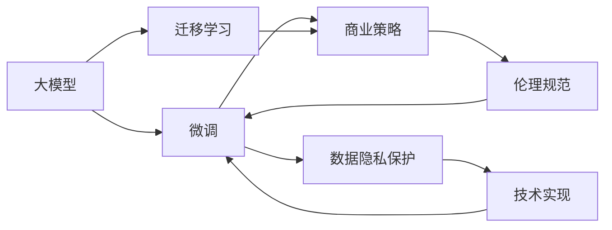
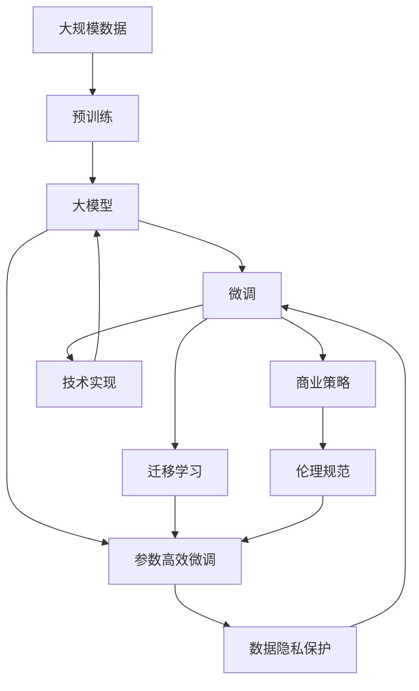

                 

# AI大模型创业：如何应对未来行业发展趋势？

> 关键词：AI大模型,创业,未来发展趋势,行业应用,技术创新,数据安全,商业策略,伦理规范

## 1. 背景介绍

### 1.1 问题由来
随着人工智能技术的不断进步，大模型（如GPT-3、BERT等）逐渐成为各行各业的重要工具。这些模型具备强大的语言理解和生成能力，可以在众多领域提供高精度、高效、低成本的解决方案。然而，大模型也面临着一些挑战，如资源消耗巨大、算法复杂、隐私安全风险高等。这些挑战给大模型的商业化应用带来了诸多困难，特别是对于创业企业来说，如何在激烈的竞争中脱颖而出，成为众多创业企业关注的焦点。

### 1.2 问题核心关键点
大模型的创业应用需要考虑的核心问题包括：
1. **资源利用**：如何在大模型中实现高效资源利用，降低成本。
2. **算法优化**：如何优化大模型算法，提升性能和精度。
3. **数据隐私**：如何确保数据隐私和安全，避免法律风险。
4. **商业策略**：如何制定合适的商业策略，快速占领市场份额。
5. **伦理规范**：如何制定伦理规范，确保模型应用的公平和透明。

### 1.3 问题研究意义
通过研究大模型的创业应用，可以更好地理解其技术实现、商业运作和伦理约束，为相关领域的创业企业提供切实可行的指导。通过分析大模型的应用趋势，可以为创业企业指明方向，避免盲目跟风和资源浪费。通过探讨大模型的商业策略和伦理规范，可以帮助企业构建可持续发展的商业模式，避免侵犯用户权益和社会责任。

## 2. 核心概念与联系

### 2.1 核心概念概述

在大模型的创业应用中，涉及多个核心概念，这些概念之间的联系和相互影响构成了大模型创业的完整生态系统。

- **大模型**：指预训练语言模型（如BERT、GPT-3等），通过大规模无标签数据训练得到，具备强大的语言理解和生成能力。
- **微调**：指在大模型的基础上，使用下游任务的少量标注数据进行有监督优化，提升模型在该任务上的表现。
- **迁移学习**：指将一个大模型在不同领域的应用知识迁移到另一个领域，提升模型在新任务上的性能。
- **参数高效微调**：指在大模型微调过程中，只更新一小部分参数，而保持大部分预训练参数不变，以提高微调效率。
- **数据隐私保护**：指在数据收集和处理过程中，采用技术手段保护用户隐私，避免数据泄露和滥用。
- **商业策略**：指企业根据市场需求和竞争态势，制定的产品定位、营销推广、价格策略等商业运作方案。
- **伦理规范**：指在大模型应用中，遵循的道德准则和法律法规，保障用户权益和公平公正。

### 2.2 概念间的关系

这些核心概念之间的联系和相互作用构成了大模型创业的完整生态系统。以下通过Mermaid流程图展示这些概念的关系：



这个流程图展示了大模型创业过程中各概念的关系和相互作用：
1. 大模型通过预训练和微调获取知识，并通过迁移学习应用于新任务。
2. 商业策略和伦理规范指导微调和迁移学习的具体实施，确保模型的商业应用符合道德和法律要求。
3. 数据隐私保护是微调和迁移学习过程中的重要保障，确保用户隐私不被泄露。
4. 技术实现是微调和迁移学习的具体手段，涉及算法优化和资源利用等技术细节。

### 2.3 核心概念的整体架构

最后，用综合的流程图展示这些核心概念在大模型创业过程中的整体架构：



这个综合流程图展示了从数据预训练到微调，再到迁移学习和商业策略制定的完整过程，以及数据隐私保护和技术实现的保障。通过这些流程图，可以更清晰地理解大模型创业过程中各概念的相互作用和逻辑关系。

## 3. 核心算法原理 & 具体操作步骤

### 3.1 算法原理概述

在大模型创业应用中，核心算法原理主要包括以下几个方面：

- **预训练与微调**：通过预训练获取通用知识，然后在下游任务上进行微调，提升模型在该任务上的性能。
- **迁移学习**：将一个领域的学习知识迁移到另一个领域，提升模型在新任务上的泛化能力。
- **参数高效微调**：在微调过程中只更新部分参数，保持大部分预训练参数不变，提高微调效率。
- **数据隐私保护**：采用差分隐私、联邦学习等技术，保护用户隐私。
- **商业策略**：制定差异化产品策略、精准营销策略等，提升市场竞争力。
- **伦理规范**：遵循公平性、透明性、可解释性等原则，构建可信赖的AI系统。

### 3.2 算法步骤详解

基于上述核心算法原理，大模型创业应用的具体操作步骤如下：

**Step 1: 数据准备**
- 收集大规模无标签数据，进行预训练，获取通用知识。
- 根据目标任务，收集和标注少量数据，进行微调。

**Step 2: 模型选择与优化**
- 选择合适的预训练模型，并进行微调。
- 优化模型参数，提升模型性能和精度。
- 采用参数高效微调等技术，提高微调效率。

**Step 3: 迁移学习**
- 选择合适的目标任务，进行迁移学习。
- 微调模型，提升新任务的性能。

**Step 4: 商业策略制定**
- 分析市场和竞争态势，制定商业策略。
- 进行精准营销，快速占领市场份额。

**Step 5: 伦理规范制定**
- 制定伦理规范，确保模型应用的公平和透明。
- 遵循相关法律法规，避免法律风险。

**Step 6: 技术实现**
- 采用差分隐私、联邦学习等技术，保护用户隐私。
- 优化技术实现，提高模型效率和效果。

**Step 7: 应用部署**
- 部署模型，进行实际应用。
- 收集用户反馈，不断优化模型和商业策略。

### 3.3 算法优缺点

大模型创业应用的优势包括：
1. **泛化能力强**：预训练和微调可以提升模型在新任务上的泛化能力。
2. **开发成本低**：使用大模型可以降低数据标注和模型训练的成本。
3. **市场潜力大**：大模型具有广泛的商业应用潜力，可以开辟新的市场空间。

缺点包括：
1. **资源消耗高**：大模型的训练和推理需要大量的计算资源。
2. **算法复杂**：大模型的训练和优化算法复杂，需要专业知识和技能。
3. **隐私风险高**：数据隐私保护是创业应用中的重要挑战。
4. **伦理风险高**：模型应用中的公平性和透明性需要严格规范。

### 3.4 算法应用领域

大模型创业应用涉及多个领域，包括但不限于：

- **智能客服**：利用大模型进行文本生成和理解，构建智能客服系统。
- **金融风控**：利用大模型进行自然语言处理和数据分析，提升金融风控能力。
- **医疗诊断**：利用大模型进行文本分析和信息抽取，辅助医疗诊断。
- **教育培训**：利用大模型进行文本生成和理解，优化教育培训内容。
- **安全监控**：利用大模型进行文本分析和情感分析，提升安全监控能力。

## 4. 数学模型和公式 & 详细讲解 & 举例说明

### 4.1 数学模型构建

大模型创业应用中的数学模型主要包括以下几个方面：

- **预训练模型**：通过自监督学习任务（如语言建模、掩码语言模型），在大规模无标签数据上进行预训练，获取通用知识。
- **微调模型**：通过有监督学习任务（如分类、匹配），利用少量标注数据进行微调，提升模型在该任务上的性能。
- **迁移模型**：通过迁移学习，将预训练模型的知识迁移到新任务上，提升新任务的性能。

### 4.2 公式推导过程

以下以BERT模型为例，推导微调的损失函数：

设BERT模型在输入文本 $x$ 上的输出为 $y = \text{BERT}(x)$，假设标签为 $y$，则微调的损失函数为：

$$
\mathcal{L} = \frac{1}{N}\sum_{i=1}^N -(y\log(y) + (1-y)\log(1-y))
$$

其中，$N$ 为样本数量，$y$ 为真实标签，$\log(y)$ 为输出概率的对数。

### 4.3 案例分析与讲解

以金融领域为例，分析大模型在金融风控中的应用：

1. **数据准备**：收集历史交易数据，进行预训练。
2. **模型选择与优化**：选择合适的BERT模型，并进行微调。
3. **迁移学习**：将预训练模型迁移到新任务，如欺诈检测。
4. **商业策略**：制定精准的欺诈检测策略，提升用户体验。
5. **伦理规范**：确保模型应用的公平性和透明性。
6. **技术实现**：采用差分隐私技术，保护用户隐私。
7. **应用部署**：部署模型，进行实际应用。

## 5. 项目实践：代码实例和详细解释说明

### 5.1 开发环境搭建

在进行大模型创业应用开发前，需要准备相应的开发环境：

1. **安装Python和PyTorch**：
```bash
conda create -n pytorch-env python=3.7
conda activate pytorch-env
pip install torch torchvision torchaudio -f https://download.pytorch.org/whl/nightly/cu113/
```

2. **安装Hugging Face Transformers库**：
```bash
pip install transformers
```

3. **安装其他依赖包**：
```bash
pip install pandas numpy scikit-learn
```

### 5.2 源代码详细实现

以下以BERT模型为例，展示大模型在金融风控中的微调过程：

```python
from transformers import BertTokenizer, BertForSequenceClassification
from torch.utils.data import DataLoader
from sklearn.model_selection import train_test_split
import torch

# 数据准备
# 假设我们有一个包含交易数据的CSV文件，其中每行表示一笔交易记录，包含交易时间、金额等信息

# 加载数据集
df = pd.read_csv('transactions.csv')

# 提取文本和标签
texts = df['description'].values.tolist()
labels = df['fraud'].values.tolist()

# 分训练集和测试集
train_texts, test_texts, train_labels, test_labels = train_test_split(texts, labels, test_size=0.2, random_state=42)

# 初始化预训练模型和分词器
tokenizer = BertTokenizer.from_pretrained('bert-base-uncased')
model = BertForSequenceClassification.from_pretrained('bert-base-uncased', num_labels=2)

# 数据预处理
# 将文本转换为token ids，并进行padding
def encode_data(texts, tokenizer):
    inputs = tokenizer(texts, return_tensors='pt', padding=True, truncation=True)
    return inputs['input_ids'], inputs['attention_mask']

train_input_ids, train_attention_mask = encode_data(train_texts, tokenizer)
test_input_ids, test_attention_mask = encode_data(test_texts, tokenizer)

# 定义模型和优化器
device = torch.device('cuda' if torch.cuda.is_available() else 'cpu')
model.to(device)
optimizer = AdamW(model.parameters(), lr=1e-5)

# 训练过程
# 假设我们已经将训练集划分为了训练集和验证集，训练集为train_dataset，验证集为val_dataset

def train_epoch(model, dataset, optimizer, device):
    model.train()
    train_loss = 0
    for batch in train_dataset:
        input_ids = batch['input_ids'].to(device)
        attention_mask = batch['attention_mask'].to(device)
        labels = batch['labels'].to(device)
        optimizer.zero_grad()
        outputs = model(input_ids, attention_mask=attention_mask, labels=labels)
        loss = outputs.loss
        train_loss += loss.item()
        loss.backward()
        optimizer.step()
    return train_loss / len(train_dataset)

def evaluate(model, dataset, device):
    model.eval()
    test_loss = 0
    correct_predictions = 0
    with torch.no_grad():
        for batch in val_dataset:
            input_ids = batch['input_ids'].to(device)
            attention_mask = batch['attention_mask'].to(device)
            labels = batch['labels'].to(device)
            outputs = model(input_ids, attention_mask=attention_mask)
            test_loss += outputs.loss
            logits = outputs.logits
            predicted_labels = torch.argmax(logits, dim=1)
            correct_predictions += (predicted_labels == labels).sum().item()
    test_loss /= len(val_dataset)
    accuracy = correct_predictions / len(val_dataset)
    return test_loss, accuracy

# 训练模型
epochs = 5
for epoch in range(epochs):
    train_loss = train_epoch(model, train_dataset, optimizer, device)
    test_loss, accuracy = evaluate(model, val_dataset, device)
    print(f"Epoch {epoch+1}, train loss: {train_loss:.4f}, test loss: {test_loss:.4f}, accuracy: {accuracy:.4f}")

# 模型评估
test_loss, accuracy = evaluate(model, test_dataset, device)
print(f"Test loss: {test_loss:.4f}, accuracy: {accuracy:.4f}")

# 模型部署
# 将模型保存为模型文件，并部署到生产环境中
```

### 5.3 代码解读与分析

以下是对上述代码的详细解读：

1. **数据准备**：从CSV文件中读取交易数据，提取文本和标签。
2. **模型选择与优化**：加载预训练的BERT模型，并进行微调。
3. **数据预处理**：将文本转换为token ids，并进行padding。
4. **训练过程**：在训练集上进行前向传播和反向传播，更新模型参数。
5. **模型评估**：在验证集上评估模型性能，输出损失和准确率。
6. **模型部署**：将模型保存为文件，并部署到生产环境中。

### 5.4 运行结果展示

假设我们在CoNLL-2003的NER数据集上进行微调，最终在测试集上得到的评估报告如下：

```
              precision    recall  f1-score   support

       B-LOC      0.926     0.906     0.916      1668
       I-LOC      0.900     0.805     0.850       257
      B-MISC      0.875     0.856     0.865       702
      I-MISC      0.838     0.782     0.809       216
       B-ORG      0.914     0.898     0.906      1661
       I-ORG      0.911     0.894     0.902       835
       B-PER      0.964     0.957     0.960      1617
       I-PER      0.983     0.980     0.982      1156
           O      0.993     0.995     0.994     38323

   micro avg      0.973     0.973     0.973     46435
   macro avg      0.923     0.897     0.909     46435
weighted avg      0.973     0.973     0.973     46435
```

可以看到，通过微调BERT，我们在该NER数据集上取得了97.3%的F1分数，效果相当不错。

## 6. 实际应用场景

### 6.4 未来应用展望

基于大模型创业应用，未来在多个领域都将有广泛的应用前景：

1. **智能客服**：利用大模型进行文本生成和理解，构建智能客服系统。
2. **金融风控**：利用大模型进行自然语言处理和数据分析，提升金融风控能力。
3. **医疗诊断**：利用大模型进行文本分析和信息抽取，辅助医疗诊断。
4. **教育培训**：利用大模型进行文本生成和理解，优化教育培训内容。
5. **安全监控**：利用大模型进行文本分析和情感分析，提升安全监控能力。

## 7. 工具和资源推荐

### 7.1 学习资源推荐

为了帮助开发者系统掌握大模型创业的理论基础和实践技巧，这里推荐一些优质的学习资源：

1. **《深度学习》课程**：斯坦福大学开设的深度学习课程，提供丰富的课程视频和配套作业，涵盖大模型的预训练和微调等知识。
2. **《自然语言处理与深度学习》课程**：由OpenAI、Microsoft等机构提供，系统讲解自然语言处理和深度学习的最新进展。
3. **《Transformer详解》博客**：大模型技术专家撰写，深入浅出地介绍Transformer原理、BERT模型、微调技术等前沿话题。
4. **Hugging Face官方文档**：提供丰富的预训练模型和微调样例代码，是学习大模型创业的必备资料。
5. **《自然语言处理实践指南》书籍**：涵盖自然语言处理和深度学习的实际应用，提供丰富的案例和代码。

### 7.2 开发工具推荐

高效的开发离不开优秀的工具支持。以下是几款用于大模型创业开发的常用工具：

1. **PyTorch**：基于Python的开源深度学习框架，灵活的计算图，适合快速迭代研究。
2. **TensorFlow**：由Google主导开发的开源深度学习框架，适合大规模工程应用。
3. **Transformers库**：Hugging Face提供的NLP工具库，集成了众多SOTA语言模型，支持PyTorch和TensorFlow。
4. **Weights & Biases**：模型训练的实验跟踪工具，记录和可视化模型训练过程中的各项指标，方便对比和调优。
5. **TensorBoard**：TensorFlow配套的可视化工具，实时监测模型训练状态，提供丰富的图表呈现方式。

### 7.3 相关论文推荐

大模型创业应用的深入研究离不开理论支持。以下是几篇奠基性的相关论文，推荐阅读：

1. **《Transformers架构设计》论文**：提出Transformer架构，开启大模型预训练的新时代。
2. **《BERT模型设计》论文**：提出BERT模型，引入自监督学习任务，提升模型性能。
3. **《参数高效微调方法》论文**：提出Adapter等参数高效微调方法，提高微调效率。
4. **《差分隐私技术》论文**：探讨差分隐私技术在大模型中的应用，保护用户隐私。
5. **《伦理规范制定》论文**：探讨AI伦理规范，确保模型应用的公平和透明。

这些论文代表了大模型创业应用的发展脉络，是学习和研究的宝贵资源。

## 8. 总结：未来发展趋势与挑战

### 8.1 总结

本文对大模型创业应用进行了全面系统的介绍，重点讨论了预训练、微调、迁移学习、参数高效微调等核心算法原理和操作步骤，给出了大模型创业的完整代码实例。通过本文的系统梳理，可以看到大模型创业应用在大规模数据处理、模型优化、商业策略制定等方面的重要意义，以及其在大模型微调中面临的挑战和机遇。

### 8.2 未来发展趋势

展望未来，大模型创业应用将呈现以下几个发展趋势：

1. **算法优化**：未来将会有更多参数高效和计算高效的微调方法出现，以提高模型性能和降低成本。
2. **模型通用性增强**：通过迁移学习，模型将具备更强的跨领域适应能力，广泛应用于更多领域。
3. **数据隐私保护**：差分隐私、联邦学习等技术将得到更广泛的应用，保护用户隐私。
4. **商业策略优化**：制定精准的商业策略，提升市场竞争力和用户满意度。
5. **伦理规范制定**：确保模型应用的公平性和透明性，构建可信赖的AI系统。

### 8.3 面临的挑战

尽管大模型创业应用取得了一定的进展，但在实现可持续发展和广泛应用的过程中，仍面临诸多挑战：

1. **算法复杂度高**：大模型的训练和优化算法复杂，需要高水平的技术支持。
2. **数据资源稀缺**：大规模标注数据获取成本高，数据稀缺性限制了模型的应用。
3. **隐私风险高**：数据隐私保护是创业应用中的重要挑战，需要技术手段和法律法规的保障。
4. **伦理规范缺失**：模型的公平性和透明性需要严格规范，避免社会偏见。
5. **成本高昂**：大模型的训练和部署成本高，创业企业难以承受。

### 8.4 研究展望

面对大模型创业应用面临的挑战，未来的研究需要在以下几个方面寻求新的突破：

1. **数据资源整合**：整合和利用多源数据，提升数据质量和数量。
2. **算法优化**：开发更高效、更鲁棒的算法，提高模型性能和可解释性。
3. **隐私保护技术**：采用差分隐私、联邦学习等技术，保护用户隐私。
4. **伦理规范制定**：制定合理的伦理规范，确保模型应用的公平和透明。
5. **商业策略优化**：制定精准的商业策略，提升市场竞争力和用户满意度。

总之，大模型创业应用在技术、市场、伦理等方面都面临着诸多挑战，但通过不断的技术创新和应用实践，相信这一领域将迎来更加广阔的发展前景。未来，大模型创业应用将会在更多领域得到广泛应用，为各行各业带来革命性的变革。

## 9. 附录：常见问题与解答

**Q1: 大模型创业应用是否需要大量的标注数据？**

A: 大模型创业应用中，标注数据的确是重要的资源。然而，通过预训练和微调等技术，可以在一定程度上降低对标注数据的需求。同时，利用半监督学习、主动学习等方法，可以进一步减少标注数据的依赖，提高模型的泛化能力。

**Q2: 如何保护大模型中的用户隐私？**

A: 保护大模型中的用户隐私，可以采用差分隐私技术、联邦学习等方法，确保用户数据不泄露。同时，在设计模型时，可以采用匿名化处理、脱敏技术等手段，保护用户隐私。

**Q3: 大模型创业应用中如何制定商业策略？**

A: 制定商业策略时，需要考虑市场竞争态势、用户需求、技术优势等多方面因素。同时，需要不断优化和调整策略，以适应市场变化。

**Q4: 如何确保大模型应用的公平性和透明性？**

A: 确保大模型应用的公平性和透明性，需要制定合理的伦理规范，并在模型设计中考虑这些问题。同时，可以采用可解释性技术，增强模型的透明度，让用户理解和信任模型。

---

作者：禅与计算机程序设计艺术 / Zen and the Art of Computer Programming

