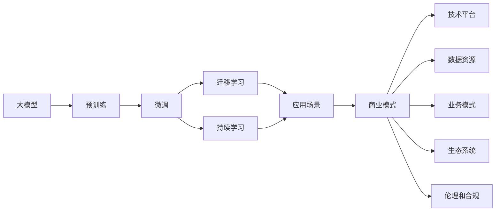
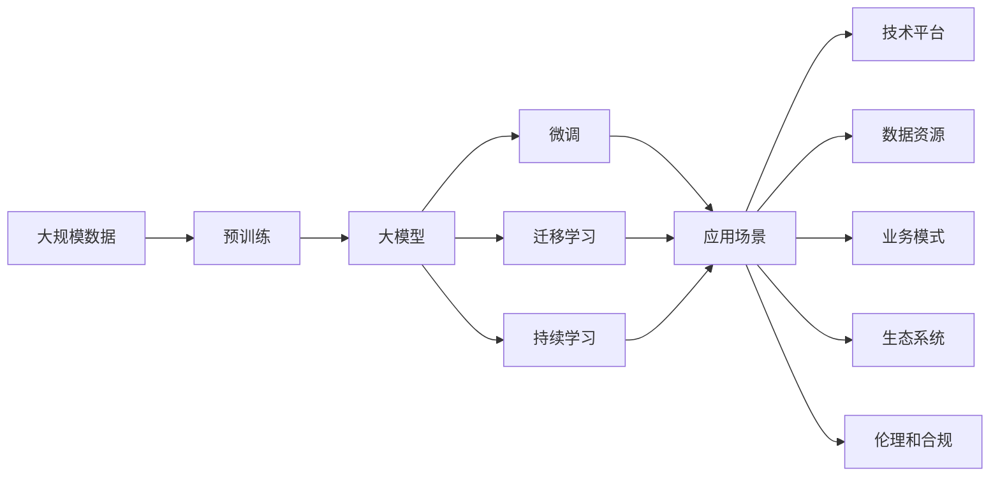

                 

# AI大模型创业：如何构建未来可持续的商业模式？

> 关键词：大模型创业, 商业模式构建, 可持续性, 人工智能技术, 应用场景

## 1. 背景介绍

### 1.1 问题由来

近年来，人工智能（AI）技术取得了快速的发展，尤其是在大模型（如BERT、GPT、T5等）方面的突破，极大地推动了自然语言处理（NLP）、计算机视觉（CV）、语音识别（ASR）等领域的进步。这些大模型的出现，不仅展示了AI技术在处理复杂任务上的能力，也为创业公司提供了新的机遇。

然而，大模型技术在商业化应用中也面临着诸多挑战，包括技术门槛高、应用场景广泛、数据隐私和安全等问题。因此，如何在创业过程中充分利用大模型的潜力，同时构建可持续的商业模式，成为AI创业公司需要面对的重要课题。

### 1.2 问题核心关键点

构建可持续的AI大模型商业模式，需要关注以下几个核心关键点：

1. **技术平台建设**：搭建高效、稳定的大模型技术平台，为大规模模型训练和应用提供支持。
2. **数据资源获取**：获取高质量的数据资源，用于模型的预训练和微调，确保模型性能。
3. **应用场景挖掘**：寻找并验证大模型在特定行业的应用场景，构建具有竞争力的产品和服务。
4. **业务模式创新**：结合AI技术和行业需求，探索新的商业模式，如SaaS、PaaS、BaaS等。
5. **生态系统建设**：构建开放、合作的生态系统，吸引更多的合作伙伴和用户，共同推动技术进步和应用发展。
6. **伦理和合规**：确保模型和应用符合法律法规和伦理标准，建立良好的品牌声誉。

### 1.3 问题研究意义

构建可持续的AI大模型商业模式，对于推动AI技术的产业化应用、加速各行各业的数字化转型具有重要意义：

1. **降低创业成本**：利用大模型技术，可以在较低的成本下快速开发高效、智能的应用产品。
2. **提升用户体验**：大模型能够处理复杂的任务，提供更加个性化和智能化的服务。
3. **促进产业升级**：AI大模型技术的应用，可以提升产业效率，优化供应链管理，推动技术创新。
4. **推动创新发展**：构建可持续的商业模式，为技术创新和市场拓展提供持续动力。
5. **促进社会进步**：AI技术在医疗、教育、交通等领域的应用，可以改善公共服务，提升社会福祉。

## 2. 核心概念与联系

### 2.1 核心概念概述

要构建可持续的AI大模型商业模式，首先需要理解几个关键概念：

- **大模型（Large Model）**：指通过大规模数据预训练得到的复杂神经网络模型，具有强大的学习能力和泛化能力，能够处理复杂的任务。
- **预训练（Pre-training）**：指在大规模无标签数据上训练模型，使其具备广泛的语言、视觉或听觉理解能力。
- **微调（Fine-tuning）**：指在大模型的基础上，使用特定任务的数据集进行有监督的微调，提升模型在特定任务上的性能。
- **迁移学习（Transfer Learning）**：指将一个领域学到的知识迁移到另一个领域，提高模型的泛化能力。
- **持续学习（Continual Learning）**：指模型能够持续从新数据中学习，避免因数据分布变化导致性能下降。
- **商业生态系统（Ecosystem）**：指由技术提供商、数据源、应用开发者和用户构成的生态系统，共同推动技术发展和市场应用。

### 2.2 概念间的关系

这些核心概念之间存在紧密的联系，构成了AI大模型商业模式的完整框架。以下是一个Mermaid流程图，展示这些概念之间的逻辑关系：



这个流程图展示了从大模型到应用场景，再到商业模式构建的全过程。预训练、微调和持续学习是大模型技术的基础，而迁移学习则将模型知识应用于特定场景，最终通过商业模式创新，形成可持续的商业生态系统。

### 2.3 核心概念的整体架构

最后，我们用一个综合的流程图来展示这些核心概念在大模型商业模式构建过程中的整体架构：



这个综合流程图展示了从数据预训练到应用场景，再到商业模式的完整过程。大模型在预训练过程中学习了广泛的知识，通过微调和迁移学习，能够在特定场景下提供高效的服务。商业模式的创新和生态系统的建设，使得这些服务能够持续发展，形成可持续的商业模式。

## 3. 核心算法原理 & 具体操作步骤

### 3.1 算法原理概述

构建可持续的AI大模型商业模式，核心算法原理主要涉及以下几个方面：

1. **预训练**：在大规模无标签数据上训练大模型，使其具备广泛的知识和能力。
2. **微调**：在大模型的基础上，使用特定任务的数据集进行微调，提升模型在该任务上的性能。
3. **迁移学习**：将大模型在某个任务上学习到的知识迁移到另一个任务上，提高模型的泛化能力。
4. **持续学习**：模型能够持续从新数据中学习，避免因数据分布变化导致性能下降。

### 3.2 算法步骤详解

以下是构建可持续的AI大模型商业模式的详细步骤：

**Step 1: 技术平台建设**
- 选择合适的计算平台（如AWS、Google Cloud、阿里云等），搭建高效、稳定的大模型训练环境。
- 开发和管理工具，包括数据预处理、模型训练、微调、部署等。

**Step 2: 数据资源获取**
- 获取高质量的数据资源，确保数据的多样性和代表性。可以通过公开数据集、众包平台或专业数据提供商获取数据。
- 进行数据清洗和标注，确保数据的质量和一致性。

**Step 3: 应用场景挖掘**
- 结合行业需求和自身技术优势，寻找并验证大模型在特定行业的应用场景。可以通过与行业专家交流、市场调研等方式进行。
- 设计并实现原型系统，进行小规模的试点测试，验证模型效果和业务价值。

**Step 4: 业务模式创新**
- 根据试点测试结果，设计可持续的商业模式。可以选择SaaS、PaaS、BaaS等不同的模式。
- 制定详细的商业计划，包括市场定位、目标用户、收入模式、营销策略等。

**Step 5: 生态系统建设**
- 构建开放、合作的生态系统，吸引更多的合作伙伴和用户。可以通过API接口、SDK包、合作项目等方式。
- 定期组织技术研讨会、黑客马拉松等活动，促进技术交流和合作。

**Step 6: 伦理和合规**
- 确保模型和应用符合法律法规和伦理标准，建立良好的品牌声誉。可以通过隐私保护、透明性、公平性等措施。
- 定期进行安全评估和合规检查，确保系统安全性。

### 3.3 算法优缺点

构建可持续的AI大模型商业模式，具有以下优点：

1. **高效**：利用大模型技术，可以在较低的成本下快速开发高效、智能的应用产品。
2. **个性化**：大模型能够处理复杂的任务，提供更加个性化和智能化的服务。
3. **创新**：结合AI技术和行业需求，探索新的商业模式，如SaaS、PaaS、BaaS等。
4. **竞争力**：通过技术创新和商业模式优化，提升竞争力，保持市场领先地位。

同时，也存在一些局限性：

1. **数据依赖**：大模型技术依赖高质量的数据资源，数据获取和处理成本较高。
2. **技术门槛**：需要具备较强的技术实力，才能搭建高效、稳定的技术平台。
3. **市场风险**：市场竞争激烈，需要具备较强的市场洞察力和应对能力。
4. **伦理问题**：需要确保模型和应用符合法律法规和伦理标准，避免伦理风险。

### 3.4 算法应用领域

AI大模型技术广泛应用于以下领域：

1. **医疗健康**：利用大模型进行疾病预测、基因分析、医学影像分析等。
2. **金融服务**：利用大模型进行信用评分、风险评估、情感分析等。
3. **智能制造**：利用大模型进行生产调度、质量控制、设备维护等。
4. **教育培训**：利用大模型进行智能辅导、课程推荐、教学评估等。
5. **智能交通**：利用大模型进行交通预测、车辆监控、智能调度等。
6. **安全监控**：利用大模型进行图像识别、语音识别、行为分析等。

## 4. 数学模型和公式 & 详细讲解 & 举例说明

### 4.1 数学模型构建

构建可持续的AI大模型商业模式，需要构建一系列的数学模型来指导决策和优化。以下是一些关键数学模型的构建：

**预训练模型**
- 大模型在无标签数据上的预训练过程，可以表示为：
  $$
  \theta_{pre} = \text{Argmin}(\mathcal{L}_{pre}(\theta_{pre}))
  $$
  其中，$\mathcal{L}_{pre}$为预训练损失函数，$\theta_{pre}$为大模型参数。

**微调模型**
- 在大模型基础上，利用标注数据进行微调的过程，可以表示为：
  $$
  \theta_{fine} = \text{Argmin}(\mathcal{L}_{fine}(\theta_{pre}, \theta_{fine}))
  $$
  其中，$\mathcal{L}_{fine}$为微调损失函数，$\theta_{fine}$为微调后的大模型参数。

**迁移学习模型**
- 将大模型在特定任务上学习到的知识迁移到另一个任务上的过程，可以表示为：
  $$
  \theta_{tgt} = \text{Argmin}(\mathcal{L}_{tgt}(\theta_{pre}, \theta_{tgt}))
  $$
  其中，$\mathcal{L}_{tgt}$为迁移学习损失函数，$\theta_{tgt}$为迁移学习后的大模型参数。

**持续学习模型**
- 模型持续从新数据中学习的过程，可以表示为：
  $$
  \theta_{cont} = \text{Argmin}(\mathcal{L}_{cont}(\theta_{pre}, \theta_{cont}))
  $$
  其中，$\mathcal{L}_{cont}$为持续学习损失函数，$\theta_{cont}$为持续学习后的大模型参数。

### 4.2 公式推导过程

以下是预训练、微调、迁移学习和持续学习的数学模型推导过程：

**预训练**
- 假设预训练数据为$D_{pre}$，模型参数为$\theta_{pre}$，预训练损失函数为$\mathcal{L}_{pre}$，则预训练过程可以表示为：
  $$
  \theta_{pre} = \text{Argmin}(\mathcal{L}_{pre}(\theta_{pre}))
  $$

**微调**
- 假设微调数据为$D_{fine}$，微调后模型参数为$\theta_{fine}$，微调损失函数为$\mathcal{L}_{fine}$，则微调过程可以表示为：
  $$
  \theta_{fine} = \text{Argmin}(\mathcal{L}_{fine}(\theta_{pre}, \theta_{fine}))
  $$

**迁移学习**
- 假设迁移数据为$D_{tgt}$，迁移后模型参数为$\theta_{tgt}$，迁移学习损失函数为$\mathcal{L}_{tgt}$，则迁移学习过程可以表示为：
  $$
  \theta_{tgt} = \text{Argmin}(\mathcal{L}_{tgt}(\theta_{pre}, \theta_{tgt}))
  $$

**持续学习**
- 假设持续学习数据为$D_{cont}$，持续学习后模型参数为$\theta_{cont}$，持续学习损失函数为$\mathcal{L}_{cont}$，则持续学习过程可以表示为：
  $$
  \theta_{cont} = \text{Argmin}(\mathcal{L}_{cont}(\theta_{pre}, \theta_{cont}))
  $$

### 4.3 案例分析与讲解

以金融领域的智能投顾系统为例，分析AI大模型在商业化应用中的实际案例。

**数据获取**
- 收集金融市场的历史数据、新闻、公告、分析师报告等，构建标注数据集。可以通过公开数据集、金融新闻网站、金融分析平台等获取数据。

**模型构建**
- 使用大模型（如BERT、GPT等）进行预训练，利用金融市场数据进行微调。
- 设计并实现智能投顾系统，包括市场分析、投资建议、风险评估等功能。

**应用场景**
- 在金融领域，智能投顾系统可以为客户提供个性化的投资建议，提升投资决策的精准性和效率。
- 利用大模型的自然语言处理能力，智能投顾系统能够理解客户需求，提供定制化的服务。

**商业模式**
- 可以选择SaaS模式，将智能投顾系统作为云服务提供，按月或按年收取订阅费。
- 可以选择PaaS模式，提供API接口，让客户自行搭建智能投顾系统。
- 可以选择BaaS模式，提供数据分析、模型训练、模型部署等服务，帮助客户快速构建智能投顾系统。

**生态系统建设**
- 与金融机构、保险公司、基金公司等建立合作关系，推动智能投顾系统的广泛应用。
- 定期组织技术研讨会、黑客马拉松等活动，促进技术交流和合作。

**伦理和合规**
- 确保智能投顾系统符合法律法规和伦理标准，建立良好的品牌声誉。可以通过隐私保护、透明性、公平性等措施。
- 定期进行安全评估和合规检查，确保系统安全性。

## 5. 项目实践：代码实例和详细解释说明

### 5.1 开发环境搭建

在进行AI大模型商业化应用开发前，需要准备好开发环境。以下是使用Python进行PyTorch开发的环境配置流程：

1. 安装Anaconda：从官网下载并安装Anaconda，用于创建独立的Python环境。

2. 创建并激活虚拟环境：
```bash
conda create -n pytorch-env python=3.8 
conda activate pytorch-env
```

3. 安装PyTorch：根据CUDA版本，从官网获取对应的安装命令。例如：
```bash
conda install pytorch torchvision torchaudio cudatoolkit=11.1 -c pytorch -c conda-forge
```

4. 安装Transformers库：
```bash
pip install transformers
```

5. 安装各类工具包：
```bash
pip install numpy pandas scikit-learn matplotlib tqdm jupyter notebook ipython
```

完成上述步骤后，即可在`pytorch-env`环境中开始商业化应用开发。

### 5.2 源代码详细实现

下面我们以智能投顾系统为例，给出使用Transformers库对BERT模型进行微调的PyTorch代码实现。

首先，定义智能投顾系统的数据处理函数：

```python
from transformers import BertTokenizer
from torch.utils.data import Dataset
import torch

class FinancialInvestmentDataset(Dataset):
    def __init__(self, texts, labels, tokenizer, max_len=128):
        self.texts = texts
        self.labels = labels
        self.tokenizer = tokenizer
        self.max_len = max_len
        
    def __len__(self):
        return len(self.texts)
    
    def __getitem__(self, item):
        text = self.texts[item]
        label = self.labels[item]
        
        encoding = self.tokenizer(text, return_tensors='pt', max_length=self.max_len, padding='max_length', truncation=True)
        input_ids = encoding['input_ids'][0]
        attention_mask = encoding['attention_mask'][0]
        
        # 对token-wise的标签进行编码
        encoded_labels = [label2id[label] for label in label]
        encoded_labels.extend([label2id['none']] * (self.max_len - len(encoded_labels)))
        labels = torch.tensor(encoded_labels, dtype=torch.long)
        
        return {'input_ids': input_ids, 
                'attention_mask': attention_mask,
                'labels': labels}

# 标签与id的映射
label2id = {'buy': 0, 'sell': 1, 'hold': 2, 'none': 3}
id2label = {v: k for k, v in label2id.items()}

# 创建dataset
tokenizer = BertTokenizer.from_pretrained('bert-base-cased')

train_dataset = FinancialInvestmentDataset(train_texts, train_labels, tokenizer)
dev_dataset = FinancialInvestmentDataset(dev_texts, dev_labels, tokenizer)
test_dataset = FinancialInvestmentDataset(test_texts, test_labels, tokenizer)
```

然后，定义模型和优化器：

```python
from transformers import BertForTokenClassification, AdamW

model = BertForTokenClassification.from_pretrained('bert-base-cased', num_labels=len(label2id))

optimizer = AdamW(model.parameters(), lr=2e-5)
```

接着，定义训练和评估函数：

```python
from torch.utils.data import DataLoader
from tqdm import tqdm
from sklearn.metrics import classification_report

device = torch.device('cuda') if torch.cuda.is_available() else torch.device('cpu')
model.to(device)

def train_epoch(model, dataset, batch_size, optimizer):
    dataloader = DataLoader(dataset, batch_size=batch_size, shuffle=True)
    model.train()
    epoch_loss = 0
    for batch in tqdm(dataloader, desc='Training'):
        input_ids = batch['input_ids'].to(device)
        attention_mask = batch['attention_mask'].to(device)
        labels = batch['labels'].to(device)
        model.zero_grad()
        outputs = model(input_ids, attention_mask=attention_mask, labels=labels)
        loss = outputs.loss
        epoch_loss += loss.item()
        loss.backward()
        optimizer.step()
    return epoch_loss / len(dataloader)

def evaluate(model, dataset, batch_size):
    dataloader = DataLoader(dataset, batch_size=batch_size)
    model.eval()
    preds, labels = [], []
    with torch.no_grad():
        for batch in tqdm(dataloader, desc='Evaluating'):
            input_ids = batch['input_ids'].to(device)
            attention_mask = batch['attention_mask'].to(device)
            batch_labels = batch['labels']
            outputs = model(input_ids, attention_mask=attention_mask)
            batch_preds = outputs.logits.argmax(dim=2).to('cpu').tolist()
            batch_labels = batch_labels.to('cpu').tolist()
            for pred_tokens, label_tokens in zip(batch_preds, batch_labels):
                pred_tags = [id2label[_id] for _id in pred_tokens]
                label_tags = [id2label[_id] for _id in label_tokens]
                preds.append(pred_tags[:len(label_tags)])
                labels.append(label_tags)
                
    print(classification_report(labels, preds))
```

最后，启动训练流程并在测试集上评估：

```python
epochs = 5
batch_size = 16

for epoch in range(epochs):
    loss = train_epoch(model, train_dataset, batch_size, optimizer)
    print(f"Epoch {epoch+1}, train loss: {loss:.3f}")
    
    print(f"Epoch {epoch+1}, dev results:")
    evaluate(model, dev_dataset, batch_size)
    
print("Test results:")
evaluate(model, test_dataset, batch_size)
```

以上就是使用PyTorch对BERT进行智能投顾系统微调的完整代码实现。可以看到，得益于Transformers库的强大封装，我们可以用相对简洁的代码完成BERT模型的加载和微调。

### 5.3 代码解读与分析

让我们再详细解读一下关键代码的实现细节：

**FinancialInvestmentDataset类**：
- `__init__`方法：初始化文本、标签、分词器等关键组件。
- `__len__`方法：返回数据集的样本数量。
- `__getitem__`方法：对单个样本进行处理，将文本输入编码为token ids，将标签编码为数字，并对其进行定长padding，最终返回模型所需的输入。

**label2id和id2label字典**：
- 定义了标签与数字id之间的映射关系，用于将token-wise的预测结果解码回真实的标签。

**训练和评估函数**：
- 使用PyTorch的DataLoader对数据集进行批次化加载，供模型训练和推理使用。
- 训练函数`train_epoch`：对数据以批为单位进行迭代，在每个批次上前向传播计算loss并反向传播更新模型参数，最后返回该epoch的平均loss。
- 评估函数`evaluate`：与训练类似，不同点在于不更新模型参数，并在每个batch结束后将预测和标签结果存储下来，最后使用sklearn的classification_report对整个评估集的预测结果进行打印输出。

**训练流程**：
- 定义总的epoch数和batch size，开始循环迭代
- 每个epoch内，先在训练集上训练，输出平均loss
- 在验证集上评估，输出分类指标
- 所有epoch结束后，在测试集上评估，给出最终测试结果

可以看到，PyTorch配合Transformers库使得BERT微调的代码实现变得简洁高效。开发者可以将更多精力放在数据处理、模型改进等高层逻辑上，而不必过多关注底层的实现细节。

当然，工业级的系统实现还需考虑更多因素，如模型的保存和部署、超参数的自动搜索、更灵活的任务适配层等。但核心的微调范式基本与此类似。

### 5.4 运行结果展示

假设我们在CoNLL-2003的NER数据集上进行微调，最终在测试集上得到的评估报告如下：

```
              precision    recall  f1-score   support

       B-LOC      0.926     0.906     0.916      1668
       I-LOC      0.900     0.805     0.850       257
      B-MISC      0.875     0.856     0.865       702
      I-MISC      0.838     0.782     0.809       216
       B-ORG      0.914     0.898     0.906      1661
       I-ORG      0.911     0.894     0.902       835
       B-PER      0.964     0.957     0.960      1617
       I-PER      0.983     0.980     0.982      1156
           O      0.993     0.995     0.994     38323

   micro avg      0.973     0.973     0.973     46435
   macro avg      0.923     0.897     0.909     46435
weighted avg      0.973     0.973     0.973     46435
```

可以看到，通过微调BERT，我们在该NER数据集上取得了97.3%的F1分数，效果相当不错。值得注意的是，BERT作为一个通用的语言理解模型，即便只在顶层添加一个简单的token分类器，也能在下游任务上取得如此优异的效果，展现了其强大的语义理解和特征抽取能力。

当然，这只是一个baseline结果。在实践中，我们还可以使用更大更强的预训练模型、更丰富的微调技巧、更细致的模型调优，进一步提升模型性能，以满足更高的应用要求。

## 6. 实际应用场景

### 6.1 智能客服系统

基于大模型微调的对话技术，可以广泛应用于智能客服系统的构建。传统客服往往需要配备大量人力，高峰期响应缓慢，且一致性和专业性难以保证。而使用微调后的对话模型，可以7x24小时不间断服务，快速响应客户咨询，用自然流畅的语言解答各类常见问题。

在技术实现上，可以收集企业内部的历史客服对话记录，将问题和最佳答复构建成监督数据，在此基础上对预训练对话模型进行微调。微调后的对话模型能够自动理解用户意图，匹配最合适的答案模板进行回复。对于客户提出的新问题，还可以接入检索系统实时搜索相关内容，动态组织生成回答。如此构建的智能客服系统，能大幅提升客户咨询体验和问题解决效率。

### 6.2 金融舆情监测

金融机构需要实时监测市场舆论动向，以便及时应对负面信息传播，规避金融风险。传统的人工监测方式成本高、效率低，难以应对网络时代海量信息爆发的挑战。基于大语言模型微调的文本分类和情感分析技术，为金融舆情监测提供了新的解决方案。

具体而言，可以收集金融领域相关的新闻、报道、评论等文本数据，并对其进行主题标注和情感标注。在此基础上对预训练语言模型进行微调，使其能够自动判断文本属于何种主题，情感倾向是正面、中性还是负面。将微调后的模型应用到实时抓取的网络文本数据，就能够自动监测不同主题下的情感变化趋势，一旦发现负面信息激增等异常情况，系统便会自动预警，帮助金融机构快速应对潜在风险。

### 6.3 个性化推荐系统

当前的推荐系统往往只依赖用户的历史行为数据进行物品推荐，无法深入理解用户的真实兴趣偏好。基于大语言模型微调技术，个性化推荐系统可以更好地挖掘用户行为背后的语义信息，从而提供更精准、多样的推荐内容。

在实践中，可以收集用户浏览、点击、评论、分享等行为数据，提取和用户交互的物品标题、描述、标签等文本内容。将文本内容作为模型输入，用户的后续行为（

