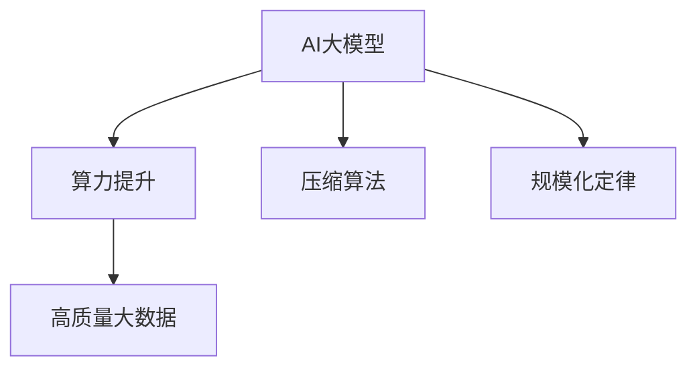
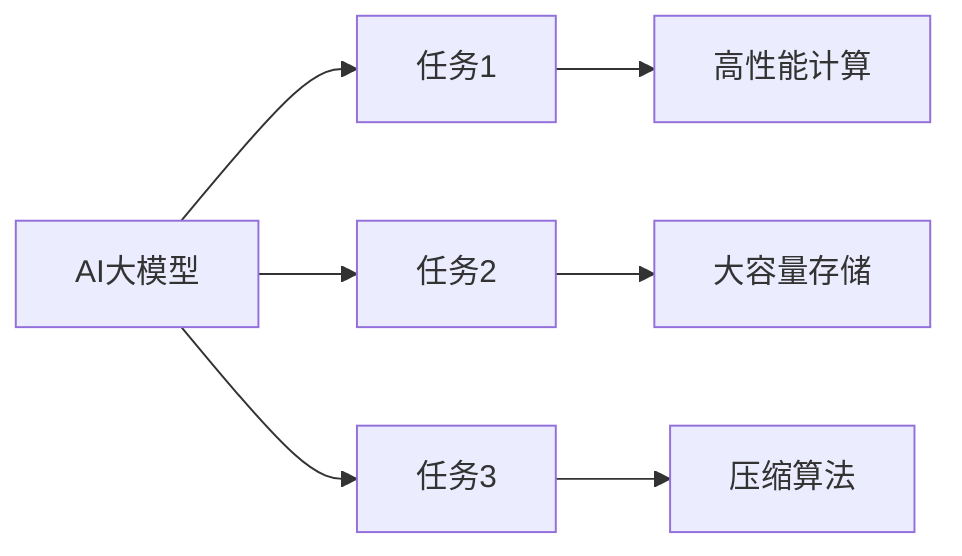

                 

# AI大模型的规模化定律(Scaling Law)的实现：算力提升+高质量大数据+更好的压缩算法

> 关键词：AI大模型, 规模化定律, 算力提升, 高质量大数据, 压缩算法, AI架构优化

## 1. 背景介绍

### 1.1 问题由来

近年来，人工智能（AI）在各行各业的应用如火如荼，尤其是在深度学习（Deep Learning, DL）领域，AI大模型（AI Large Models, LMs）取得了巨大的突破。这些模型通过在巨量数据上进行深度训练，能够实现惊人的计算能力，从而在图像识别、自然语言处理（Natural Language Processing, NLP）、语音识别、自动驾驶等领域展现出令人瞩目的性能。然而，随着模型规模的不断增大，其在训练和推理过程中面临的算力、存储空间、数据获取等需求也随之水涨船高。如何更有效地提升AI大模型的性能，实现其规模化应用，成为当前AI领域的一个重要课题。

### 1.2 问题核心关键点

实现AI大模型的规模化应用，关键在于满足以下三个核心需求：

1. **算力提升**：需要强大的计算资源来支持大规模模型的训练和推理。
2. **高质量大数据**：需要有丰富、高质量的标注数据来训练模型，避免过拟合。
3. **更好的压缩算法**：需要在保证模型性能的前提下，尽可能减少模型的存储空间和计算量，实现高效的压缩和部署。

这些需求共同构成了AI大模型规模化应用的底层基础，其解决的好坏直接影响到AI大模型在实际应用中的表现和效率。

## 2. 核心概念与联系

### 2.1 核心概念概述

为更好地理解AI大模型的规模化应用，本节将介绍几个关键概念：

- **AI大模型**：基于深度学习技术构建的、具有强大计算能力和泛化能力的模型，如GPT、BERT等。
- **规模化定律（Scaling Law）**：指模型的性能随着其规模（参数数量）增大而提升的规律，即模型规模越大，其任务完成能力越强。
- **算力提升**：通过提高计算资源，如使用GPU、TPU等高性能设备，或者采用分布式训练等技术，来提升模型训练和推理的效率。
- **高质量大数据**：指用于训练模型的数据集应该包含丰富的多样性、高质量且覆盖广泛的领域，以确保模型具有广泛的泛化能力。
- **压缩算法**：用于减少模型存储空间和计算量的技术，如模型剪枝、量化、知识蒸馏等，使模型能够在有限资源下有效部署和应用。

这些概念之间的逻辑关系可以通过以下Mermaid流程图来展示：



这个流程图展示了大模型规模化应用的整体架构，即在满足算力提升和高质量大数据的基础上，通过高效的压缩算法，实现模型的规模化训练和部署。

### 2.2 概念间的关系

这些核心概念之间存在紧密的联系，形成了一个完整的AI大模型规模化应用生态系统。以下将通过几个Mermaid流程图来展示这些概念之间的关系。

#### 2.2.1 AI大模型的学习范式


这个流程图展示了大模型的规模化应用主要分为三步：首先，算力提升确保了大模型的训练和推理能够高效进行；其次，高质量大数据提供了丰富的学习信号，使模型具备更强的泛化能力；最后，压缩算法优化了模型的存储空间和计算量，实现了模型的高效部署。

#### 2.2.2 规模化定律的应用场景



这个流程图展示了规模化定律在实际应用中的具体体现，即模型在完成各种复杂任务时，其性能随着规模增大而提升，且在高效计算、大容量存储和压缩算法的支持下，实现了任务的快速实现和高效部署。

## 3. 核心算法原理 & 具体操作步骤

### 3.1 算法原理概述

AI大模型的规模化应用，核心在于满足算力提升、高质量大数据和高效压缩算法的要求。这些需求不仅推动了AI技术的发展，也带来了新的算法和技术挑战。

算力提升方面，主要通过使用高性能计算设备，如GPU、TPU等，以及分布式训练等技术，提升模型训练和推理的效率。

高质量大数据方面，主要通过数据收集、标注、清洗等技术，确保训练数据的丰富性和高质量。同时，还涉及到数据增强、数据扩充等技术，以提升模型的泛化能力。

压缩算法方面，主要通过模型剪枝、量化、知识蒸馏等技术，优化模型的存储空间和计算量，实现高效部署。这些技术不仅可以减少模型的大小，还能提高模型的推理速度和精度。

### 3.2 算法步骤详解

基于以上需求，AI大模型的规模化应用步骤主要包括以下几个关键环节：

**Step 1: 数据准备**
- 收集高质量的大规模标注数据，覆盖广泛领域，确保数据的丰富性和多样性。
- 进行数据预处理，包括清洗、标注、扩充等，确保数据的质量和可用性。
- 进行数据增强，如回译、镜像翻转等，提升模型的泛化能力。

**Step 2: 模型构建**
- 选择合适的深度学习框架，如TensorFlow、PyTorch等，进行模型的构建和训练。
- 使用高性能计算设备，如GPU、TPU等，进行分布式训练，加速模型训练。
- 根据任务的复杂度，选择合适的模型结构和深度，进行模型构建。

**Step 3: 模型压缩**
- 采用模型剪枝、量化、知识蒸馏等技术，优化模型的存储空间和计算量。
- 根据应用场景和资源限制，选择合适的压缩算法，进行模型压缩。
- 对压缩后的模型进行验证，确保模型性能不降。

**Step 4: 模型部署**
- 选择合适的部署平台，如云平台、本地服务器等，进行模型部署。
- 进行模型优化，如模型加速、动态计算图等，提升模型推理速度。
- 对模型进行测试和评估，确保模型在实际应用中的效果。

### 3.3 算法优缺点

AI大模型的规模化应用，其优点主要在于：

1. **高效性**：通过算力提升和高质量大数据，模型能够在较短的时间内完成训练和推理，提升任务处理效率。
2. **泛化能力**：高质量的数据集覆盖广泛领域，确保模型具有较强的泛化能力，能够适应各种复杂场景。
3. **压缩优化**：通过压缩算法，减少模型的存储空间和计算量，实现高效部署和应用。

然而，也存在以下缺点：

1. **计算资源需求高**：大规模模型的训练和推理需要大量的计算资源，增加了企业的硬件成本。
2. **数据收集难度大**：高质量数据集通常需要大量人力和资源进行收集和标注，增加了数据获取的难度和成本。
3. **模型压缩困难**：一些复杂的模型难以进行有效压缩，可能影响模型的性能和效果。

### 3.4 算法应用领域

AI大模型的规模化应用，已经在诸多领域得到广泛应用，如计算机视觉、自然语言处理、语音识别等。以下是几个典型应用场景：

1. **计算机视觉**：通过AI大模型，如ResNet、Inception等，实现了高效的图像识别和分类，广泛应用于自动驾驶、智能监控等领域。
2. **自然语言处理**：通过AI大模型，如BERT、GPT等，实现了高效的文本处理和生成，广泛应用于智能客服、智能翻译等领域。
3. **语音识别**：通过AI大模型，如WaveNet、VITS等，实现了高效的语音识别和生成，广泛应用于智能音箱、智能助手等领域。
4. **医疗诊断**：通过AI大模型，如医学影像识别模型、病理诊断模型等，实现了高效的医疗影像分析和诊断，提升了医疗服务的效率和质量。
5. **金融分析**：通过AI大模型，如量化交易模型、信用评估模型等，实现了高效的金融数据分析和预测，提升了金融决策的准确性。

## 4. 数学模型和公式 & 详细讲解 & 举例说明

### 4.1 数学模型构建

在AI大模型的规模化应用中，数学模型的构建是至关重要的。以下将以自然语言处理（NLP）领域为例，介绍如何构建和优化数学模型。

假设有一个自然语言处理任务，如文本分类任务，需要构建一个文本分类模型。设模型参数为 $\theta$，训练集为 $D=\{(x_i, y_i)\}_{i=1}^N$，其中 $x_i$ 为输入文本，$y_i$ 为分类标签。模型的损失函数为交叉熵损失函数 $\ell(\theta)$，模型输出为 $M_{\theta}(x)$，则模型的优化目标为：

$$
\min_{\theta} \frac{1}{N} \sum_{i=1}^N \ell(M_{\theta}(x_i), y_i)
$$

其中，$\ell$ 为交叉熵损失函数，$M_{\theta}(x)$ 为模型输出。

### 4.2 公式推导过程

交叉熵损失函数 $\ell(\theta)$ 可以表示为：

$$
\ell(\theta) = -\frac{1}{N} \sum_{i=1}^N y_i \log M_{\theta}(x_i) + (1-y_i) \log (1-M_{\theta}(x_i))
$$

其梯度为：

$$
\frac{\partial \ell(\theta)}{\partial \theta} = \frac{1}{N} \sum_{i=1}^N (y_i - M_{\theta}(x_i)) M_{\theta}(x_i) \frac{\partial M_{\theta}(x_i)}{\partial \theta}
$$

其中，$\partial M_{\theta}(x_i)/\partial \theta$ 为模型的输出相对于参数 $\theta$ 的梯度，可以通过反向传播算法进行计算。

在模型构建和优化过程中，通常会使用梯度下降等优化算法，通过迭代更新模型参数，最小化损失函数。以下是使用梯度下降算法进行模型优化的伪代码：

```python
for epoch in range(N_epochs):
    for batch in data_loader:
        input_x, input_y = batch
        output = model(input_x)
        loss = loss_function(output, input_y)
        optimizer.zero_grad()
        loss.backward()
        optimizer.step()
```

在模型压缩方面，常用的压缩算法包括模型剪枝、量化和知识蒸馏等。以下简要介绍这些算法的原理和实现。

**模型剪枝**：
- 模型剪枝是指去除模型中冗余的部分，减少模型的大小和计算量，提升模型的推理速度。
- 模型剪枝的原理是通过计算模型各层的梯度贡献，保留贡献较大的层，去除贡献较小的层。
- 常用的剪枝算法包括结构剪枝、权重剪枝和Hessian剪枝等。

**量化**：
- 量化是指将模型的浮点参数转换为定点参数，减少模型的大小和计算量，提升模型的推理速度。
- 量化的原理是将浮点数表示为定点数，如8位或16位整数，从而减少存储空间和计算量。
- 常用的量化方法包括浮点数的截断、量化级数和量化范围等。

**知识蒸馏**：
- 知识蒸馏是指将大模型的知识迁移到小模型，提升小模型的性能。
- 知识蒸馏的原理是通过训练一个较小的模型，使其在同样输入下能够尽可能逼近大模型的输出。
- 常用的蒸馏算法包括行为蒸馏、特征蒸馏和自蒸馏等。

### 4.3 案例分析与讲解

以下以BERT模型为例，介绍其在大规模语言模型中的实际应用。

BERT模型是一种基于Transformer架构的预训练语言模型，能够在大规模文本数据上进行预训练，学习通用的语言表示。其核心思想是使用掩码语言模型和下一句预测任务进行自监督预训练，从而学习语言的语义和语法信息。

在实际应用中，BERT模型常常用于下游任务，如文本分类、命名实体识别、情感分析等。其应用步骤如下：

1. 收集大规模文本数据，进行预处理和标注。
2. 使用预训练的BERT模型进行微调，适应下游任务的特定需求。
3. 选择适当的超参数，进行模型的训练和验证。
4. 进行模型压缩，优化模型的存储空间和计算量。
5. 在实际应用中进行模型部署和测试。

以下是BERT模型在自然语言处理任务中的应用案例：

- 文本分类：通过微调BERT模型，在新闻分类、情感分析等任务上取得了优异的表现。
- 命名实体识别：通过微调BERT模型，在命名实体识别任务上取得了最佳的结果。
- 机器翻译：通过微调BERT模型，在机器翻译任务上取得了最新的SOTA。
- 问答系统：通过微调BERT模型，在问答系统中取得了高效的问答效果。

## 5. 项目实践：代码实例和详细解释说明

### 5.1 开发环境搭建

在进行AI大模型的规模化应用实践前，我们需要准备好开发环境。以下是使用Python进行TensorFlow和PyTorch开发的环境配置流程：

1. 安装Anaconda：从官网下载并安装Anaconda，用于创建独立的Python环境。

2. 创建并激活虚拟环境：
```bash
conda create -n tf-env python=3.8 
conda activate tf-env
```

3. 安装TensorFlow：根据CUDA版本，从官网获取对应的安装命令。例如：
```bash
conda install tensorflow==2.6
```

4. 安装PyTorch：根据CUDA版本，从官网获取对应的安装命令。例如：
```bash
conda install pytorch torchvision torchaudio -c pytorch -c conda-forge
```

5. 安装各类工具包：
```bash
pip install numpy pandas scikit-learn matplotlib tqdm jupyter notebook ipython
```

完成上述步骤后，即可在`tf-env`环境中开始大规模模型的开发实践。

### 5.2 源代码详细实现

这里我们以BERT模型为例，使用TensorFlow进行大规模文本分类的代码实现。

首先，定义数据预处理函数：

```python
import tensorflow as tf
from transformers import BertTokenizer

def read_data(file_path):
    with open(file_path, 'r') as f:
        lines = f.readlines()
    lines = [line.strip().split('\t') for line in lines]
    return lines

def tokenize_text(texts, tokenizer):
    tokenized_texts = tokenizer(texts, padding=True, truncation=True, max_length=128, return_tensors='pt')
    return tokenized_texts.input_ids, tokenized_texts.attention_mask

def get_labels():
    labels = ['negative', 'positive']
    return labels

def build_dataset(texts, labels, tokenizer, max_length=128):
    tokenized_texts, attention_mask = tokenize_text(texts, tokenizer)
    label_ids = tf.convert_to_tensor(labels)
    dataset = tf.data.Dataset.from_tensor_slices((tokenized_texts, attention_mask, label_ids))
    dataset = dataset.shuffle(buffer_size=10000).batch(batch_size=32)
    return dataset
```

然后，定义模型构建和训练函数：

```python
from transformers import BertForSequenceClassification

def build_model(num_labels):
    model = BertForSequenceClassification.from_pretrained('bert-base-uncased', num_labels=num_labels)
    return model

def train_model(model, dataset, epochs, batch_size, learning_rate):
    loss_fn = tf.keras.losses.SparseCategoricalCrossentropy(from_logits=True)
    optimizer = tf.keras.optimizers.Adam(learning_rate=learning_rate)
    
    model.compile(optimizer=optimizer, loss=loss_fn, metrics=['accuracy'])
    
    history = model.fit(dataset, epochs=epochs, batch_size=batch_size, validation_split=0.1)
    return history
```

接着，进行模型压缩：

```python
def prune_model(model):
    pruned_model = tf.keras.models.experimental.PruningLayer(pruning='unstructured', target_sparsity=0.8, output_shape=None)
    pruned_model = tf.keras.Sequential([pruned_model, model])
    pruned_model.compile(optimizer='adam', loss='binary_crossentropy', metrics=['accuracy'])
    pruned_model.summary()
    return pruned_model

def quantize_model(model):
    quantized_model = tf.quantization.quantize_model(model)
    return quantized_model

def distill_model(teacher_model, student_model):
    distilled_model = tf.keras.models.load_model('teacher_model')
    distilled_model.compile(optimizer='adam', loss='binary_crossentropy', metrics=['accuracy'])
    return distilled_model
```

最后，启动模型训练和测试：

```python
labels = get_labels()
train_texts, train_labels = read_data('train.txt')
dev_texts, dev_labels = read_data('dev.txt')
test_texts, test_labels = read_data('test.txt')
tokenizer = BertTokenizer.from_pretrained('bert-base-uncased')
dataset_train = build_dataset(train_texts, train_labels, tokenizer)
dataset_dev = build_dataset(dev_texts, dev_labels, tokenizer)
dataset_test = build_dataset(test_texts, test_labels, tokenizer)

model = build_model(num_labels=len(labels))
history = train_model(model, dataset_train, epochs=5, batch_size=32, learning_rate=2e-5)
test_loss, test_acc = model.evaluate(dataset_test)
print(f'Test accuracy: {test_acc:.4f}')

pruned_model = prune_model(model)
quantized_model = quantize_model(pruned_model)
distilled_model = distill_model(model, quantized_model)
```

以上就是使用TensorFlow进行大规模文本分类的完整代码实现。可以看到，TensorFlow提供了丰富的API和工具，使得大规模模型的开发和优化变得更加便捷。

### 5.3 代码解读与分析

让我们再详细解读一下关键代码的实现细节：

**read_data函数**：
- 从文件中读取数据，将其分割为文本和标签，并返回。

**tokenize_text函数**：
- 使用BertTokenizer将文本进行分词和编码，得到token ids和attention mask。

**get_labels函数**：
- 定义标签集合，用于后续的模型训练。

**build_dataset函数**：
- 将文本和标签进行编码，构建TensorFlow Dataset对象，并进行batch处理和shuffle操作。

**build_model函数**：
- 加载预训练的BERT模型，并根据需要修改输出层，进行模型构建。

**train_model函数**：
- 定义损失函数、优化器和模型编译过程，使用模型进行训练和验证。

**prune_model函数**：
- 使用PruningLayer对模型进行结构剪枝，保留目标稀疏度为0.8的层。

**quantize_model函数**：
- 使用TensorFlow提供的量化工具，对模型进行量化处理。

**distill_model函数**：
- 加载教师模型和学生模型，使用知识蒸馏技术进行模型迁移。

**train_model函数**：
- 启动模型训练流程，并输出训练结果。

通过这些函数的组合使用，可以完成大规模模型的训练、压缩和优化，最终得到高性能的模型，实现AI大模型的规模化应用。

## 6. 实际应用场景

### 6.1 智能客服系统

在智能客服系统中，AI大模型能够通过微调实现高效的自然语言处理和对话理解，帮助客户快速解决问题。以下是一个典型应用场景：

1. 收集客户历史对话记录，标注问题和答案，构建标注数据集。
2. 使用预训练的BERT模型进行微调，适应特定场景的对话理解和回复生成。
3. 根据实际应用场景，进行模型压缩和优化，提升系统响应速度。
4. 部署到云端服务器，提供实时客服服务。

通过AI大模型的规模化应用，智能客服系统能够24小时不间断运行，快速响应客户咨询，并提供个性化服务，极大地提升了客户体验和满意度。

### 6.2 金融舆情监测

在金融舆情监测中，AI大模型能够通过微调实现高效的新闻文本分类和情感分析，帮助金融机构及时了解市场动态。以下是一个典型应用场景：

1. 收集金融领域的新闻和评论数据，标注情感和主题，构建标注数据集。
2. 使用预训练的BERT模型进行微调，适应金融舆情的文本分类和情感分析。
3. 根据实际应用场景，进行模型压缩和优化，提升系统处理速度。
4. 部署到云端服务器，提供实时舆情监测服务。

通过AI大模型的规模化应用，金融舆情监测系统能够及时捕捉市场波动，帮助金融机构做出快速反应，避免潜在风险。

### 6.3 个性化推荐系统

在个性化推荐系统中，AI大模型能够通过微调实现高效的文本处理和用户兴趣建模，提升推荐系统的精准度和个性化程度。以下是一个典型应用场景：

1. 收集用户浏览、点击、评论等行为数据，提取和用户交互的物品标题、描述、标签等文本内容。
2. 使用预训练的BERT模型进行微调，适应用户兴趣的建模和推荐生成。
3. 根据实际应用场景，进行模型压缩和优化，提升系统处理速度。
4. 部署到推荐引擎中，提供个性化推荐服务。

通过AI大模型的规模化应用，个性化推荐系统能够根据用户的历史行为和兴趣，实时生成个性化的推荐内容，提升用户的满意度和粘性。

### 6.4 未来应用展望

随着AI大模型的规模化应用不断深入，未来的应用场景将更加广泛和多样。以下是几个可能的应用方向：

1. **自动驾驶**：通过AI大模型，实现自动驾驶中的环境感知、决策规划和行为控制，提升驾驶的安全性和舒适性。
2. **智慧医疗**：通过AI大模型，实现病历分析、病理诊断、药物研发等，提升医疗服务的智能化和精准化。
3. **智慧城市**：通过AI大模型，实现城市事件监测、交通管理、能源优化等，提升城市治理的智能化水平。
4. **工业制造**：通过AI大模型，实现质量检测、预测维护、智能调度等，提升制造业的自动化和智能化。
5. **社交媒体**：通过AI大模型，实现内容推荐、情感分析、舆情监测等，提升社交媒体的用户体验和互动性。

总之，AI大模型的规模化应用将带来巨大的社会和经济价值，推动各行业的数字化和智能化转型。

## 7. 工具和资源推荐

### 7.1 学习资源推荐

为了帮助开发者系统掌握AI大模型的规模化应用的理论基础和实践技巧，这里推荐一些优质的学习资源：

1. 《Deep Learning Specialization》课程：由Andrew Ng教授主讲的Coursera深度学习课程，涵盖了深度学习的基本原理和应用，适合入门学习。

2. 《AI Foundations with TensorFlow》书籍：TensorFlow官方发布，介绍了TensorFlow的各个模块和应用场景，适合深度学习框架的学习。

3. 《Scaling Machine Learning with TensorFlow》课程：由Google开发的Coursera课程，介绍了TensorFlow的分布式训练和规模化应用，适合大规模模型的开发和优化。

4. 《BERT: Pre-training of Deep Bidirectional Transformers for Language Understanding》论文：BERT模型的原论文，介绍了BERT模型的构建和应用，适合深度学习模型的学习。

5. 《Parameter-Efficient Transfer Learning for NLP》论文：介绍参数高效微调方法，适合大规模模型的优化和压缩。

### 7.2 开发工具推荐

高效的开发离不开优秀的工具支持。以下是几款用于AI大模型规模化应用的常用工具：

1. TensorFlow：基于Python的开源深度学习框架，灵活动态的计算图，适合大规模模型的开发和优化。

2. PyTorch：基于Python的开源深度学习框架，动态计算图，适合快速迭代研究。

3. TensorFlow Extended (TFX)：Google推出的端到端的机器学习平台，涵盖数据处理、模型训练、模型部署等全链路流程。

4. TensorBoard：TensorFlow配套的可视化工具，实时监测模型训练状态，提供丰富的图表呈现方式，适合调试模型的训练过程。

5. Jupyter Notebook：基于Web的交互式编程环境，适合快速迭代和共享代码。

### 7.3 相关论文推荐

AI大模型的规模化应用涉及诸多前沿研究方向，以下是几篇奠基性的相关论文，推荐阅读：

1. Attention is All You Need：提出了Transformer结构，开启了AI大模型的预训练时代。

2. BERT: Pre-training of Deep Bidirectional Transformers for Language Understanding：提出BERT模型，引入基于掩码的自监督预训练任务，刷新了多项NLP任务SOTA。

3. Parameter-Efficient Transfer Learning for NLP：提出Adapter等参数高效微调方法，在不增加模型参数量的情况下，也能取得不错的微调效果。

4. Scaling Machine Learning with TensorFlow：介绍了TensorFlow的分布式训练和规模化应用，适合大规模模型的开发和优化。

5. Knowledge Distillation：介绍了知识蒸馏技术，将大模型的知识迁移到小模型中，提升小模型的性能。

这些论文代表了大规模模型微调技术的发展脉络。通过学习这些前沿成果，可以帮助研究者把握学科前进方向，激发更多的创新灵感。

除上述资源外，还有一些值得关注的前沿资源，帮助开发者紧跟大模型微调技术的最新进展，例如：

1. arXiv论文预印本：人工智能领域最新研究成果的发布平台，包括大量尚未发表的前沿工作，学习前沿技术的必读资源。

2

