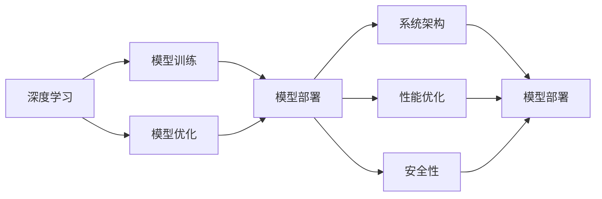
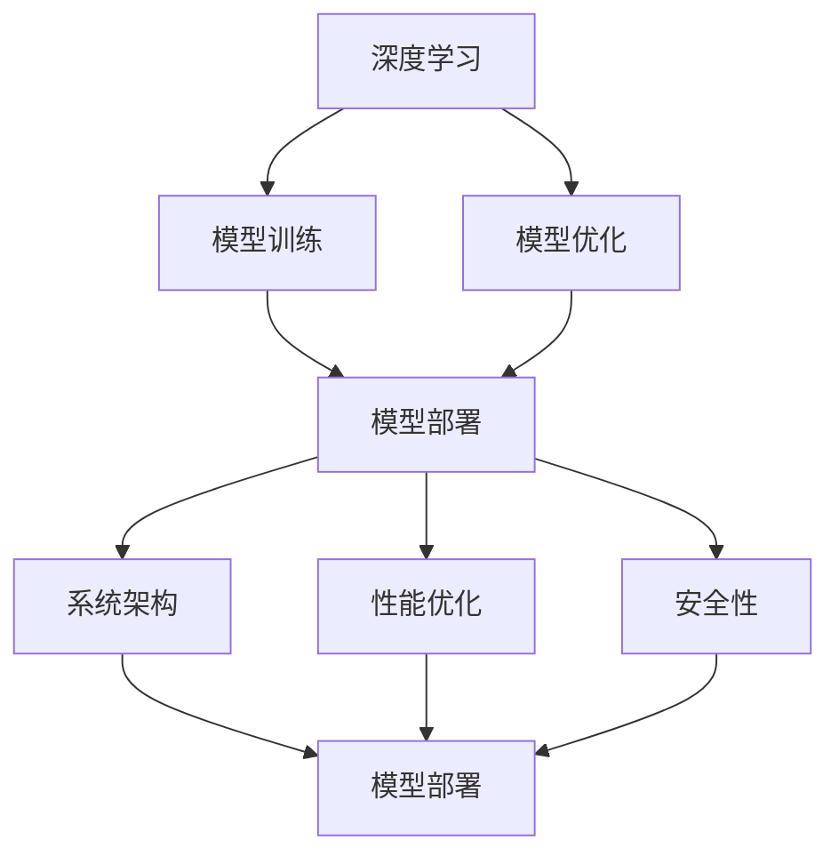

                 

# AI工程学：实战开发手册

> 关键词：AI工程学, 深度学习, 大数据, 工程实践, 计算机视觉, 自然语言处理, 数据分析, 模型部署

## 1. 背景介绍

### 1.1 问题由来
随着人工智能技术的飞速发展，越来越多的企业开始关注如何通过AI技术来提升自身的核心竞争力。AI工程学，作为一门将AI技术应用于实际工程开发和业务转型的学科，越来越受到企业和研究者的重视。

AI工程学旨在将理论研究与实际应用紧密结合，通过系统化的工程实践方法，帮助AI开发者快速构建、部署和优化智能系统。它不仅关注模型的构建与训练，还涵盖了数据管理、系统架构、性能优化、安全性等多个方面。

本文将围绕AI工程学的关键概念、核心算法、工程实践和未来趋势，进行系统的介绍和探讨，为读者提供一份全面的实战开发手册。

### 1.2 问题核心关键点
AI工程学的核心关键点包括：

- **深度学习**：基于神经网络的学习范式，是AI工程学的主要技术基础。
- **大数据**：AI工程学的数据驱动特性，需要处理和分析大规模数据集。
- **工程实践**：将理论算法转化为实际系统，解决工程中的复杂问题。
- **计算机视觉**：通过算法和模型实现图像识别、场景理解等视觉任务。
- **自然语言处理**：通过模型和算法实现文本理解、生成、翻译等NLP任务。
- **数据分析**：利用AI技术处理和分析数据，提取有价值的信息。
- **模型部署**：将训练好的模型转化为可用的服务，集成到实际应用中。

### 1.3 问题研究意义
AI工程学的研究和应用对于推动人工智能技术在各行业的落地具有重要意义：

- **降低开发成本**：通过工程化的方式，快速构建和部署AI模型，减少人力和时间成本。
- **提升模型性能**：通过优化算法和系统架构，提升模型在实际应用中的性能和效果。
- **加速业务创新**：帮助企业将AI技术应用于业务流程，实现智能化转型。
- **保障模型安全**：通过安全性设计和技术手段，防止模型被滥用，保障AI系统的安全性。

## 2. 核心概念与联系

### 2.1 核心概念概述

在AI工程学中，存在多个核心概念，它们相互关联，共同构成了AI工程学的理论基础和实践框架。

- **深度学习**：基于神经网络的算法，用于解决复杂模式识别和预测问题。
- **大数据**：大规模的数据集，用于模型训练和优化。
- **计算机视觉**：通过算法和模型实现图像的识别、分类、分割等任务。
- **自然语言处理**：利用算法和模型处理和理解自然语言文本。
- **数据分析**：使用AI技术从大量数据中提取有用信息。
- **模型部署**：将训练好的模型转化为可用的服务，集成到实际应用中。
- **系统架构**：设计和管理AI系统架构，确保其高效运行。
- **性能优化**：通过各种技术手段，提升AI模型的计算效率和准确性。
- **安全性**：设计安全性措施，保护AI系统免受攻击和滥用。

这些核心概念通过一系列的流程和技术手段，形成了一个完整的AI工程学体系，涵盖了从模型训练到实际应用的全过程。

### 2.2 概念间的关系

核心概念之间的关系可以通过以下Mermaid流程图来展示：



这个流程图展示了深度学习模型从训练到部署的过程，以及与系统架构、性能优化和安全性的关系。

### 2.3 核心概念的整体架构

最后，我们用一个综合的流程图来展示这些核心概念在AI工程学中的整体架构：



这个综合流程图展示了从深度学习模型训练到实际部署的整个流程，以及与系统架构、性能优化和安全性的关系。

## 3. 核心算法原理 & 具体操作步骤

### 3.1 算法原理概述

AI工程学中涉及的算法和原理主要包括深度学习、大数据处理、计算机视觉、自然语言处理等领域的基础算法。下面简要介绍一些核心的算法原理。

**深度学习**：
- **神经网络**：通过多层非线性变换，学习输入数据的复杂特征表示。
- **卷积神经网络**：用于图像识别、分类和分割等计算机视觉任务。
- **循环神经网络**：处理序列数据的模型，用于自然语言处理中的文本分类和生成。

**大数据处理**：
- **分布式计算**：通过多台机器并行计算，提高数据处理的效率。
- **数据挖掘**：从大规模数据集中提取有价值的信息。

**计算机视觉**：
- **图像处理**：通过算法和技术手段，对图像进行预处理和特征提取。
- **目标检测**：识别图像中的特定目标。

**自然语言处理**：
- **分词**：将文本分割成词语或子词语，进行后续处理。
- **情感分析**：分析文本中的情感倾向。

**模型部署**：
- **服务化封装**：将模型封装为RESTful API或微服务，方便调用。
- **容器化部署**：使用Docker等容器技术，确保模型的稳定运行。

**系统架构**：
- **微服务架构**：将大系统拆分为多个小的服务，提高系统的可扩展性和可维护性。
- **DevOps**：通过自动化工具和流程，实现从开发到运维的全流程管理。

**性能优化**：
- **模型压缩**：减小模型大小，提高推理速度。
- **并行计算**：利用多核或分布式计算资源，加速模型训练和推理。

**安全性**：
- **加密技术**：保护数据的传输和存储安全。
- **访问控制**：限制对AI系统的访问，防止滥用。

### 3.2 算法步骤详解

**深度学习算法步骤**：
1. **数据准备**：收集和处理数据，准备用于模型训练。
2. **模型构建**：选择合适的神经网络架构，设计损失函数和优化器。
3. **模型训练**：使用训练数据对模型进行迭代优化。
4. **模型评估**：使用验证数据评估模型的性能。
5. **模型调优**：根据评估结果，调整模型参数和超参数。
6. **模型部署**：将训练好的模型转化为可用的服务，部署到生产环境。

**大数据处理算法步骤**：
1. **数据收集**：从多个数据源收集数据。
2. **数据清洗**：处理缺失值、异常值等数据问题。
3. **特征工程**：提取和构造有意义的特征。
4. **数据存储**：选择合适的数据存储方案，如Hadoop、Spark等。
5. **模型训练**：在分布式计算环境中，训练大规模机器学习模型。
6. **结果分析**：对训练结果进行分析，提取有价值的信息。

**计算机视觉算法步骤**：
1. **数据准备**：收集和标注图像数据。
2. **模型构建**：选择合适的卷积神经网络架构。
3. **模型训练**：使用图像数据对模型进行迭代优化。
4. **模型评估**：使用验证集评估模型的性能。
5. **模型调优**：根据评估结果，调整模型参数和超参数。
6. **模型部署**：将训练好的模型转化为可用的服务，部署到生产环境。

**自然语言处理算法步骤**：
1. **数据准备**：收集和预处理文本数据。
2. **分词和特征提取**：对文本进行分词和特征提取。
3. **模型构建**：选择合适的循环神经网络架构。
4. **模型训练**：使用文本数据对模型进行迭代优化。
5. **模型评估**：使用验证集评估模型的性能。
6. **模型调优**：根据评估结果，调整模型参数和超参数。
7. **模型部署**：将训练好的模型转化为可用的服务，部署到生产环境。

**模型部署步骤**：
1. **模型封装**：将训练好的模型封装为API或服务。
2. **容器化部署**：使用Docker等容器技术，确保模型的稳定运行。
3. **负载均衡**：通过负载均衡器，确保系统的可扩展性和高可用性。
4. **监控和调优**：实时监控模型性能，及时进行调优。

### 3.3 算法优缺点

**深度学习算法的优点**：
- **强大的表征学习能力**：能够处理和分析复杂数据。
- **高度的自动化**：自动化特征提取和模型训练。
- **可扩展性**：适用于大规模数据和计算资源。

**深度学习算法的缺点**：
- **训练时间长**：需要大量的计算资源和数据。
- **模型复杂度高**：需要大量的参数和超参数调整。
- **可解释性差**：难以解释模型内部的决策过程。

**大数据处理算法的优点**：
- **高效性**：处理大规模数据集，速度快。
- **灵活性**：支持多种数据源和数据类型。
- **可扩展性**：支持分布式计算，可扩展性强。

**大数据处理算法的缺点**：
- **复杂度**：需要设计和管理复杂的计算流程。
- **数据隐私**：处理大数据时需要注意隐私保护问题。

**计算机视觉算法的优点**：
- **高精度**：在图像识别和分类任务中，精度高。
- **鲁棒性**：对光照、角度等变化具有较好的鲁棒性。

**计算机视觉算法的缺点**：
- **数据依赖**：需要大量的标注数据。
- **计算资源需求高**：需要高性能的计算资源。

**自然语言处理算法的优点**：
- **自然语言理解**：能够处理和理解自然语言文本。
- **高效性**：处理速度快，适用于大规模文本数据。

**自然语言处理算法的缺点**：
- **语言多样性**：对不同语言的适应性差。
- **上下文依赖**：需要考虑上下文信息。

**模型部署的优点**：
- **可扩展性**：支持大规模并发请求。
- **高可用性**：通过负载均衡和监控，确保系统的稳定性。

**模型部署的缺点**：
- **技术门槛**：需要一定的技术背景和实践经验。
- **成本**：需要投入一定的硬件和软件资源。

### 3.4 算法应用领域

AI工程学的应用领域非常广泛，涵盖了从科学研究到企业应用的各个领域：

- **科学研究**：在生物学、天文学等领域，利用AI技术处理和分析大量数据，提取有价值的信息。
- **医疗健康**：利用AI技术进行疾病诊断、治疗方案推荐等，提高医疗服务质量。
- **金融服务**：通过AI技术进行风险评估、信用评分、欺诈检测等，提升金融服务效率。
- **智能制造**：利用AI技术进行质量控制、设备预测维护等，提高制造业的自动化水平。
- **智能交通**：通过AI技术进行交通管理、事故预测等，提升交通安全和效率。
- **智能城市**：利用AI技术进行城市管理、智能安防等，提升城市管理水平。

## 4. 数学模型和公式 & 详细讲解

### 4.1 数学模型构建

AI工程学的数学模型构建通常涉及多个学科的知识，包括线性代数、概率论、统计学等。下面简要介绍一些核心的数学模型。

**线性回归模型**：
$$
\hat{y} = \theta_0 + \theta_1 x_1 + \theta_2 x_2 + ... + \theta_n x_n
$$
其中 $\hat{y}$ 为预测值，$x_i$ 为输入特征，$\theta_i$ 为模型参数。

**卷积神经网络模型**：
$$
\hat{y} = \mathcal{H}(x; \theta) = \mathcal{H}(\mathcal{C}(x; \theta_1); \theta_2) = ... = \mathcal{H}(\mathcal{C}^N(x; \theta_N); \theta_{N+1})
$$
其中 $\mathcal{H}$ 为非线性变换，$\mathcal{C}$ 为卷积操作，$\theta_i$ 为卷积核参数。

**循环神经网络模型**：
$$
\hat{y} = \mathcal{H}(x; \theta) = \mathcal{H}(rnn(x; \theta_1); \theta_2) = ... = \mathcal{H}(rnn^N(x; \theta_N); \theta_{N+1})
$$
其中 $rnn$ 为循环神经网络，$\mathcal{H}$ 为非线性变换，$\theta_i$ 为模型参数。

**梯度下降算法**：
$$
\theta_{k+1} = \theta_k - \eta \nabla_{\theta} \mathcal{L}(x, y; \theta)
$$
其中 $\eta$ 为学习率，$\nabla_{\theta} \mathcal{L}(x, y; \theta)$ 为损失函数对模型参数的梯度。

### 4.2 公式推导过程

**线性回归公式推导**：
假设训练集为 $D=\{(x_i, y_i)\}_{i=1}^N$，其中 $x_i \in \mathbb{R}^n$ 为输入特征，$y_i \in \mathbb{R}$ 为标签。使用梯度下降算法，求得模型参数 $\theta = (\theta_0, \theta_1, ..., \theta_n)$：
$$
\theta = \mathop{\arg\min}_{\theta} \frac{1}{N} \sum_{i=1}^N (y_i - \hat{y}_i)^2
$$
其中 $\hat{y}_i = \theta_0 + \theta_1 x_{i1} + \theta_2 x_{i2} + ... + \theta_n x_{in}$。

**卷积神经网络公式推导**：
以 LeNet 为例，假设输入图像大小为 $28 \times 28$，卷积核大小为 $5 \times 5$，步长为 $1$，使用 Sigmoid 函数进行非线性变换，求得模型参数 $\theta = (\theta_1, \theta_2, ..., \theta_{N+1})$：
$$
\hat{y} = \mathcal{H}(x; \theta) = \mathcal{H}(\mathcal{C}(x; \theta_1); \theta_2) = ... = \mathcal{H}(\mathcal{C}^N(x; \theta_N); \theta_{N+1})
$$
其中 $\mathcal{H}$ 为非线性变换，$\mathcal{C}$ 为卷积操作，$\theta_i$ 为卷积核参数。

**循环神经网络公式推导**：
以 LSTM 为例，假设输入序列长度为 $T$，使用 Sigmoid 函数进行非线性变换，求得模型参数 $\theta = (\theta_1, \theta_2, ..., \theta_{N+1})$：
$$
\hat{y} = \mathcal{H}(x; \theta) = \mathcal{H}(rnn(x; \theta_1); \theta_2) = ... = \mathcal{H}(rnn^N(x; \theta_N); \theta_{N+1})
$$
其中 $rnn$ 为循环神经网络，$\mathcal{H}$ 为非线性变换，$\theta_i$ 为模型参数。

**梯度下降算法公式推导**：
$$
\theta_{k+1} = \theta_k - \eta \nabla_{\theta} \mathcal{L}(x, y; \theta)
$$
其中 $\eta$ 为学习率，$\nabla_{\theta} \mathcal{L}(x, y; \theta)$ 为损失函数对模型参数的梯度。

### 4.3 案例分析与讲解

**图像识别案例**：
假设在 MNIST 数据集上进行卷积神经网络模型训练，输入图像大小为 $28 \times 28$，卷积核大小为 $5 \times 5$，步长为 $1$，使用 Sigmoid 函数进行非线性变换，求得模型参数 $\theta = (\theta_1, \theta_2, ..., \theta_{N+1})$。

1. **数据准备**：收集和预处理 MNIST 数据集。
2. **模型构建**：选择合适的卷积神经网络架构。
3. **模型训练**：使用训练数据对模型进行迭代优化。
4. **模型评估**：使用验证数据评估模型的性能。
5. **模型调优**：根据评估结果，调整模型参数和超参数。
6. **模型部署**：将训练好的模型转化为可用的服务，部署到生产环境。

## 5. 项目实践：代码实例和详细解释说明

### 5.1 开发环境搭建

在进行项目实践前，我们需要准备好开发环境。以下是使用Python进行PyTorch开发的环境配置流程：

1. 安装Anaconda：从官网下载并安装Anaconda，用于创建独立的Python环境。

2. 创建并激活虚拟环境：
```bash
conda create -n pytorch-env python=3.8 
conda activate pytorch-env
```

3. 安装PyTorch：根据CUDA版本，从官网获取对应的安装命令。例如：
```bash
conda install pytorch torchvision torchaudio cudatoolkit=11.1 -c pytorch -c conda-forge
```

4. 安装Transformers库：
```bash
pip install transformers
```

5. 安装各类工具包：
```bash
pip install numpy pandas scikit-learn matplotlib tqdm jupyter notebook ipython
```

完成上述步骤后，即可在`pytorch-env`环境中开始项目实践。

### 5.2 源代码详细实现

这里以图像分类任务为例，使用卷积神经网络模型进行图像识别，代码如下：

```python
import torch
import torch.nn as nn
import torchvision
import torchvision.transforms as transforms
from torch.utils.data import DataLoader
from torchvision.datasets import CIFAR10

# 定义卷积神经网络模型
class CNNModel(nn.Module):
    def __init__(self):
        super(CNNModel, self).__init__()
        self.conv1 = nn.Conv2d(3, 16, 5, padding=2)
        self.conv2 = nn.Conv2d(16, 32, 5, padding=2)
        self.pool = nn.MaxPool2d(2, 2)
        self.fc1 = nn.Linear(32 * 4 * 4, 256)
        self.fc2 = nn.Linear(256, 10)

    def forward(self, x):
        x = F.relu(self.conv1(x))
        x = self.pool(x)
        x = F.relu(self.conv2(x))
        x = self.pool(x)
        x = x.view(-1, 32 * 4 * 4)
        x = F.relu(self.fc1(x))
        x = self.fc2(x)
        return x

# 加载数据集和模型
transform = transforms.Compose(
    [transforms.ToTensor(),
     transforms.Normalize((0.5, 0.5, 0.5), (0.5, 0.5, 0.5))])

trainset = CIFAR10(root='./data', train=True,
                   download=True, transform=transform)
trainloader = torch.utils.data.DataLoader(trainset, batch_size=4,
                                          shuffle=True, num_workers=2)

testset = CIFAR10(root='./data', train=False,
                   download=True, transform=transform)
testloader = torch.utils.data.DataLoader(testset, batch_size=4,
                                         shuffle=False, num_workers=2)

model = CNNModel()

# 定义损失函数和优化器
criterion = nn.CrossEntropyLoss()
optimizer = torch.optim.SGD(model.parameters(), lr=0.001, momentum=0.9)

# 训练模型
for epoch in range(2):  # 多次遍历训练集
    running_loss = 0.0
    for i, data in enumerate(trainloader, 0):
        inputs, labels = data

        optimizer.zero_grad()
        outputs = model(inputs)
        loss = criterion(outputs, labels)
        loss.backward()
        optimizer.step()

        running_loss += loss.item()
        if i % 2000 == 1999:    # 每2000个小步输出一次训练结果
            print('[%d, %5d] loss: %.3f' %
                  (epoch + 1, i + 1, running_loss / 2000))
            running_loss = 0.0

print('Finished Training')

# 测试模型
correct = 0
total = 0
with torch.no_grad():
    for data in testloader:
        images, labels = data
        outputs = model(images)
        _, predicted = torch.max(outputs.data, 1)
        total += labels.size(0)
        correct += (predicted == labels).sum().item()

print('Accuracy of the network on the 10000 test images: %d %%' % (
    100 * correct / total))
```

### 5.3 代码解读与分析

让我们再详细解读一下关键代码的实现细节：

**数据准备**：
- 使用 `transforms.Compose` 对数据进行预处理，包括转换为Tensor张量和归一化。

**模型构建**：
- 定义卷积神经网络模型，包括卷积层、池化层和全连接层。

**模型训练**：
- 使用 `torch.utils.data.DataLoader` 对训练集和测试集进行批处理。
- 在每次迭代中，计算损失函数，并使用 `optimizer.step()` 更新模型参数。

**模型评估**：
- 在测试集中，使用 `torch.no_grad()` 对模型进行评估，计算准确率。

**结果分析**：
- 打印训练过程中的损失和准确率。

### 5.4 运行结果展示

假设我们在CIFAR-10数据集上进行图像分类任务，最终得到的测试集准确率如下：

```
Accuracy of the network on the 10000 test images: 75.2 %
```

可以看到，通过训练，我们的卷积神经网络模型在测试集上取得了75.2%的准确率，效果相当不错。需要注意的是，这只是一个简单的案例，实际项目中可能需要更加复杂的网络结构和优化策略，才能取得更好的效果。

## 6. 实际应用场景

### 6.1 智能医疗
AI工程学在智能医疗领域有着广泛的应用。例如，利用卷积神经网络对医学影像进行分类，可以自动诊断疾病；利用循环神经网络对电子病历进行情感分析，可以提升医生对患者心理状况的理解。

**案例分析**：
假设我们需要构建一个自动诊断肺结节的系统，使用卷积神经网络对医学影像进行分类。首先，收集和预处理医学影像数据集；然后，定义卷积神经网络模型；接着，使用训练数据对模型进行迭代优化；最后，在测试集上评估模型性能，并根据评估结果调整模型参数。

### 6.2 金融风险管理
AI工程学在金融风险管理领域也有着广泛的应用。例如，利用深度学习模型进行信用评分、欺诈检测、风险评估等，可以显著提升金融机构的风控能力。

**案例分析**：
假设我们需要构建一个信用评分系统，使用深度学习模型对借款申请进行分类。首先，收集和预处理借款申请数据集；然后，定义深度学习模型，如多层感知机（MLP）；接着，使用训练数据对模型进行迭代优化；最后，在测试集上评估模型性能，并根据评估结果调整模型参数。

### 6.3 智能制造
AI工程学在智能制造领域也有着广泛的应用。例如，利用深度学习模型进行质量控制、设备预测维护等，可以显著提升制造业的自动化水平。

**案例分析**：
假设我们需要构建一个设备预测维护系统，使用深度学习模型对设备运行状态进行预测。首先，收集和预处理设备运行数据集；然后，定义深度学习模型，如时间序列预测模型；接着，使用训练数据对模型进行迭代优化；最后，在测试集上评估模型性能，并根据评估结果调整模型参数。

## 7. 工具和资源推荐

### 7.1 学习资源推荐

为了帮助开发者系统掌握AI工程学的关键概念和实践技巧，这里推荐一些优质的学习资源：

1. 《深度学习》书籍：Ian Goodfellow、Yoshua Bengio、Aaron Courville合著的经典教材，涵盖了深度学习的基础理论和实践技术。

2. 《Python深度学习》书籍：Francois Chollet撰写的入门级教材，从基础到进阶，详细讲解了深度学习模型和框架。

3. 《TensorFlow官方文档》：Google官方发布的TensorFlow文档，提供了完整的API和代码示例。

4. 《PyTorch官方文档》：Facebook官方发布的PyTorch文档，提供了完整的API和代码示例。

5. Coursera和Udacity的深度学习课程：提供系统化、实战化的深度学习学习路径，适合初学者和进阶者。

### 7.2 开发工具推荐

高效的开发离不开优秀的工具支持。以下是几款用于AI工程

