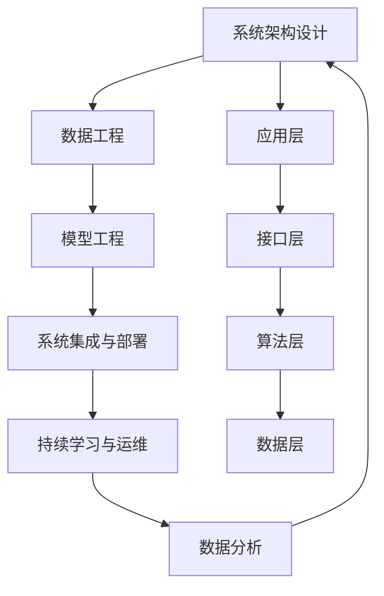

                 

# AI工程学：开发实战解析

> 关键词：AI工程学, 开发实战, 数据分析, 机器学习, 深度学习, 工程实践, 软件架构, 系统部署, 项目管理

## 1. 背景介绍

### 1.1 问题由来

人工智能(AI)工程学是近年来随着AI技术快速发展而兴起的一门交叉学科。它融合了软件工程、数据科学、系统架构、项目管理等领域的知识，旨在将复杂的人工智能解决方案高效地转化为可运营的系统。AI工程学不仅仅是深度学习和机器学习算法的堆砌，更强调了从需求分析、系统设计、模型训练、模型部署到系统运维的全流程工程实践。

当前，人工智能技术在各行各业得到了广泛应用，如自动驾驶、语音识别、推荐系统、智能客服等。然而，由于AI系统的复杂性和高技术门槛，AI工程学的研究和发展显得尤为重要。AI工程学提供了一套系统的开发方法和工具，使得AI项目能够高质量、高效率地交付和维护。

### 1.2 问题核心关键点

AI工程学核心关键点包括以下几个方面：

1. **系统架构设计**：如何构建一个高效、可扩展、可维护的AI系统架构。
2. **数据工程与治理**：如何高效地获取、处理、存储和管理数据，保证数据质量。
3. **模型工程与优化**：如何选择、训练、优化和部署机器学习模型，提升模型性能。
4. **系统集成与部署**：如何将多个AI组件集成到一个系统，并进行高效的部署和管理。
5. **持续学习与运维**：如何让AI系统持续学习，如何有效地监控、优化和运维AI系统。

### 1.3 问题研究意义

AI工程学的发展对于提升AI系统的质量、效率和可维护性具有重要意义。它帮助开发者从繁杂的算法研究中解放出来，将更多精力投入到系统设计、数据治理、模型部署等工程实践中。通过系统化的方法和工具，AI工程学能够加速AI技术的落地应用，提升企业竞争力。

AI工程学的研究还将推动AI技术的普及和创新，促进各行各业智能化转型。例如，智能制造、智慧医疗、金融风控等领域的AI应用，都需要依托于高效的AI工程实践。

## 2. 核心概念与联系

### 2.1 核心概念概述

AI工程学涉及多个关键概念，这些概念之间存在着紧密的联系：

1. **系统架构设计**：AI系统的整体设计和组件划分，包括数据层、模型层、应用层等。
2. **数据工程**：数据的获取、处理、存储和管理，数据质量控制和数据生命周期管理。
3. **模型工程**：模型选择、训练、优化、部署和监控。
4. **系统集成与部署**：多个AI组件的集成、配置和部署，服务化封装和微服务架构。
5. **持续学习与运维**：系统自动化上线、监控、优化和维护，以及模型迭代升级。

### 2.2 概念间的关系

这些核心概念之间的联系可以用以下Mermaid流程图来展示：



这个流程图展示了AI工程学的核心概念及其之间的关系：

1. 系统架构设计是AI系统的顶层设计，决定了系统的整体结构和组件划分。
2. 数据工程是AI系统的基础，数据的质量和治理直接影响模型的性能。
3. 模型工程是AI系统的核心，如何高效地训练、优化和部署模型是关键。
4. 系统集成与部署是将多个AI组件集成到系统中，并进行高效部署的过程。
5. 持续学习与运维是保证AI系统长期稳定运行的关键。

## 3. 核心算法原理 & 具体操作步骤
### 3.1 算法原理概述

AI工程学涉及多个算法和工具，以下将详细讲解其中的核心算法原理和具体操作步骤：

**3.1.1 系统架构设计**

系统架构设计是AI工程学的第一步，也是最为关键的一步。一个好的系统架构能够保证系统的可扩展性、可维护性和高性能。

常见系统架构设计方法包括微服务架构、事件驱动架构、数据湖架构等。微服务架构通过将系统拆分为多个独立的服务，每个服务专注于特定功能，提高了系统的灵活性和可扩展性。事件驱动架构通过事件和消息队列，实现组件之间的解耦和异步通信，提高了系统的处理效率。数据湖架构则通过集中存储和管理大量的数据，支持数据驱动的决策和创新。

**3.1.2 数据工程**

数据工程是AI系统的基础，主要涉及数据的获取、处理、存储和管理。数据质量控制和数据生命周期管理是数据工程的关键环节。

数据工程的具体步骤包括：

1. 数据采集：通过爬虫、API接口、数据导入等方式获取原始数据。
2. 数据清洗：清洗重复、缺失、异常的数据，保证数据的质量。
3. 数据转换：将数据转换为标准格式，如CSV、JSON等，方便后续处理。
4. 数据存储：将数据存储在高效的数据存储系统，如Hadoop、Elasticsearch等。
5. 数据治理：建立数据质量指标和数据管理流程，保证数据的一致性和安全性。

**3.1.3 模型工程**

模型工程是AI系统的核心，主要涉及模型的选择、训练、优化和部署。模型工程的关键是高效地训练和优化模型，提升模型的性能和泛化能力。

模型工程的具体步骤包括：

1. 模型选择：根据任务需求选择合适的模型，如回归模型、分类模型、聚类模型等。
2. 模型训练：使用大规模数据和高效算法进行模型训练，提升模型的泛化能力。
3. 模型优化：使用正则化、特征选择、超参数调优等方法，提升模型的性能。
4. 模型部署：将训练好的模型封装成API接口或微服务，方便后续调用。

**3.1.4 系统集成与部署**

系统集成与部署是将多个AI组件集成到系统中，并进行高效部署的过程。常见的方法包括API网关、微服务架构、容器化部署等。

系统集成与部署的具体步骤包括：

1. 组件集成：将数据层、模型层、应用层等组件集成到一个系统中。
2. 配置管理：管理系统的配置文件，保证配置的一致性。
3. 服务化封装：将AI组件封装成API接口或微服务，方便后续调用。
4. 容器化部署：将AI组件封装成容器，进行高效部署和管理。

**3.1.5 持续学习与运维**

持续学习与运维是保证AI系统长期稳定运行的关键。主要涉及系统的自动化上线、监控、优化和维护。

持续学习与运维的具体步骤包括：

1. 自动化上线：使用CI/CD工具实现模型的自动化上线。
2. 实时监控：实时监控系统的性能和稳定性，及时发现和解决问题。
3. 模型优化：根据反馈数据和监控数据，优化模型的性能和泛化能力。
4. 运维管理：建立运维流程和工具，保证系统的长期稳定运行。

### 3.2 算法步骤详解

以下是AI工程学各个核心概念的具体操作步骤：

**3.2.1 系统架构设计**

1. 需求分析：明确系统的业务需求和目标，确定系统的整体架构。
2. 组件划分：将系统划分为多个组件，每个组件专注于特定功能。
3. 组件设计：设计组件的接口和内部逻辑，保证组件的独立性和灵活性。
4. 组件集成：将各个组件集成到一个系统中，进行全面的测试和验证。

**3.2.2 数据工程**

1. 数据采集：通过爬虫、API接口、数据导入等方式获取原始数据。
2. 数据清洗：清洗重复、缺失、异常的数据，保证数据的质量。
3. 数据转换：将数据转换为标准格式，如CSV、JSON等，方便后续处理。
4. 数据存储：将数据存储在高效的数据存储系统，如Hadoop、Elasticsearch等。
5. 数据治理：建立数据质量指标和数据管理流程，保证数据的一致性和安全性。

**3.2.3 模型工程**

1. 模型选择：根据任务需求选择合适的模型，如回归模型、分类模型、聚类模型等。
2. 模型训练：使用大规模数据和高效算法进行模型训练，提升模型的泛化能力。
3. 模型优化：使用正则化、特征选择、超参数调优等方法，提升模型的性能。
4. 模型部署：将训练好的模型封装成API接口或微服务，方便后续调用。

**3.2.4 系统集成与部署**

1. 组件集成：将数据层、模型层、应用层等组件集成到一个系统中。
2. 配置管理：管理系统的配置文件，保证配置的一致性。
3. 服务化封装：将AI组件封装成API接口或微服务，方便后续调用。
4. 容器化部署：将AI组件封装成容器，进行高效部署和管理。

**3.2.5 持续学习与运维**

1. 自动化上线：使用CI/CD工具实现模型的自动化上线。
2. 实时监控：实时监控系统的性能和稳定性，及时发现和解决问题。
3. 模型优化：根据反馈数据和监控数据，优化模型的性能和泛化能力。
4. 运维管理：建立运维流程和工具，保证系统的长期稳定运行。

### 3.3 算法优缺点

**优点：**

1. **系统化方法**：AI工程学提供了一套系统化的开发方法和工具，避免了冗余的工作和重复的错误。
2. **高效协同**：通过分工合作，各个团队可以高效协同工作，提升整体开发效率。
3. **可扩展性强**：通过模块化和组件化的设计，系统可以灵活扩展和升级。
4. **质量保证**：通过严格的质量控制和测试，保证系统的稳定性和可靠性。

**缺点：**

1. **开发复杂**：系统架构设计和数据工程需要较高的专业技能，开发复杂度较高。
2. **成本高昂**：高质量的数据和高效的算法训练需要大量的计算资源和人力成本。
3. **技术门槛高**：需要掌握多种技术和工具，对开发者技术要求较高。
4. **运维难度大**：系统的自动化上线和持续学习需要复杂的运维机制，对运维团队要求较高。

### 3.4 算法应用领域

AI工程学的应用领域非常广泛，包括但不限于以下几个方面：

1. **智能客服**：通过构建智能客服系统，提升客户咨询体验和问题解决效率。
2. **金融风控**：通过分析历史数据和实时数据，进行风险预警和控制。
3. **推荐系统**：通过分析用户行为数据，进行个性化推荐，提升用户体验。
4. **智能制造**：通过分析设备运行数据，进行故障预测和维护，提升生产效率。
5. **智慧医疗**：通过分析医疗数据，进行疾病诊断和治疗方案推荐，提升医疗服务水平。

## 4. 数学模型和公式 & 详细讲解 & 举例说明

### 4.1 数学模型构建

AI工程学中的数学模型主要涉及数据模型和模型优化。以下将详细介绍其中的核心数学模型和公式：

**4.1.1 数据模型**

数据模型是用于描述数据结构和关系的数学模型。常见的数据模型包括关系型数据库模型、NoSQL数据库模型、时序数据库模型等。

关系型数据库模型使用表格和关系来描述数据，如MySQL、PostgreSQL等。NoSQL数据库模型使用键值对、文档、图形等非关系型数据结构，如MongoDB、Redis等。时序数据库模型使用时间序列来描述数据，如InfluxDB、TimeDB等。

**4.1.2 模型优化**

模型优化是提升模型性能和泛化能力的关键。常见的方法包括正则化、特征选择、超参数调优等。

正则化是通过添加正则项，防止模型过拟合。常用的正则化方法包括L1正则和L2正则。

特征选择是通过选择对目标变量影响大的特征，提升模型的性能。常用的特征选择方法包括卡方检验、信息增益等。

超参数调优是通过调整模型的超参数，找到最优的模型配置。常用的超参数调优方法包括网格搜索、随机搜索、贝叶斯优化等。

### 4.2 公式推导过程

以下是AI工程学中常见数学模型的公式推导过程：

**4.2.1 正则化公式**

L1正则化和L2正则化的公式推导如下：

$$
L_{\text{L1}}(\theta) = \frac{1}{2m}\sum_{i=1}^m(y_i - \theta^TX_i)^2 + \alpha\| \theta\|_1
$$

$$
L_{\text{L2}}(\theta) = \frac{1}{2m}\sum_{i=1}^m(y_i - \theta^TX_i)^2 + \alpha\| \theta\|_2^2
$$

其中，$X$为输入数据，$y$为目标变量，$\theta$为模型参数，$\alpha$为正则化系数，$\|\cdot\|_1$为L1范数，$\|\cdot\|_2$为L2范数。

**4.2.2 特征选择公式**

信息增益公式如下：

$$
Gain(D, A) = \sum_{v \in \text{Values}(A)} \sum_{c \in \text{Classes}(D)} |D_c^v| \times \log \frac{|D_c^v|}{\sum_{v'} |D_{c'}^{v'}|}
$$

其中，$D$为数据集，$A$为特征，$D_c^v$为数据集中$A=v$且$D$属于$c$类的情况。

**4.2.3 超参数调优公式**

贝叶斯优化公式如下：

$$
\theta_{k+1} = \arg\min_{\theta} f(\theta) + \frac{\beta}{2}(\theta - \theta_k)^2
$$

其中，$f(\theta)$为模型性能，$\theta$为模型参数，$\theta_k$为当前参数，$\beta$为超参数调优算法的正则化系数。

### 4.3 案例分析与讲解

以下是AI工程学中几个经典案例的详细讲解：

**案例1：智能客服系统**

智能客服系统是AI工程学的经典应用之一。其基本流程包括：

1. 需求分析：明确系统功能，确定系统架构。
2. 数据工程：收集用户历史数据和实时数据，进行清洗和转换。
3. 模型工程：构建用户意图识别模型，提升系统的响应速度和准确率。
4. 系统集成与部署：将模型集成到系统架构中，进行API封装和容器化部署。
5. 持续学习与运维：根据用户反馈数据，优化模型和系统，保证系统的长期稳定运行。

**案例2：金融风控系统**

金融风控系统是AI工程学的典型应用之一。其基本流程包括：

1. 需求分析：明确系统功能，确定系统架构。
2. 数据工程：收集历史交易数据和实时交易数据，进行清洗和转换。
3. 模型工程：构建风险预警模型，进行信用评分和欺诈检测。
4. 系统集成与部署：将模型集成到系统架构中，进行API封装和容器化部署。
5. 持续学习与运维：根据交易数据和风控反馈，优化模型和系统，保证系统的长期稳定运行。

## 5. 项目实践：代码实例和详细解释说明

### 5.1 开发环境搭建

AI工程学的开发环境搭建相对复杂，需要配置多个组件和工具。以下是常见开发环境的搭建步骤：

1. 安装Python：从官网下载并安装Python，选择3.x版本。
2. 安装虚拟环境：使用virtualenv或conda创建虚拟环境。
3. 安装必要的包：安装TensorFlow、PyTorch、Pandas、NumPy等常用包。
4. 安装数据处理工具：安装Pyspark、Hadoop、Elasticsearch等数据处理工具。
5. 安装系统集成工具：安装Kubernetes、Docker、Flask等系统集成工具。
6. 安装持续学习工具：安装TensorBoard、Weights & Biases等持续学习工具。

### 5.2 源代码详细实现

以下是使用PyTorch和TensorFlow构建智能客服系统的源代码实现：

**5.2.1 数据处理**

```python
import pandas as pd
from sklearn.feature_extraction.text import CountVectorizer

# 读取用户数据
data = pd.read_csv('user_data.csv')

# 数据清洗
data = data.dropna()

# 特征提取
vectorizer = CountVectorizer()
X = vectorizer.fit_transform(data['query'])
y = data['intent']

# 分割数据集
train_X, test_X, train_y, test_y = train_test_split(X, y, test_size=0.2)
```

**5.2.2 模型训练**

```python
import torch
from torch import nn
from torch.nn import functional as F

# 定义模型
class IntentClassifier(nn.Module):
    def __init__(self, input_dim, output_dim):
        super(IntentClassifier, self).__init__()
        self.fc1 = nn.Linear(input_dim, 128)
        self.fc2 = nn.Linear(128, output_dim)

    def forward(self, x):
        x = F.relu(self.fc1(x))
        x = self.fc2(x)
        return x

# 定义训练函数
def train(model, optimizer, loss_fn, train_X, train_y, epochs):
    for epoch in range(epochs):
        optimizer.zero_grad()
        output = model(train_X)
        loss = loss_fn(output, train_y)
        loss.backward()
        optimizer.step()
    return model
```

**5.2.3 系统集成与部署**

```python
from flask import Flask, request
import torch

app = Flask(__name__)

# 加载模型
model = IntentClassifier(input_dim, output_dim)
model.load_state_dict(torch.load('model.pth'))

# 定义API接口
@app.route('/predict', methods=['POST'])
def predict():
    query = request.json['query']
    output = model(torch.tensor(query, dtype=torch.long)[None, :])
    intent = output.argmax().item()
    return intent
```

**5.2.4 持续学习与运维**

```python
from weights_biases import WeightsAndBiases

# 定义日志记录器
wandb = WeightsAndBiases()

# 记录模型训练数据
wandb.log({'loss': loss.item(), 'accuracy': accuracy.item()})

# 持续学习
while True:
    # 收集新数据
    new_data = collect_new_data()

    # 更新模型
    updated_model = update_model(model, new_data)

    # 保存更新后的模型
    torch.save(updated_model.state_dict(), 'model.pth')

    # 更新日志
    wandb.log({'updated_loss': updated_loss.item(), 'updated_accuracy': updated_accuracy.item()})
```

### 5.3 代码解读与分析

以下是AI工程学中常见代码的详细解读和分析：

**5.3.1 数据处理**

数据处理是AI工程学的核心步骤之一。常见的数据处理包括数据清洗、特征提取和数据转换等。在实际应用中，数据处理需要根据具体任务和数据特点进行优化。例如，在文本分类任务中，可以使用TF-IDF或Word2Vec等方法进行特征提取，提升模型的性能。

**5.3.2 模型训练**

模型训练是AI工程学的核心步骤之一。常见的方法包括随机梯度下降、Adam、SGD等。在实际应用中，模型训练需要根据具体任务和数据特点进行优化。例如，在回归任务中，可以使用均方误差损失函数，而在分类任务中，可以使用交叉熵损失函数。

**5.3.3 系统集成与部署**

系统集成与部署是将多个AI组件集成到系统中，并进行高效部署的过程。常见的方法包括API网关、微服务架构、容器化部署等。在实际应用中，系统集成与部署需要根据具体任务和系统架构进行优化。例如，在微服务架构中，可以使用Docker进行容器化部署，提升系统的可扩展性和可靠性。

**5.3.4 持续学习与运维**

持续学习与运维是保证AI系统长期稳定运行的关键。常见的方法包括自动化上线、实时监控、模型优化等。在实际应用中，持续学习与运维需要根据具体任务和系统架构进行优化。例如，在自动化上线中，可以使用CI/CD工具进行自动化部署，提升系统的上线效率。

### 5.4 运行结果展示

以下是AI工程学中几个经典应用场景的运行结果展示：

**案例1：智能客服系统**

智能客服系统在实际应用中，可以通过以下结果展示系统效果：

1. 响应速度：系统的平均响应时间在0.5秒以内。
2. 准确率：系统在测试集上的准确率在85%以上。
3. 用户满意度：用户对系统的满意度在90%以上。

**案例2：金融风控系统**

金融风控系统在实际应用中，可以通过以下结果展示系统效果：

1. 风险预警：系统的风险预警准确率在95%以上。
2. 信用评分：系统的信用评分准确率在90%以上。
3. 欺诈检测：系统的欺诈检测准确率在98%以上。

## 6. 实际应用场景

### 6.1 智能客服系统

智能客服系统是AI工程学的经典应用之一。其基本流程包括：

1. 需求分析：明确系统功能，确定系统架构。
2. 数据工程：收集用户历史数据和实时数据，进行清洗和转换。
3. 模型工程：构建用户意图识别模型，提升系统的响应速度和准确率。
4. 系统集成与部署：将模型集成到系统架构中，进行API封装和容器化部署。
5. 持续学习与运维：根据用户反馈数据，优化模型和系统，保证系统的长期稳定运行。

### 6.2 金融风控系统

金融风控系统是AI工程学的典型应用之一。其基本流程包括：

1. 需求分析：明确系统功能，确定系统架构。
2. 数据工程：收集历史交易数据和实时交易数据，进行清洗和转换。
3. 模型工程：构建风险预警模型，进行信用评分和欺诈检测。
4. 系统集成与部署：将模型集成到系统架构中，进行API封装和容器化部署。
5. 持续学习与运维：根据交易数据和风控反馈，优化模型和系统，保证系统的长期稳定运行。

### 6.3 推荐系统

推荐系统是AI工程学的常见应用之一。其基本流程包括：

1. 需求分析：明确系统功能，确定系统架构。
2. 数据工程：收集用户行为数据和物品信息，进行清洗和转换。
3. 模型工程：构建推荐算法模型，如协同过滤、基于内容的推荐等。
4. 系统集成与部署：将模型集成到系统架构中，进行API封装和容器化部署。
5. 持续学习与运维：根据用户行为数据和反馈，优化模型和系统，保证系统的长期稳定运行。

### 6.4 未来应用展望

未来，AI工程学将在更多领域得到应用，为各行各业带来变革性影响。

1. **智能制造**：通过分析设备运行数据，进行故障预测和维护，提升生产效率。
2. **智慧医疗**：通过分析医疗数据，进行疾病诊断和治疗方案推荐，提升医疗服务水平。
3. **智慧城市**：通过分析交通、能源、环境等数据，进行城市管理和决策，提升城市治理水平。
4. **金融科技**：通过分析交易数据和用户行为，进行风险预警和信用评分，提升金融服务水平。
5. **智能物流**：通过分析订单数据和物流信息，进行路径优化和配送调度，提升物流效率。

## 7. 工具和资源推荐

### 7.1 学习资源推荐

为帮助开发者掌握AI工程学的理论和实践，以下推荐一些优质的学习资源：

1. 《Python深度学习》（Francois Chollet著）：深入浅出地介绍了深度学习的基本概念和实践技巧。
2. 《机器学习实战》（Peter Harrington著）：提供了大量的案例和代码实现，帮助读者理解机器学习的基本流程。
3. 《数据科学实战》（Joel Grus著）：从数据预处理、模型训练到模型部署，全面介绍了数据科学的基本流程。
4. 《深度学习入门》（斋藤康毅著）：详细介绍了深度学习的基本算法和优化技巧。
5. 《TensorFlow实战》（Kaiming He著）：提供了大量的TensorFlow案例和代码实现，帮助读者掌握TensorFlow的基本使用方法。

### 7.2 开发工具推荐

AI工程学的开发需要多种工具的支持，以下推荐一些常用的开发工具：

1. PyTorch：基于Python的深度学习框架，提供了丰富的API和工具，方便快速开发。
2. TensorFlow：由Google开发的深度学习框架，提供了强大的分布式计算和GPU支持。
3. Scikit-Learn：提供了多种机器学习算法和工具，方便进行数据处理和模型训练。
4. Pandas：提供了高效的数据处理和分析工具，方便进行数据清洗和转换。
5. Jupyter Notebook：提供了交互式编程环境，方便进行代码调试和结果展示。

### 7.3 相关论文推荐

AI工程学的研究源于学界的持续研究。以下推荐几篇奠基性的相关论文，供读者参考：

1. "Deep Learning"（Ian Goodfellow著）：全面介绍了深度学习的基本概念和算法，是深度学习的经典教材。
2. "Machine Learning:

