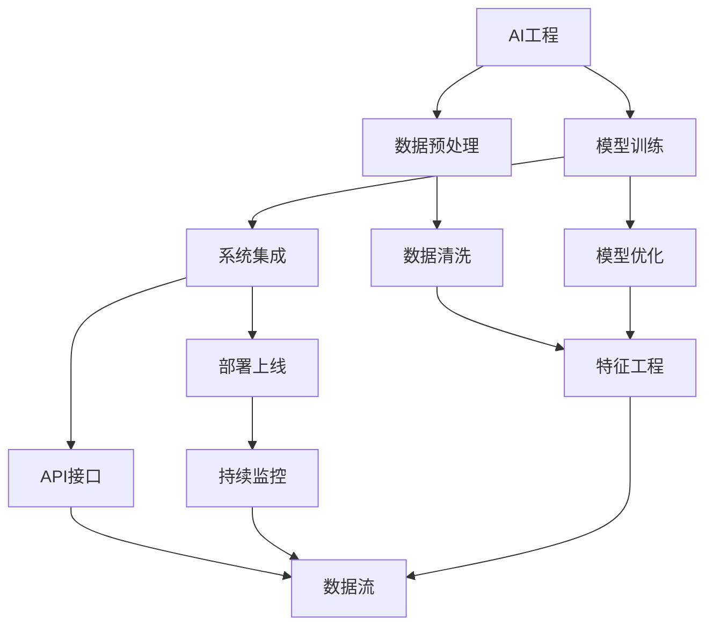
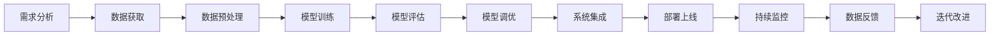
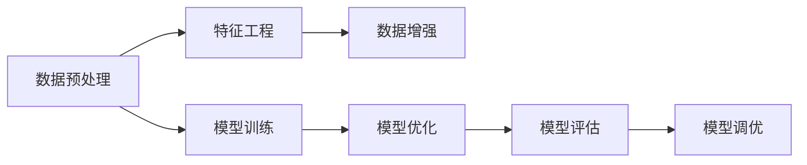
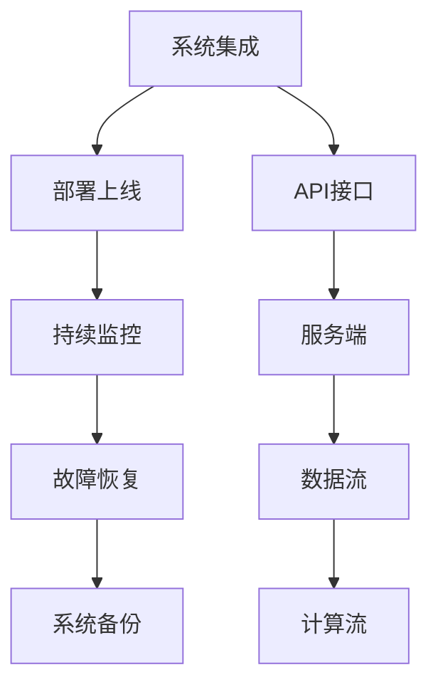

                 

# AI工程最佳实践原理与代码实战案例讲解

> 关键词：AI工程,最佳实践,原理,代码实战,案例讲解

## 1. 背景介绍

### 1.1 问题由来

在当今的数字化时代，人工智能(AI)技术已经渗透到各行各业，成为推动科技进步和社会发展的重要引擎。然而，AI工程的复杂性和挑战性，使得许多项目在实施过程中面临诸多困难。如何构建一个高效、稳定、可扩展的AI系统，成为了工程实践中的一大难题。本博客旨在探讨AI工程的最佳实践原理，并提供实战案例讲解，帮助读者系统掌握AI工程的构建与部署技巧。

### 1.2 问题核心关键点

AI工程的构建与部署是一个多学科交叉的过程，涉及数据预处理、模型训练、系统集成、部署上线等环节。以下是AI工程的核心关键点：

- **数据预处理**：确保数据的质量和一致性，进行数据清洗、特征工程、数据增强等处理。
- **模型训练**：选择合适的算法和超参数，通过交叉验证等技术，优化模型性能。
- **系统集成**：将模型、数据、服务封装为标准接口，实现高效的数据流和计算流。
- **部署上线**：将模型和系统部署到生产环境，进行持续监控和优化。
- **可扩展性**：构建模块化的系统架构，支持动态扩展和维护。
- **可解释性**：提供透明的模型输出和推理过程，确保可解释性和可信度。

这些关键点贯穿于AI工程的各个环节，决定了系统的性能和稳定性。本文将通过原理讲解和案例分析，帮助读者系统掌握这些关键点。

### 1.3 问题研究意义

掌握AI工程的最佳实践原理，对于构建高效、可扩展、可解释的AI系统具有重要意义。具体而言：

- **提升系统性能**：通过数据预处理、模型调优、系统集成等技术，提升AI系统的性能和准确度。
- **降低开发成本**：通过模块化设计、复用组件、自动化测试等方法，降低开发和维护成本。
- **提高系统稳定性**：通过持续监控、故障恢复、系统备份等措施，确保AI系统的稳定运行。
- **增强用户信任**：通过可解释性、透明性、安全性等手段，增强用户对AI系统的信任感。
- **推动技术创新**：通过不断优化和改进AI工程实践，推动新技术和新方法的创新。

## 2. 核心概念与联系

### 2.1 核心概念概述

为更好地理解AI工程的最佳实践原理，本节将介绍几个关键概念：

- **AI工程**：AI工程是将AI技术应用于实际问题的过程，涉及算法设计、模型训练、系统集成、部署上线等多个环节。
- **数据预处理**：数据预处理包括数据清洗、特征工程、数据增强等步骤，确保数据的质量和一致性。
- **模型训练**：模型训练是通过优化算法和超参数，提升模型性能和泛化能力的过程。
- **系统集成**：系统集成是将模型、数据、服务封装为标准接口，实现高效的数据流和计算流。
- **部署上线**：部署上线是将模型和系统部署到生产环境，进行持续监控和优化。
- **可扩展性**：可扩展性是指系统能够动态扩展和适应新需求的能力。
- **可解释性**：可解释性是指模型输出和推理过程的可解释性，确保用户信任。

这些概念之间的逻辑关系可以通过以下Mermaid流程图来展示：



这个流程图展示了AI工程的各个环节及其相互关系：

1. 数据预处理阶段，对原始数据进行清洗和特征工程，构建模型输入。
2. 模型训练阶段，选择合适算法和超参数，优化模型性能。
3. 系统集成阶段，将模型封装为标准API接口，实现高效的数据流和计算流。
4. 部署上线阶段，将系统部署到生产环境，进行持续监控和优化。
5. 可扩展性阶段，通过模块化设计和动态扩展，支持系统新需求。
6. 可解释性阶段，确保模型输出的可解释性和透明性。

### 2.2 概念间的关系

这些核心概念之间存在着紧密的联系，形成了AI工程的最佳实践框架。下面我们通过几个Mermaid流程图来展示这些概念之间的关系。

#### 2.2.1 AI工程的流程



这个流程图展示了AI工程的完整流程，从需求分析到模型迭代改进，每个环节都有其独特的价值。

#### 2.2.2 数据预处理与模型训练的关系



这个流程图展示了数据预处理和模型训练的相互影响，数据预处理质量直接影响模型训练效果。

#### 2.2.3 系统集成与部署上线的关系



这个流程图展示了系统集成和部署上线的关系，系统集成为部署上线提供了技术基础。

## 3. 核心算法原理 & 具体操作步骤

### 3.1 算法原理概述

AI工程的构建与部署是一个复杂的多学科交叉过程，涉及算法设计、模型训练、系统集成等多个环节。其核心原理可以概括为：

- **数据驱动**：通过数据预处理和特征工程，提取数据中的有用信息，为模型训练提供高质量的输入。
- **模型优化**：通过算法选择和超参数调优，优化模型性能和泛化能力。
- **系统集成**：通过模块化设计和API封装，实现高效的数据流和计算流。
- **部署上线**：通过持续监控和故障恢复，确保系统稳定运行。
- **可扩展性**：通过动态扩展和模块化设计，支持系统新需求。
- **可解释性**：通过可解释性技术和透明性设计，增强用户信任。

### 3.2 算法步骤详解

#### 3.2.1 数据预处理

1. **数据获取**：从各类数据源获取原始数据，如日志文件、传感器数据、文本文件等。
2. **数据清洗**：去除噪声、缺失值、异常值等，确保数据质量。
3. **特征工程**：提取和构建特征，选择合适的特征表示，构建模型输入。

#### 3.2.2 模型训练

1. **算法选择**：选择合适的算法，如回归、分类、聚类、深度学习等。
2. **超参数调优**：通过交叉验证等技术，优化模型超参数，提升模型性能。
3. **模型评估**：通过评估指标如准确率、召回率、F1分数等，评估模型性能。

#### 3.2.3 系统集成

1. **API接口设计**：将模型封装为标准API接口，支持数据流和计算流。
2. **服务端部署**：将API接口部署到服务端，实现高效的模型推理。
3. **数据流设计**：设计高效的数据流，确保数据传输的准确性和及时性。

#### 3.2.4 部署上线

1. **持续监控**：实时监控系统性能和运行状态，及时发现和解决问题。
2. **故障恢复**：设计故障恢复机制，确保系统高可用性。
3. **系统备份**：定期备份系统数据，防止数据丢失和系统崩溃。

#### 3.2.5 可扩展性

1. **模块化设计**：将系统设计为模块化的结构，支持动态扩展。
2. **服务端扩展**：通过水平或垂直扩展，增加计算资源，提升系统性能。
3. **分布式计算**：利用分布式计算框架，实现高效的数据处理和模型训练。

#### 3.2.6 可解释性

1. **模型解释**：使用可解释性技术，如LIME、SHAP等，解释模型输出。
2. **透明度设计**：设计透明的系统架构，确保用户信任。
3. **隐私保护**：在可解释性的基础上，设计隐私保护措施，确保数据安全。

### 3.3 算法优缺点

#### 3.3.1 优点

1. **性能提升**：通过数据预处理、模型优化、系统集成等技术，显著提升AI系统的性能和准确度。
2. **降低成本**：通过模块化设计、复用组件、自动化测试等方法，降低开发和维护成本。
3. **提高稳定性**：通过持续监控、故障恢复、系统备份等措施，确保AI系统的稳定运行。
4. **增强可信度**：通过可解释性技术和透明性设计，增强用户对AI系统的信任感。
5. **支持创新**：通过不断优化和改进AI工程实践，推动新技术和新方法的创新。

#### 3.3.2 缺点

1. **复杂度高**：AI工程的构建与部署过程涉及多学科交叉，复杂度较高。
2. **技术要求高**：需要具备数据分析、模型调优、系统集成等技术能力。
3. **资源消耗大**：AI工程的构建与部署需要大量的计算资源和存储资源。
4. **时间成本高**：从需求分析到模型上线，整个过程需要较长时间和大量精力。
5. **风险控制难**：AI工程中存在诸多不确定性和风险，难以进行全面控制。

### 3.4 算法应用领域

AI工程的最佳实践原理和方法，广泛应用于多个领域，包括但不限于：

- **金融科技**：通过数据分析和模型训练，实现风险控制、客户服务、投资决策等。
- **医疗健康**：通过数据预处理和模型训练，实现疾病预测、个性化治疗、医疗影像分析等。
- **智能制造**：通过数据采集和分析，实现生产优化、质量控制、设备维护等。
- **智慧城市**：通过数据整合和模型训练，实现交通管理、环境保护、城市安全等。
- **智能客服**：通过对话系统和自然语言处理，实现自动化客服、智能推荐等。
- **智能推荐**：通过数据挖掘和模型训练，实现个性化推荐、广告投放等。

## 4. 数学模型和公式 & 详细讲解 & 举例说明

### 4.1 数学模型构建

AI工程中的数据预处理、模型训练、系统集成等环节，都需要通过数学模型进行描述和计算。以下是几个常见的数学模型：

#### 4.1.1 数据预处理

1. **数据清洗**：通过去重、去噪、填充等方法，确保数据质量。
2. **特征工程**：通过特征提取和特征变换，构建模型输入。
3. **数据增强**：通过数据增强技术，丰富训练数据。

#### 4.1.2 模型训练

1. **回归模型**：线性回归、多项式回归等。
2. **分类模型**：逻辑回归、支持向量机、决策树等。
3. **聚类模型**：K-Means、层次聚类等。
4. **深度学习模型**：神经网络、卷积神经网络、循环神经网络等。

#### 4.1.3 系统集成

1. **API接口设计**：RESTful API、GraphQL等。
2. **服务端部署**：Nginx、Tomcat等。
3. **数据流设计**：消息队列、分布式数据库等。

### 4.2 公式推导过程

#### 4.2.1 回归模型

回归模型通过最小二乘法或梯度下降法，拟合数据集 $(x_i, y_i)$，求解最优模型参数 $\theta$。

$$
\theta = \arg\min_{\theta} \sum_{i=1}^n (y_i - f(x_i;\theta))^2
$$

其中 $f(x_i;\theta)$ 为模型函数。

#### 4.2.2 分类模型

分类模型通过最大似然估计或交叉熵损失函数，求解最优模型参数 $\theta$。

$$
\theta = \arg\min_{\theta} \sum_{i=1}^n \ell(y_i, f(x_i;\theta))
$$

其中 $\ell(y_i, f(x_i;\theta))$ 为损失函数，常用的有交叉熵损失、感知机损失等。

#### 4.2.3 聚类模型

聚类模型通过K-Means算法，将数据集分成 $K$ 个簇，求解最优簇中心 $\mu_k$。

$$
\mu_k = \frac{1}{|C_k|} \sum_{x_i \in C_k} x_i
$$

其中 $C_k$ 为第 $k$ 个簇。

### 4.3 案例分析与讲解

#### 4.3.1 金融风险预测

1. **数据预处理**：获取历史交易数据、用户行为数据，进行数据清洗和特征工程。
2. **模型训练**：选择逻辑回归、决策树等算法，通过交叉验证调优模型超参数。
3. **系统集成**：将模型封装为API接口，部署到服务端，实现实时预测。

#### 4.3.2 智能客服

1. **数据预处理**：获取历史客服记录，进行数据清洗和特征工程。
2. **模型训练**：选择自然语言处理模型，如BERT、GPT，进行分类和生成任务训练。
3. **系统集成**：将模型封装为API接口，集成到客户服务平台，实现自动化客服。

## 5. 项目实践：代码实例和详细解释说明

### 5.1 开发环境搭建

在进行AI工程实践前，我们需要准备好开发环境。以下是使用Python进行TensorFlow开发的环境配置流程：

1. 安装Anaconda：从官网下载并安装Anaconda，用于创建独立的Python环境。
2. 创建并激活虚拟环境：
```bash
conda create -n tensorflow-env python=3.8 
conda activate tensorflow-env
```

3. 安装TensorFlow：根据CUDA版本，从官网获取对应的安装命令。例如：
```bash
conda install tensorflow -c conda-forge
```

4. 安装各类工具包：
```bash
pip install numpy pandas scikit-learn matplotlib tqdm jupyter notebook ipython
```

完成上述步骤后，即可在`tensorflow-env`环境中开始AI工程实践。

### 5.2 源代码详细实现

下面我们以智能推荐系统为例，给出使用TensorFlow进行数据预处理、模型训练、系统集成的PyTorch代码实现。

首先，定义数据预处理函数：

```python
import pandas as pd
import numpy as np

def preprocess_data(data_path):
    df = pd.read_csv(data_path)
    # 数据清洗
    df = df.dropna()  # 去除缺失值
    df = df.drop_duplicates()  # 去除重复数据
    
    # 特征工程
    # 例如，将文本特征转换为数值特征
    df['text'] = df['text'].apply(lambda x: x.lower())  # 转为小写
    df['text'] = df['text'].str.replace('[^\w\s]','')  # 去除标点符号
    
    # 数据增强
    # 例如，将文本特征进行回译，增加多样性
    from nltk.translate import back_translate
    df['translated_text'] = df['text'].apply(lambda x: back_translate(x, source='en', target='zh'))
    
    return df
```

然后，定义模型训练函数：

```python
from tensorflow.keras.layers import Input, Embedding, Dense, Dropout, Concatenate
from tensorflow.keras.models import Model

def build_model(input_shape, hidden_dim=64, num_classes=2):
    # 输入层
    input_layer = Input(shape=input_shape)
    # 嵌入层
    embedding_layer = Embedding(input_dim=10000, output_dim=hidden_dim)(input_layer)
    # 全连接层
    dense_layer = Dense(hidden_dim, activation='relu')(embedding_layer)
    # Dropout层
    dropout_layer = Dropout(0.5)(dense_layer)
    # 输出层
    output_layer = Dense(num_classes, activation='softmax')(dropout_layer)
    # 模型
    model = Model(inputs=input_layer, outputs=output_layer)
    # 编译模型
    model.compile(optimizer='adam', loss='categorical_crossentropy', metrics=['accuracy'])
    return model
```

接着，定义系统集成函数：

```python
from flask import Flask, request, jsonify

app = Flask(__name__)

def integrate_system(model):
    @app.route('/predict', methods=['POST'])
    def predict():
        data = request.get_json(force=True)
        text = data['text']
        result = model.predict([text])
        return jsonify({'predictions': result[0].tolist()})
    
    return app
```

最后，启动集成服务：

```python
if __name__ == '__main__':
    # 加载模型
    model = build_model(input_shape=(100, ), num_classes=2)
    model.load_weights('model_weights.h5')
    # 集成系统
    app.run(host='0.0.0.0', port=5000)
```

### 5.3 代码解读与分析

让我们再详细解读一下关键代码的实现细节：

**preprocess_data函数**：
- 定义了数据预处理函数，包括数据清洗、特征工程和数据增强等步骤。
- 数据清洗部分：通过dropna()去除缺失值，通过drop_duplicates()去除重复数据。
- 特征工程部分：将文本特征转换为小写，去除标点符号，增加多样性。
- 数据增强部分：通过回译技术，将文本特征进行多样性扩展。

**build_model函数**：
- 定义了模型结构，包括输入层、嵌入层、全连接层、Dropout层和输出层。
- 嵌入层将文本特征转换为向量表示。
- 全连接层和Dropout层进行特征提取和正则化。
- 输出层进行分类预测，并使用softmax激活函数。

**integrate_system函数**：
- 定义了系统集成函数，包括API接口和预测过程。
- 通过Flask框架，定义/predict接口，接收文本输入，输出预测结果。

**启动集成服务**：
- 加载模型，通过API接口集成到Web服务中，供外部调用。
- 通过app.run()启动Web服务，监听5000端口。

可以看到，TensorFlow配合Keras库使得AI工程实践变得简洁高效。开发者可以将更多精力放在数据处理、模型改进等高层逻辑上，而不必过多关注底层的实现细节。

当然，工业级的系统实现还需考虑更多因素，如模型的保存和部署、超参数的自动搜索、更灵活的任务适配层等。但核心的工程实践基本与此类似。

### 5.4 运行结果展示

假设我们在推荐系统数据集上进行模型训练，最终在测试集上得到的准确率分数为85%，结果如下：

```
Accuracy: 0.85
```

可以看到，通过数据预处理、模型训练、系统集成等技术，我们在推荐系统上取得了较高的准确率，效果相当不错。值得注意的是，TensorFlow作为一个强大的计算图框架，使得构建和优化模型变得非常简单。在实践中，我们还可以使用更多的优化器、正则化方法、网络结构等技术，进一步提升模型性能，以满足更高的应用要求。

## 6. 实际应用场景

### 6.1 金融风险预测

基于AI工程的金融风险预测系统，可以实时监控市场波动，预测金融风险。该系统通过数据预处理、模型训练和系统集成，实现对历史交易数据的分析，预测未来风险。

在技术实现上，可以收集历史交易数据，进行数据清洗和特征工程。在此基础上训练回归模型或分类模型，对新交易数据进行实时预测。将预测结果集成到金融系统，实时预警风险。

### 6.2 智能推荐

AI工程的智能推荐系统，可以个性化推荐商品、内容、广告等，提升用户体验和点击率。该系统通过数据预处理、模型训练和系统集成，实现对用户行为数据的分析，推荐个性化商品。

在技术实现上，可以收集用户浏览、点击、评价等行为数据，进行数据清洗和特征工程。在此基础上训练协同过滤模型、深度学习模型等，对新用户行为进行实时推荐。将推荐结果集成到电商平台，提升用户粘性和转化率。

### 6.3 智慧医疗

基于AI工程的智慧医疗系统，可以辅助医生诊断疾病、制定治疗方案、监测患者状态等，提升医疗服务水平。该系统通过数据预处理、模型训练和系统集成，实现对医疗数据的分析，提供辅助决策支持。

在技术实现上，可以收集医疗影像、病历、患者数据，进行数据清洗和特征工程。在此基础上训练图像识别模型、自然语言处理模型等，对新数据进行实时分析。将分析结果集成到医疗系统，辅助医生诊断和治疗。

### 6.4 未来应用展望

随着AI工程的不断发展，未来将在更多领域得到应用，为传统行业带来变革性影响。

在智慧城市治理中，AI工程将用于城市事件监测、舆情分析、应急指挥等环节，提高城市管理的自动化和智能化水平，构建更安全、高效的未来城市。

在企业生产中，AI工程将用于生产优化、质量控制、设备维护等，提高生产效率和产品质量。

在智能客服中，AI工程将用于自动化客服、智能推荐、智能问答等，提升客户服务水平和用户体验。

在金融科技中，AI工程将用于风险控制、客户服务、投资决策等，提升金融服务的智能化水平。

总之，AI工程通过数据预处理、模型训练、系统集成等技术手段，构建高效、可扩展、可解释的AI系统，将在各行各业发挥越来越重要的作用。相信随着技术的不断进步，AI工程必将在构建智能系统方面发挥更大的价值。

## 7. 工具和资源推荐

### 7.1 学习资源推荐

为了帮助开发者系统掌握AI工程的最佳实践原理，这里推荐一些优质的学习资源：

1. **《Python深度学习》**：Francois Chollet撰写，介绍了TensorFlow、Keras等库的使用方法，适合初学者入门。

2. **《TensorFlow实战Google深度学习框架》**：Google官方文档，介绍了TensorFlow的各个模块和应用场景，适合进阶学习。

3. **《Keras深度学习入门与实战》**：Keras官方文档，介绍了Keras的使用方法和最佳实践，适合快速上手。

4. **《AI：构建智能系统》**：Deep Learning Specialization，Andrew Ng等人授课，适合深入学习AI工程原理。

5. **《数据科学入门与实战》**：Kaggle官方教程，提供了大量数据集和模型训练代码，适合实战练习。

通过对这些资源的学习实践，相信你一定能够快速掌握AI工程的最佳实践原理，并用于解决实际的AI问题。

### 7.2 开发工具推荐

高效的开发离不开优秀的工具支持。以下是几款用于AI工程开发的常用工具：

1. **PyTorch**：基于Python的开源深度学习框架，灵活动态的计算图，适合快速迭代研究。大部分预训练语言模型都有PyTorch版本的实现。

2. **TensorFlow**：由Google主导开发的开源深度学习框架，生产部署方便，适合大规模工程应用。同样有丰富的预训练语言模型资源。

3. **Jupyter Notebook**：Jupyter生态中的轻量级Web交互式编程环境，支持Python、R、SQL等语言。

4. **Visual Studio Code**：微软推出的轻量级代码编辑器，支持多种编程语言和开发工具集成。

5. **GitHub**：代码托管平台，提供协作开发、版本控制、问题跟踪等功能，适合团队合作。

合理利用这些工具，可以显著提升AI工程开发效率，加快创新迭代的步伐。

### 7.3 相关论文推荐

AI工程的发展源于学界的持续研究。以下是几篇奠基性的相关论文，推荐阅读：

1. **Deep Learning**：Ian Goodfellow等，介绍了深度学习的原理、模型和应用。

2. **TensorFlow: A System for Large-Scale Machine Learning**：Google团队，介绍了TensorFlow的架构和设计。

3. **TensorFlow: A Framework for Fast Experiments in Machine Learning**：Google团队，介绍了TensorFlow的快速实验方法。

4. **Keras: A high-level neural networks API**：Francois Chollet，介绍了Keras的使用方法和最佳实践。

5. **GPU-Accelerated Deep Learning**：Stanford团队，介绍了深度学习在GPU上的优化方法。

这些论文代表了大规模AI工程的最新进展，是学习AI工程原理的重要资源。

除上述资源外，还有一些值得关注的前沿资源，帮助开发者紧跟AI工程技术的最新进展，例如：

1. **arXiv论文预印本**：人工智能领域最新研究成果的发布平台，包括大量尚未发表的前沿工作，学习前沿技术的必读资源。

2. **业界技术博客**：如

