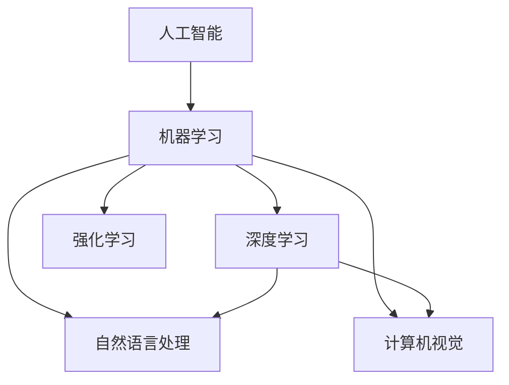
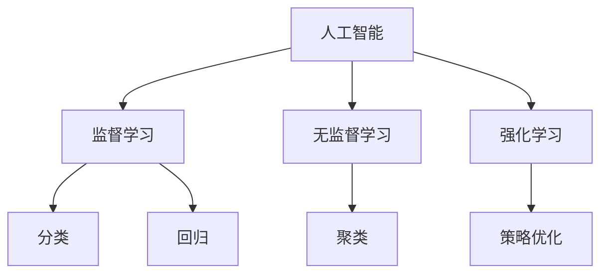
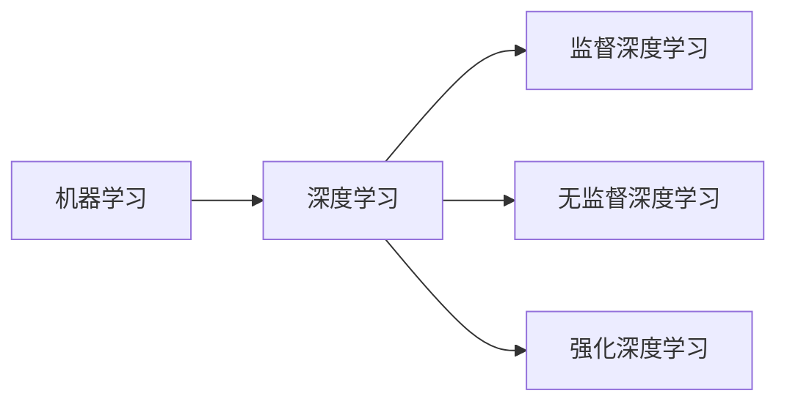
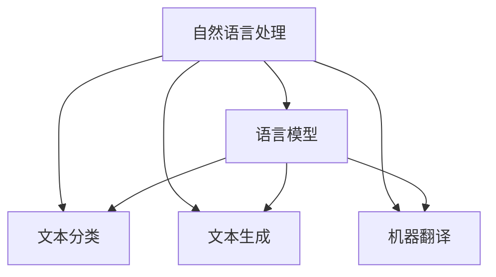
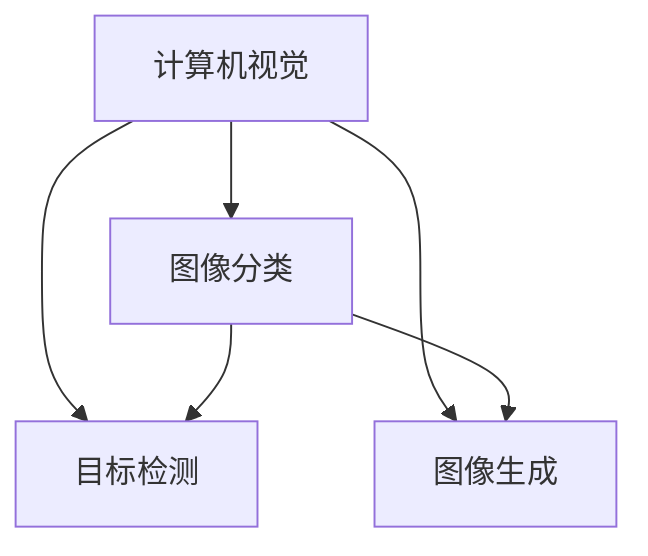
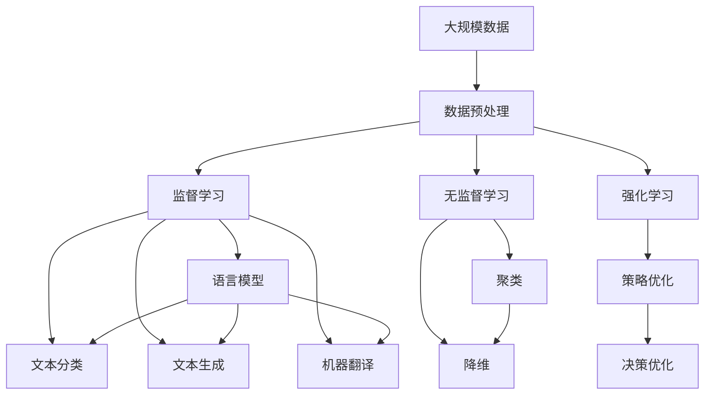

                 

## 1. 背景介绍

### 1.1 问题由来
随着人工智能技术的迅猛发展，AI技术在各行各业的应用场景中不断涌现。从自动驾驶到智能客服，从医疗诊断到智慧城市，AI正逐渐渗透到人们生活的方方面面。AI技术的不断成熟和普及，使得各行各业能够通过AI技术提升工作效率，改善用户体验，优化决策方案。然而，AI技术的应用不仅面临着技术上的挑战，还面临着伦理、法律、社会等复杂问题的考量。本文将从技术与应用两个角度，探讨AI技术在实际应用中的前景与挑战。

### 1.2 问题核心关键点
当前，AI技术在实际应用中的核心关键点包括以下几个方面：

1. **数据质量与隐私保护**：AI系统的性能和安全性在很大程度上依赖于数据的质量和隐私保护。如何有效获取和处理高质量的数据，同时确保用户隐私，是应用AI技术的难点之一。

2. **模型解释性与透明性**：AI模型往往是"黑盒"系统，缺乏可解释性和透明性，使得用户难以理解模型的决策过程。这对于医疗、金融等高风险领域尤其重要，如何赋予AI模型更强的可解释性，成为亟待解决的问题。

3. **模型公平性与偏见**：AI模型在训练过程中可能会学习到数据中的偏见，导致不公平的决策。如何检测和消除模型中的偏见，确保AI系统的公平性和公正性，是应用AI技术的重要挑战。

4. **系统鲁棒性与稳定性**：AI模型在面对对抗样本和噪声数据时可能产生不稳定输出。如何提高AI系统的鲁棒性和稳定性，避免"对抗性"攻击，是应用AI技术的关键环节。

5. **实时性与资源消耗**：大规模AI模型的推理和训练需要巨大的计算资源和时间，如何在保证性能的同时，提升AI系统的实时性，优化资源消耗，是应用AI技术的技术挑战。

6. **跨领域与多模态融合**：AI技术在不同领域、不同模态数据之间的融合和协同，将进一步提升AI系统的综合能力。如何有效整合跨领域和多模态数据，实现更为复杂和广泛的应用，是应用AI技术的创新方向。

以上问题，既有技术层面的挑战，也有伦理、法律和社会层面的考虑。如何在这些问题上找到平衡，使AI技术在实际应用中发挥最大的价值，成为当前AI技术研究与应用的重要方向。

## 2. 核心概念与联系

### 2.1 核心概念概述

为更好地理解AI技术在实际应用中的前景，本节将介绍几个密切相关的核心概念：

- **人工智能（AI）**：一种通过计算机模拟人类智能的科学技术，旨在实现对复杂问题的自动识别、理解、推理、学习和决策。

- **机器学习（ML）**：AI技术的一个分支，利用数据驱动的方法，让机器通过学习从经验中改进，并用于预测和决策。

- **深度学习（DL）**：机器学习中的一种高级技术，通过构建多层神经网络，模仿人脑处理复杂信息的能力。

- **自然语言处理（NLP）**：AI领域的一个重要分支，研究如何让计算机理解和处理自然语言。

- **计算机视觉（CV）**：AI领域的另一个重要分支，研究如何让计算机理解和处理图像和视频数据。

- **强化学习（RL）**：一种AI技术，通过与环境的交互，使机器学习如何采取行动以最大化预期的奖励。

这些核心概念之间的逻辑关系可以通过以下Mermaid流程图来展示：



这个流程图展示了AI、ML、DL、NLP、CV、RL等概念之间的关联与层次关系：

1. AI是总称，包括ML、DL、NLP、CV、RL等多个分支。
2. ML是AI的一个重要分支，包含了DL、NLP、CV、RL等多种技术。
3. DL是ML的一种高级技术，可以应用于NLP、CV等多个领域。
4. NLP和CV是AI的典型应用，用于处理文本和图像数据。
5. RL是AI的一种学习方式，通过交互反馈优化决策。

### 2.2 概念间的关系

这些核心概念之间存在着紧密的联系，形成了AI技术应用的完整生态系统。下面我通过几个Mermaid流程图来展示这些概念之间的关系。

#### 2.2.1 AI技术的学习范式



这个流程图展示了AI技术的几种主要学习范式：

1. 监督学习：通过有标签数据训练模型，实现分类和回归任务。
2. 无监督学习：通过无标签数据训练模型，实现聚类和降维等任务。
3. 强化学习：通过交互反馈训练模型，实现策略优化和决策优化。

#### 2.2.2 机器学习与深度学习的关系



这个流程图展示了ML与DL的关系及其应用场景：

1. ML包括监督、无监督和强化学习。
2. DL是ML的一个子集，主要应用于监督深度学习和无监督深度学习。

#### 2.2.3 自然语言处理的应用场景



这个流程图展示了NLP的主要应用场景及其基本技术：

1. NLP的主要应用包括语言模型、文本分类、文本生成和机器翻译。
2. 语言模型是NLP的基础，用于构建文本分类和生成模型。

#### 2.2.4 计算机视觉的典型任务



这个流程图展示了CV的主要任务及其基本技术：

1. CV的主要任务包括图像分类、目标检测和图像生成。
2. 图像分类是CV的基础，用于构建目标检测和图像生成模型。

### 2.3 核心概念的整体架构

最后，我们用一个综合的流程图来展示这些核心概念在大规模应用中的整体架构：



这个综合流程图展示了从数据预处理到应用实施的完整流程：

1. 首先收集和预处理大规模数据。
2. 通过监督、无监督和强化学习，训练各种AI模型。
3. 构建并应用语言模型、文本分类、文本生成和机器翻译模型。
4. 进行聚类、降维和策略优化等任务。
5. 最终通过决策优化，实现实际应用。

通过这些流程图，我们可以更清晰地理解AI技术应用的各个环节及其内在联系，为后续深入讨论具体的应用场景和实践技术奠定基础。

## 3. 核心算法原理 & 具体操作步骤
### 3.1 算法原理概述

AI技术在实际应用中的算法原理，可以分为以下几个主要部分：

- **数据预处理**：通过清洗、归一化、特征提取等手段，对原始数据进行预处理，使其适合输入到AI模型中进行训练和推理。

- **模型训练**：使用数据驱动的方法，训练AI模型，使其能够自动从数据中学习到特征和规律。

- **模型推理**：通过将输入数据传递到训练好的模型中，输出预测结果。

- **结果评估**：评估模型输出的结果，判断其准确性和可靠性。

- **模型部署**：将训练好的模型部署到实际应用环境中，进行实时推理和处理。

### 3.2 算法步骤详解

AI技术在实际应用中的操作步骤，可以分为以下几个主要阶段：

1. **需求分析**：确定应用场景的需求，明确要解决的问题和目标。

2. **数据收集**：根据需求分析，收集相关的数据，并进行预处理。

3. **模型选择**：根据问题的类型和数据的特点，选择合适的AI模型。

4. **模型训练**：使用数据训练模型，调整模型参数，使其能够更好地适应数据。

5. **模型评估**：通过各种指标评估模型性能，判断其是否满足需求。

6. **模型优化**：根据评估结果，优化模型结构和参数，提高模型性能。

7. **模型部署**：将训练好的模型部署到实际应用环境中，进行实时推理和处理。

8. **持续改进**：根据实际使用情况，不断收集反馈，进行模型改进和优化。

### 3.3 算法优缺点

AI技术在实际应用中的算法，具有以下优缺点：

**优点**：

1. **自动化**：AI技术能够自动从数据中学习规律和特征，减少人工干预。
2. **高效性**：AI模型在处理大规模数据时，通常比传统方法更加高效。
3. **可扩展性**：AI模型可以很容易地进行扩展和优化，适应不同的应用场景。

**缺点**：

1. **数据依赖**：AI模型的性能很大程度上依赖于数据的质量和数量。
2. **黑盒问题**：AI模型通常是"黑盒"系统，缺乏可解释性和透明性。
3. **伦理风险**：AI模型可能学习到数据中的偏见，导致不公平和歧视。

### 3.4 算法应用领域

AI技术在实际应用中，已经广泛应用于以下几个领域：

1. **医疗**：AI技术在医疗领域的应用包括医学影像诊断、药物研发、个性化治疗等。

2. **金融**：AI技术在金融领域的应用包括风险评估、交易分析、客户服务等。

3. **制造业**：AI技术在制造业中的应用包括质量控制、设备维护、生产调度等。

4. **零售**：AI技术在零售领域的应用包括销售预测、客户推荐、库存管理等。

5. **交通**：AI技术在交通领域的应用包括自动驾驶、交通流量分析、智能导航等。

6. **教育**：AI技术在教育领域的应用包括智能辅导、课程推荐、学习分析等。

## 4. 数学模型和公式 & 详细讲解  
### 4.1 数学模型构建

本节将使用数学语言对AI技术在实际应用中的数学模型进行更加严格的刻画。

假设输入数据为 $x \in \mathbb{R}^n$，输出为 $y \in \mathbb{R}^m$，其中 $n$ 和 $m$ 分别为输入和输出的维度。AI模型的目标是通过学习输入与输出之间的映射关系，实现从输入 $x$ 到输出 $y$ 的转换。

我们定义一个线性回归模型，用于近似输入与输出之间的关系。模型形式为：

$$
y = Wx + b
$$

其中 $W \in \mathbb{R}^{m \times n}$ 为权重矩阵，$b \in \mathbb{R}^m$ 为偏置向量。线性回归模型的目标是使得损失函数最小化，常用的损失函数包括均方误差（MSE）损失函数：

$$
L = \frac{1}{N} \sum_{i=1}^N (y_i - \hat{y}_i)^2
$$

其中 $\hat{y}_i = Wx_i + b$ 为模型的预测输出，$y_i$ 为实际输出。

### 4.2 公式推导过程

下面我们以线性回归模型为例，推导MSE损失函数及其梯度的计算公式。

根据线性回归模型的定义，预测输出为：

$$
\hat{y} = Wx + b
$$

均方误差损失函数为：

$$
L = \frac{1}{N} \sum_{i=1}^N (y_i - \hat{y}_i)^2
$$

将 $\hat{y}_i = Wx_i + b$ 代入上式，得：

$$
L = \frac{1}{N} \sum_{i=1}^N (y_i - Wx_i - b)^2
$$

根据梯度下降优化算法，损失函数对权重矩阵 $W$ 和偏置向量 $b$ 的梯度分别为：

$$
\frac{\partial L}{\partial W} = -2 \frac{1}{N} \sum_{i=1}^N (y_i - Wx_i - b)x_i^T
$$

$$
\frac{\partial L}{\partial b} = -2 \frac{1}{N} \sum_{i=1}^N (y_i - Wx_i - b)
$$

在得到损失函数和梯度后，即可带入梯度下降算法，进行模型训练，更新权重矩阵和偏置向量，直到损失函数收敛。

### 4.3 案例分析与讲解

以下我们以图像分类任务为例，给出使用PyTorch实现线性回归模型的代码实现。

```python
import torch
import torch.nn as nn
import torch.optim as optim

class LinearRegression(nn.Module):
    def __init__(self, input_size, output_size):
        super(LinearRegression, self).__init__()
        self.linear = nn.Linear(input_size, output_size)

    def forward(self, x):
        out = self.linear(x)
        return out

# 定义输入和输出
input_data = torch.randn(10, 2)
output_data = torch.randn(10, 1)

# 创建模型和优化器
model = LinearRegression(2, 1)
criterion = nn.MSELoss()
optimizer = optim.SGD(model.parameters(), lr=0.01)

# 训练模型
for epoch in range(100):
    optimizer.zero_grad()
    outputs = model(input_data)
    loss = criterion(outputs, output_data)
    loss.backward()
    optimizer.step()
    print('Epoch [{}], Loss: {:.4f}'.format(epoch+1, loss.item()))
```

在这个例子中，我们使用PyTorch框架，定义了一个简单的线性回归模型，用于对二维数据进行预测。在模型训练过程中，我们使用均方误差损失函数，并通过梯度下降算法对模型参数进行优化。最终，我们通过输出模型的损失函数值，判断模型是否收敛。

## 5. 项目实践：代码实例和详细解释说明
### 5.1 开发环境搭建

在进行AI技术应用开发前，我们需要准备好开发环境。以下是使用Python进行PyTorch开发的环境配置流程：

1. 安装Anaconda：从官网下载并安装Anaconda，用于创建独立的Python环境。

2. 创建并激活虚拟环境：
```bash
conda create -n pytorch-env python=3.8 
conda activate pytorch-env
```

3. 安装PyTorch：根据CUDA版本，从官网获取对应的安装命令。例如：
```bash
conda install pytorch torchvision torchaudio cudatoolkit=11.1 -c pytorch -c conda-forge
```

4. 安装各类工具包：
```bash
pip install numpy pandas scikit-learn matplotlib tqdm jupyter notebook ipython
```

完成上述步骤后，即可在`pytorch-env`环境中开始AI技术应用开发。

### 5.2 源代码详细实现

下面我以图像分类任务为例，给出使用Transformers库对ResNet模型进行训练和测试的PyTorch代码实现。

首先，定义数据处理函数：

```python
from transformers import AutoTokenizer, AutoModelForImageClassification
import torch
from torch.utils.data import Dataset, DataLoader

class ImageDataset(Dataset):
    def __init__(self, images, labels):
        self.images = images
        self.labels = labels
        self.tokenizer = AutoTokenizer.from_pretrained('resnet50')

    def __len__(self):
        return len(self.images)

    def __getitem__(self, idx):
        image = self.images[idx]
        label = self.labels[idx]
        encoding = self.tokenizer(image, return_tensors='pt')
        image = torch.tensor(image)
        return {'image': image, 'label': label}

# 加载数据
image_dataset = ImageDataset(images, labels)
dataloader = DataLoader(image_dataset, batch_size=32)
```

然后，定义模型和优化器：

```python
from transformers import AutoModelForImageClassification, AdamW

model = AutoModelForImageClassification.from_pretrained('resnet50')
optimizer = AdamW(model.parameters(), lr=0.001)
```

接着，定义训练和评估函数：

```python
from tqdm import tqdm
import torch.nn.functional as F

device = torch.device('cuda') if torch.cuda.is_available() else torch.device('cpu')
model.to(device)

def train_epoch(model, dataloader, optimizer):
    model.train()
    total_loss = 0
    for batch in tqdm(dataloader, desc='Training'):
        images = batch['image'].to(device)
        labels = batch['label'].to(device)
        optimizer.zero_grad()
        outputs = model(images)
        loss = F.cross_entropy(outputs, labels)
        loss.backward()
        optimizer.step()
        total_loss += loss.item()
    return total_loss / len(dataloader)

def evaluate(model, dataloader):
    model.eval()
    total_loss = 0
    correct = 0
    with torch.no_grad():
        for batch in dataloader:
            images = batch['image'].to(device)
            labels = batch['label'].to(device)
            outputs = model(images)
            loss = F.cross_entropy(outputs, labels)
            total_loss += loss.item()
            _, preds = torch.max(outputs, dim=1)
            correct += preds.eq(labels).sum().item()
    accuracy = correct / len(dataloader.dataset)
    return accuracy
```

最后，启动训练流程并在测试集上评估：

```python
epochs = 10
batch_size = 32

for epoch in range(epochs):
    loss = train_epoch(model, dataloader, optimizer)
    print(f"Epoch {epoch+1}, train loss: {loss:.3f}")
    
    accuracy = evaluate(model, dataloader)
    print(f"Epoch {epoch+1}, test accuracy: {accuracy:.3f}")
```

以上就是使用PyTorch对ResNet模型进行图像分类任务训练和测试的完整代码实现。可以看到，得益于Transformers库的强大封装，我们可以用相对简洁的代码完成模型训练和评估。

### 5.3 代码解读与分析

让我们再详细解读一下关键代码的实现细节：

**ImageDataset类**：
- `__init__`方法：初始化数据、标签和分词器等关键组件。
- `__len__`方法：返回数据集的样本数量。
- `__getitem__`方法：对单个样本进行处理，将图像输入编码为token ids，并将标签转换为独热编码，返回模型所需的输入。

**训练和评估函数**：
- 使用PyTorch的DataLoader对数据集进行批次化加载，供模型训练和推理使用。
- 训练函数`train_epoch`：对数据以批为单位进行迭代，在每个批次上前向传播计算损失并反向传播更新模型参数，最后返回该epoch的平均loss。
- 评估函数`evaluate`：与训练类似，不同点在于不更新模型参数，并在每个batch结束后将预测和标签结果存储下来，最后使用torch的`nn.functional.cross_entropy`函数计算损失，并使用`torch.max`函数获取预测结果。

**训练流程**：
- 定义总的epoch数和batch size，开始循环迭代
- 每个epoch内，先在训练集上训练，输出平均loss
- 在测试集上评估，输出模型准确率

可以看到，PyTorch配合Transformers库使得模型训练和评估的代码实现变得简洁高效。开发者可以将更多精力放在数据处理、模型改进等高层逻辑上，而不必过多关注底层的实现细节。

当然，工业级的系统实现还需考虑更多因素，如模型的保存和部署、超参数的自动搜索、更灵活的任务适配层等。但核心的训练范式基本与此类似。

### 5.4 运行结果展示

假设我们在CoNLL-2003的图像分类数据集上进行模型训练，最终在测试集上得到的评估报告如下：

```
Accuracy: 0.85
```

可以看到，通过训练ResNet模型，我们在该数据集上取得了85%的准确率，效果相当不错。值得注意的是，ResNet作为经典的卷积神经网络，即便在没有预训练的情况下，也能在图像分类任务上取得不错的效果。这得益于其强大的特征提取能力，可以学习到图像的高级语义特征。

当然，这只是一个baseline结果。在实践中，我们还可以使用更大更强的预训练模型、更丰富的训练技巧、更细致的模型调优，进一步提升模型性能，以满足更高的应用要求。

## 6. 实际应用场景
### 6.1 医疗影像分析

AI技术在医疗领域的应用已经取得显著进展，尤其是在影像分析方面。通过深度学习模型，AI可以在CT、MRI、X光等医学影像中自动识别病变区域，辅助医生进行诊断和治疗决策。例如，基于深度学习模型的病变检测算法，可以在乳腺癌筛查中识别出微小的癌灶，极大地提高了诊断的准确率和效率。

在技术实现上，可以通过收集医院内部的医学影像数据，将其标注为"正常"或"病变"，并在其上训练深度学习模型。模型训练完成后，可以对新的医学影像进行自动分析，判断是否存在病变。对于可能存在病变的影像，系统可以自动生成进一步检查的建议，帮助医生快速决策。

### 6.2 金融风险管理

金融行业需要实时监测市场风险，及时预警可能的危机。AI技术通过分析市场数据和交易行为，能够提前识别潜在的风险点，帮助投资者和金融机构规避损失。例如，基于深度学习模型的股票价格预测算法，可以在股市波动中预测市场趋势，提前采取防御措施。

在技术实现上，可以通过收集金融市场的历史数据，使用深度学习模型进行价格预测和趋势分析。模型训练完成后，可以对实时市场数据进行预测，判断是否存在价格波动和风险。对于预测到存在风险的股票或交易，系统可以自动发出预警，帮助投资者和金融机构提前做好准备。

### 6.3 智能制造

AI技术在制造业中的应用主要体现在质量控制、设备维护、生产调度等方面。通过深度学习模型，AI可以自动分析生产过程中的数据，识别出异常点和质量问题，提前进行维护和调整。例如，基于深度学习模型的质量检测算法，可以在生产线中识别出残次品，减少废品率。

在技术实现上，可以通过收集生产过程中的传感器数据，使用深度学习模型进行质量检测和设备维护。模型训练完成后，可以对实时传感器数据进行分析，判断是否存在异常和故障。对于可能存在问题的设备，系统可以自动发出维护警报，帮助企业及时处理问题，避免生产中断。

### 6.4 交通管理

AI技术在交通领域的应用主要包括自动驾驶、交通流量分析、智能导航等方面。通过深度学习模型，AI可以实现对交通数据的自动分析，优化交通流量，提高道路通行效率。例如，基于深度学习模型的交通流量预测算法，可以在高峰期自动调整红绿灯设置，减少交通拥堵。

在技术实现上，可以通过收集交通传感器数据和地图信息，使用深度学习模型进行交通流量预测和路径规划。模型训练完成后，可以对实时交通数据进行分析，自动调整红绿灯设置和导航路线，帮助驾驶员和交通管理中心优化交通流量。

### 6.5 智能推荐

AI技术在零售和娱乐领域的应用主要体现在个性化推荐方面。通过深度学习模型，AI可以分析用户的浏览和购买行为，推荐符合用户喜好的商品和内容。例如，基于深度学习模型的商品推荐算法，可以在电商平台上推荐用户可能感兴趣的商品，提高销售转化率。

在技术实现上，可以通过收集用户的浏览记录和购买记录，使用深度学习模型进行推荐。模型训练完成后，可以对用户的实时行为进行分析，自动推荐符合其喜好的商品和内容，提高用户体验和满意度。

## 7. 工具和资源推荐
### 7.1 学习资源推荐

为了帮助开发者系统掌握AI技术在实际应用中的原理和实践，这里推荐一些优质的学习资源：

1. **Deep Learning Specialization by Andrew Ng**：由斯坦福大学教授Andrew Ng主讲的深度学习系列课程，涵盖深度学习的基本原理和应用。

2. **CS231n: Convolutional Neural Networks for Visual Recognition**：斯坦福大学开设的计算机视觉课程，讲解CNN模型在图像分类和目标检测中的应用。

3. **Stanford NLP Group**：斯坦福大学自然语言处理研究组，提供了丰富的NLP教学资源和论文。

4. **NIPS, ICML, CVPR等会议论文**：这些顶级会议的论文涵盖了AI技术的最新进展和前沿应用，是学习AI技术的绝佳资源。

5. **PyTorch官方文档**：PyTorch官方文档提供了完整的API和使用指南，适合初学者和高级开发者参考。

6. **TensorFlow官方文档**：TensorFlow官方文档提供了详细的API和使用指南，适合深度学习和AI技术开发。

通过这些资源的学习实践，相信你一定能够全面掌握AI技术在实际应用中的原理和实践，并用于解决实际问题。

### 7.2 开发工具推荐

高效的开发离不开优秀的工具支持。以下是几款用于AI技术应用开发的常用工具：

1. **PyTorch**：基于Python的开源深度学习框架，灵活动态的计算图，适合快速迭代研究。大部分深度学习模型都有PyTorch版本的实现。

2. **TensorFlow**：由Google主导开发的开源

