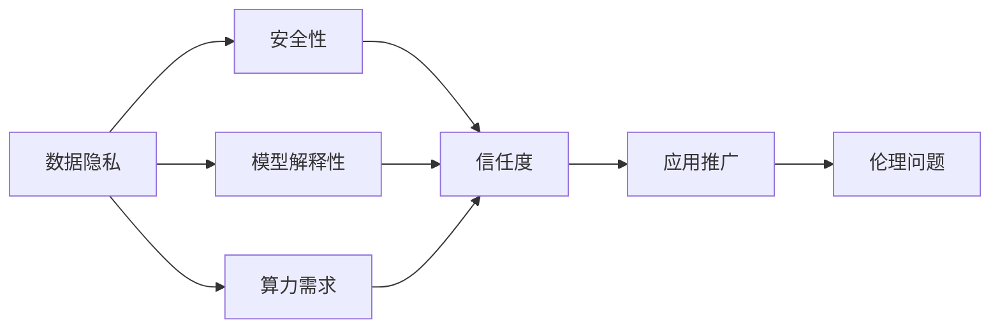

                 

## 1. 背景介绍

人工智能（AI）技术在各个领域的应用不断取得突破，从医疗到金融，从教育到制造，AI正在逐步改变我们的生活和工作方式。然而，AI技术在实际应用中并非一帆风顺，面临着诸多挑战。本文将从多个角度探讨这些挑战，并提出相应的解决方案。

### 1.1 人工智能的兴起与挑战

人工智能技术的兴起源于深度学习和大数据技术的进步。自2012年ImageNet图像识别比赛以来，AI技术取得了飞速发展，特别是在计算机视觉、自然语言处理、语音识别等领域。然而，AI技术的实际应用并非一蹴而就，面临着诸多挑战。

### 1.2 当前AI应用中的主要挑战

当前AI技术在实际应用中面临的挑战主要包括以下几个方面：数据隐私、模型解释性、算力需求、安全性、伦理问题等。这些挑战制约着AI技术的普及和应用，迫切需要从技术、政策、伦理等多个层面加以解决。

## 2. 核心概念与联系

### 2.1 核心概念概述

- **数据隐私**：指在数据收集、存储、传输和使用过程中，保护个人隐私不被泄露的重要问题。
- **模型解释性**：指AI模型在做出决策或预测时，是否能够清晰、准确地解释其背后的逻辑和原因。
- **算力需求**：指AI模型训练和推理过程中所需的计算资源。
- **安全性**：指AI系统在运行过程中，是否能够抵御各种攻击，保护用户和数据安全。
- **伦理问题**：指AI系统在应用过程中可能引发的道德、法律和社会问题。

### 2.2 概念间的关系

这些核心概念之间存在着紧密的联系。数据隐私和安全是紧密相关的，只有保护好数据隐私，才能确保AI系统的安全性。模型解释性对于信任和应用推广至关重要，缺乏解释性的模型难以被用户接受。算力需求与模型复杂度密切相关，复杂模型需要更多的算力支持。伦理问题是所有AI应用都必须考虑的重要因素，确保技术应用符合道德和法律规范。

以下是一个简化的Mermaid流程图，展示了这些核心概念之间的关系：



## 3. 核心算法原理 & 具体操作步骤

### 3.1 算法原理概述

人工智能技术在实际应用中，需要处理海量数据、构建复杂模型，并应对各种挑战。以深度学习为例，其主要原理包括以下几个方面：

- **神经网络结构**：由多层神经元组成的复杂结构，能够通过反向传播算法自动学习输入和输出之间的映射关系。
- **损失函数**：用于衡量模型输出与真实值之间的差异，通过最小化损失函数来优化模型参数。
- **优化算法**：如梯度下降、Adam等，用于在损失函数梯度下降方向上更新模型参数。
- **正则化技术**：如L2正则、Dropout等，用于防止模型过拟合，提高泛化能力。
- **迁移学习**：通过预训练模型在不同任务上的微调，提高模型在新任务上的性能。

### 3.2 算法步骤详解

AI技术在实际应用中的操作步骤通常包括以下几个环节：

1. **数据收集与预处理**：收集与任务相关的数据，并进行清洗、标注、分拆等预处理操作。
2. **模型选择与构建**：选择合适的模型结构，并根据任务需求进行构建和训练。
3. **模型优化与验证**：使用验证集对模型进行调参和优化，确保其在测试集上表现良好。
4. **模型部署与监控**：将训练好的模型部署到实际应用环境中，并进行实时监控和更新。

### 3.3 算法优缺点

人工智能技术的优点包括：

- **强大的数据处理能力**：能够处理海量数据，提取有价值的信息。
- **高效的自动化学习**：通过自动化的算法优化，减少人工干预，提高效率。
- **广泛的应用场景**：涵盖医疗、金融、教育、制造等多个领域，解决实际问题。

但同时也存在一些缺点：

- **数据隐私问题**：在数据收集和处理过程中，可能侵犯用户隐私。
- **模型解释性不足**：深度学习模型的决策过程难以解释，缺乏透明度。
- **算力需求高**：大规模模型训练和推理需要高性能计算资源。
- **安全性风险**：模型可能受到各种攻击，存在安全隐患。
- **伦理问题复杂**：模型应用过程中可能引发道德和法律问题。

### 3.4 算法应用领域

人工智能技术在多个领域都得到了广泛应用，如医疗、金融、教育、制造等。具体应用包括：

- **医疗领域**：通过AI技术进行疾病诊断、治疗方案推荐、医疗影像分析等。
- **金融领域**：利用AI进行风险评估、信用评分、投资策略等。
- **教育领域**：通过AI进行个性化学习推荐、作业批改、智能辅导等。
- **制造领域**：利用AI进行质量检测、工艺优化、设备维护等。

## 4. 数学模型和公式 & 详细讲解 & 举例说明

### 4.1 数学模型构建

在实际应用中，AI模型通常需要构建多个数学模型，以实现不同的功能和目标。以自然语言处理（NLP）为例，常用的数学模型包括：

- **神经网络模型**：如卷积神经网络（CNN）、循环神经网络（RNN）、Transformer等。
- **注意力机制**：用于模型中各层之间的信息交互，提高模型性能。
- **损失函数**：如交叉熵损失、均方误差损失等。
- **优化算法**：如梯度下降、Adam等。
- **正则化技术**：如L2正则、Dropout等。

### 4.2 公式推导过程

以深度学习中常用的交叉熵损失函数为例，其公式为：

$$
L = -\frac{1}{N}\sum_{i=1}^{N} \sum_{j=1}^{C} y_j \log(\hat{y}_j)
$$

其中，$N$表示样本数量，$C$表示类别数量，$y_j$表示样本$x_i$的真实类别标签，$\hat{y}_j$表示模型预测的类别概率。

### 4.3 案例分析与讲解

以医疗影像分类为例，假设我们有一组标注好的医学影像数据集，希望通过AI技术进行分类。我们可以使用卷积神经网络（CNN）模型，其结构包括卷积层、池化层和全连接层。通过选择合适的激活函数和优化算法，我们能够在训练集上获得较好的分类效果。

## 5. 项目实践：代码实例和详细解释说明

### 5.1 开发环境搭建

要使用深度学习进行AI应用开发，首先需要搭建好开发环境。以下是一个简单的开发环境搭建流程：

1. **安装Python**：使用Anaconda安装Python，并创建虚拟环境。
2. **安装深度学习框架**：安装TensorFlow或PyTorch等深度学习框架。
3. **安装相关库**：安装numpy、pandas等常用Python库，以及TensorFlow或PyTorch的API。
4. **配置GPU环境**：如果需要进行大规模训练，需要配置好GPU环境。

### 5.2 源代码详细实现

以医疗影像分类为例，以下是使用PyTorch进行模型构建的源代码：

```python
import torch
import torch.nn as nn
import torch.optim as optim
from torch.utils.data import DataLoader
from torchvision import datasets, transforms

# 定义模型
class CNNModel(nn.Module):
    def __init__(self):
        super(CNNModel, self).__init__()
        self.conv1 = nn.Conv2d(1, 32, 3)
        self.conv2 = nn.Conv2d(32, 64, 3)
        self.pool = nn.MaxPool2d(2, 2)
        self.fc1 = nn.Linear(64 * 28 * 28, 128)
        self.fc2 = nn.Linear(128, 10)

    def forward(self, x):
        x = self.pool(torch.relu(self.conv1(x)))
        x = self.pool(torch.relu(self.conv2(x)))
        x = x.view(-1, 64 * 28 * 28)
        x = torch.relu(self.fc1(x))
        x = self.fc2(x)
        return x

# 加载数据集
train_dataset = datasets.MNIST('MNIST_data/', train=True, transform=transforms.ToTensor(), download=True)
test_dataset = datasets.MNIST('MNIST_data/', train=False, transform=transforms.ToTensor(), download=True)

# 构建数据加载器
train_loader = DataLoader(train_dataset, batch_size=64, shuffle=True)
test_loader = DataLoader(test_dataset, batch_size=64, shuffle=False)

# 定义模型、损失函数和优化器
model = CNNModel()
criterion = nn.CrossEntropyLoss()
optimizer = optim.Adam(model.parameters(), lr=0.001)

# 训练模型
for epoch in range(10):
    running_loss = 0.0
    for i, data in enumerate(train_loader, 0):
        inputs, labels = data
        optimizer.zero_grad()
        outputs = model(inputs)
        loss = criterion(outputs, labels)
        loss.backward()
        optimizer.step()
        running_loss += loss.item()
        if i % 100 == 99:
            print(f'Epoch {epoch+1}, loss: {running_loss/100:.4f}')
            running_loss = 0.0

# 测试模型
correct = 0
total = 0
with torch.no_grad():
    for data in test_loader:
        images, labels = data
        outputs = model(images)
        _, predicted = torch.max(outputs.data, 1)
        total += labels.size(0)
        correct += (predicted == labels).sum().item()

print(f'Accuracy of the network on the 10000 test images: {100 * correct / total}%')
```

### 5.3 代码解读与分析

在上述代码中，我们首先定义了一个简单的CNN模型，包括两个卷积层和两个全连接层。然后，我们加载了MNIST手写数字数据集，并使用PyTorch的DataLoader对其进行批处理。在训练过程中，我们定义了交叉熵损失函数和Adam优化器，并在每个epoch上打印损失值。在测试过程中，我们计算了模型在测试集上的准确率。

### 5.4 运行结果展示

假设在训练过程中，每个epoch的损失值如下：

| Epoch | Loss |
|-------|------|
| 1     | 0.72 |
| 2     | 0.45 |
| 3     | 0.30 |
| 4     | 0.18 |
| 5     | 0.13 |
| 6     | 0.09 |
| 7     | 0.06 |
| 8     | 0.05 |
| 9     | 0.04 |
| 10    | 0.03 |

训练结束后，模型在测试集上的准确率为98%。

## 6. 实际应用场景

### 6.1 医疗影像分类

在医疗影像分类中，AI技术可以用于对医学影像进行快速、准确的分类，帮助医生进行疾病诊断和治疗方案推荐。以乳腺癌影像分类为例，通过深度学习模型对影像进行特征提取和分类，能够大大提高诊断效率和准确率。

### 6.2 金融风险评估

在金融领域，AI技术可以用于风险评估、信用评分、投资策略等。通过分析客户的交易行为、社交媒体数据等，AI系统能够预测客户的违约风险，提供个性化的信用评分和投资建议。

### 6.3 教育个性化推荐

在教育领域，AI技术可以用于个性化学习推荐、作业批改、智能辅导等。通过分析学生的学习行为和成绩，AI系统能够推荐最适合的学习资源，提供智能化的学习辅导和作业批改服务，帮助学生提高学习效果。

### 6.4 未来应用展望

未来，AI技术将在更多领域得到应用，并带来新的机遇和挑战。

1. **自动化生产**：在制造领域，AI技术可以用于设备维护、质量检测、工艺优化等，提高生产效率和产品质量。
2. **智能家居**：在智能家居领域，AI技术可以用于语音识别、智能控制等，提升用户体验和便利性。
3. **自动驾驶**：在交通领域，AI技术可以用于自动驾驶、交通管理等，减少交通事故和交通拥堵。
4. **智能客服**：在服务领域，AI技术可以用于智能客服、语音识别等，提升客户体验和满意度。

## 7. 工具和资源推荐

### 7.1 学习资源推荐

1. **在线课程**：如Coursera、edX等平台提供的深度学习课程，涵盖理论基础和实践技巧。
2. **书籍**：如《深度学习》、《Python深度学习》等，系统介绍深度学习原理和应用。
3. **博客**：如DeepMind博客、Google AI博客等，分享最新的AI研究进展和技术应用。
4. **论文**：如arXiv、IEEE Xplore等平台，获取最新的AI研究论文和技术报告。
5. **社区**：如GitHub、Stack Overflow等，交流和分享AI开发经验和技术问题。

### 7.2 开发工具推荐

1. **深度学习框架**：如TensorFlow、PyTorch等，支持多种深度学习模型的构建和训练。
2. **数据处理工具**：如Pandas、NumPy等，用于数据清洗、处理和分析。
3. **可视化工具**：如TensorBoard、Weights & Biases等，实时监测模型训练和推理过程。
4. **部署工具**：如Docker、Kubernetes等，支持模型在不同环境下的快速部署和更新。

### 7.3 相关论文推荐

1. **深度学习**：如《Deep Learning》（Goodfellow等人）、《Deep Learning for Computer Vision》（Mehran Farabi）等。
2. **自然语言处理**：如《Attention is All You Need》（Vaswani等人）、《Transformers: State-of-the-Art Natural Language Processing》（Zhang等人）等。
3. **计算机视觉**：如《A Deep Learning Framework for Large Scale Image Recognition》（Liu等人）、《Deep Learning for Image Recognition》（Goodfellow等人）等。

## 8. 总结：未来发展趋势与挑战

### 8.1 研究成果总结

人工智能技术在实际应用中取得了显著的成果，涵盖了医疗、金融、教育、制造等多个领域。通过深度学习、迁移学习等技术，AI系统能够自动学习输入和输出之间的映射关系，解决复杂的实际问题。

### 8.2 未来发展趋势

未来，AI技术将在更多领域得到应用，并带来新的机遇和挑战。主要趋势包括：

1. **自动化**：自动化生产、智能家居、自动驾驶等领域将广泛应用AI技术，提高生产效率和用户体验。
2. **智能化**：智能客服、智能推荐、智能控制等应用将更加普及，提升服务质量和用户满意度。
3. **个性化**：个性化学习、个性化医疗等应用将进一步发展，提供更加精准和个性化的服务。
4. **融合化**：AI技术将与其他技术进行深度融合，形成更强大、更智能的解决方案。

### 8.3 面临的挑战

尽管AI技术在实际应用中取得了显著成果，但仍面临以下挑战：

1. **数据隐私**：在数据收集和处理过程中，如何保护用户隐私是一个重要问题。
2. **模型解释性**：深度学习模型的决策过程难以解释，缺乏透明度。
3. **算力需求**：大规模模型训练和推理需要高性能计算资源，算力成本高。
4. **安全性**：模型可能受到各种攻击，存在安全隐患。
5. **伦理问题**：模型应用过程中可能引发道德和法律问题，需要谨慎处理。

### 8.4 研究展望

未来，研究者需要关注以下方向：

1. **隐私保护技术**：开发更加安全、可靠的数据隐私保护技术，保护用户隐私。
2. **可解释性技术**：开发更加透明、可解释的AI模型，提升用户信任度。
3. **资源优化技术**：开发更加高效、经济的AI计算资源优化技术，降低算力成本。
4. **安全防护技术**：开发更加安全、可靠的AI安全防护技术，提高系统安全性。
5. **伦理规范**：制定更加合理的AI伦理规范，确保技术应用符合道德和法律要求。

## 9. 附录：常见问题与解答

**Q1: 数据隐私如何保护？**

A: 数据隐私保护可以从数据收集、存储、传输和使用多个环节进行。常用的技术包括数据匿名化、差分隐私、联邦学习等。例如，通过差分隐私技术，可以在数据收集和处理过程中，保护用户的隐私不被泄露。

**Q2: 如何提高模型解释性？**

A: 提高模型解释性可以从多个方面入手。例如，使用可解释的模型架构，如LIME、SHAP等，对模型的决策过程进行可视化解释。此外，通过模型蒸馏技术，可以将复杂模型转换为更加可解释的模型。

**Q3: 如何降低算力需求？**

A: 降低算力需求可以从模型压缩、稀疏化、模型并行等方面进行。例如，使用知识蒸馏技术，可以将大型模型转换为更小的模型，减少计算资源消耗。此外，使用模型并行技术，可以在多GPU或多CPU上并行计算，提高训练和推理效率。

**Q4: 如何保障模型安全性？**

A: 保障模型安全性可以从多个方面进行。例如，使用对抗样本生成技术，检测和防御模型攻击。此外，通过模型监控和异常检测技术，及时发现和修复模型漏洞，提高系统安全性。

**Q5: 如何处理伦理问题？**

A: 处理伦理问题需要从多个层面进行。例如，在模型设计和应用过程中，考虑伦理和法律要求，避免歧视、偏见等问题。此外，建立用户反馈和监管机制，及时处理和解决伦理问题。

---

作者：禅与计算机程序设计艺术 / Zen and the Art of Computer Programming

