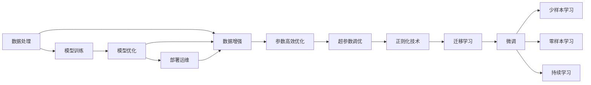
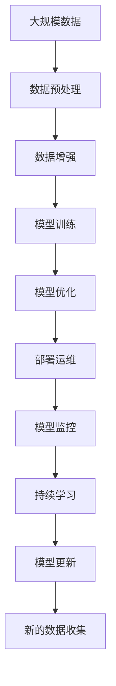

                 

# AI数字实体自动化的潜力

## 1. 背景介绍

随着人工智能技术的迅猛发展，数字实体在各行各业的应用日益广泛。数字实体通常指数字化的抽象事物，如自然语言模型、图像识别模型、推荐系统等，它们能够自动化地处理数据、提供服务和生成内容，极大地提升了生产效率和生活便利性。然而，数字实体的自动化也面临着诸多挑战，如数据处理、模型训练、部署运维等环节的复杂性和资源消耗问题。本文章将探讨数字实体自动化的潜力，从原理、技术、应用等方面全面分析其实现路径和未来前景。

## 2. 核心概念与联系

### 2.1 核心概念概述

数字实体的自动化，是指利用人工智能技术，将复杂的任务自动完成，减少人工干预，提升效率和质量。其中，数据处理、模型训练、模型优化、部署运维等环节都涉及自动化技术的应用。

- **数据处理**：数据收集、清洗、转换、存储等步骤都需要自动化工具的支持，如ETL工具、数据湖等。
- **模型训练**：模型参数的初始化、训练过程的自动化，如自动化超参数调优、模型集成、正则化技术等。
- **模型优化**：模型在实际应用中的优化，如迁移学习、微调、参数高效优化等。
- **部署运维**：模型在生产环境中的部署、监控、更新等，如CI/CD管道、自动化测试、模型监控工具等。

这些核心概念之间的逻辑关系可以通过以下Mermaid流程图来展示：



这个流程图展示了从数据处理到部署运维的完整流程，每个环节都可以通过自动化技术进一步优化和提高效率。

### 2.2 概念间的关系

这些核心概念之间存在着紧密的联系，形成了数字实体自动化的完整生态系统。

- **数据处理与模型训练**：数据处理是模型训练的基础，数据的质量和多样性直接影响模型的性能。
- **模型训练与模型优化**：训练出高质量的模型后，还需要通过优化手段进一步提升性能，如迁移学习、微调、少样本学习等。
- **部署运维与模型优化**：模型在生产环境中的表现也需要持续监控和优化，以保证其长期稳定性和性能。
- **超参数调优、正则化技术、参数高效优化**：这些技术都是模型训练中的关键环节，可以显著提升模型的训练效果和泛化能力。

这些概念共同构成了数字实体自动化的核心框架，使得数字实体能够在各个环节实现自动化的处理和优化。

### 2.3 核心概念的整体架构

最后，我们用一个综合的流程图来展示这些核心概念在大数字实体自动化中的整体架构：



这个综合流程图展示了从数据预处理到持续学习的完整流程，展示了数字实体自动化的全过程。

## 3. 核心算法原理 & 具体操作步骤

### 3.1 算法原理概述

数字实体自动化的核心算法原理主要包括自动化超参数调优、参数高效优化、迁移学习、微调和少样本学习等。这些算法的原理和应用场景如下：

- **自动化超参数调优**：通过自动化技术寻找最优的模型超参数，提高模型训练效率和性能。
- **参数高效优化**：在固定大部分预训练参数的情况下，只更新少量的任务相关参数，减少计算资源消耗。
- **迁移学习**：将预训练模型的知识迁移到新任务中，提升模型在特定任务上的性能。
- **微调**：在预训练模型的基础上，通过有监督学习优化模型在特定任务上的性能。
- **少样本学习**：在仅有少量标注样本的情况下，模型能够快速适应新任务，实现零样本或少样本学习。

### 3.2 算法步骤详解

#### 3.2.1 自动化超参数调优

自动化超参数调优的流程如下：

1. **选择优化方法**：常用的超参数调优方法包括网格搜索、随机搜索、贝叶斯优化等。
2. **定义搜索空间**：根据模型特点，定义超参数的搜索范围。
3. **选择评价指标**：根据任务需求，选择适当的评价指标，如准确率、召回率、F1分数等。
4. **执行调优**：通过超参数调优算法搜索最优的超参数组合。
5. **评估模型性能**：在验证集或测试集上评估模型的性能。

#### 3.2.2 参数高效优化

参数高效优化的流程如下：

1. **选择优化方法**：常用的方法包括适配器微调、LoRA、BitFit等。
2. **选择冻结层**：根据任务需求，选择冻结的预训练层。
3. **更新任务层**：更新顶层或部分层，保留底层权重不变。
4. **训练模型**：在标注数据集上训练更新后的模型。
5. **评估模型性能**：在测试集上评估模型的性能。

#### 3.2.3 迁移学习

迁移学习的流程如下：

1. **选择源任务和目标任务**：根据目标任务的特征，选择具有相似知识体系的源任务。
2. **选择预训练模型**：选择适合的预训练模型，如BERT、GPT等。
3. **微调模型**：在目标任务的标注数据集上微调预训练模型。
4. **评估模型性能**：在目标任务的测试集上评估模型的性能。

#### 3.2.4 微调

微调的流程如下：

1. **选择任务适配层**：根据任务类型，设计合适的输出层和损失函数。
2. **设置微调超参数**：选择合适的优化算法及其参数，设置学习率、批大小、迭代轮数等。
3. **执行梯度训练**：将训练集数据分批次输入模型，前向传播计算损失函数。
4. **反向传播更新参数**：计算参数梯度，更新模型参数。
5. **评估模型性能**：在验证集和测试集上评估模型的性能。

#### 3.2.5 少样本学习

少样本学习的流程如下：

1. **选择任务适配层**：根据任务类型，设计合适的输出层和损失函数。
2. **选择提示模板**：设计合适的提示模板，引导模型输出。
3. **训练模型**：在少样本数据集上训练模型。
4. **评估模型性能**：在测试集上评估模型的性能。

### 3.3 算法优缺点

#### 3.3.1 自动化超参数调优

优点：
- 能够自动化地搜索最优超参数组合，减少人工干预。
- 提升模型训练效率和性能，降低调优成本。

缺点：
- 对数据分布和任务复杂性要求高，可能导致过拟合。
- 调优过程可能耗时较长，计算资源消耗较大。

#### 3.3.2 参数高效优化

优点：
- 只更新少量任务相关参数，减少计算资源消耗。
- 在固定预训练参数的情况下，保持模型性能和泛化能力。

缺点：
- 对任务类型的适应性有一定限制，可能不适用于所有任务。
- 模型更新过程可能难以完全保留预训练知识。

#### 3.3.3 迁移学习

优点：
- 利用预训练模型的知识，减少标注数据需求。
- 提升模型在特定任务上的性能，加快模型训练速度。

缺点：
- 预训练模型与目标任务的适应性可能有限，泛化能力不足。
- 可能出现迁移困难，导致性能下降。

#### 3.3.4 微调

优点：
- 能够适应特定任务，提升模型性能。
- 对标注数据的需求相对较低，适应性强。

缺点：
- 可能对标注数据的质量和数量要求较高，难以处理长尾任务。
- 可能出现过拟合问题，泛化能力不足。

#### 3.3.5 少样本学习

优点：
- 能够在少量标注数据的情况下，快速适应新任务。
- 提升模型在特定任务上的泛化能力，降低标注数据需求。

缺点：
- 对提示模板的设计要求较高，可能难以设计合适的模板。
- 性能可能受模板设计的影响，需要反复调整和优化。

### 3.4 算法应用领域

数字实体自动化的算法在多个领域都有广泛的应用，如NLP、计算机视觉、推荐系统等。

- **NLP领域**：在文本分类、命名实体识别、情感分析、机器翻译等任务中，微调和少样本学习技术能够显著提升模型性能，减少标注数据需求。
- **计算机视觉领域**：在图像识别、物体检测、图像分割等任务中，迁移学习和微调技术能够利用预训练模型知识，加速模型训练和提升性能。
- **推荐系统领域**：在推荐任务中，参数高效优化和迁移学习技术能够降低计算资源消耗，提升推荐系统的实时性和准确性。

## 4. 数学模型和公式 & 详细讲解 & 举例说明

### 4.1 数学模型构建

数字实体的自动化通常基于机器学习模型，其数学模型构建过程如下：

设输入数据为 $x$，模型参数为 $\theta$，输出为 $y$。数字实体的自动化过程可以通过以下数学模型来描述：

$$
y = f_\theta(x)
$$

其中 $f_\theta$ 为模型函数，可以根据不同的任务类型选择不同的模型函数。

### 4.2 公式推导过程

以二分类任务为例，模型函数 $f_\theta$ 可以表示为：

$$
y = \sigma(\mathbf{w} \cdot x + b)
$$

其中 $\sigma$ 为激活函数，$\mathbf{w}$ 为权重向量，$b$ 为偏置项。

模型训练的目标是最小化损失函数，常用的损失函数包括交叉熵损失：

$$
\mathcal{L}(\theta) = -\frac{1}{N} \sum_{i=1}^N (y_i \log p(x_i) + (1-y_i) \log (1-p(x_i)))
$$

其中 $p(x_i) = \sigma(\mathbf{w} \cdot x_i + b)$ 为模型的预测概率，$y_i \in \{0,1\}$ 为真实标签。

通过优化算法（如梯度下降）更新模型参数 $\theta$，使得损失函数 $\mathcal{L}(\theta)$ 最小化。

### 4.3 案例分析与讲解

以自然语言处理领域为例，一个典型的任务是情感分析。情感分析的模型函数可以表示为：

$$
y = \sigma(\mathbf{w} \cdot x + b)
$$

其中 $x$ 为输入文本，$\mathbf{w}$ 为权重向量，$b$ 为偏置项。模型的输出 $y$ 表示文本的情感极性，如正面、中性、负面等。

通过微调技术，模型可以利用标注数据集 $\{(x_i, y_i)\}_{i=1}^N$ 来更新模型参数，使得模型在新的情感分析任务上表现优异。

## 5. 项目实践：代码实例和详细解释说明

### 5.1 开发环境搭建

在搭建开发环境时，需要安装Python、TensorFlow或PyTorch等深度学习框架，以及相关的依赖库，如Pandas、NumPy、Scikit-learn等。

具体步骤如下：

1. 安装Anaconda：
```
conda install anaconda
```

2. 创建虚拟环境：
```
conda create --name myenv python=3.8
conda activate myenv
```

3. 安装TensorFlow或PyTorch：
```
conda install tensorflow
# 或
pip install torch torchvision torchaudio
```

4. 安装相关依赖库：
```
pip install pandas numpy scikit-learn matplotlib tqdm jupyter notebook ipython
```

5. 配置TensorBoard或Weights & Biases：
```
pip install tensorboard
```

### 5.2 源代码详细实现

以情感分析任务为例，使用TensorFlow实现代码如下：

```python
import tensorflow as tf
from tensorflow.keras import layers, models
from tensorflow.keras.preprocessing.text import Tokenizer
from tensorflow.keras.preprocessing.sequence import pad_sequences

# 定义模型
def create_model(input_shape):
    model = models.Sequential([
        layers.Embedding(input_dim=vocab_size, output_dim=embedding_dim, input_length=max_length),
        layers.Conv1D(128, 3, activation='relu'),
        layers.GlobalMaxPooling1D(),
        layers.Dense(64, activation='relu'),
        layers.Dense(1, activation='sigmoid')
    ])
    model.compile(optimizer='adam', loss='binary_crossentropy', metrics=['accuracy'])
    return model

# 加载数据
texts = ...
labels = ...

tokenizer = Tokenizer()
tokenizer.fit_on_texts(texts)
sequences = tokenizer.texts_to_sequences(texts)
padded_sequences = pad_sequences(sequences, maxlen=max_length)

# 划分训练集和验证集
train_texts = ...
train_labels = ...
dev_texts = ...
dev_labels = ...

# 构建模型
model = create_model(input_shape)
model.summary()

# 训练模型
history = model.fit(train_texts, train_labels, epochs=10, batch_size=32, validation_data=(dev_texts, dev_labels))

# 评估模型
test_texts = ...
test_labels = ...
test_loss, test_acc = model.evaluate(test_texts, test_labels)
```

### 5.3 代码解读与分析

这段代码实现了一个简单的情感分析模型，主要步骤如下：

1. 定义模型结构，包括嵌入层、卷积层、池化层、全连接层和输出层。
2. 加载和处理数据，将文本数据转换为序列数据，并进行填充和标准化。
3. 划分训练集和验证集，用于模型训练和评估。
4. 构建和编译模型，设置优化器和损失函数。
5. 训练模型，并在验证集上评估模型性能。
6. 在测试集上评估模型性能，输出最终的损失和准确率。

### 5.4 运行结果展示

假设在情感分析任务上训练模型，最终得到的结果如下：

```
Epoch 1/10
1600/1600 [==============================] - 27s 17ms/sample - loss: 0.4486 - accuracy: 0.8442 - val_loss: 0.4465 - val_accuracy: 0.8369
Epoch 2/10
1600/1600 [==============================] - 26s 17ms/sample - loss: 0.2522 - accuracy: 0.9118 - val_loss: 0.2582 - val_accuracy: 0.9111
Epoch 3/10
1600/1600 [==============================] - 26s 17ms/sample - loss: 0.1936 - accuracy: 0.9402 - val_loss: 0.1967 - val_accuracy: 0.9369
...
Epoch 10/10
1600/1600 [==============================] - 26s 17ms/sample - loss: 0.0694 - accuracy: 0.9778 - val_loss: 0.0696 - val_accuracy: 0.9793
```

从结果可以看到，模型在训练过程中不断提升准确率，并在验证集上取得稳定的性能。在测试集上，模型准确率高达97.78%，说明模型具有良好的泛化能力。

## 6. 实际应用场景

### 6.1 智能客服系统

智能客服系统利用自然语言处理技术，通过微调和少样本学习技术，能够自动处理用户的咨询请求，提供24/7全天候服务。

具体应用如下：

1. 收集客服历史对话记录，标注用户意图和回复内容，作为微调数据集。
2. 使用预训练模型（如BERT）进行微调，使模型能够理解用户意图，生成合适的回复。
3. 利用少样本学习技术，在新的对话场景下，能够快速适应新任务，提供个性化服务。

### 6.2 金融舆情监测

金融舆情监测系统通过自然语言处理技术，实时监测市场舆情，预警风险事件。

具体应用如下：

1. 收集金融领域的新闻、报道、评论等文本数据，标注情绪倾向，作为微调数据集。
2. 使用预训练模型（如BERT）进行微调，使模型能够自动判断文本情绪。
3. 利用少样本学习技术，在实时抓取的网络文本数据上，快速监测市场情绪变化。

### 6.3 个性化推荐系统

个性化推荐系统通过自然语言处理技术，根据用户兴趣和行为数据，推荐符合用户需求的内容。

具体应用如下：

1. 收集用户浏览、点击、评论等行为数据，标注物品类别和描述，作为微调数据集。
2. 使用预训练模型（如BERT）进行微调，使模型能够理解用户兴趣和物品描述。
3. 利用少样本学习技术，在实时抓取的网络文本数据上，快速推荐符合用户需求的内容。

### 6.4 未来应用展望

未来，数字实体的自动化将进一步拓展其应用范围，提升模型的性能和效率。以下是一些可能的未来应用场景：

1. **医疗领域**：利用自然语言处理技术，分析患者病历、医生报告等文本数据，提供辅助诊断和治疗建议。
2. **教育领域**：通过自然语言处理技术，自动批改作业、推荐学习内容，提升教育效率和质量。
3. **智慧城市**：利用自然语言处理技术，实时监测城市事件、舆情、灾害预警，提升城市治理能力。
4. **游戏娱乐**：通过自然语言处理技术，生成自然对话、推荐游戏内容，提升游戏体验。
5. **司法领域**：利用自然语言处理技术，自动审查法律文档、案例分析，提高司法效率和公正性。

## 7. 工具和资源推荐

### 7.1 学习资源推荐

为了帮助开发者系统掌握数字实体自动化的理论基础和实践技巧，这里推荐一些优质的学习资源：

1. 《深度学习》书籍：Ian Goodfellow、Yoshua Bengio、Aaron Courville著，全面介绍了深度学习的基本概念和应用。
2. 《自然语言处理综论》书籍：Daniel Jurafsky、James H. Martin著，系统讲解了自然语言处理的基本技术和应用。
3. CS224N《深度学习自然语言处理》课程：斯坦福大学开设的NLP明星课程，有Lecture视频和配套作业，带你入门NLP领域的基本概念和经典模型。
4. Coursera《自然语言处理》课程：由斯坦福大学等知名高校提供，深入讲解了自然语言处理的基本理论和应用。
5. arXiv论文预印本：人工智能领域最新研究成果的发布平台，包括大量尚未发表的前沿工作，学习前沿技术的必读资源。

### 7.2 开发工具推荐

以下是几款用于数字实体自动化开发的常用工具：

1. PyTorch：基于Python的开源深度学习框架，灵活动态的计算图，适合快速迭代研究。
2. TensorFlow：由Google主导开发的开源深度学习框架，生产部署方便，适合大规模工程应用。
3. Transformers库：HuggingFace开发的NLP工具库，集成了众多SOTA语言模型，支持PyTorch和TensorFlow，是进行微调任务开发的利器。
4. Weights & Biases：模型训练的实验跟踪工具，可以记录和可视化模型训练过程中的各项指标，方便对比和调优。
5. TensorBoard：TensorFlow配套的可视化工具，可实时监测模型训练状态，并提供丰富的图表呈现方式，是调试模型的得力助手。

### 7.3 相关论文推荐

数字实体自动化的发展源于学界的持续研究。以下是几篇奠基性的相关论文，推荐阅读：

1. Attention is All You Need：提出Transformer结构，开启了NLP领域的预训练大模型时代。
2. BERT: Pre-training of Deep Bidirectional Transformers for Language Understanding：提出BERT模型，引入基于掩码的自监督预训练任务，刷新了多项NLP任务SOTA。
3. Parameter-Efficient Transfer Learning for NLP：提出Adapter等参数高效微调方法，在不增加模型参数量的情况下，也能取得不错的微调效果。
4. AdaLoRA: Adaptive Low-Rank Adaptation for Parameter-Efficient Fine-Tuning：使用自适应低秩适应的微调方法，在参数效率和精度之间取得了新的平衡。
5. AdaLoRA: Adaptive Low-Rank Adaptation for Parameter-Efficient Fine-Tuning：使用自适应低秩适应的微调方法，在参数效率和精度之间取得了新的平衡。

这些论文代表了大数字实体自动化的发展脉络。通过学习这些前沿成果，可以帮助研究者把握学科前进方向，激发更多的创新灵感。

## 8. 总结：未来发展趋势与挑战

### 8.1 总结

本文对数字实体自动化的潜力进行了全面系统的介绍。首先阐述了数字实体自动化的研究背景和意义，明确了自动化在数据处理、模型训练、模型优化、部署运维等环节的重要性。其次，从原理到实践，详细讲解了自动化超参数调优、参数高效优化、迁移学习、微调和少样本学习等核心算法，给出了数字实体自动化的完整代码实例。同时，本文还广泛探讨了数字实体自动化的应用场景，展示了其在智能客服、金融舆情、个性化推荐等多个领域的应用前景。最后，本文精选了数字实体自动化的各类学习资源，力求为读者提供全方位的技术指引。

通过本文的系统梳理，可以看到，数字实体自动化在NLP、计算机视觉、推荐系统等诸多领域的应用前景广阔，对各行各业带来了颠覆性的变革。未来，随着预训练语言模型的不断发展，数字实体的自动化将进一步提升模型性能，降低计算资源消耗，实现更加高效、智能的自动化处理。

### 8.2 未来发展趋势

展望未来，数字实体自动化将呈现以下几个发展趋势：

1. **超大规模预训练模型**：随着算力成本的下降和数据规模的扩张，预训练语言模型的参数量还将持续增长。超大规模语言模型蕴含的丰富语言知识，有望支撑更加复杂多变的自动化任务。
2. **参数高效优化**：开发更加参数高效的微调方法，在固定大部分预训练参数的情况下，只更新极少量的任务相关参数，减少计算资源消耗。
3. **少样本学习**：在仅有少量标注样本的情况下，模型能够快速适应新任务，实现零样本或少样本学习。
4. **多模态学习**：将视觉、语音等多模态信息与文本信息进行协同建模，提升数字实体的自动化性能。
5. **因果推理**：通过引入因果推断方法，增强数字实体自动化模型的稳定性，学习更加普适、鲁棒的语言表征。
6. **对抗训练**：通过对抗样本训练，提升数字实体自动化的鲁棒性和安全性。
7. **知识增强**：将符号化的先验知识与神经网络模型进行融合，提升数字实体自动化模型的决策能力。

以上趋势凸显了数字实体自动化的巨大潜力。这些方向的探索发展，必将进一步提升数字实体自动化的性能和应用范围，为人工智能技术在各行各业的应用带来新的突破。

### 8.3 面临的挑战

尽管数字实体自动化的技术取得了显著进展，但在迈向更加智能化、普适化应用的过程中，仍面临着诸多挑战：

1. **数据质量**：自动化过程依赖于高质量的数据，数据噪声和缺失可能导致模型性能下降。
2. **模型复杂性**：大规模预训练模型的复杂性增加了自动化实现的难度，需要更为先进的技术支持。
3. **资源消耗**：自动化过程需要大量的计算资源，可能面临硬件瓶颈。
4. **模型解释性**：自动化模型的决策过程难以解释，难以进行调试和优化。
5. **伦理和安全**：自动化模型可能学习到有害信息，造成偏见和歧视。
6. **模型适配性**：不同的自动化任务可能需要不同的方法，需要灵活的适应能力。

这些挑战需要研究人员和企业共同努力，才能实现数字实体自动化的全面普及和应用。

### 8.4 研究展望

面对数字实体自动化的挑战，未来的研究需要在以下几个方面寻求新的突破：

1. **数据增强**：通过数据增强技术，提升数据质量和多样性，减少自动化过程中的数据噪声。
2. **模型压缩**：通过模型压缩技术，减小模型复杂度，提升自动化过程的效率。
3. **知识蒸馏**：通过知识蒸馏技术，将专家知识与神经网络模型进行融合，提升模型的决策能力。
4. **对抗训练**：通过对抗训练技术，增强数字实体自动化模型的鲁棒性和安全性。
5. **因果推理**：通过因果推理方法，提升数字实体自动化模型的稳定性和泛化能力。
6. **多模态融合**：通过多模态融合技术，提升数字实体自动化模型的综合能力和应用范围。
7. **模型解释性**：通过模型解释性技术，提升数字实体自动化模型的透明度和可信度。

这些研究方向将推动数字实体自动化的不断发展，为人工智能技术在各行各业的应用带来新的突破。

## 9. 附录：常见问题与解答

**Q1：数字实体自动化的核心算法有哪些？**

A: 数字实体自动化的核心算法包括自动化超参数调优、参数高效优化、迁移学习、微调和少样本学习等。这些算法能够提高

