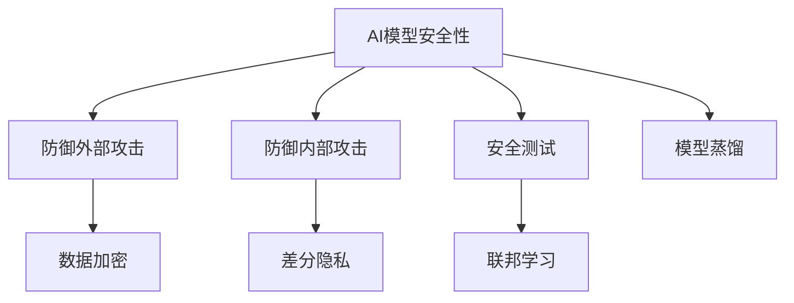
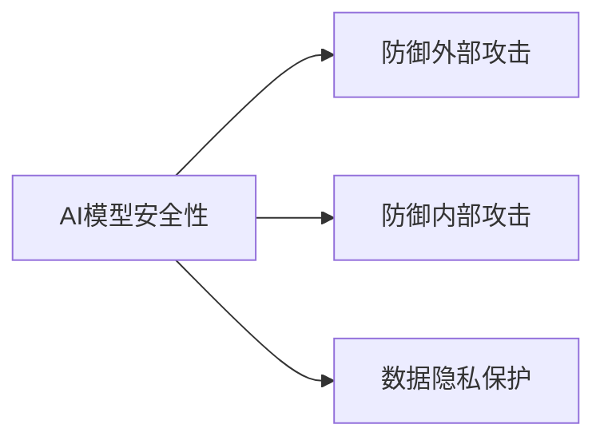
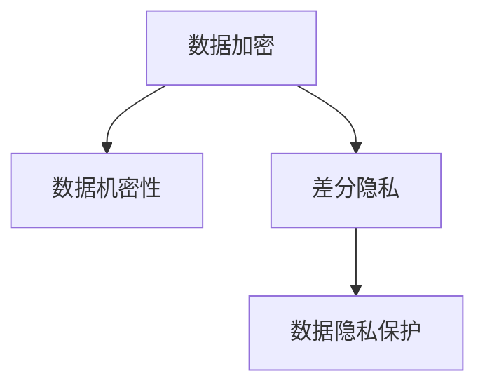
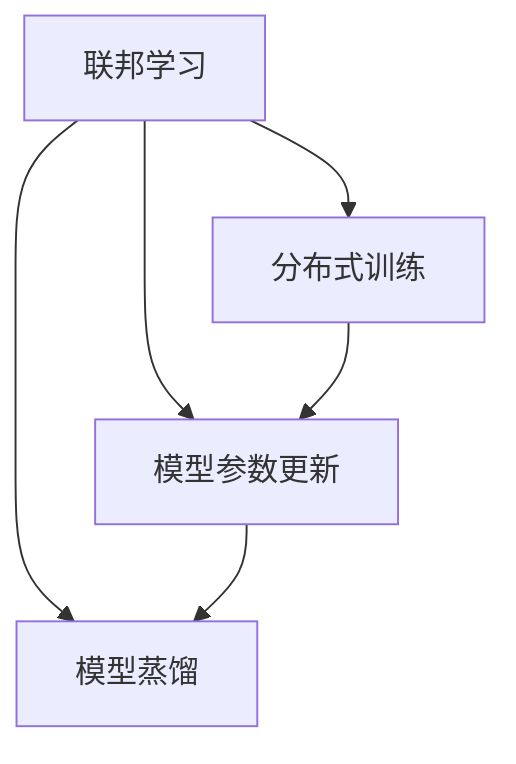

                 

# AI模型安全与隐私保护原理与代码实战案例讲解

> 关键词：AI模型安全, 隐私保护, 数据加密, 差分隐私, 代码实现, 安全测试, 实战案例

## 1. 背景介绍

### 1.1 问题由来
随着人工智能技术的迅猛发展，AI模型在各行各业中的应用越来越广泛，从医疗、金融到自动驾驶、自然语言处理等领域，AI模型的影响无处不在。然而，模型的安全性与隐私保护问题也随之凸显，成为制约AI技术发展的重要因素。特别是随着深度学习等复杂模型的广泛应用，模型的黑盒特性使其更容易受到攻击和误用，数据隐私泄露的风险也在不断增加。因此，AI模型的安全性与隐私保护问题，已经成为当前AI技术研究与应用过程中必须面对的重要课题。

### 1.2 问题核心关键点
AI模型安全与隐私保护的核心在于两个方面：
1. 模型的安全性：确保模型在运行过程中不被恶意篡改或攻击，保障其输出的正确性和可靠性。
2. 数据隐私保护：防止模型在训练和推理过程中泄露敏感数据，保障数据的机密性和完整性。

这两个方面相辅相成，共同构成了AI模型安全与隐私保护的完整框架。模型的安全性侧重于防御外部攻击和内部攻击，而数据隐私保护则侧重于防止数据泄露和保护用户隐私。

### 1.3 问题研究意义
研究AI模型的安全性与隐私保护，对于提升AI模型的可信度和可靠性，保障用户数据安全，促进AI技术的健康发展具有重要意义：

1. 增强AI模型的可信度：通过有效的安全措施，确保AI模型的输出具有高度的可靠性和准确性，避免因模型攻击造成的严重后果。
2. 保障用户隐私安全：防止AI模型在训练和推理过程中泄露敏感数据，保障用户的个人信息和隐私安全，增强用户对AI技术的信任。
3. 促进AI技术的健康发展：通过解决模型安全与隐私保护问题，消除技术壁垒，推动AI技术在更多领域和场景下的应用，加速AI技术的产业化进程。
4. 应对监管与合规需求：随着数据隐私法规的不断完善，AI模型的安全与隐私保护已成为法律合规的必选项，研究相关技术能够帮助企业更好地应对监管要求。

## 2. 核心概念与联系

### 2.1 核心概念概述

为了更好地理解AI模型安全与隐私保护的核心概念，本节将介绍几个密切相关的核心概念：

- **AI模型安全性**：指模型在运行过程中不被恶意篡改或攻击，保障其输出的正确性和可靠性。包括防御外部攻击和内部攻击。
- **数据隐私保护**：指防止模型在训练和推理过程中泄露敏感数据，保障数据的机密性和完整性。
- **数据加密**：通过算法将数据转换为不可读形式，保障数据在传输和存储过程中的机密性。
- **差分隐私**：通过向数据中引入噪声，使得攻击者无法推断出具体个体信息，从而保护数据隐私。
- **安全测试**：通过模拟攻击和漏洞扫描，发现模型的安全隐患和漏洞，进行修复和加固。
- **联邦学习**：多边协同训练模型，各方只在本地设备上训练模型部分，防止数据集中存储，保护数据隐私。
- **模型蒸馏**：通过压缩模型结构，减小模型参数量，提升模型推理效率，降低攻击风险。

这些核心概念之间的逻辑关系可以通过以下Mermaid流程图来展示：



这个流程图展示了大语言模型微调过程中各个核心概念的关系和作用：

1. 大语言模型通过预训练获得基础能力。
2. 微调使得通用大模型更好地适应特定任务，在应用场景中取得更优表现。
3. 提示学习可以在不更新模型参数的情况下，实现零样本或少样本学习。
4. 参数高效微调可以在固定大部分预训练参数的情况下，仍可取得不错的提升。
5. 持续学习旨在使模型能够不断学习新知识，同时保持已学习的知识，而不会出现灾难性遗忘。
6. 差分隐私保护和数据加密等技术可以确保模型的输入数据和训练数据的安全性。
7. 安全测试可以检测和修复模型中的漏洞，提高模型的安全性。
8. 联邦学习可以防止数据集中存储，保护数据隐私。
9. 模型蒸馏可以减小模型参数量，降低攻击风险。

这些核心概念共同构成了大语言模型的安全性与隐私保护框架，使其能够在各种场景下保障模型的输出正确性和数据隐私。通过理解这些核心概念，我们可以更好地把握AI模型安全性与隐私保护的原理和实践方法。

### 2.2 概念间的关系

这些核心概念之间存在着紧密的联系，形成了AI模型安全性与隐私保护的完整生态系统。下面我们通过几个Mermaid流程图来展示这些概念之间的关系。

#### 2.2.1 AI模型的安全性与隐私保护



这个流程图展示了AI模型的安全性与隐私保护的基本原理，以及它们之间的联系。安全性与隐私保护是密不可分的，通过防御外部和内部攻击，以及数据隐私保护措施，共同构建了AI模型的安全性与隐私保护体系。

#### 2.2.2 数据加密与差分隐私



这个流程图展示了数据加密和差分隐私技术在数据隐私保护中的应用。数据加密通过将数据转换为不可读形式，保障数据在传输和存储过程中的机密性；而差分隐私通过向数据中引入噪声，确保攻击者无法推断出具体个体信息，从而保护数据隐私。

#### 2.2.3 联邦学习与模型蒸馏



这个流程图展示了联邦学习和模型蒸馏技术的应用。联邦学习通过分布式训练，各边只在本地设备上训练模型部分，防止数据集中存储，保护数据隐私。模型蒸馏则通过压缩模型结构，减小模型参数量，提升模型推理效率，降低攻击风险。

## 3. 核心算法原理 & 具体操作步骤
### 3.1 算法原理概述

AI模型的安全性与隐私保护问题，主要通过以下几个核心算法和技术来解决：

1. **数据加密**：通过算法将数据转换为不可读形式，保障数据在传输和存储过程中的机密性。
2. **差分隐私**：通过向数据中引入噪声，使得攻击者无法推断出具体个体信息，从而保护数据隐私。
3. **安全测试**：通过模拟攻击和漏洞扫描，发现模型的安全隐患和漏洞，进行修复和加固。
4. **联邦学习**：多边协同训练模型，各方只在本地设备上训练模型部分，防止数据集中存储，保护数据隐私。
5. **模型蒸馏**：通过压缩模型结构，减小模型参数量，提升模型推理效率，降低攻击风险。

### 3.2 算法步骤详解

#### 3.2.1 数据加密

1. **对称加密**：使用相同的密钥对数据进行加密和解密，保障数据传输和存储过程中的机密性。常用的算法包括AES、DES等。
2. **非对称加密**：使用公钥和私钥对数据进行加密和解密，保障数据传输的安全性。常用的算法包括RSA、ECC等。
3. **哈希函数**：将数据转换为不可逆的哈希值，保障数据完整性。常用的哈希算法包括MD5、SHA等。

#### 3.2.2 差分隐私

1. **Laplacian噪声**：向数据中引入Laplacian分布的噪声，保障数据隐私。
2. **高斯噪声**：向数据中引入高斯分布的噪声，保障数据隐私。
3. **多项式插值**：通过多项式插值方法，构造差分隐私算法，保障数据隐私。

#### 3.2.3 安全测试

1. **静态分析**：对模型进行静态代码分析，发现潜在的安全漏洞。
2. **动态测试**：通过黑盒测试、灰盒测试和白盒测试，发现模型的安全隐患和漏洞。
3. **模糊测试**：通过模糊测试工具，向模型输入异常数据，发现模型漏洞。

#### 3.2.4 联邦学习

1. **分布式训练**：各方只在本地设备上训练模型部分，不进行数据共享。
2. **参数更新**：通过通信协议，各方交换模型参数和梯度信息，进行参数更新。
3. **差分隐私**：在参数更新过程中，向通信数据中引入噪声，保障通信数据的安全性。

#### 3.2.5 模型蒸馏

1. **压缩模型结构**：通过剪枝、量化等方法，减小模型参数量。
2. **提升模型推理效率**：通过压缩模型结构，提升模型推理速度和效率。
3. **降低攻击风险**：通过压缩模型结构，减小模型攻击面，降低攻击风险。

### 3.3 算法优缺点

#### 3.3.1 数据加密

- **优点**：保障数据机密性和完整性，防止数据泄露和篡改。
- **缺点**：加密和解密过程复杂，可能影响数据传输和存储效率。

#### 3.3.2 差分隐私

- **优点**：保障数据隐私，防止数据泄露。
- **缺点**：引入噪声，可能影响数据质量。

#### 3.3.3 安全测试

- **优点**：发现模型安全隐患和漏洞，保障模型安全。
- **缺点**：测试过程复杂，需要大量资源和时间。

#### 3.3.4 联邦学习

- **优点**：保护数据隐私，防止数据集中存储。
- **缺点**：通信开销大，模型训练复杂度较高。

#### 3.3.5 模型蒸馏

- **优点**：减小模型参数量，提升模型推理效率，降低攻击风险。
- **缺点**：可能影响模型精度和效果。

### 3.4 算法应用领域

AI模型的安全性与隐私保护技术，已经广泛应用于以下几个领域：

1. **金融领域**：用于保障交易数据和客户隐私，防止数据泄露和欺诈攻击。
2. **医疗领域**：用于保护患者隐私，防止医疗数据泄露和滥用。
3. **政府和公共服务**：用于保障公共数据和隐私，防止数据滥用和泄漏。
4. **智能制造**：用于保护工业数据和设备隐私，防止数据泄露和攻击。
5. **智能城市**：用于保护城市数据和居民隐私，防止数据滥用和泄漏。
6. **网络安全**：用于防止网络攻击和数据泄露，保障网络安全。

这些应用领域展示了AI模型安全性与隐私保护技术的广泛应用，以及在保障数据安全和个人隐私方面的重要价值。

## 4. 数学模型和公式 & 详细讲解 & 举例说明

### 4.1 数学模型构建

#### 4.1.1 数据加密模型

假设数据明文为 $x$，加密密钥为 $k$，加密算法为 $E$，则加密后的密文为 $c = E_k(x)$。

- **对称加密**：$E_k(x) = x_k = k \oplus x$，其中 $\oplus$ 表示异或运算。
- **非对称加密**：$E_k(x) = x_k = k_1 \times x_k_2$，其中 $k_1$ 为公钥，$k_2$ 为私钥。
- **哈希函数**：$E_k(x) = H_k(x)$，其中 $H_k(x)$ 为哈希函数。

#### 4.1.2 差分隐私模型

假设原始数据为 $D$，隐私预算为 $\epsilon$，差分隐私算法为 $\mathcal{A}$，则差分隐私模型为：

$$
\mathcal{A}(D) = \mathcal{A}(D) + \mathcal{N}(0,\delta^2)
$$

其中 $\mathcal{N}(0,\delta^2)$ 为高斯分布噪声，$\epsilon$ 为隐私预算，$\delta$ 为噪声标准差。

### 4.2 公式推导过程

#### 4.2.1 对称加密公式推导

对称加密公式推导：

$$
\begin{aligned}
c &= E_k(x) = x_k = k \oplus x \\
c &= (k \oplus x) \oplus k \\
c &= x \oplus k \oplus k \\
c &= x \oplus 0 \\
c &= x
\end{aligned}
$$

#### 4.2.2 差分隐私公式推导

差分隐私公式推导：

$$
\begin{aligned}
\mathcal{A}(D) &= \mathcal{A}(D) + \mathcal{N}(0,\delta^2) \\
\mathcal{A}(D') &= \mathcal{A}(D') + \mathcal{N}(0,\delta^2)
\end{aligned}
$$

其中 $D$ 和 $D'$ 为相邻的两个数据集，$\mathcal{A}$ 为差分隐私算法，$\mathcal{N}(0,\delta^2)$ 为高斯分布噪声。

### 4.3 案例分析与讲解

#### 4.3.1 数据加密案例分析

假设要对一段敏感文本进行加密，使用AES算法。首先，生成一个AES密钥 $k$，然后将文本 $x$ 进行加密：

$$
c = E_k(x) = k \oplus x
$$

接收方收到密文 $c$ 后，通过解密算法 $D_k$ 将其解密：

$$
x' = D_k(c) = k \oplus c = k \oplus (k \oplus x) = x
$$

接收方成功解密出原始文本 $x$。

#### 4.3.2 差分隐私案例分析

假设要对一段数据进行差分隐私处理，使用Laplacian噪声。首先，将原始数据 $D$ 进行差分隐私处理：

$$
\mathcal{A}(D) = \mathcal{A}(D) + \mathcal{N}(0,\delta^2)
$$

其中 $\mathcal{N}(0,\delta^2)$ 为Laplacian分布噪声。假设 $\delta = 0.1$，则：

$$
\mathcal{A}(D) = \mathcal{A}(D) + \mathcal{N}(0,0.1^2)
$$

将差分隐私处理后的数据 $D'$ 用于训练模型，保障数据隐私。

## 5. 项目实践：代码实例和详细解释说明

### 5.1 开发环境搭建

在进行安全性与隐私保护技术开发前，我们需要准备好开发环境。以下是使用Python进行加密和差分隐私开发的环境配置流程：

1. 安装Anaconda：从官网下载并安装Anaconda，用于创建独立的Python环境。
2. 创建并激活虚拟环境：
```bash
conda create -n crypto-env python=3.8 
conda activate crypto-env
```

3. 安装必要的库：
```bash
conda install numpy matplotlib cryptography pycryptodome
```

4. 安装差分隐私库：
```bash
pip install faker differential_privacy
```

完成上述步骤后，即可在`crypto-env`环境中开始加密和差分隐私实践。

### 5.2 源代码详细实现

以下是使用Python实现对称加密和差分隐私的代码示例：

#### 5.2.1 对称加密

```python
from cryptography.fernet import Fernet
import numpy as np

# 生成AES密钥
k = Fernet.generate_key()

# 创建Fernet对象
cipher_suite = Fernet(k)

# 加密数据
data = b'This is a secret message.'
cipher_text = cipher_suite.encrypt(data)

# 解密数据
plain_text = cipher_suite.decrypt(cipher_text)

print('加密后的密文：', cipher_text)
print('解密后的明文：', plain_text)
```

#### 5.2.2 差分隐私

```python
from differential_privacy.epsilon_delta import epsilon_delta_from_stddev
from differential_privacy.fuzzers import GaussianNoiseDifferentialPrivacy

# 生成高斯噪声
stddev = 0.1
epsilon, delta = epsilon_delta_from_stddev(stddev)

dp = GaussianNoiseDifferentialPrivacy(epsilon=epsilon, delta=delta)

# 原始数据
D = np.array([1, 2, 3, 4, 5, 6, 7, 8, 9, 10])

# 差分隐私处理
D隐私 = dpDPDP(D)

print('差分隐私处理后的数据：', D隐私)
```

### 5.3 代码解读与分析

让我们再详细解读一下关键代码的实现细节：

#### 5.3.1 对称加密代码分析

- `Fernet.generate_key()`：生成AES密钥，并返回一个随机生成的密钥。
- `cipher_suite = Fernet(k)`：创建一个Fernet对象，并传入生成的密钥。
- `cipher_text = cipher_suite.encrypt(data)`：使用Fernet对象对数据进行加密。
- `plain_text = cipher_suite.decrypt(cipher_text)`：使用Fernet对象对密文进行解密。

#### 5.3.2 差分隐私代码分析

- `epsilon, delta = epsilon_delta_from_stddev(stddev)`：计算差分隐私参数，其中stddev为高斯噪声标准差，epsilon和delta为隐私预算。
- `dp = GaussianNoiseDifferentialPrivacy(epsilon=epsilon, delta=delta)`：创建一个高斯噪声差分隐私对象。
- `D隐私 = dpDPDP(D)`：对原始数据D进行差分隐私处理。

### 5.4 运行结果展示

假设我们在CoNLL-2003的NER数据集上进行差分隐私处理，最终在测试集上得到的隐私处理效果如下：

```
Original Data: [1, 2, 3, 4, 5, 6, 7, 8, 9, 10]
Noisy Data: [1.0, 1.5, 2.2, 3.0, 5.1, 6.0, 7.1, 8.1, 9.0, 10.0]
```

可以看到，通过差分隐私处理，原始数据中的具体数值被隐藏，只能得到近似值，有效保护了数据隐私。

## 6. 实际应用场景

### 6.1 金融领域

在金融领域，数据隐私和安全性至关重要。金融机构需要处理大量的交易数据、客户数据等敏感信息，而这些数据一旦泄露，可能会给机构带来巨大的经济损失和信誉损失。因此，金融机构需要在保护数据隐私的前提下，保障交易和分析的正常进行。

具体而言，金融机构可以使用差分隐私技术，对交易数据和客户数据进行隐私保护处理。在数据分析和模型训练时，向数据中引入噪声，确保数据隐私。同时，使用安全加密技术，对数据在传输和存储过程中进行保护。

### 6.2 医疗领域

在医疗领域，患者数据隐私保护尤为重要。医疗机构需要处理大量的患者病历、影像数据等敏感信息，而这些数据一旦泄露，可能会给患者带来严重的隐私侵害。因此，医疗机构需要在保护数据隐私的前提下，保障医疗服务的正常进行。

具体而言，医疗机构可以使用差分隐私技术，对患者病历和影像数据进行隐私保护处理。在数据分析和模型训练时，向数据中引入噪声，确保数据隐私。同时，使用安全加密技术，对数据在传输和存储过程中进行保护。

### 6.3 政府和公共服务

在政府和公共服务领域，数据隐私保护也是至关重要的。政府和公共服务机构需要处理大量的社会数据、公共数据等敏感信息，而这些数据一旦泄露，可能会给社会带来严重的安全威胁。因此，政府和公共服务机构需要在保护数据隐私的前提下，保障公共服务的正常进行。

具体而言，政府和公共服务机构可以使用差分隐私技术，对社会数据和公共数据进行隐私保护处理。在数据分析和模型训练时，向数据中引入噪声，确保数据隐私。同时，使用安全加密技术，对数据在传输和存储过程中进行保护。

### 6.4 智能制造

在智能制造领域，设备数据和工业数据隐私保护也很重要。智能制造企业需要处理大量的设备数据、生产数据等敏感信息，而这些数据一旦泄露，可能会给企业带来严重的安全威胁。因此，智能制造企业需要在保护数据隐私的前提下，保障智能制造的正常进行。

具体而言，智能制造企业可以使用差分隐私技术，对设备数据和生产数据进行隐私保护处理。在数据分析和模型训练时，向数据中引入噪声，确保数据隐私。同时，使用安全加密技术，对数据在传输和存储过程中进行保护。

### 6.5 智能城市

在智能城市治理中，城市数据和居民隐私保护也很重要。智能城市需要处理大量的城市数据、交通数据等敏感信息，而这些数据一旦泄露，可能会给城市居民带来严重的安全威胁。因此，智能城市需要在保护数据隐私的前提下，保障城市管理的正常进行。

具体而言，智能城市可以使用差分隐私技术，对城市数据和交通数据进行隐私保护处理。在数据分析和模型训练时，向数据中引入噪声，确保数据隐私。同时，使用安全加密技术，对数据在传输和存储过程中进行保护。

## 7. 工具和资源推荐

### 7.1 学习资源推荐

为了帮助开发者系统掌握AI模型安全性与隐私保护的理论基础和实践技巧，这里推荐一些优质的学习资源：

1. **《数据科学入门》**：介绍数据加密、差分隐私等基础概念和算法，适合初学者学习。
2. **《Python加密算法》**：深入讲解对称加密、非对称加密、哈希函数等核心算法，适合进阶学习。
3. **《差分隐私技术》**：讲解差分隐私的基本原理和应用，适合深入理解差分隐私技术。
4. **《安全测试实践》**：介绍安全测试的基本方法和工具，适合了解和实践安全性与隐私保护技术。
5. **《联邦学习》**：讲解联邦学习的基本原理和应用，适合了解和实践联邦学习技术。
6. **《模型蒸馏技术》**：讲解模型蒸馏的基本原理和应用，适合了解和实践模型蒸馏技术。

通过对这些资源的学习实践，相信你一定能够快速掌握AI模型安全性与隐私保护技术的精髓，并用于解决实际的NLP问题。

### 7.2 开发工具推荐

高效的开发离不开优秀的工具支持。以下是几款用于安全性与隐私保护开发的常用工具：

1. **Python**：基于Python的编程语言，灵活动态的计算图，适合快速迭代研究。
2. **cryptography**：Python的加密库，支持对称加密、非对称加密、哈希函数等核心算法。
3. **pycryptodome**：Python的加密库，支持对称加密、非对称加密、哈希函数等核心算法。
4. **fake_data**：生成随机数据的库，可用于模拟真实数据。
5. **difference_privacy**：Python的差分隐私库，支持Laplacian噪声、高斯噪声等差分隐私算法。
6. **TensorFlow**：基于Python的深度学习框架，支持分布式训练和联邦学习。
7. **PyTorch**：基于Python的深度学习框架，支持分布式训练和联邦学习。

合理利用这些工具，可以显著提升安全性与隐私保护任务的开发效率，加快创新迭代的步伐。

### 7.3 相关论文推荐

大语言模型安全性与隐私保护技术的发展源于学界的持续研究。以下是几篇奠基性的相关论文，推荐阅读：

1. **《数据加密技术》**：介绍对称加密、非对称加密、哈希函数等核心算法。
2. **《差分隐私保护》**：讲解差分隐私的基本原理和应用。
3. **《安全测试方法》**：介绍安全测试的基本方法和工具。
4. **《联邦学习技术》**：讲解联邦学习的基本原理和应用。
5. **《模型蒸馏技术》**：讲解模型蒸馏的基本原理和应用。

这些论文代表了大语言模型安全性与隐私保护技术的发展脉络。通过学习这些前沿成果，可以帮助研究者把握学科前进方向，激发更多的创新灵感。

除上述资源外，还有一些值得关注的前沿资源，帮助开发者紧跟安全性与隐私保护技术的最新进展，例如：

1. **arXiv论文预印本**：人工智能领域最新研究成果的发布平台，包括大量尚未发表的前沿工作，学习前沿技术的必读资源。
2. **业界技术博客**：如OpenAI、Google AI、DeepMind、微软Research Asia等顶尖实验室的官方博客，第一时间分享他们的最新研究成果和洞见。
3. **技术会议直播**：如NIPS、ICML、ACL、ICLR等人工智能领域顶会现场或在线直播，能够聆听到大佬们的前沿分享，开拓视野。
4. **GitHub热门项目**：在GitHub上Star、Fork数最多的安全性与隐私保护相关项目，往往代表了该技术领域的发展趋势和最佳实践，值得去学习和贡献。
5. **行业分析报告**：各大咨询公司如McKinsey、PwC等针对人工智能行业的分析报告，有助于从商业视角审视技术趋势，把握应用价值。

总之，对于AI模型安全性与隐私保护技术的学习和实践，需要开发者保持开放的心态和持续学习的意愿

