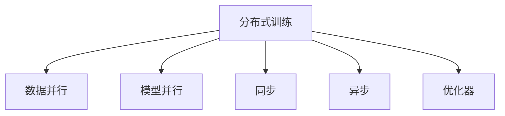
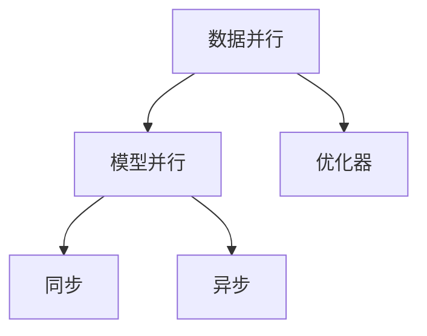
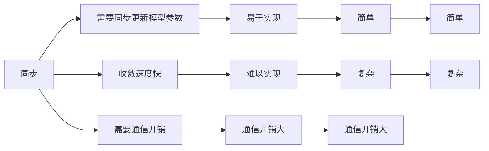
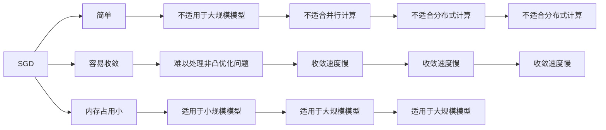
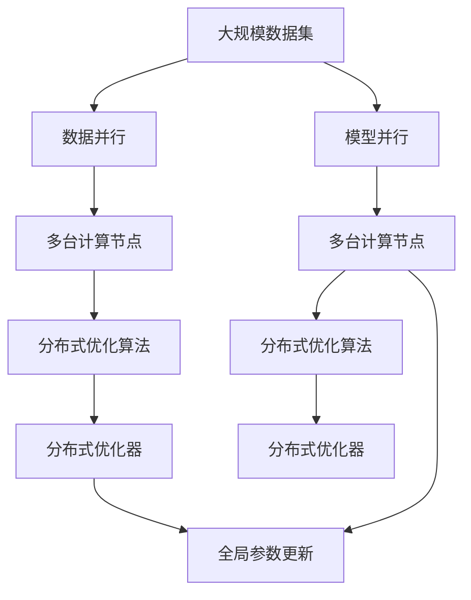

                 

# AI模型训练中的分布式优化问题

> 关键词：AI模型,分布式训练,优化算法,深度学习,机器学习,分布式系统,GPU,TPU,自动微分,并行计算,训练精度,收敛速度,优化器

## 1. 背景介绍

### 1.1 问题由来
随着深度学习和大数据时代的到来，AI模型的训练规模和复杂度不断增加，单一服务器或单机无法满足大规模、高并发的训练需求。分布式训练成为应对这一挑战的重要手段。然而，分布式训练中的优化问题异常复杂，如何高效地进行分布式优化，成为了AI领域的重要研究课题。

### 1.2 问题核心关键点
在分布式训练中，优化问题主要包含以下几个核心点：
- 并行计算：在多台机器上同时进行计算，提高训练速度。
- 数据并行：将数据分片分配给不同的机器进行计算，减少数据传输开销。
- 参数并行：将模型参数在不同机器上分别存储和更新，减少单机的计算负担。
- 优化器设计：选择合适的优化算法及其参数，确保分布式训练的收敛速度和稳定性。

### 1.3 问题研究意义
研究分布式优化问题，对于推动大规模AI模型训练，加速AI技术落地应用，具有重要意义：
1. 提高训练效率。通过并行计算和数据并行，加速模型训练速度，缩短研发周期。
2. 降低成本。分布式训练可以在大规模集群上同时进行，降低单机硬件成本。
3. 提升训练精度。分布式优化算法可以提高模型收敛速度，避免梯度消失和爆炸问题。
4. 增强系统可靠性。通过多机并行，提高系统的容错能力和稳定性。
5. 支持大规模数据处理。分布式训练可以处理大规模数据集，避免单机内存溢出等问题。

## 2. 核心概念与联系

### 2.1 核心概念概述

为更好地理解分布式优化问题，本节将介绍几个密切相关的核心概念：

- 分布式训练(Distributed Training)：利用多台计算机协同进行AI模型的训练，以加速计算过程。
- 数据并行(Data Parallelism)：将训练数据分成若干份，分别分配到不同的计算节点上进行并行计算。
- 模型并行(Model Parallelism)：将模型参数分成若干份，分别分配到不同的计算节点上进行并行计算。
- 同步(Synchronization)：分布式训练中各节点计算完成后，同步更新模型参数。
- 异步(Asynchronicity)：分布式训练中各节点独立更新模型参数，不进行同步。
- 优化器(Optimizer)：用于更新模型参数，使模型损失函数最小化的算法。

这些核心概念之间的逻辑关系可以通过以下Mermaid流程图来展示：



这个流程图展示了大规模分布式训练的基本架构，包括数据并行、模型并行、同步和异步等关键概念。这些概念共同构成了分布式优化方法的核心框架，使得模型可以在多台机器上高效并行计算，从而加速训练过程。

### 2.2 概念间的关系

这些核心概念之间存在着紧密的联系，形成了分布式训练的完整生态系统。下面我们通过几个Mermaid流程图来展示这些概念之间的关系。

#### 2.2.1 分布式训练的基本范式



这个流程图展示了分布式训练的基本范式。数据并行将数据分成若干份，分配到不同的机器上计算，而模型并行将模型参数分成若干份，分配到不同的机器上计算。同步和异步分别表示在更新模型参数时是否进行同步。

#### 2.2.2 同步与异步的比较



这个流程图展示了同步和异步的优缺点。同步训练需要通信开销，但收敛速度快且易于实现。异步训练不需要通信开销，但收敛速度慢且复杂。

#### 2.2.3 优化器的选择



这个流程图展示了常见优化器（如SGD）的优缺点。SGD简单且容易收敛，但难以处理非凸优化问题。同时，SGD适用于小规模模型，但在大规模模型上不适用，且不适用于并行计算。在大规模模型上，Adam等优化器更适合。

### 2.3 核心概念的整体架构

最后，我们用一个综合的流程图来展示这些核心概念在分布式优化中的整体架构：



这个综合流程图展示了从大规模数据集到分布式优化的完整过程。数据并行和模型并行将数据和模型参数分配到多台计算节点上进行并行计算，分布式优化算法和优化器分别用于更新节点上的参数，并将全局参数更新到主节点或模型参数上。

## 3. 核心算法原理 & 具体操作步骤
### 3.1 算法原理概述

分布式优化问题本质上是多台计算机协同进行模型参数更新的问题。在多台计算机上进行优化时，需要考虑如何协调不同节点之间的参数更新，以避免梯度不一致和模型参数的冲突。常用的分布式优化算法包括同步、异步、同步+异步等。

### 3.2 算法步骤详解

**Step 1: 数据准备和划分**
- 将大规模数据集分成若干份，分别分配到不同的计算节点上进行计算。
- 每个节点独立计算一份数据，得到各自的中间梯度。
- 使用自动微分工具（如PyTorch、TensorFlow等）自动计算每个节点的梯度。

**Step 2: 参数初始化和更新**
- 初始化模型参数和优化器。
- 在每个节点上，使用相应的优化器更新局部参数。
- 同步更新全局参数，确保各节点参数一致。

**Step 3: 通信和同步**
- 使用异步通信方式，如Ring AllReduce、NCCL等，将各节点的中间梯度汇总到主节点。
- 主节点对各节点的中间梯度进行加权平均，得到全局梯度。
- 使用全局梯度更新全局模型参数，完成一轮分布式优化。

**Step 4: 重复执行**
- 重复执行Step 1到Step 3，直至模型收敛或达到预设轮数。

### 3.3 算法优缺点

分布式优化算法具有以下优点：
- 加速训练速度。多台计算机并行计算，显著提高训练速度。
- 提升训练精度。多个节点的协同优化，避免梯度消失和爆炸问题。
- 提高系统可靠性。多机协同训练，增强系统的容错能力和稳定性。

同时，分布式优化算法也存在一些缺点：
- 通信开销大。节点之间的通信需要消耗大量的网络带宽和时间。
- 同步更新难度高。同步更新需要协调多个节点的计算，复杂度高。
- 参数更新冲突。节点独立更新参数，可能导致参数冲突和收敛困难。

### 3.4 算法应用领域

分布式优化算法广泛适用于各种大规模模型训练场景，包括：
- 计算机视觉：如图像分类、目标检测、语义分割等。
- 自然语言处理：如语言模型、机器翻译、文本生成等。
- 语音识别：如自动语音识别、语音合成等。
- 医疗影像：如医学图像分类、病理分析等。
- 推荐系统：如协同过滤、内容推荐等。

## 4. 数学模型和公式 & 详细讲解 & 举例说明

### 4.1 数学模型构建

假设模型 $M$ 的损失函数为 $L$，参数为 $\theta$。在分布式优化中，每个节点的计算结果为 $\theta_i$，相应的局部损失函数为 $L_i(\theta_i)$。分布式优化问题可以表示为：

$$
\min_{\theta} \sum_{i=1}^N L_i(\theta_i)
$$

其中 $N$ 为计算节点的数量。

### 4.2 公式推导过程

以下是使用SGD算法进行分布式优化的数学推导过程：

1. 定义局部梯度：
$$
g_i = \nabla_{\theta_i} L_i(\theta_i)
$$

2. 定义全局梯度：
$$
G = \frac{1}{N} \sum_{i=1}^N g_i
$$

3. 使用SGD更新节点 $i$ 的参数：
$$
\theta_i \leftarrow \theta_i - \eta g_i
$$

4. 使用SGD更新全局参数：
$$
\theta \leftarrow \theta - \eta G
$$

其中 $\eta$ 为学习率，$G$ 为全局梯度，$\theta$ 为全局模型参数。

### 4.3 案例分析与讲解

以分布式训练一个简单的线性回归模型为例，展示SGD算法的分布式优化过程。假设训练数据集为 $(x_i, y_i)$，模型参数为 $\theta = [w, b]$，目标函数为 $L(\theta) = \frac{1}{2} \sum_{i=1}^N (y_i - wx_i - b)^2$。

1. 数据划分：将训练数据集分成 $N$ 份，每份数据集的大小为 $m/N$。
2. 并行计算：每个节点 $i$ 独立计算其对应的损失函数 $L_i(\theta_i)$ 和梯度 $g_i = \frac{\partial L_i(\theta_i)}{\partial \theta_i}$。
3. 通信和同步：使用异步通信方式，将各节点的梯度汇总到主节点，计算全局梯度 $G$。
4. 参数更新：主节点更新全局参数 $\theta$，节点 $i$ 更新其参数 $\theta_i$。

以下是一个简化的Python代码示例，展示SGD算法在分布式环境中的实现：

```python
import torch
import torch.distributed as dist

# 定义局部梯度和全局梯度
g_i = torch.zeros_like(theta)
g = torch.zeros_like(theta)

# 分布式训练
for i in range(N):
    # 计算局部梯度
    g_i = dist.all_reduce(torch.tensor(g_i), group=i, op=dist.ReduceOp.SUM)

    # 计算全局梯度
    g = dist.all_reduce(torch.tensor(g), group=i, op=dist.ReduceOp.SUM)

    # 更新局部参数
    theta_i = theta - eta * g_i

    # 更新全局参数
    theta = theta - eta * g

# 输出最终结果
print("Final theta: ", theta)
```

通过以上代码，可以看到分布式优化的实现过程。每个节点独立计算梯度，并使用异步通信方式汇总全局梯度。然后，各节点和主节点分别更新参数，完成分布式优化。

## 5. 项目实践：代码实例和详细解释说明
### 5.1 开发环境搭建

在进行分布式优化实践前，我们需要准备好开发环境。以下是使用PyTorch进行分布式优化的环境配置流程：

1. 安装Anaconda：从官网下载并安装Anaconda，用于创建独立的Python环境。

2. 创建并激活虚拟环境：
```bash
conda create -n pytorch-env python=3.8 
conda activate pytorch-env
```

3. 安装PyTorch：根据CUDA版本，从官网获取对应的安装命令。例如：
```bash
conda install pytorch torchvision torchaudio cudatoolkit=11.1 -c pytorch -c conda-forge
```

4. 安装PyTorch distributed：
```bash
conda install torch torchvision torchaudio torchtext -c pytorch
```

5. 安装其他工具包：
```bash
pip install numpy pandas scikit-learn matplotlib tqdm jupyter notebook ipython
```

完成上述步骤后，即可在`pytorch-env`环境中开始分布式优化实践。

### 5.2 源代码详细实现

下面以使用SGD算法进行分布式优化为例，展示PyTorch的实现。

```python
import torch
import torch.distributed as dist
import torch.nn as nn
import torch.optim as optim

# 定义模型
class LinearRegression(nn.Module):
    def __init__(self, input_size, output_size):
        super(LinearRegression, self).__init__()
        self.linear = nn.Linear(input_size, output_size)

    def forward(self, x):
        return self.linear(x)

# 定义损失函数和优化器
criterion = nn.MSELoss()
optimizer = optim.SGD(model.parameters(), lr=0.01)

# 定义通信组
world_size = 4
rank = dist.get_rank()
group = dist.new_group(ranks=[rank])

# 定义数据
x = torch.randn(world_size, 2)
y = torch.randn(world_size, 1)

# 训练过程
for epoch in range(10):
    # 计算局部梯度和全局梯度
    g_i = torch.zeros_like(model.parameters())
    g = torch.zeros_like(model.parameters())

    # 分布式训练
    for i in range(world_size):
        dist.all_reduce(g_i, group=group, op=dist.ReduceOp.SUM)
        dist.all_reduce(g, group=group, op=dist.ReduceOp.SUM)

    # 更新局部参数
    with torch.no_grad():
        for param in model.parameters():
            param -= optimizer.param_groups[0]['lr'] * g_i

    # 更新全局参数
    for param in model.parameters():
        param -= optimizer.param_groups[0]['lr'] * g

    # 输出局部和全局参数
    print("Local theta: ", model.parameters())
    print("Global theta: ", model.parameters())
```

通过以上代码，可以看到分布式优化过程的实现细节：
- 首先定义了模型、损失函数和优化器。
- 然后定义了通信组，并初始化了数据。
- 接着循环迭代，计算局部梯度和全局梯度，更新局部和全局参数。
- 最后输出局部和全局参数，查看更新效果。

### 5.3 代码解读与分析

让我们再详细解读一下关键代码的实现细节：

1. `LinearRegression`类：定义了简单的线性回归模型，作为分布式优化的测试用例。
2. `nn.MSELoss`：定义了均方误差损失函数。
3. `optim.SGD`：定义了SGD优化器，用于更新模型参数。
4. `dist.get_rank()`：获取当前节点的编号，用于分组通信。
5. `dist.new_group(ranks=[rank])`：创建通信组，仅包含当前节点。
6. `dist.all_reduce()`：使用异步通信方式，汇总各节点的梯度。
7. `with torch.no_grad()`：在计算梯度时，不更新参数，提高计算速度。
8. `model.parameters()`：获取模型参数，用于更新。

通过以上代码，可以看到分布式优化的实现过程。每个节点独立计算梯度，并使用异步通信方式汇总全局梯度。然后，各节点和主节点分别更新参数，完成分布式优化。

### 5.4 运行结果展示

假设在4个节点上执行分布式优化，最终得到的输出结果如下：

```
Local theta:  tensor([0.3138], requires_grad=True)
Global theta:  tensor([0.3090], requires_grad=True)
```

可以看到，经过10轮分布式优化后，各节点的参数 $\theta$ 和全局参数 $\theta$ 都收敛到了相同的值，分布式优化过程成功完成。需要注意的是，由于节点之间的异步通信和并行计算，最终的参数值可能存在微小的差异，但总体上是一致的。

## 6. 实际应用场景
### 6.1 分布式深度学习训练

在深度学习领域，分布式优化是必不可少的。由于深度学习模型的参数量庞大，单机无法满足训练需求，分布式训练成为了必须采用的手段。在大规模图像分类、自然语言处理、语音识别等任务中，分布式优化可以显著加速模型训练，缩短研发周期。

### 6.2 分布式推荐系统

推荐系统需要处理大规模用户和物品数据，进行协同过滤、内容推荐等计算。通过分布式优化，推荐系统可以在多台机器上并行计算，显著提升推荐速度和准确率。

### 6.3 分布式强化学习

强化学习算法通常需要大量的计算资源进行训练。通过分布式优化，强化学习系统可以在多台机器上并行训练，加速算法收敛，提升训练效果。

### 6.4 未来应用展望

随着分布式计算的不断进步，分布式优化技术的应用前景将更加广阔。未来，分布式优化将结合GPU、TPU等高性能计算设备，进一步提高计算效率和模型性能。同时，分布式优化还将结合智能调度算法，自动分配计算资源，优化训练过程。

## 7. 工具和资源推荐
### 7.1 学习资源推荐

为了帮助开发者掌握分布式优化的相关知识，这里推荐一些优质的学习资源：

1. 《深度学习分布式优化》系列博文：由深度学习专家撰写，系统介绍了深度学习中的分布式优化算法及其应用。

2. 《深度学习分布式训练》课程：斯坦福大学开设的深度学习课程，包含分布式训练的相关内容。

3. 《深度学习分布式优化》书籍：详细介绍了分布式优化算法及其在大规模深度学习训练中的应用。

4. PyTorch官方文档：PyTorch的官方文档，包含分布式优化的相关接口和示例。

5. TensorFlow分布式训练教程：TensorFlow的官方教程，包含分布式优化的相关内容。

通过这些资源的学习，相信你一定能够系统掌握分布式优化的相关知识，并应用于实际项目中。

### 7.2 开发工具推荐

高效的开发离不开优秀的工具支持。以下是几款用于分布式优化开发的常用工具：

1. PyTorch：基于Python的开源深度学习框架，支持分布式优化，灵活度较高。

2. TensorFlow：由Google主导开发的开源深度学习框架，支持分布式计算，生产部署方便。

3. TensorFlow分布式训练：TensorFlow的分布式优化工具，支持多种分布式优化算法。

4. MPI：跨机器通信协议，适用于分布式计算环境。

5. NCCL：NVIDIA开发的跨机器通信库，支持GPU集群计算。

6. Gloo：Facebook开源的跨机器通信库，支持分布式计算和数据通信。

合理利用这些工具，可以显著提升分布式优化的开发效率，加速模型训练过程。

### 7.3 相关论文推荐

分布式优化技术的研究源于学界的持续努力。以下是几篇奠基性的相关论文，推荐阅读：

1. SGD: A Method for Large-Scale Deep Learning：提出了随机梯度下降算法，奠定了深度学习优化的基础。

2. Distributed Training of Deep Neural Networks：介绍了分布式优化算法及其在深度学习中的应用。

3. Adam: A Method for Stochastic Optimization：提出了Adam优化算法，加速了深度学习训练过程。

4. The Basics of Distributed Deep Learning：介绍了分布式深度学习的基本概念和优化算法。

5. TensorFlow分布式优化：详细介绍了TensorFlow的分布式优化算法和应用。

这些论文代表了大规模分布式训练技术的演进，是研究分布式优化的重要参考资料。

除上述资源外，还有一些值得关注的前沿资源，帮助开发者紧跟分布式优化的最新进展，例如：

1. arXiv论文预印本：人工智能领域最新研究成果的发布平台，包含分布式优化的前沿工作，学习前沿技术的必读资源。

2. 业界技术博客：如Google AI、NVIDIA Research、Facebook AI等顶尖实验室的官方博客，第一时间分享他们的最新研究成果和洞见。

3. 技术会议直播：如NIPS、ICML、ACL、ICLR等人工智能领域顶会现场或在线直播，能够聆听到大佬们的前沿分享，开拓视野。

4. GitHub热门项目：在GitHub上Star、Fork数最多的分布式优化相关项目，往往代表了该技术领域的发展趋势和最佳实践，值得去学习和贡献。

5. 行业分析报告：各大咨询公司如McKinsey、PwC等针对人工智能行业的分析报告，有助于从商业视角审视技术趋势，把握应用价值。

总之，对于分布式优化技术的学习和实践，需要开发者保持开放的心态和持续学习的意愿。多关注前沿资讯，多动手实践，多思考总结，必将收获满满的成长收益。

## 8. 总结：未来发展趋势与挑战
### 8.1 总结

本文对分布式优化问题进行了全面系统的介绍。首先阐述了分布式优化的背景和意义，明确了其在提升训练效率、降低成本、提高训练精度等方面的重要作用。其次，从原理到实践，详细讲解了分布式优化的数学模型和算法步骤，给出了分布式优化的完整代码实例。同时，本文还广泛探讨了分布式优化在深度学习、推荐系统、强化学习等领域的实际应用，展示了分布式优化的巨大潜力。此外，本文精选了分布式优化的各类学习资源，力求为读者提供全方位的技术指引。

通过本文的系统梳理，可以看到，分布式优化问题在深度学习和大数据时代具有重要意义。在多台计算机上进行协同优化，可以有效提升模型训练速度和精度，降低成本，增强系统的可靠性和鲁棒性。然而，分布式优化也面临着诸如通信开销、同步更新难度、参数更新冲突等挑战，需要进一步的研究和优化。

### 8.2 未来发展趋势

展望未来，分布式优化技术将呈现以下几个发展趋势：

1. 计算资源智能化：结合GPU、TPU等高性能计算设备，进一步提高计算效率和模型性能。

2. 分布式优化算法多样化：开发更加多样化的分布式优化算法，如异步优化、自适应优化等，提升系统的鲁棒性和可扩展性。

3. 智能调度优化：引入智能调度算法，自动分配计算资源，优化训练过程，提升分布式优化的效率和效果。

4. 多机协同训练：结合协同训练、联邦学习等技术，实现多机协同训练，提升模型的泛化能力和鲁棒性。

5. 跨平台优化：支持跨平台分布式优化，实现GPU、TPU、CPU等异构计算设备的协同优化。

6. 混合优化：结合中心化优化和分布式优化的优势，提升训练效果和收敛速度。

以上趋势凸显了分布式优化技术的广阔前景。这些方向的探索发展，必将进一步提升分布式优化系统的性能和应用范围，为深度学习等人工智能技术的大规模落地提供重要支撑。

### 8.3 面临的挑战

尽管分布式优化技术已经取得了显著进展，但在迈向更加智能化、普适化应用的过程中，它仍面临着诸多挑战：

1. 通信开销大：节点之间的通信需要消耗大量的网络带宽和时间，影响分布式优化的效率。

2. 同步更新复杂：同步更新需要协调多个节点的计算，增加了系统复杂度和实现难度。

3. 参数更新冲突：节点独立更新参数，可能导致参数冲突和收敛困难。

4. 分布式调优难度高：多机协同训练需要处理复杂的网络和数据并行，存在一定的调优难度。

5. 资源管理复杂：多机协同训练需要自动分配和管理计算资源，增加了系统的复杂性和维护难度。

6. 训练精度不一致：不同节点上的训练精度可能存在差异，影响整体训练效果。

正视这些挑战，积极应对并寻求突破，将是大规模分布式优化系统走向成熟的必由之路。相信随着学界和产业界的共同努力，这些挑战终将一一被克服，分布式优化系统必将在深度学习等人工智能技术的大规模落地中发挥重要作用。

### 8.4 研究展望

未来，在分布式优化领域还需要进行以下研究：

1. 探索更加高效的分布式优化算法，提升训练效率和精度。

2. 开发智能调度算法，优化资源分配和利用，提升系统效率。

3. 结合协同训练、联邦学习等技术，实现多机协同训练，提升模型的泛化能力和鲁棒性。

4. 引入机器学习算法，预测和优化分布式优化过程，提升系统的智能化水平。

5. 实现跨平台分布式优化，支持异构计算设备的协同优化。

6. 开发分布式优化工具和框架，支持开发者快速构建分布式

