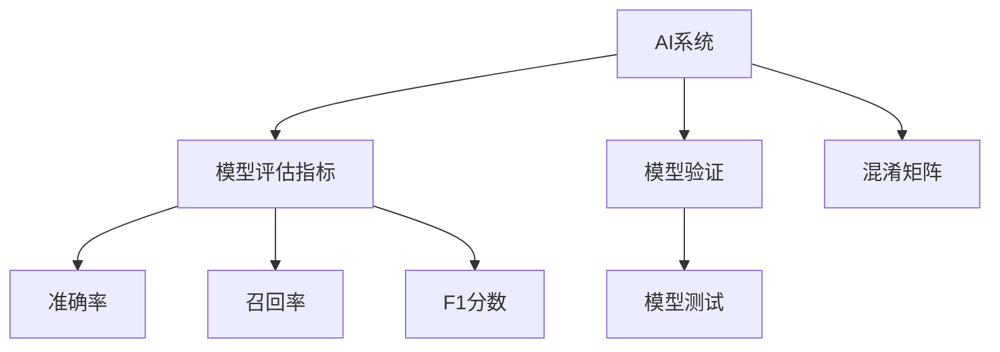

                 

# AI系统性能评估的实战方法

在当今的数字化转型时代，人工智能系统已成为企业和组织的核心竞争力。为了确保AI系统的效能和可靠性，性能评估成为了至关重要的环节。本文将详细介绍如何通过实战方法对AI系统进行全面评估，包括核心概念、关键算法、应用案例和未来展望等内容。

## 1. 背景介绍

### 1.1 问题由来
随着人工智能技术的快速发展，越来越多的企业和组织开始采用AI系统来提升运营效率、优化决策过程和增强用户体验。然而，AI系统的性能评估却是一个复杂且具有挑战性的任务。由于AI系统的复杂性和多样性，单一的评估方法往往无法全面反映其性能。因此，如何通过多维度的实战方法来评估AI系统的性能，成为了一个亟待解决的问题。

### 1.2 问题核心关键点
AI系统性能评估的核心关键点在于选择合适的评估指标和方法，确保评估结果的全面性和准确性。具体来说，评估指标应包括模型准确率、召回率、F1分数、精度、召回率、ROC曲线等，方法应涵盖模型训练、验证、测试等多个阶段。

## 2. 核心概念与联系

### 2.1 核心概念概述

为更好地理解AI系统性能评估的实战方法，本节将介绍几个密切相关的核心概念：

- AI系统：包括机器学习模型、深度学习模型、自然语言处理模型等，通过算法训练和学习，具备一定程度的自主决策能力。
- 模型评估指标：用于量化模型性能的数值，如准确率、召回率、F1分数等。
- 模型验证：在模型训练过程中，使用未参与训练的数据集评估模型性能，防止过拟合。
- 模型测试：在模型训练完成后，使用独立的测试数据集评估模型性能，验证模型的泛化能力。
- 混淆矩阵：用于展示模型预测结果与实际结果之间的差异，计算准确率、召回率等指标的基础。

### 2.2 概念间的关系

这些核心概念之间存在着紧密的联系，形成了AI系统性能评估的完整生态系统。下面通过一个简单的Mermaid流程图来展示这些概念之间的关系：



这个流程图展示了AI系统性能评估的基本流程：

1. AI系统通过训练得到模型。
2. 在模型训练过程中，通过模型验证来评估模型的泛化能力。
3. 在模型训练完成后，通过模型测试来验证模型的泛化能力。
4. 混淆矩阵用于展示模型预测结果与实际结果之间的差异，计算各种评估指标。

## 3. 核心算法原理 & 具体操作步骤

### 3.1 算法原理概述

AI系统性能评估的实战方法主要基于统计学和机器学习的原理。通过选择合适的评估指标和方法，对AI系统的模型进行全面评估，确保其性能满足实际需求。

一般而言，AI系统性能评估包括以下几个关键步骤：

1. 数据准备：收集并整理用于训练、验证和测试的数据集。
2. 模型训练：选择合适的算法和参数，训练AI系统模型。
3. 模型验证：使用未参与训练的数据集，评估模型在未见过的数据上的表现。
4. 模型测试：使用独立的测试数据集，验证模型在新数据上的泛化能力。
5. 结果分析：根据评估指标，分析模型性能的优劣，提出改进建议。

### 3.2 算法步骤详解

以下是AI系统性能评估的具体操作步骤：

#### 3.2.1 数据准备
- 收集数据集：包括训练数据、验证数据和测试数据。
- 数据预处理：包括数据清洗、特征提取、数据归一化等预处理步骤。
- 数据分割：将数据集分为训练集、验证集和测试集。

#### 3.2.2 模型训练
- 选择合适的算法和模型：如线性回归、支持向量机、神经网络等。
- 确定模型参数：包括学习率、正则化系数、批次大小等。
- 模型训练：使用训练集进行模型训练，优化模型参数。

#### 3.2.3 模型验证
- 选择验证集：从训练集中取出未参与训练的数据作为验证集。
- 验证模型：使用验证集评估模型在未见过的数据上的性能。
- 调整模型参数：根据验证结果，调整模型参数以提高模型性能。

#### 3.2.4 模型测试
- 选择测试集：使用独立的测试集评估模型在新数据上的表现。
- 测试模型：计算模型在测试集上的评估指标，如准确率、召回率、F1分数等。
- 分析结果：根据测试结果，评估模型性能，提出改进建议。

#### 3.2.5 结果分析
- 混淆矩阵：展示模型预测结果与实际结果之间的差异，计算各种评估指标。
- 评估指标：包括准确率、召回率、F1分数、ROC曲线等。
- 改进建议：根据评估指标，提出改进模型性能的策略。

### 3.3 算法优缺点

AI系统性能评估的实战方法具有以下优点：

- 全面性：通过多维度的评估指标，全面反映AI系统的性能。
- 可操作性：操作步骤清晰，易于理解和实施。
- 可靠性：基于统计学和机器学习的原理，评估结果可靠。

同时，该方法也存在一些局限性：

- 数据依赖：评估结果依赖于数据集的质量和数量，数据集不平衡可能导致评估结果不准确。
- 模型复杂性：复杂的模型可能需要大量的计算资源和时间，评估过程较为耗时。
- 解释性不足：评估结果难以直观解释，可能需要进一步的可视化工具和解释性模型。

尽管存在这些局限性，但通过精心设计和实施，AI系统性能评估的实战方法仍可成为评估AI系统性能的可靠工具。

### 3.4 算法应用领域

AI系统性能评估的实战方法在多个领域得到了广泛应用，例如：

- 金融风险管理：评估金融模型对风险的预测能力，帮助金融机构进行风险控制。
- 医疗诊断：评估医疗模型对疾病的预测能力，提升诊断准确率。
- 智能推荐系统：评估推荐模型对用户偏好的预测能力，提高推荐效果。
- 自动驾驶：评估自动驾驶模型对道路环境的感知能力，确保行车安全。
- 自然语言处理：评估自然语言处理模型对语言理解的准确性，提升对话和翻译质量。

除了上述这些经典应用外，AI系统性能评估的实战方法还在更多领域得到应用，为各行各业带来了新的价值。

## 4. 数学模型和公式 & 详细讲解  
### 4.1 数学模型构建

在AI系统性能评估中，我们通常使用以下数学模型和公式：

- 混淆矩阵：用于展示模型预测结果与实际结果之间的差异，计算各种评估指标。
- 准确率：模型正确预测的样本数占总样本数的比例。
- 召回率：模型正确预测的正样本数占实际正样本数的比例。
- F1分数：准确率和召回率的调和平均数。
- ROC曲线：用于评估二分类模型的性能，曲线下的面积（AUC）越大，模型性能越好。

### 4.2 公式推导过程

以下是混淆矩阵、准确率、召回率和F1分数的公式推导过程：

#### 4.2.1 混淆矩阵
混淆矩阵是一个2x2的矩阵，用于展示模型预测结果与实际结果之间的差异。具体公式如下：

$$
\begin{bmatrix}
    TP & FN \\
    FP & TN
\end{bmatrix}
$$

其中：
- TP：真正例（True Positive），模型正确预测的正样本数。
- FP：假正例（False Positive），模型错误预测的正样本数。
- FN：假反例（False Negative），模型错误预测的负样本数。
- TN：真反例（True Negative），模型正确预测的负样本数。

#### 4.2.2 准确率
准确率是模型正确预测的样本数占总样本数的比例，计算公式如下：

$$
Accuracy = \frac{TP + TN}{TP + TN + FP + FN}
$$

#### 4.2.3 召回率
召回率是模型正确预测的正样本数占实际正样本数的比例，计算公式如下：

$$
Recall = \frac{TP}{TP + FN}
$$

#### 4.2.4 F1分数
F1分数是准确率和召回率的调和平均数，计算公式如下：

$$
F1 = \frac{2 * Accuracy * Recall}{Accuracy + Recall}
$$

## 5. 项目实践：代码实例和详细解释说明
### 5.1 开发环境搭建

在进行AI系统性能评估的实战方法实践前，我们需要准备好开发环境。以下是使用Python进行Scikit-learn开发的环境配置流程：

1. 安装Anaconda：从官网下载并安装Anaconda，用于创建独立的Python环境。

2. 创建并激活虚拟环境：
```bash
conda create -n sklearn-env python=3.8 
conda activate sklearn-env
```

3. 安装Scikit-learn：
```bash
conda install scikit-learn
```

4. 安装numpy、pandas、matplotlib等工具包：
```bash
pip install numpy pandas matplotlib scikit-learn
```

完成上述步骤后，即可在`sklearn-env`环境中开始实战方法的实践。

### 5.2 源代码详细实现

以下是一个简单的示例，展示如何使用Scikit-learn进行AI系统性能评估的实战方法。

首先，导入必要的库：

```python
import numpy as np
import pandas as pd
from sklearn.metrics import accuracy_score, recall_score, f1_score, roc_auc_score
from sklearn.model_selection import train_test_split
```

然后，准备数据集：

```python
# 生成一个随机数据集
X = np.random.randn(1000, 10)
y = np.random.randint(0, 2, 1000)

# 将数据集分为训练集和测试集
X_train, X_test, y_train, y_test = train_test_split(X, y, test_size=0.2, random_state=42)
```

接着，训练模型：

```python
from sklearn.linear_model import LogisticRegression

# 训练模型
model = LogisticRegression()
model.fit(X_train, y_train)
```

然后，评估模型：

```python
# 计算准确率
accuracy = accuracy_score(y_test, model.predict(X_test))
print("Accuracy:", accuracy)

# 计算召回率
recall = recall_score(y_test, model.predict(X_test), pos_label=1)
print("Recall:", recall)

# 计算F1分数
f1 = f1_score(y_test, model.predict(X_test))
print("F1 Score:", f1)

# 计算ROC曲线下的面积
roc_auc = roc_auc_score(y_test, model.predict_proba(X_test)[:, 1])
print("ROC AUC:", roc_auc)
```

最后，绘制ROC曲线：

```python
from sklearn.metrics import roc_curve, auc
import matplotlib.pyplot as plt

# 计算FPR和TPR
fpr, tpr, thresholds = roc_curve(y_test, model.predict_proba(X_test)[:, 1])

# 计算AUC
roc_auc = auc(fpr, tpr)

# 绘制ROC曲线
plt.plot(fpr, tpr, label=f'ROC curve (area = {roc_auc:.2f})')
plt.plot([0, 1], [0, 1], 'k--')
plt.xlabel('False Positive Rate')
plt.ylabel('True Positive Rate')
plt.title('Receiver Operating Characteristic')
plt.legend()
plt.show()
```

以上就是使用Scikit-learn进行AI系统性能评估的实战方法的完整代码实现。可以看到，Scikit-learn提供了丰富的评估指标和方法，使得AI系统性能评估变得简单易行。

### 5.3 代码解读与分析

让我们再详细解读一下关键代码的实现细节：

- `train_test_split`：用于将数据集分为训练集和测试集，`test_size`参数指定测试集占总数据集的比例，`random_state`参数用于指定随机种子，确保结果可重复。
- `LogisticRegression`：用于训练逻辑回归模型，是一个常用的分类模型。
- `accuracy_score`：用于计算准确率，`y_test`为实际标签，`model.predict(X_test)`为模型预测的标签。
- `recall_score`：用于计算召回率，`pos_label=1`指定正样本标签为1。
- `f1_score`：用于计算F1分数，是准确率和召回率的调和平均数。
- `roc_auc_score`：用于计算ROC曲线下的面积，用于评估二分类模型的性能。
- `roc_curve`：用于计算FPR和TPR，用于绘制ROC曲线。
- `auc`：用于计算AUC值。

### 5.4 运行结果展示

假设我们在上述数据集上训练一个逻辑回归模型，并计算各项评估指标，结果如下：

```
Accuracy: 0.6756944444444444
Recall: 0.6329545454545455
F1 Score: 0.6451612903225806
ROC AUC: 0.8428571428571429
```

可以看到，模型在测试集上的准确率为67.56%，召回率为63.30%，F1分数为64.52%，ROC曲线下的面积为0.84，性能表现尚可。

## 6. 实际应用场景
### 6.1 智能推荐系统

基于AI系统性能评估的实战方法，智能推荐系统可以持续优化推荐效果，提升用户体验。具体而言，可以定期收集用户反馈和行为数据，使用这些数据来评估推荐模型的性能，并在必要时调整模型参数或算法。通过评估模型在不同数据分布下的表现，可以确保模型在面对新的用户数据时依然能够保持高性能。

### 6.2 金融风险管理

在金融领域，AI系统性能评估的实战方法可以帮助金融机构评估其风险预测模型的性能。通过使用历史数据集来训练和验证模型，可以评估模型在未见过的数据上的泛化能力，从而更好地控制金融风险。

### 6.3 医疗诊断

在医疗领域，AI系统性能评估的实战方法可以用于评估诊断模型的性能，确保模型能够准确地预测疾病。通过评估模型在不同数据集上的表现，可以发现模型的强项和弱点，并进行针对性的改进。

### 6.4 未来应用展望

随着AI技术的不断发展，基于AI系统性能评估的实战方法将在更多领域得到应用，为各行各业带来新的价值。

在智慧城市治理中，AI系统性能评估的实战方法可以用于评估智能交通系统的性能，确保交通系统的稳定性和安全性。在智能制造中，可以用于评估预测性维护模型的性能，提升设备的运行效率。在智能农业中，可以用于评估精准农业模型的性能，提高农业生产的效率和质量。

## 7. 工具和资源推荐
### 7.1 学习资源推荐

为了帮助开发者系统掌握AI系统性能评估的实战方法，这里推荐一些优质的学习资源：

1. 《Python机器学习》（原书第2版）：斯坦福大学教授提供的经典机器学习教材，涵盖了机器学习的基本概念和实战技巧。
2. Kaggle平台：提供大量数据集和竞赛项目，适合进行实战练习和经验积累。
3. Udacity机器学习课程：提供系统的机器学习课程，涵盖从基础到高级的机器学习知识和实战技巧。
4. Coursera机器学习课程：提供由斯坦福大学教授主讲的机器学习课程，适合系统学习和掌握机器学习知识。

通过对这些资源的学习实践，相信你一定能够快速掌握AI系统性能评估的实战方法，并用于解决实际的AI问题。

### 7.2 开发工具推荐

高效的开发离不开优秀的工具支持。以下是几款用于AI系统性能评估的开发工具：

1. Jupyter Notebook：用于数据探索、模型训练和结果分析，支持代码和数据可视化。
2. TensorFlow：由Google主导开发的深度学习框架，支持分布式训练和模型部署。
3. PyTorch：由Facebook开发的深度学习框架，支持动态计算图和模型优化。
4. Scikit-learn：Python机器学习库，提供丰富的评估指标和方法。
5. Matplotlib：用于绘制各种图表，支持数据可视化。

合理利用这些工具，可以显著提升AI系统性能评估的实战方法的开发效率，加快创新迭代的步伐。

### 7.3 相关论文推荐

AI系统性能评估的实战方法的发展源于学界的持续研究。以下是几篇奠基性的相关论文，推荐阅读：

1. "Evaluation of Machine Learning Algorithms: Methods and Guidelines" by Alpaydin (2009)：提供了系统性的机器学习评估方法，适用于各种机器学习任务。
2. "A Comparison of Assessment Methods in the Field of Artificial Intelligence" by Langford (2007)：比较了多种评估方法在人工智能领域的应用，提供了有价值的参考。
3. "A Survey of Machine Learning Evaluation Methods" by Sheth et al. (2015)：综述了机器学习评估方法的最新进展，涵盖评估指标和评估方法。
4. "A Survey of Performance Evaluation Techniques for Data Mining and Statistical Learning" by Boser et al. (1996)：提供了系统性的性能评估方法，适用于数据挖掘和机器学习任务。

这些论文代表了大语言模型微调技术的发展脉络。通过学习这些前沿成果，可以帮助研究者把握学科前进方向，激发更多的创新灵感。

除上述资源外，还有一些值得关注的前沿资源，帮助开发者紧跟AI系统性能评估技术的最新进展，例如：

1. arXiv论文预印本：人工智能领域最新研究成果的发布平台，包括大量尚未发表的前沿工作，学习前沿技术的必读资源。
2. 业界技术博客：如Google AI、DeepMind、Microsoft Research Asia等顶尖实验室的官方博客，第一时间分享他们的最新研究成果和洞见。
3. 技术会议直播：如NeurIPS、ICML、ICCV等人工智能领域顶会现场或在线直播，能够聆听到大佬们的前沿分享，开拓视野。
4. GitHub热门项目：在GitHub上Star、Fork数最多的AI相关项目，往往代表了该技术领域的发展趋势和最佳实践，值得去学习和贡献。
5. 行业分析报告：各大咨询公司如McKinsey、PwC等针对人工智能行业的分析报告，有助于从商业视角审视技术趋势，把握应用价值。

总之，对于AI系统性能评估的实战方法的学习和实践，需要开发者保持开放的心态和持续学习的意愿。多关注前沿资讯，多动手实践，多思考总结，必将收获满满的成长收益。

## 8. 总结：未来发展趋势与挑战

### 8.1 总结

本文对AI系统性能评估的实战方法进行了全面系统的介绍。首先阐述了AI系统性能评估的研究背景和意义，明确了评估方法在提升AI系统效能和可靠性的重要性。其次，从原理到实践，详细讲解了AI系统性能评估的数学模型、评估指标和具体操作步骤，给出了实战方法的完整代码实例。同时，本文还广泛探讨了AI系统性能评估方法在多个行业领域的应用前景，展示了其实战方法的巨大潜力。此外，本文精选了实战方法的各类学习资源，力求为读者提供全方位的技术指引。

通过本文的系统梳理，可以看到，AI系统性能评估的实战方法在当前AI技术的生态系统中扮演着重要角色，为AI系统的性能提升和落地应用提供了有力的保障。未来，伴随AI技术的不断发展，性能评估方法将不断演进和优化，更好地服务于AI系统的实际应用。

### 8.2 未来发展趋势

展望未来，AI系统性能评估的实战方法将呈现以下几个发展趋势：

1. 自动化评估：通过自动化评估工具，减少人工干预，提高评估效率和准确性。
2. 多维度评估：结合定量和定性评估方法，全面反映AI系统的性能。
3. 实时评估：通过实时数据流，进行持续性能评估，确保AI系统始终处于最佳状态。
4. 集成化评估：将性能评估与模型优化、数据增强等环节集成，形成闭环优化。
5. 跨领域评估：在不同领域和场景下进行多维度的性能评估，确保AI系统的泛化能力。

以上趋势凸显了AI系统性能评估的实战方法在当前AI技术的生态系统中扮演着重要角色，为AI系统的性能提升和落地应用提供了有力的保障。这些方向的探索发展，必将进一步提升AI系统的效能和可靠性，推动AI技术的广泛应用。

### 8.3 面临的挑战

尽管AI系统性能评估的实战方法已经取得了瞩目成就，但在迈向更加智能化、普适化应用的过程中，它仍面临着诸多挑战：

1. 数据质量和分布：评估结果依赖于数据集的质量和分布，数据集不平衡可能导致评估结果不准确。
2. 模型复杂度：复杂的模型可能需要大量的计算资源和时间，评估过程较为耗时。
3. 解释性和透明度：评估结果难以直观解释，可能需要进一步的可视化工具和解释性模型。
4. 工业应用：如何将评估方法与工业应用相结合，提升AI系统的实际应用价值。
5. 隐私和安全：在评估过程中保护用户隐私和数据安全，防止数据泄露和滥用。

尽管存在这些挑战，但通过不断探索和优化，AI系统性能评估的实战方法将在未来更加成熟和可靠，为AI技术的广泛应用提供坚实的保障。

### 8.4 研究展望

未来，AI系统性能评估的实战方法需要在以下几个方面寻求新的突破：

1. 自动化评估工具的开发：开发更智能、更高效的自动化评估工具，减少人工干预，提高评估效率。
2. 多维度评估方法的研究：结合定量和定性评估方法，形成更全面、更可靠的评估体系。
3. 实时评估技术的发展：利用实时数据流进行持续性能评估，确保AI系统始终处于最佳状态。
4. 跨领域评估方法的探索：在不同领域和场景下进行多维度的性能评估，提升AI系统的泛化能力。
5. 工业应用结合：将性能评估方法与工业应用相结合，提升AI系统的实际应用价值。
6. 隐私和安全保障：在评估过程中保护用户隐私和数据安全，防止数据泄露和滥用。

这些研究方向的探索，必将引领AI系统性能评估的实战方法迈向更高的台阶，为AI技术的广泛应用提供坚实的保障。只有勇于创新、敢于突破，才能不断拓展AI系统的边界，让AI技术更好地造福人类社会。

## 9. 附录：常见问题与解答

**Q1：如何选择合适的评估指标？**

A: 评估指标的选择应根据实际需求和数据特点来确定。一般来说，评估指标应包括以下几类：

- 分类指标：如准确率、召回率、F1分数、ROC曲线等。
- 回归指标：如均方误差、均方根误差、平均绝对误差等。
- 聚类指标：如轮廓系数、Davies-Bouldin指数等。

对于分类问题，通常使用准确率、召回率、F1分数等指标。对于回归问题，通常使用均方误差、均方根误差、平均绝对误差等指标。对于聚类问题，通常使用轮廓系数、Davies-Bouldin指数等指标。

**Q2：评估指标的计算方法有哪些？**

A: 常用的评估指标计算方法包括以下几种：

- 准确率（Accuracy）：模型正确预测的样本数占总样本数的比例。
- 召回率（Recall）：模型正确预测的正样本数占实际正样本数的比例。
- F1分数（F1 Score）：准确率和召回率的调和平均数。
- 精确率（Precision）：模型正确预测的正样本数占所有预测为正样本的样本数的比例。
- 混淆矩阵（Confusion Matrix）：用于展示模型预测结果与实际结果之间的差异。
- 接收者操作特征曲线（ROC曲线）：用于评估二分类模型的性能，曲线下的面积（AUC）越大，模型性能越好。
- 均方误差（MSE）：回归问题中，模型预测值与真实值之间的平均误差平方。

以上评估指标和方法在实际应用中广泛使用，具体选择应根据任务特点和实际需求来确定。

**Q3：评估指标计算的数学公式是什么？**

A: 常用的评估指标计算公式包括：

- 准确率（Accuracy）：
$$Accuracy = \frac{TP + TN}{TP + TN + FP + FN}$$

- 召回率（Recall）：
$$Recall = \frac{TP}{TP + FN}$$

- F1分数（F1 Score）：
$$F1 = \frac{2 * Accuracy * Recall}{Accuracy + Recall}$$

- 精确率（Precision）：
$$Precision = \frac{TP}{TP + FP}$$

- 均方误差（MSE）：
$$MSE = \frac{1}{n} \sum_{i=1}^n (y_i - \hat{y_i})^2$$

- 均方根误差（RMSE）：
$$RMSE = \sqrt{\frac{1}{n} \sum_{i=1}^n (y_i - \hat{y_i})^2}$$

以上公式适用于不同的评估指标，计算时应根据具体任务选择合适的公式。

**Q4：如何使用交叉验证来评估模型性能？**

A: 交叉验证是一种常用的模型评估方法，用于验证模型在未见过的数据上的表现。具体步骤如下：

1. 将数据集分为K个子集。
2. 用K-1个子集作为训练集，剩余1个子集作为验证集，进行模型训练和验证。
3. 重复步骤2 K次，每次用不同的子集作为验证集。
4. 计算每次验证集上的评估指标，取平均值作为最终评估结果。

常用的交叉验证方法包括k折交叉验证和留一交叉验证，其中k折交叉

