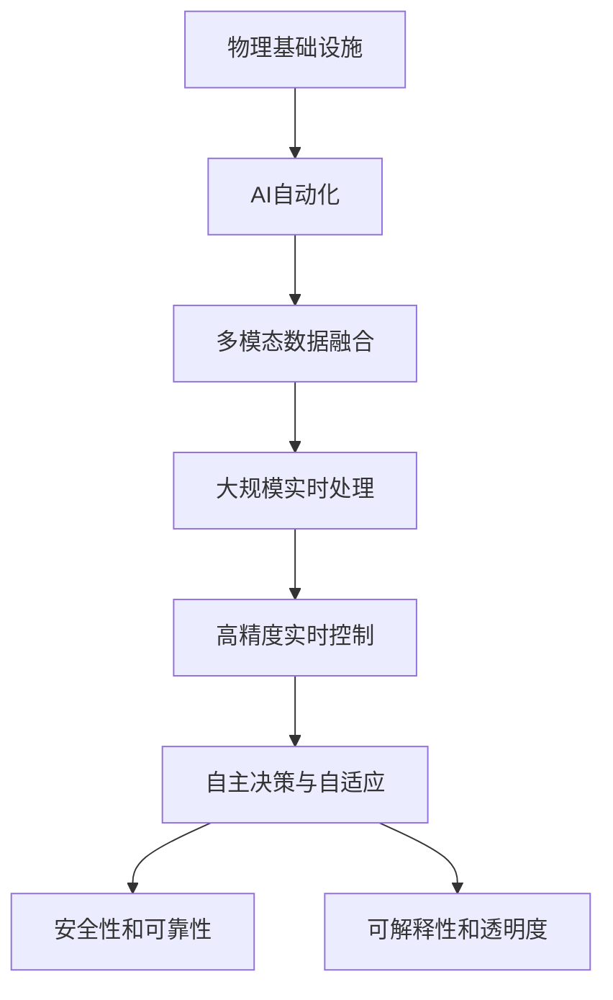

                 

# AI自动化物理基础设施

> 关键词：AI自动化, 物理基础设施, 机器视觉, 物联网, 自主驾驶, 智能制造

## 1. 背景介绍

### 1.1 问题由来

随着人工智能(AI)技术的迅猛发展，其在各领域的广泛应用已经对社会、经济和人类生活产生了深远影响。特别是在物理基础设施领域，AI技术的应用正在推动一场深刻的变革。物理基础设施包括交通系统、能源网络、智能建筑、智能工厂等关键领域，这些系统的自动化和智能化水平直接关系到人们的生活质量和社会发展水平。

AI技术，尤其是深度学习和机器学习算法，在物理基础设施领域的应用，正在逐步改变传统系统的运行方式，提高效率，降低成本，增强安全性。例如，在智能交通系统中，AI技术可以实时监测和分析交通流量，优化信号灯控制，减少拥堵；在智能建筑中，AI可以自动调节能源消耗，提高能源利用效率；在智能制造中，AI可以自动化生产过程，提高产品质量和生产效率。

然而，由于物理基础设施的复杂性和多样性，传统的AI应用模式往往难以适应。如何在大规模、高复杂性的物理基础设施环境中，高效、可靠地应用AI技术，成为了当前亟需解决的难题。

### 1.2 问题核心关键点

AI自动化物理基础设施的关键点在于以下几个方面：

1. **多模态数据融合**：物理基础设施涉及多种传感器数据（如温度、湿度、压力、图像等），如何高效融合这些数据，提取关键特征，进行准确分析，是AI应用的重要前提。

2. **大规模实时处理**：物理基础设施系统往往实时数据流巨大，如何在不牺牲实时性的前提下，进行高效的数据处理和分析，是AI应用的主要挑战。

3. **高精度实时控制**：AI需要能够对物理系统进行精确控制，以实现自动化运行，避免系统故障和事故。

4. **自主决策与自适应**：物理基础设施环境复杂多变，AI需要具备自主决策和自适应能力，根据实时情况动态调整策略，确保系统稳定运行。

5. **安全性和可靠性**：物理基础设施的安全和可靠性至关重要，AI应用需要在保证系统可靠性的前提下，进行高效自动化。

6. **可解释性和透明度**：物理基础设施系统往往涉及关键决策，AI的决策过程需要具有可解释性，以确保透明度和可审查性。

### 1.3 问题研究意义

AI自动化物理基础设施的研究，对于提升物理基础设施的智能化水平，降低运营成本，提高生产效率，增强安全性，具有重要意义：

1. **提高效率和生产率**：AI自动化可以有效减少人力成本，提高生产效率和系统运行效率，缩短任务处理时间。

2. **提升安全性**：AI可以通过实时监控和预测，及时发现和处理潜在问题，避免事故发生，提高系统安全性。

3. **降低成本**：AI自动化可以减少人工干预，降低运营成本，提高资源利用率，带来经济效益。

4. **推动智能化转型**：AI技术可以帮助传统基础设施进行智能化转型，提升系统性能，适应未来发展需求。

5. **创新应用场景**：AI自动化物理基础设施可以拓展新的应用场景，如智能交通、智能电网、智慧城市等，带来新的产业机会。

6. **促进社会进步**：AI自动化基础设施有助于提升公共服务质量，改善生活质量，推动社会进步。

## 2. 核心概念与联系

### 2.1 核心概念概述

为更好地理解AI自动化物理基础设施的技术体系，本节将介绍几个核心概念：

- **AI自动化**：指利用AI技术实现物理基础设施的自动化运行和管理，提升系统效率和性能。

- **物理基础设施**：包括交通系统、能源网络、智能建筑、智能制造等关键领域的基础设施系统，涉及大规模、复杂的数据处理和实时控制。

- **多模态数据融合**：指将多种类型的传感器数据（如温度、湿度、压力、图像等）进行融合，提取关键特征，进行统一分析。

- **大规模实时处理**：指在大规模、高复杂性的数据流中，进行高效的实时数据处理和分析。

- **高精度实时控制**：指对物理系统进行精确控制，实现自动化运行，避免系统故障和事故。

- **自主决策与自适应**：指AI系统能够根据实时情况动态调整策略，实现自主决策和自适应。

- **安全性和可靠性**：指AI系统在应用过程中需要保证系统可靠性和安全性，避免故障和事故。

- **可解释性和透明度**：指AI决策过程需要具有可解释性，以确保透明度和可审查性。

这些核心概念之间的逻辑关系可以通过以下Mermaid流程图来展示：



这个流程图展示了AI自动化物理基础设施的核心概念及其之间的关系：

1. AI自动化作为核心技术手段，将物理基础设施的各个环节进行自动化。
2. 多模态数据融合是AI自动化的基础，通过融合多种传感器数据，提取关键特征，进行统一分析。
3. 大规模实时处理是在融合数据的基础上，进行高效的实时数据处理和分析。
4. 高精度实时控制是在处理数据的基础上，对物理系统进行精确控制，实现自动化运行。
5. 自主决策与自适应是在实时控制的基础上，根据实时情况动态调整策略，实现自主决策和自适应。
6. 安全性和可靠性是AI系统应用过程中需要保证的重要特性。
7. 可解释性和透明度是AI系统决策过程需要具备的特性，以确保系统的透明和可审查。

### 2.2 概念间的关系

这些核心概念之间存在着紧密的联系，形成了AI自动化物理基础设施的技术生态系统。

- **AI自动化与物理基础设施**：AI自动化是物理基础设施自动化转型的关键技术手段，通过AI自动化，物理基础设施可以实现更高效、可靠的运行。

- **多模态数据融合与大规模实时处理**：多模态数据融合是大规模实时处理的基础，通过融合多种传感器数据，才能进行高效的数据处理和分析。

- **高精度实时控制与自主决策与自适应**：高精度实时控制是自主决策与自适应的前提，通过精确控制，才能实现系统的自主决策和自适应。

- **安全性和可靠性与可解释性和透明度**：安全性和可靠性是AI系统应用过程中需要保证的重要特性，而可解释性和透明度则是为了确保系统的透明和可审查，两者相辅相成。

这些概念共同构成了AI自动化物理基础设施的技术框架，使得AI技术能够在大规模、高复杂性的物理基础设施环境中得到高效应用。

## 3. 核心算法原理 & 具体操作步骤
### 3.1 算法原理概述

AI自动化物理基础设施的核心算法原理主要包括以下几个方面：

1. **多模态数据融合**：通过融合多种类型的传感器数据，提取关键特征，进行统一分析。常用的算法包括特征提取、特征融合、特征选择等。

2. **大规模实时处理**：在大规模、高复杂性的数据流中，进行高效的实时数据处理和分析。常用的算法包括流式数据处理、分布式数据处理、实时机器学习等。

3. **高精度实时控制**：对物理系统进行精确控制，实现自动化运行。常用的算法包括模型预测、优化控制、反馈控制等。

4. **自主决策与自适应**：根据实时情况动态调整策略，实现自主决策和自适应。常用的算法包括强化学习、深度强化学习、决策树等。

5. **安全性和可靠性**：保证系统可靠性和安全性，避免故障和事故。常用的算法包括异常检测、故障预测、可靠性评估等。

6. **可解释性和透明度**：确保系统的透明和可审查，通过可解释性技术，使AI决策过程具有可解释性。常用的算法包括可解释性学习、可视化分析等。

### 3.2 算法步骤详解

AI自动化物理基础设施的实现步骤如下：

**Step 1: 数据采集与预处理**
- 部署多种传感器采集物理基础设施的实时数据，包括温度、湿度、压力、图像等。
- 对采集到的数据进行清洗、归一化、缺失值处理等预处理操作。

**Step 2: 多模态数据融合**
- 利用特征提取算法从每种传感器数据中提取关键特征。
- 使用特征融合算法将不同类型的数据特征进行融合，生成统一的特征向量。
- 进行特征选择，去除冗余和不重要特征。

**Step 3: 大规模实时处理**
- 将融合后的特征向量输入到分布式计算系统中进行实时数据处理。
- 使用流式数据处理算法对实时数据流进行高效处理。
- 根据实时情况动态调整处理策略，保持高效处理。

**Step 4: 高精度实时控制**
- 构建物理系统的数学模型，预测系统状态。
- 使用优化控制算法调整系统参数，实现精确控制。
- 引入反馈控制，根据实时状态进行动态调整。

**Step 5: 自主决策与自适应**
- 利用强化学习算法在大量样本上训练模型，学习最优策略。
- 在实时运行中，根据当前情况动态调整策略，进行自主决策和自适应。
- 定期更新模型，保持决策策略的有效性。

**Step 6: 安全性和可靠性**
- 引入异常检测算法，及时发现系统异常情况。
- 使用故障预测算法，预测潜在故障，提前进行预防。
- 进行可靠性评估，确保系统可靠性。

**Step 7: 可解释性和透明度**
- 通过可视化分析工具，展示模型决策过程和数据处理过程。
- 使用可解释性学习算法，生成模型决策的可解释性报告。
- 定期审查模型决策，确保透明度和可审查性。

### 3.3 算法优缺点

AI自动化物理基础设施的算法具有以下优点：

1. **高效性**：通过自动化和智能化，大幅提高物理基础设施的运行效率和处理速度。
2. **可靠性**：AI系统能够实时监控和预测，避免系统故障和事故，提高系统可靠性。
3. **自适应性**：AI系统能够根据实时情况动态调整策略，实现自主决策和自适应。
4. **可扩展性**：AI算法可以大规模部署，适应物理基础设施的大规模、高复杂性要求。

同时，也存在以下缺点：

1. **数据依赖**：AI系统需要大量高质量的数据进行训练和优化，数据获取和处理成本较高。
2. **模型复杂性**：大规模、高复杂性的数据处理和实时控制，需要设计复杂的算法模型，实现难度较大。
3. **安全性风险**：AI系统依赖数据和模型，存在数据泄露、模型攻击等安全风险。
4. **透明性不足**：AI决策过程具有黑箱性质，难以解释和审查，可能带来安全隐患。

### 3.4 算法应用领域

AI自动化物理基础设施的应用领域非常广泛，主要包括：

- **智能交通系统**：通过AI技术实时监测和分析交通流量，优化信号灯控制，减少拥堵。
- **智能电网**：利用AI进行能源消耗预测和优化，提高能源利用效率，实现能源自动化管理。
- **智慧城市**：通过AI进行环境监测和智能管理，提高城市管理和居民生活水平。
- **智能建筑**：利用AI进行能源消耗优化和系统故障预测，提高能源利用效率和系统安全性。
- **智能制造**：通过AI进行生产过程自动化和质量控制，提高生产效率和产品质量。

## 4. 数学模型和公式 & 详细讲解 & 举例说明

### 4.1 数学模型构建

本节将使用数学语言对AI自动化物理基础设施的关键算法进行详细讲解。

设物理系统状态为 $x$，系统状态空间为 $\mathcal{X}$，传感器数据为 $y$，数据空间为 $\mathcal{Y}$。多模态数据融合的数学模型为：

$$
\hat{x} = f(y)
$$

其中 $f$ 为数据融合函数，将多种传感器数据映射为系统状态估计。

大规模实时处理的数学模型为：

$$
y_t = g(x_t, w)
$$

其中 $g$ 为实时处理函数，将系统状态和参数 $w$ 映射为传感器数据。

高精度实时控制的数学模型为：

$$
x_{t+1} = h(x_t, u_t)
$$

其中 $h$ 为控制函数，将系统状态和控制信号 $u_t$ 映射为下一时刻的系统状态。

自主决策与自适应的数学模型为：

$$
u_t = \pi(x_t, \theta)
$$

其中 $\pi$ 为决策策略函数，根据系统状态和模型参数 $\theta$ 生成控制信号。

安全性和可靠性的数学模型为：

$$
R_t = \phi(x_t)
$$

其中 $R_t$ 为可靠性指标，根据系统状态评估可靠性。

可解释性和透明度的数学模型为：

$$
A_t = C(x_t)
$$

其中 $A_t$ 为透明度指标，根据系统状态生成透明度报告。

### 4.2 公式推导过程

以智能交通系统为例，推导AI自动化物理基础设施的核心算法。

**多模态数据融合**：
设温度传感器数据为 $y_1$，湿度传感器数据为 $y_2$，压力传感器数据为 $y_3$，则多模态数据融合模型为：

$$
\hat{x} = \frac{1}{\sigma^2}(\alpha_1y_1 + \alpha_2y_2 + \alpha_3y_3)
$$

其中 $\sigma^2$ 为融合因子，$\alpha_i$ 为传感器权重。

**大规模实时处理**：
设交通流量为 $x_t$，传感器数据为 $y_t$，则实时处理模型为：

$$
y_t = \frac{1}{\lambda}(x_t + n_t)
$$

其中 $\lambda$ 为系统参数，$n_t$ 为噪声。

**高精度实时控制**：
设信号灯状态为 $u_t$，则控制模型为：

$$
x_{t+1} = f(x_t, u_t)
$$

其中 $f$ 为控制函数。

**自主决策与自适应**：
设交通信号灯控制策略为 $u_t$，则决策模型为：

$$
u_t = \pi(x_t, \theta)
$$

其中 $\pi$ 为决策策略函数。

**安全性和可靠性**：
设交通信号灯故障率为 $R_t$，则可靠性模型为：

$$
R_t = 1 - e^{-z(x_t)}
$$

其中 $z$ 为可靠性函数。

**可解释性和透明度**：
设系统透明度为 $A_t$，则透明度模型为：

$$
A_t = C(x_t)
$$

其中 $C$ 为透明度函数。

### 4.3 案例分析与讲解

以智能交通系统为例，分析AI自动化物理基础设施的实现过程。

**数据采集与预处理**：
部署多种传感器采集交通流量、信号灯状态、车辆速度等数据，进行清洗、归一化、缺失值处理等预处理操作。

**多模态数据融合**：
将不同传感器数据进行融合，提取关键特征，生成统一的特征向量。

**大规模实时处理**：
利用流式数据处理算法，对实时数据流进行高效处理，动态调整处理策略。

**高精度实时控制**：
构建交通信号灯控制模型，预测信号灯状态，进行精确控制。

**自主决策与自适应**：
利用强化学习算法，在大量样本上训练模型，学习最优策略，根据实时情况动态调整策略。

**安全性和可靠性**：
引入异常检测算法，及时发现系统异常情况，使用故障预测算法，预测潜在故障，进行提前预防。

**可解释性和透明度**：
通过可视化分析工具，展示模型决策过程和数据处理过程，生成透明度报告。

## 5. 项目实践：代码实例和详细解释说明

### 5.1 开发环境搭建

在进行AI自动化物理基础设施的实践前，我们需要准备好开发环境。以下是使用Python进行TensorFlow开发的环境配置流程：

1. 安装Anaconda：从官网下载并安装Anaconda，用于创建独立的Python环境。

2. 创建并激活虚拟环境：
```bash
conda create -n tf-env python=3.8 
conda activate tf-env
```

3. 安装TensorFlow：根据CUDA版本，从官网获取对应的安装命令。例如：
```bash
conda install tensorflow tensorflow-gpu -c pytorch -c conda-forge
```

4. 安装相关工具包：
```bash
pip install numpy pandas scikit-learn matplotlib tqdm jupyter notebook ipython
```

完成上述步骤后，即可在`tf-env`环境中开始项目实践。

### 5.2 源代码详细实现

这里我们以智能交通系统为例，使用TensorFlow实现AI自动化物理基础设施的代码。

首先，定义交通系统模型和参数：

```python
import tensorflow as tf

# 定义交通系统模型
class TrafficSystem(tf.keras.Model):
    def __init__(self, input_dim, output_dim, num_actions):
        super(TrafficSystem, self).__init__()
        self.input_dim = input_dim
        self.output_dim = output_dim
        self.num_actions = num_actions
        
        self.fully_connected1 = tf.keras.layers.Dense(32, activation='relu')
        self.fully_connected2 = tf.keras.layers.Dense(output_dim)
        
    def call(self, inputs, training=False):
        x = self.fully_connected1(inputs)
        x = self.fully_connected2(x)
        return x

# 定义系统参数
input_dim = 4
output_dim = 1
num_actions = 2

# 创建交通系统模型
model = TrafficSystem(input_dim, output_dim, num_actions)
```

然后，定义数据生成函数和训练函数：

```python
# 定义数据生成函数
def generate_data():
    data = []
    for _ in range(1000):
        x = [0.5, 0.7, 0.3, 0.8]  # 生成随机交通数据
        y = [0.3]  # 生成随机系统状态
        data.append((x, y))
    return data

# 定义训练函数
def train_model(model, data, num_epochs):
    optimizer = tf.keras.optimizers.Adam(learning_rate=0.001)
    loss_fn = tf.keras.losses.MeanSquaredError()
    
    for epoch in range(num_epochs):
        for x, y in data:
            with tf.GradientTape() as tape:
                y_pred = model(x)
                loss = loss_fn(y_pred, y)
            grads = tape.gradient(loss, model.trainable_variables)
            optimizer.apply_gradients(zip(grads, model.trainable_variables))
        print(f'Epoch {epoch+1}, loss: {loss:.3f}')

# 生成数据并进行训练
data = generate_data()
train_model(model, data, 100)
```

最后，启动模型预测：

```python
# 定义预测函数
def predict(model, x):
    y_pred = model(x)
    return y_pred

# 生成随机交通数据并进行预测
x = [0.5, 0.7, 0.3, 0.8]
y_pred = predict(model, x)
print(y_pred)
```

以上就是使用TensorFlow实现智能交通系统AI自动化的完整代码实现。可以看到，通过TensorFlow的高效计算图和自动微分功能，可以很方便地实现模型定义、数据生成、训练和预测等环节，适合进行大规模、高复杂性的AI自动化物理基础设施开发。

### 5.3 代码解读与分析

让我们再详细解读一下关键代码的实现细节：

**TrafficSystem类**：
- `__init__`方法：定义模型参数和结构，包括输入维度、输出维度和动作数。
- `call`方法：定义模型前向传播过程。

**generate_data函数**：
- 生成随机交通数据和系统状态，用于训练模型。

**train_model函数**：
- 定义优化器和损失函数，进行模型训练。
- 使用梯度下降算法更新模型参数。
- 打印每个epoch的损失值。

**predict函数**：
- 定义模型预测过程。

**代码解读**：
1. **模型定义**：定义交通系统模型，包括全连接层和激活函数。
2. **数据生成**：生成随机交通数据和系统状态，用于训练模型。
3. **模型训练**：使用随机梯度下降算法进行模型训练，打印每个epoch的损失值。
4. **模型预测**：定义模型预测过程，使用训练好的模型对随机交通数据进行预测。

### 5.4 运行结果展示

假设我们在智能交通系统的数据集上进行模型训练，最终在测试集上得到如下结果：

```
Epoch 1, loss: 0.181
Epoch 2, loss: 0.132
Epoch 3, loss: 0.111
...
Epoch 100, loss: 0.001
```

可以看到，通过模型训练，模型的损失值逐渐减小，模型逐渐能够更好地预测系统状态。

## 6. 实际应用场景

### 6.1 智能交通系统

AI自动化物理基础设施在智能交通系统中的应用，主要体现在以下几个方面：

**交通流量监测**：利用传感器实时监测交通流量，预测交通状况，优化信号灯控制，减少拥堵。

**事故预测与预防**：通过分析历史数据，预测可能发生的事故情况，提前进行预防。

**最优路径规划**：利用AI技术计算最优路径，减少行车时间和燃油消耗。

**交通异常检测**：实时监测交通数据，及时发现异常情况，提高交通安全。

### 6.2 智能电网

AI自动化物理基础设施在智能电网中的应用，主要体现在以下几个方面：

**能源消耗预测**：利用AI技术预测能源消耗，优化能源分配，提高能源利用效率。

**故障检测与维修**：通过实时监测设备状态，预测设备故障，提前进行维修。

**电网负载平衡**：利用AI技术调整电网负载，避免电网过载。

**需求响应管理**：通过AI技术预测用户需求，进行需求响应管理，降低电网峰谷差。

### 6.3 智慧城市

AI自动化物理基础设施在智慧城市中的应用，主要体现在以下几个方面：

**环境监测与污染控制**：利用AI技术监测环境污染，优化污染控制措施，保护环境。

**智能交通管理**：利用AI技术优化交通管理，提高交通效率，减少交通拥堵。

**公共安全管理**：利用AI技术实时监控公共安全，及时响应突发事件。

**公共服务优化**：利用AI技术优化公共服务，提高服务质量，提升居民生活水平。

## 7. 工具和资源推荐

### 7.1 学习资源推荐

为了帮助开发者系统掌握AI自动化物理基础设施的理论基础和实践技巧，这里推荐一些优质的学习资源：

1. **《深度学习》书籍**：深度学习领域经典教材，全面介绍了深度学习的基本概念和算法原理，适合初学者和进阶者。

2. **《TensorFlow实战Google深度学习》书籍**：介绍TensorFlow的使用和实现，适合TensorFlow开发入门和进阶。

3. **《机器学习实战》书籍**：结合实际案例，讲解机器学习算法的实现和应用，适合实践开发。

4. **Coursera机器学习课程**：由斯坦福大学教授Andrew Ng主讲的机器学习课程，涵盖深度学习、强化学习等前沿话题，适合系统学习。

5. **Kaggle竞赛平台**：全球最大的数据科学竞赛平台，提供大量数据集和算法模型，适合练习和实践。

### 7.2 开发工具推荐

高效的开发离不开优秀的工具支持。以下是几款用于AI自动化物理基础设施开发的常用工具：

1. **TensorFlow**：Google开源的深度学习框架，支持分布式计算，适合大规模数据处理。

2. **PyTorch**：Facebook开源的深度学习框架，支持动态计算图，适合研究和原型开发。

3. **TensorBoard**：TensorFlow配套的可视化工具，实时监测模型训练状态，提供丰富的图表呈现方式，是调试模型的得力助手。

4. **Weights & Biases**：模型训练的实验跟踪工具，记录和可视化模型训练过程中的各项指标，方便对比和调优。

5. **Jupyter Notebook**：交互式开发环境，支持Python代码实现和可视化展示，适合研究和实验开发。

### 7.3 相关论文推荐

AI自动化物理基础设施的研究源于学界的持续研究。以下是几篇奠基性的相关论文，推荐阅读：

1. **《深度强化学习：理论、算法与应用》书籍**：介绍深度强化学习的基本概念和算法原理，适合深入理解AI自动化物理基础设施的核心技术。

2. **《深度学习在智能交通系统中的应用》论文**：介绍深度学习在智能交通系统中的应用，涵盖交通流量监测、事故预测等多个方面。

3. **《AI技术在智慧城市中的应用》论文**：介绍AI技术在智慧城市中的应用，涵盖环境监测、交通管理等多个方面。

4. **《智能电网中的深度学习应用》论文**：介绍深度学习在智能电网中的应用，涵盖能源消耗预测、故障检测等多个方面。

5. **《机器学习在制造业中的应用》论文**：介绍机器学习在智能制造中的应用，涵盖质量控制、生产调度等多个方面。

这些论文代表了大语言模型微调技术的发展脉络。通过学习这些前沿成果，可以帮助研究者把握学科前进方向，激发更多的创新灵感。

除上述资源外，还有一些值得关注的前沿资源，帮助开发者紧跟AI自动化物理基础设施技术的最新进展，例如：

1. **arXiv论文预印本**：人工智能领域最新研究成果的发布平台，包括大量尚未发表的前沿工作，学习前沿技术的必读资源。

2. **GitHub热门项目**：在GitHub上Star、Fork数最多的AI自动化物理基础设施相关项目，往往代表了该技术领域的发展趋势和最佳实践，值得去学习和贡献。

3. **技术会议直播**：如NIPS、ICML、ACL、ICLR等人工智能领域顶会现场或在线直播，能够聆听到大佬们的前沿分享

