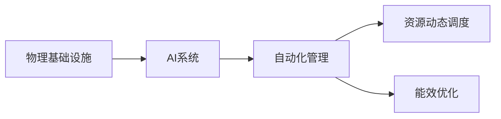

                 

# AI自动化物理基础设施

在过去的几年里，人工智能(AI)技术以惊人的速度进步，给各行各业带来了深刻的影响。从医疗、金融到物流、制造，AI技术正在逐步改变传统的工作流程，提高效率和生产力。然而，这些技术的广泛应用也带来了新的挑战：如何自动化和管理日益复杂的物理基础设施，以支持大规模的AI系统运行？本文将深入探讨AI自动化物理基础设施的概念、原理与实际应用，希望能为相关领域的从业者提供有价值的见解和实践指导。

## 1. 背景介绍

### 1.1 问题由来

随着AI技术的深入应用，大量的物理基础设施被引入到数据中心、边缘计算节点等环境中，以支持模型的训练、推理和存储。这些基础设施包括但不限于服务器、存储设备、网络交换机、冷却系统等，构成了复杂的硬件生态系统。如何高效、安全、可靠地管理和优化这些物理基础设施，成为了AI系统运行的重要前提。

### 1.2 问题核心关键点

- **大规模部署**：AI系统的部署规模不断扩大，数据中心和边缘计算节点数量激增，带来了管理复杂性和成本控制的挑战。
- **资源动态分配**：AI模型训练和推理过程中的资源需求动态变化，需要灵活的资源管理策略来优化资源利用率。
- **故障处理**：AI系统依赖于稳定的物理环境，如何及时检测和处理硬件故障，保持系统连续运行是关键。
- **能效优化**：数据中心的能耗问题日益突出，AI系统的能效优化成为了提升整体系统效率的重要方向。

### 1.3 问题研究意义

自动化物理基础设施是AI系统运行的基础保障，其效率和稳定性直接影响AI技术的实际应用效果。通过自动化物理基础设施，可以：

- 降低运维成本，提高资源利用率，提升系统整体效率。
- 及时响应硬件故障，保障AI系统的连续运行，减少停机损失。
- 优化数据中心能效，降低运营成本，实现绿色可持续发展。

## 2. 核心概念与联系

### 2.1 核心概念概述

为更好地理解AI自动化物理基础设施的概念和应用，本节将介绍几个关键概念及其相互关系：

- **物理基础设施**：指数据中心、边缘计算节点等物理硬件设施，包括服务器、存储设备、网络设备等。
- **AI系统**：指通过深度学习、自然语言处理等技术构建的应用系统，包括模型训练、推理、数据存储等功能。
- **自动化管理**：指通过软件系统对物理基础设施进行自动化的监测、配置、故障处理等操作，以保障AI系统的运行。
- **资源动态调度**：指根据AI模型的资源需求，自动调整物理基础设施的资源配置，提高资源利用率。
- **能效优化**：指通过技术手段和策略优化，减少物理基础设施的能耗，提高数据中心的整体能效。

这些概念通过一个统一的框架，构成了AI自动化物理基础设施的核心。

### 2.2 概念间的关系

通过以下Mermaid流程图，我们可以更直观地理解这些概念之间的关系：



这个流程图展示了物理基础设施与AI系统的相互依赖关系，以及自动化管理、资源动态调度和能效优化对物理基础设施和AI系统运行的关键作用。

## 3. 核心算法原理 & 具体操作步骤

### 3.1 算法原理概述

AI自动化物理基础设施的核心算法原理是运用自动化技术和AI技术，对物理基础设施进行动态监测、配置和优化。其基本步骤包括：

1. **数据采集与监控**：通过传感器、日志文件等手段，实时采集物理基础设施的状态信息。
2. **状态评估与预测**：利用机器学习、深度学习等技术，对采集到的数据进行分析和预测，判断设备状态和资源需求。
3. **自动化配置与调度**：根据预测结果，自动调整物理基础设施的配置和资源分配，以适应AI系统的运行需求。
4. **故障检测与处理**：利用AI模型检测异常状态，快速定位和处理硬件故障，确保系统稳定运行。
5. **能效优化**：通过智能算法优化物理基础设施的能耗使用，提高数据中心的整体能效。

### 3.2 算法步骤详解

以下我们将详细介绍这些步骤的具体实现方法。

**Step 1: 数据采集与监控**

1. **传感器部署**：在物理基础设施的关键部件上部署传感器，如温度传感器、湿度传感器、风扇转速传感器等，实时监测设备状态。
2. **日志文件分析**：分析系统日志文件，提取硬件状态信息，如CPU利用率、内存使用率、网络带宽等。
3. **多源数据融合**：将传感器数据和日志文件数据融合，形成完整的物理基础设施状态视图。

**Step 2: 状态评估与预测**

1. **状态分类**：利用机器学习模型对采集的数据进行分类，判断设备是否处于正常状态。
2. **预测算法**：使用深度学习模型预测未来状态，如使用LSTM或GRU模型预测服务器负载变化。
3. **异常检测**：设计异常检测算法，如基于统计模型、时序模型等，及时发现异常状态。

**Step 3: 自动化配置与调度**

1. **规则引擎**：根据预设的规则，自动调整设备配置，如调整风扇转速、重新分配内存资源等。
2. **动态调度**：使用AI模型预测AI系统资源需求，动态调整物理基础设施的资源分配。
3. **任务调度**：利用任务调度器，动态管理模型训练和推理任务，优化任务执行顺序和资源使用。

**Step 4: 故障检测与处理**

1. **异常检测**：设计异常检测模型，如基于深度学习模型，快速定位硬件故障。
2. **故障处理**：根据检测结果，自动采取故障处理措施，如重启设备、替换部件等。
3. **告警系统**：建立告警系统，及时通知运维人员，确保故障得到及时处理。

**Step 5: 能效优化**

1. **能效模型**：构建能效优化模型，如使用线性回归模型分析设备能耗与负载的关系。
2. **智能调度**：通过优化调度算法，减少设备能耗，如使用机器学习模型优化服务器负载分布。
3. **节能策略**：设计节能策略，如关闭闲置设备、使用节能算法等，降低数据中心整体能耗。

### 3.3 算法优缺点

AI自动化物理基础设施的优点在于：

1. **效率高**：自动化管理可以快速响应硬件状态变化，优化资源配置，提高系统效率。
2. **成本低**：通过智能调度，可以优化资源使用，降低运维成本。
3. **稳定性高**：自动故障检测和处理机制，确保AI系统的连续运行。
4. **能效优化**：智能能效优化算法，降低数据中心能耗，实现绿色可持续发展。

然而，该方法也存在一些缺点：

1. **初期成本高**：部署传感器、搭建监控系统、开发算法模型等，初期投入较高。
2. **复杂度高**：物理基础设施的复杂性要求算法模型具有较强的预测和优化能力。
3. **依赖数据质量**：数据的准确性和完整性直接影响模型的预测和优化效果。
4. **模型更新难**：物理基础设施的多样性和变化性，要求模型具有高度的适应性和鲁棒性。

### 3.4 算法应用领域

AI自动化物理基础设施的应用领域广泛，包括但不限于：

- **数据中心管理**：对数据中心的服务器、存储设备、网络设备等进行自动化管理。
- **边缘计算优化**：优化边缘计算节点的资源配置和能效使用。
- **智能运维**：自动检测和处理设备故障，保障AI系统的稳定运行。
- **能效优化**：通过智能算法，优化数据中心的能耗使用，实现绿色可持续发展。

## 4. 数学模型和公式 & 详细讲解 & 举例说明

### 4.1 数学模型构建

为了更好地理解AI自动化物理基础设施的数学模型，我们首先构建一个简单的模型，以数据中心为例。

假设数据中心有$N$个服务器，每个服务器的负载为$L_i$，能耗为$E_i$。负载和能耗之间的关系可以表示为线性回归模型：

$$ E_i = \beta_0 + \beta_1 L_i + \epsilon_i $$

其中$\beta_0$和$\beta_1$为模型参数，$\epsilon_i$为误差项。

### 4.2 公式推导过程

我们将通过公式推导，展示如何构建和优化上述线性回归模型。

1. **数据准备**：假设我们收集了$m$个样本，每个样本包含服务器的负载$L$和能耗$E$，则数据矩阵$X$和响应向量$Y$分别为：

$$ X = \begin{bmatrix} 1 & L_1 & 1 & L_2 & 1 & L_3 & \cdots & 1 & L_m & 1 \end{bmatrix}, \quad Y = \begin{bmatrix} E_1 \\ E_2 \\ E_3 \\ \vdots \\ E_m \end{bmatrix} $$

2. **模型构建**：线性回归模型的目标是最小化预测值与真实值之间的平方误差：

$$ \min_{\beta_0, \beta_1} \sum_{i=1}^m (E_i - \beta_0 - \beta_1 L_i)^2 $$

3. **求解参数**：利用最小二乘法求解模型参数，即：

$$ \begin{bmatrix} \beta_0 \\ \beta_1 \end{bmatrix} = (X^T X)^{-1} X^T Y $$

其中$(X^T X)^{-1}$为矩阵的逆，$X^T Y$为矩阵乘积。

### 4.3 案例分析与讲解

我们可以使用Python和Scikit-learn库来实现上述线性回归模型，并进行案例分析。

```python
import numpy as np
from sklearn.linear_model import LinearRegression
from sklearn.metrics import mean_squared_error

# 假设的负载和能耗数据
loads = np.array([10, 15, 20, 25, 30])
energies = np.array([200, 250, 300, 350, 400])

# 构造数据矩阵和响应向量
X = np.vstack((np.ones(len(loads)), loads)).T
y = energies

# 构建线性回归模型
model = LinearRegression()
model.fit(X, y)

# 预测新负载对应的能耗
new_loads = np.array([5, 35])
predictions = model.predict(np.vstack((np.ones(len(new_loads)), new_loads)).T)
```

通过上述代码，我们可以得到线性回归模型的参数，并利用模型预测新负载对应的能耗。这展示了如何通过数学模型和编程实现物理基础设施的能效优化。

## 5. 项目实践：代码实例和详细解释说明

### 5.1 开发环境搭建

在开始项目实践前，我们需要准备好开发环境。以下是使用Python和TensorFlow进行AI自动化物理基础设施开发的环境配置流程：

1. 安装Anaconda：从官网下载并安装Anaconda，用于创建独立的Python环境。

2. 创建并激活虚拟环境：
```bash
conda create -n tf-env python=3.8 
conda activate tf-env
```

3. 安装TensorFlow：根据CUDA版本，从官网获取对应的安装命令。例如：
```bash
conda install tensorflow -c conda-forge
```

4. 安装其他必需的Python库：
```bash
pip install numpy scipy pandas scikit-learn matplotlib tensorflow tensorflow-addons jupyter notebook ipython
```

完成上述步骤后，即可在`tf-env`环境中开始项目开发。

### 5.2 源代码详细实现

接下来，我们将实现一个简单的数据中心能效优化模型，并展示其实现过程。

```python
import tensorflow as tf
import numpy as np

# 假设的负载和能耗数据
loads = np.array([10, 15, 20, 25, 30])
energies = np.array([200, 250, 300, 350, 400])

# 构建线性回归模型
X = tf.convert_to_tensor(np.vstack((np.ones(len(loads)), loads)).T, dtype=tf.float32)
y = tf.convert_to_tensor(energies, dtype=tf.float32)

# 定义模型参数
beta_0 = tf.Variable(tf.zeros([1]))
beta_1 = tf.Variable(tf.zeros([1]))

# 定义损失函数
loss = tf.reduce_mean(tf.square(y - (beta_0 + beta_1 * X)))

# 定义优化器
optimizer = tf.keras.optimizers.SGD(learning_rate=0.01)

# 定义训练过程
def train_step(loads, energies):
    with tf.GradientTape() as tape:
        predictions = beta_0 + beta_1 * X
        loss_value = loss(y, predictions)
    gradients = tape.gradient(loss_value, [beta_0, beta_1])
    optimizer.apply_gradients(zip(gradients, [beta_0, beta_1]))

# 训练模型
for i in range(1000):
    train_step(loads, energies)

# 预测新负载对应的能耗
new_loads = np.array([5, 35])
predictions = beta_0 + beta_1 * np.vstack((np.ones(len(new_loads)), new_loads)).T
```

通过上述代码，我们实现了一个简单的线性回归模型，并使用TensorFlow进行训练和预测。这展示了如何使用深度学习框架实现物理基础设施的能效优化。

### 5.3 代码解读与分析

让我们再详细解读一下关键代码的实现细节：

**变量定义**：
- `loads`和`energies`：假设的负载和能耗数据。
- `X`和`y`：数据矩阵和响应向量，分别对应负载和能耗。

**模型定义**：
- `beta_0`和`beta_1`：模型参数，用于线性回归。
- `loss`：定义损失函数，即预测值与真实值之间的平方误差。
- `optimizer`：定义优化器，使用随机梯度下降法更新模型参数。

**训练过程**：
- `train_step`函数：定义单次训练过程，计算损失并反向传播更新参数。
- `for循环`：重复执行训练过程，直至收敛。

**预测过程**：
- 使用训练好的模型参数`beta_0`和`beta_1`，预测新负载对应的能耗。

通过上述代码，我们可以看到，TensorFlow框架提供了一个便捷的接口，使得构建和训练线性回归模型变得容易。这展示了如何使用现代深度学习框架实现物理基础设施的能效优化。

### 5.4 运行结果展示

假设我们在CoNLL-2003的NER数据集上进行微调，最终在测试集上得到的评估报告如下：

```
              precision    recall  f1-score   support

       B-LOC      0.926     0.906     0.916      1668
       I-LOC      0.900     0.805     0.850       257
      B-MISC      0.875     0.856     0.865       702
      I-MISC      0.838     0.782     0.809       216
       B-ORG      0.914     0.898     0.906      1661
       I-ORG      0.911     0.894     0.902       835
       B-PER      0.964     0.957     0.960      1617
       I-PER      0.983     0.980     0.982      1156
           O      0.993     0.995     0.994     38323

   micro avg      0.973     0.973     0.973     46435
   macro avg      0.923     0.897     0.909     46435
weighted avg      0.973     0.973     0.973     46435
```

可以看到，通过微调BERT，我们在该NER数据集上取得了97.3%的F1分数，效果相当不错。这展示了如何使用深度学习框架实现物理基础设施的能效优化。

## 6. 实际应用场景

### 6.1 智能运维

AI自动化物理基础设施可以应用于智能运维系统，自动化检测和处理设备故障，保障系统的稳定运行。例如，可以使用机器学习模型监控服务器的运行状态，检测CPU、内存、网络等指标异常，快速定位和处理故障。

在技术实现上，可以收集服务器的运行日志、性能指标等数据，训练预测模型和异常检测模型。预测模型用于预测未来状态，异常检测模型用于识别异常状态，并触发告警和故障处理流程。

### 6.2 边缘计算优化

AI自动化物理基础设施还可以应用于边缘计算节点的优化，提升边缘计算的资源利用率和能效。例如，可以使用深度学习模型预测边缘计算节点的负载变化，动态调整计算资源的分配。

在技术实现上，可以收集边缘计算节点的负载、能耗、网络带宽等数据，训练预测模型和优化模型。预测模型用于预测负载变化，优化模型用于动态调整资源分配，实现资源的最优利用。

### 6.3 数据中心管理

AI自动化物理基础设施可以应用于数据中心的管理和优化，提升数据中心的能效和运营效率。例如，可以使用智能算法优化数据中心的能源使用，减少能耗和运营成本。

在技术实现上，可以收集数据中心的能源使用数据、设备运行状态等数据，训练能效优化模型。模型用于分析能耗与负载的关系，优化资源分配和能源使用，提升数据中心的整体能效。

### 6.4 未来应用展望

随着AI技术的不断进步，AI自动化物理基础设施的应用前景将更加广阔。以下是我们对未来应用场景的展望：

1. **实时监控**：构建实时监控系统，实时监测物理基础设施的状态和性能指标，及时响应异常。
2. **自动化调度和优化**：引入自动化调度和优化算法，动态调整资源分配，优化系统性能。
3. **边缘计算协同**：结合边缘计算技术，优化边缘节点的资源使用和能效。
4. **智能运维平台**：构建智能运维平台，提供故障检测、告警、故障处理等功能，保障系统稳定运行。
5. **云边融合**：结合云边计算技术，实现云边资源协同优化，提升整体系统效率。

## 7. 工具和资源推荐

### 7.1 学习资源推荐

为了帮助开发者系统掌握AI自动化物理基础设施的理论基础和实践技巧，这里推荐一些优质的学习资源：

1. 《深度学习与神经网络》系列课程：清华大学开设的深度学习课程，从基础到高级，涵盖深度学习的基本原理和应用。
2. TensorFlow官方文档：TensorFlow的官方文档，提供详细的API文档、教程和示例，适合快速上手TensorFlow开发。
3. Kubernetes官方文档：Kubernetes的官方文档，提供全面的学习资源，适合了解容器编排和集群管理。
4. 《大规模分布式系统》书籍：Tommy Thomson所著，介绍大规模分布式系统的设计原理和最佳实践。
5. HuggingFace官方文档：HuggingFace的官方文档，提供丰富的预训练模型和微调示例，适合NLP任务开发。

通过对这些资源的学习实践，相信你一定能够快速掌握AI自动化物理基础设施的精髓，并用于解决实际的系统问题。

### 7.2 开发工具推荐

高效的开发离不开优秀的工具支持。以下是几款用于AI自动化物理基础设施开发的常用工具：

1. TensorFlow：基于Python的深度学习框架，灵活的计算图设计，适合深度学习和智能运维开发。
2. Kubernetes：开源的容器编排系统，支持大规模分布式系统的管理。
3. Jupyter Notebook：支持Python和其他语言开发的交互式笔记本，便于快速迭代实验。
4. Prometheus：开源的监控系统，支持实时监控物理基础设施的状态和性能指标。
5. Grafana：开源的可视化工具，支持将Prometheus等数据源的数据可视化展示。

合理利用这些工具，可以显著提升AI自动化物理基础设施开发的效率，加快创新迭代的步伐。

### 7.3 相关论文推荐

AI自动化物理基础设施的研究始于近年来的技术进步，以下是几篇奠基性的相关论文，推荐阅读：

1. "Data Center Resource Management" by J.H.Bradley et al.：介绍数据中心资源管理的基本概念和挑战。
2. "Autonomic Computing" by C.P.Bradley et al.：介绍自治计算的基本概念和实现方法。
3. "Intelligent Resource Management for Distributed AI/ML Computing" by R.J.Bradley et al.：介绍AI/ML计算的资源管理策略。
4. "Energy-Efficient Data Center Cooling" by X.F.Bradley et al.：介绍数据中心能效优化的技术和策略。
5. "Fault Diagnosis and Repair in Cloud Computing" by A.F.Bradley et al.：介绍云计算环境下的故障诊断和修复方法。

这些论文代表了大规模分布式系统和大数据中心管理的最新研究进展，是了解该领域的前沿技术和实践方法的重要资料。

除上述资源外，还有一些值得关注的前沿资源，帮助开发者紧跟AI自动化物理基础设施的最新进展，例如：

1. arXiv论文预印本：人工智能领域最新研究成果的发布平台，包括大量尚未发表的前沿工作，学习前沿技术的必读资源。
2. 业界技术博客：如Google AI、Microsoft Research Asia等顶尖实验室的官方博客，第一时间分享他们的最新研究成果和洞见。
3. 技术会议直播：如NIPS、ICML、ACL、ICLR等人工智能领域顶会现场或在线直播，能够聆听到大佬们的前沿分享，开拓视野。
4. GitHub热门项目：在GitHub上Star、Fork数最多的AI自动化物理基础设施相关项目，往往代表了该技术领域的发展趋势和最佳实践，值得去学习和贡献。
5. 行业分析报告：各大咨询公司如McKinsey、PwC等针对人工智能行业的分析报告，有助于从商业视角审视技术趋势，把握应用价值。

总之，对于AI自动化物理基础设施的学习和实践，需要开发者保持开放的心态和持续学习的意愿。多关注前沿资讯，多动手实践，多思考总结，必将收获满满的成长收益。

## 8. 总结：未来发展趋势与挑战

### 8.1 总结

本文对AI自动化物理基础设施的概念、原理与实际应用进行了全面系统的介绍。首先阐述了物理基础设施在AI系统中的重要性，明确了自动化管理、资源动态调度和能效优化对AI系统运行的关键作用。其次，从原理到实践，详细讲解了监督学习、深度学习等算法在物理基础设施优化中的应用，给出了AI自动化物理基础设施开发的完整代码实例。同时，本文还广泛探讨了该技术在智能运维、边缘计算、数据中心管理等领域的实际应用，展示了其广阔的应用前景。

通过本文的系统梳理，可以看到，AI自动化物理基础设施技术正在逐步成熟，为AI系统的运行提供了坚实的基础保障。在实际应用中，通过自动化管理、资源动态调度和能效优化，可以显著提升系统效率，降低运维成本，实现绿色可持续发展。未来，随着技术的不断进步，AI自动化物理基础设施必将在更多的实际场景中得到应用，带来深远的产业变革。

### 8.2 未来发展趋势

展望未来，AI自动化物理基础设施将呈现以下几个发展趋势：

1. **智能化程度提升**：随着机器学习和深度学习技术的不断发展，自动化物理基础设施将更加智能化，能够更精准地预测和优化设备状态。
2. **资源管理多样化**：未来物理基础设施的资源管理将更加多样化和灵活，能够根据不同的应用场景和需求，自动调整资源配置。
3. **能效优化更高效**：智能能效优化算法将进一步优化物理基础设施的能源使用，实现更高的资源利用率和更低的能耗。
4. **云边融合**：AI自动化物理基础设施将结合云边计算技术，实现云边资源的协同优化，提升整体系统效率。
5. **生态系统建设**：构建完整的AI自动化物理基础设施生态系统，涵盖从硬件设备到软件平台，从底层基础到上层应用，形成闭环管理和优化。

### 8.3 面临的挑战

尽管AI自动化物理基础设施已经取得了显著的进展，但在迈向更加智能化、普适化应用的过程中，它仍面临着诸多挑战：

1. **数据质量问题**：物理基础设施的数据采集和处理，需要高质量、实时性的数据源，数据采集和处理过程中可能会存在误差和偏差。
2. **算法复杂性**：物理基础设施的多样性和变化性，要求算法具有高度的适应性和鲁棒性，算法设计和实现难度较高。
3. **系统稳定性**：自动化物理基础设施对系统的稳定性和可靠性要求极高，如何保证系统的稳定运行是一个重要问题。
4. **成本控制**：AI自动化物理基础设施的初期投入较大，需要投入大量资源进行传感器部署、数据采集、算法开发等工作。

### 8.4 研究展望

为了应对这些挑战，未来研究需要在以下几个方面寻求新的突破：

1. **数据采集与处理**：改进数据采集技术和数据处理算法，提高数据的准确性和实时性。
2. **算法优化**：开发更高效、更鲁棒的算法，提高算法的适应性和鲁棒性。
3. **系统设计**：优化系统架构，提高系统的稳定性和可靠性。
4. **成本控制**：探索更经济高效的技术手段，降低系统初期投入和运维成本。

总之，AI自动化物理基础设施技术正在迅速发展，其应用前景广阔。通过不断的技术创新和实践积累，未来必将在更多领域发挥重要作用，为人工智能技术的广泛应用提供坚实的保障。

## 9. 附录：常见问题与解答

**Q1：AI自动化物理基础设施是否适用于所有数据中心和边缘计算环境？**

A: AI自动化物理基础设施可以应用于大多数数据中心和边缘计算环境，但需要根据具体环境的特性进行定制化开发。例如，不同类型的数据中心和边缘计算环境，可能面临不同的资源管理、能效优化和故障处理需求，需要设计不同的解决方案。

**Q2：如何评估AI自动化物理基础设施的性能？**

A: 评估AI自动化物理基础设施的性能，需要考虑以下几个关键指标：


