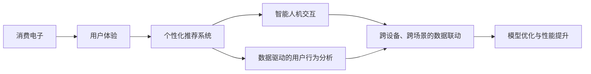
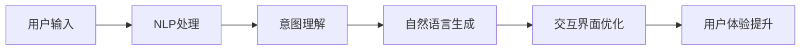
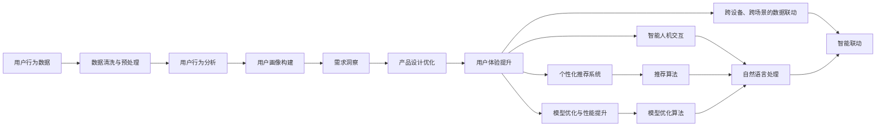

                 

# AI赋能消费电子与用户体验

> 关键词：人工智能,消费电子,用户体验,智能化,人机交互,用户行为分析,数据驱动,个性化推荐,智能推荐系统,智能家居,智能穿戴设备

## 1. 背景介绍

### 1.1 问题由来

随着科技的飞速发展，消费电子行业正经历一场前所未有的变革。从智能手机、智能家居到智能穿戴设备，各种新型电子产品的应用场景日益丰富，人们的生活变得更加智能化、便捷化。但与此同时，海量数据的涌现也带来了新的挑战：如何在有限的硬件资源上实现高效、流畅的智能体验？如何让设备真正理解用户需求，提供个性化服务？如何实现跨设备、跨场景的智能联动？这些问题不仅需要全新的技术手段，更需要从用户体验的角度进行深入思考。

人工智能（AI）技术的崛起为消费电子行业带来了新的解决方案。AI不仅可以实现对海量数据的深度分析和理解，还可以通过智能算法和模型优化，提供个性化的用户体验，提升设备的智能化水平。因此，AI成为消费电子行业智能化升级的重要驱动力，助力企业从传统硬件厂商向智能服务提供商转型。

### 1.2 问题核心关键点

AI赋能消费电子与用户体验的核心关键点在于：

1. **数据驱动的用户体验设计**：通过分析用户的行为数据，AI可以帮助企业洞察用户需求，优化用户体验。
2. **个性化推荐系统**：基于用户的历史行为和偏好，AI可以推荐个性化的产品和服务，提升用户粘性。
3. **智能人机交互**：AI驱动的自然语言处理和计算机视觉技术，可以实现更自然、更流畅的人机交互，提升用户满意度。
4. **智能联动与互联**：AI可以通过跨设备、跨场景的数据共享和协同，实现智能联动，提升用户的使用体验。
5. **模型优化与性能提升**：通过高效的模型训练和优化，AI可以在资源受限的硬件上实现高性能、低延迟的用户体验。

### 1.3 问题研究意义

研究AI在消费电子与用户体验中的应用，对于推动消费电子行业的智能化转型，提升用户的满意度和生活质量，具有重要意义：

1. **降低开发成本**：AI可以快速分析和处理海量数据，减少人工分析和测试的时间，降低开发成本。
2. **提升用户体验**：AI可以提供个性化推荐和智能互动，提升用户的参与度和满意度。
3. **优化产品设计**：AI可以洞察用户需求，指导产品设计，提升产品的竞争力。
4. **提升市场响应速度**：AI可以快速分析市场变化，及时调整产品策略，提升市场响应速度。
5. **驱动创新**：AI技术的发展将推动消费电子行业的技术创新，为新的应用场景和商业模式创造可能。

## 2. 核心概念与联系

### 2.1 核心概念概述

为更好地理解AI在消费电子与用户体验中的应用，本节将介绍几个密切相关的核心概念：

- **消费电子（Consumer Electronics, CE）**：指面向个人消费者的电子产品，包括智能家居、智能穿戴、智能车载、智能健康等领域。
- **用户体验（User Experience, UX）**：指用户在使用产品过程中，感受到的情感、满意度和效率。用户体验是产品设计的核心指标之一。
- **个性化推荐系统（Personalized Recommendation System）**：指基于用户行为和偏好，推荐个性化的产品或服务，提升用户的参与度和满意度。
- **智能人机交互（Intelligent Human-Machine Interaction）**：指通过自然语言处理、计算机视觉等技术，实现更自然、更流畅的人机对话和互动。
- **数据驱动的用户行为分析（Data-Driven User Behavior Analysis）**：指通过分析用户行为数据，洞察用户需求，优化产品设计和用户体验。
- **跨设备、跨场景的数据联动（Cross-Device, Cross-Scene Data Sync）**：指通过设备间的数据共享和协同，实现智能联动，提升用户的使用体验。
- **模型优化与性能提升（Model Optimization and Performance Improvement）**：指通过高效的模型训练和优化，提升AI模型的精度和性能，实现高性能、低延迟的智能体验。

这些核心概念之间的逻辑关系可以通过以下Mermaid流程图来展示：



这个流程图展示了大语言模型微调过程中各个核心概念的关系和作用：

1. 消费电子是应用背景。
2. 用户体验是优化目标。
3. 个性化推荐系统和智能人机交互是实现手段。
4. 数据驱动的用户行为分析是洞察依据。
5. 跨设备、跨场景的数据联动是协同基础。
6. 模型优化与性能提升是技术保障。

这些概念共同构成了AI赋能消费电子与用户体验的完整生态系统，使得AI技术能够在各种场景下提升用户体验，推动消费电子行业的发展。

### 2.2 概念间的关系

这些核心概念之间存在着紧密的联系，形成了AI在消费电子与用户体验中的完整应用框架。下面我们通过几个Mermaid流程图来展示这些概念之间的关系。

#### 2.2.1 数据驱动的用户行为分析


这个流程图展示了数据驱动的用户行为分析过程：从用户行为数据的收集、清洗与预处理，到用户画像的构建和需求洞察，最终指导产品设计优化和用户体验提升。

#### 2.2.2 个性化推荐系统


这个流程图展示了个性化推荐系统的实现过程：通过用户历史行为数据的特征提取和模型训练，应用推荐算法生成个性化推荐，从而提升用户的参与度和满意度。

#### 2.2.3 智能人机交互



这个流程图展示了智能人机交互的过程：用户输入经过自然语言处理和意图理解，生成自然语言回复并优化交互界面，从而提升用户体验。

#### 2.2.4 跨设备、跨场景的数据联动


这个流程图展示了跨设备、跨场景的数据联动过程：通过设备间的数据共享和同步，实现智能联动，提升用户的使用体验。

#### 2.2.5 模型优化与性能提升


这个流程图展示了模型优化与性能提升的过程：通过高效的模型训练和优化，提升AI模型的精度和性能，实现高性能、低延迟的智能体验。

### 2.3 核心概念的整体架构

最后，我们用一个综合的流程图来展示这些核心概念在大语言模型微调过程中的整体架构：



这个综合流程图展示了从数据收集、处理到产品优化、智能联动和模型优化的完整过程。通过这些流程图，我们可以更清晰地理解AI赋能消费电子与用户体验过程中各个核心概念的关系和作用，为后续深入讨论具体的AI技术应用奠定基础。

## 3. 核心算法原理 & 具体操作步骤
### 3.1 算法原理概述

AI赋能消费电子与用户体验的核心算法原理主要包括以下几个方面：

1. **数据驱动的用户行为分析**：通过分析用户行为数据，构建用户画像，洞察用户需求，指导产品设计优化和用户体验提升。

2. **个性化推荐系统**：基于用户历史行为和偏好，构建推荐模型，推荐个性化的产品和服务，提升用户参与度和满意度。

3. **智能人机交互**：通过自然语言处理和计算机视觉技术，实现更自然、更流畅的人机对话和互动。

4. **跨设备、跨场景的数据联动**：通过设备间的数据共享和协同，实现智能联动，提升用户的使用体验。

5. **模型优化与性能提升**：通过高效的模型训练和优化，提升AI模型的精度和性能，实现高性能、低延迟的智能体验。

### 3.2 算法步骤详解

#### 3.2.1 数据驱动的用户行为分析

**Step 1: 数据收集与预处理**
- 从各种设备（如智能手机、智能家居设备等）收集用户行为数据，包括点击、浏览、购买等行为。
- 对数据进行清洗和预处理，去除噪声和冗余数据，生成干净的用户行为记录。

**Step 2: 用户行为分析**
- 使用统计方法或机器学习算法对用户行为数据进行分析，挖掘用户行为模式和偏好。
- 通过聚类、分类等技术，构建用户画像，刻画用户的基本特征和行为习惯。

**Step 3: 需求洞察**
- 通过分析用户画像和行为数据，洞察用户需求，发现潜在问题和改进机会。
- 根据需求洞察结果，指导产品设计优化，提升用户体验。

#### 3.2.2 个性化推荐系统

**Step 1: 特征提取**
- 从用户历史行为数据中提取有意义的特征，如浏览记录、购买历史、兴趣爱好等。
- 使用向量空间模型、协同过滤等方法，将用户和商品表示为高维向量。

**Step 2: 模型训练**
- 选择适当的推荐算法，如矩阵分解、神经网络等，训练推荐模型。
- 使用交叉验证等技术，评估模型的性能，选择最优模型。

**Step 3: 个性化推荐**
- 根据用户画像和模型预测，生成个性化的推荐结果。
- 使用A/B测试等方法，评估推荐效果，不断优化推荐算法。

#### 3.2.3 智能人机交互

**Step 1: 自然语言处理（NLP）**
- 将用户的自然语言输入转化为计算机可理解的格式，包括分词、实体识别、意图理解等。
- 使用语言模型、分类器等技术，理解用户的意图和需求。

**Step 2: 自然语言生成（NLG）**
- 根据用户意图和需求，生成自然语言回复，提高人机交互的自然性和流畅性。
- 使用生成式模型、模板匹配等方法，生成合适的回复内容。

#### 3.2.4 跨设备、跨场景的数据联动

**Step 1: 数据共享与同步**
- 设计数据共享协议，确保不同设备间的数据安全传输和同步。
- 使用分布式数据库、消息队列等技术，实现数据的高效共享和同步。

**Step 2: 智能联动**
- 根据不同设备间的关联数据，实现跨设备、跨场景的智能联动。
- 使用协同过滤、协同学习等技术，提升联动效果。

#### 3.2.5 模型优化与性能提升

**Step 1: 模型训练**
- 使用GPU、TPU等高性能计算资源，训练大规模模型。
- 使用小批量随机梯度下降、优化器等技术，加速模型训练。

**Step 2: 模型优化**
- 使用正则化、剪枝、量化等技术，优化模型结构，提升模型性能。
- 使用混合精度训练、分布式训练等技术，提高训练效率。

**Step 3: 性能提升**
- 通过模型压缩、模型裁剪等技术，减小模型尺寸，提升推理速度。
- 使用硬件加速、推理优化等技术，提升性能和效率。

### 3.3 算法优缺点

AI赋能消费电子与用户体验的算法具有以下优点：

1. **高效的用户行为分析**：通过数据分析和机器学习，可以高效地洞察用户需求，优化用户体验。
2. **个性化推荐**：基于用户历史行为和偏好，提供个性化推荐，提升用户参与度和满意度。
3. **智能人机交互**：实现更自然、更流畅的人机对话和互动，提升用户体验。
4. **跨设备、跨场景联动**：通过数据共享和协同，实现智能联动，提升用户的使用体验。
5. **模型优化和性能提升**：通过高效的模型训练和优化，实现高性能、低延迟的智能体验。

但这些算法也存在一些缺点：

1. **数据隐私问题**：在数据收集和处理过程中，需要注意用户隐私和数据安全，避免数据泄露和滥用。
2. **计算资源消耗**：大规模模型的训练和优化需要高性能计算资源，可能对硬件和网络资源造成较大压力。
3. **模型复杂度**：复杂的推荐模型和智能交互算法，需要较高的技术门槛和专业知识。
4. **应用场景限制**：部分算法和模型可能只适用于特定场景，需要根据具体应用进行适配和调整。
5. **用户体验依赖**：算法的性能和效果，最终依赖于用户的参与和反馈，需要不断迭代和优化。

### 3.4 算法应用领域

AI赋能消费电子与用户体验的算法在多个领域得到了广泛应用，以下是一些典型的应用场景：

- **智能推荐**：在电商平台、视频平台、音乐平台等场景中，通过个性化推荐，提升用户满意度和粘性。
- **智能客服**：通过智能客服系统，实现24/7的客户服务，提升客户体验和满意度。
- **智能家居**：通过智能音箱、智能灯泡等设备，实现语音控制和场景联动，提升家居智能化水平。
- **智能穿戴设备**：通过智能手表、智能眼镜等设备，实现健康监测、运动追踪等功能，提升用户体验。
- **智能车载**：通过车载智能系统，实现导航、音乐、语音控制等功能，提升行车安全与便利性。
- **智能健康**：通过智能穿戴设备与健康平台的数据联动，实现健康监测、疾病预警等功能，提升健康水平。

此外，AI技术还被广泛应用于金融、旅游、交通等领域，推动各行业的智能化转型。

## 4. 数学模型和公式 & 详细讲解 & 举例说明

### 4.1 数学模型构建

在本节中，我们将通过数学语言对AI赋能消费电子与用户体验的核心算法进行严格的刻画。

#### 4.1.1 数据驱动的用户行为分析

**模型构建**
- 设用户行为数据集为 $\mathcal{D}=\{(x_i,y_i)\}_{i=1}^N$，其中 $x_i$ 表示用户行为记录，$y_i$ 表示用户标签（如年龄、性别、地域等）。
- 使用协同过滤、决策树等算法，对用户行为数据进行建模，得到用户画像 $\mathcal{P}=\{(u,p_u)\}_{u=1}^M$，其中 $u$ 为用户ID，$p_u$ 为用户的特征向量。

**公式推导**
- 用户画像的构建过程可以表示为：
  $$
  p_u = \mathcal{A}(x_u)
  $$
  其中 $\mathcal{A}$ 为特征提取函数，将用户行为数据 $x_u$ 映射为用户画像 $p_u$。

#### 4.1.2 个性化推荐系统

**模型构建**
- 设商品数据集为 $\mathcal{I}=\{(i,f_i)\}_{i=1}^M$，其中 $i$ 为商品ID，$f_i$ 为商品特征向量。
- 使用协同过滤、矩阵分解等算法，对用户和商品进行建模，得到推荐模型 $\mathcal{M}=\{(\mathcal{U},\mathcal{V},W)\}$，其中 $\mathcal{U}$ 为用户矩阵，$\mathcal{V}$ 为商品矩阵，$W$ 为推荐因子矩阵。

**公式推导**
- 推荐模型的预测结果可以表示为：
  $$
  \hat{r}_{iu} = \mathcal{M}(p_u,i)
  $$
  其中 $\hat{r}_{iu}$ 表示用户 $u$ 对商品 $i$ 的预测评分，$\mathcal{M}(p_u,i)$ 为推荐模型的预测函数。

#### 4.1.3 智能人机交互

**模型构建**
- 设用户输入序列为 $x=(x_1,x_2,\dots,x_n)$，其中 $x_i$ 为第 $i$ 个自然语言单词。
- 使用Transformer等模型，将用户输入序列映射为机器理解的语言表示 $h(x)$。

**公式推导**
- 语言表示的生成过程可以表示为：
  $$
  h(x) = \mathcal{L}(x;\theta)
  $$
  其中 $\mathcal{L}$ 为语言模型，$\theta$ 为模型参数。

#### 4.1.4 跨设备、跨场景的数据联动

**模型构建**
- 设设备数据集为 $\mathcal{D}=\{(d_i,f_i)\}_{i=1}^N$，其中 $d_i$ 为设备ID，$f_i$ 为设备特征向量。
- 使用图网络等算法，对设备数据进行建模，得到设备关联图 $\mathcal{G}=(\mathcal{V},\mathcal{E})$，其中 $\mathcal{V}$ 为节点集，$\mathcal{E}$ 为边集。

**公式推导**
- 设备关联图的边权重可以表示为：
  $$
  w_{ij} = \mathcal{E}(d_i,d_j)
  $$
  其中 $\mathcal{E}$ 为设备关联函数，$d_i$ 和 $d_j$ 为设备ID。

#### 4.1.5 模型优化与性能提升

**模型构建**
- 设训练数据集为 $\mathcal{D}=\{(x,y)\}_{i=1}^N$，其中 $x$ 为输入数据，$y$ 为标签。
- 使用深度学习模型，对训练数据进行建模，得到模型 $\mathcal{M}(x;\theta)$，其中 $\theta$ 为模型参数。

**公式推导**
- 模型训练的过程可以表示为：
  $$
  \theta = \mathcal{O}(\mathcal{D},\lambda)
  $$
  其中 $\mathcal{O}$ 为优化算法，$\lambda$ 为学习率。

### 4.2 公式推导过程

在本节中，我们将通过详细的公式推导，展示AI赋能消费电子与用户体验的核心算法。

#### 4.2.1 数据驱动的用户行为分析

**公式推导**
- 用户画像的构建过程可以表示为：
  $$
  p_u = \mathcal{A}(x_u) = \left(\frac{\sum_{i=1}^{n_u}x_{ui}v_i}{\sqrt{\sum_{i=1}^{n_u}v_i^2}}\right)
  $$
  其中 $x_{ui}$ 为用户行为记录中的特征，$v_i$ 为特征权重，$n_u$ 为特征数量。

#### 4.2.2 个性化推荐系统

**公式推导**
- 推荐模型的预测结果可以表示为：
  $$
  \hat{r}_{iu} = \mathcal{M}(p_u,i) = \mathbf{v}_u^T\mathbf{W}_i
  $$
  其中 $\mathbf{v}_u$ 为用户向量，$\mathbf{W}_i$ 为商品因子向量。

#### 4.2.3 智能人机交互

**公式推导**
- 语言模型的生成过程可以表示为：
  $$
  h(x) = \mathcal{L}(x;\theta) = \prod_{i=1}^{n}p(x_i|\{x_{i-1},\theta\})
  $$
  其中 $p(x_i|\{x_{i-1},\theta\})$ 为条件概率分布，$\theta$ 为模型参数。

#### 4.2.4 跨设备、跨场景的数据联动

**公式推导**
- 设备关联图的边权重可以表示为：
  $$
  w_{ij} = \mathcal{E}(d_i,d_j) = \alpha(d_i,d_j)
  $$
  其中 $\alpha$ 为设备关联函数，$d_i$ 和 $d_j$ 为设备ID。

#### 4.2.5 模型优化与性能提升

**公式推导**
- 模型训练的过程可以表示为：
  $$
  \theta = \mathcal{O}(\mathcal{D},\lambda) = \mathcal{O}\left(\frac{1}{N}\sum_{i=1}^N\ell(\mathcal{M}(x_i;\theta),y_i);\lambda\right)
  $$
  其中 $\ell$ 为损失函数，$\lambda$ 为学习率。

### 4.3 案例分析与讲解

#### 4.3.1 用户行为分析案例

**案例背景**
- 某智能家居公司希望通过用户行为数据，优化其智能音箱的功能和用户体验。公司收集了用户在使用智能音箱时，与智能音箱的交互记录，包括语音指令、歌曲播放记录等。

**分析过程**
- 首先，对用户行为数据进行清洗和预处理，去除噪声和冗余数据。
- 使用协同过滤算法，对用户行为数据进行建模，构建用户画像，刻画用户的基本特征和行为习惯。
- 根据用户画像和行为数据，洞察用户需求，发现潜在问题和改进机会。
- 指导智能音箱的功能设计，提升用户体验。

#### 4.3.2 个性化推荐系统案例

**案例背景**
- 某电商公司希望通过个性化推荐，提升用户粘性和满意度。公司收集了用户的历史浏览、购买记录，并使用商品标签对商品进行标注。

**推荐过程**
- 首先，从用户历史行为数据中提取有意义的特征，如浏览记录、购买历史、兴趣爱好等。
- 使用协同过滤算法，对用户和商品进行建模，构建推荐模型。
- 使用交叉验证等技术，评估模型的性能，选择最优模型。
- 根据用户画像和模型预测，生成个性化的推荐结果。
- 使用A/B测试等方法，评估推荐效果，不断优化推荐算法。

#### 4.3.3 智能人机交互案例

**案例背景**
- 某智能客服公司希望通过智能客服系统，提升客户体验和满意度。公司收集了用户与客服系统的对话记录，并使用自然语言处理技术进行分析。

**交互过程**
- 将用户的自然语言输入转化为计算机可理解的格式，包括分词、实体识别、意图理解等。
- 使用语言模型，理解用户的意图和需求。
- 生成自然语言回复，提高人机交互的自然性和流畅性。
- 使用生成式模型、模板匹配等方法，生成合适的回复内容。

#### 4.3.4 跨设备、跨场景的数据联动案例

**案例背景**
- 某智能穿戴设备公司希望通过设备间的数据共享和协同，提升用户体验。公司收集了用户的健康监测数据、运动记录等，并使用设备关联图进行建模。

**联动过程**
- 设计数据共享协议，确保不同设备间的数据安全传输和同步。
- 使用分布式数据库、消息队列等技术，实现数据的高效共享和同步。
- 根据设备关联数据，实现跨设备、跨场景的智能联动。
- 使用协同过滤、协同学习等技术，提升联动效果。

#### 4.3.5 模型优化与性能提升案例

**案例背景**
- 某智能推荐系统希望通过高效的模型训练和优化，提升推荐性能。公司收集了用户的历史行为数据和商品数据，并使用深度学习模型进行建模。

**优化过程**
- 使用GPU、TPU等高性能计算资源，训练大规模模型。
- 使用小批量随机梯度下降、优化器等技术，加速模型训练。
- 使用正则化、剪枝、量化等技术，优化模型结构，提升模型性能。
- 使用混合精度训练、分布式训练等技术，提高训练效率。
- 通过模型压缩、模型裁剪等技术，减小模型尺寸，提升推理速度。
- 使用硬件加速、推理优化等技术，提升性能和效率。

## 5. 项目实践：代码实例和详细解释说明

### 5.1 开发环境搭建

在进行AI赋能消费电子与用户体验的项目实践前，我们需要准备好开发环境。以下是使用Python进行PyTorch开发的环境配置流程：

1. 安装Anaconda：从官网下载并安装Anaconda，用于创建独立的Python环境。

2. 创建并激活虚拟环境：
```bash
conda create -n pytorch-env python=3.8 
conda activate pytorch-env
```

3. 安装PyTorch：根据CUDA版本，从官网获取对应的安装命令。例如：
```bash
conda install pytorch torchvision torchaudio cudatoolkit=11.1 -c pytorch -c conda-forge


