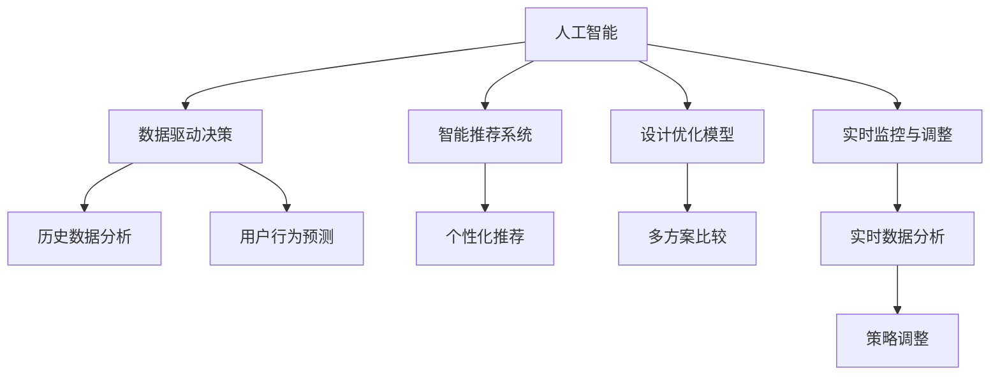
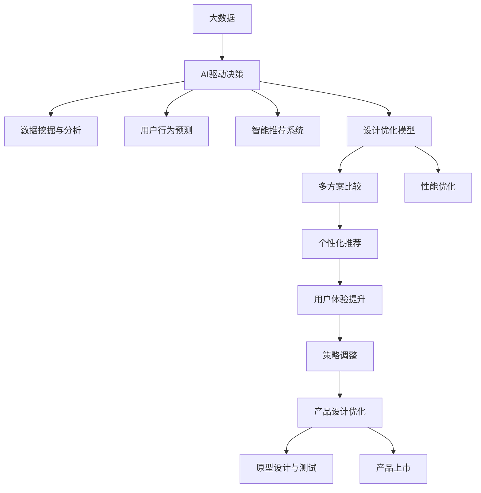

                 

# AI辅助决策在产品设计中的作用

## 1. 背景介绍

### 1.1 问题由来
在当今快速变化的市场环境中，产品设计者面临着越来越复杂且多样化的决策挑战。如何在有限的时间资源和信息下做出最优决策，成为产品设计中的核心难题。AI辅助决策技术，通过数据驱动、模型优化和智能推荐，为产品设计者提供了有力的支持。

### 1.2 问题核心关键点
AI辅助决策的核心在于将大数据和机器学习技术应用到产品设计的各个环节，帮助设计者理解市场需求、优化设计方案、提升产品竞争力。关键点包括：

1. **数据驱动决策**：利用历史数据和用户反馈，预测未来趋势和用户行为。
2. **智能推荐系统**：基于用户行为和偏好，提供个性化的设计建议。
3. **设计优化模型**：使用机器学习算法优化设计方案，提高产品性能和用户体验。
4. **实时监控与调整**：通过实时数据分析，及时调整产品设计策略。

### 1.3 问题研究意义
AI辅助决策技术为产品设计带来了革命性的变化，有助于：

1. **提高决策效率**：快速分析海量数据，提供精准的决策建议。
2. **优化设计方案**：利用AI模型进行多方案比较，找到最优解。
3. **提升用户体验**：通过智能推荐，满足用户个性化需求。
4. **降低设计成本**：减少原型设计和测试次数，加速产品上市。
5. **保持竞争优势**：持续创新，适应市场变化。

## 2. 核心概念与联系

### 2.1 核心概念概述

为更好地理解AI辅助决策在产品设计中的应用，本节将介绍几个密切相关的核心概念：

1. **人工智能（AI）**：利用计算机模拟和实现人的智能过程，包括感知、学习、推理、决策等能力。
2. **数据驱动决策（Data-Driven Decision Making）**：基于数据和分析，而非直觉或经验进行决策的过程。
3. **智能推荐系统（Recommendation Systems）**：通过分析用户行为，推荐个性化的产品或服务。
4. **设计优化模型（Design Optimization Models）**：使用机器学习算法优化设计方案，提高产品性能和用户体验。
5. **实时监控与调整（Real-time Monitoring and Adjustment）**：通过实时数据分析，及时调整产品设计策略。

这些核心概念之间的逻辑关系可以通过以下Mermaid流程图来展示：



这个流程图展示了大数据、AI技术和产品设计之间的联系：

1. 人工智能通过数据驱动和智能推荐，为产品设计提供决策支持。
2. 设计优化模型利用机器学习，不断优化设计方案。
3. 实时监控与调整确保产品设计策略的灵活性和适应性。

### 2.2 概念间的关系

这些核心概念之间存在着紧密的联系，形成了AI辅助决策在产品设计中的完整生态系统。

1. **人工智能与数据驱动决策**：数据驱动决策是AI技术的核心应用之一，通过分析历史数据和实时数据，指导产品设计。
2. **智能推荐系统与设计优化模型**：智能推荐系统为用户提供个性化设计建议，而设计优化模型通过优化方案，提升产品性能和用户体验。
3. **实时监控与调整**：实时数据分析帮助设计者及时调整策略，保持产品设计的动态优化。

### 2.3 核心概念的整体架构

最后，我们用一个综合的流程图来展示这些核心概念在产品设计中的应用：



这个综合流程图展示了从大数据采集到产品上市的全流程AI辅助决策过程。

## 3. 核心算法原理 & 具体操作步骤

### 3.1 算法原理概述

AI辅助决策在产品设计中的应用，主要基于以下几个算法原理：

1. **数据预处理与特征工程**：对原始数据进行清洗、转换和特征提取，确保数据质量。
2. **机器学习模型训练**：使用各种机器学习算法（如回归、分类、聚类、深度学习等）训练模型。
3. **模型评估与优化**：通过交叉验证等方法评估模型性能，优化模型参数。
4. **实时数据分析**：使用流式处理框架（如Apache Kafka、Apache Flink等）进行实时数据处理和分析。
5. **策略调整与优化**：基于实时数据分析结果，动态调整设计策略。

### 3.2 算法步骤详解

以下是AI辅助决策在产品设计中具体实施的详细步骤：

**Step 1: 数据采集与预处理**
- 收集用户反馈、市场数据、竞争产品信息等数据。
- 进行数据清洗、去重、归一化等预处理操作。
- 进行特征提取，如用户行为、兴趣、偏好等。

**Step 2: 模型训练与优化**
- 选择适当的机器学习算法，如随机森林、深度学习等。
- 使用历史数据进行模型训练。
- 通过交叉验证等方法评估模型性能，选择最优模型。
- 使用正则化、剪枝等方法优化模型参数。

**Step 3: 智能推荐与设计优化**
- 基于用户行为数据，构建推荐模型，生成个性化设计建议。
- 使用多方案比较算法，优化设计方案。
- 通过用户反馈数据，不断调整和优化设计方案。

**Step 4: 实时监控与策略调整**
- 使用流式处理框架实时采集数据。
- 进行实时数据分析，监测用户行为和市场变化。
- 根据实时数据分析结果，动态调整产品设计策略。

**Step 5: 原型设计与测试**
- 根据优化后的设计方案，进行原型设计和开发。
- 进行用户测试和反馈收集。
- 根据测试结果，进一步优化设计方案。

**Step 6: 产品上市与迭代优化**
- 将优化后的设计方案应用于产品开发。
- 持续监测用户反馈，进行产品迭代优化。

### 3.3 算法优缺点

AI辅助决策在产品设计中具有以下优点：
1. 高效准确：利用机器学习算法，快速分析海量数据，提供精准的决策建议。
2. 个性化设计：基于用户行为和偏好，提供个性化的设计方案。
3. 动态优化：实时监控和调整，确保产品设计策略的灵活性和适应性。

同时，该方法也存在一些局限性：
1. 数据依赖：依赖高质量、完整的数据集。
2. 算法复杂：需要复杂的机器学习算法和模型优化。
3. 模型解释性不足：黑箱模型难以解释其决策逻辑。
4. 技术门槛高：需要较强的数据处理和机器学习背景。

### 3.4 算法应用领域

AI辅助决策技术在产品设计中已经得到了广泛应用，涵盖多个领域，例如：

1. **移动应用设计**：通过分析用户行为数据，优化移动应用界面和功能。
2. **网页设计**：利用用户点击和停留数据，优化网页布局和内容。
3. **产品原型设计**：结合市场分析数据，生成最优产品原型。
4. **用户界面设计**：通过用户反馈数据，调整UI/UX设计。
5. **营销策略制定**：基于用户行为数据，制定个性化营销方案。
6. **服务推荐系统**：为用户提供个性化的服务推荐。

## 4. 数学模型和公式 & 详细讲解 & 举例说明

### 4.1 数学模型构建

在AI辅助决策中，常见的数学模型包括线性回归、决策树、随机森林、深度学习等。这里以线性回归为例，介绍数学模型的构建过程。

假设设计方案 $x$ 与用户满意度 $y$ 之间的关系为线性关系，即：

$$
y = \theta_0 + \theta_1 x_1 + \theta_2 x_2 + ... + \theta_n x_n + \epsilon
$$

其中 $\theta_0, \theta_1, ..., \theta_n$ 为线性回归模型的参数，$\epsilon$ 为误差项。

### 4.2 公式推导过程

在线性回归模型的推导过程中，我们使用最小二乘法来求解参数 $\theta_0, \theta_1, ..., \theta_n$。具体步骤如下：

1. 定义损失函数 $L(\theta)$：
$$
L(\theta) = \frac{1}{2} \sum_{i=1}^m (y_i - \hat{y}_i)^2
$$
其中 $y_i$ 为第 $i$ 个样本的实际值，$\hat{y}_i$ 为模型预测值，$m$ 为样本数量。

2. 求导数并令其为0，解出参数 $\theta$：
$$
\frac{\partial L(\theta)}{\partial \theta_j} = 0 \quad \text{对于 } j = 0, 1, ..., n
$$

3. 解方程组得到参数 $\theta$：
$$
\theta = (\mathbf{X}^T \mathbf{X})^{-1} \mathbf{X}^T \mathbf{y}
$$
其中 $\mathbf{X}$ 为特征矩阵，$\mathbf{y}$ 为目标向量。

### 4.3 案例分析与讲解

假设我们收集了500个用户对手机应用的使用满意度数据，包括应用功能、界面设计、响应速度等特征，以及用户对这些特征的满意度评分。我们可以使用线性回归模型，分析各特征对用户满意度的影响，并根据预测结果，优化设计方案。

**案例一：功能优化**

假设我们选择了5个功能作为影响用户满意度的关键特征，分别记为 $x_1, x_2, x_3, x_4, x_5$，满意度评分记为 $y$。通过对数据进行预处理和特征提取，我们得到了如下特征矩阵 $\mathbf{X}$ 和目标向量 $\mathbf{y}$：

$$
\mathbf{X} = \begin{bmatrix}
1 & 2.5 & 3.2 & 4.7 & 5.1 \\
1 & 2.7 & 4.1 & 4.5 & 5.3 \\
1 & 3.3 & 3.2 & 4.9 & 5.5 \\
\vdots & \vdots & \vdots & \vdots & \vdots \\
1 & 4.8 & 4.2 & 5.0 & 5.1
\end{bmatrix}, \quad
\mathbf{y} = \begin{bmatrix}
4.2 \\
4.5 \\
4.8 \\
\vdots \\
5.0
\end{bmatrix}
$$

使用线性回归模型，可以得到参数 $\theta = (\mathbf{X}^T \mathbf{X})^{-1} \mathbf{X}^T \mathbf{y}$。通过对比模型预测值和实际值，可以评估各功能对用户满意度的影响，进而优化设计方案。

**案例二：界面设计**

假设我们通过用户点击和停留数据，分析了不同界面布局对用户满意度的影响。我们可以使用决策树模型，生成界面设计的推荐方案。

通过特征选择和数据分割，我们得到了训练集和测试集，并使用决策树模型进行训练和评估。最终，我们可以生成最优的界面设计方案，提升用户满意度。

## 5. 项目实践：代码实例和详细解释说明

### 5.1 开发环境搭建

在进行AI辅助决策实践前，我们需要准备好开发环境。以下是使用Python进行Scikit-learn开发的环境配置流程：

1. 安装Anaconda：从官网下载并安装Anaconda，用于创建独立的Python环境。

2. 创建并激活虚拟环境：
```bash
conda create -n sklearn-env python=3.8 
conda activate sklearn-env
```

3. 安装Scikit-learn和其他依赖库：
```bash
conda install scikit-learn pandas numpy matplotlib seaborn joblib
```

4. 安装TensorFlow和Keras：
```bash
pip install tensorflow keras
```

完成上述步骤后，即可在`sklearn-env`环境中开始AI辅助决策实践。

### 5.2 源代码详细实现

这里我们以线性回归模型为例，给出使用Scikit-learn库进行AI辅助决策的Python代码实现。

首先，定义数据集和目标变量：

```python
import pandas as pd
import numpy as np

# 读取数据集
data = pd.read_csv('user_feedback.csv')

# 定义特征和目标变量
X = data[['功能1', '功能2', '功能3', '功能4', '功能5']]
y = data['满意度']
```

然后，构建线性回归模型并进行训练和评估：

```python
from sklearn.linear_model import LinearRegression
from sklearn.model_selection import train_test_split
from sklearn.metrics import mean_squared_error

# 划分训练集和测试集
X_train, X_test, y_train, y_test = train_test_split(X, y, test_size=0.2, random_state=42)

# 创建线性回归模型
model = LinearRegression()

# 训练模型
model.fit(X_train, y_train)

# 预测并评估模型
y_pred = model.predict(X_test)
mse = mean_squared_error(y_test, y_pred)
print(f"均方误差: {mse:.3f}")
```

最后，可视化模型结果并进行策略调整：

```python
import matplotlib.pyplot as plt

# 可视化结果
plt.scatter(X_test, y_test, label='实际值')
plt.scatter(X_test, y_pred, label='预测值', color='red')
plt.legend()
plt.show()

# 策略调整
# 根据预测结果，调整设计方案
# ...
```

以上就是使用Scikit-learn对用户满意度数据进行线性回归模型训练的完整代码实现。可以看到，得益于Scikit-learn的强大封装，我们可以用相对简洁的代码完成线性回归模型的训练和评估。

### 5.3 代码解读与分析

让我们再详细解读一下关键代码的实现细节：

**数据处理**：
- `pandas` 和 `numpy` 库用于数据读取和处理，定义特征和目标变量。

**模型训练**：
- `train_test_split` 函数用于数据划分，将数据集分为训练集和测试集。
- `LinearRegression` 类用于构建线性回归模型。
- `fit` 方法用于训练模型，拟合特征与目标变量之间的关系。

**模型评估**：
- `mean_squared_error` 函数用于计算均方误差，评估模型预测值与实际值之间的差异。
- `predict` 方法用于预测新数据的输出值。

**可视化**：
- `matplotlib` 库用于绘制散点图，可视化模型预测结果。

**策略调整**：
- 根据可视化结果，调整设计方案，优化产品设计。

## 6. 实际应用场景

### 6.1 智能推荐系统

智能推荐系统是AI辅助决策在产品设计中的一个典型应用。通过分析用户行为和偏好，推荐个性化产品或服务，提升用户体验。

**案例一：电商网站**

电商网站可以通过推荐系统，推荐用户可能感兴趣的商品。通过分析用户浏览、点击、购买等行为数据，推荐系统可以生成个性化的商品推荐列表，提升用户购买率。

**案例二：视频平台**

视频平台可以通过推荐系统，推荐用户可能喜欢的视频内容。通过分析用户观看历史、点赞、评论等行为数据，推荐系统可以生成个性化的视频推荐列表，提高用户粘性。

### 6.2 界面设计优化

界面设计优化是AI辅助决策在产品设计中的另一个重要应用。通过分析用户行为数据，优化界面布局和内容，提升用户满意度。

**案例一：手机应用**

手机应用可以通过界面设计优化，提升用户使用体验。通过分析用户点击、停留、退出等行为数据，界面设计优化可以生成最优的界面布局方案，提升用户满意度。

**案例二：网站页面**

网站页面可以通过界面设计优化，提升用户停留和转化率。通过分析用户点击、停留、跳转等行为数据，界面设计优化可以生成最优的页面布局方案，提升用户粘性。

### 6.3 服务推荐系统

服务推荐系统是AI辅助决策在服务设计中的重要应用。通过分析用户行为和偏好，推荐个性化的服务方案，提升服务质量。

**案例一：旅游平台**

旅游平台可以通过服务推荐系统，推荐用户可能感兴趣的服务。通过分析用户历史行程、兴趣点、评分等数据，服务推荐系统可以生成个性化的服务推荐列表，提升用户满意度。

**案例二：在线教育平台**

在线教育平台可以通过服务推荐系统，推荐用户可能感兴趣的学习内容。通过分析用户学习历史、偏好、评分等数据，服务推荐系统可以生成个性化的学习内容推荐列表，提升用户学习效果。

## 7. 工具和资源推荐

### 7.1 学习资源推荐

为了帮助开发者系统掌握AI辅助决策的理论基础和实践技巧，这里推荐一些优质的学习资源：

1. **《机器学习》（周志华著）**：介绍机器学习的基本概念、算法和应用，适合初学者入门。
2. **《Python数据科学手册》（Jake VanderPlas著）**：详细介绍了Python数据科学库，如NumPy、Pandas、Scikit-learn等。
3. **《深度学习》（Ian Goodfellow、Yoshua Bengio、Aaron Courville著）**：深入浅出地介绍了深度学习的原理和实践。
4. **Coursera《机器学习》课程**：斯坦福大学开设的机器学习课程，提供丰富的视频、作业和项目实践。
5. **Kaggle竞赛平台**：通过参加数据科学竞赛，实战锻炼AI辅助决策技术。

通过对这些资源的学习实践，相信你一定能够快速掌握AI辅助决策的精髓，并用于解决实际的产品设计问题。

### 7.2 开发工具推荐

高效的开发离不开优秀的工具支持。以下是几款用于AI辅助决策开发的常用工具：

1. **Jupyter Notebook**：提供交互式编程环境，方便进行数据处理和模型开发。
2. **TensorBoard**：可视化模型训练过程和结果，帮助调试和优化模型。
3. **Apache Kafka**：流式数据处理框架，适合实时数据采集和处理。
4. **Apache Flink**：流式数据处理框架，支持实时数据处理和分析。
5. **PyTorch**：深度学习框架，提供强大的模型构建和训练能力。

合理利用这些工具，可以显著提升AI辅助决策任务的开发效率，加快创新迭代的步伐。

### 7.3 相关论文推荐

AI辅助决策技术的发展源于学界的持续研究。以下是几篇奠基性的相关论文，推荐阅读：

1. **《随机森林》（Tibshirani、Thompson、Hubbard著）**：介绍随机森林算法的基本原理和应用。
2. **《深度学习》（Goodfellow、Bengio、Courville著）**：全面介绍了深度学习的原理和实践。
3. **《推荐系统》（Lichman、Konstan、Riedl著）**：详细介绍了推荐系统的基本原理和应用。
4. **《机器学习实战》（Peter Harrington著）**：介绍了多种机器学习算法及其应用。
5. **《A Survey on Deep Learning Based Recommender Systems》**：综述了基于深度学习的推荐系统研究进展。

这些论文代表了大数据和AI技术的发展脉络，通过学习这些前沿成果，可以帮助研究者把握学科前进方向，激发更多的创新灵感。

除上述资源外，还有一些值得关注的前沿资源，帮助开发者紧跟AI辅助决策技术的最新进展，例如：

1. **arXiv论文预印本**：人工智能领域最新研究成果的发布平台，包括大量尚未发表的前沿工作，学习前沿技术的必读资源。
2. **顶会论文集**：如NeurIPS、ICML、CVPR等顶级会议的论文集，涵盖最新的研究成果和前沿动态。
3. **技术博客**：如Google AI、DeepMind、OpenAI等顶尖实验室的官方博客，第一时间分享他们的最新研究成果和洞见。
4. **开源项目**：在GitHub上Star、Fork数最多的数据科学相关项目，往往代表了该技术领域的发展趋势和最佳实践，值得去学习和贡献。

总之，对于AI辅助决策技术的学习和实践，需要开发者保持开放的心态和持续学习的意愿。多关注前沿资讯，多动手实践，多思考总结，必将收获满满的成长收益。

## 8. 总结：未来发展趋势与挑战

### 8.1 总结

本文对AI辅助决策在产品设计中的应用进行了全面系统的介绍。首先阐述了AI辅助决策的研究背景和意义，明确了其在产品设计中的独特价值。其次，从原理到实践，详细讲解了AI辅助决策的数学模型和关键步骤，给出了具体代码实例。同时，本文还广泛探讨了AI辅助决策在智能推荐、界面设计优化、服务推荐系统等多个领域的应用前景，展示了其在产品设计中的巨大潜力。

通过本文的系统梳理，可以看到，AI辅助决策技术为产品设计带来了革命性的变化，有助于：

1. **提高决策效率**：快速分析海量数据，提供精准的决策建议。
2. **优化设计方案**：利用AI模型进行多方案比较，找到最优解。
3. **提升用户体验**：通过智能推荐，满足用户个性化需求。
4. **降低设计成本**：减少原型设计和测试次数，加速产品上市。
5. **保持竞争优势**：持续创新，适应市场变化。

### 8.2 未来发展趋势

展望未来，AI辅助决策技术将呈现以下几个发展趋势：

1. **智能化水平提升**：随着深度学习和大数据技术的发展，AI辅助决策的智能化水平将进一步提升，能够处理更加复杂多变的数据。
2. **多模态融合**：将文本、图像、视频等多模态数据进行融合，提升数据建模和决策能力。
3. **自适应学习**：AI辅助决策系统能够根据环境变化，动态调整策略，提升适应性和鲁棒性。
4. **跨领域应用**：AI辅助决策技术将逐步扩展到更多领域，如医疗、教育、金融等，实现跨领域应用。
5. **实时性增强**：通过流式数据处理和实时数据分析，实现实时决策和动态优化。

以上趋势凸显了AI辅助决策技术的广阔前景。这些方向的探索发展，必将进一步提升产品设计的效率和效果，推动企业创新和市场竞争力的提升。

### 8.3 面临的挑战

尽管AI辅助决策技术已经取得了瞩目成就，但在迈向更加智能化、普适化应用的过程中，它仍面临着诸多挑战：

1. **数据质量问题**：数据采集和处理过程中的噪声和偏差，会影响模型的决策效果。
2. **模型解释性不足**：许多AI模型难以解释其决策过程，导致设计者难以理解模型结果。
3. **技术复杂性**：开发和维护AI辅助决策系统需要较高的技术门槛，增加了企业实施成本。
4. **隐私和伦理问题**：数据隐私和安全问题，以及模型决策的伦理导向，需要引起重视。
5. **资源消耗高**：大规模数据处理和模型训练需要大量计算资源，增加了系统运行成本。

### 8.4 研究展望

面对AI辅助决策面临的这些挑战，未来的研究需要在以下几个方面寻求新的突破：

1. **数据清洗和预处理**：开发更高效的数据清洗和预处理算法，提高数据质量。
2. **可解释性增强**：引入可解释性模型和技术，增强模型的决策透明度。
3. **轻量化模型**：开发轻量化模型架构，降低系统资源消耗。
4. **跨领域应用**：探索跨领域知识融合的模型架构，实现多领域协同优化。
5. **隐私保护**：引入隐私保护技术，保障用户数据安全和隐私。
6. **实时处理框架**：开发高效的实时数据处理框架，支持实时决策和动态优化。

这些研究方向的探索，必将引领AI辅助决策技术迈向更高的台阶，为产品设计提供更加智能、高效和安全的支持。面向未来，AI辅助决策技术还需要与其他AI技术进行更深入的融合，如自然语言处理、计算机视觉、强化学习等，共同推动产品设计的创新和进步。

## 9. 附录：常见问题与解答

**Q1：AI辅助决策是否适用于所有产品设计领域？**

A: AI辅助决策技术在大多数产品设计领域中都能发挥作用，但不同的设计任务对数据和模型的依赖程度不同。例如，界面设计和用户体验优化可以通过智能推荐系统实现，而产品原型设计和营销策略制定则需要更加复杂的模型和算法。

**Q2：如何选择适合的机器学习算法？**

A: 选择适合的机器学习算法需要考虑数据类型、任务目标和模型性能等因素。例如，对于分类任务，可以选择决策树、支持向量机等算法；对于回归任务，可以选择线性回归、随机森林等算法；对于序列数据，可以选择LSTM、GRU等序列模型。

**Q3：如何评估模型性能？**

A: 评估模型性能通常使用交叉验证、均方误差、准确率等指标。例如，在回归任务中，可以使用均方误差（MSE）来衡量模型预测值与实际值之间的差异；在分类任务中，可以使用准确率、召回率、F1分数等指标来评估模型性能。

**Q4：模型训练过程中需要注意哪些问题？**

A

