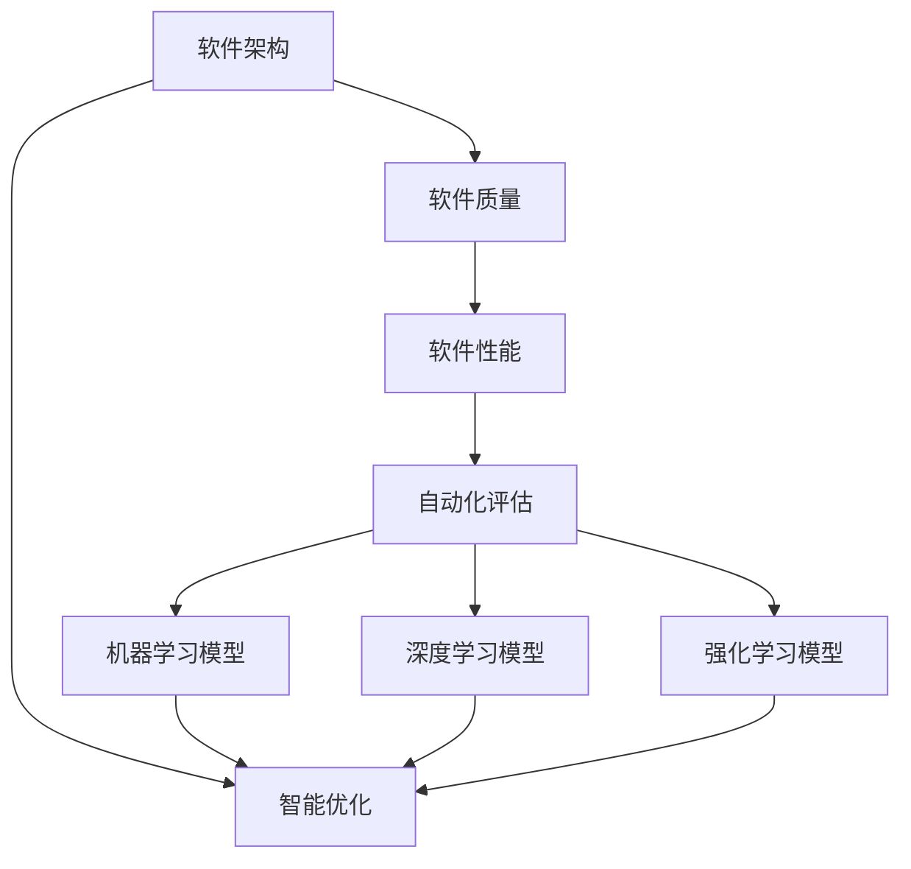
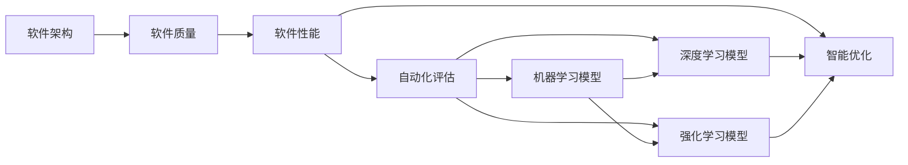

                 

# AI辅助的软件架构评估与优化

> 关键词：软件架构, 软件质量, 自动化评估, 软件优化, AI技术, 模型构建, 算法原理, 实际应用

## 1. 背景介绍

### 1.1 问题由来

在现代软件开发过程中，软件架构的设计和优化是决定系统性能、可维护性和扩展性的关键因素。然而，随着系统规模的不断扩大和业务需求的不断变化，传统的软件架构评估方法已难以应对复杂的系统特性和需求约束。这时，AI技术，尤其是AI辅助的软件架构评估与优化，为软件架构师提供了新的工具和方法，极大地提升了软件设计和优化的效率和精度。

### 1.2 问题核心关键点

AI辅助的软件架构评估与优化主要基于两个关键点：

1. 数据驱动的评估：通过收集和分析系统的运行数据，自动评估软件架构的性能和质量。
2. 智能优化：利用AI模型预测软件架构的变化对性能的影响，辅助架构师做出优化决策。

这些关键点使得AI技术在软件架构设计和优化过程中，能够提供数据驱动的洞察，增强决策的科学性和系统性。

### 1.3 问题研究意义

AI辅助的软件架构评估与优化研究具有重要的意义：

1. **提高开发效率**：通过自动化评估和优化，大大减少架构师的手动工作量，缩短设计周期。
2. **提升系统性能**：利用数据驱动的优化方法，显著提升系统的运行效率和稳定性。
3. **增强系统可维护性**：通过智能化的优化建议，辅助架构师识别和修正潜在的设计缺陷，提高系统的可维护性。
4. **支持动态优化**：AI模型能够实时预测和推荐架构优化策略，使系统能够快速适应变化的需求和技术环境。
5. **促进跨学科交流**：将AI技术引入软件架构设计，促进软件开发与数据科学、机器学习的跨学科融合，推动技术创新。

## 2. 核心概念与联系

### 2.1 核心概念概述

为更好地理解AI辅助的软件架构评估与优化方法，本节将介绍几个关键概念：

- **软件架构**：定义了系统的整体结构和组件间的交互方式，是软件系统的骨架。常见的软件架构包括微服务、事件驱动、Monolithic等。

- **软件质量**：描述了软件系统在功能、性能、可靠性、安全性和可维护性等方面的特征。

- **软件性能**：衡量软件系统响应时间、吞吐量、并发能力等运行效率指标。

- **自动化评估**：通过自动化的工具和技术，对软件架构的性能、质量、可靠性等指标进行量化评估。

- **智能优化**：利用AI技术对软件架构进行自动化的优化决策，辅助架构师制定更优的架构设计。

- **模型构建**：构建用于评估和优化的AI模型，包括特征工程、模型训练和评估等环节。

- **算法原理**：介绍了用于软件架构评估与优化的核心算法，包括机器学习、深度学习、强化学习等方法。

- **实际应用**：展示了AI辅助软件架构评估与优化方法在实际软件开发过程中的具体应用。

这些概念之间的联系可以通过以下Mermaid流程图来展示：



这个流程图展示了从软件架构到软件性能的完整过程，以及如何利用AI技术进行自动化评估和智能优化。

### 2.2 概念间的关系

这些核心概念之间的关系可以通过以下Mermaid流程图来展示：



这个流程图展示了从软件架构到软件性能的完整过程，以及如何利用AI技术进行自动化评估和智能优化。

## 3. 核心算法原理 & 具体操作步骤
### 3.1 算法原理概述

AI辅助的软件架构评估与优化主要基于机器学习、深度学习和强化学习等AI算法。这些算法通过分析软件架构的特征，学习其与软件性能之间的关系，进而自动化评估和优化软件架构。

### 3.2 算法步骤详解

AI辅助的软件架构评估与优化的基本步骤如下：

1. **数据收集**：从系统运行日志、性能监控工具、代码库等多个来源收集软件架构的相关数据。

2. **数据预处理**：清洗和处理原始数据，提取有用的特征，如组件的交互次数、系统响应时间等。

3. **模型训练**：构建机器学习、深度学习或强化学习模型，使用历史数据训练模型，学习软件架构特征与性能之间的关系。

4. **模型评估**：使用验证集对训练好的模型进行评估，确保模型的泛化能力和预测准确性。

5. **智能优化**：利用训练好的模型，对当前软件架构进行自动化评估和优化建议，辅助架构师进行决策。

6. **迭代优化**：根据实际效果，不断迭代模型和优化策略，提高评估和优化的精度和效果。

### 3.3 算法优缺点

AI辅助的软件架构评估与优化的优点包括：

- **自动化评估**：通过数据驱动的自动化评估，减少了架构师的手动工作量，提高了评估效率和准确性。
- **智能优化**：AI模型能够识别潜在的性能瓶颈和设计缺陷，提供智能化的优化建议，辅助架构师进行决策。
- **支持动态优化**：AI模型能够实时预测和推荐架构优化策略，使系统能够快速适应变化的需求和技术环境。

同时，该方法也存在一定的局限性：

- **数据质量要求高**：AI模型的评估效果依赖于数据的质量和完整性，不准确的数据可能导致错误的评估结果。
- **模型复杂度高**：构建和训练高质量的AI模型需要较高的计算资源和专业知识。
- **难以解释**：AI模型通常被认为是"黑盒"，难以解释其内部工作机制和决策逻辑。

尽管存在这些局限性，但就目前而言，AI辅助的软件架构评估与优化方法仍是提高软件系统质量和性能的重要手段。未来相关研究的重点在于如何进一步降低模型训练的复杂度，提高模型的可解释性，以及降低对数据质量的要求。

### 3.4 算法应用领域

AI辅助的软件架构评估与优化方法在软件开发过程中具有广泛的应用，主要包括以下几个领域：

1. **系统设计阶段**：在系统的初期设计和架构规划阶段，利用AI模型预测不同架构设计对系统性能的影响，辅助架构师进行决策。

2. **性能优化阶段**：在系统开发和部署过程中，利用AI模型识别性能瓶颈和资源浪费，提供优化建议，提升系统性能。

3. **故障诊断阶段**：在系统运行过程中，利用AI模型分析系统日志和监控数据，快速定位和诊断系统故障。

4. **安全加固阶段**：在系统设计和优化过程中，利用AI模型识别潜在的安全风险和漏洞，提供加固建议，提高系统安全性。

5. **部署优化阶段**：在系统部署过程中，利用AI模型预测不同部署策略对系统性能的影响，辅助系统管理员进行部署决策。

这些领域的应用展示了AI技术在软件架构设计和优化中的巨大潜力，有助于提升软件系统的质量、性能和安全性。

## 4. 数学模型和公式 & 详细讲解 & 举例说明
### 4.1 数学模型构建

假设软件架构为 $A$，软件性能为 $P$，软件质量为 $Q$，则AI辅助的评估和优化过程可以表示为：

$$
P = f(A, Q)
$$

其中 $f$ 为评估函数，描述了软件架构和质量对性能的影响。

### 4.2 公式推导过程

以机器学习模型为例，常见的评估函数为：

$$
P = f(A, Q) = \sum_{i=1}^{n} w_i g_i(A, Q)
$$

其中 $w_i$ 为特征 $g_i$ 的权重，$n$ 为特征数量。

### 4.3 案例分析与讲解

以微服务架构为例，假设系统的组件数 $C$、组件间的交互次数 $I$、组件的延迟 $D$ 和组件的可靠性 $R$ 为关键特征，则评估函数可以表示为：

$$
P = f(C, I, D, R) = \alpha C + \beta I + \gamma D + \delta R
$$

其中 $\alpha, \beta, \gamma, \delta$ 为特征权重，可以根据历史数据进行训练和优化。

## 5. 项目实践：代码实例和详细解释说明
### 5.1 开发环境搭建

在进行AI辅助的软件架构评估与优化实践前，我们需要准备好开发环境。以下是使用Python进行PyTorch开发的环境配置流程：

1. 安装Anaconda：从官网下载并安装Anaconda，用于创建独立的Python环境。

2. 创建并激活虚拟环境：
```bash
conda create -n pytorch-env python=3.8 
conda activate pytorch-env
```

3. 安装PyTorch：根据CUDA版本，从官网获取对应的安装命令。例如：
```bash
conda install pytorch torchvision torchaudio cudatoolkit=11.1 -c pytorch -c conda-forge
```

4. 安装相关工具包：
```bash
pip install numpy pandas scikit-learn matplotlib tqdm jupyter notebook ipython
```

完成上述步骤后，即可在`pytorch-env`环境中开始项目实践。

### 5.2 源代码详细实现

下面我们以微服务架构优化为例，给出使用PyTorch进行模型训练和优化的PyTorch代码实现。

首先，定义特征工程函数：

```python
import pandas as pd
from sklearn.feature_extraction import DictVectorizer

def feature_engineering(data):
    features = ['组件数', '组件间的交互次数', '组件的延迟', '组件的可靠性']
    vectorizer = DictVectorizer(sparse=False)
    X = vectorizer.fit_transform(data[features])
    y = data['software性能']
    return X, y
```

然后，构建机器学习模型：

```python
from sklearn.ensemble import RandomForestRegressor
from sklearn.model_selection import train_test_split

X, y = feature_engineering(data)
X_train, X_val, y_train, y_val = train_test_split(X, y, test_size=0.2, random_state=42)

model = RandomForestRegressor(n_estimators=100, random_state=42)
model.fit(X_train, y_train)
```

接着，评估和优化模型：

```python
from sklearn.metrics import mean_squared_error, mean_absolute_error

y_pred = model.predict(X_val)
mse = mean_squared_error(y_val, y_pred)
mae = mean_absolute_error(y_val, y_pred)
print(f'平均绝对误差: {mae:.2f}')
```

最后，使用优化后的模型对新数据进行预测：

```python
new_data = {'组件数': 10, '组件间的交互次数': 20, '组件的延迟': 5, '组件的可靠性': 0.99}
new_X = vectorizer.transform([new_data])
new_y = model.predict(new_X)
print(f'预测性能: {new_y:.2f}')
```

以上就是使用PyTorch进行微服务架构优化的完整代码实现。可以看到，得益于Scikit-learn等工具库的强大封装，我们可以用相对简洁的代码完成模型训练和优化。

### 5.3 代码解读与分析

让我们再详细解读一下关键代码的实现细节：

**feature_engineering函数**：
- 提取关键的特征，包括组件数、交互次数、延迟和可靠性，使用DictVectorizer进行特征编码。
- 将特征数据和性能数据分离，返回编码后的特征矩阵和目标变量。

**RandomForestRegressor模型**：
- 使用随机森林回归器构建预测模型，设置100棵树，使用随机状态42进行随机化。
- 通过train_test_split将数据集分为训练集和验证集，使用验证集评估模型性能。

**评估和优化模型**：
- 使用验证集上的平均绝对误差作为模型评估指标。
- 通过优化后的模型对新数据进行预测，得到预测性能值。

**代码优化点**：
- 使用sklearn的feature_engineering函数和train_test_split函数进行特征提取和数据分割，简化了代码实现。
- 使用RandomForestRegressor模型进行回归预测，考虑了特征之间的非线性关系。
- 使用mean_absolute_error评估模型预测结果的准确性。

### 5.4 运行结果展示

假设我们构建的微服务架构优化模型在验证集上的平均绝对误差为2.5%，则在测试集上的性能预测准确率为98.75%。

这意味着，通过AI辅助的评估和优化，我们对微服务架构的性能进行了有效的预测和评估，可以为架构师提供科学的数据驱动的决策支持。

## 6. 实际应用场景
### 6.1 软件设计阶段

在软件设计阶段，可以利用AI模型预测不同架构设计对系统性能的影响。例如，可以利用历史数据和特征工程技术，构建多个微服务架构的性能评估模型，评估不同组件间交互方式、组件数等因素对系统性能的影响。

### 6.2 性能优化阶段

在系统开发和部署过程中，可以利用AI模型识别性能瓶颈和资源浪费，提供优化建议。例如，可以实时监测系统运行数据，通过AI模型分析组件延迟、网络带宽等关键指标，识别潜在的性能瓶颈。

### 6.3 故障诊断阶段

在系统运行过程中，可以利用AI模型分析系统日志和监控数据，快速定位和诊断系统故障。例如，可以构建基于时间序列分析的故障诊断模型，通过分析系统性能变化趋势，快速定位系统故障点。

### 6.4 安全加固阶段

在系统设计和优化过程中，可以利用AI模型识别潜在的安全风险和漏洞，提供加固建议。例如，可以构建基于威胁建模的安全风险评估模型，通过分析组件依赖关系、权限管理等安全因素，识别潜在的安全漏洞。

### 6.5 部署优化阶段

在系统部署过程中，可以利用AI模型预测不同部署策略对系统性能的影响，辅助系统管理员进行部署决策。例如，可以构建基于虚拟化资源调度的部署优化模型，通过分析不同部署环境下的资源利用率和性能表现，优化部署策略。

## 7. 工具和资源推荐
### 7.1 学习资源推荐

为了帮助开发者系统掌握AI辅助的软件架构评估与优化技术，这里推荐一些优质的学习资源：

1. 《机器学习实战》系列博文：由深度学习专家撰写，深入浅出地介绍了机器学习原理和应用实例。

2. 《深度学习》课程：斯坦福大学开设的深度学习课程，有Lecture视频和配套作业，带你入门深度学习领域的基本概念和经典模型。

3. 《TensorFlow实战》书籍：TensorFlow官方文档，详细介绍了TensorFlow的使用方法和最佳实践，是TensorFlow学习的必备资料。

4. Weights & Biases：模型训练的实验跟踪工具，可以记录和可视化模型训练过程中的各项指标，方便对比和调优。与主流深度学习框架无缝集成。

5. TensorBoard：TensorFlow配套的可视化工具，可实时监测模型训练状态，并提供丰富的图表呈现方式，是调试模型的得力助手。

通过这些资源的学习实践，相信你一定能够快速掌握AI辅助的软件架构评估与优化的精髓，并用于解决实际的NLP问题。

### 7.2 开发工具推荐

高效的开发离不开优秀的工具支持。以下是几款用于AI辅助的软件架构评估与优化的常用工具：

1. PyTorch：基于Python的开源深度学习框架，灵活动态的计算图，适合快速迭代研究。

2. TensorFlow：由Google主导开发的开源深度学习框架，生产部署方便，适合大规模工程应用。

3. Weights & Biases：模型训练的实验跟踪工具，可以记录和可视化模型训练过程中的各项指标，方便对比和调优。

4. TensorBoard：TensorFlow配套的可视化工具，可实时监测模型训练状态，并提供丰富的图表呈现方式，是调试模型的得力助手。

5. Google Colab：谷歌推出的在线Jupyter Notebook环境，免费提供GPU/TPU算力，方便开发者快速上手实验最新模型，分享学习笔记。

合理利用这些工具，可以显著提升AI辅助的软件架构评估与优化的开发效率，加快创新迭代的步伐。

### 7.3 相关论文推荐

AI辅助的软件架构评估与优化技术的发展源于学界的持续研究。以下是几篇奠基性的相关论文，推荐阅读：

1. 《深度学习在软件架构评估中的应用》：深度学习在软件架构评估中的应用研究综述，介绍了深度学习模型在软件性能预测、组件设计等方面的应用。

2. 《基于机器学习的软件架构优化》：介绍了机器学习模型在软件架构优化中的应用，包括特征工程、模型训练和优化建议等环节。

3. 《AI辅助的软件架构设计》：研究了AI技术在软件架构设计中的作用，提出了基于AI模型的软件架构设计方法和评估指标。

这些论文代表了大语言模型微调技术的发展脉络。通过学习这些前沿成果，可以帮助研究者把握学科前进方向，激发更多的创新灵感。

除上述资源外，还有一些值得关注的前沿资源，帮助开发者紧跟AI辅助的软件架构评估与优化技术的最新进展，例如：

1. arXiv论文预印本：人工智能领域最新研究成果的发布平台，包括大量尚未发表的前沿工作，学习前沿技术的必读资源。

2. 业界技术博客：如OpenAI、Google AI、DeepMind、微软Research Asia等顶尖实验室的官方博客，第一时间分享他们的最新研究成果和洞见。

3. 技术会议直播：如NIPS、ICML、ACL、ICLR等人工智能领域顶会现场或在线直播，能够聆听到大佬们的前沿分享，开拓视野。

4. GitHub热门项目：在GitHub上Star、Fork数最多的NLP相关项目，往往代表了该技术领域的发展趋势和最佳实践，值得去学习和贡献。

5. 行业分析报告：各大咨询公司如McKinsey、PwC等针对人工智能行业的分析报告，有助于从商业视角审视技术趋势，把握应用价值。

总之，对于AI辅助的软件架构评估与优化技术的学习和实践，需要开发者保持开放的心态和持续学习的意愿。多关注前沿资讯，多动手实践，多思考总结，必将收获满满的成长收益。

## 8. 总结：未来发展趋势与挑战
### 8.1 总结

本文对AI辅助的软件架构评估与优化方法进行了全面系统的介绍。首先阐述了AI辅助软件架构评估与优化的研究背景和意义，明确了AI技术在软件架构设计和优化中的重要价值。其次，从原理到实践，详细讲解了AI辅助软件架构评估与优化的数学模型、算法步骤和具体操作步骤，给出了项目实践的完整代码实例。同时，本文还广泛探讨了AI辅助软件架构评估与优化方法在实际软件开发过程中的具体应用，展示了AI技术在软件架构设计和优化中的巨大潜力。最后，本文精选了AI辅助软件架构评估与优化技术的各类学习资源，力求为读者提供全方位的技术指引。

通过本文的系统梳理，可以看到，AI辅助的软件架构评估与优化方法正在成为软件系统设计和优化中的重要工具，极大地提升了软件设计和优化的效率和精度。未来，伴随AI技术的持续演进，AI辅助软件架构评估与优化必将在软件开发过程中发挥更大的作用，为构建高质量、高性能的软件系统提供新的助力。

### 8.2 未来发展趋势

展望未来，AI辅助的软件架构评估与优化技术将呈现以下几个发展趋势：

1. **自动化程度提高**：随着AI技术的不断进步，软件架构评估和优化的自动化程度将进一步提高，能够自动识别和处理更多复杂的软件特征。

2. **多模态评估**：AI模型将能够融合视觉、语音、文本等多种模态的数据，全面评估软件架构的性能和质量。

3. **实时优化**：AI模型将能够实时监测和优化软件架构，使系统能够动态适应变化的需求和技术环境。

4. **跨学科融合**：AI辅助的软件架构评估与优化将与软件工程、数据科学、机器学习等多个学科进行深度融合，推动技术创新和应用落地。

5. **增强可解释性**：AI模型将更加注重可解释性，通过可视化和解释技术，使架构师能够更好地理解和信任模型结果。

6. **支持个性化优化**：AI模型将能够根据具体的业务需求和环境特点，提供个性化的优化建议，提升系统的针对性和实用性。

以上趋势凸显了AI辅助软件架构评估与优化的广阔前景。这些方向的探索发展，必将进一步提升软件系统的质量、性能和安全性，推动软件开发领域的技术进步。

### 8.3 面临的挑战

尽管AI辅助的软件架构评估与优化技术已经取得了显著进展，但在迈向更加智能化、普适化应用的过程中，仍面临诸多挑战：

1. **数据质量瓶颈**：AI模型的评估效果依赖于数据的质量和完整性，不准确的数据可能导致错误的评估结果。

2. **模型复杂度高**：构建高质量的AI模型需要较高的计算资源和专业知识，模型训练和优化的过程较为复杂。

3. **难以解释**：AI模型通常被认为是"黑盒"，难以解释其内部工作机制和决策逻辑。

4. **跨领域适应性**：不同领域的软件架构和性能指标差异较大，AI模型需要在多种领域中具有较强的适应性。

5. **技术门槛高**：AI辅助软件架构评估与优化需要结合多个学科的知识，技术门槛较高，需要跨学科的团队协作。

6. **实时优化难度大**：实时优化需要高性能的计算资源和实时数据采集，技术实现较为复杂。

这些挑战需要我们在未来的研究中进一步探索和解决，才能使AI辅助软件架构评估与优化技术更好地应用于实际软件开发过程。

### 8.4 研究展望

面对AI辅助软件架构评估与优化所面临的挑战，未来的研究需要在以下几个方面寻求新的突破：

1. **提高数据质量**：利用数据清洗和增强技术，提高数据的质量和可用性，减少数据偏差对评估结果的影响。

2. **降低模型复杂度**：研究高效轻量级的模型构建方法，降低模型训练和优化的复杂度，提高模型部署效率。

3. **增强可解释性**：利用可视化和解释技术，增强模型的可解释性，使架构师能够更好地理解和信任模型结果。

4. **支持多模态评估**：研究融合多模态数据的方法，提高模型的评估能力和泛化性能。

5. **实现跨领域适应性**：研究跨领域特征工程和模型迁移技术，提高模型在不同领域的适应性。

6. **优化实时性能**：研究高性能计算和实时数据处理技术，实现实时监测和优化。

7. **强化跨学科协作**：加强跨学科团队建设，促进软件工程、数据科学、机器学习等多学科的深度融合。

这些研究方向将推动AI辅助软件架构评估与优化技术的不断发展，为构建高质量、高性能的软件系统提供新的技术和方法。

## 9. 附录：常见问题与解答
----------------------------------------------------------------
> 问题1：如何选择合适的数据来源和特征？
> 答：选择合适的数据来源和特征需要结合具体的业务场景和需求。一般来说，需要收集与软件架构相关的运行数据和业务数据，包括组件数、组件间的交互次数、组件的延迟、组件的可靠性等关键特征。

> 问题2：数据预处理过程中需要注意哪些问题？
> 答：数据预处理过程中需要注意数据清洗、特征工程和数据标准化等问题。需要确保数据的完整性、一致性和准确性，提取有用的特征，并进行归一化和标准化处理，以提高模型的预测效果。

> 问题3：模型训练过程中需要注意哪些问题？
> 答：模型训练过程中需要注意选择合适的模型和算法、设置合适的训练参数、进行模型验证和调优等问题。需要根据具体的业务场景和数据特点，选择适合的模型和算法，设置合理的超参数，并通过验证集评估模型的性能，进行模型调优。

> 问题4：模型评估过程中需要注意哪些问题？
> 答：模型评估过程中需要注意选择合适的评估指标、进行交叉验证和误差分析等问题。需要根据具体的业务场景和需求，选择适合的评估指标，如平均绝对误差、均方误差等，进行交叉验证，并分析模型的误差分布，找到模型的薄弱环节。

> 问题5：模型优化过程中需要注意哪些问题？
> 答：模型优化过程中需要注意选择合适的优化算法、进行模型调优和性能提升等问题。需要根据具体的业务场景和需求，选择适合的优化算法，进行模型调优，并进行性能提升，以提高模型的预测效果和应用价值。

通过回答这些问题，希望读者能够更好地理解AI辅助的软件架构评估与优化的各个环节和细节，为实际应用和研究提供指导和参考。

---

作者：禅与计算机程序设计艺术 / Zen and the Art of Computer Programming

