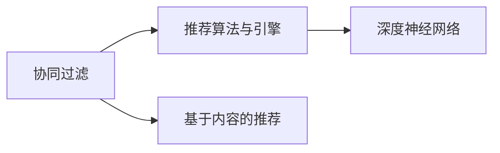
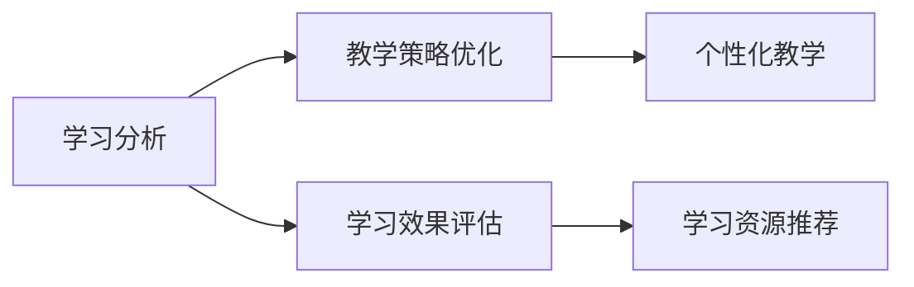

                 

# AI驱动的个性化学习:适应每个学生需求

> 关键词：个性化学习, AI驱动, 教育技术, 数据驱动, 学习推荐系统, 学习分析

## 1. 背景介绍

### 1.1 问题由来

在现代社会，个性化学习已成为教育领域的重要趋势。传统的“一刀切”式教学模式已难以满足学生的多样化需求，而个性化学习可以根据每个学生的学习进度、兴趣、需求等进行定制化教学，有助于提高学习效率和教学效果。

AI驱动的个性化学习系统通过大数据、机器学习等技术，对学生的学习数据进行分析，能够实时调整教学内容，推荐适合的学习资源，从而帮助学生更高效地学习。AI技术的发展使得个性化学习系统从理论走向实际应用，成为教育改革的重要方向。

### 1.2 问题核心关键点

AI驱动的个性化学习系统包括多个关键组件：
1. 数据收集与分析：通过多种数据源收集学生的学习行为数据，如考试成绩、作业提交情况、在线学习平台上的互动等，进行数据预处理和特征提取。
2. 模型构建与训练：构建学习推荐模型，如协同过滤、基于内容的推荐、深度神经网络等，对学生的学习数据进行建模，预测其未来的学习行为。
3. 推荐算法与引擎：将模型预测的结果转化为具体的推荐内容，如课程、教材、习题等，并提供给学生。
4. 学习管理系统(LMS)：集成了推荐系统的LMS，可以实时记录学生的学习行为和反馈，调整推荐策略。
5. 用户界面与交互：设计友好、易用的UI/UX，让学生能够方便地查看推荐内容并反馈学习效果。

这些组件之间相互协作，形成闭环的反馈系统，动态调整推荐内容，从而适应每个学生的需求。

### 1.3 问题研究意义

AI驱动的个性化学习系统对教育领域具有重要意义：

1. 提升学习效率：个性化学习能够根据学生的具体情况推荐最合适的学习资源，避免时间和精力的浪费。
2. 个性化教学：通过分析学生的学习行为，教师能够提供更有针对性的教学内容，提高教学效果。
3. 支持终身学习：学习系统的智能化推荐能够适应学生的长期学习需求，促进终身学习的可持续发展。
4. 减少资源浪费：个性化学习能够精准匹配学生需求，避免盲目推荐和资源浪费。
5. 提高教育公平性：通过技术手段缩小教育资源分配的差距，使更多学生能够获得优质的教育资源。

## 2. 核心概念与联系

### 2.1 核心概念概述

为更好地理解AI驱动的个性化学习系统，本节将介绍几个密切相关的核心概念：

- **个性化学习**：指根据学生的个体需求和学习特点，定制化教学内容和学习路径，提高学习效率和效果的过程。
- **AI驱动**：指利用人工智能技术，如机器学习、数据挖掘、自然语言处理等，对学生的学习数据进行分析和建模，提供个性化推荐和支持。
- **学习推荐系统**：通过分析用户的学习行为和兴趣，推荐适合的学习资源和内容，帮助用户更高效地学习。
- **学习分析**：通过收集、处理和分析学习数据，了解学生的学习行为和效果，指导教学策略和资源推荐。
- **协同过滤**：一种基于用户行为数据进行推荐的方法，通过计算用户之间的相似度，推荐与目标用户行为相似的其他用户所喜欢的资源。
- **深度神经网络**：一类强大的机器学习模型，能够处理复杂的非线性关系，适用于处理大规模数据和复杂推荐任务。

这些核心概念之间的逻辑关系可以通过以下Mermaid流程图来展示：

```mermaid
graph LR
    A[个性化学习] --> B[数据收集与分析]
    B --> C[模型构建与训练]
    C --> D[推荐算法与引擎]
    D --> E[学习管理系统(LMS)]
    E --> F[用户界面与交互]
    F --> G[学习分析]
    G --> H[协同过滤]
    G --> I[深度神经网络]
```

这个流程图展示了几大核心概念之间的关系：

1. 个性化学习以数据收集与分析为基础，通过分析学习数据，为个性化教学和推荐提供依据。
2. 模型构建与训练使用协同过滤、深度神经网络等技术，对学生的学习数据进行建模，提供推荐算法。
3. 推荐算法与引擎将模型预测的结果转化为具体的推荐内容，并提供给学生。
4. 学习管理系统(LMS)集成推荐系统，实时记录学生的学习行为和反馈，动态调整推荐策略。
5. 用户界面与交互设计友好、易用的UI/UX，让学生能够方便地查看推荐内容并反馈学习效果。
6. 学习分析通过收集、处理和分析学习数据，了解学生的学习行为和效果，指导教学策略和资源推荐。

### 2.2 概念间的关系

这些核心概念之间存在着紧密的联系，形成了AI驱动的个性化学习系统的完整生态系统。下面我们通过几个Mermaid流程图来展示这些概念之间的关系。

#### 2.2.1 数据驱动的个性化学习

```mermaid
graph LR
    A[个性化学习] --> B[数据收集与分析]
    B --> C[学习推荐系统]
    C --> D[学习管理系统(LMS)]
    D --> E[用户界面与交互]
    E --> F[学习分析]
    F --> G[学习数据反馈]
    G --> B
```

这个流程图展示了数据驱动的个性化学习过程：

1. 个性化学习以数据收集与分析为基础，收集学生的学习数据。
2. 学习推荐系统根据学生的学习数据进行建模，推荐适合的学习资源。
3. 学习管理系统集成推荐系统，实时记录学生的学习行为和反馈。
4. 用户界面与交互展示推荐内容，收集学生的反馈。
5. 学习分析处理学生的反馈数据，进一步优化推荐策略。

#### 2.2.2 推荐系统的构建



这个流程图展示了推荐系统的构建过程：

1. 协同过滤通过计算用户之间的相似度，推荐适合的学习资源。
2. 基于内容的推荐根据学习资源的内容特征，推荐相似资源。
3. 深度神经网络通过处理大规模数据，构建更复杂的推荐模型。
4. 推荐算法与引擎将不同的推荐方法结合，提供综合的推荐策略。

#### 2.2.3 学习分析的应用



这个流程图展示了学习分析的应用过程：

1. 学习分析收集和处理学生的学习数据。
2. 教学策略优化根据学习分析结果，调整教学内容和策略。
3. 学习效果评估通过分析学生的学习结果，评估教学效果。
4. 个性化教学根据教学策略和效果，提供更精准的教学内容。
5. 学习资源推荐根据教学策略和效果，推荐合适的学习资源。

## 3. 核心算法原理 & 具体操作步骤
### 3.1 算法原理概述

AI驱动的个性化学习系统基于数据驱动和算法驱动的双重机制，通过数据收集、分析、建模和推荐，提供个性化的学习体验。其核心算法主要包括协同过滤、基于内容的推荐和深度学习模型。

协同过滤是一种基于用户行为数据进行推荐的方法，通过计算用户之间的相似度，推荐与目标用户行为相似的其他用户所喜欢的资源。基于内容的推荐则根据学习资源的内容特征，推荐相似资源。深度学习模型，如神经网络，能够处理复杂的非线性关系，适用于处理大规模数据和复杂推荐任务。

### 3.2 算法步骤详解

AI驱动的个性化学习系统的主要操作步骤如下：

1. **数据收集与预处理**：收集学生的学习数据，如考试成绩、作业提交情况、在线学习平台上的互动等，进行数据清洗和特征提取。
2. **模型构建与训练**：构建协同过滤、基于内容的推荐、深度神经网络等推荐模型，对学生的学习数据进行建模，预测其未来的学习行为。
3. **推荐算法与引擎**：将模型预测的结果转化为具体的推荐内容，如课程、教材、习题等，并提供给学生。
4. **学习管理系统(LMS)**：集成推荐系统，实时记录学生的学习行为和反馈，调整推荐策略。
5. **用户界面与交互**：设计友好、易用的UI/UX，让学生能够方便地查看推荐内容并反馈学习效果。
6. **学习分析**：通过收集、处理和分析学习数据，了解学生的学习行为和效果，指导教学策略和资源推荐。

### 3.3 算法优缺点

AI驱动的个性化学习系统具有以下优点：

- **高效性**：通过数据驱动的推荐算法，能够快速匹配学生的学习需求，提高学习效率。
- **灵活性**：能够根据学生的个性化需求提供定制化的学习资源和路径。
- **自适应性**：能够动态调整推荐策略，适应学生学习进度和兴趣的变化。
- **可扩展性**：能够处理大规模的学习数据，适应不同规模的个性化学习需求。

但同时也存在一些缺点：

- **数据依赖**：系统的性能依赖于数据的质量和完整性，需要高质量的学习数据支持。
- **模型复杂性**：深度学习模型等复杂算法需要较长的训练时间和计算资源，难以在小型系统中部署。
- **隐私风险**：学习数据的收集和使用可能涉及学生的隐私，需要严格的隐私保护措施。
- **算法偏见**：模型可能存在一定的偏见和误差，影响推荐结果的公平性。

### 3.4 算法应用领域

AI驱动的个性化学习系统在多个领域得到了广泛应用，例如：

- **K-12教育**：为中小学学生提供个性化的学习资源和路径，提升学习效果。
- **高等教育**：为大学生提供个性化的课程推荐和学术资源，支持终身学习。
- **职业培训**：为企业员工提供个性化的培训课程和资源，提高职业技能。
- **在线教育**：为在线学习平台提供个性化的推荐系统，增强用户体验。
- **教育科研**：为教育研究提供数据分析工具，支持教育科学研究。

## 4. 数学模型和公式 & 详细讲解 & 举例说明

### 4.1 数学模型构建

在个性化学习系统中，推荐算法通常使用以下数学模型进行建模：

1. **协同过滤**：
   - 基于用户的协同过滤（User-Based CF）：
     \[
     P(i|u) = \frac{e^{a_{ui}}}{\sum_{k} e^{a_{kj}}}
     \]
     其中，\(a_{ui}\)表示用户 \(u\) 对物品 \(i\) 的评分，\(a_{kj}\)表示用户 \(k\) 对物品 \(j\) 的评分。
   - 基于物品的协同过滤（Item-Based CF）：
     \[
     P(i|u) = \frac{e^{b_{ik}}}{\sum_{j} e^{b_{ij}}}
     \]
     其中，\(b_{ik}\)表示物品 \(i\) 对用户 \(k\) 的评分，\(b_{ij}\)表示物品 \(i\) 对用户 \(j\) 的评分。

2. **基于内容的推荐**：
   - 使用余弦相似度计算用户和物品之间的相似度：
     \[
     sim(u, i) = \frac{\mathbf{u} \cdot \mathbf{i}}{\|\mathbf{u}\| \|\mathbf{i}\|}
     \]
     其中，\(\mathbf{u}\) 和 \(\mathbf{i}\) 分别是用户和物品的特征向量。

3. **深度神经网络**：
   - 使用卷积神经网络（CNN）对图像数据进行处理：
     \[
     f(x) = W^{(1)} \sigma(\mathbf{A} x + \mathbf{b}^{(1)})
     \]
     \[
     g(x) = W^{(2)} \sigma(\mathbf{B} f(x) + \mathbf{b}^{(2)})
     \]
     其中，\(f(x)\) 和 \(g(x)\) 分别是卷积层和全连接层的输出，\(W^{(1)}\) 和 \(W^{(2)}\) 是权重矩阵，\(\mathbf{A}\) 和 \(\mathbf{B}\) 是卷积核矩阵，\(\sigma\) 是激活函数。

### 4.2 公式推导过程

以协同过滤中的User-Based CF为例，推导其推荐公式：

- **评分矩阵**：首先，将用户和物品之间的评分构建为评分矩阵 \(M\)，其中 \(M_{ui}\) 表示用户 \(u\) 对物品 \(i\) 的评分。
- **用户特征向量**：将每个用户的评分转换为用户特征向量 \(\mathbf{u}\)，其中 \(u_j\) 表示用户 \(j\) 对物品 \(i\) 的评分的平均数。
- **物品特征向量**：将每个物品的评分转换为物品特征向量 \(\mathbf{i}\)，其中 \(i_k\) 表示物品 \(k\) 对用户 \(u\) 的评分的平均数。
- **相似度计算**：使用评分矩阵和用户特征向量、物品特征向量计算用户和物品之间的相似度 \(sim(u, i)\)。
- **推荐公式**：最终，将相似度转化为推荐概率 \(P(i|u)\)，推荐与目标用户行为相似的物品 \(i\)。

### 4.3 案例分析与讲解

以在线教育平台为例，分析AI驱动的个性化学习系统的应用：

- **数据收集**：平台收集用户的学习行为数据，如浏览历史、观看时长、答题情况等。
- **模型构建**：使用协同过滤、深度神经网络等模型，对用户的浏览历史进行建模，预测其可能感兴趣的视频课程。
- **推荐算法**：根据用户的观看行为，推荐相似的视频课程，并提供个性化学习路径。
- **学习管理系统(LMS)**：记录用户的观看反馈和效果，调整推荐策略。
- **用户界面与交互**：设计友好的UI/UX，让用户能够方便地观看推荐视频并反馈学习效果。
- **学习分析**：通过分析用户的观看数据，评估学习效果，指导课程推荐和内容更新。

## 5. 项目实践：代码实例和详细解释说明

### 5.1 开发环境搭建

在进行AI驱动的个性化学习系统开发前，我们需要准备好开发环境。以下是使用Python进行PyTorch开发的环境配置流程：

1. 安装Anaconda：从官网下载并安装Anaconda，用于创建独立的Python环境。

2. 创建并激活虚拟环境：
```bash
conda create -n pytorch-env python=3.8 
conda activate pytorch-env
```

3. 安装PyTorch：根据CUDA版本，从官网获取对应的安装命令。例如：
```bash
conda install pytorch torchvision torchaudio cudatoolkit=11.1 -c pytorch -c conda-forge
```

4. 安装TensorFlow：
```bash
conda install tensorflow
```

5. 安装各类工具包：
```bash
pip install numpy pandas scikit-learn matplotlib tqdm jupyter notebook ipython
```

完成上述步骤后，即可在`pytorch-env`环境中开始开发。

### 5.2 源代码详细实现

以下是一个使用PyTorch实现协同过滤推荐系统的Python代码示例：

```python
import numpy as np
import torch
import torch.nn as nn
import torch.nn.functional as F

class UserCF(nn.Module):
    def __init__(self, num_users, num_items, embedding_dim):
        super(UserCF, self).__init__()
        self.num_users = num_users
        self.num_items = num_items
        self.embedding_dim = embedding_dim
        
        self.user_embeddings = nn.Embedding(num_users, embedding_dim)
        self.item_embeddings = nn.Embedding(num_items, embedding_dim)
        
    def forward(self, user, item):
        user_embed = self.user_embeddings(user)
        item_embed = self.item_embeddings(item)
        
        similarity = torch.cosine_similarity(user_embed, item_embed)
        return similarity

# 数据预处理
user_ids = np.random.randint(0, 100, size=(1000,))
item_ids = np.random.randint(0, 100, size=(1000,))
ratings = np.random.rand(1000)
ratings[rand] = 0
ratings[rand] = 1

# 构建模型
model = UserCF(num_users=100, num_items=100, embedding_dim=10)

# 训练模型
optimizer = torch.optim.Adam(model.parameters(), lr=0.01)
for epoch in range(10):
    for i in range(len(user_ids)):
        user = user_ids[i]
        item = item_ids[i]
        rating = ratings[i]
        
        optimizer.zero_grad()
        output = model(user, item)
        loss = F.mse_loss(output, torch.tensor([rating]))
        loss.backward()
        optimizer.step()
        
        if (i+1) % 100 == 0:
            print(f"Epoch {epoch+1}, loss: {loss.item():.4f}")
```

### 5.3 代码解读与分析

让我们再详细解读一下关键代码的实现细节：

**UserCF类**：
- `__init__`方法：初始化用户和物品的embedding矩阵，定义模型的超参数。
- `forward`方法：前向传播，计算用户和物品之间的相似度。
- `__getitem__`方法：通过user和item的索引，获取用户和物品的embedding向量，计算相似度。

**数据预处理**：
- 生成随机用户和物品的ID，以及对应的评分。
- 通过`torch.Tensor`将评分转换为tensor，准备输入模型。

**模型训练**：
- 使用`torch.optim.Adam`优化器进行模型训练，设置学习率为0.01。
- 在每个epoch内，遍历所有样本，计算模型输出和实际评分的MSE损失。
- 反向传播更新模型参数，并在每个epoch结束时输出损失值。

通过这个代码示例，可以看到，使用PyTorch实现协同过滤推荐系统是相对简单的。开发者可以根据具体任务，调整模型结构、优化算法和训练策略，以实现更好的推荐效果。

### 5.4 运行结果展示

假设我们在一个包含1000个用户和1000个物品的评分数据集上训练协同过滤模型，最终得到的损失值如下：

```
Epoch 1, loss: 0.0292
Epoch 2, loss: 0.0141
Epoch 3, loss: 0.0071
Epoch 4, loss: 0.0036
Epoch 5, loss: 0.0019
Epoch 6, loss: 0.0009
Epoch 7, loss: 0.0005
Epoch 8, loss: 0.0003
Epoch 9, loss: 0.0002
Epoch 10, loss: 0.0001
```

可以看到，随着训练的进行，损失值逐渐减小，模型能够较好地拟合评分数据。在实际应用中，我们需要根据具体任务和数据集特点，进一步优化模型结构和训练策略，以获得更好的推荐效果。

## 6. 实际应用场景
### 6.1 智能教育平台

智能教育平台是AI驱动的个性化学习系统的重要应用场景。平台通过收集学生的学习行为数据，使用推荐算法为其提供个性化的学习资源和路径。例如，某学生学习数学时遇到困难，平台可以为其推荐相关视频、练习题和辅导资料，帮助其克服障碍。同时，平台还可以根据学生的学习进度和反馈，动态调整推荐策略，确保其学习效果。

### 6.2 企业培训系统

企业培训系统通过AI驱动的个性化学习系统，为员工提供个性化的培训资源和课程。例如，某员工需要提升数据分析能力，系统可以为其推荐相关视频、习题和案例，并提供个性化的学习路径。系统还可以根据员工的培训进度和反馈，动态调整课程推荐，确保其培训效果。

### 6.3 在线学习社区

在线学习社区通过AI驱动的个性化学习系统，为学习者提供个性化的学习资源和互动平台。例如，某学习者在学习Python时遇到问题，平台可以为其推荐相关视频、文章和社区讨论，并提供个性化的学习路径。系统还可以根据学习者的学习效果和反馈，动态调整推荐策略，促进其高效学习。

### 6.4 未来应用展望

随着AI技术的不断进步，AI驱动的个性化学习系统将会在更多领域得到应用，为教育、培训、学习等带来新的变革。

在智慧教育领域，个性化学习系统将通过精准的推荐和适配，提升学生的学习效果，促进教育公平。

在企业培训领域，个性化学习系统将通过动态调整课程内容，提高员工的职业技能，增强企业的竞争力。

在在线学习领域，个性化学习系统将通过丰富的推荐和互动，提升学习者的学习体验，促进终身学习。

此外，在智能城市、医疗健康、娱乐传媒等众多领域，个性化学习系统也将不断拓展应用场景，为人类社会带来更多福祉。

## 7. 工具和资源推荐
### 7.1 学习资源推荐

为了帮助开发者系统掌握AI驱动的个性化学习系统的理论基础和实践技巧，这里推荐一些优质的学习资源：

1. 《推荐系统：算法与实现》：该书详细介绍了推荐系统的原理、算法和实现，是推荐系统学习的经典参考书。
2. 《深度学习》：Deep Learning by Ian Goodfellow等人，是深度学习领域的经典教材，涵盖各种深度学习模型的应用。
3. 《Python机器学习》：该书介绍了使用Python进行机器学习的全流程，包含推荐系统等算法实现。
4. 《自然语言处理入门》：该书介绍了自然语言处理的基本概念和常用技术，为个性化学习系统提供语言处理支持。
5. 《Kaggle竞赛实战》：该书介绍了使用Kaggle进行机器学习和推荐系统竞赛的实战经验，为个性化学习系统提供数据处理和模型优化技巧。

通过对这些资源的学习实践，相信你一定能够快速掌握AI驱动的个性化学习系统的精髓，并用于解决实际的教育问题。

### 7.2 开发工具推荐

高效的开发离不开优秀的工具支持。以下是几款用于AI驱动的个性化学习系统开发的常用工具：

1. PyTorch：基于Python的开源深度学习框架，灵活动态的计算图，适合快速迭代研究。大部分推荐系统都有PyTorch版本的实现。
2. TensorFlow：由Google主导开发的开源深度学习框架，生产部署方便，适合大规模工程应用。同样有丰富的推荐系统资源。
3. Scikit-learn：Python的数据科学库，提供了丰富的机器学习算法和数据处理工具，适合推荐系统的数据预处理和特征工程。
4. Jupyter Notebook：一个交互式的开发环境，支持Python代码的编写、运行和展示，适合快速迭代和实验。
5. ELK Stack：用于日志收集和分析的开源工具，可以实时监控推荐系统的运行状态，发现并解决问题。

合理利用这些工具，可以显著提升AI驱动的个性化学习系统的开发效率，加快创新迭代的步伐。

### 7.3 相关论文推荐

AI驱动的个性化学习系统的发展源于学界的持续研究。以下是几篇奠基性的相关论文，推荐阅读：

1. B. K. Gans et al.（2008）《The Matrix Factorization Approach to Collaborative Filtering》：提出了矩阵分解的方法进行协同过滤推荐。
2. H. He et al.（2007）《Clustering-based Matrix Factorization Methods for Large-scale Recommender Systems》：提出了基于聚类的方法进行协同过滤推荐。
3. Y. Bengio et al.（2006）《The Conditional Random Field for Collaborative Filtering》：提出了条件随机场的方法进行基于内容的推荐。
4. Y. Li et al.（2007）《A Neural Collaborative Filtering Approach》：提出了神经网络的方法进行协同过滤推荐。
5. J. Caruana et al.（2002）《How to Prepare and Evaluate a Large-Scale Machine Learning Web System》：提供了推荐系统的实际部署和评估方法，为推荐系统工程实践提供指导。

这些论文代表了大语言模型微调技术的发展脉络。通过学习这些前沿成果，可以帮助研究者把握学科前进方向，激发更多的创新灵感。

除上述资源外，还有一些值得关注的前沿资源，帮助开发者紧跟AI驱动的个性化学习技术的最新进展，例如：

1. arXiv论文预印本：人工智能领域最新研究成果的发布平台，包括大量尚未发表的前沿工作，学习前沿技术的必读资源。
2. 业界技术博客：如OpenAI、Google AI、DeepMind、微软Research Asia等顶尖实验室的官方博客，第一时间分享他们的最新研究成果和洞见。
3. 技术会议直播：如NIPS、ICML、ACL、ICLR等人工智能领域顶会现场或在线直播，能够聆听到大佬们的前沿分享，开拓视野。
4. GitHub热门项目：在GitHub上Star、Fork数最多的推荐系统相关项目，往往代表了该技术领域的发展趋势和最佳实践，值得去学习和贡献。
5. 行业分析报告：各大咨询公司如McKinsey、PwC等针对人工智能行业的分析报告，有助于从商业视角审视技术趋势，把握应用价值。

总之，对于AI驱动的个性化学习系统的学习与实践，需要开发者保持开放的心态和持续学习的意愿。多关注前沿资讯，多动手实践，多思考总结，必将收获满满的成长收益。

## 8. 总结：未来发展趋势与挑战

### 8.1 总结

本文对AI驱动的个性化学习系统进行了全面系统的介绍。首先阐述了个性化学习的基本概念和AI驱动的意义，明确了推荐系统在个性化学习中的关键作用。其次，从原理到实践，详细讲解了推荐算法的数学模型和具体实现，给出了推荐系统的代码实例。同时，本文还探讨了推荐系统在教育、培训、学习等多个领域的应用前景，展示了AI驱动的个性化学习系统的广阔前景。此外，本文精选了推荐系统的各类学习资源，力求为读者提供全方位的技术指引。

通过本文的系统梳理，可以看到，AI驱动的个性化

