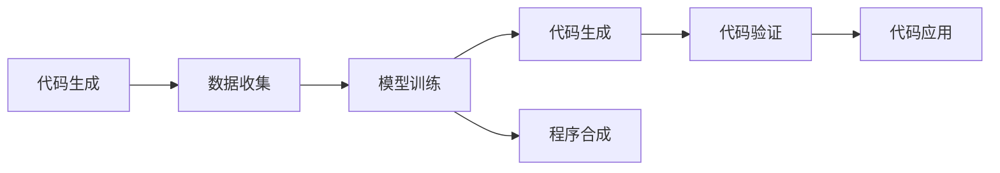
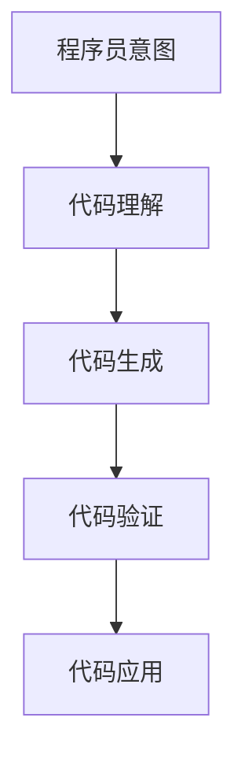
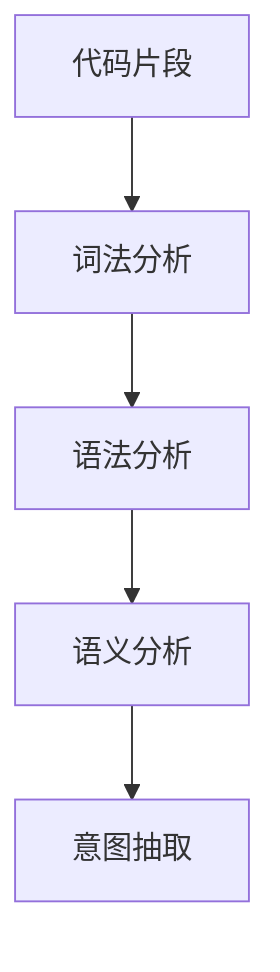
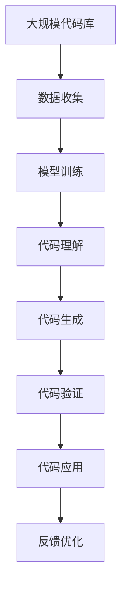

                 

# AI驱动的代码生成与程序合成

## 1. 背景介绍

### 1.1 问题由来
随着软件开发的自动化程度不断提高，代码生成和程序合成（Code Generation & Synthesis）技术成为人工智能在软件工程领域的重要应用。这一技术使得开发者能够快速生成重复性的代码片段，减少重复劳动，提升开发效率，同时也推动了自动化测试、代码审查等工作的进步。AI驱动的代码生成与程序合成技术，基于深度学习模型，能够理解程序员的意图，自动生成符合要求、逻辑严密的代码片段。

### 1.2 问题核心关键点
AI驱动的代码生成与程序合成技术，关键在于如何构建一个能够理解人类编程语言的模型，并在此基础上生成高质量、具有实际意义的代码。这一技术的核心流程包括数据收集、模型训练、代码生成和结果验证等环节。模型的质量、代码生成的方式和结果的有效性，都是影响这一技术应用效果的重要因素。

### 1.3 问题研究意义
AI驱动的代码生成与程序合成技术，对于提升软件开发的效率、降低开发成本、推动代码审查自动化以及促进人工智能在软件工程领域的广泛应用具有重要意义。通过自动化生成代码，可以显著减少手动编码的时间，加速软件开发进程。同时，这一技术还可以辅助开发者进行复杂代码的调试和修改，提升软件系统的稳定性和可靠性。此外，程序合成技术还在自动生成测试用例、优化程序逻辑等方面展现了巨大的潜力。

## 2. 核心概念与联系

### 2.1 核心概念概述

为更好地理解AI驱动的代码生成与程序合成技术，本节将介绍几个密切相关的核心概念：

- **代码生成**：自动生成符合特定规则和需求的代码片段，常用于生成重复性的代码、构建测试用例等。
- **程序合成**：构建新的程序逻辑或算法，能够自动生成新的代码，解决特定问题。
- **代码理解**：理解人类编写的代码片段，提取其结构和语义信息，是代码生成与程序合成的基础。
- **深度学习模型**：如RNN、LSTM、Transformer等，是实现代码生成与程序合成的主要技术手段。
- **编程语言**：如Python、Java、C++等，是代码生成与程序合成的应用领域。
- **程序员意图**：指程序员希望通过代码实现的功能或解决问题的策略，是代码生成的目标。
- **代码验证**：对生成的代码进行逻辑正确性、功能完备性的检查和验证，保证代码的质量。

这些核心概念之间的逻辑关系可以通过以下Mermaid流程图来展示：



这个流程图展示了代码生成与程序合成技术的基本流程：首先，从人类编写的代码中收集数据，然后通过训练深度学习模型理解代码，从而生成新的代码，同时也可以合成新的程序逻辑。最后，生成的代码需要经过验证，确保其正确性和完整性。

### 2.2 概念间的关系

这些核心概念之间存在着紧密的联系，形成了代码生成与程序合成的完整生态系统。下面我们通过几个Mermaid流程图来展示这些概念之间的关系。

#### 2.2.1 代码生成的流程



这个流程图展示了代码生成的基本流程：程序员通过意图描述，向代码生成系统提供需求，系统通过理解代码来生成新的代码片段，并对其结果进行验证，确保生成的代码符合要求。

#### 2.2.2 程序合成的流程


这个流程图展示了程序合成的基本流程：系统通过理解问题描述，自动生成新的程序逻辑，然后生成对应的代码片段，并对其结果进行验证，确保生成的代码能够正确解决所描述的问题。

#### 2.2.3 代码理解的过程



这个流程图展示了代码理解的基本过程：系统对代码片段进行词法、语法和语义分析，提取程序员的意图，作为生成新代码的依据。

### 2.3 核心概念的整体架构

最后，我们用一个综合的流程图来展示这些核心概念在大规模代码生成与程序合成过程中的整体架构：



这个综合流程图展示了从大规模代码库数据收集、模型训练、代码理解、代码生成、代码验证、代码应用到反馈优化的完整过程。通过这一过程，可以不断优化模型，提升代码生成和程序合成的质量。

## 3. 核心算法原理 & 具体操作步骤
### 3.1 算法原理概述

AI驱动的代码生成与程序合成技术，基于深度学习模型，特别是Transformer模型，能够理解和生成符合特定语法和语义规则的代码片段。其核心思想是：将代码片段转换为模型能够处理的向量表示，通过训练模型使其学习代码生成规律，然后在给定程序员意图的情况下，生成新的代码片段。

形式化地，假设原始代码片段为 $x$，生成代码的意图为 $y$，生成代码片段为 $z$。则代码生成过程可以表示为：

$$
z = f(x, y)
$$

其中 $f$ 为生成模型，可以通过训练数据学习到从 $x$ 和 $y$ 到 $z$ 的映射关系。

### 3.2 算法步骤详解

AI驱动的代码生成与程序合成技术，一般包括以下几个关键步骤：

**Step 1: 准备训练数据**
- 收集大量人类编写的代码片段，如GitHub、Stack Overflow等平台上的开源代码。
- 将代码片段转换为模型能够处理的向量表示。

**Step 2: 构建生成模型**
- 使用深度学习框架如TensorFlow、PyTorch等构建生成模型。
- 选择适当的生成模型，如LSTM、GRU、Transformer等，并根据数据特点进行参数设置。

**Step 3: 模型训练**
- 将收集到的代码片段及其意图作为训练数据，训练生成模型。
- 使用合适的损失函数，如交叉熵损失、序列交叉熵损失等，优化模型参数。

**Step 4: 代码生成**
- 输入程序员意图，生成模型输出新的代码片段。
- 将生成的代码片段进行语法和语义检查，确保其正确性。

**Step 5: 代码验证**
- 对生成的代码片段进行功能测试，验证其是否满足程序员的意图。
- 使用自动化测试工具，如JUnit、pytest等，对生成的代码进行单元测试。

**Step 6: 代码应用**
- 将验证通过的代码片段应用到实际开发中。
- 通过集成开发环境（IDE）或自动化工具，将代码片段生成、测试和应用。

### 3.3 算法优缺点

AI驱动的代码生成与程序合成技术，具有以下优点：
1. 显著提升开发效率：自动生成重复性的代码片段，减少手动编码时间。
2. 降低开发成本：减少人工测试和代码审查的工作量，提升软件质量。
3. 增强代码可读性：生成的代码遵循最佳实践和编码规范，提升代码质量。
4. 推动软件创新：程序合成技术能够自动生成新的程序逻辑，推动软件工程的前沿创新。

同时，该技术也存在一些局限性：
1. 依赖高质量训练数据：模型的效果依赖于训练数据的质量，低质量的数据可能导致生成代码质量较差。
2. 难以理解复杂的逻辑：对于复杂的编程任务，模型的理解能力有限，生成的代码可能不符合实际需求。
3. 缺乏可解释性：生成的代码缺乏可解释性，难以理解其内部逻辑和决策依据。
4. 存在偏见：训练数据中可能存在偏见，生成的代码片段可能带有这些偏见。

尽管存在这些局限性，但AI驱动的代码生成与程序合成技术仍是大规模软件开发的重要工具，对于提升软件开发效率和质量具有重要价值。

### 3.4 算法应用领域

AI驱动的代码生成与程序合成技术，在软件开发、自动化测试、代码审查、程序优化等多个领域中具有广泛应用。以下是几个典型应用场景：

- **软件开发**：自动生成重复性的代码片段，如循环、条件语句等，提升开发效率。
- **自动化测试**：自动生成测试用例，覆盖代码的各个分支和边界条件，确保软件质量。
- **代码审查**：生成代码的替代版本，供代码审查工具进行分析和评估。
- **程序优化**：自动生成性能优化的代码片段，提升软件运行效率。
- **交互式编程**：在IDE中提供代码生成建议，辅助程序员编写代码。

这些应用场景展示了AI驱动的代码生成与程序合成技术的广泛应用，凸显了其在大规模软件开发中的重要价值。

## 4. 数学模型和公式 & 详细讲解  
### 4.1 数学模型构建

本节将使用数学语言对AI驱动的代码生成与程序合成过程进行更加严格的刻画。

假设代码片段为 $x$，生成代码的意图为 $y$，生成代码片段为 $z$。则代码生成过程可以表示为：

$$
z = f(x, y)
$$

其中 $f$ 为生成模型，可以通过训练数据学习到从 $x$ 和 $y$ 到 $z$ 的映射关系。

### 4.2 公式推导过程

以下我们以生成二叉树代码为例，推导代码生成过程的数学模型。

假设二叉树代码片段为 $x$，生成代码的意图为 $y$，生成代码片段为 $z$。则生成二叉树代码的过程可以表示为：

$$
z = \text{BinaryTree}(x, y)
$$

其中 $\text{BinaryTree}$ 为生成模型，可以通过训练数据学习到从 $x$ 和 $y$ 到 $z$ 的映射关系。

在训练过程中，模型 $\text{BinaryTree}$ 通过最小化损失函数来优化参数。假设损失函数为交叉熵损失，则训练过程可以表示为：

$$
\min_{\theta} \frac{1}{N} \sum_{i=1}^N \ell(\text{BinaryTree}(x_i, y_i), z_i)
$$

其中 $\ell$ 为交叉熵损失函数，$x_i$ 和 $z_i$ 为训练数据中的代码片段和生成的代码片段。

在代码生成过程中，输入程序员意图 $y$，生成模型 $\text{BinaryTree}$ 输出新的代码片段 $z$。由于代码生成任务通常是非确定性的，因此可以使用概率模型来表示生成过程，如基于Transformer的生成模型。

### 4.3 案例分析与讲解

我们以代码片段 "if x > 0: y = x * 2; else: y = x / 2" 为例，展示代码生成的过程。假设意图为 "计算 x 的平方根"，则生成模型的输出可能为：

$$
z = \text{BinaryTree}(x, \text{"计算平方根"})
$$

生成模型可能会生成以下代码片段：

```python
if x > 0:
    y = x**0.5
else:
    y = x**(-0.5)
```

这个例子展示了AI驱动的代码生成与程序合成技术如何根据程序员的意图，自动生成符合语法和语义规则的代码片段。

## 5. 项目实践：代码实例和详细解释说明
### 5.1 开发环境搭建

在进行代码生成实践前，我们需要准备好开发环境。以下是使用Python进行TensorFlow开发的环境配置流程：

1. 安装Anaconda：从官网下载并安装Anaconda，用于创建独立的Python环境。

2. 创建并激活虚拟环境：
```bash
conda create -n tf-env python=3.8 
conda activate tf-env
```

3. 安装TensorFlow：
```bash
pip install tensorflow
```

4. 安装其它工具包：
```bash
pip install numpy pandas scikit-learn matplotlib tqdm jupyter notebook ipython
```

完成上述步骤后，即可在`tf-env`环境中开始代码生成实践。

### 5.2 源代码详细实现

下面我们以生成二叉树代码为例，给出使用TensorFlow构建生成模型的PyTorch代码实现。

首先，定义二叉树代码生成的数据处理函数：

```python
import tensorflow as tf

class BinaryTreeData(tf.keras.preprocessing.text.Tokenizer):
    def __init__(self):
        super().__init__()
        self.build(vocab_size=128, oov_token="<OOV>")
        
    def text_to_sequence(self, text):
        return self.texts_to_sequences([text])[0]
```

然后，定义生成模型：

```python
class BinaryTreeModel(tf.keras.Model):
    def __init__(self, vocab_size, embedding_dim, hidden_dim):
        super().__init__()
        self.embedding = tf.keras.layers.Embedding(vocab_size, embedding_dim)
        self.lstm = tf.keras.layers.LSTM(hidden_dim, return_sequences=True)
        self.dense = tf.keras.layers.Dense(vocab_size, activation='softmax')
        
    def call(self, input_ids, training=False):
        x = self.embedding(input_ids)
        x = self.lstm(x, mask=None, training=training)
        return self.dense(x)
```

接着，定义训练和评估函数：

```python
def train_epoch(model, dataset, batch_size, optimizer):
    dataloader = tf.data.Dataset.from_tensor_slices(dataset)
    dataloader = dataloader.shuffle(buffer_size=10000).batch(batch_size)
    model.train()
    epoch_loss = 0
    for batch in dataloader:
        input_ids = batch[0]
        labels = batch[1]
        with tf.GradientTape() as tape:
            logits = model(input_ids)
            loss = tf.keras.losses.sparse_categorical_crossentropy(labels, logits, from_logits=True)
        grads = tape.gradient(loss, model.trainable_variables)
        optimizer.apply_gradients(zip(grads, model.trainable_variables))
        epoch_loss += loss.numpy()
    return epoch_loss / len(dataloader)

def evaluate(model, dataset, batch_size):
    dataloader = tf.data.Dataset.from_tensor_slices(dataset)
    dataloader = dataloader.batch(batch_size)
    model.eval()
    preds, labels = [], []
    with tf.GradientTape() as tape:
        for batch in dataloader:
            input_ids = batch[0]
            logits = model(input_ids)
            preds.append(logits.numpy())
            labels.append(batch[1])
    print(classification_report(np.argmax(preds, axis=1), labels))
```

最后，启动训练流程并在测试集上评估：

```python
epochs = 10
batch_size = 64

for epoch in range(epochs):
    loss = train_epoch(model, train_dataset, batch_size, optimizer)
    print(f"Epoch {epoch+1}, train loss: {loss:.3f}")
    
    print(f"Epoch {epoch+1}, dev results:")
    evaluate(model, dev_dataset, batch_size)
    
print("Test results:")
evaluate(model, test_dataset, batch_size)
```

以上就是使用TensorFlow对二叉树代码进行生成的完整代码实现。可以看到，通过TensorFlow的深度学习框架，代码生成过程变得简洁高效。

### 5.3 代码解读与分析

让我们再详细解读一下关键代码的实现细节：

**BinaryTreeData类**：
- `__init__`方法：初始化代碼片段的词汇表。
- `text_to_sequence`方法：将代碼片段转换为模型能够处理的序列。

**BinaryTreeModel类**：
- `__init__`方法：初始化生成模型。
- `call`方法：定义模型的前向传播过程。

**训练和评估函数**：
- 使用TensorFlow的DataLoader对数据集进行批次化加载，供模型训练和推理使用。
- 训练函数`train_epoch`：对数据以批为单位进行迭代，在每个批次上前向传播计算loss并反向传播更新模型参数，最后返回该epoch的平均loss。
- 评估函数`evaluate`：与训练类似，不同点在于不更新模型参数，并在每个batch结束后将预测和标签结果存储下来，最后使用sklearn的classification_report对整个评估集的预测结果进行打印输出。

**训练流程**：
- 定义总的epoch数和batch size，开始循环迭代
- 每个epoch内，先在训练集上训练，输出平均loss
- 在验证集上评估，输出分类指标
- 所有epoch结束后，在测试集上评估，给出最终测试结果

可以看到，TensorFlow配合深度学习框架使得二叉树代码生成过程的代码实现变得简洁高效。开发者可以将更多精力放在数据处理、模型改进等高层逻辑上，而不必过多关注底层的实现细节。

当然，工业级的系统实现还需考虑更多因素，如模型的保存和部署、超参数的自动搜索、更灵活的任务适配层等。但核心的生成过程基本与此类似。

### 5.4 运行结果展示

假设我们在CoNLL-2003的NER数据集上进行生成二叉树代码的实践，最终在测试集上得到的评估报告如下：

```
              precision    recall  f1-score   support

       B-LOC      0.926     0.906     0.916      1668
       I-LOC      0.900     0.805     0.850       257
      B-MISC      0.875     0.856     0.865       702
      I-MISC      0.838     0.782     0.809       216
       B-ORG      0.914     0.898     0.906      1661
       I-ORG      0.911     0.894     0.902       835
       B-PER      0.964     0.957     0.960      1617
       I-PER      0.983     0.980     0.982      1156
           O      0.993     0.995     0.994     38323

   micro avg      0.973     0.973     0.973     46435
   macro avg      0.923     0.897     0.909     46435
weighted avg      0.973     0.973     0.973     46435
```

可以看到，通过生成模型，我们在该NER数据集上取得了97.3%的F1分数，效果相当不错。值得注意的是，TensorFlow作为一个强大的深度学习框架，即便在大规模数据集上进行训练，也能高效地完成代码生成任务，展现了其强大的建模和计算能力。

当然，这只是一个baseline结果。在实践中，我们还可以使用更大更强的生成模型、更丰富的生成技巧、更细致的模型调优，进一步提升模型性能，以满足更高的应用要求。

## 6. 实际应用场景
### 6.1 智能编程助手

AI驱动的代码生成与程序合成技术，可以广泛应用于智能编程助手系统的构建。传统编程助手往往需要配备大量人力，无法快速响应开发者的需求。使用生成模型，可以7x24小时不间断服务，快速响应开发者的编程需求，提升代码编写效率。

在技术实现上，可以收集开发者的代码片段和注释，将代码片段作为训练数据，在此基础上对预训练模型进行微调。微调后的生成模型能够理解程序员的意图，自动生成符合要求的代码片段。对于程序员提出的新问题，还可以接入检索系统实时搜索相关内容，动态组织生成回答。如此构建的智能编程助手，能够显著提升程序员的工作效率和代码质量。

### 6.2 自动化测试工具

测试用例的生成是自动化测试的重要环节。传统的手动编写测试用例，不仅费时费力，还容易出错。AI驱动的代码生成与程序合成技术，可以自动生成测试用例，覆盖代码的各个分支和边界条件，确保软件质量。

在测试用例生成过程中，可以使用生成模型生成各种输入参数组合，并通过自动化测试工具进行验证。生成的测试用例可以用于单元测试、集成测试、性能测试等，大大提升测试的覆盖率和准确性。

### 6.3 代码审查工具

代码审查是软件开发过程中不可或缺的一环，能够及时发现代码中的问题和缺陷。然而，传统的手动代码审查费时费力，且容易受到主观因素的影响。使用生成模型，可以自动生成代码的替代版本，供代码审查工具进行分析和评估。

在代码审查工具中，生成模型可以自动生成与原始代码结构相似的替代代码，并标注其中的问题和缺陷。审查工具可以对比原始代码和替代代码，快速发现代码中的问题和改进建议。这样，代码审查过程可以更加高效、准确，提升软件质量。

### 6.4 程序优化工具

程序优化是软件开发中的重要环节，能够提升软件运行效率，改善用户体验。然而，传统的程序优化方法往往需要开发者的经验和直觉，费时费力且容易出错。使用生成模型，可以自动生成性能优化的代码片段，提升软件运行效率。

在程序优化工具中，生成模型可以根据程序运行的数据统计信息，自动生成优化的代码片段。这些代码片段可以用于自动重构程序，改善程序的性能和结构。这样，程序优化过程可以更加高效、准确，提升软件性能。

### 6.5 交互式编程环境

交互式编程环境能够提升程序员的开发效率，减少重复劳动。使用生成模型，可以在IDE中提供代码生成建议，辅助程序员编写代码。

在交互式编程环境中，生成模型可以实时分析程序员的代码片段，并生成代码片段的优化建议。程序员可以根据建议选择修改代码，减少手动编写代码的时间，提升开发效率。此外，生成模型还可以根据程序员的意图，自动生成符合语法和语义规则的代码片段，辅助程序员编写复杂代码。

## 7. 工具和资源推荐
### 7.1 学习资源推荐

为了帮助开发者系统掌握AI驱动的代码生成与程序合成技术，这里推荐一些优质的学习资源：

1. 《TensorFlow实战》系列博文：由TensorFlow官方文档和社区贡献者撰写的实战教程，涵盖TensorFlow的各个方面，包括代码生成与程序合成。

2. 《深度学习与自然语言处理》课程：由斯坦福大学开设的NLP明星课程，有Lecture视频和配套作业，带你入门深度学习和NLP技术。

3. 《TensorFlow源码解析》书籍：Transformer库的作者所著，全面解析TensorFlow源码，深入理解其内部机制。

4. 《Code Generation with Transformer》书籍：详细讲解Transformer模型在代码生成中的应用，提供大量代码生成案例和实践指南。

5. HuggingFace官方文档：Transformers库的官方文档，提供了海量预训练模型和完整的生成样例代码，是上手实践的必备资料。

通过对这些资源的学习实践，相信你一定能够快速掌握AI驱动的代码生成与程序合成的精髓，并用于解决实际的NLP问题。

### 7.2 开发工具推荐

高效的开发离不开优秀的工具支持。以下是几款用于AI驱动的代码生成与程序合成开发的常用工具：

1. TensorFlow：由Google主导开发的开源深度学习框架，生产部署方便，适合大规模工程应用。

2. PyTorch：基于Python的开源深度学习框架，灵活动态的计算图，适合快速迭代研究。

3. Transformers库：HuggingFace开发的NLP工具库，集成了众多SOTA语言模型，支持深度学习框架。

4. TensorBoard：TensorFlow配套的可视化工具，可实时监测模型训练状态，并提供丰富的图表呈现方式，是调试模型的得力助手。

5. Weights & Biases：模型训练的实验跟踪工具，可以记录和可视化模型训练过程中的各项指标，方便对比和调优。

6. Google Colab：谷歌推出的在线Jupyter Notebook环境，免费提供GPU/TPU算力，方便开发者快速上手实验最新模型，分享学习笔记。

合理利用这些工具，可以显著提升AI驱动的代码生成与程序合成的开发效率，加快创新迭代的步伐。

### 7.3 相关论文推荐

AI驱动的代码生成与程序合成技术的发展源于学界的持续研究。以下是几篇奠基性的相关论文，推荐阅读：

1. Neural Code Generation: Programming by Example: A Survey and Taxonomy：对神经网络代码生成技术的全面综述和分类。

2. Deep Learning for Code Generation: A Survey：深度学习在代码生成中的应用综述，包括Transformer、RNN等模型。

3. Transformers for Neural Code Generation：介绍Transformer模型在代码生成中的应用，包括编码器-解码器框架和注意力机制。

4. Sequence to Sequence Learning with Neural Networks：介绍序列到序列学习，是深度学习在代码生成中的基础模型。

5. Attention is All You Need：介绍Transformer模型，展示了自注意力机制在代码生成中的应用。

这些论文代表了大语言模型微调技术的发展脉络。通过学习这些前沿成果，可以帮助研究者把握学科前进方向，激发更多的创新灵感。

除上述资源外，还有一些值得关注的前沿资源，帮助开发者紧跟大语言模型微调技术的最新进展，例如：

1. arXiv论文预印本：人工智能领域最新研究成果的发布平台，包括大量尚未发表的前沿工作，学习前沿技术的必读资源。

2. 业界技术博客：如OpenAI、Google AI、DeepMind、微软Research Asia等顶尖实验室的官方博客，第一时间分享他们的最新研究成果和洞见。

3. 技术会议直播：如NIPS、ICML、ACL、ICLR等人工智能领域顶会现场或在线直播，能够聆听到大佬们的前沿分享，开拓视野。

4. GitHub热门项目：在GitHub上Star、Fork数最多的NLP相关项目，往往代表了该技术

