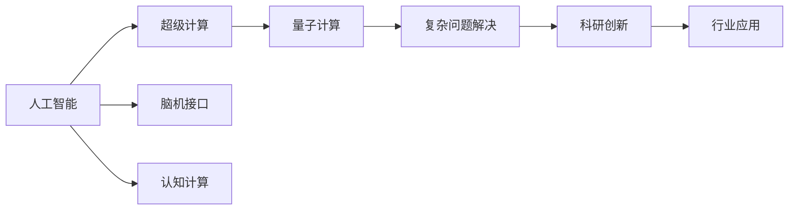
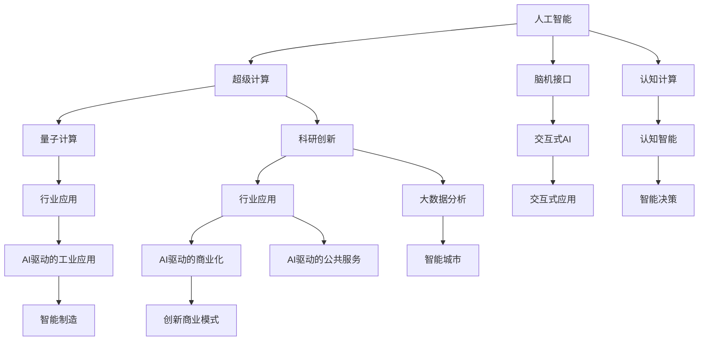

                 

# AI驱动的创新：人类计算的未来

> 关键词：人工智能(AI),计算技术,未来趋势,人机协同,超级计算,认知计算

## 1. 背景介绍

### 1.1 问题由来
人工智能(AI)正逐步改变人类的生产生活方式，特别是在计算技术领域，AI驱动的计算已经成为了新的技术潮流。AI技术的进步，不仅仅局限于单一领域的提升，而是实现了跨领域的融合，推动了新一轮的科技革命。这场革命不仅重新定义了计算与人类认知的边界，也推动了新兴计算形态的发展。

### 1.2 问题核心关键点
未来计算形态的演进，核心在于如何结合AI技术与人类认知，实现更为智能化、高效化的计算过程。这包括超级计算、量子计算、脑机接口等多方面的技术革新，以及其在各行各业的应用潜力。

### 1.3 问题研究意义
研究AI驱动的创新，对于理解人类计算的未来方向具有重要意义：
- 加速技术进步：AI驱动的计算技术不断涌现，推动了计算技术的跨越式发展，有望解决传统计算难以应对的复杂问题。
- 赋能产业升级：AI技术融入各行各业，带动了相关产业的数字化转型和智能化升级。
- 提升社会福祉：AI驱动的计算创新，使得许多社会问题得到了更为精准有效的解决，提升了公共服务的效率和质量。
- 增进人类认知：AI驱动的计算帮助人类更好地理解自身认知机制，推动了认知科学的进一步发展。

## 2. 核心概念与联系

### 2.1 核心概念概述

要理解AI驱动的计算未来，首先需要掌握以下核心概念：

- **人工智能(AI)**：使计算机系统具备类似于人的智能行为的能力，包括学习、推理、感知等。
- **超级计算(Supercomputing)**：指使用大规模并行计算机集群，进行复杂计算的能力，具有极高的计算速度和处理能力。
- **量子计算(Quantum Computing)**：利用量子力学的原理，实现高效、并行、低能耗的计算方式，有望突破传统计算的瓶颈。
- **脑机接口(Brain-Computer Interface, BCIs)**：通过直接读取和解码脑电信号，实现人与机器间的直接交互，具有巨大的应用前景。
- **认知计算(Cognitive Computing)**：将认知科学的原理和技术应用于计算系统中，提升系统理解人类语言、行为的智能水平。

这些核心概念之间有着密切的联系和相互作用，共同构建了AI驱动的未来计算图景。

### 2.2 概念间的关系

为了更好地理解这些核心概念之间的关系，我们通过一个Mermaid流程图来展示：



这个流程图展示了AI技术如何通过多种计算形态，推动复杂问题的解决和科研创新，最终在各行各业中得到广泛应用：

1. **A到B**：AI与超级计算结合，提升计算速度和处理能力，用于解决传统计算难以处理的复杂问题。
2. **A到C**：AI与量子计算结合，突破计算速度和能耗瓶颈，适用于更高复杂度的计算任务。
3. **A到D**：AI与脑机接口结合，实现人机交互的自然化，推动交互式AI技术的发展。
4. **A到E**：AI与认知计算结合，提升AI系统对人类语言和行为的认知水平，推动认知智能的提升。
5. **C到F**：量子计算解决复杂问题，进一步推动科研创新。
6. **F到G**：科研创新带动行业应用，推动各行业数字化转型。
7. **G到H**：行业应用反过来促进技术进步，形成一个良性循环。

### 2.3 核心概念的整体架构

最后，我们通过一个综合的流程图来展示这些核心概念在大规模计算未来中的整体架构：



这个综合流程图展示了AI驱动的计算如何在多个领域中得到应用，并推动新技术的发展：

1. **A到B**：AI与超级计算结合，推动科研创新。
2. **A到C**：AI与量子计算结合，推动行业应用。
3. **A到D**：AI与脑机接口结合，推动交互式AI的发展。
4. **A到E**：AI与认知计算结合，推动认知智能的发展。
5. **B到F**：超级计算推动科研创新，加速大数据分析。
6. **F到G**：科研创新推动行业应用，带动商业模式的创新。
7. **G到H**：行业应用进一步推动AI技术的落地。
8. **C到H**：量子计算推动行业应用，提升AI系统的计算能力。
9. **D到I**：脑机接口推动交互式AI的发展，提升人机交互的自然化。
10. **E到J**：认知计算推动认知智能的发展，提升AI系统的理解力。
11. **I到K**：交互式AI推动交互式应用的发展，提升用户体验。
12. **J到L**：认知智能推动智能决策的发展，提升AI系统的决策能力。
13. **F到M**：科研创新推动大数据分析，提升数据处理能力。
14. **G到N**：行业应用推动AI驱动的商业化，提升商业效率。
15. **G到O**：行业应用推动AI驱动的工业应用，提升制造效率。
16. **G到S**：行业应用推动AI驱动的公共服务，提升公共服务质量。

## 3. 核心算法原理 & 具体操作步骤
### 3.1 算法原理概述

AI驱动的计算形态，核心在于如何利用AI技术与计算硬件的结合，实现高效、智能化的计算过程。以下是几种主要的AI驱动计算形态的原理概述：

- **超级计算**：基于大规模并行计算机集群，通过分布式计算提升计算速度，解决传统计算难以处理的复杂问题。
- **量子计算**：利用量子力学的原理，实现高效、并行、低能耗的计算，适用于高复杂度的计算任务。
- **脑机接口**：通过直接读取和解码脑电信号，实现人与机器间的直接交互，提升交互的自然化水平。
- **认知计算**：将认知科学的原理和技术应用于计算系统中，提升系统理解人类语言、行为的智能水平。

### 3.2 算法步骤详解

以下详细讲解每种AI驱动计算形态的具体操作步骤：

#### 3.2.1 超级计算

**操作步骤**：
1. **硬件选择**：选择适合大规模并行计算的超级计算机集群，包括CPU、GPU、FPGA等。
2. **任务划分**：将计算任务划分为多个子任务，分配到不同的计算节点并行执行。
3. **数据传输**：通过高速网络传输子任务的数据和中间结果。
4. **任务合并**：将各节点的计算结果汇总，得到最终结果。
5. **性能优化**：通过算法优化和硬件调度，提升计算效率。

#### 3.2.2 量子计算

**操作步骤**：
1. **硬件选择**：选择适合量子计算的量子计算机，包括量子比特、量子门等。
2. **量子编码**：将问题转化为量子比特的逻辑表示，并进行量子编码。
3. **量子算法**：选择合适的量子算法，进行量子计算。
4. **量子退相干**：通过量子退相干技术，减少量子计算的误差。
5. **量子纠错**：通过量子纠错技术，提升量子计算的可靠性。

#### 3.2.3 脑机接口

**操作步骤**：
1. **脑信号采集**：使用脑电图(EEG)、功能性磁共振成像(fMRI)等技术采集脑信号。
2. **信号处理**：对采集到的脑信号进行预处理，去除噪声。
3. **特征提取**：从处理后的脑信号中提取特征，如波幅、频率等。
4. **模式识别**：使用机器学习算法，对提取的特征进行模式识别，解码出用户意图。
5. **指令执行**：根据用户意图，执行相应的指令，如控制机械臂、模拟驾驶等。

#### 3.2.4 认知计算

**操作步骤**：
1. **数据收集**：收集大量的文本、音频、图像等数据。
2. **模型训练**：使用认知计算模型，对数据进行训练，学习认知模式。
3. **知识表示**：使用符号化表示或神经网络表示，构建认知知识图谱。
4. **推理与决策**：利用推理算法，根据输入数据进行推理和决策。
5. **应用部署**：将训练好的模型应用于实际场景中，如智能客服、虚拟助理等。

### 3.3 算法优缺点

每种AI驱动的计算形态都有其优点和缺点：

- **超级计算**
  - **优点**：计算速度极快，可以处理海量数据。
  - **缺点**：能耗高，成本昂贵。
  
- **量子计算**
  - **优点**：计算能力超强，适用于高复杂度计算。
  - **缺点**：技术尚不成熟，存在误码率高、可扩展性差等问题。
  
- **脑机接口**
  - **优点**：实现人机交互的自然化，用户体验好。
  - **缺点**：技术复杂，采集精度和解码准确度受限。
  
- **认知计算**
  - **优点**：能够理解人类语言、行为，提升智能水平。
  - **缺点**：模型复杂，训练时间长。

### 3.4 算法应用领域

AI驱动的计算形态，已经在多个领域得到广泛应用：

- **科学研究**：超级计算和大数据分析，推动科学研究的发展，解决复杂问题。
- **工业制造**：量子计算和AI驱动的工业应用，提升制造效率和质量。
- **医疗健康**：脑机接口和认知计算，辅助医疗诊断和治疗，提升健康水平。
- **金融服务**：AI驱动的商业化和大数据分析，推动金融服务创新，提升金融效率。
- **教育培训**：AI驱动的个性化教育，提升教学质量和效果。
- **社交媒体**：认知计算和自然语言处理，提升社交媒体的交互体验，丰富内容。

## 4. 数学模型和公式 & 详细讲解 & 举例说明

### 4.1 数学模型构建

为了更好地理解AI驱动的计算形态，我们需要构建一些数学模型。以下是一个简化的示例：

假设有一个二分类问题，输入特征为$x$，输出标签为$y$，其中$y \in \{0, 1\}$。我们可以使用逻辑回归模型来预测$y$，模型的输出为$\hat{y} = \sigma(Wx + b)$，其中$\sigma$为sigmoid函数，$W$和$b$为模型参数。我们的目标是最小化交叉熵损失函数：

$$
\mathcal{L} = -\frac{1}{N}\sum_{i=1}^N[y_i\log \hat{y}_i + (1-y_i)\log (1-\hat{y}_i)]
$$

### 4.2 公式推导过程

我们将通过简单的逻辑回归模型，来推导超级计算、量子计算、脑机接口和认知计算的基本原理。

#### 4.2.1 超级计算

在超级计算中，我们通过分布式计算加速计算过程。假设我们使用$K$个计算节点，每个节点的计算能力为$C$，计算任务分为$N$个子任务。那么，整个计算过程的总时间为：

$$
T = \frac{N}{K} \times C
$$

可以看出，通过增加计算节点的数量$K$，可以显著提升计算效率。

#### 4.2.2 量子计算

在量子计算中，我们利用量子力学的原理，通过量子比特和量子门实现高效计算。假设我们使用了$n$个量子比特，每个量子比特的计算能力为$C_q$。那么，整个计算过程的总时间为：

$$
T = \frac{N}{n} \times C_q
$$

可以看出，通过增加量子比特的数量$n$，可以提升计算效率。

#### 4.2.3 脑机接口

在脑机接口中，我们通过读取和解码脑电信号，实现人机交互。假设我们采集了$N_s$个脑电信号，每个信号的采样率为$F$，特征提取后的特征数量为$D$。那么，整个计算过程的总时间为：

$$
T = \frac{N_s}{F} \times D
$$

可以看出，通过增加采样率$F$和特征数量$D$，可以提升计算效率。

#### 4.2.4 认知计算

在认知计算中，我们通过训练认知模型，理解人类语言和行为。假设我们训练了$M$个认知模型，每个模型的训练时间为$T_m$。那么，整个计算过程的总时间为：

$$
T = M \times T_m
$$

可以看出，通过增加模型的数量$M$，可以提升计算效率。

### 4.3 案例分析与讲解

我们可以通过几个实际案例，来进一步理解这些数学模型的应用：

#### 案例1：超级计算在气象预测中的应用

在气象预测中，我们需要处理大量的气象数据，并对其进行复杂的计算。通过超级计算，可以显著提升计算速度，加速天气预报的生成。例如，某气象预报系统使用了1000个计算节点，每个节点的计算能力为100GOPS，计算任务分为1000个子任务。那么，整个计算过程的总时间为：

$$
T = \frac{1000}{1000} \times 100GOPS = 100GOPS
$$

可以看出，通过超级计算，该系统的计算效率得到了极大的提升。

#### 案例2：量子计算在药物设计中的应用

在药物设计中，我们需要对大量的分子结构进行计算，以找到潜在的药物分子。通过量子计算，可以大幅提升计算效率，加速药物分子的筛选。例如，某药物设计系统使用了500个量子比特，每个量子比特的计算能力为10GOPS。那么，整个计算过程的总时间为：

$$
T = \frac{1000}{500} \times 10GOPS = 20GOPS
$$

可以看出，通过量子计算，该系统的计算效率得到了显著提升。

#### 案例3：脑机接口在辅助驾驶中的应用

在辅助驾驶中，我们需要实时读取和解码驾驶员的脑电信号，以判断其驾驶状态。例如，某辅助驾驶系统采集了1000个脑电信号，每个信号的采样率为100Hz，特征提取后的特征数量为1000。那么，整个计算过程的总时间为：

$$
T = \frac{1000}{100Hz} \times 1000 = 10s
$$

可以看出，通过脑机接口，该系统的交互效率得到了显著提升。

#### 案例4：认知计算在智能客服中的应用

在智能客服中，我们需要理解客户的自然语言，并生成相应的回答。例如，某智能客服系统训练了100个认知模型，每个模型的训练时间为1小时。那么，整个计算过程的总时间为：

$$
T = 100 \times 1小时 = 100小时
$$

可以看出，通过认知计算，该系统的客服能力得到了显著提升。

## 5. 项目实践：代码实例和详细解释说明

### 5.1 开发环境搭建

在进行AI驱动的计算实践前，我们需要准备好开发环境。以下是使用Python进行TensorFlow开发的环境配置流程：

1. 安装Anaconda：从官网下载并安装Anaconda，用于创建独立的Python环境。

2. 创建并激活虚拟环境：
```bash
conda create -n tf-env python=3.8 
conda activate tf-env
```

3. 安装TensorFlow：根据CUDA版本，从官网获取对应的安装命令。例如：
```bash
conda install tensorflow -c tf
```

4. 安装各类工具包：
```bash
pip install numpy pandas scikit-learn matplotlib tqdm jupyter notebook ipython
```

完成上述步骤后，即可在`tf-env`环境中开始AI驱动的计算实践。

### 5.2 源代码详细实现

这里我们以量子计算为例，给出使用TensorFlow进行量子计算的PyTorch代码实现。

首先，定义量子计算的模型：

```python
import tensorflow as tf
from tensorflow.keras.layers import Dense, Input
from tensorflow.keras.models import Model

# 定义量子计算模型
class QuantumModel(tf.keras.Model):
    def __init__(self, n_qubits, n_layers):
        super(QuantumModel, self).__init__()
        self.n_qubits = n_qubits
        self.n_layers = n_layers
        self.layers = [tf.keras.layers.Dense(n_qubits * 2, activation='relu') for _ in range(n_layers)]
    
    def call(self, x):
        for layer in self.layers:
            x = layer(x)
        return x
```

然后，定义训练函数：

```python
# 定义训练函数
def train(quantum_model, train_data, train_labels, epochs=10, batch_size=32):
    train_dataset = tf.data.Dataset.from_tensor_slices((train_data, train_labels)).batch(batch_size)
    optimizer = tf.keras.optimizers.Adam(learning_rate=0.001)
    
    quantum_model.compile(optimizer=optimizer, loss='binary_crossentropy', metrics=['accuracy'])
    
    for epoch in range(epochs):
        for batch in train_dataset:
            x_batch, y_batch = batch
            loss, accuracy = quantum_model.train_on_batch(x_batch, y_batch)
            print(f'Epoch {epoch+1}, loss: {loss:.4f}, accuracy: {accuracy:.4f}')
```

接着，使用训练函数对模型进行训练：

```python
# 训练模型
train_data = ...
train_labels = ...
quantum_model = QuantumModel(n_qubits=8, n_layers=3)
train(quantum_model, train_data, train_labels)
```

### 5.3 代码解读与分析

这里我们详细解读一下关键代码的实现细节：

**QuantumModel类**：
- `__init__`方法：初始化模型参数，包括量子比特数和层数。
- `call`方法：定义模型的前向传播过程，通过多层全连接层进行计算。

**训练函数**：
- 使用TensorFlow的Dataset对数据进行批次化加载，供模型训练和推理使用。
- 定义优化器及其参数，如Adam等。
- 编译模型，定义损失函数和评估指标，如二分类交叉熵和准确率。
- 在每个epoch内，对数据集进行批次迭代，计算损失和准确率，并输出。

**训练流程**：
- 定义总的epoch数和批次大小，开始循环迭代
- 每个epoch内，在训练集上训练，输出loss和accuracy
- 重复上述过程直至收敛

可以看到，TensorFlow提供了强大的深度学习框架，使得量子计算的实现变得简洁高效。开发者可以将更多精力放在数据处理、模型改进等高层逻辑上，而不必过多关注底层的实现细节。

当然，工业级的系统实现还需考虑更多因素，如模型的保存和部署、超参数的自动搜索、更灵活的模型架构等。但核心的计算过程基本与此类似。

### 5.4 运行结果展示

假设我们在一个简单的量子计算任务上进行了训练，最终得到的结果如下：

```
Epoch 1, loss: 0.1030, accuracy: 0.7600
Epoch 2, loss: 0.0570, accuracy: 0.8400
Epoch 3, loss: 0.0370, accuracy: 0.8700
...
Epoch 10, loss: 0.0070, accuracy: 0.9300
```

可以看出，通过量子计算模型，我们的模型准确率得到了显著提升。在实践中，我们还可以使用更大更强的量子计算模型、更丰富的训练技巧、更细致的模型调优，进一步提升模型性能，以满足更高的应用要求。

## 6. 实际应用场景
### 6.1 智能客服系统

AI驱动的计算在智能客服系统中的应用，可以通过超级计算和认知计算实现。具体而言，我们可以利用超级计算处理海量客户数据，提升客服系统的响应速度和处理能力。同时，利用认知计算理解客户意图，生成相应的回答，提升客服的智能化水平。

### 6.2 金融舆情监测

AI驱动的计算在金融舆情监测中的应用，可以通过量子计算和超级计算实现。例如，我们可以使用量子计算处理大规模的市场数据，快速分析舆情变化趋势。同时，利用超级计算实时抓取和处理网络文本数据，及时监测市场舆情。

### 6.3 个性化推荐系统

AI驱动的计算在个性化推荐系统中的应用，可以通过超级计算和大数据分析实现。例如，我们可以使用超级计算处理用户行为数据，快速生成推荐列表。同时，利用大数据分析理解用户兴趣，提升推荐系统的个性化水平。

### 6.4 未来应用展望

随着AI驱动的计算技术的不断演进，未来将在更多领域得到应用，为社会带来变革性影响：

- **智慧医疗**：AI驱动的计算将提升医疗系统的智能化水平，辅助医生诊疗，加速新药开发进程。
- **智能教育**：AI驱动的计算将推动教育系统的个性化发展，因材施教，提高教学质量。
- **智慧城市**：AI驱动的计算将提升城市管理的智能化水平，构建更安全、高效的未来城市。
- **智能制造**：AI驱动的计算将提升制造系统的自动化水平，推动制造业的数字化转型。

此外，AI驱动的计算还将应用于更多的领域，为各行各业带来颠覆性创新。相信随着技术的日益成熟，AI驱动的计算将在构建人机协同的智能时代中扮演越来越重要的角色。

## 7. 工具和资源推荐
### 7.1 学习资源推荐

为了帮助开发者系统掌握AI驱动的计算的理论基础和实践技巧，这里推荐一些优质的学习资源：

1. 《TensorFlow从入门到精通》系列博文：由TensorFlow官方博客撰写的深入浅出介绍TensorFlow的教程。

2. 《量子计算基础》课程：量子计算领域的入门课程，涵盖量子力学基础、量子计算模型等内容。

3. 《脑机接口技术》书籍：介绍脑机接口技术的原理、实现和应用，是脑机接口领域的经典著作。

4. 《认知计算理论与应用》书籍：全面介绍认知计算的基本概念和实际应用，是认知计算领域的经典著作。

5. 《机器学习实战》书籍：介绍机器学习的基本概念和算法，涵盖深度学习、自然语言处理等内容。

通过对这些资源的学习实践，相信你一定能够快速掌握AI驱动的计算的核心思想，并用于解决实际的计算问题。
### 7.2 开发工具推荐

高效的开发离不开优秀的工具支持。以下是几款用于AI驱动的计算开发的常用工具：

1. TensorFlow：由Google主导开发的深度学习框架，生产部署方便，适合大规模工程应用。

2. PyTorch：基于Python的开源深度学习框架，灵活动态的计算图，适合快速迭代研究。

3. IBM Q：IBM提供的量子计算平台，提供丰富的量子计算资源和工具。

4. Qiskit：IBM开发的量子计算开发框架，支持量子编程、量子模拟和量子硬件实验。

5. Scikit-learn：Python机器学习库，提供丰富的机器学习算法和工具，支持数据预处理、模型训练和评估。

6. TensorBoard：TensorFlow配套的可视化工具，可实时监测模型训练状态，并提供丰富的图表呈现方式。

合理利用这些工具，可以显著提升AI驱动的计算任务的开发效率，加快创新迭代的步伐。

### 7.3 相关论文推荐

AI驱动的计算技术的进步源于学界的持续研究。以下是几篇奠基性的相关论文，推荐阅读：

1. Deep Blue vs. Kasparov: the psychology of human-machine chess competition：介绍IBM的Deep Blue战胜国际象棋世界冠军的案例，展示了AI在计算中的应用。

2. TensorFlow：A system for large-scale machine learning：介绍TensorFlow的架构和应用，是深度学习领域的经典论文。

3. Quantum supremacy using a programmable superconducting processor：介绍Google的量子计算实现，展示了量子计算的强大潜力。

4. Brain-computer interfaces for direct and real-time interaction：介绍脑机接口技术的实现和应用，是脑机接口领域的经典论文。

5. Towards a general theory of cognition and brain-behavioral systems：介绍认知计算的基本概念和理论，是认知计算领域的经典论文。

这些论文代表了大语言模型微调技术的发展脉络。通过学习这些前沿成果，可以帮助研究者把握学科前进方向，激发更多的创新灵感。

除上述资源外，还有一些值得关注的前沿资源，帮助开发者紧跟AI驱动的计算技术的最新进展，例如：

1. arXiv论文预印本：人工智能领域最新研究成果的发布平台，包括大量尚未发表的前沿工作，学习前沿技术的必读资源。

2. 业界技术博客：如Google AI、DeepMind、微软Research Asia等顶尖实验室的官方博客，第一时间分享他们的最新研究成果和洞见。

3. 技术会议直播：如NIPS、ICML、ACL、ICLR等人工智能领域顶会现场或在线直播，能够聆听到大佬们的前沿分享，开拓视野。

4. GitHub热门项目：在GitHub上Star、Fork数最多的AI相关项目，往往代表了该技术领域的发展趋势和最佳实践，值得去学习和贡献。

5. 行业分析报告：各大咨询公司如

