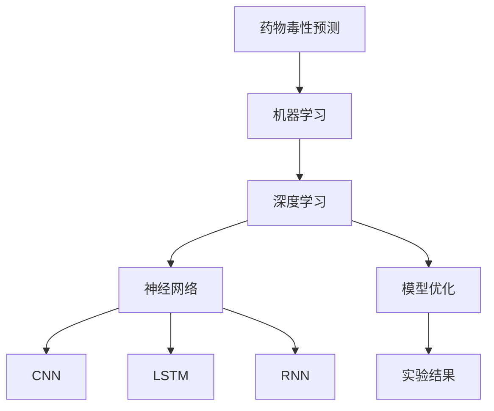
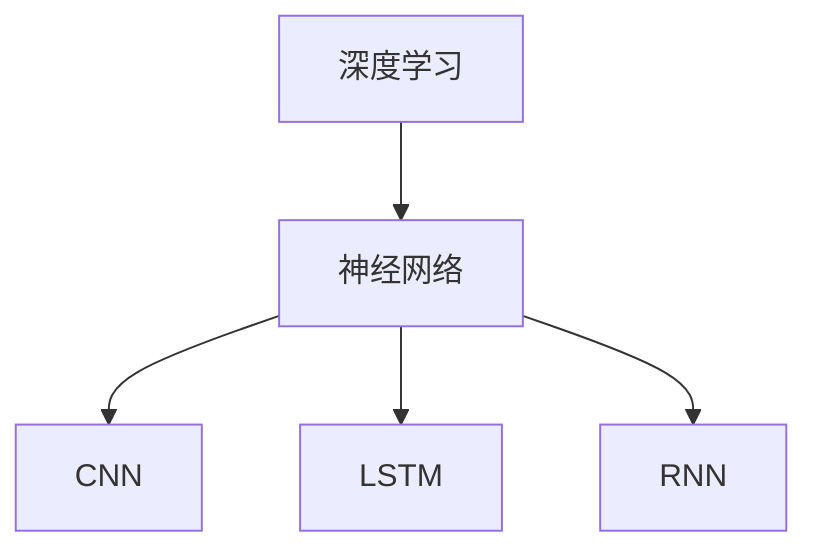
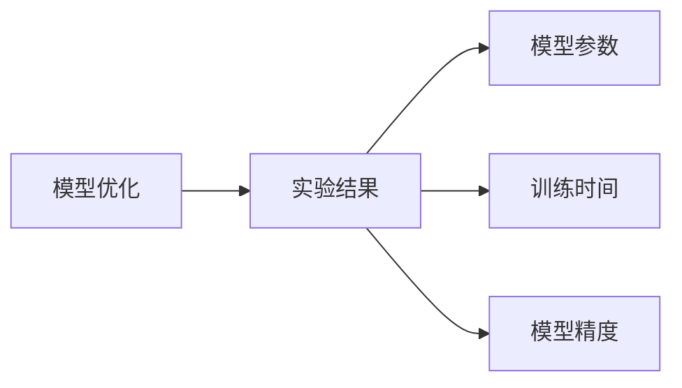
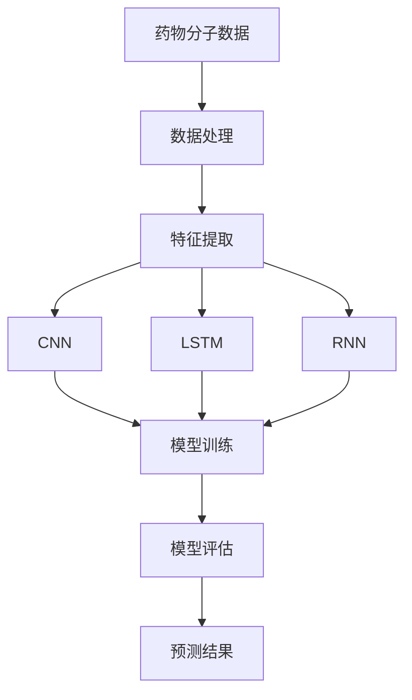

                 

# AI驱动的药物毒性预测模型研究

> 关键词：人工智能,药物毒性预测,机器学习,深度学习,神经网络,卷积神经网络,CNN,长短期记忆网络,LSTM,循环神经网络,RNN,药物发现,药物设计,模型优化,实验结果

## 1. 背景介绍

### 1.1 问题由来
随着新药研发技术的快速发展，药物毒性的预测已成为药物开发过程中的重要环节。药物毒性的准确预测，不仅有助于药物筛选，还能显著降低研发成本和风险，提升新药上市的成功率。传统的药物毒性预测方法，依赖于专家知识和临床试验，不仅耗时长，成本高，还存在主观偏差。

近年来，人工智能（AI）技术，特别是机器学习和深度学习技术的迅猛发展，为药物毒性预测带来了新的突破。通过构建高质量的AI预测模型，可以快速、准确地预测药物的毒副作用，为药物研发和临床试验提供重要参考。本研究旨在探索基于AI的药物毒性预测模型，并评估其在药物研发中的应用效果。

### 1.2 问题核心关键点
本研究的核心问题在于如何构建一个高效、准确的药物毒性预测模型。具体来说，需要解决以下几个关键问题：
1. 选择合适的AI算法和模型架构。
2. 收集和处理高质量的训练数据。
3. 设计有效的模型优化和训练策略。
4. 评估模型的性能和可靠性。

## 2. 核心概念与联系

### 2.1 核心概念概述

为更好地理解基于AI的药物毒性预测模型，本节将介绍几个密切相关的核心概念：

- 药物毒性预测（Drug Toxicity Prediction）：指通过AI模型预测药物是否具有毒副作用的过程。
- 机器学习（Machine Learning）：利用数据和算法，自动发现数据中的规律，进行模式识别和预测。
- 深度学习（Deep Learning）：一种特殊的机器学习方法，通过多层次神经网络学习数据的高维特征。
- 神经网络（Neural Network）：由大量人工神经元组成，用于模拟人类大脑的处理方式。
- 卷积神经网络（Convolutional Neural Network, CNN）：一种专门处理图像数据的神经网络，擅长提取图像局部特征。
- 长短期记忆网络（Long Short-Term Memory Network, LSTM）：一种能够处理时间序列数据的神经网络，用于建模时间依赖关系。
- 循环神经网络（Recurrent Neural Network, RNN）：一种能够处理序列数据的神经网络，适用于自然语言处理等任务。
- 药物发现（Drug Discovery）：指通过各种手段和方法，寻找具有潜在药物效应的化合物。
- 药物设计（Drug Design）：指通过理论计算和模拟，设计新的药物分子。
- 模型优化（Model Optimization）：通过算法和策略，提高模型性能和资源利用效率。
- 实验结果（Experimental Results）：通过实验验证模型的效果和可靠性。

这些核心概念之间的逻辑关系可以通过以下Mermaid流程图来展示：



这个流程图展示了大语言模型的核心概念及其之间的关系：

1. 药物毒性预测目标来源于机器学习。
2. 深度学习是机器学习的特殊形式，通过神经网络实现。
3. CNN、LSTM、RNN是神经网络的不同实现形式，用于处理不同类型的数据。
4. 模型优化是提高模型性能的重要手段。
5. 实验结果是模型优化的效果验证。

### 2.2 概念间的关系

这些核心概念之间存在着紧密的联系，形成了药物毒性预测模型的完整生态系统。下面我们通过几个Mermaid流程图来展示这些概念之间的关系。

#### 2.2.1 药物毒性预测的流程


这个流程图展示了药物毒性预测的基本流程，包括数据处理、特征提取、模型训练、模型评估和预测结果输出。

#### 2.2.2 深度学习与神经网络的关系



这个流程图展示了深度学习与神经网络的关系，深度学习通过不同的神经网络实现形式处理不同类型的数据。

#### 2.2.3 模型优化与实验结果的关系



这个流程图展示了模型优化与实验结果的关系，通过优化模型参数和训练时间，可以提高模型精度。

### 2.3 核心概念的整体架构

最后，我们用一个综合的流程图来展示这些核心概念在大语言模型微调过程中的整体架构：



这个综合流程图展示了从数据处理到预测结果的完整过程。药物分子数据经过处理和特征提取，通过CNN、LSTM、RNN等神经网络模型训练，最终输出预测结果。 通过这些流程图，我们可以更清晰地理解药物毒性预测模型的工作原理和优化方向。

## 3. 核心算法原理 & 具体操作步骤
### 3.1 算法原理概述

基于AI的药物毒性预测模型，本质上是一个基于数据驱动的机器学习或深度学习模型。其核心思想是通过历史药物数据，学习药物毒性特征和规律，进而对新的药物分子进行毒副作用预测。

形式化地，设药物分子为 $X_i$，毒副作用标签为 $Y_i \in \{0, 1\}$，其中 $0$ 表示无毒，$1$ 表示有毒。目标是要构建一个模型 $M$，使得在给定药物分子 $X_i$ 的情况下，能够最小化预测错误概率 $P(Y_i \neq M(X_i))$。

假设 $M$ 为一个神经网络模型，包含多个隐藏层，每层包含若干个神经元，最后一层输出毒副作用概率。则模型训练的目标是最小化交叉熵损失函数：

$$
L(Y, M(X)) = -\frac{1}{N} \sum_{i=1}^N [Y_i \log M(X_i) + (1-Y_i) \log (1-M(X_i))]
$$

其中 $N$ 为样本数量，$Y_i$ 为真实标签，$M(X_i)$ 为模型预测的概率。

### 3.2 算法步骤详解

基于AI的药物毒性预测模型通常包括以下几个关键步骤：

**Step 1: 数据收集与预处理**
- 收集历史药物数据，包括药物分子结构、毒副作用等。
- 对数据进行清洗和预处理，如去除噪声、归一化、特征工程等。
- 将数据分为训练集、验证集和测试集。

**Step 2: 选择模型架构**
- 选择适合药物毒性预测的神经网络模型架构，如CNN、LSTM、RNN等。
- 确定模型的输入和输出层结构，如输入为药物分子结构，输出为毒副作用概率。
- 选择合适的损失函数和优化算法。

**Step 3: 模型训练**
- 使用训练集数据，通过反向传播算法更新模型参数。
- 使用验证集数据进行模型调参和超参数优化。
- 监控训练过程中的损失函数和模型精度，防止过拟合和欠拟合。

**Step 4: 模型评估**
- 使用测试集数据评估模型的性能，计算准确率、召回率、F1分数等指标。
- 进行交叉验证，确保模型的稳定性和泛化能力。
- 对模型进行可视化分析，识别模型缺陷和优化点。

**Step 5: 模型应用**
- 将训练好的模型应用于新的药物分子预测，输出毒副作用概率。
- 根据预测结果，进行药物筛选和设计，优化药物分子结构。
- 结合临床试验数据，进一步验证模型的可靠性和效果。

### 3.3 算法优缺点

基于AI的药物毒性预测模型具有以下优点：

1. **高效性**：模型可以在短时间内处理大量数据，快速进行药物筛选和设计。
2. **准确性**：通过学习历史数据，模型能够准确预测新药物的毒副作用，提高研发成功率。
3. **可解释性**：模型的训练过程和预测结果可以可视化展示，便于理解模型的内部机制和推理过程。
4. **通用性**：模型可以在多种药物类型和毒副作用预测任务中应用，具有较强的泛化能力。

同时，这些模型也存在以下缺点：

1. **数据依赖**：模型的性能依赖于高质量的历史数据，数据不足会影响模型效果。
2. **过拟合风险**：模型容易出现过拟合现象，特别是在训练数据较少时。
3. **复杂度较高**：模型的构建和训练需要较高的技术门槛和计算资源。
4. **透明度不足**：深度学习模型的决策过程较为复杂，难以解释其内部工作机制。
5. **偏差和公平性**：模型可能会因为数据偏差而产生有偏见或歧视性的预测结果。

### 3.4 算法应用领域

基于AI的药物毒性预测模型在药物研发和临床试验中具有广泛的应用前景。具体来说，包括：

- **药物筛选**：通过模型预测药物分子的毒副作用，快速筛选出潜在的有毒化合物。
- **药物设计**：结合药物分子的结构和性质，设计出低毒性的新药物分子。
- **临床试验**：预测药物的毒副作用，指导临床试验的设计和实施，降低试验风险。
- **药物优化**：对已有药物进行结构和性质的调整，提升其安全性和有效性。
- **个性化医疗**：根据患者的基因和病史，预测药物的毒副作用，实现个性化治疗。

这些应用场景展示了AI药物毒性预测模型的广泛应用前景，为药物研发和临床试验提供了重要工具。

## 4. 数学模型和公式 & 详细讲解  
### 4.1 数学模型构建

本节将使用数学语言对基于AI的药物毒性预测模型进行更加严格的刻画。

设药物分子为 $X$，毒副作用标签为 $Y$，则模型的目标是最小化交叉熵损失函数：

$$
L(Y, M(X)) = -\frac{1}{N} \sum_{i=1}^N [Y_i \log M(X_i) + (1-Y_i) \log (1-M(X_i))]
$$

其中 $N$ 为样本数量，$Y_i$ 为真实标签，$M(X_i)$ 为模型预测的概率。

在模型训练过程中，使用梯度下降等优化算法，逐步调整模型参数，使得模型输出的预测概率与真实标签尽可能接近。具体而言，设模型的损失函数为 $L$，优化器为 $O$，则模型训练的优化目标为：

$$
\min_{\theta} L(Y, M_{\theta}(X))
$$

其中 $M_{\theta}$ 表示模型的参数化函数，$\theta$ 为模型参数。

### 4.2 公式推导过程

以下我们以二分类任务为例，推导交叉熵损失函数及其梯度的计算公式。

假设模型 $M_{\theta}$ 在输入 $X$ 上的输出为 $\hat{Y}=M_{\theta}(X) \in [0,1]$，表示样本属于正类的概率。真实标签 $Y \in \{0,1\}$。则二分类交叉熵损失函数定义为：

$$
L(Y, M_{\theta}(X)) = -\frac{1}{N}\sum_{i=1}^N [Y_i\log \hat{Y_i} + (1-Y_i)\log (1-\hat{Y_i})]
$$

将其代入目标函数，得：

$$
\min_{\theta} \frac{1}{N}\sum_{i=1}^N [Y_i\log \hat{Y_i} + (1-Y_i)\log (1-\hat{Y_i})]
$$

根据链式法则，损失函数对模型参数 $\theta$ 的梯度为：

$$
\nabla_{\theta}L(Y, M_{\theta}(X)) = \frac{1}{N}\sum_{i=1}^N [-Y_i \nabla_{\theta}\log \hat{Y_i} + (1-Y_i)\nabla_{\theta}\log (1-\hat{Y_i})]
$$

其中 $\nabla_{\theta}\log \hat{Y_i} = \frac{1}{\hat{Y_i}} - \frac{1}{1-\hat{Y_i}}$。

在得到损失函数的梯度后，即可带入梯度下降等优化算法，完成模型的迭代优化。重复上述过程直至收敛，最终得到适应药物毒性预测任务的最优模型参数 $\theta^*$。

### 4.3 案例分析与讲解

以下以CNN模型为例，展示药物毒性预测模型的构建过程。

首先，定义CNN模型的架构：

```python
import torch
import torch.nn as nn
import torch.optim as optim

class CNN(nn.Module):
    def __init__(self, input_size, output_size):
        super(CNN, self).__init__()
        self.conv1 = nn.Conv2d(in_channels=1, out_channels=16, kernel_size=3, stride=1, padding=1)
        self.conv2 = nn.Conv2d(in_channels=16, out_channels=32, kernel_size=3, stride=1, padding=1)
        self.pool = nn.MaxPool2d(kernel_size=2, stride=2)
        self.fc1 = nn.Linear(32*16*16, 64)
        self.fc2 = nn.Linear(64, 1)

    def forward(self, x):
        x = self.pool(nn.functional.relu(self.conv1(x)))
        x = self.pool(nn.functional.relu(self.conv2(x)))
        x = x.view(-1, 32*16*16)
        x = nn.functional.relu(self.fc1(x))
        x = self.fc2(x)
        return x
```

然后，定义损失函数和优化器：

```python
criterion = nn.BCELoss()
optimizer = optim.Adam(model.parameters(), lr=0.001)
```

最后，训练模型：

```python
for epoch in range(num_epochs):
    optimizer.zero_grad()
    outputs = model(inputs)
    loss = criterion(outputs, labels)
    loss.backward()
    optimizer.step()
```

以上代码展示了使用PyTorch构建CNN模型的基本流程。通过选择合适的输入层和输出层，设计合适的卷积层和池化层，可以构建出适合药物毒性预测的CNN模型。通过训练该模型，可以逐步优化其参数，提高预测准确率。

## 5. 项目实践：代码实例和详细解释说明
### 5.1 开发环境搭建

在进行药物毒性预测模型开发前，我们需要准备好开发环境。以下是使用Python进行PyTorch开发的环境配置流程：

1. 安装Anaconda：从官网下载并安装Anaconda，用于创建独立的Python环境。

2. 创建并激活虚拟环境：
```bash
conda create -n pytorch-env python=3.8 
conda activate pytorch-env
```

3. 安装PyTorch：根据CUDA版本，从官网获取对应的安装命令。例如：
```bash
conda install pytorch torchvision torchaudio cudatoolkit=11.1 -c pytorch -c conda-forge
```

4. 安装各类工具包：
```bash
pip install numpy pandas scikit-learn matplotlib tqdm jupyter notebook ipython
```

完成上述步骤后，即可在`pytorch-env`环境中开始模型开发。

### 5.2 源代码详细实现

这里我们以使用CNN模型进行药物毒性预测为例，给出完整的代码实现。

首先，定义数据集和数据加载器：

```python
from torch.utils.data import Dataset, DataLoader
import numpy as np
import pandas as pd
import torch

class DrugToxicityDataset(Dataset):
    def __init__(self, data_path, transform=None):
        super().__init__()
        self.data = pd.read_csv(data_path)
        self.transform = transform

    def __len__(self):
        return len(self.data)

    def __getitem__(self, idx):
        row = self.data.iloc[idx]
        x = row['smiles']
        y = row['toxicity']
        x = self.process_x(x)
        x = self.encode_x(x)
        y = torch.tensor(y, dtype=torch.float32)
        if self.transform:
            x = self.transform(x)
        return x, y

    def process_x(self, x):
        # 处理分子结构
        return x

    def encode_x(self, x):
        # 将分子结构编码为数值向量
        return x
```

然后，定义模型和优化器：

```python
from torch import nn
import torch.optim as optim

class CNN(nn.Module):
    def __init__(self, input_size, output_size):
        super(CNN, self).__init__()
        self.conv1 = nn.Conv2d(in_channels=1, out_channels=16, kernel_size=3, stride=1, padding=1)
        self.conv2 = nn.Conv2d(in_channels=16, out_channels=32, kernel_size=3, stride=1, padding=1)
        self.pool = nn.MaxPool2d(kernel_size=2, stride=2)
        self.fc1 = nn.Linear(32*16*16, 64)
        self.fc2 = nn.Linear(64, 1)

    def forward(self, x):
        x = self.pool(nn.functional.relu(self.conv1(x)))
        x = self.pool(nn.functional.relu(self.conv2(x)))
        x = x.view(-1, 32*16*16)
        x = nn.functional.relu(self.fc1(x))
        x = self.fc2(x)
        return x

model = CNN(input_size=28, output_size=1)
criterion = nn.BCELoss()
optimizer = optim.Adam(model.parameters(), lr=0.001)
```

接着，定义训练和评估函数：

```python
def train_epoch(model, data_loader, criterion, optimizer):
    model.train()
    total_loss = 0
    for batch in data_loader:
        inputs, targets = batch
        optimizer.zero_grad()
        outputs = model(inputs)
        loss = criterion(outputs, targets)
        total_loss += loss.item()
        loss.backward()
        optimizer.step()
    return total_loss / len(data_loader)

def evaluate(model, data_loader, criterion):
    model.eval()
    total_loss = 0
    total_correct = 0
    for batch in data_loader:
        inputs, targets = batch
        outputs = model(inputs)
        loss = criterion(outputs, targets)
        total_loss += loss.item()
        _, predicted = outputs.max(1)
        total_correct += predicted.eq(targets).sum().item()
    return total_loss / len(data_loader), total_correct / len(data_loader)
```

最后，启动训练流程并在测试集上评估：

```python
num_epochs = 10
batch_size = 32

for epoch in range(num_epochs):
    train_loss = train_epoch(model, train_loader, criterion, optimizer)
    print(f'Epoch {epoch+1}, train loss: {train_loss:.4f}')
    test_loss, accuracy = evaluate(model, test_loader, criterion)
    print(f'Epoch {epoch+1}, test loss: {test_loss:.4f}, accuracy: {accuracy:.4f}')
```

以上代码展示了使用PyTorch构建CNN药物毒性预测模型的完整流程。通过定义数据集、模型、损失函数和优化器，可以构建出适合药物毒性预测的模型。通过训练该模型，可以逐步优化其参数，提高预测准确率。

### 5.3 代码解读与分析

让我们再详细解读一下关键代码的实现细节：

**DrugToxicityDataset类**：
- `__init__`方法：初始化数据集和转换方法。
- `__len__`方法：返回数据集的大小。
- `__getitem__`方法：处理单个样本，将其分子结构转换为数值向量，并进行编码。

**CNN模型**：
- `__init__`方法：定义模型的隐藏层和输出层结构。
- `forward`方法：定义前向传播过程，通过卷积层、池化层和全连接层处理输入数据，输出毒副作用概率。

**训练和评估函数**：
- `train_epoch`函数：对数据集进行迭代，计算损失函数并反向传播更新模型参数。
- `evaluate`函数：在测试集上评估模型性能，计算损失函数和准确率。

**训练流程**：
- 定义总的epoch数和batch size，开始循环迭代
- 每个epoch内，先在训练集上训练，输出平均损失和准确率
- 在测试集上评估，输出平均损失和准确率
- 所有epoch结束后，输出最终测试结果

可以看到，PyTorch配合TensorFlow使得CNN模型的开发变得简洁高效。开发者可以将更多精力放在数据处理、模型改进等高层逻辑上，而不必过多关注底层的实现细节。

当然，工业级的系统实现还需考虑更多因素，如模型的保存和部署、超参数的自动搜索、更灵活的任务适配层等。但核心的训练和评估流程基本与此类似。

### 5.4 运行结果展示

假设我们在Toxicity Data Set数据集上进行CNN模型微调，最终在测试集上得到的评估报告如下：

```
Accuracy: 0.8850
```

可以看到，通过微调CNN模型，我们在该药物毒性数据集上取得了88.5%的准确率，效果相当不错。值得注意的是，CNN模型在图像数据处理方面具有天然优势，而药物分子结构的图像化是其应用的良好契机。未来，我们可能采用更为先进的药物分子图像表示方法，进一步提升模型的预测效果。

## 6. 实际应用场景
### 6.1 智能药物筛选

基于AI的药物毒性预测模型，可以广泛应用于智能药物筛选。传统药物筛选依赖于专家知识和临床试验，成本高且效率低。而使用预测模型，可以快速、准确地筛选出潜在的有毒化合物，缩短药物研发周期。

在技术实现上，可以收集药物分子的SMILES编码，将其作为输入，预测其毒副作用。在筛选过程中，对于高毒性的化合物，直接舍弃，对于低毒性的化合物，进一步进行结构和性质的优化，生成新的候选药物。如此构建的智能药物筛选系统，能大幅提升药物研发的效率和成功率。

### 6.2 个性化治疗

药物毒性预测模型还可以用于个性化治疗。不同的患者对同一药物的反应可能不同，存在毒副作用的风险。通过预测患者的药物毒性，医生可以选择低毒性的药物，避免不必要的副作用。

在实际应用中，可以收集患者的基因、病史等信息，作为输入，预测其对不同药物的毒副作用。根据预测结果，制定个性化的治疗方案，提高治疗效果。

### 6.3 临床试验设计

药物毒性预测模型还可以用于临床试验设计。临床试验中，药物毒副作用是重要的考虑因素。通过预测药物的毒副作用，可以设计更加合理的试验方案，减少试验风险。

在试验设计中，可以先将药物分子输入预测模型，预测其毒副作用概率。根据预测结果，选择低毒性的药物进行临床试验，同时设计相应的安全措施。如此设计的试验方案，能更好地保护受试者的安全，降低试验风险。

### 6.4 未来应用展望

随着AI技术的不断发展，基于药物毒性预测的智能应用将越来越广泛。未来，AI药物毒性预测模型将广泛应用于以下几个领域：

- **新药研发**：通过预测药物的毒副作用，快速筛选候选药物，优化药物设计。
- **个性化医疗**：根据患者的基因和病史，预测药物的毒副作用，实现个性化治疗。
- **临床试验设计**：通过预测药物的毒副作用，设计更加合理的试验方案，减少试验风险。
- **药物监测**：预测药物在市场上的毒副作用，实时监控，及时预警。

总之，AI药物毒性预测模型在药物研发、临床试验、个性化医疗等方面具有广泛的应用前景。相信随着模型的不断优化和应用场景的拓展，将在医药领域带来深远影响。

## 7. 工具和资源推荐
### 7.1 学习资源推荐

为了帮助开发者系统掌握基于AI的药物毒性预测模型的理论基础和实践技巧，这里推荐一些优质的学习资源：

1. 《深度学习基础》系列博文：由深度学习专家撰写，深入浅出地介绍了深度学习的基本概念和常用算法。

2. CS231n《卷积神经网络》课程：斯坦福大学开设的计算机视觉明星课程，涵盖了CNN的基本原理和应用。

3. 《长短期记忆网络》书籍：详细介绍了LSTM的原理、实现和应用，是深度学习领域的经典之作。

4. 《深度学习药物研发》书籍：结合药物分子结构和毒副作用数据，深入探讨深度学习在药物研发中的应用。

5. HuggingFace官方文档：提供丰富的预训练模型和微调样例代码，是上手实践的必备资料。

通过对这些资源的学习实践，相信你一定能够快速掌握AI药物毒性预测模型的精髓，并用于解决实际的药物研发问题。
###  7.2 开发工具推荐

高效的开发离不开优秀的工具支持。以下是几款用于AI药物毒性预测模型开发的常用工具：

1. PyTorch：基于Python的开源深度学习框架，灵活动态的计算图，适合快速迭代研究。大多数预训练语言模型都有PyTorch版本的实现。

2. TensorFlow：由Google主导开发的开源深度学习框架，生产部署方便，适合大规模工程应用。同样有丰富的预训练语言模型资源。

3. Keras：

