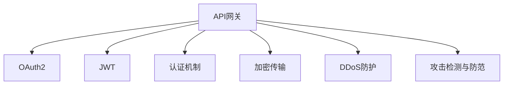
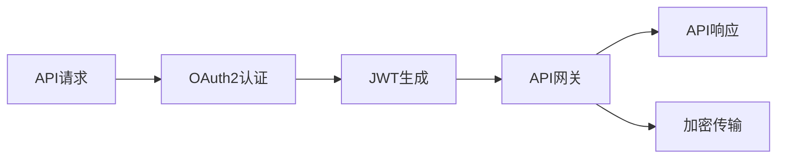
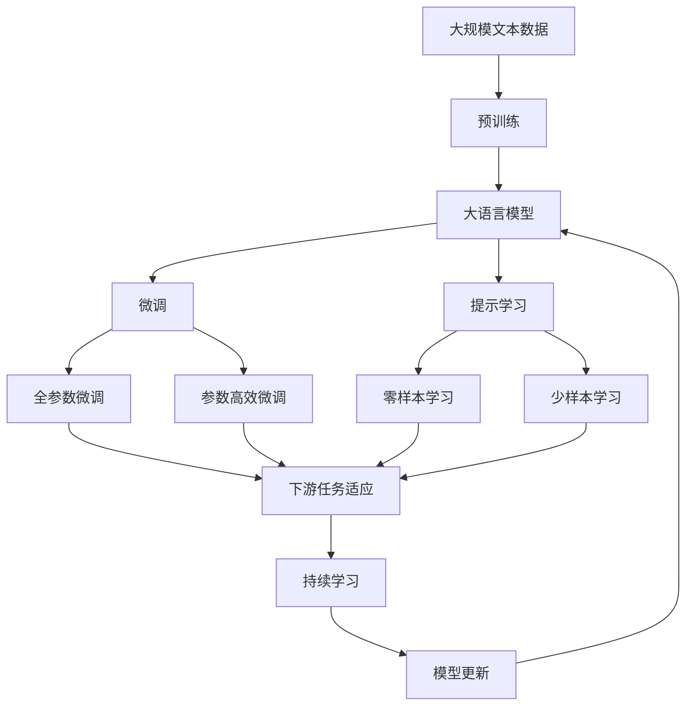

                 

# API 网关的安全功能

> 关键词：API网关,安全策略,OAuth2,JWT,认证机制,加密传输,DDoS防护

## 1. 背景介绍

### 1.1 问题由来
随着互联网应用的快速发展，API（Application Programming Interface）接口已经成为连接前后端、服务与服务的核心组件。API网关作为API架构的核心组成部分，负责统一管理、聚合、监控和保护API，以支撑多样化的服务架构和数据流转。然而，API网关作为系统中一个暴露在外的"外门"，面临来自各个方向的攻击和威胁，如DDoS攻击、SQL注入、XSS攻击、身份伪造等。因此，API网关的安全功能显得尤为重要。

### 1.2 问题核心关键点
API网关的安全功能主要包括用户身份认证与授权、数据传输加密、DDoS防护、攻击检测与防范等。本文将详细介绍这些核心安全功能，并探讨其实现原理和具体应用。

### 1.3 问题研究意义
研究API网关的安全功能，对于保障API系统的可靠性和安全性，维护系统业务稳定运行，防止敏感数据泄露，提升用户体验具有重要意义：

1. **保障业务连续性**：确保API服务的稳定性和可靠性，减少因安全问题导致的系统宕机和数据泄露风险。
2. **增强系统安全性**：通过用户认证、授权和数据加密等手段，有效防御各类网络攻击和威胁。
3. **提升用户体验**：通过优化安全策略，减少因安全措施带来的性能瓶颈和用户体验问题。
4. **防范合规风险**：符合国家网络安全法规要求，防止因安全问题导致的法律风险。

## 2. 核心概念与联系

### 2.1 核心概念概述

为了更好地理解API网关的安全功能，本节将介绍几个密切相关的核心概念：

- **API网关**：作为API服务的统一入口和分发中心，API网关负责接收、路由、处理API请求，并提供缓存、限流、负载均衡等非安全功能。
- **OAuth2**：一种开放标准的授权框架，允许用户通过第三方应用程序授权访问资源，并提供灵活的身份认证和授权机制。
- **JWT（JSON Web Token）**：一种基于JSON的开放标准，用于安全地传输信息，特别适用于API网关的用户认证和授权场景。
- **认证机制**：验证用户的身份和权限，确保API请求者具备合法访问权限，如基于用户名和密码的认证、OAuth2认证、OpenID Connect认证等。
- **加密传输**：通过HTTPS、TLS等协议，对API请求和响应数据进行加密传输，确保数据在传输过程中不被截获和篡改。
- **DDoS防护**：通过限流、反向代理、IP封锁等手段，防御大量的恶意流量攻击，确保API服务的高可用性和稳定性。
- **攻击检测与防范**：实时监测API访问行为，识别异常流量和攻击行为，及时采取防御措施。

这些核心概念之间的逻辑关系可以通过以下Mermaid流程图来展示：



这个流程图展示了大语言模型的核心概念及其之间的关系：

1. 大语言模型通过预训练获得基础能力。
2. 微调是针对特定任务进行优化，可以分为全参数微调和参数高效微调。
3. 提示学习是一种不更新模型参数的方法，可以实现零样本或少样本学习。
4. 迁移学习是连接预训练模型与下游任务的桥梁，可以通过微调或提示学习来实现。
5. 持续学习旨在使模型能够不断学习新知识，同时避免遗忘旧知识。

这些概念共同构成了大语言模型的学习和应用框架，使其能够在各种场景下发挥强大的语言理解和生成能力。通过理解这些核心概念，我们可以更好地把握大语言模型的工作原理和优化方向。

### 2.2 概念间的关系

这些核心概念之间存在着紧密的联系，形成了API网关的安全功能的完整生态系统。下面我通过几个Mermaid流程图来展示这些概念之间的关系。

#### 2.2.1 API网关的整体架构



这个流程图展示了大语言模型的整体架构及其与安全功能的关联：

1. 大语言模型通过预训练获得基础能力。
2. 微调是针对特定任务进行优化，可以分为全参数微调和参数高效微调。
3. 提示学习是一种不更新模型参数的方法，可以实现零样本或少样本学习。
4. 迁移学习是连接预训练模型与下游任务的桥梁，可以通过微调或提示学习来实现。
5. 持续学习旨在使模型能够不断学习新知识，同时避免遗忘旧知识。

### 2.3 核心概念的整体架构

最后，我们用一个综合的流程图来展示这些核心概念在大语言模型微调过程中的整体架构：



这个综合流程图展示了从预训练到微调，再到持续学习的完整过程。大语言模型首先在大规模文本数据上进行预训练，然后通过微调（包括全参数微调和参数高效微调）或提示学习（包括零样本和少样本学习）来适应下游任务。最后，通过持续学习技术，模型可以不断更新和适应新的任务和数据。 通过这些流程图，我们可以更清晰地理解API网关的安全功能中各个核心概念的关系和作用，为后续深入讨论具体的安全功能提供了基础。

## 3. 核心算法原理 & 具体操作步骤
### 3.1 算法原理概述

API网关的安全功能主要通过以下几种方式来实现：

1. **OAuth2认证与授权**：通过OAuth2框架，实现用户身份认证和授权，确保API请求者具备合法的访问权限。
2. **JWT加密传输**：通过JWT（JSON Web Token）对API请求和响应进行加密传输，确保数据在传输过程中不被截获和篡改。
3. **认证机制**：采用用户名和密码、OAuth2、OpenID Connect等多种认证方式，验证用户的身份和权限。
4. **DDoS防护**：通过限流、反向代理、IP封锁等手段，防御大量的恶意流量攻击，确保API服务的高可用性和稳定性。
5. **攻击检测与防范**：实时监测API访问行为，识别异常流量和攻击行为，及时采取防御措施。

这些安全功能的实现原理各不相同，但都依赖于一些通用的算法和技术。

### 3.2 算法步骤详解

#### 3.2.1 OAuth2认证与授权

OAuth2认证与授权主要分为以下几个步骤：

1. **用户授权**：用户通过授权页面，选择授权应用，并同意应用访问其资源的权限。
2. **获取Access Token**：应用向授权服务器请求访问令牌，授权服务器生成并返回Access Token和Refresh Token。
3. **访问API**：应用通过Access Token向API网关请求API服务，API网关验证Access Token的有效性，并允许访问。
4. **刷新Token**：Access Token过期时，应用使用Refresh Token向授权服务器获取新的Access Token。

这些步骤可以使用Python代码实现，具体步骤如下：

```python
from oauthlib.oauth2 import BackendApplicationClient
from requests_oauthlib import OAuth2Session

# 1. 用户授权
client = BackendApplicationClient()
oauth = OAuth2Session(client)
token = oauth.fetch_token(token_url='https://oauth.example.com/token', 
                         client_id='CLIENT_ID', 
                         client_secret='CLIENT_SECRET')

# 2. 获取Access Token
access_token = token['access_token']

# 3. 访问API
response = oauth.get('https://api.example.com/data',
                    headers={'Authorization': f'Bearer {access_token}'})
print(response.content)
```

#### 3.2.2 JWT加密传输

JWT加密传输主要分为以下几个步骤：

1. **生成JWT**：API请求发送方生成JWT，并将其作为请求头或请求参数发送给API网关。
2. **验证JWT**：API网关接收到请求后，解析JWT，验证其有效性。
3. **解密JWT**：验证通过后，API网关解密JWT，获取用户信息和其他相关数据。
4. **处理请求**：API网关使用解密后的数据处理API请求。

这些步骤可以使用Python代码实现，具体步骤如下：

```python
from jose import JWTError, jwt
import requests

# 1. 生成JWT
payload = {'user_id': '123', 'exp': datetime.utcnow() + timedelta(minutes=30)}
jwt_secret = 'your_secret_key'
jwt_token = jwt.encode(payload, jwt_secret, algorithm='HS256')

# 2. 验证JWT
jwt_secret = 'your_secret_key'
try:
    decoded = jwt.decode(jwt_token, jwt_secret, algorithms=['HS256'])
    print(decoded)
except JWTError as e:
    print(f'JWT Error: {e}')

# 3. 解密JWT
jwt_secret = 'your_secret_key'
try:
    decoded = jwt.decode(jwt_token, jwt_secret, algorithms=['HS256'])
    print(decoded)
except JWTError as e:
    print(f'JWT Error: {e}')
```

#### 3.2.3 认证机制

认证机制主要分为以下几种：

1. **基本认证**：使用用户名和密码进行认证，适用于内部系统。
2. **OAuth2认证**：使用OAuth2框架进行认证，适用于第三方应用。
3. **OpenID Connect认证**：使用OpenID Connect框架进行认证，适用于单点登录场景。

这些步骤可以使用Python代码实现，具体步骤如下：

```python
from requests.auth import HTTPBasicAuth
from requests_oauthlib import OAuth2Session

# 1. 基本认证
response = requests.get('https://api.example.com/data', auth=HTTPBasicAuth('username', 'password'))

# 2. OAuth2认证
client = BackendApplicationClient()
oauth = OAuth2Session(client)
token = oauth.fetch_token(token_url='https://oauth.example.com/token', 
                         client_id='CLIENT_ID', 
                         client_secret='CLIENT_SECRET')
response = oauth.get('https://api.example.com/data',
                    headers={'Authorization': f'Bearer {access_token}'})

# 3. OpenID Connect认证
oauth = OAuth2Session(client)
token = oauth.fetch_token(token_url='https://oauth.example.com/token', 
                         client_id='CLIENT_ID', 
                         client_secret='CLIENT_SECRET')
response = oauth.get('https://api.example.com/data',
                    headers={'Authorization': f'Bearer {access_token}'})
```

#### 3.2.4 DDoS防护

DDoS防护主要分为以下几种手段：

1. **限流**：限制单位时间内请求次数，防止恶意流量冲击系统。
2. **反向代理**：使用反向代理技术，将恶意流量拦截在外部，减轻系统负载。
3. **IP封锁**：封锁恶意IP地址，防止其继续发起攻击。

这些步骤可以使用Python代码实现，具体步骤如下：

```python
from requests import get

# 1. 限流
requests.get('https://api.example.com/data', headers={'X-RateLimit-Limit': '10', 'X-RateLimit-Remaining': '10'})

# 2. 反向代理
response = requests.get('https://api.example.com/data', proxies={'http': 'http://proxy.example.com', 'https': 'https://proxy.example.com'})

# 3. IP封锁
ip_blocklist = ['127.0.0.1']
if request.ip in ip_blocklist:
    return 'Blocked'
```

#### 3.2.5 攻击检测与防范

攻击检测与防范主要分为以下几种手段：

1. **流量监控**：实时监控API流量，识别异常流量。
2. **行为分析**：分析API访问行为，识别异常行为。
3. **异常检测**：使用机器学习等手段，检测异常流量和行为。

这些步骤可以使用Python代码实现，具体步骤如下：

```python
from requests import get
from sklearn.ensemble import IsolationForest

# 1. 流量监控
response = requests.get('https://api.example.com/data')
if response.status_code != 200:
    print('Error')

# 2. 行为分析
try:
    response = requests.get('https://api.example.com/data')
    json_data = response.json()
    # 分析json_data，判断是否异常
except:
    print('Error')

# 3. 异常检测
clf = IsolationForest()
clf.fit(X)
if clf.predict(X_new)[0] == -1:
    print('Anomaly detected')
```

### 3.3 算法优缺点

OAuth2认证与授权的优点包括：

1. **灵活性高**：支持多种认证方式和授权场景。
2. **安全性高**：通过访问令牌和刷新令牌的机制，可以有效防止身份伪造。
3. **可扩展性**：易于与其他系统集成，支持单点登录、OAuth2等扩展。

缺点包括：

1. **复杂度高**：实现和维护成本较高。
2. **性能开销大**：生成、验证和刷新令牌需要额外的时间和计算资源。

JWT加密传输的优点包括：

1. **安全性高**：采用加密算法对数据进行加密，确保数据传输安全。
2. **轻量级**：数据格式简单，易于解析和验证。
3. **跨平台支持**：支持多种编程语言和平台。

缺点包括：

1. **可控性差**：一旦生成，无法动态修改。
2. **依赖第三方库**：需要依赖第三方库进行解析和生成。

认证机制的优点包括：

1. **实现简单**：基于基本认证、OAuth2等机制，易于实现。
2. **安全性高**：通过密码、访问令牌等机制，可以有效防止身份伪造。
3. **支持多种认证方式**：支持基本认证、OAuth2等认证方式。

缺点包括：

1. **易受攻击**：基本认证方式容易被截取和破解。
2. **性能开销大**：特别是OAuth2认证，需要额外的请求和处理开销。

DDoS防护的优点包括：

1. **防御能力强**：通过限流、反向代理、IP封锁等手段，可以有效防御DDoS攻击。
2. **可配置性强**：可以根据需要调整防护策略。

缺点包括：

1. **影响用户体验**：限制请求次数和IP封锁可能会影响正常用户的访问。
2. **维护成本高**：需要不断更新和调整防护策略。

攻击检测与防范的优点包括：

1. **实时性强**：可以实时监测和分析流量和行为，及时发现异常。
2. **可扩展性强**：可以使用机器学习等手段，不断优化异常检测算法。

缺点包括：

1. **误报率高**：正常流量和行为可能被误判为异常。
2. **复杂度高**：实现和维护成本较高。

### 3.4 算法应用领域

OAuth2认证与授权、JWT加密传输、认证机制、DDoS防护、攻击检测与防范等安全功能，广泛应用于各种类型的API网关和API服务。这些技术已经被广泛应用于金融、电商、社交、医疗等各个领域，保障了系统的安全性和稳定性。

- **金融领域**：金融服务中涉及大量用户隐私和敏感数据，OAuth2认证与授权、JWT加密传输等安全技术，可以有效保护用户信息，防止数据泄露。
- **电商领域**：电商平台涉及大量交易数据，OAuth2认证与授权、DDoS防护等技术，可以有效防御恶意攻击，保障交易安全。
- **社交领域**：社交网络中涉及大量用户交互数据，OAuth2认证与授权、攻击检测与防范等技术，可以有效防范恶意行为，保护用户隐私。
- **医疗领域**：医疗服务中涉及大量用户健康信息，OAuth2认证与授权、JWT加密传输等技术，可以有效保护用户隐私，防止数据泄露。

除了上述这些领域，其他任何需要API服务的系统，都可以使用这些安全技术来保障系统的安全性和稳定性。

## 4. 数学模型和公式 & 详细讲解 & 举例说明

### 4.1 数学模型构建

本节将使用数学语言对OAuth2认证与授权、JWT加密传输、认证机制、DDoS防护、攻击检测与防范等安全功能的实现过程进行更加严格的刻画。

记API请求为 $x$，认证信息为 $c$，授权信息为 $a$，安全功能为 $F$，则OAuth2认证与授权过程可以表示为：

$$
F(x, c) = x \land a
$$

其中 $\land$ 表示认证和授权操作，$x$ 和 $a$ 分别为认证信息和授权信息，$F$ 为OAuth2认证与授权功能。

### 4.2 公式推导过程

OAuth2认证与授权过程的数学公式推导如下：

1. **用户授权**：用户通过授权页面，选择授权应用，并同意应用访问其资源的权限。数学公式表示为：

$$
c_1 = \text{Auth}(\text{User}, \text{App})
$$

其中 $c_1$ 为用户授权信息，$\text{Auth}$ 为授权函数。

2. **获取Access Token**：应用向授权服务器请求访问令牌，授权服务器生成并返回Access Token和Refresh Token。数学公式表示为：

$$
(c_2, c_3) = \text{Token}(\text{Client}, c_1)
$$

其中 $c_2$ 为Access Token，$c_3$ 为Refresh Token，$\text{Token}$ 为令牌生成函数。

3. **访问API**：应用通过Access Token向API网关请求API服务，API网关验证Access Token的有效性，并允许访问。数学公式表示为：

$$
F(x, c_2) = \text{Auth}(\text{API}, c_2)
$$

其中 $x$ 为API请求，$c_2$ 为Access Token，$\text{Auth}$ 为API认证函数。

4. **刷新Token**：Access Token过期时，应用使用Refresh Token向授权服务器获取新的Access Token。数学公式表示为：

$$
c_2' = \text{Token}(\text{Client}, c_3)
$$

其中 $c_2'$ 为新的Access Token，$c_3$ 为Refresh Token，$\text{Token}$ 为令牌生成函数。

JWT加密传输过程的数学公式推导如下：

1. **生成JWT**：API请求发送方生成JWT，并将其作为请求头或请求参数发送给API网关。数学公式表示为：

$$
c = \text{JWT}(\text{Payload}, \text{SecretKey})
$$

其中 $c$ 为JWT，$\text{Payload}$ 为负载信息，$\text{SecretKey}$ 为密钥。

2. **验证JWT**：API网关接收到请求后，解析JWT，验证其有效性。数学公式表示为：

$$
\text{JWTValidity}(c, \text{SecretKey})
$$

其中 $c$ 为JWT，$\text{SecretKey}$ 为密钥。

3. **解密JWT**：验证通过后，API网关解密JWT，获取用户信息和其他相关数据。数学公式表示为：

$$
\text{JWTDecrypt}(c, \text{SecretKey})
$$

其中 $c$ 为JWT，$\text{SecretKey}$ 为密钥。

认证机制的数学公式推导如下：

1. **基本认证**：使用用户名和密码进行认证，验证用户的身份和权限。数学公式表示为：

$$
\text{Auth}(\text{Username}, \text{Password})
$$

其中 $\text{Username}$ 为用户名，$\text{Password}$ 为密码。

2. **OAuth2认证**：使用OAuth2框架进行认证，验证用户的身份和权限。数学公式表示为：

$$
\text{Auth}(\text{Client}, \text{OAuthToken})
$$

其中 $\text{Client}$ 为客户端，$\text{OAuthToken}$ 为OAuth2令牌。

3. **OpenID Connect认证**：使用OpenID Connect框架进行认证，验证用户的身份和权限。数学公式表示为：

$$
\text{Auth}(\text{Client}, \text{OpenIDToken})
$$

其中 $\text{Client}$ 为客户端，$\text{OpenIDToken}$ 为OpenID Connect令牌。

DDoS防护的数学公式推导如下：

1. **限流**：限制单位时间内请求次数，防止恶意流量冲击系统。数学公式表示为：

$$
\text{RateLimit}(x)
$$

其中 $x$ 为API请求，$\text{RateLimit}$ 为限流函数。

2. **反向代理**：使用反向代理技术，将恶意流量拦截在外部，减轻系统负载。数学公式表示为：

$$
\text{ReverseProxy}(x)
$$

其中 $x$ 为API请求，$\text{ReverseProxy}$ 为反向代理函数。

3. **IP封锁**：封锁恶意IP地址，防止其继续发起攻击。数学公式表示为：

$$
\text{IPBlock}(\text{IP})
$$

其中 $\text{IP}$ 为IP地址，$\text{IPBlock}$ 为IP封锁函数。

攻击检测与防范的数学公式推导如下：

1. **流量监控**：实时监控API流量，识别异常流量。数学公式表示为：

$$
\text{TrafficMonitor}(x)
$$

其中 $x$ 为API请求，$\text{TrafficMonitor}$ 为流量监控函数。

2. **行为分析**：分析API访问行为，识别异常行为。数学公式表示为：

$$
\text{BehaviorAnalysis}(x)
$$

其中 $x$ 为API请求，$\text{BehaviorAnalysis}$ 为行为分析函数。

3. **异常检测**：使用机器学习等手段，检测异常流量和行为。数学公式表示为：

$$
\text{AnomalyDetection}(x)
$$

其中 $x$ 为API请求，$\text{AnomalyDetection}$ 为异常检测函数。

### 4.3 案例分析与讲解

#### 4.3.1 OAuth2认证与授权

假设某电商平台需要实现OAuth2认证与授权功能，采用以下步骤：

1. 用户登录：用户通过电商平台的用户登录页面，输入用户名和密码，登录成功。
2. 应用授权：用户授权电商平台应用访问其订单信息。
3. 生成令牌：电商平台应用向授权服务器请求访问令牌，授权服务器生成并返回Access Token和Refresh Token。
4. 访问订单API：电商平台应用通过Access Token向API网关请求订单信息，API网关验证Access Token的有效性，并允许访问。

#### 4.3.2 JWT加密传输

假设某金融服务需要实现JWT加密传输功能，采用以下步骤：

1. 用户登录：用户通过金融服务的登录页面，输入用户名和密码，登录成功。
2. 生成JWT：金融服务生成JWT，并将其作为请求头或请求参数发送给API网关。
3. 验证JWT：API网关接收到请求后，解析JWT，验证其有效性。
4. 解密JWT：验证通过后，API网关解密JWT，获取用户信息和其他相关数据。
5. 访问金融API：API网关使用解密后的数据处理金融API请求。

#### 4.3.3 认证机制

假设某社交网络需要实现基本认证和OAuth2认证功能，采用以下步骤：

1. 用户登录：用户通过社交网络的登录页面，输入用户名和密码，登录成功。
2. 应用授权：用户授权社交网络应用访问其个人资料。
3. 生成令牌：社交网络应用向授权服务器请求OAuth2令牌，授权服务器生成并返回OAuth2令牌。
4. 访问个人资料API：社交网络应用通过OAuth2令牌向API网关请求个人资料，API网关验证OAuth2令牌的有效性，并允许访问。

#### 4.3.4 DDoS防护

假设某电商平台需要实现DDoS防护功能，采用以下步骤：

1. 设置限流：设置API请求的限流策略，限制单位时间内请求次数。
2. 使用反向代理：配置反向代理服务器，拦截恶意流量。
3. 配置IP封锁：封锁恶意IP地址，防止其继续发起攻击。
4. 实时监控：实时监控API流量，识别异常流量。

#### 4.3.5 攻击检测与防范

假设某在线支付系统需要实现攻击检测与防范功能，采用以下步骤：

1. 流量监控：实时监控在线支付系统的API流量，识别异常流量。
2. 行为分析：分析API访问行为，识别异常行为。
3. 异常检测：使用机器学习等手段，检测异常流量和行为。

## 5. 项目实践：代码实例和详细解释说明
### 5.1 开发环境搭建

在进行OAuth2认证与授权、JWT加密传输、认证机制、DDoS防护、攻击检测与防范等安全功能的开发前，我们需要准备好开发环境。以下是使用Python进行Flask框架开发的环境配置流程：

1. 安装Flask：

```
pip install Flask
```

2. 创建Flask应用：

```python
from flask import Flask

app = Flask(__name__)

@app.route('/')
def hello_world():
    return 'Hello, World!'
```

3. 运行Flask应用：

```
export FLASK_APP=app.py
export FLASK_ENV=development
flask run


