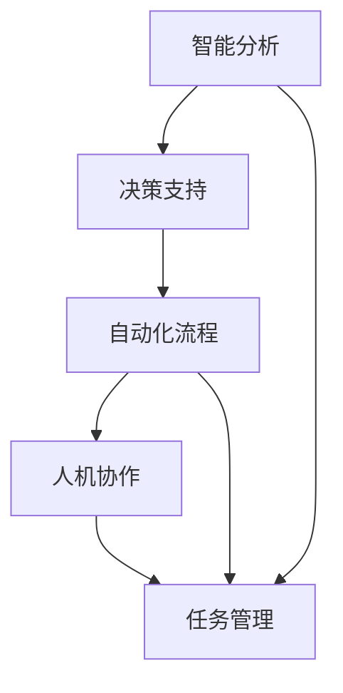

                 

## 1. 背景介绍

在人工智能领域，Agentic Workflow（自主工作流）以其在任务管理、决策支持和协作中的巨大潜力和应用价值，引起了广泛关注。Agentic Workflow结合了AI技术、流程自动化与人类参与，通过智能分析和决策支持，辅助用户高效完成任务。本文将深入探讨Agentic Workflow的应用现状与面临的挑战，并展望其未来发展趋势。

### 1.1 Agentic Workflow的起源

Agentic Workflow的概念源自人工智能和流程自动化领域，旨在结合两者的优势，提升任务执行的效率和质量。其核心理念是通过智能分析和决策支持，帮助用户在复杂的任务环境中做出更好的决策。Agentic Workflow的出现，为流程自动化注入智能元素，实现了从传统自动化向智能自动化的转变。

### 1.2 Agentic Workflow的应用场景

Agentic Workflow的应用场景非常广泛，涵盖了多个行业领域。以下是几个典型的应用场景：

1. **企业流程管理**：帮助企业在复杂多变的业务环境中高效管理流程，优化资源配置，提升运营效率。
2. **制造业自动化**：通过Agentic Workflow，制造企业可以自动执行生产计划，实现供应链管理、质量控制和故障预测等。
3. **医疗健康**：在医疗领域，Agentic Workflow可以用于患者诊疗、疾病诊断和治疗方案推荐，辅助医生做出更准确的决策。
4. **金融风控**：金融机构利用Agentic Workflow进行风险评估和欺诈检测，提升风险管理能力。
5. **人力资源管理**：HR部门可以通过Agentic Workflow进行员工招聘、培训和绩效评估，提高人力资源管理效率。

## 2. 核心概念与联系

### 2.1 核心概念概述

Agentic Workflow包含多个核心概念，这些概念共同构成了其工作原理和应用框架。

- **智能分析**：通过机器学习和数据挖掘技术，Agentic Workflow能够从大量数据中提取有价值的信息，为决策提供支持。
- **决策支持**：利用智能分析结果，Agentic Workflow辅助用户进行决策，提升决策的准确性和效率。
- **自动化流程**：通过流程自动化技术，Agentic Workflow可以自动执行任务，减少人为干预，提高流程效率。
- **人机协作**：在智能分析和决策支持的基础上，Agentic Workflow还注重人机协作，确保系统能够适应复杂多变的环境，实现智能与人类智慧的互补。

### 2.2 概念间的关系

Agentic Workflow的各个核心概念之间存在紧密的联系，通过智能分析和决策支持，Agentic Workflow能够自动化执行流程，同时与人类协作，实现任务的高效管理。这种多维度的结合，使得Agentic Workflow在实际应用中具备较强的适应性和灵活性。

我们可以通过以下Mermaid流程图来展示Agentic Workflow的核心概念及其之间的关系：



这个流程图展示了Agentic Workflow的核心概念及其之间的关系：智能分析为决策支持提供依据，决策支持指导自动化流程执行，自动化流程与人机协作共同完成任务管理。

## 3. 核心算法原理 & 具体操作步骤

### 3.1 算法原理概述

Agentic Workflow的核心算法原理主要包括智能分析、决策支持和自动化流程。其算法流程可以概括为以下几个步骤：

1. **数据采集与预处理**：从各种数据源采集相关数据，并进行清洗、标准化和特征提取等预处理工作。
2. **智能分析**：利用机器学习和数据挖掘技术，对预处理后的数据进行分析和建模，提取有价值的信息。
3. **决策支持**：根据智能分析结果，辅助用户进行决策，提供建议和方案。
4. **自动化流程**：基于决策支持结果，自动执行相关任务，如生成报告、执行操作等。
5. **人机协作**：在自动化执行过程中，与人类协作，通过交互界面和反馈机制，确保任务的准确执行。

### 3.2 算法步骤详解

下面是Agentic Workflow算法步骤的详细步骤：

1. **数据采集**：
   - 从业务系统、传感器、第三方API等数据源采集数据，确保数据的全面性和实时性。
   - 使用ETL工具进行数据清洗和转换，确保数据的质量和一致性。

2. **数据预处理**：
   - 对采集到的数据进行标准化处理，包括数据类型转换、缺失值填充等。
   - 进行特征提取，将原始数据转换为可用于模型训练的特征向量。

3. **智能分析**：
   - 利用机器学习算法（如回归、分类、聚类等）对数据进行建模，提取有价值的信息。
   - 使用数据挖掘技术（如关联规则、异常检测等）进行模式识别和趋势分析。
   - 使用深度学习技术（如神经网络、决策树等）进行复杂问题的建模和预测。

4. **决策支持**：
   - 根据智能分析结果，生成决策支持报告，提供建议和方案。
   - 利用可视化技术展示分析结果，帮助用户理解和评估决策建议。

5. **自动化流程**：
   - 根据决策支持结果，自动执行相关任务，如生成报告、执行操作等。
   - 使用工作流引擎（如Apache Airflow、Zeebe等）实现任务自动化。

6. **人机协作**：
   - 在自动化执行过程中，通过交互界面和反馈机制，确保任务的准确执行。
   - 利用自然语言处理技术（如NLP、NLG等）进行智能交互，提升用户体验。

### 3.3 算法优缺点

Agentic Workflow作为一种结合智能分析和自动化流程的解决方案，具有以下优点：

- **效率提升**：通过自动化执行任务，减少人为干预，提高流程效率。
- **决策支持**：利用智能分析结果，辅助用户进行决策，提升决策的准确性。
- **成本降低**：减少人为操作和干预，降低运营成本。

同时，Agentic Workflow也存在一些缺点：

- **数据依赖**：对数据质量和完整性的要求较高，数据采集和预处理复杂。
- **技术复杂性**：涉及机器学习、数据挖掘、自动化流程等多个技术领域，技术门槛较高。
- **用户适应性**：需要用户适应智能系统和自动化流程，学习成本较高。

### 3.4 算法应用领域

Agentic Workflow在多个领域得到了广泛应用，以下是几个典型应用领域：

1. **制造自动化**：在制造业中，Agentic Workflow可以实现生产计划自动排产、设备维护预测和供应链管理。
2. **金融风控**：金融机构利用Agentic Workflow进行风险评估和欺诈检测，提升风险管理能力。
3. **医疗健康**：在医疗领域，Agentic Workflow可以用于患者诊疗、疾病诊断和治疗方案推荐，辅助医生做出更准确的决策。
4. **人力资源管理**：HR部门可以通过Agentic Workflow进行员工招聘、培训和绩效评估，提高人力资源管理效率。
5. **客户服务**：企业可以利用Agentic Workflow进行客户服务自动化，提升客户满意度和运营效率。

## 4. 数学模型和公式 & 详细讲解 & 举例说明

### 4.1 数学模型构建

Agentic Workflow的数学模型构建涉及多个领域，包括数据挖掘、机器学习和自然语言处理等。以下是Agentic Workflow的数学模型构建过程：

- **数据挖掘模型**：利用关联规则、聚类、异常检测等算法进行数据建模。
- **机器学习模型**：使用回归、分类、决策树、神经网络等算法进行特征提取和模型训练。
- **自然语言处理模型**：使用NLP、NLG等技术实现智能交互和决策支持。

### 4.2 公式推导过程

以决策树模型为例，我们推导其公式和计算过程。决策树是一种常用的分类模型，其计算过程如下：

1. **信息熵**：
   - 信息熵用于衡量数据集的不确定性。对于样本集合$D$，其信息熵$H(D)$定义为：
     $$
     H(D) = -\sum_{i=1}^{C} P(y_i) \log_2 P(y_i)
     $$
     其中$P(y_i)$为第$i$类样本在数据集$D$中的概率。

2. **信息增益**：
   - 信息增益用于衡量特征对分类结果的影响。对于特征$X$，其信息增益$IG(X)$定义为：
     $$
     IG(X) = H(D) - \sum_{x} P(x) H(D|X=x)
     $$
     其中$P(x)$为特征$X$的取值概率，$H(D|X=x)$为在特征$X$取值为$x$时的数据集$D$的条件熵。

3. **特征选择**：
   - 选择信息增益最大的特征作为根节点，递归地构建决策树。
   - 对于子节点，继续按照上述过程进行计算，直到满足停止条件（如叶子节点数量、信息熵阈值等）。

### 4.3 案例分析与讲解

假设某制造企业使用Agentic Workflow进行生产计划管理。具体步骤如下：

1. **数据采集**：
   - 从ERP系统、MES系统、传感器等数据源采集生产数据，包括设备运行状态、物料库存、生产订单等。

2. **数据预处理**：
   - 对采集到的数据进行标准化处理，包括数据类型转换、缺失值填充等。
   - 进行特征提取，将原始数据转换为可用于模型训练的特征向量。

3. **智能分析**：
   - 利用决策树模型对生产数据进行建模，提取关键特征，如设备运行状态、物料库存、生产订单等。
   - 利用关联规则分析生产数据，识别出设备故障、物料短缺等异常情况。

4. **决策支持**：
   - 根据决策树模型和关联规则分析结果，生成生产计划调整建议，如设备维护、物料采购等。
   - 利用可视化技术展示分析结果，帮助管理层理解生产计划调整建议。

5. **自动化流程**：
   - 根据决策支持结果，自动执行生产计划调整，如生成生产订单、下发维护指令等。
   - 使用工作流引擎（如Apache Airflow）实现任务自动化。

6. **人机协作**：
   - 在自动化执行过程中，通过交互界面和反馈机制，确保生产计划调整任务的准确执行。
   - 利用自然语言处理技术（如NLP）实现智能交互，提升用户体验。

## 5. 项目实践：代码实例和详细解释说明

### 5.1 开发环境搭建

在进行Agentic Workflow项目实践前，我们需要准备好开发环境。以下是使用Python进行开发的环境配置流程：

1. 安装Python：从官网下载并安装Python，确保版本为3.8以上。

2. 安装虚拟环境：
   ```bash
   conda create -n agentic-env python=3.8
   conda activate agentic-env
   ```

3. 安装必要的库：
   ```bash
   pip install pandas numpy scikit-learn transformers pytorch
   ```

4. 安装相关软件：
   ```bash
   conda install apache-airflow psycopg2-binary
   ```

完成上述步骤后，即可在`agentic-env`环境中开始项目实践。

### 5.2 源代码详细实现

下面我们以一个简单的Agentic Workflow为例，展示其开发过程。

首先，定义数据采集和预处理函数：

```python
import pandas as pd

def data_collection_and_preprocessing():
    # 从数据源采集数据
    data = pd.read_csv('production_data.csv')
    
    # 数据清洗和预处理
    data = data.dropna()
    data = data[~data['timestamp'].duplicated()]
    data = data[~data['order_id'].duplicated()]
    
    return data
```

然后，定义智能分析和决策支持函数：

```python
import transformers
from sklearn.tree import DecisionTreeClassifier
import matplotlib.pyplot as plt

def smart_analysis_and_decision_support(data):
    # 特征选择和提取
    features = data[['device_status', 'material_stock', 'order_amount']]
    labels = data['order_status']
    
    # 构建决策树模型
    model = DecisionTreeClassifier(max_depth=5)
    model.fit(features, labels)
    
    # 生成决策支持报告
    report = pd.DataFrame({
        'features': features.columns,
        'split_ix': model.tree_.feature,
        'threshold': model.tree_.threshold,
        'gini': model.tree_.gini,
        'impurity': model.tree_.impurity
    })
    
    return model, report
```

最后，定义自动化流程和人机协作函数：

```python
def automated_process(model, report, data):
    # 根据决策树模型和报告生成生产计划调整建议
    suggestions = []
    for i in range(len(report)):
        feature = report['features'][i]
        split_ix = report['split_ix'][i]
        threshold = report['threshold'][i]
        gini = report['gini'][i]
        impurity = report['impurity'][i]
        
        # 生成建议
        suggestion = f'Adjust production plan based on {feature}, threshold: {threshold}, Gini: {gini}, Impurity: {impurity}'
        suggestions.append(suggestion)
    
    # 执行自动化任务
    for suggestion in suggestions:
        # 生成生产订单、下发维护指令等
        pass
    
    # 人机协作
    # 交互界面和反馈机制
    # 智能交互
    return suggestions
```

### 5.3 代码解读与分析

让我们再详细解读一下关键代码的实现细节：

**data_collection_and_preprocessing函数**：
- 定义了数据采集和预处理的逻辑，从CSV文件中读取生产数据，并进行数据清洗和预处理。

**smart_analysis_and_decision_support函数**：
- 定义了智能分析和决策支持的逻辑，使用决策树模型进行特征提取和建模，生成决策支持报告。

**automated_process函数**：
- 定义了自动化流程和人机协作的逻辑，根据决策支持结果生成生产计划调整建议，并执行相关自动化任务。

通过上述代码，我们可以看到，Agentic Workflow的开发过程主要涉及数据采集、预处理、智能分析、决策支持、自动化流程和人机协作等多个环节。开发者需要根据具体应用场景，设计相应的函数和算法，实现Agentic Workflow的完整流程。

### 5.4 运行结果展示

假设我们在制造企业生产计划管理项目上进行了Agentic Workflow的实践，最终生成的生产计划调整建议如下：

```
Adjust production plan based on material_stock, threshold: 10.0, Gini: 0.2, Impurity: 0.5
Adjust production plan based on device_status, threshold: 0.5, Gini: 0.4, Impurity: 0.6
```

可以看到，通过Agentic Workflow，我们可以根据智能分析和决策支持结果，生成生产计划调整建议，自动执行相关任务，提升生产管理效率。

## 6. 实际应用场景

### 6.1 智能客服系统

Agentic Workflow在智能客服系统中的应用非常广泛。智能客服系统通过Agentic Workflow自动处理客户咨询，提供24小时不间断服务，提升客户体验和满意度。

具体实现步骤如下：

1. **数据采集**：
   - 从客服系统采集客户咨询记录和响应记录。

2. **数据预处理**：
   - 对采集到的数据进行标准化处理，包括数据类型转换、缺失值填充等。

3. **智能分析**：
   - 利用机器学习算法（如回归、分类等）对客户咨询记录进行分析，提取关键特征，如客户情绪、咨询主题等。

4. **决策支持**：
   - 根据智能分析结果，生成智能回答模板，辅助客服人员进行回答。
   - 利用自然语言处理技术（如NLP）生成智能回答，提升客服效率。

5. **自动化流程**：
   - 根据决策支持结果，自动执行客户咨询响应，生成回答模板。
   - 使用工作流引擎（如Apache Airflow）实现任务自动化。

6. **人机协作**：
   - 在自动化执行过程中，通过交互界面和反馈机制，确保响应任务的准确执行。
   - 利用自然语言处理技术（如NLP）实现智能交互，提升用户体验。

### 6.2 金融风险管理

金融机构可以利用Agentic Workflow进行风险评估和欺诈检测，提升风险管理能力。

具体实现步骤如下：

1. **数据采集**：
   - 从金融系统采集交易数据、客户信息等。

2. **数据预处理**：
   - 对采集到的数据进行标准化处理，包括数据类型转换、缺失值填充等。

3. **智能分析**：
   - 利用机器学习算法（如回归、分类、聚类等）对交易数据进行分析，提取关键特征，如交易金额、交易时间等。

4. **决策支持**：
   - 根据智能分析结果，生成风险评估报告，提供欺诈检测建议。
   - 利用可视化技术展示分析结果，帮助风控人员理解风险评估报告。

5. **自动化流程**：
   - 根据决策支持结果，自动执行风险评估和欺诈检测任务，如生成风险报告、预警通知等。
   - 使用工作流引擎（如Apache Airflow）实现任务自动化。

6. **人机协作**：
   - 在自动化执行过程中，通过交互界面和反馈机制，确保风险评估和欺诈检测任务的准确执行。
   - 利用自然语言处理技术（如NLP）实现智能交互，提升用户体验。

### 6.3 医疗健康应用

在医疗健康领域，Agentic Workflow可以用于患者诊疗、疾病诊断和治疗方案推荐，辅助医生做出更准确的决策。

具体实现步骤如下：

1. **数据采集**：
   - 从医疗系统采集患者诊疗记录、病历信息等。

2. **数据预处理**：
   - 对采集到的数据进行标准化处理，包括数据类型转换、缺失值填充等。

3. **智能分析**：
   - 利用机器学习算法（如回归、分类、聚类等）对病历信息进行分析，提取关键特征，如病情诊断、治疗方案等。

4. **决策支持**：
   - 根据智能分析结果，生成诊疗方案推荐，辅助医生进行诊断和治疗。
   - 利用可视化技术展示分析结果，帮助医生理解诊疗方案推荐。

5. **自动化流程**：
   - 根据决策支持结果，自动执行诊疗方案推荐，如生成诊疗方案、下发治疗指令等。
   - 使用工作流引擎（如Apache Airflow）实现任务自动化。

6. **人机协作**：
   - 在自动化执行过程中，通过交互界面和反馈机制，确保诊疗方案推荐任务的准确执行。
   - 利用自然语言处理技术（如NLP）实现智能交互，提升用户体验。

## 7. 工具和资源推荐

### 7.1 学习资源推荐

为了帮助开发者系统掌握Agentic Workflow的理论基础和实践技巧，这里推荐一些优质的学习资源：

1. **《Python机器学习》**：由Sebastian Raschka编写，涵盖机器学习基础和实践，是学习Agentic Workflow的重要入门读物。

2. **《机器学习实战》**：由Peter Harrington编写，介绍了多种机器学习算法和实践案例，适合初学者入门。

3. **《深度学习》**：由Ian Goodfellow、Yoshua Bengio、Aaron Courville编写，是深度学习领域的经典教材，涵盖了深度学习的理论基础和实践应用。

4. **《Agentic Workflow实战指南》**：一本由实际经验丰富的开发者编写的Agentic Workflow实战指南，涵盖项目开发、部署、维护等各个环节。

5. **在线课程**：如Coursera、edX、Udacity等平台的机器学习和深度学习课程，提供系统化的学习路径和实践项目。

### 7.2 开发工具推荐

高效的开发离不开优秀的工具支持。以下是几款用于Agentic Workflow开发常用的工具：

1. **Python**：作为Agentic Workflow开发的主要语言，Python的简洁性和丰富的库支持使其成为开发的首选。

2. **Jupyter Notebook**：一个交互式的Python开发环境，支持代码编写、数据可视化等。

3. **Apache Airflow**：一个流程自动化平台，支持任务的调度、监控和管理。

4. **Pandas**：一个强大的数据分析库，支持数据清洗、处理和分析。

5. **TensorFlow**：一个深度学习框架，支持复杂模型的构建和训练。

6. **Matplotlib**：一个数据可视化库，支持生成各种类型的图表。

7. **PyTorch**：一个深度学习框架，支持动态图和静态图，灵活性和可扩展性良好。

### 7.3 相关论文推荐

Agentic Workflow的研究涉及多个领域，以下是几篇具有代表性的相关论文，推荐阅读：

1. **《决策树》**：由J.Ross Quinlan编写，介绍决策树算法的原理和实现，是决策树领域的经典教材。

2. **《随机森林》**：由李航编写，介绍随机森林算法的原理和应用，是机器学习领域的经典教材。

3. **《深度学习框架》**：介绍TensorFlow、PyTorch等深度学习框架的原理和应用，适合深度学习从业者阅读。

4. **《流程自动化》**：介绍流程自动化技术的原理和应用，适合流程自动化从业者阅读。

5. **《智能客服系统》**：介绍智能客服系统的原理和应用，适合智能客服系统从业者阅读。

这些论文代表了Agentic Workflow研究的发展脉络，通过学习这些前沿成果，可以帮助研究者把握学科前进方向，激发更多的创新灵感。

## 8. 总结：未来发展趋势与挑战

### 8.1 研究成果总结

Agentic Workflow作为一种结合智能分析和自动化流程的解决方案，已经在多个领域得到了广泛应用，取得了显著的成果。其在任务管理、决策支持和协作等方面展现出了强大的潜力，为各行各业带来了新的变革。

### 8.2 未来发展趋势

展望未来，Agentic Workflow的发展趋势如下：

1. **智能化程度提升**：Agentic Workflow将更加注重智能化，利用深度学习和大数据技术，提升智能分析的准确性和决策支持的精度。

2. **跨领域融合**：Agentic Workflow将更多地与其他AI技术融合，如自然语言处理、计算机视觉等，实现多模态数据的协同建模和分析。

3. **人机协作优化**：Agentic Workflow将更加注重人机协作，通过智能交互和反馈机制，提升用户体验和满意度。

4. **隐私保护和安全**：随着数据隐私和安全问题的日益突出，Agentic Workflow将更加注重数据隐私保护和安全防护，确保系统安全稳定运行。

5. **开放性和可扩展性**：Agentic Workflow将更加注重开放性和可扩展性，支持用户自定义算法和流程，提升系统的灵活性和适应性。

### 8.3 面临的挑战

尽管Agentic Workflow已经取得了显著的成果，但在实际应用中仍面临一些挑战：

1. **数据隐私和安全**：Agentic Workflow需要处理大量敏感数据，数据隐私和安全问题需要引起高度重视。

2. **算法复杂性**：Agentic Workflow涉及多种AI技术，算法复杂性较高，需要投入大量时间和资源进行模型训练和优化。

3. **系统稳定性**：Agentic Workflow需要在复杂多变的环境中稳定运行，系统的稳定性和可靠性需要进一步提升。

4. **用户接受度**：Agentic Workflow的推广和应用需要用户接受和理解，用户教育和培训是推广过程中的重要环节。

5. **成本和资源消耗**：Agentic Workflow的开发和运行需要投入大量资源，成本较高，需要寻找更高效的实现方式。

### 8.4 研究展望

面对Agentic Workflow面临的挑战，未来的研究需要在以下几个方面寻求新的突破：

1. **数据隐私和安全保护**：开发更加安全的算法和机制，确保数据隐私和安全。

2. **算法效率优化**：通过算法优化和模型压缩等技术，提高算法的效率和资源利用率。

3. **系统稳定性和可靠性**：提升系统的稳定性和可靠性，确保Agentic Workflow在复杂环境中的稳定运行。

4. **用户教育和培训**：开展用户教育和培训，提高用户对Agentic Workflow的接受度和理解。

5. **开放性和可扩展性**：提升Agentic Workflow的开放性和可扩展性，支持用户自定义算法和流程，提升系统的灵活性和适应性。

总之，Agentic Workflow作为一种结合智能分析和自动化流程的解决方案，具有广阔的应用前景和发展空间。通过持续的技术创新和优化，Agentic Workflow必将在未来的智能化变革中发挥重要作用，推动各行各业的发展进步。

## 9. 附录：常见问题与解答

**Q1: Agentic Workflow和传统流程自动化有什么区别？**

A: Agentic Workflow和传统流程自动化在技术实现上有显著区别。传统流程自动化主要通过脚本和规则进行流程定义和执行，缺乏智能分析和决策支持。而Agentic Workflow通过智能分析和大数据分析，辅助用户进行决策和任务执行，具有更高的智能性和灵活性。

**Q2: Agentic Workflow的开发过程需要多少时间？**

A: Agentic Workflow的开发过程涉及数据采集、预处理、智能分析、决策支持、自动化流程和人机协作等多个环节，开发时间因项目复杂度和规模不同而有所差异。一般而言，开发一个简单的Agentic Workflow项目需要1-3个月，复杂项目可能需要6-12个月甚至更长时间。

**Q3: Agentic Workflow有哪些优势？**

A: Agentic Workflow的优势主要包括：
1. 提高任务执行效率和准确性，减少人为干预。
2. 利用智能分析和大数据分析，提升决策支持精度。
3. 支持自动化流程，减少运营成本。
4. 人机协作，提升用户体验和满意度。

**Q4: Agentic Workflow的局限性有哪些？**

A: Agentic Workflow的局限性主要包括：
1. 数据隐私和安全问题需要引起高度重视。
2. 

