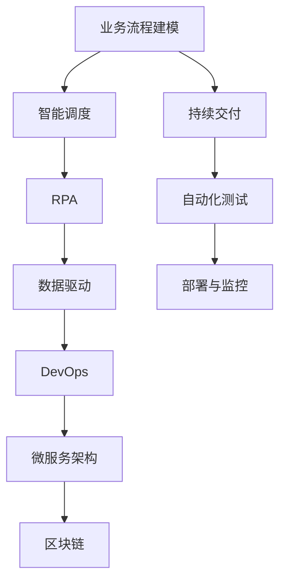
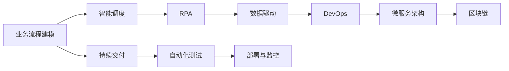

                 

# Agentic Workflow的应用现状分析

> 关键词：Agentic Workflow, 工作流管理, 智能自动化, 数据驱动, 系统优化, 持续交付

## 1. 背景介绍

### 1.1 问题由来
随着数字化转型的深入，企业对业务流程的自动化需求日益增长。如何高效、智能地管理复杂的业务流程，成为当前IT行业的焦点。Agentic Workflow（即代理工作流）作为一种新型的业务流程管理方式，以其智能自动化和数据驱动的特点，在企业数字化转型中占据了越来越重要的地位。

Agentic Workflow通过对业务流程进行建模和优化，利用先进的技术手段（如人工智能、机器学习、区块链等），实现业务流程的自动化、智能化和持续优化。通过Agentic Workflow，企业可以大幅提升业务流程的效率和质量，降低运营成本，提高市场竞争力。

### 1.2 问题核心关键点
Agentic Workflow的核心思想是通过构建智能化的流程引擎，利用数据驱动的决策机制，实现对业务流程的全生命周期管理。其关键点包括：

- 流程建模：构建抽象的业务流程模型，定义流程中的任务、条件、决策点等要素。
- 智能调度：利用AI算法优化任务调度，确保流程的高效执行。
- 数据驱动：通过实时数据监控和分析，指导流程的优化和调整。
- 智能自动化：利用机器人流程自动化(RPA)技术，实现流程的自动化执行。
- 持续交付：采用DevOps理念，实现流程的持续改进和交付。

这些核心要素共同构成了Agentic Workflow的完整生态，为企业提供了全面的业务流程自动化解决方案。

### 1.3 问题研究意义
Agentic Workflow在数字化转型的浪潮中，扮演着至关重要的角色。其研究意义主要体现在以下几个方面：

- 提升运营效率：通过自动化和智能化管理，大幅提升业务流程的处理速度和准确性。
- 降低运营成本：减少人力依赖，降低企业运营成本。
- 增强市场竞争力：通过高效、智能的业务流程，提升企业市场响应速度和市场竞争力。
- 改善客户体验：通过优化流程，提升服务质量和客户满意度。
- 驱动数字化创新：为数字化转型提供有力支撑，推动企业向智能制造、智能服务等方向转型。

Agentic Workflow的应用，将极大地推动企业数字化转型的进程，助力企业在数字经济时代取得更大的成功。

## 2. 核心概念与联系

### 2.1 核心概念概述

为更好地理解Agentic Workflow的核心概念，本节将介绍几个密切相关的核心概念：

- Agentic Workflow：即代理工作流，通过智能化的流程引擎，实现业务流程的自动化、智能化和持续优化。
- 业务流程建模：构建抽象的业务流程模型，定义流程中的任务、条件、决策点等要素。
- 机器人流程自动化（RPA）：通过软件机器人模拟人类操作，自动执行重复性、规则性的任务。
- 数据驱动：通过实时数据监控和分析，指导流程的优化和调整。
- DevOps：采用DevOps理念，实现流程的持续改进和交付。
- 微服务架构：将流程拆分为多个独立的服务，实现系统的模块化和弹性。
- 区块链：利用区块链技术，确保流程的透明性、安全性和可追溯性。

这些核心概念之间的逻辑关系可以通过以下Mermaid流程图来展示：



这个流程图展示了大语言模型微调过程中各个核心概念的关系和作用：

1. 业务流程建模：构建业务流程的抽象模型，为后续流程管理和优化提供基础。
2. 智能调度：通过AI算法优化任务调度，确保流程的高效执行。
3. RPA：利用机器人流程自动化技术，实现流程的自动化执行。
4. 数据驱动：通过实时数据监控和分析，指导流程的优化和调整。
5. DevOps：采用DevOps理念，实现流程的持续改进和交付。
6. 微服务架构：将流程拆分为多个独立的服务，实现系统的模块化和弹性。
7. 区块链：利用区块链技术，确保流程的透明性、安全性和可追溯性。
8. 持续交付：实现流程的持续改进和交付，保证流程的稳定性和高效性。

这些核心概念共同构成了Agentic Workflow的完整生态，为企业提供了全面的业务流程自动化解决方案。

### 2.2 概念间的关系

这些核心概念之间存在着紧密的联系，形成了Agentic Workflow的完整生态系统。下面我通过几个Mermaid流程图来展示这些概念之间的关系。

#### 2.2.1 Agentic Workflow的整体架构



这个综合流程图展示了Agentic Workflow的整体架构：

1. 业务流程建模：构建业务流程的抽象模型，为后续流程管理和优化提供基础。
2. 智能调度：通过AI算法优化任务调度，确保流程的高效执行。
3. RPA：利用机器人流程自动化技术，实现流程的自动化执行。
4. 数据驱动：通过实时数据监控和分析，指导流程的优化和调整。
5. DevOps：采用DevOps理念，实现流程的持续改进和交付。
6. 微服务架构：将流程拆分为多个独立的服务，实现系统的模块化和弹性。
7. 区块链：利用区块链技术，确保流程的透明性、安全性和可追溯性。
8. 持续交付：实现流程的持续改进和交付，保证流程的稳定性和高效性。

这些核心概念共同构成了Agentic Workflow的完整生态，为企业提供了全面的业务流程自动化解决方案。

#### 2.2.2 数据驱动在Agentic Workflow中的作用


这个流程图展示了数据驱动在Agentic Workflow中的作用：

1. 数据驱动：通过实时数据监控和分析，指导流程的优化和调整。
2. DevOps：采用DevOps理念，实现流程的持续改进和交付。
3. 微服务架构：将流程拆分为多个独立的服务，实现系统的模块化和弹性。
4. 区块链：利用区块链技术，确保流程的透明性、安全性和可追溯性。
5. 持续交付：实现流程的持续改进和交付，保证流程的稳定性和高效性。

数据驱动是Agentic Workflow中至关重要的组成部分，通过实时数据监控和分析，指导流程的优化和调整，确保流程的高效和稳定。

#### 2.2.3 DevOps在Agentic Workflow中的作用


这个流程图展示了DevOps在Agentic Workflow中的作用：

1. DevOps：采用DevOps理念，实现流程的持续改进和交付。
2. 微服务架构：将流程拆分为多个独立的服务，实现系统的模块化和弹性。
3. 区块链：利用区块链技术，确保流程的透明性、安全性和可追溯性。
4. 持续交付：实现流程的持续改进和交付，保证流程的稳定性和高效性。

DevOps是Agentic Workflow中不可或缺的组成部分，通过持续交付和自动化测试，确保流程的稳定性和高效性，提升企业市场响应速度和市场竞争力。

## 3. 核心算法原理 & 具体操作步骤
### 3.1 算法原理概述

Agentic Workflow的核心算法原理是利用数据驱动和智能调度的思想，通过构建流程模型和优化调度算法，实现对业务流程的高效管理。具体来说，包括以下几个关键步骤：

1. 流程建模：构建抽象的业务流程模型，定义流程中的任务、条件、决策点等要素。
2. 数据驱动：通过实时数据监控和分析，指导流程的优化和调整。
3. 智能调度：利用AI算法优化任务调度，确保流程的高效执行。
4. 自动化执行：利用机器人流程自动化(RPA)技术，实现流程的自动化执行。
5. 持续交付：采用DevOps理念，实现流程的持续改进和交付。

### 3.2 算法步骤详解

Agentic Workflow的算法步骤可以概括为以下几个方面：

**Step 1: 流程建模**

流程建模是Agentic Workflow的基础，通过抽象出业务流程的各个步骤，定义流程中的任务、条件、决策点等要素，为后续的流程优化和管理提供依据。具体步骤如下：

1. 定义业务流程：通过业务流程图或自然语言描述，构建业务流程的抽象模型。
2. 定义任务：将业务流程拆分为多个独立的任务，明确每个任务的具体操作和输入输出。
3. 定义条件：明确任务执行的条件，如时间、数据、权限等。
4. 定义决策点：明确流程中的决策点，如分支、合并、并行等。

**Step 2: 数据驱动**

数据驱动是Agentic Workflow的核心思想，通过实时数据监控和分析，指导流程的优化和调整。具体步骤如下：

1. 数据采集：从各个业务系统采集实时数据，包括交易数据、操作日志、系统性能数据等。
2. 数据分析：对采集到的数据进行分析，提取关键指标和异常情况。
3. 流程优化：根据分析结果，对业务流程进行优化和调整，提升流程的效率和稳定性。

**Step 3: 智能调度**

智能调度是Agentic Workflow的高级功能，通过AI算法优化任务调度，确保流程的高效执行。具体步骤如下：

1. 任务调度：根据任务的依赖关系和优先级，利用AI算法进行任务调度和优化。
2. 资源管理：利用资源调度算法，优化资源的分配和使用，确保流程的高效执行。
3. 异常处理：通过监控和异常检测，及时处理流程中的异常情况，保证流程的稳定运行。

**Step 4: 自动化执行**

自动化执行是Agentic Workflow的重要功能，通过利用机器人流程自动化(RPA)技术，实现流程的自动化执行。具体步骤如下：

1. 机器人编排：将任务按照流程模型编排，生成自动化执行的脚本或规则。
2. 机器人执行：通过机器人流程自动化技术，自动执行编排好的任务脚本。
3. 监控反馈：实时监控执行过程中的异常情况，及时进行反馈和调整。

**Step 5: 持续交付**

持续交付是Agentic Workflow的最终目标，通过采用DevOps理念，实现流程的持续改进和交付。具体步骤如下：

1. 自动化测试：利用自动化测试工具，对流程的各个环节进行测试和验证。
2. 持续改进：根据测试结果和用户反馈，持续改进和优化流程。
3. 部署与监控：通过持续交付工具，自动部署流程到生产环境，并实时监控流程运行状态。

### 3.3 算法优缺点

Agentic Workflow作为一种新兴的业务流程管理方法，具有以下优点：

- 高效性：通过数据驱动和智能调度，实现了业务流程的高效管理。
- 稳定性：通过实时监控和异常处理，保证了流程的稳定运行。
- 可扩展性：通过模块化和弹性设计，实现系统的可扩展性和灵活性。
- 可靠性：通过自动化执行和持续交付，提升了系统的可靠性和安全性。

同时，Agentic Workflow也存在一些缺点：

- 技术门槛高：需要丰富的AI、数据科学、DevOps等技术背景。
- 成本高：需要投入大量人力、物力进行流程建模、数据采集、系统部署等。
- 复杂度高：流程模型和调度算法的复杂度较高，需要精心设计和调试。
- 数据依赖：依赖高质量的数据源和实时数据采集，否则可能影响流程优化效果。

尽管存在这些局限性，但Agentic Workflow以其高效、稳定、可扩展的特点，在企业数字化转型中占据了越来越重要的地位。未来，相关研究的重点在于如何降低技术门槛、降低成本、提高复杂度管理和数据依赖性，以便更好地推广和应用Agentic Workflow。

### 3.4 算法应用领域

Agentic Workflow在多个领域中得到了广泛的应用，以下是其主要应用领域：

- 金融领域：在金融行业，Agentic Workflow被应用于交易清算、风险控制、客户服务等多个环节，提升了业务处理效率和客户满意度。
- 制造领域：在制造业中，Agentic Workflow被应用于生产计划、供应链管理、质量控制等多个环节，实现了生产的智能化和柔性化。
- 医疗领域：在医疗行业，Agentic Workflow被应用于医疗预约、病历管理、药品配送等多个环节，提高了医疗服务的效率和质量。
- 物流领域：在物流行业，Agentic Workflow被应用于订单处理、库存管理、配送调度等多个环节，优化了物流流程，降低了运营成本。
- 公共服务：在公共服务领域，Agentic Workflow被应用于行政审批、公共安全、社会保障等多个环节，提升了公共服务的效率和便捷性。

除了以上应用领域，Agentic Workflow还被广泛应用于各行各业，推动了业务流程的自动化和智能化，提高了企业的运营效率和市场竞争力。

## 4. 数学模型和公式 & 详细讲解 & 举例说明

### 4.1 数学模型构建

Agentic Workflow的数学模型主要涉及流程建模、任务调度、数据驱动和自动化执行等方面。下面将分别构建这些数学模型，并进行详细讲解。

#### 4.1.1 流程建模的数学模型

业务流程建模是Agentic Workflow的基础，通过构建流程模型，定义流程中的任务、条件、决策点等要素。具体来说，流程模型可以用有向无环图(DAG)来表示，其中节点表示任务，边表示任务之间的依赖关系。

设流程模型为 $G=(N,E)$，其中 $N$ 为任务节点集合，$E$ 为边集合。任务节点 $v_i \in N$ 表示流程中的某个任务，边的权重 $w_{ij}$ 表示任务之间的依赖关系强度。

#### 4.1.2 任务调度的数学模型

任务调度是Agentic Workflow的核心功能，通过优化任务调度和资源分配，确保流程的高效执行。任务调度的数学模型可以表示为线性规划问题，优化目标为最小化任务执行时间，约束条件为任务依赖关系和资源限制。

设任务集合为 $T$，资源集合为 $R$，任务调度向量为 $x$，资源分配向量为 $y$，任务执行时间为 $t_i$，资源消耗量为 $r_j$，任务依赖关系为 $D$。则任务调度的数学模型可以表示为：

$$
\begin{aligned}
& \min \sum_{i \in T} t_i x_i \\
& \text{s.t.} \\
& x_i = 0 \quad \text{或} \quad x_i = 1, \quad \forall i \in T \\
& \sum_{j \in R} y_j r_j \leq \sum_{i \in T} x_i r_i, \quad \forall i \in T \\
& \sum_{j \in R} y_j = 1 \\
& x_i \leq \sum_{j \in D(i)} x_j, \quad \forall i \in T
\end{aligned}
$$

其中 $x_i=1$ 表示任务 $i$ 正在执行，$x_i=0$ 表示任务 $i$ 未执行。约束条件 $x_i \leq \sum_{j \in D(i)} x_j$ 表示任务 $i$ 的执行依赖于其依赖任务 $D(i)$ 的执行。

#### 4.1.3 数据驱动的数学模型

数据驱动是Agentic Workflow的关键技术，通过实时数据监控和分析，指导流程的优化和调整。数据驱动的数学模型可以表示为时间序列预测问题，优化目标为最小化预测误差，约束条件为数据采样和模型更新频率。

设历史数据为 $D=\{d_t\}_{t=1}^T$，预测值为 $\hat{d}_t$，预测误差为 $e_t$，模型更新频率为 $f$。则数据驱动的数学模型可以表示为：

$$
\begin{aligned}
& \min \sum_{t=1}^T e_t^2 \\
& \text{s.t.} \\
& e_t = d_t - \hat{d}_t \\
& \hat{d}_{t+f} = \hat{d}_t + \Delta_t
\end{aligned}
$$

其中 $\Delta_t$ 表示模型更新的数据样本数量。

#### 4.1.4 自动化执行的数学模型

自动化执行是Agentic Workflow的重要功能，通过利用机器人流程自动化(RPA)技术，实现流程的自动化执行。自动化执行的数学模型可以表示为任务执行时间的最小化问题，优化目标为最小化任务执行时间，约束条件为任务依赖关系和资源限制。

设任务集合为 $T$，任务执行时间为 $t_i$，任务依赖关系为 $D$，资源集合为 $R$，资源消耗量为 $r_j$。则自动化执行的数学模型可以表示为：

$$
\begin{aligned}
& \min \sum_{i \in T} t_i x_i \\
& \text{s.t.} \\
& x_i = 0 \quad \text{或} \quad x_i = 1, \quad \forall i \in T \\
& \sum_{j \in R} y_j r_j \leq \sum_{i \in T} x_i r_i, \quad \forall i \in T \\
& \sum_{j \in R} y_j = 1 \\
& x_i \leq \sum_{j \in D(i)} x_j, \quad \forall i \in T
\end{aligned}
$$

其中 $x_i=1$ 表示任务 $i$ 正在执行，$x_i=0$ 表示任务 $i$ 未执行。

### 4.2 公式推导过程

#### 4.2.1 流程建模的公式推导

流程建模是Agentic Workflow的基础，通过构建流程模型，定义流程中的任务、条件、决策点等要素。具体来说，流程模型可以用有向无环图(DAG)来表示，其中节点表示任务，边表示任务之间的依赖关系。

设流程模型为 $G=(N,E)$，其中 $N$ 为任务节点集合，$E$ 为边集合。任务节点 $v_i \in N$ 表示流程中的某个任务，边的权重 $w_{ij}$ 表示任务之间的依赖关系强度。

#### 4.2.2 任务调度的公式推导

任务调度是Agentic Workflow的核心功能，通过优化任务调度和资源分配，确保流程的高效执行。任务调度的数学模型可以表示为线性规划问题，优化目标为最小化任务执行时间，约束条件为任务依赖关系和资源限制。

设任务集合为 $T$，资源集合为 $R$，任务调度向量为 $x$，资源分配向量为 $y$，任务执行时间为 $t_i$，资源消耗量为 $r_j$，任务依赖关系为 $D$。则任务调度的数学模型可以表示为：

$$
\begin{aligned}
& \min \sum_{i \in T} t_i x_i \\
& \text{s.t.} \\
& x_i = 0 \quad \text{或} \quad x_i = 1, \quad \forall i \in T \\
& \sum_{j \in R} y_j r_j \leq \sum_{i \in T} x_i r_i, \quad \forall i \in T \\
& \sum_{j \in R} y_j = 1 \\
& x_i \leq \sum_{j \in D(i)} x_j, \quad \forall i \in T
\end{aligned}
$$

其中 $x_i=1$ 表示任务 $i$ 正在执行，$x_i=0$ 表示任务 $i$ 未执行。约束条件 $x_i \leq \sum_{j \in D(i)} x_j$ 表示任务 $i$ 的执行依赖于其依赖任务 $D(i)$ 的执行。

#### 4.2.3 数据驱动的公式推导

数据驱动是Agentic Workflow的关键技术，通过实时数据监控和分析，指导流程的优化和调整。数据驱动的数学模型可以表示为时间序列预测问题，优化目标为最小化预测误差，约束条件为数据采样和模型更新频率。

设历史数据为 $D=\{d_t\}_{t=1}^T$，预测值为 $\hat{d}_t$，预测误差为 $e_t$，模型更新频率为 $f$。则数据驱动的数学模型可以表示为：

$$
\begin{aligned}
& \min \sum_{t=1}^T e_t^2 \\
& \text{s.t.} \\
& e_t = d_t - \hat{d}_t \\
& \hat{d}_{t+f} = \hat{d}_t + \Delta_t
\end{aligned}
$$

其中 $\Delta_t$ 表示模型更新的数据样本数量。

#### 4.2.4 自动化执行的公式推导

自动化执行是Agentic Workflow的重要功能，通过利用机器人流程自动化(RPA)技术，实现流程的自动化执行。自动化执行的数学模型可以表示为任务执行时间的最小化问题，优化目标为最小化任务执行时间，约束条件为任务依赖关系和资源限制。

设任务集合为 $T$，任务执行时间为 $t_i$，任务依赖关系为 $D$，资源集合为 $R$，资源消耗量为 $r_j$。则自动化执行的数学模型可以表示为：

$$
\begin{aligned}
& \min \sum_{i \in T} t_i x_i \\
& \text{s.t.} \\
& x_i = 0 \quad \text{或} \quad x_i = 1, \quad \forall i \in T \\
& \sum_{j \in R} y_j r_j \leq \sum_{i \in T} x_i r_i, \quad \forall i \in T \\
& \sum_{j \in R} y_j = 1 \\
& x_i \leq \sum_{j \in D(i)} x_j, \quad \forall i \in T
\end{aligned}
$$

其中 $x_i=1$ 表示任务 $i$ 正在执行，$x_i=0$ 表示任务 $i$ 未执行。

### 4.3 案例分析与讲解

为了更好地理解Agentic Workflow的实际应用，下面以金融行业的风险控制为例，进行详细讲解。

#### 4.3.1 案例背景

某金融公司每天处理大量交易，需要实时监控和控制风险，防止欺诈和违规行为。公司希望利用Agentic Workflow，实现风险控制的智能化和自动化。

#### 4.3.2 案例分析

1. 流程建模：构建金融交易的风险控制流程模型，定义交易审核、风险评估、异常检测等任务。
2. 数据驱动：通过实时监控交易数据，分析异常行为，指导流程优化。
3. 智能调度：利用AI算法，优化交易审核和风险评估的顺序，确保高效执行。
4. 自动化执行：通过机器人流程自动化，自动执行交易审核和风险评估，减少人力依赖。
5. 持续交付：采用DevOps理念，实现风险控制流程的持续改进和交付。

#### 4.3.3 案例讲解

1. 流程建模：构建金融交易的风险控制流程模型，定义交易审核、风险评估、异常检测等任务。任务节点包括交易审核、风险评估、异常检测等，边表示任务之间的依赖关系。
2. 数据驱动：通过实时监控交易数据，分析异常行为，指导流程优化。利用实时数据监控和分析，实时识别异常交易，优化风险控制流程。
3. 智能调度：利用AI算法，优化交易审核和风险评估的顺序，确保高效执行。利用机器学习算法，优化交易审核和风险评估的顺序，确保高效执行。
4. 自动化执行：通过机器人流程自动化，自动执行交易审核和风险评估，减少人力依赖。利用机器人流程自动化技术，自动执行交易审核和风险评估，减少人力依赖。
5. 持续交付：采用DevOps理念，实现风险控制流程的持续改进和交付。通过持续交付工具，自动部署风险控制流程到生产环境，并实时监控流程运行状态。

通过上述案例分析，可以看到Agentic Workflow在金融风险控制中的应用，显著提升了风险控制的智能化和自动化水平，降低了运营成本，提高了风险控制的效果。

## 5. 项目实践：代码实例和详细解释说明

### 5.1 开发环境搭建

在进行Agentic Workflow项目实践前，我们需要准备好开发环境。以下是使用Python进行PyTorch开发的环境配置流程：

1. 安装Anaconda：从官网下载并安装Anaconda，用于创建独立的Python环境。

2. 创建并激活虚拟环境：
```bash
conda create -n workflow-env python=3.8 
conda activate workflow-env
```

3. 安装PyTorch：根据CUDA版本

