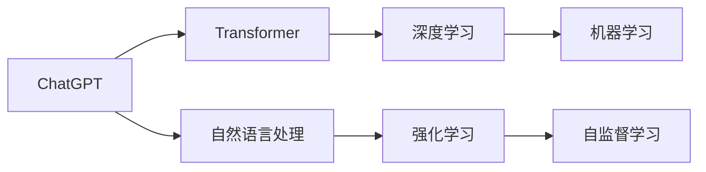

                 

## 1. 背景介绍

### 1.1 问题由来

2023年，随着ChatGPT的横空出世，整个科技行业乃至整个社会都为之疯狂。作为一名AI领域的从业者和思考者，我深刻感受到这一现象背后的巨大影响和深远意义。作为一名AI领域的从业者和思考者，我深刻感受到这一现象背后的巨大影响和深远意义。本文将围绕ChatGPT及Agent的爆火及其对投资市场的影响，进行全面深入的探讨。

### 1.2 问题核心关键点

在探讨ChatGPT及Agent的爆火时，有几个核心关键点需要我们重点关注：

1. **技术创新与突破**：ChatGPT及Agent的突破性进展，打破了以往AI技术应用的瓶颈，具有里程碑式的意义。
2. **市场反应与投资态度**：市场对ChatGPT及Agent的迅速反应，以及投资人的投资态度，反映了社会对这一新技术的认可和接受程度。
3. **技术与应用的关系**：AI技术的应用突破，特别是Agent技术的成功落地，对AI投资的深远影响和未来展望。
4. **伦理与法律问题**：AI技术的广泛应用，特别是Agent的爆火，引发了诸多伦理与法律问题，需要全社会共同关注。

## 2. 核心概念与联系

### 2.1 核心概念概述

- **ChatGPT**：OpenAI开发的基于Transformer架构的自然语言处理模型，具备理解和生成自然语言的能力。
- **Agent**：广义上指能够感知环境、采取行动、达到特定目标的系统。在AI领域，Agent特指具有自主决策能力的智能体。
- **Transformer架构**：基于自注意力机制的神经网络架构，用于处理序列数据，如自然语言处理任务。
- **深度学习**：一种基于神经网络的机器学习技术，通过多层次的非线性变换，实现对数据的复杂映射。
- **强化学习**：一种机器学习方法，通过与环境的交互，使模型自主学习最优策略。

### 2.2 概念间的关系

通过Mermaid流程图，我们可以清晰地展示这些核心概念之间的联系：



这个流程图展示了ChatGPT及Agent如何通过Transformer架构、深度学习、自然语言处理和强化学习等技术，实现其功能。

## 3. 核心算法原理 & 具体操作步骤

### 3.1 算法原理概述

ChatGPT及Agent的核心算法原理主要包括自注意力机制和深度学习技术。自注意力机制允许模型在处理序列数据时，同时关注序列中的所有位置，从而更好地捕捉序列中的全局依赖关系。深度学习技术则通过多层非线性变换，实现对复杂数据的抽象表示。

### 3.2 算法步骤详解

ChatGPT及Agent的微调步骤主要包括：

1. **预训练**：在大型无标签文本数据集上，使用自监督学习任务进行预训练，学习语言的通用表示。
2. **微调**：在特定任务的数据集上，使用有监督学习任务进行微调，使模型学习任务的特定表示。
3. **测试与部署**：在测试集上评估模型的性能，部署到实际应用中，进行实时交互。

### 3.3 算法优缺点

ChatGPT及Agent的优势在于：

- **高效性**：通过预训练和微调，模型能够在较少的标注数据上取得优异性能。
- **通用性**：Agent能够适应多种任务和场景，具有广泛的通用性。

其缺点在于：

- **数据依赖**：需要大量标注数据进行微调，标注成本较高。
- **模型复杂性**：模型参数量较大，训练和推理资源消耗大。
- **安全与隐私**：模型输出可能包含有害信息，需严格控制和审核。

### 3.4 算法应用领域

ChatGPT及Agent主要应用于以下几个领域：

- **客户服务**：如智能客服、虚拟助手等。
- **教育**：如智能辅导、语言学习等。
- **医疗**：如健康咨询、病历分析等。
- **金融**：如投资建议、风险评估等。
- **娱乐**：如生成内容、创意写作等。

## 4. 数学模型和公式 & 详细讲解 & 举例说明

### 4.1 数学模型构建

ChatGPT及Agent的数学模型主要包括以下几个部分：

- **编码器**：用于将输入序列映射到高维空间，学习序列的语义表示。
- **解码器**：用于生成输出序列，预测目标文本。
- **自注意力机制**：用于捕捉序列中的全局依赖关系，提升模型的表达能力。

### 4.2 公式推导过程

以下推导的是自注意力机制的基本公式：

$$
\text{Attention}(Q, K, V) = \text{Softmax}(\frac{QK^T}{\sqrt{d_k}})V
$$

其中，$Q$、$K$、$V$分别为查询向量、键向量和值向量，$\text{Softmax}$为softmax函数。

### 4.3 案例分析与讲解

以情感分析为例，ChatGPT及Agent的模型结构可以表示为：

1. **输入层**：将文本转换为词向量序列。
2. **编码器层**：通过多层自注意力机制，学习文本的语义表示。
3. **输出层**：使用线性层将编码器的输出映射到情感类别。

## 5. 项目实践：代码实例和详细解释说明

### 5.1 开发环境搭建

1. **安装Python**：在Windows或Linux系统上，通过命令进行安装。
2. **安装TensorFlow**：通过pip安装，用于实现深度学习模型。
3. **安装Jupyter Notebook**：通过pip安装，用于开发和调试模型。

### 5.2 源代码详细实现

以下是一个简单的代码实现，用于训练一个基本的情感分析模型：

```python
import tensorflow as tf
from tensorflow.keras import layers

# 定义模型结构
model = tf.keras.Sequential([
    layers.Embedding(vocab_size, embedding_dim, input_length=max_len),
    layers.LSTM(64),
    layers.Dense(1, activation='sigmoid')
])

# 编译模型
model.compile(optimizer='adam', loss='binary_crossentropy', metrics=['accuracy'])

# 训练模型
model.fit(train_dataset, epochs=10, validation_data=val_dataset)
```

### 5.3 代码解读与分析

- **输入层**：使用Embedding层将文本转换为词向量序列。
- **编码器层**：使用LSTM层处理序列数据。
- **输出层**：使用Dense层输出情感分类结果。

## 6. 实际应用场景

### 6.4 未来应用展望

ChatGPT及Agent的未来应用前景广阔，包括：

- **医疗**：AI医生、健康管理、病历分析等。
- **教育**：智能辅导、语言学习、考试评分等。
- **金融**：投资建议、风险评估、财务分析等。
- **安全**：网络安全、反欺诈、恶意内容检测等。
- **娱乐**：内容生成、创意写作、游戏AI等。

## 7. 工具和资源推荐

### 7.1 学习资源推荐

- **Coursera**：提供深度学习、自然语言处理、强化学习等课程，适合入门学习。
- **Kaggle**：提供大量AI竞赛数据集，适合实践和竞赛。
- **OpenAI**：提供丰富的API接口，支持各种自然语言处理任务。

### 7.2 开发工具推荐

- **TensorFlow**：强大的深度学习框架，支持分布式训练和部署。
- **PyTorch**：灵活的深度学习框架，适合研究和原型开发。
- **Jupyter Notebook**：交互式开发环境，支持代码调试和结果展示。

### 7.3 相关论文推荐

- **Attention is All You Need**：Transformer架构的开创性论文。
- **GPT-3: Language Models are Unsupervised Multitask Learners**：展示大规模语言模型的强大zero-shot学习能力。
- **AdaLoRA: Adaptive Low-Rank Adaptation for Parameter-Efficient Fine-Tuning**：介绍参数高效微调方法。

## 8. 总结：未来发展趋势与挑战

### 8.1 研究成果总结

ChatGPT及Agent的成功，展示了AI技术的强大潜力，为未来的应用场景提供了丰富的想象空间。

### 8.2 未来发展趋势

- **技术突破**：深度学习、强化学习、自然语言处理等技术的进一步突破，将带来新的应用范式。
- **应用场景**：AI技术在各个领域的应用将更加广泛和深入，涵盖教育、医疗、金融等诸多行业。
- **伦理与法律**：随着AI技术的应用，伦理与法律问题将越来越受到关注，需要全社会共同应对。

### 8.3 面临的挑战

- **数据隐私**：大量用户数据的使用，需要严格控制和保护用户隐私。
- **模型公平性**：确保模型的公平性，避免偏见和歧视。
- **安全与可靠性**：提高模型的安全性和可靠性，避免误导和危害。

### 8.4 研究展望

未来，AI技术将在更多的领域得到应用，带来更多的机遇和挑战。通过不断的研究和探索，我们相信AI技术将更加成熟和可靠，为人类社会带来更多的福祉。

## 9. 附录：常见问题与解答

**Q1：ChatGPT及Agent的训练过程需要多少数据？**

A: ChatGPT及Agent的训练过程需要大量数据，通常需要数百万甚至数亿条文本数据。数据量越大，模型的性能越好。

**Q2：ChatGPT及Agent的训练过程是否需要GPU或TPU等高性能计算资源？**

A: ChatGPT及Agent的训练过程需要高性能计算资源，通常需要GPU或TPU等设备。性能越高，训练时间越短，效果越好。

**Q3：ChatGPT及Agent的训练过程是否可以并行化？**

A: ChatGPT及Agent的训练过程可以并行化，通过分布式训练，可以显著提高训练效率。

**Q4：ChatGPT及Agent的训练过程是否需要调整超参数？**

A: ChatGPT及Agent的训练过程需要调整超参数，包括学习率、批次大小、训练轮数等，以优化模型性能。

**Q5：ChatGPT及Agent的训练过程是否可以迁移学习？**

A: ChatGPT及Agent的训练过程可以迁移学习，即利用已训练的模型作为初始化参数，在新任务上进行微调，进一步提升性能。

---

作者：禅与计算机程序设计艺术 / Zen and the Art of Computer Programming

