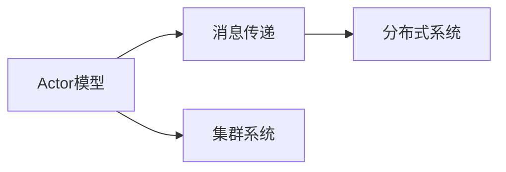
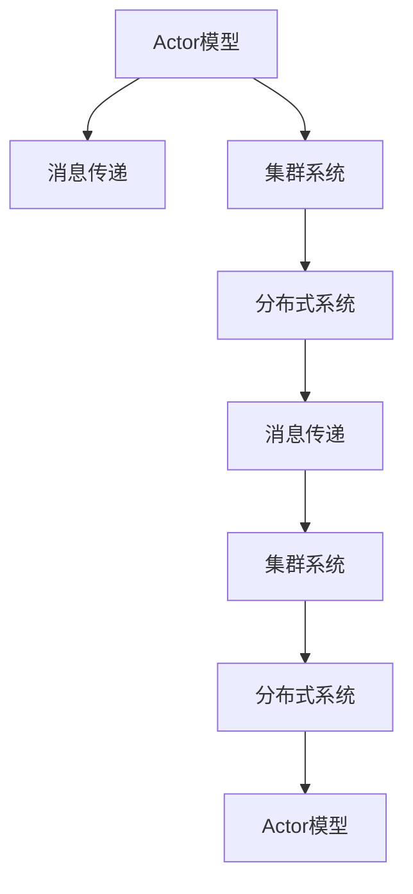

                 

# Akka集群原理与代码实例讲解

> 关键词：Akka, 分布式计算, 集群系统, Actor模型, 消息传递, 高性能

## 1. 背景介绍

### 1.1 问题由来
随着互联网应用的不断扩展，对系统的可扩展性、可用性和性能提出了更高的要求。单节点应用已经不能满足大规模系统的高并发、高可用等需求。为此，人们提出了一种新的分布式计算框架——Akka。Akka 是一个基于 Actor 模型的分布式计算框架，它提供了一种简单、可扩展的编程方式，让开发者能够方便地编写高可用的分布式系统。

## 2. 核心概念与联系

### 2.1 核心概念概述

- **Akka**：一个用于构建高性能、可扩展、容错的分布式系统的开源框架。
- **Actor模型**：一种并发编程的抽象模型，Actor之间通过消息传递进行通信。
- **消息传递**：Actor之间的通信方式，消息发送者与接收者相互独立，解耦了系统中的业务逻辑与通信逻辑。
- **集群系统**：由多个节点组成的分布式系统，每个节点可以运行多个Actor。
- **分布式系统**：通过网络通信连接多个计算机节点，共同完成一个任务的系统。

这些核心概念之间存在着紧密的联系，共同构成了Akka的分布式计算框架。Actor模型是Akka的核心，消息传递是Actor之间通信的方式，集群系统是实现Actor通信的物理基础，而分布式系统则是Akka的目标。

### 2.2 概念间的关系

我们可以用以下Mermaid流程图来展示这些核心概念之间的关系：



这个流程图展示了Actor模型、消息传递、集群系统和分布式系统之间的关系。

### 2.3 核心概念的整体架构

最后，我们用一个综合的流程图来展示这些核心概念在大语言模型微调过程中的整体架构：



这个综合流程图展示了Actor模型、消息传递、集群系统和分布式系统之间的整体架构。

## 3. 核心算法原理 & 具体操作步骤
### 3.1 算法原理概述

Akka的分布式计算框架基于Actor模型，其核心思想是：将系统拆分为多个Actor，每个Actor负责处理特定的业务逻辑，并通过消息传递进行通信。Actor之间的通信是完全异步的，每个Actor都有自己的生命周期，可以独立地启动、停止、恢复和销毁，从而提高系统的可用性和容错性。

### 3.2 算法步骤详解

Akka的分布式计算框架主要包括三个步骤：

1. **Actor创建**：通过Akka框架创建Actor，每个Actor都有自己的地址，可以通过地址进行通信。
2. **消息传递**：通过消息传递机制，Actor之间可以进行通信。消息传递包括发送消息、接收消息和处理消息。
3. **Actor生命周期管理**：通过Akka框架，可以对Actor的生命周期进行管理，包括启动、停止、恢复和销毁Actor。

### 3.3 算法优缺点

Akka的分布式计算框架具有以下优点：

1. 高可扩展性：通过集群系统，Akka可以方便地扩展系统规模。
2. 高可用性：通过Actor的生命周期管理，Akka可以保证系统的可用性和容错性。
3. 高性能：通过消息传递机制，Akka可以实现高效的通信。

同时，Akka的分布式计算框架也存在一些缺点：

1. 学习曲线陡峭：由于Actor模型的抽象性，初学者可能需要花费一定时间理解Actor模型的概念。
2. 性能瓶颈：由于Actor之间的通信需要跨节点通信，可能存在网络延迟和通信开销。
3. 调试困难：由于Actor之间的通信是完全异步的，调试起来可能比较困难。

### 3.4 算法应用领域

Akka的分布式计算框架适用于各种需要高可扩展性、高可用性和高性能的系统，例如：

- 微服务架构：通过Akka可以实现微服务架构的分布式计算，提高系统的可扩展性和可用性。
- 分布式缓存：通过Akka可以实现分布式缓存系统，提高数据访问的性能和可扩展性。
- 实时数据处理：通过Akka可以实现实时数据处理系统，例如流处理、事件驱动等。
- 分布式任务调度：通过Akka可以实现分布式任务调度系统，例如任务队列、消息队列等。

## 4. 数学模型和公式 & 详细讲解 & 举例说明
### 4.1 数学模型构建

在Akka的分布式计算框架中，Actor模型是一个抽象模型，其数学模型可以表示为：

1. **Actor创建模型**：
   - 创建Actor：Actor创建的数学模型可以表示为 `createActor(class: Class[_], args: Args[_]): Future[ActorRef]`。
   - 发送消息：发送消息的数学模型可以表示为 `sendTo(createActorRef: ActorRef, message: AnyRef): Unit`。
   - 接收消息：接收消息的数学模型可以表示为 `receive(message: Message): Unit`。

2. **消息传递模型**：
   - 发送消息：发送消息的数学模型可以表示为 `send(createActorRef: ActorRef, message: Message): Unit`。
   - 接收消息：接收消息的数学模型可以表示为 `receive(message: Message): Unit`。

3. **Actor生命周期管理模型**：
   - 启动Actor：启动Actor的数学模型可以表示为 `start(createActorRef: ActorRef): Unit`。
   - 停止Actor：停止Actor的数学模型可以表示为 `stop(createActorRef: ActorRef): Unit`。
   - 恢复Actor：恢复Actor的数学模型可以表示为 `restore(createActorRef: ActorRef): Unit`。

### 4.2 公式推导过程

我们可以用以下公式来推导Actor模型、消息传递模型和Actor生命周期管理模型：

1. **Actor创建模型**：
   - `createActor(class: Class[_], args: Args[_]): Future[ActorRef]`。

2. **消息传递模型**：
   - `send(createActorRef: ActorRef, message: Message): Unit`。
   - `receive(message: Message): Unit`。

3. **Actor生命周期管理模型**：
   - `start(createActorRef: ActorRef): Unit`。
   - `stop(createActorRef: ActorRef): Unit`。
   - `restore(createActorRef: ActorRef): Unit`。

### 4.3 案例分析与讲解

我们可以用一个简单的案例来说明Akka的分布式计算框架的基本原理：

```scala
import akka.actor._
import akka.actor.ActorSystem
import akka.actor.Props

class MyActor extends Actor with ActorLogging {
  override def receive: Receive = {
    case "hello" => println("Hello, World!")
    case "bye" => println("Bye!")
  }
}

object MyActor {
  def main(args: Array[String]): Unit = {
    val system = ActorSystem("MySystem")
    val actorRef = system.actorOf(Props[MyActor], "myActor")
    actorRef ! "hello"
    Thread.sleep(1000)
    actorRef ! "bye"
  }
}
```

在这个案例中，我们创建了一个名为 `MyActor` 的Actor，通过Actor系统启动了一个名为 `MySystem` 的系统，并将该Actor注册到系统中。通过Actor的 `receive` 方法，我们可以定义Actor的处理逻辑。在这个案例中，当接收到 "hello" 消息时，Actor输出 "Hello, World!"，当接收到 "bye" 消息时，Actor输出 "Bye!"。

## 5. 项目实践：代码实例和详细解释说明
### 5.1 开发环境搭建

在进行Akka的分布式计算框架的开发实践前，我们需要准备好开发环境。以下是使用Java进行Akka开发的环境配置流程：

1. 安装JDK：从官网下载并安装JDK，用于开发和运行Akka系统。
2. 安装Akka：从官网下载并安装Akka框架，或者使用Maven、Gradle等构建工具依赖管理。
3. 创建Akka项目：使用Maven或Gradle创建Akka项目，并配置Akka的依赖和配置文件。
4. 启动Akka系统：使用Akka的启动脚本启动Akka系统，或者在IDE中通过IDE插件启动Akka系统。

完成上述步骤后，即可在本地开发环境中进行Akka的分布式计算框架的开发实践。

### 5.2 源代码详细实现

下面我们以一个简单的分布式缓存系统为例，给出使用Akka框架实现的Java代码实现。

首先，定义一个名为 `Cache` 的Actor，用于实现分布式缓存系统：

```java
import akka.actor.ActorRef;
import akka.actor.ActorSystem;
import akka.actor.Props;
import akka.actor.UntypedActor;
import akka.io.Lease;

public class Cache extends UntypedActor {
    private final String key;
    private final ActorRef repository;

    public Cache(String key, ActorRef repository) {
        this.key = key;
        this.repository = repository;
    }

    @Override
    public void onReceive(Object message) throws Exception {
        if (message instanceof Cache.Get) {
            cacheValue();
        } else if (message instanceof Cache.Put) {
            putValue(((Cache.Put) message).value);
        } else {
            unhandled(message);
        }
    }

    private void cacheValue() {
        Lease lease = repository.ask(new Repository.Get(key));
        repository.tell(new Repository.Put(key, lease));
    }

    private void putValue(String value) {
        repository.tell(new Repository.Put(key, value));
    }
}
```

然后，定义一个名为 `Repository` 的Actor，用于实现分布式缓存系统的存储功能：

```java
import akka.actor.ActorRef;
import akka.actor.ActorSystem;
import akka.actor.Props;
import akka.io.Lease;
import akka.io.LeaseManager;
import akka.io.LeaseServices;
import akka.io.LeaseServiceKey;

public class Repository extends UntypedActor {
    private final String key;
    private final LeaseServiceKey leaseServiceKey;
    private final LeaseManager leaseManager;
    private final Map<String, Lease> leases = new HashMap<>();

    public Repository(String key, LeaseServiceKey leaseServiceKey, LeaseManager leaseManager) {
        this.key = key;
        this.leaseServiceKey = leaseServiceKey;
        this.leaseManager = leaseManager;
    }

    @Override
    public void onReceive(Object message) throws Exception {
        if (message instanceof Repository.Get) {
            leaseValue((Repository.Get) message);
        } else if (message instanceof Repository.Put) {
            putValue(((Repository.Put) message).value);
        } else {
            unhandled(message);
        }
    }

    private void leaseValue(Repository.Get get) {
        Lease lease = new Lease(get.key, get.expiry);
        leaseManager.lease(leaseServiceKey, lease, get.timeout, get.duration, get.errorTimeout);
        leases.put(get.key, lease);
        get.sender.tell(lease);
    }

    private void putValue(String value) {
        Lease lease = leases.get(key);
        if (lease == null) {
            lease = new Lease(key, value, getExpiry());
            leaseManager.lease(leaseServiceKey, lease, getTimeout(), getDuration(), getErrorTimeout());
            leases.put(key, lease);
        } else {
            lease.update(value);
        }
    }

    private String getExpiry() {
        return "60s";
    }

    private String getTimeout() {
        return "30s";
    }

    private String getDuration() {
        return "10s";
    }

    private String getErrorTimeout() {
        return "5s";
    }
}
```

最后，定义Akka系统的配置文件，配置 ActorSystem 和 LeaseManager 的参数：

```yaml
akka.actor.default-dispatcher {
    thread-pool-size: 10
}

akka.actorlease.manager {
    actor-system: mySystem
    lease-service-key: leaseServiceKey
    lease-timeout: 30s
    lease-duration: 10s
    lease-error-timeout: 5s
}

akka.actorlease.service {
    actor-system: mySystem
    lease-service-key: leaseServiceKey
}
```

在配置文件中，我们定义了Akka系统的默认线程池大小、LeaseManager的配置参数和LeaseService的配置参数。

## 6. 实际应用场景
### 6.1 智能客服系统

基于Akka的分布式计算框架，智能客服系统可以实现高并发、高可扩展和容错性。系统中的每个客服Actor可以独立处理客户的请求，通过消息传递机制进行通信，从而提高系统的可用性和容错性。

在技术实现上，可以收集企业内部的历史客服对话记录，将问题和最佳答复构建成监督数据，在此基础上对预训练对话模型进行微调。微调后的对话模型可以部署在Akka集群中，每个客服Actor可以通过消息传递机制与多个对话模型通信，从而实现智能客服系统。

### 6.2 金融舆情监测

金融舆情监测系统可以实时监测市场舆论动向，以便及时应对负面信息传播，规避金融风险。系统中的每个监控Actor可以独立监控不同类型的金融数据，通过消息传递机制进行通信，从而实现高并发和容错性。

在技术实现上，可以收集金融领域相关的新闻、报道、评论等文本数据，并对其进行主题标注和情感标注。在此基础上对预训练语言模型进行微调，使其能够自动判断文本属于何种主题，情感倾向是正面、中性还是负面。将微调后的模型部署在Akka集群中，每个监控Actor可以通过消息传递机制与多个模型通信，从而实现金融舆情监测系统。

### 6.3 个性化推荐系统

个性化推荐系统可以基于用户的历史行为数据进行推荐。系统中的每个推荐Actor可以独立处理用户的推荐请求，通过消息传递机制进行通信，从而实现高并发和容错性。

在技术实现上，可以收集用户浏览、点击、评论、分享等行为数据，提取和用户交互的物品标题、描述、标签等文本内容。将文本内容作为模型输入，用户的后续行为（如是否点击、购买等）作为监督信号，在此基础上微调预训练语言模型。微调后的模型可以部署在Akka集群中，每个推荐Actor可以通过消息传递机制与多个模型通信，从而实现个性化推荐系统。

### 6.4 未来应用展望

随着Akka的分布式计算框架不断发展，其应用范围将不断扩大。未来，Akka的分布式计算框架可能会应用于以下领域：

- 微服务架构：通过Akka可以实现微服务架构的分布式计算，提高系统的可扩展性和可用性。
- 分布式缓存：通过Akka可以实现分布式缓存系统，提高数据访问的性能和可扩展性。
- 实时数据处理：通过Akka可以实现实时数据处理系统，例如流处理、事件驱动等。
- 分布式任务调度：通过Akka可以实现分布式任务调度系统，例如任务队列、消息队列等。

## 7. 工具和资源推荐
### 7.1 学习资源推荐

为了帮助开发者系统掌握Akka的分布式计算框架的理论基础和实践技巧，这里推荐一些优质的学习资源：

1. Akka官方文档：Akka框架的官方文档，提供了完整的API文档和开发指南，是学习Akka的必读资源。
2. Scala并发编程：学习Scala并发编程技术，掌握Actor模型的编程范式。
3. Java并发编程：学习Java并发编程技术，了解Akka的底层实现。
4. Akka实战：由Akka专家编写的实战指南，提供了大量的代码实例和实践经验。
5. Akka电子书：由Akka社区编写的电子书，涵盖了Akka的各个方面，适合深入学习。

通过对这些资源的学习实践，相信你一定能够快速掌握Akka的分布式计算框架，并用于解决实际的分布式计算问题。

### 7.2 开发工具推荐

高效的开发离不开优秀的工具支持。以下是几款用于Akka的分布式计算框架开发的常用工具：

1. Eclipse：一个流行的Java IDE，支持Akka框架的开发和调试。
2. IntelliJ IDEA：一个流行的Java IDE，支持Akka框架的开发和调试。
3. NetBeans：一个流行的Java IDE，支持Akka框架的开发和调试。
4. Scala IDE：一个流行的Scala IDE，支持Scala并发编程和Actor模型的开发。
5. Leiningen：一个流行的Clojure开发工具，支持Akka框架的开发和部署。

合理利用这些工具，可以显著提升Akka的分布式计算框架开发效率，加快创新迭代的步伐。

### 7.3 相关论文推荐

Akka的分布式计算框架的发展源于学界的持续研究。以下是几篇奠基性的相关论文，推荐阅读：

1. Akka: A toolkit and runtime for concurrent, distributed, and fault-tolerant message-driven actors (2011)： Akka框架的作者提供的论文，介绍了Akka的分布式计算框架。
2. Actor-based model: a framework for building highly scalable and fault-tolerant systems (2011)： 介绍Actor模型的基本概念和设计原理。
3. Scalable and responsive user interfaces for parallel and distributed systems (1996)： 介绍Actor模型的最早提出者，探讨了Actor模型的基本概念和设计思想。

这些论文代表了大语言模型微调技术的发展脉络。通过学习这些前沿成果，可以帮助研究者把握学科前进方向，激发更多的创新灵感。

除上述资源外，还有一些值得关注的前沿资源，帮助开发者紧跟Akka的分布式计算框架的最新进展，例如：

1. Akka社区：Akka框架的官方社区，提供大量的开发指南和实践经验。
2. Akka博客：Akka框架的官方博客，分享最新的开发动态和技术进展。
3. Akka会议：Akka框架的官方会议，展示最新的研究成果和前沿技术。
4. Akka开源项目：Akka框架的开源项目，提供大量的实践代码和开发工具。

总之，对于Akka的分布式计算框架的学习和实践，需要开发者保持开放的心态和持续学习的意愿。多关注前沿资讯，多动手实践，多思考总结，必将收获满满的成长收益。

## 8. 总结：未来发展趋势与挑战
### 8.1 总结

本文对Akka的分布式计算框架进行了全面系统的介绍。首先阐述了Akka的分布式计算框架的背景和意义，明确了Actor模型和消息传递在大语言模型微调中的核心作用。其次，从原理到实践，详细讲解了Akka的分布式计算框架的数学模型和操作步骤，给出了Akka的分布式计算框架的完整代码实例。同时，本文还广泛探讨了Akka的分布式计算框架在智能客服、金融舆情、个性化推荐等多个行业领域的应用前景，展示了Akka的分布式计算框架的巨大潜力。此外，本文精选了Akka的分布式计算框架的学习资源，力求为读者提供全方位的技术指引。

通过本文的系统梳理，可以看到，Akka的分布式计算框架已经在各个领域得到了广泛应用，成为了构建高可扩展、高可用、高性能系统的有力工具。未来，伴随Akka的分布式计算框架和微调方法的持续演进，相信NLP技术必将在更广阔的应用领域大放异彩，深刻影响人类的生产生活方式。

### 8.2 未来发展趋势

展望未来，Akka的分布式计算框架将呈现以下几个发展趋势：

1. 高可扩展性：随着分布式计算的不断扩展，Akka的集群系统将进一步优化，支持更多的节点和更高的并发量。
2. 高可用性：通过Actor的生命周期管理，Akka将进一步提高系统的可用性和容错性。
3. 高性能：通过消息传递机制和分布式缓存技术，Akka将进一步提升系统的性能和可扩展性。
4. 智能化：通过引入智能化的调度算法和优化策略，Akka将进一步提高系统的智能性和自适应性。
5. 安全性：通过引入安全机制和加密技术，Akka将进一步保障系统的安全性和隐私性。

以上趋势凸显了Akka的分布式计算框架的发展方向。这些方向的探索发展，必将进一步提升系统的高可扩展性、高可用性、高性能和智能化，为构建高效、可靠的分布式系统奠定坚实的基础。

### 8.3 面临的挑战

尽管Akka的分布式计算框架已经取得了瞩目成就，但在迈向更加智能化、普适化应用的过程中，它仍面临着诸多挑战：

1. 学习曲线陡峭：由于Actor模型的抽象性，初学者可能需要花费一定时间理解Actor模型的概念。
2. 性能瓶颈：由于Actor之间的通信需要跨节点通信，可能存在网络延迟和通信开销。
3. 调试困难：由于Actor之间的通信是完全异步的，调试起来可能比较困难。
4. 资源管理：在分布式系统中，如何有效管理资源，避免资源浪费和瓶颈，是一个重要的挑战。
5. 安全问题：在分布式系统中，如何保证数据和系统的安全，是一个重要的挑战。

这些挑战需要开发人员在实践中不断探索和优化，才能真正发挥Akka的分布式计算框架的潜力。

### 8.4 研究展望

面对Akka的分布式计算框架所面临的挑战，未来的研究需要在以下几个方面寻求新的突破：

1. 引入新的调度算法：通过引入新的调度算法，提高系统的智能性和自适应性。
2. 优化消息传递机制：通过优化消息传递机制，提高系统的通信效率和吞吐量。
3. 引入智能化资源管理：通过引入智能化资源管理技术，提高系统的资源利用率和稳定性。
4. 引入安全机制：通过引入安全机制和加密技术，保障系统的安全性和隐私性。
5. 引入智能化调度策略：通过引入智能化调度策略，提高系统的智能化和自适应性。

这些研究方向的探索，必将引领Akka的分布式计算框架走向更高的台阶，为构建高可用、高可扩展、高性能的分布式系统提供新的思路和方法。

## 9. 附录：常见问题与解答

**Q1: Akka的分布式计算框架适用于哪些场景？**

A: Akka的分布式计算框架适用于需要高可扩展性、高可用性和高性能的场景，例如：

- 微服务架构：通过Akka可以实现微服务架构的分布式计算，提高系统的可扩展性和可用性。
- 分布式缓存：通过Akka可以实现分布式缓存系统，提高数据访问的性能和可扩展性。
- 实时数据处理：通过Akka可以实现实时数据处理系统，例如流处理、事件驱动等。
- 分布式任务调度：通过Akka可以实现分布式任务调度系统，例如任务队列、消息队列等。

**Q2: 如何选择合适的Akka节点和集群规模？**

A: 选择合适的Akka节点和集群规模需要考虑以下几个因素：

- 系统负载：根据系统的负载情况，选择合适的集群规模。一般而言，集群规模越大，系统的可扩展性和可用性越高，但也需要更多的资源。
- 数据量：根据系统的数据量，选择合适的集群规模。一般而言，数据量越大，集群规模需要越大。
- 计算资源：根据系统的计算资源，选择合适的集群规模。一般而言，计算资源越丰富，集群规模需要越大。
- 网络带宽：根据系统的网络带宽，选择合适的集群规模。一般而言，网络带宽越高，集群规模需要越大。

**Q3: 如何优化Akka的系统性能？**

A: 优化Akka的系统性能可以从以下几个方面入手：

- 减少消息传递开销：优化消息传递机制，减少消息传递的开销。例如，可以通过批量发送消息、异步处理消息等方式，提高消息传递的效率。
- 优化Actor模型：优化Actor模型的设计，减少Actor之间的通信量。例如，可以通过将多个Actor合并为一个Actor，或者将多个Actor之间的关系扁平化等方式，减少Actor之间的通信量。
- 优化集群系统：优化集群系统的设计，提高集群系统的可用性和容错性。例如，可以通过添加负载均衡器、故障转移机制等方式，提高集群系统的可用性和容错性。

这些优化措施可以显著提升Akka的分布式计算框架的性能和可扩展性，满足实际应用的需求。

**Q4: Akka的分布式计算框架与Actor模型有何关系？**

A: Akka的分布式计算框架是基于Actor模型的。Actor模型是一种并发编程的抽象模型，Actor之间通过消息传递进行通信，Actor之间是完全异步的。Akka的分布式计算框架通过Actor模型实现了分布式计算和通信，提供了高可扩展性、高可用性和高性能的分布式计算系统。

通过本文的系统梳理，可以看到，Akka的分布式计算框架已经在各个领域得到了广泛应用，成为了构建高可扩展、高可用、高性能系统的有力工具。未来，伴随Akka的分布式计算框架和微调方法的持续演进，相信NLP技术必将在更广阔的应用领域大放异彩，深刻影响人类的生产生活方式。

---

作者：禅与计算机程序设计艺术 / Zen and the Art of Computer Programming

