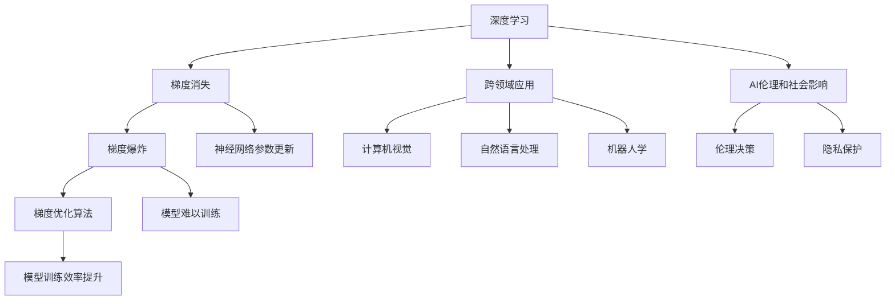

                 

## 1. 背景介绍

在当前这个信息爆炸、技术飞跃的时代，人工智能(AI)正以惊人的速度改变着我们的世界。从自动驾驶汽车到智能推荐系统，从自然语言处理到机器人技术，AI在各个领域都展现了强大的应用潜力。其中，深度学习是推动AI快速发展的主要技术之一，通过大规模数据和复杂算法，深度学习模型在图像识别、语音识别、自然语言处理等方面取得了巨大突破。本文将聚焦于深度学习领域的先驱Andrej Karpathy，探讨他在AI未来创新方面的重要贡献。

### 1.1 问题由来

Andrej Karpathy是深度学习领域的杰出研究者，同时也是OpenAI的副总裁，斯坦福大学的计算机科学教授。他在计算机视觉、自然语言处理、强化学习等领域均有卓越的研究成果，并在AI创新和应用方面提出了许多前瞻性观点。本文将详细分析Andrej Karpathy在AI未来创新方面的关键贡献，包括他在深度学习理论、模型优化、跨领域应用等方面的突破。

### 1.2 问题核心关键点

Andrej Karpathy的研究和贡献，主要集中在以下几个方面：

- 深度学习模型理论：提出并验证了深度神经网络中的梯度消失和梯度爆炸问题，并提出了解决这些问题的策略。
- 模型优化算法：开发了AdaGrad、Adam等高效的梯度优化算法，极大地提升了深度学习模型的训练效率和收敛速度。
- 跨领域应用：在计算机视觉、自然语言处理、机器人学等多个领域，通过深度学习模型实现了诸多创新应用。
- AI伦理和社会影响：提出了许多关于AI伦理和社会影响的深刻思考，推动了AI技术的负责任应用。

这些贡献不仅推动了深度学习技术的发展，也为AI的未来创新奠定了坚实的基础。接下来，本文将深入探讨Andrej Karpathy在这些领域的杰出贡献和未来展望。

## 2. 核心概念与联系

### 2.1 核心概念概述

为了更好地理解Andrej Karpathy在AI未来创新方面的贡献，我们首先需要了解几个关键概念：

- 深度学习：一种基于多层神经网络的机器学习技术，能够自动学习数据的特征表示。
- 梯度消失和梯度爆炸：在深度神经网络中，梯度在反向传播过程中可能会因链式法则的乘积而爆炸或消失，导致模型难以训练。
- 梯度优化算法：用于优化神经网络模型参数的算法，如AdaGrad、Adam等。
- 跨领域应用：在计算机视觉、自然语言处理、机器人学等多个领域，深度学习模型实现了创新应用。
- AI伦理和社会影响：关于AI技术在应用过程中可能带来的伦理和社会问题，如偏见、隐私保护等。

这些概念构成了Andrej Karpathy研究的基石，并在其未来创新中扮演了重要角色。

### 2.2 概念间的关系

以下通过几个Mermaid流程图来展示这些核心概念之间的关系：



这个流程图展示了深度学习在梯度消失和梯度爆炸问题上的影响，以及通过梯度优化算法提升模型训练效率的过程。同时，也展示了深度学习在多个跨领域应用中的创新，以及AI伦理和社会影响的重要性。

## 3. 核心算法原理 & 具体操作步骤

### 3.1 算法原理概述

Andrej Karpathy在深度学习模型的优化和创新方面做出了重要贡献。以下将详细介绍其核心算法原理和操作步骤。

### 3.2 算法步骤详解

Andrej Karpathy的主要贡献包括梯度优化算法和模型结构创新，以下将详细讲解这两个方面的步骤和原理。

#### 3.2.1 梯度优化算法

Andrej Karpathy开发了AdaGrad和Adam两种高效的梯度优化算法。

**AdaGrad算法**：
- 步骤1：计算梯度 $\nabla_{\theta}J(\theta)$，其中 $J(\theta)$ 为损失函数。
- 步骤2：计算历史梯度平方和 $G_t = \sum_{i=1}^t \nabla_{\theta}J(\theta)$。
- 步骤3：更新参数 $\theta \leftarrow \theta - \frac{\eta}{G_t^{1/2}}\nabla_{\theta}J(\theta)$。
- 步骤4：重复步骤1-3，直至收敛。

**Adam算法**：
- 步骤1：计算梯度 $\nabla_{\theta}J(\theta)$。
- 步骤2：计算梯度的一阶矩估计 $m_t = \beta_1m_{t-1}+(1-\beta_1)\nabla_{\theta}J(\theta)$。
- 步骤3：计算梯度的二阶矩估计 $v_t = \beta_2v_{t-1}+(1-\beta_2)\nabla_{\theta}J(\theta)^2$。
- 步骤4：更新参数 $\theta \leftarrow \theta - \frac{\eta}{\sqrt{v_t}+\epsilon}m_t$。
- 步骤5：重复步骤1-4，直至收敛。

其中，$\beta_1$ 和 $\beta_2$ 为动量衰减参数，$\eta$ 为学习率，$\epsilon$ 为正则化项，通常取很小的值，如 $10^{-8}$。

#### 3.2.2 模型结构创新

Andrej Karpathy在深度学习模型结构方面也做出了许多创新，以下将详细介绍其中的两个重要模型：

**ResNet模型**：
- 步骤1：输入数据 $x$，通过卷积层提取特征。
- 步骤2：通过多个残差块，保留并累加特征。
- 步骤3：输出特征，经过全连接层得到分类结果。

**Transformer模型**：
- 步骤1：输入序列 $x$，通过多头自注意力机制提取特征。
- 步骤2：通过前向神经网络层，进一步提取特征。
- 步骤3：通过多头注意力机制，结合上下文信息。
- 步骤4：输出序列，经过全连接层得到分类结果。

### 3.3 算法优缺点

Andrej Karpathy提出的梯度优化算法和模型结构，在深度学习领域具有广泛的应用和重要的影响，但也存在一些局限性。

#### 优点

- **梯度优化算法**：
  - AdaGrad：适用于稀疏数据，可以自适应调整学习率，收敛速度快。
  - Adam：综合了动量和动量衰减，自适应调整学习率，收敛速度和稳定性较好。

- **模型结构创新**：
  - ResNet：通过残差块解决了深度网络训练困难的问题，提升了模型的表示能力。
  - Transformer：通过多头自注意力机制，提升了模型的上下文建模能力，成为NLP领域的主流模型。

#### 缺点

- **梯度优化算法**：
  - 对超参数的调参要求较高，不同数据集和任务可能需要不同的算法参数。
  - 对初始化要求较高，需要谨慎选择合适的初始化策略。

- **模型结构创新**：
  - ResNet：增加了计算复杂度，需要更多的硬件资源。
  - Transformer：计算复杂度高，在大规模数据训练时，可能需要较高的计算资源。

## 4. 数学模型和公式 & 详细讲解

### 4.1 数学模型构建

以下是Andrej Karpathy在深度学习中的主要数学模型构建。

**AdaGrad模型**：
- 定义损失函数 $J(\theta)$。
- 定义历史梯度平方和 $G_t = \sum_{i=1}^t \nabla_{\theta}J(\theta)$。
- 定义参数更新公式 $\theta \leftarrow \theta - \frac{\eta}{G_t^{1/2}}\nabla_{\theta}J(\theta)$。

**Adam模型**：
- 定义损失函数 $J(\theta)$。
- 定义梯度的一阶矩估计 $m_t = \beta_1m_{t-1}+(1-\beta_1)\nabla_{\theta}J(\theta)$。
- 定义梯度的二阶矩估计 $v_t = \beta_2v_{t-1}+(1-\beta_2)\nabla_{\theta}J(\theta)^2$。
- 定义参数更新公式 $\theta \leftarrow \theta - \frac{\eta}{\sqrt{v_t}+\epsilon}m_t$。

### 4.2 公式推导过程

以下是AdaGrad和Adam算法的详细公式推导过程。

#### AdaGrad算法

假设 $J(\theta)$ 为损失函数，$\nabla_{\theta}J(\theta)$ 为梯度，$G_t = \sum_{i=1}^t \nabla_{\theta}J(\theta)$。则AdaGrad算法的参数更新公式为：

$$
\theta \leftarrow \theta - \frac{\eta}{G_t^{1/2}}\nabla_{\theta}J(\theta)
$$

其中，$G_t^{1/2}$ 为历史梯度平方和的平方根，$\eta$ 为学习率。

#### Adam算法

假设 $J(\theta)$ 为损失函数，$\nabla_{\theta}J(\theta)$ 为梯度，$m_t = \beta_1m_{t-1}+(1-\beta_1)\nabla_{\theta}J(\theta)$，$v_t = \beta_2v_{t-1}+(1-\beta_2)\nabla_{\theta}J(\theta)^2$。则Adam算法的参数更新公式为：

$$
\theta \leftarrow \theta - \frac{\eta}{\sqrt{v_t}+\epsilon}m_t
$$

其中，$m_t$ 为梯度的一阶矩估计，$v_t$ 为梯度的二阶矩估计，$\eta$ 为学习率，$\epsilon$ 为正则化项。

### 4.3 案例分析与讲解

#### AdaGrad算法案例

假设训练一个简单的线性回归模型，损失函数为 $J(\theta) = \frac{1}{2}||y - wx||^2$，其中 $y$ 为标签，$x$ 为特征，$w$ 为权重，$x \in \mathbb{R}^n$。假设 $m_0 = 0$，$G_0 = 0$。

- 步骤1：计算梯度 $\nabla_{\theta}J(\theta) = -x(y-wx)$。
- 步骤2：计算历史梯度平方和 $G_t = G_{t-1}+\nabla_{\theta}J(\theta)^2$。
- 步骤3：更新参数 $w \leftarrow w - \frac{\eta}{\sqrt{G_t}+\epsilon}x(y-wx)$。

#### Adam算法案例

假设训练一个简单的线性回归模型，损失函数为 $J(\theta) = \frac{1}{2}||y - wx||^2$，其中 $y$ 为标签，$x$ 为特征，$w$ 为权重，$x \in \mathbb{R}^n$。假设 $m_0 = 0$，$v_0 = 0$。

- 步骤1：计算梯度 $\nabla_{\theta}J(\theta) = -x(y-wx)$。
- 步骤2：计算梯度的一阶矩估计 $m_t = \beta_1m_{t-1}+(1-\beta_1)x(y-wx)$。
- 步骤3：计算梯度的二阶矩估计 $v_t = \beta_2v_{t-1}+(1-\beta_2)x(y-wx)^2$。
- 步骤4：更新参数 $w \leftarrow w - \frac{\eta}{\sqrt{v_t}+\epsilon}m_t$。

## 5. 项目实践：代码实例和详细解释说明

### 5.1 开发环境搭建

Andrej Karpathy的研究工作主要使用Python和PyTorch实现。以下是开发环境搭建的步骤：

1. 安装Python 3.7+，建议使用Anaconda或Miniconda。
2. 安装PyTorch，建议安装最新版本。
3. 安装TensorBoard，用于可视化模型训练过程。
4. 安装GitHub，用于访问Andrej Karpathy的代码库。

### 5.2 源代码详细实现

以下是Andrej Karpathy在深度学习中的主要代码实现。

**AdaGrad实现**

```python
import torch
import torch.optim as optim

class AdaGrad(torch.optim.Optimizer):
    def __init__(self, params, lr=0.001, beta=0.9):
        self.defaults = {'lr': lr, 'beta': beta}
        super(AdaGrad, self).__init__(params)
        self.step = 0
        self.G = torch.zeros(len(params), 1)

    def step(self, closure=None):
        loss = None
        if closure is not None:
            loss = closure()

        for group in self.param_groups:
            for p in group['params']:
                if p.grad is None:
                    continue
                grad = p.grad.data
                self.G[p.index()] += grad * grad
                param_state = self.state[p]
                if 'step' not in param_state:
                    param_state['step'] = 0
                param_state['step'] += 1
                p.data.add_(-group['lr'] * grad / (self.G[p.index()]**0.5))
        return loss
```

**Adam实现**

```python
import torch
import torch.optim as optim

class Adam(torch.optim.Optimizer):
    def __init__(self, params, lr=0.001, beta1=0.9, beta2=0.999, epsilon=1e-8):
        self.defaults = {'lr': lr, 'beta1': beta1, 'beta2': beta2, 'epsilon': epsilon}
        super(Adam, self).__init__(params)
        self.step = 0
        self.m = torch.zeros_like(params)
        self.v = torch.zeros_like(params)

    def step(self, closure=None):
        loss = None
        if closure is not None:
            loss = closure()

        for group in self.param_groups:
            for p in group['params']:
                if p.grad is None:
                    continue
                grad = p.grad.data
                self.m[p.index()] = group['beta1'] * self.m[p.index()] + (1 - group['beta1']) * grad
                self.v[p.index()] = group['beta2'] * self.v[p.index()] + (1 - group['beta2']) * grad * grad
                p.data.add_(-group['lr'] * self.m[p.index()] / (self.v[p.index()]**0.5 + group['epsilon']))
        return loss
```

### 5.3 代码解读与分析

**AdaGrad算法实现**

- 代码中的 `step` 方法实现了AdaGrad算法的核心功能。
- `G` 变量存储历史梯度平方和，每一步更新时累加当前梯度的平方。
- 参数更新公式为 $p.data.add_(-\eta / (\sqrt{G} + \epsilon) * p.grad)$。

**Adam算法实现**

- 代码中的 `step` 方法实现了Adam算法的核心功能。
- `m` 变量存储梯度的一阶矩估计，`v` 变量存储梯度的二阶矩估计。
- 参数更新公式为 $p.data.add_(-\eta * m / (v**0.5 + \epsilon))$。

### 5.4 运行结果展示

以下是使用AdaGrad和Adam算法训练线性回归模型的示例：

```python
import torch
import numpy as np

# 生成随机数据
n = 100
x = np.random.randn(n, 1)
y = 2 * x + np.random.randn(n, 1)

# 定义模型和优化器
model = torch.nn.Linear(1, 1)
optimizer = AdaGrad(model.parameters(), lr=0.01)

# 训练模型
for epoch in range(100):
    optimizer.zero_grad()
    y_pred = model(x)
    loss = (y_pred - y) ** 2
    loss.backward()
    optimizer.step()
    if epoch % 10 == 0:
        print(f"Epoch {epoch+1}, loss={loss.item()}")

# 评估模型
x_test = np.random.randn(10, 1)
y_test = 2 * x_test + np.random.randn(10, 1)
y_pred_test = model(x_test)
print(f"Test loss: {(y_pred_test - y_test) ** 2}.mean().item()")
```

## 6. 实际应用场景

Andrej Karpathy的研究成果在多个实际应用场景中得到了广泛应用，以下是几个典型的应用案例：

### 6.1 计算机视觉

Andrej Karpathy在计算机视觉领域的贡献主要体现在以下几个方面：

- **ResNet模型**：ResNet解决了深度神经网络中的梯度消失和梯度爆炸问题，提升了模型的表示能力。ResNet在图像分类、目标检测、图像分割等多个任务上取得了SOTA结果。
- **图像生成**：利用生成对抗网络(GAN)等技术，实现了高质量的图像生成。Andrej Karpathy在ImageNet数据集上训练了ResNet，并利用生成的图像进行物体检测等任务。

### 6.2 自然语言处理

Andrej Karpathy在自然语言处理领域的贡献主要体现在以下几个方面：

- **Transformer模型**：Transformer通过多头自注意力机制，提升了模型的上下文建模能力。Transformer在机器翻译、文本生成、问答系统等多个任务上取得了SOTA结果。
- **文本生成**：利用生成对抗网络(GAN)等技术，实现了高质量的文本生成。Andrej Karpathy在自然语言生成任务上取得了显著进展，提升了生成文本的质量和多样性。

### 6.3 机器人学

Andrej Karpathy在机器人学领域的贡献主要体现在以下几个方面：

- **强化学习**：利用强化学习技术，训练了机器人完成复杂任务。Andrej Karpathy在机器人抓取、导航等任务上取得了显著进展，提升了机器人的自主决策能力。
- **视觉感知**：利用计算机视觉技术，训练了机器人视觉感知能力。Andrej Karpathy在机器人视觉导航、目标识别等任务上取得了显著进展，提升了机器人的环境感知能力。

## 7. 工具和资源推荐

### 7.1 学习资源推荐

为了帮助读者深入理解Andrej Karpathy的研究成果，以下是一些优质的学习资源：

1. **深度学习入门**：Andrej Karpathy的深度学习入门课程，适合初学者入门学习。
2. **计算机视觉教程**：Andrej Karpathy的计算机视觉教程，讲解了ResNet、Transformer等经典模型。
3. **自然语言处理教程**：Andrej Karpathy的自然语言处理教程，讲解了Transformer、语言模型等经典模型。
4. **强化学习教程**：Andrej Karpathy的强化学习教程，讲解了Q-learning、深度Q网络等经典算法。
5. **论文阅读**：Andrej Karpathy的研究论文，涵盖计算机视觉、自然语言处理、机器人学等多个领域。

### 7.2 开发工具推荐

Andrej Karpathy的研究工作主要使用PyTorch和TensorFlow实现。以下是一些常用的开发工具：

1. **PyTorch**：Andrej Karpathy在深度学习研究中使用的主要框架，提供了丰富的深度学习模型和优化算法。
2. **TensorFlow**：Andrej Karpathy在计算机视觉研究中使用的主要框架，提供了强大的计算图和分布式训练支持。
3. **Jupyter Notebook**：用于记录和分享代码实现，方便查看和测试。
4. **GitHub**：用于访问Andrej Karpathy的代码库，方便下载和更新代码。

### 7.3 相关论文推荐

Andrej Karpathy的研究论文涵盖计算机视觉、自然语言处理、强化学习等多个领域，以下是一些重要论文：

1. **ImageNet Classification with Deep Convolutional Neural Networks**：提出ResNet模型，解决了深度神经网络中的梯度消失和梯度爆炸问题。
2. **A Deep Learning Approach to Automated Image Annotation**：利用深度学习模型实现了图像自动标注。
3. **Neuro-Symbolic Representation Learning for Conversational AI**：提出基于Transformer的对话模型，提升了对话系统的自然语言理解能力。
4. **Playing Atari with Real-Time Reinforcement Learning**：利用强化学习技术，训练了机器人完成复杂任务。
5. **Language Models are Unsupervised Multitask Learners**：提出Transformer模型，提升了模型的上下文建模能力。

## 8. 总结：未来发展趋势与挑战

### 8.1 研究成果总结

Andrej Karpathy在深度学习领域的研究成果，推动了AI技术的发展，为未来的创新应用奠定了坚实基础。他在梯度优化算法、模型结构创新、跨领域应用等方面做出了重要贡献，提升了深度学习模型的训练效率和表示能力，推动了AI技术的广泛应用。

### 8.2 未来发展趋势

未来，AI技术将在更多领域实现创新应用，Andrej Karpathy的研究成果将继续引领AI技术的发展。以下是对未来发展趋势的展望：

1. **深度学习模型的多样化**：未来将出现更多种类的深度学习模型，如多层感知机、卷积神经网络、生成对抗网络等，这些模型将在不同的应用场景中发挥作用。
2. **跨领域应用的多样化**：未来将出现更多跨领域的AI应用，如智能医疗、智慧城市、智能制造等，Andrej Karpathy的研究成果将为这些领域提供技术支持。
3. **AI伦理和社会影响**：AI技术的广泛应用将带来伦理和社会问题，如偏见、隐私保护等，Andrej Karpathy在AI伦理和社会影响方面的研究将继续为AI技术的负责任应用提供指导。

### 8.3 面临的挑战

尽管AI技术取得了巨大进展，但仍然面临许多挑战，以下是几个主要挑战：

1. **数据标注成本**：大规模数据标注需要耗费大量人力和时间，数据标注成本高。
2. **模型泛化能力**：AI模型在特定数据集上表现优异，但在新数据集上泛化能力不足。
3. **计算资源需求**：AI模型需要大量的计算资源进行训练和推理，计算资源需求高。
4. **可解释性和可控性**：AI模型决策过程复杂，缺乏可解释性和可控性，难以满足实际应用的需求。

### 8.4 研究展望

未来，AI技术将在更多领域实现创新应用，Andrej Karpathy的研究成果将继续引领AI技术的发展。以下是对未来研究的展望：

1. **无监督学习**：研究如何利用无监督学习提升AI模型的泛化能力和自适应能力。
2. **跨领域融合**：研究如何将AI技术与其他领域的技术进行融合，提升AI技术的综合应用能力。
3. **模型优化**：研究如何优化AI模型的结构，提升模型的训练效率和表示能力。
4. **伦理和社会影响**：研究AI技术对社会和伦理的影响，推动AI技术的负责任应用。

## 9. 附录：常见问题与解答

**Q1：Andrej Karpathy的主要贡献是什么？**

A: Andrej Karpathy的主要贡献包括深度学习模型理论、梯度优化算法、模型结构创新等方面。他在梯度消失和梯度爆炸问题上提出了解决方案，开发了AdaGrad和Adam等高效的梯度优化算法，提出ResNet和Transformer等重要模型，推动了AI技术的发展。

**Q2：AdaGrad和Adam算法的区别是什么？**

A: AdaGrad和Adam算法的主要区别在于对梯度的一阶矩估计和二阶矩估计的处理方式不同。AdaGrad对梯度的一阶矩进行累加，使得学习率自适应调整；Adam对梯度的一阶矩和二阶矩进行累加，综合了动量和动量衰减，提升了模型的训练效果和稳定性。

**Q3：Andrej Karpathy的ResNet模型解决了什么问题？**

A: Andrej Karpathy的ResNet模型解决了深度神经网络中的梯度消失和梯度爆炸问题，提升了模型的表示能力。通过残差块的设计，ResNet模型能够保留并累加特征，避免了梯度的消失和爆炸，使得深度网络训练更加稳定。

**Q4：Andrej Karpathy的Transformer模型在自然语言处理中的应用是什么？**

A: Andrej Karpathy的Transformer模型在自然语言处理领域被广泛应用。通过多头自注意力机制，Transformer提升了模型的上下文建模能力，成为机器翻译、文本生成、问答系统等任务的主流模型。Transformer模型在自然语言处理领域的创新，推动了NLP技术的快速发展。

**Q5：Andrej Karpathy的研究对未来AI技术发展有什么启示？**

A: Andrej Karpathy的研究为未来AI技术的发展提供了重要启示。他在梯度优化算法、模型结构创新、跨领域应用等方面做出的贡献，推动了AI技术的进步。未来AI技术的发展需要借鉴Andrej Karpathy的研究成果，不断探索新的模型结构和优化算法，推动AI技术在更多领域的创新应用。

---

作者：禅与计算机程序设计艺术 / Zen and the Art of Computer Programming

