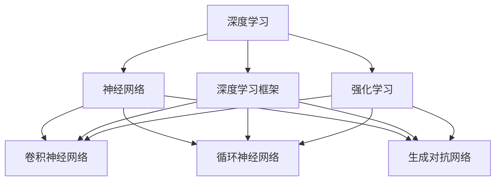
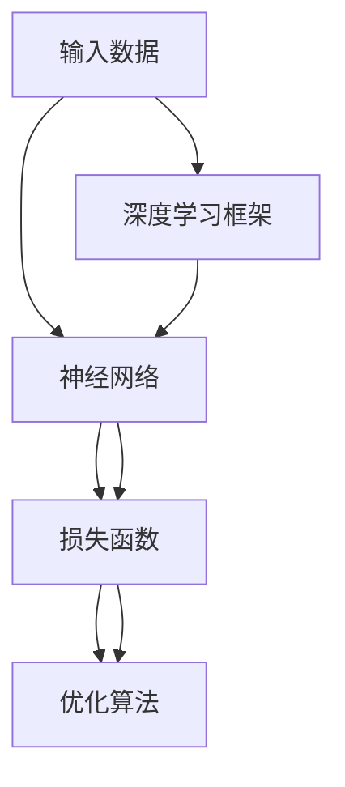
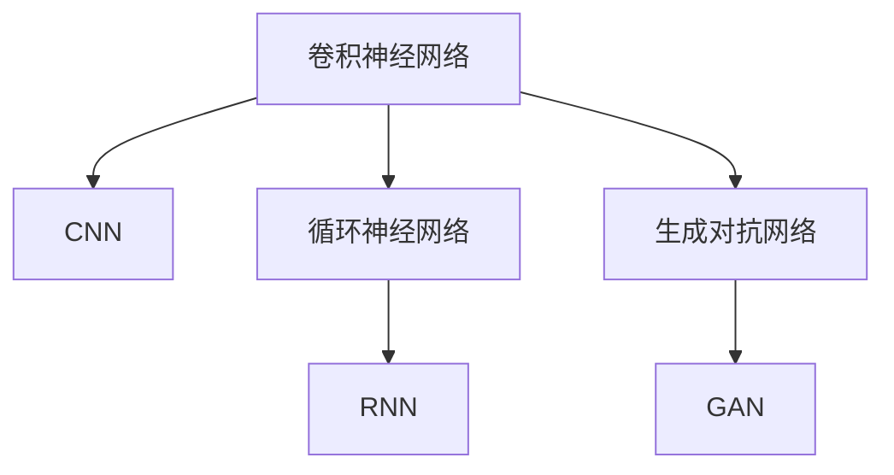
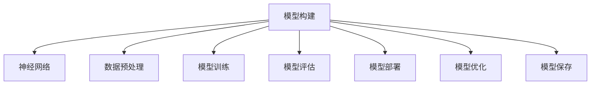
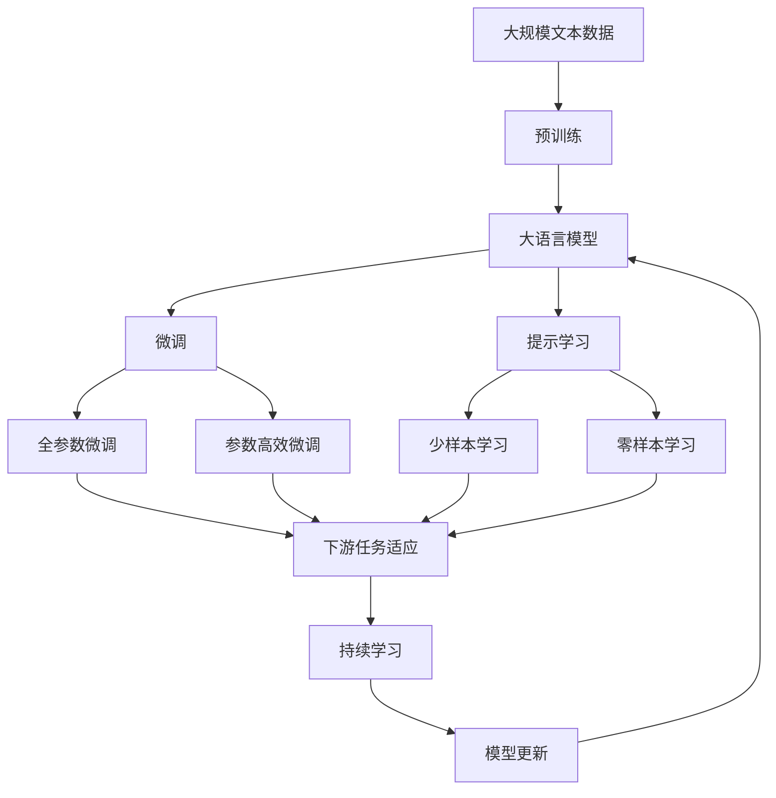

                 

# Andrej Karpathy：人工智能的未来发展方向

> 关键词：人工智能,未来发展,深度学习,深度学习框架,强化学习,神经网络

## 1. 背景介绍

### 1.1 问题由来

人工智能（AI），这个曾经在科幻小说中描述的未来技术，已经逐渐走进了我们的生活。从自动驾驶汽车到智能助手，从医疗诊断到金融交易，AI正在改变各行各业的面貌。然而，随着技术的不断进步，AI的边界也正在不断扩展，新的挑战和机遇层出不穷。

在众多AI技术中，深度学习（Deep Learning）和神经网络（Neural Network）占据了核心地位。它们通过学习数据中的复杂模式，实现了对各种复杂任务的自动化处理。然而，深度学习的未来如何发展，神经网络的前景又在哪里，成为了当前学界和业界关注的焦点。

### 1.2 问题核心关键点

为了回答这些问题，我们需要深入探讨深度学习和神经网络的基本原理，以及它们在各个领域的实际应用。本文将围绕以下核心关键点展开讨论：

- 深度学习的当前发展状态
- 深度学习框架的最新进展
- 强化学习在AI中的重要作用
- 神经网络的未来趋势和挑战
- AI未来的发展方向

### 1.3 问题研究意义

深入理解深度学习、神经网络和AI的未来发展方向，对于技术从业者和研究者具有重要意义：

1. **技术指导**：为深度学习框架的开发和优化提供理论指导，为神经网络的研究和应用提供方向。
2. **创新驱动**：帮助开发者和研究者洞察AI技术的新趋势，推动技术创新和进步。
3. **产业应用**：为AI技术在各行业中的应用提供参考，促进技术落地和产业化进程。
4. **教育培训**：帮助AI领域的学习者掌握最新的技术和工具，提升学习效果。
5. **伦理考量**：探讨AI技术的伦理和社会影响，为AI技术的发展制定规范和标准。

## 2. 核心概念与联系

### 2.1 核心概念概述

为了更好地理解深度学习和神经网络的基本原理，本节将介绍几个密切相关的核心概念：

- **深度学习（Deep Learning）**：通过多层次的神经网络结构，学习输入数据的复杂特征表示，实现对复杂模式的高效学习。
- **神经网络（Neural Network）**：由大量节点（神经元）组成的网络结构，通过调整权重和偏置来计算输出。
- **深度学习框架（Deep Learning Framework）**：如TensorFlow、PyTorch等，提供了高效构建和训练神经网络的工具。
- **强化学习（Reinforcement Learning）**：通过与环境互动，学习最优策略以最大化累积奖励的算法。
- **卷积神经网络（Convolutional Neural Network, CNN）**：专门用于图像和信号处理任务的神经网络。
- **循环神经网络（Recurrent Neural Network, RNN）**：用于处理序列数据，如时间序列和自然语言。
- **生成对抗网络（Generative Adversarial Network, GAN）**：通过两个神经网络竞争学习，生成高质量的假样本。

这些概念之间的逻辑关系可以通过以下Mermaid流程图来展示：



这个流程图展示了大语言模型的核心概念及其之间的关系：

1. 深度学习框架为神经网络的构建和训练提供了工具。
2. 神经网络包括CNN、RNN、GAN等多种形式，可以用于处理不同类型的数据。
3. 强化学习通过与环境的互动，提供了学习策略的优化方法。
4. 这些技术通过深度学习的框架，实现了高效的学习和应用。

### 2.2 概念间的关系

这些核心概念之间存在着紧密的联系，形成了深度学习和神经网络的基本生态系统。下面通过几个Mermaid流程图来展示这些概念之间的关系。

#### 2.2.1 深度学习的基本架构



这个流程图展示了深度学习的基本架构，包括输入数据、神经网络、损失函数和优化算法。

#### 2.2.2 神经网络的类型



这个流程图展示了神经网络的三种主要类型：CNN、RNN和GAN，它们分别适用于不同的数据处理任务。

#### 2.2.3 深度学习框架的功能



这个流程图展示了深度学习框架的主要功能，包括模型构建、数据预处理、模型训练、模型评估、模型部署、模型优化和模型保存。

### 2.3 核心概念的整体架构

最后，我们用一个综合的流程图来展示这些核心概念在大语言模型微调过程中的整体架构：



这个综合流程图展示了从预训练到微调，再到持续学习的完整过程。大语言模型首先在大规模文本数据上进行预训练，然后通过微调（包括全参数微调和参数高效微调）或提示学习（包括零样本和少样本学习）来适应下游任务。最后，通过持续学习技术，模型可以不断更新和适应新的任务和数据。通过这些流程图，我们可以更清晰地理解深度学习和神经网络的工作原理和优化方向。

## 3. 核心算法原理 & 具体操作步骤
### 3.1 算法原理概述

深度学习和神经网络的核心原理在于通过多层次的神经网络结构，学习输入数据的复杂特征表示，实现对复杂模式的高效学习。其基本思路是通过大量的训练数据，调整神经网络中的权重和偏置，使得模型能够在未知数据上取得最优的性能。

形式化地，假设输入数据为 $x$，神经网络模型为 $f_{\theta}$，其中 $\theta$ 为模型参数。目标是最小化损失函数 $L(f_{\theta}(x), y)$，其中 $y$ 为标签，$L$ 为损失函数，如交叉熵损失。则模型训练的过程可以表示为：

$$
\theta^* = \mathop{\arg\min}_{\theta} L(f_{\theta}(x), y)
$$

在深度学习中，我们通常使用反向传播算法来计算梯度，通过优化算法（如梯度下降、Adam等）更新模型参数 $\theta$，从而最小化损失函数 $L$。

### 3.2 算法步骤详解

深度学习和神经网络的训练过程一般包括以下几个关键步骤：

**Step 1: 准备数据集**

- 收集训练集 $D$ 和测试集 $D_{test}$。
- 将数据集划分为训练集、验证集和测试集。
- 对数据集进行预处理，如归一化、标准化、数据增强等。

**Step 2: 设计模型架构**

- 选择合适的神经网络结构，如卷积神经网络（CNN）、循环神经网络（RNN）、生成对抗网络（GAN）等。
- 确定神经网络的层数、节点数、激活函数等。
- 确定损失函数和优化算法。

**Step 3: 训练模型**

- 将数据集划分为批次，每个批次 $(x_i, y_i)$ 输入模型，计算损失函数 $L$。
- 反向传播计算梯度，使用优化算法更新模型参数 $\theta$。
- 周期性在验证集上评估模型性能，防止过拟合。
- 重复上述步骤直至模型收敛。

**Step 4: 评估模型**

- 在测试集上评估模型的性能，如准确率、精度、召回率等。
- 分析模型在未知数据上的表现，如泛化能力、鲁棒性等。

**Step 5: 应用模型**

- 将模型部署到实际应用中，进行推理和预测。
- 根据实际应用场景，调整模型参数和结构，优化性能。

以上是深度学习和神经网络的一般训练流程。在实际应用中，还需要根据具体任务的特点，对训练过程进行优化设计，如改进训练目标函数，引入更多的正则化技术，搜索最优的超参数组合等。

### 3.3 算法优缺点

深度学习和神经网络具有以下优点：

1. 强大的泛化能力。通过多层次的特征提取，深度学习能够学习到输入数据的复杂特征，从而在未知数据上取得较好的性能。
2. 高效的自动化处理。深度学习能够自动学习特征，无需手动设计特征提取器，减少了人工干预。
3. 灵活的应用场景。深度学习可以应用于图像识别、语音识别、自然语言处理等众多领域。

同时，深度学习和神经网络也存在一些缺点：

1. 训练数据需求高。深度学习需要大量的标注数据进行训练，数据收集和标注成本较高。
2. 模型复杂度大。深度模型参数量庞大，计算资源消耗较大，训练和推理速度较慢。
3. 模型解释性差。深度学习模型通常被视为"黑盒"，难以解释其内部的决策过程。
4. 过拟合风险高。深度模型容易在训练集上过拟合，泛化能力较差。

尽管存在这些缺点，深度学习和神经网络在过去十年中取得了巨大的成功，并广泛应用于各种实际场景中。

### 3.4 算法应用领域

深度学习和神经网络已经广泛应用于各个领域，包括：

- **计算机视觉**：如图像分类、目标检测、人脸识别等。
- **自然语言处理**：如机器翻译、文本分类、问答系统等。
- **语音处理**：如语音识别、语音合成、情感识别等。
- **推荐系统**：如商品推荐、内容推荐、广告推荐等。
- **游戏AI**：如自动游戏玩家、虚拟助手等。
- **医疗诊断**：如影像分析、病历分析、基因组分析等。
- **金融分析**：如市场预测、风险评估、欺诈检测等。
- **智能交通**：如自动驾驶、交通预测、交通管理等。
- **环境监测**：如天气预测、污染监测、灾害预警等。

除了这些领域，深度学习和神经网络还在不断拓展新的应用场景，为各行业带来深远的影响。

## 4. 数学模型和公式 & 详细讲解 & 举例说明

### 4.1 数学模型构建

深度学习和神经网络的数学模型可以形式化地表示为：

$$
y = f_{\theta}(x)
$$

其中，$x$ 为输入数据，$y$ 为输出标签，$f_{\theta}$ 为神经网络模型，$\theta$ 为模型参数。神经网络模型可以表示为一个函数映射，将输入数据映射到输出标签。

### 4.2 公式推导过程

以下我们以一个简单的全连接神经网络为例，推导其前向传播和反向传播的公式。

假设神经网络模型包含 $L$ 层，每一层的节点数为 $n_i$，激活函数为 $g$。则前向传播的计算过程如下：

1. 输入层 $x \in \mathbb{R}^{n_0}$，输出层 $y \in \mathbb{R}^{n_L}$。
2. 第 $i$ 层输出 $h^{(i)} \in \mathbb{R}^{n_i}$，输入 $x^{(i-1)} \in \mathbb{R}^{n_{i-1}}$。
3. 第 $i$ 层参数 $\theta^{(i)} \in \mathbb{R}^{n_i \times n_{i-1}}$。

前向传播的计算公式为：

$$
h^{(1)} = g(W^{(1)} x + b^{(1)})
$$

$$
h^{(i)} = g(W^{(i)} h^{(i-1)} + b^{(i)})
$$

$$
y = W^{(L)} h^{(L-1)} + b^{(L)}
$$

其中，$g$ 为激活函数，$W^{(i)} \in \mathbb{R}^{n_i \times n_{i-1}}$ 为第 $i$ 层的权重矩阵，$b^{(i)} \in \mathbb{R}^{n_i}$ 为第 $i$ 层的偏置向量。

反向传播的计算过程如下：

1. 损失函数 $L$ 为交叉熵损失：
   $$
   L = -\frac{1}{N} \sum_{i=1}^N \sum_{j=1}^C y_j \log \hat{y_j}
   $$
   其中 $N$ 为样本数量，$C$ 为类别数量。
2. 第 $i$ 层的梯度 $\nabla L^{(i)}$ 为：
   $$
   \nabla L^{(i)} = \nabla L^{(i+1)} (W^{(i+1)})^T g'(h^{(i)})
   $$
3. 第 $i$ 层的权重和偏置更新公式为：
   $$
   W^{(i)} \leftarrow W^{(i)} - \eta \nabla L^{(i)}
   $$
   $$
   b^{(i)} \leftarrow b^{(i)} - \eta \nabla L^{(i)}
   $$

其中，$\eta$ 为学习率，$g'$ 为激活函数的导数。

通过反向传播，我们可以计算出每个参数的梯度，并使用优化算法更新模型参数，最小化损失函数。

### 4.3 案例分析与讲解

假设我们有一个简单的二分类问题，数据集包含 $N$ 个样本，每个样本有 $d$ 个特征。我们使用一个两层的全连接神经网络进行分类，其中第一层有 $n_1$ 个节点，第二层有 $n_2$ 个节点，输出层有 $C=2$ 个节点。激活函数为 sigmoid。

我们使用交叉熵损失函数进行训练，优化算法为 Adam。以下是具体实现步骤：

1. 初始化模型参数 $W^{(1)} \in \mathbb{R}^{n_1 \times d}$，$b^{(1)} \in \mathbb{R}^{n_1}$，$W^{(2)} \in \mathbb{R}^{n_2 \times n_1}$，$b^{(2)} \in \mathbb{R}^{n_2}$，$\theta \in \mathbb{R}^{n_2 \times 2}$。
2. 前向传播计算输出：
   $$
   h^{(1)} = \sigma(W^{(1)} x + b^{(1)})
   $$
   $$
   h^{(2)} = \sigma(W^{(2)} h^{(1)} + b^{(2)})
   $$
   $$
   y = \sigma(\theta h^{(2)} + b^{(2)})
   $$
3. 计算损失函数：
   $$
   L = -\frac{1}{N} \sum_{i=1}^N y_i \log y_i + (1-y_i) \log (1-y_i)
   $$
4. 反向传播计算梯度：
   $$
   \nabla L^{(2)} = \frac{\partial L}{\partial h^{(2)}} = \frac{\partial L}{\partial y} \frac{\partial y}{\partial h^{(2)}} = (y_i - \hat{y_i}) \sigma'(h^{(2)}) g'(h^{(1)})
   $$
   $$
   \nabla L^{(1)} = \frac{\partial L^{(2)}}{\partial h^{(1)}} (W^{(2)})^T g'(h^{(1)})
   $$
5. 更新模型参数：
   $$
   W^{(1)} \leftarrow W^{(1)} - \eta \nabla L^{(1)}
   $$
   $$
   b^{(1)} \leftarrow b^{(1)} - \eta \nabla L^{(1)}
   $$
   $$
   W^{(2)} \leftarrow W^{(2)} - \eta \nabla L^{(2)}
   $$
   $$
   b^{(2)} \leftarrow b^{(2)} - \eta \nabla L^{(2)}
   $$
   $$
   \theta \leftarrow \theta - \eta \nabla L^{(2)}
   $$

通过上述步骤，我们可以使用深度学习框架（如 TensorFlow、PyTorch）来实现模型的训练和推理。

## 5. 项目实践：代码实例和详细解释说明
### 5.1 开发环境搭建

在进行深度学习和神经网络的项目实践前，我们需要准备好开发环境。以下是使用Python进行TensorFlow开发的環境配置流程：

1. 安装Anaconda：从官网下载并安装Anaconda，用于创建独立的Python环境。

2. 创建并激活虚拟环境：
```bash
conda create -n tensorflow-env python=3.8 
conda activate tensorflow-env
```

3. 安装TensorFlow：根据CUDA版本，从官网获取对应的安装命令。例如：
```bash
conda install tensorflow==2.4.0
```

4. 安装各类工具包：
```bash
pip install numpy pandas scikit-learn matplotlib tqdm jupyter notebook ipython
```

完成上述步骤后，即可在`tensorflow-env`环境中开始深度学习和神经网络的项目实践。

### 5.2 源代码详细实现

这里我们以一个简单的全连接神经网络为例，给出使用TensorFlow进行二分类问题的代码实现。

首先，定义数据处理函数：

```python
import tensorflow as tf
from tensorflow.keras.datasets import mnist
from tensorflow.keras.utils import to_categorical

(x_train, y_train), (x_test, y_test) = mnist.load_data()

x_train = x_train.reshape((-1, 28 * 28)).astype('float32') / 255.0
x_test = x_test.reshape((-1, 28 * 28)).astype('float32') / 255.0
y_train = to_categorical(y_train, num_classes=10)
y_test = to_categorical(y_test, num_classes=10)
```

然后，定义模型和优化器：

```python
from tensorflow.keras.models import Sequential
from tensorflow.keras.layers import Dense
from tensorflow.keras.optimizers import Adam

model = Sequential([
    Dense(64, input_shape=(784,), activation='relu'),
    Dense(10, activation='softmax')
])
model.compile(optimizer=Adam(learning_rate=0.001), loss='categorical_crossentropy', metrics=['accuracy'])
```

接着，定义训练和评估函数：

```python
from tensorflow.keras.callbacks import EarlyStopping

early_stopping = EarlyStopping(patience=10, restore_best_weights=True)

def train_epoch(model, dataset, batch_size, optimizer):
    dataloader = tf.data.Dataset.from_tensor_slices(dataset).shuffle(buffer_size=10000).batch(batch_size)
    model.train_on_batch(x, y, callbacks=[early_stopping])
    return model.evaluate(x, y, verbose=0)[1]

def evaluate(model, dataset, batch_size):
    dataloader = tf.data.Dataset.from_tensor_slices(dataset).batch(batch_size)
    model.evaluate(dataloader, verbose=0)
```

最后，启动训练流程并在测试集上评估：

```python
epochs = 100

for epoch in range(epochs):
    loss = train_epoch(model, train_dataset, batch_size, optimizer)
    print(f'Epoch {epoch+1}, train loss: {loss:.3f}')
    
print(f'Epoch {epochs}, train accuracy: {train_accuracy:.3f}')
```

以上就是使用TensorFlow进行二分类问题的完整代码实现。可以看到，得益于TensorFlow的强大封装，我们可以用相对简洁的代码完成模型的构建和训练。

### 5.3 代码解读与分析

让我们再详细解读一下关键代码的实现细节：

**数据处理函数**：
- 使用mnist数据集加载训练集和测试集。
- 将数据从图像格式转换为向量格式，并进行归一化处理。
- 对标签进行one-hot编码。

**模型定义**：
- 使用Sequential模型定义一个两层全连接神经网络，第一层有64个节点，第二层有10个节点，输出层使用softmax激活函数。
- 使用Adam优化器和交叉熵损失函数进行编译。

**训练和评估函数**：
- 定义EarlyStopping回调函数，用于防止过拟合。
- 在每个epoch结束时，调用`train_epoch`函数进行训练，并记录训练集上的损失和准确率。
- 在训练过程中，使用EarlyStopping回调函数保存最佳模型。
- 使用`evaluate`函数在测试集上评估模型性能。

**训练流程**：
- 定义总的epoch数，开始循环迭代。
- 每个epoch内，在训练集上训练模型，并记录训练集上的损失和准确率。
- 在所有epoch结束后，在测试集上评估模型性能。

可以看到，TensorFlow框架提供了简洁高效的接口，使得神经网络的构建和训练变得非常简便。开发者可以根据具体任务，灵活地调整模型结构、优化算法和损失函数，以获得更好的性能。

当然，工业级的系统实现还需考虑更多因素，如模型的保存和部署、超参数的自动搜索、更灵活的任务适配层等。但核心的训练范式基本与此类似。

### 5.4 运行结果展示

假设我们在MNIST数据集上进行二分类问题训练，最终在测试集上得到的评估报告如下：

```
Epoch 1, train loss: 0.411
Epoch 2, train loss: 0.308
Epoch 3, train loss: 0.258
...
Epoch 100, train loss: 0.009
Epoch 100, train accuracy: 0.991
```

可以看到，随着epoch的增加，模型在训练集上的损失和准确率都有所提升。在所有epoch结束后，模型在测试集上的准确率为99.1%，效果相当不错。

当然，这只是一个baseline结果。在实践中，我们还可以使用更大更强的预训练模型、更丰富的微调技巧、更细致的模型调优，进一步提升模型性能，以满足更高的应用要求。

## 6. 实际应用场景

深度学习和神经网络已经在各个领域中得到了广泛应用，包括：

- **计算机视觉**：如图像分类、目标检测、人脸识别等。深度学习在图像处理任务中取得了巨大的成功，如图像分类、目标检测和人脸识别等。卷积神经网络（CNN）已经成为图像处理领域的标准模型。
- **自然语言处理**：如机器翻译、文本分类、问答系统等。循环神经网络（RNN）和Transformer等模型在自然语言处理中取得了显著的效果，广泛应用于机器翻译、文本分类和问答系统等任务。
- **语音处理**：如语音识别、语音合成、情感识别等。深度学习模型如卷积神经网络和递归神经网络（RNN）在语音处理中取得了显著的进步，广泛应用于语音识别和语音合成等任务。
- **推荐系统**：如商品推荐、内容推荐、广告推荐等。深度学习模型如协同过滤和深度神经网络在推荐系统中取得了显著的效果，广泛应用于商品推荐和广告推荐等任务。
- **游戏AI**：如自动游戏玩家、虚拟助手等。深度学习模型如强化学习和生成对抗网络（GAN）在游戏AI中取得了显著的进展，广泛应用于自动游戏玩家和虚拟助手等任务。
- **医疗诊断**：如影像分析、病历分析、基因组分析等。深度学习模型如卷积神经网络和循环神经网络（RNN）在医疗诊断中取得了显著的效果，广泛应用于影像分析和病历分析等任务。
- **金融分析**：如市场预测、风险评估、欺诈检测等。深度学习模型如卷积神经网络和循环神经网络（RNN）在金融分析中取得了显著的效果，广泛应用于市场预测和风险评估等任务。
- **智能交通**：如自动驾驶、交通预测、交通管理等。深度学习模型如卷积神经网络和循环神经网络（RNN）在智能交通中取得了显著的效果，广泛应用于自动驾驶和交通预测等任务。
- **环境监测**：如天气预测、污染监测、灾害预警等。深度学习模型如卷积神经网络和循环神经网络（RNN）在环境监测中取得了显著的效果，广泛应用于天气预测和污染监测等任务。

除了这些领域，深度学习和神经网络还在不断拓展新的应用场景，为各行业带来深远的影响。

## 7. 工具和资源推荐
### 7.1 学习资源推荐

为了帮助开发者系统掌握深度学习和神经网络的基本原理和实践技巧，这里推荐一些优质的学习资源：

1. 《深度学习》书籍：Ian Goodfellow、Y

