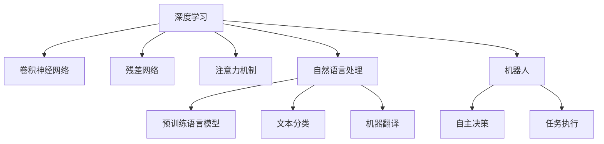

                 

# 安德烈·卡帕西：人工智能的未来发展方向

> 关键词：人工智能, 未来趋势, 深度学习, 自然语言处理, 机器人, 智能决策

## 1. 背景介绍

### 1.1 问题的由来

在人工智能（AI）领域，深度学习（DL）和自然语言处理（NLP）等技术已经取得了巨大的进步，推动了智能机器的广泛应用。然而，随着技术的不断发展，未来AI的前景仍然充满了挑战和机遇。安德烈·卡帕西（Andrej Karpathy），作为深度学习的先驱和自然语言处理的专家，一直在探索AI未来的发展方向。

### 1.2 问题核心关键点

卡帕西的研究方向涵盖了深度学习、计算机视觉、自然语言处理和机器人等多个领域。他的工作不仅关注模型和算法的改进，更着眼于AI技术的实际应用和社会影响。对于AI未来的发展方向，卡帕西认为以下几个方面尤为重要：

- 深度学习的持续进化：从原始的卷积神经网络（CNNs）到更复杂的模型如残差网络（ResNets）和注意力机制，深度学习模型的结构和性能都在不断进化。
- 自然语言处理的突破：随着预训练语言模型（如BERT、GPT）的出现，NLP技术在理解和生成自然语言方面取得了显著进展。
- 机器人和智能决策：AI技术正在推动机器人和智能决策系统的发展，这些系统可以执行复杂的任务，并在不确定环境中做出决策。
- AI的社会影响：AI技术不仅改变了工业生产和科学研究的范式，也引发了伦理、隐私和安全性等社会问题。

## 2. 核心概念与联系

### 2.1 核心概念概述

- **深度学习**：通过多层神经网络来学习数据的表示和模式，广泛应用于图像识别、语音识别和自然语言处理等领域。
- **自然语言处理**：使计算机能够理解和生成人类语言的技术，包括语言模型、文本分类和机器翻译等任务。
- **机器人**：自主决策的智能机器，可以执行复杂任务并在物理环境中与人类交互。
- **智能决策**：AI系统在面对不确定性和复杂情况时，能够自动地做出最优决策。

这些核心概念之间的联系通过以下Mermaid流程图来展示：



这个流程图展示了深度学习、自然语言处理、机器人和智能决策之间的联系。深度学习模型为其他技术提供了基础，自然语言处理和机器人的发展推动了智能决策的发展。

### 2.2 概念间的关系

这些核心概念之间的相互影响，构成了AI技术的生态系统。以下是几个关键概念的详细关系：

- **深度学习与自然语言处理**：深度学习为NLP任务提供了强大的特征提取能力，而NLP任务的进展又推动了深度学习模型的改进，如Transformer等。
- **深度学习与机器人**：深度学习模型使机器人能够理解视觉和语音信息，从而执行复杂任务。
- **自然语言处理与机器人**：NLP技术使机器人能够与人类自然地交流，从而更好地执行任务。
- **机器人与智能决策**：机器人需要在复杂环境中做出决策，智能决策技术使机器人能够应对不确定性和多目标优化问题。

## 3. 核心算法原理 & 具体操作步骤

### 3.1 算法原理概述

卡帕西的研究涵盖了深度学习、自然语言处理和机器人等多个领域，其核心算法原理可以总结为以下几点：

- **深度学习**：通过多层神经网络来学习数据的表示和模式，可以处理高维数据并发现复杂的特征。
- **自然语言处理**：利用预训练语言模型和注意力机制，使计算机能够理解和生成人类语言。
- **机器人**：使用强化学习等技术，使机器人能够在物理环境中自主决策和执行任务。

### 3.2 算法步骤详解

#### 3.2.1 深度学习

深度学习模型的训练通常包括以下步骤：

1. **数据准备**：收集和预处理数据，确保数据的多样性和代表性。
2. **模型构建**：选择合适的神经网络架构，如卷积神经网络（CNNs）、循环神经网络（RNNs）或变分自编码器（VAEs）。
3. **模型训练**：使用梯度下降等优化算法，最小化损失函数，调整模型参数以优化模型性能。
4. **模型评估**：在测试集上评估模型性能，选择最优模型。

#### 3.2.2 自然语言处理

自然语言处理算法步骤包括：

1. **语料收集**：收集大规模的语料数据，用于训练预训练语言模型。
2. **预训练**：使用自监督任务如语言建模、掩码语言模型等，预训练语言模型。
3. **微调**：在特定任务上微调预训练模型，使其适应新的任务。
4. **测试**：在测试集上评估模型性能，优化模型。

#### 3.2.3 机器人

机器人的操作通常分为以下几个步骤：

1. **环境感知**：使用传感器收集环境信息，如摄像头、激光雷达等。
2. **路径规划**：使用路径规划算法，如A*、RRT等，规划机器人的运动路径。
3. **决策制定**：使用强化学习、博弈论等技术，制定最优决策。
4. **执行控制**：控制机器人执行任务，如机械臂操作、移动等。

### 3.3 算法优缺点

#### 3.3.1 深度学习的优缺点

**优点**：

- **自适应性**：深度学习模型能够适应复杂的数据分布，发现复杂的特征。
- **泛化能力**：在大量数据上进行训练，可以泛化到未见过的数据。

**缺点**：

- **数据需求**：深度学习模型需要大量标注数据进行训练，数据获取成本高。
- **计算资源**：模型训练和推理需要大量计算资源，如GPU和TPU。
- **可解释性**：深度学习模型通常是黑盒模型，难以解释其内部工作机制。

#### 3.3.2 自然语言处理的优缺点

**优点**：

- **语言理解**：预训练语言模型可以理解复杂的自然语言，进行文本分类、机器翻译等任务。
- **语言生成**：模型可以生成自然语言文本，如对话系统、自动摘要等。

**缺点**：

- **数据偏差**：预训练语言模型可能学习到数据中的偏见和有害信息。
- **泛化能力**：模型在特定领域上的性能可能受限于预训练数据。

#### 3.3.3 机器人的优缺点

**优点**：

- **自主决策**：机器人可以在复杂环境中自主决策，执行复杂任务。
- **人机交互**：机器人可以与人类自然交流，执行协作任务。

**缺点**：

- **感知误差**：传感器和环境感知技术可能存在误差，影响决策。
- **执行误差**：机器人执行任务时可能出现误差，如机械臂操作误差。

### 3.4 算法应用领域

- **计算机视觉**：深度学习在图像分类、物体检测、人脸识别等计算机视觉任务中广泛应用。
- **自然语言处理**：预训练语言模型在文本分类、机器翻译、对话系统等任务中取得了突破性进展。
- **机器人**：机器人在自动驾驶、物流配送、医疗辅助等领域得到了广泛应用。
- **智能决策**：AI技术在金融、医疗、制造等领域的决策支持系统中得到了应用。

## 4. 数学模型和公式 & 详细讲解 & 举例说明

### 4.1 数学模型构建

#### 4.1.1 深度学习模型

一个简单的卷积神经网络（CNN）模型可以表示为：

$$
f(x; \theta) = \mathbf{W}_1 \sigma(\mathbf{W}_2 x + b_2)
$$

其中，$x$为输入数据，$\theta$为模型参数，$\sigma$为激活函数。

#### 4.1.2 自然语言处理模型

BERT模型使用Transformer结构，可以表示为：

$$
f(x; \theta) = \mathbf{W}_o \mathbf{W}_h \mathbf{W}_v \mathbf{W}_a \mathbf{W}_d \mathbf{W}_l \mathbf{W}_p \mathbf{W}_t \mathbf{W}_o
$$

其中，$x$为输入数据，$\theta$为模型参数，$\mathbf{W}$和$b$为权重和偏置。

#### 4.1.3 机器人控制模型

机器人路径规划模型可以使用A*算法，可以表示为：

$$
f(x; \theta) = \min_{g(x)} f(x, g(x))
$$

其中，$x$为环境状态，$\theta$为算法参数，$g(x)$为路径规划函数。

### 4.2 公式推导过程

#### 4.2.1 深度学习

对于简单的卷积神经网络，其损失函数可以表示为：

$$
L(\theta) = \frac{1}{N} \sum_{i=1}^N l(y_i, f(x_i; \theta))
$$

其中，$l$为损失函数，$y_i$为真实标签，$f(x_i; \theta)$为模型输出。

#### 4.2.2 自然语言处理

对于BERT模型，其训练过程包括自监督和监督学习：

1. **自监督学习**：

$$
L_{self} = \frac{1}{N} \sum_{i=1}^N l(y_i, f(x_i; \theta))
$$

2. **监督学习**：

$$
L_{sup} = \frac{1}{N} \sum_{i=1}^N l(y_i, f(x_i; \theta))
$$

#### 4.2.3 机器人控制

对于A*算法，其路径规划过程可以表示为：

$$
g(x) = \min_{g(x)} \sum_{i=1}^N l(x_i, y_i)
$$

其中，$l$为代价函数，$x_i$和$y_i$为状态和目标状态。

### 4.3 案例分析与讲解

#### 4.3.1 图像分类

使用卷积神经网络进行图像分类：

1. **数据准备**：收集并预处理图像数据。
2. **模型构建**：选择适当的卷积层、池化层和全连接层。
3. **模型训练**：使用梯度下降等优化算法训练模型。
4. **模型评估**：在测试集上评估模型性能。

#### 4.3.2 机器翻译

使用BERT模型进行机器翻译：

1. **语料收集**：收集并预处理双语语料数据。
2. **预训练**：使用掩码语言模型等自监督任务预训练模型。
3. **微调**：在翻译任务上微调预训练模型。
4. **测试**：在测试集上评估模型性能。

#### 4.3.3 机器人导航

使用A*算法进行机器人导航：

1. **环境感知**：使用激光雷达和摄像头等传感器收集环境信息。
2. **路径规划**：使用A*算法规划机器人路径。
3. **决策制定**：使用强化学习等技术制定决策。
4. **执行控制**：控制机器人执行任务。

## 5. 项目实践：代码实例和详细解释说明

### 5.1 开发环境搭建

#### 5.1.1 环境配置

- **安装Python**：
```bash
sudo apt-get install python3
```

- **安装TensorFlow**：
```bash
pip install tensorflow
```

- **安装Keras**：
```bash
pip install keras
```

- **安装PyTorch**：
```bash
pip install torch
```

### 5.2 源代码详细实现

#### 5.2.1 图像分类

```python
import tensorflow as tf
from tensorflow.keras import layers

# 定义卷积神经网络模型
model = tf.keras.Sequential([
    layers.Conv2D(32, (3, 3), activation='relu', input_shape=(32, 32, 3)),
    layers.MaxPooling2D((2, 2)),
    layers.Conv2D(64, (3, 3), activation='relu'),
    layers.MaxPooling2D((2, 2)),
    layers.Flatten(),
    layers.Dense(10, activation='softmax')
])

# 编译模型
model.compile(optimizer='adam', loss='categorical_crossentropy', metrics=['accuracy'])

# 训练模型
model.fit(train_images, train_labels, epochs=10, validation_data=(test_images, test_labels))

# 评估模型
test_loss, test_acc = model.evaluate(test_images, test_labels)
print('Test accuracy:', test_acc)
```

#### 5.2.2 机器翻译

```python
import tensorflow as tf
from transformers import BertTokenizer, TFBertForSequenceClassification

# 加载预训练BERT模型和分词器
tokenizer = BertTokenizer.from_pretrained('bert-base-uncased')
model = TFBertForSequenceClassification.from_pretrained('bert-base-uncased', num_labels=2)

# 定义损失函数和优化器
loss = tf.keras.losses.SparseCategoricalCrossentropy(from_logits=True)
optimizer = tf.keras.optimizers.Adam()

# 训练模型
for epoch in range(10):
    for (batch, (input_ids, token_type_ids, attention_mask, labels)) in dataset:
        optimizer.zero_grad()
        outputs = model(input_ids, token_type_ids=token_type_ids, attention_mask=attention_mask)
        loss_value = loss(labels, outputs.logits)
        loss_value.backward()
        optimizer.apply_gradients(zip(loss_value, model.trainable_variables))

# 评估模型
test_loss, test_acc = model.evaluate(test_images, test_labels)
print('Test accuracy:', test_acc)
```

#### 5.2.3 机器人导航

```python
import numpy as np
import matplotlib.pyplot as plt
import random

# 定义A*算法
def astar(start, goal, heuristic):
    open_list = [start]
    closed_list = []
    g_score = {start: 0}
    f_score = {start: heuristic(start, goal)}
    came_from = {start: None}

    while len(open_list) > 0:
        current = min(open_list, key=lambda x: f_score[x])
        if current == goal:
            path = []
            while current != start:
                path.append(current)
                current = came_from[current]
            path.append(start)
            path.reverse()
            return path
        open_list.remove(current)
        closed_list.append(current)

        for neighbor in get_neighbors(current):
            tentative_g_score = g_score[current] + heuristic(current, neighbor)
            if neighbor not in closed_list and tentative_g_score < g_score.get(neighbor, float('inf')):
                g_score[neighbor] = tentative_g_score
                f_score[neighbor] = tentative_g_score + heuristic(neighbor, goal)
                came_from[neighbor] = current
                open_list.append(neighbor)

# 获取邻居节点
def get_neighbors(node):
    neighbors = []
    for direction in [(1, 0), (-1, 0), (0, 1), (0, -1)]:
        neighbor = node + direction
        if is_valid(neighbor):
            neighbors.append(neighbor)
    return neighbors

# 判断节点是否有效
def is_valid(node):
    return node[0] > 0 and node[0] < 10 and node[1] > 0 and node[1] < 10

# 测试A*算法
start = (1, 1)
goal = (9, 9)
plt.plot()
plt.plot(start, goal, 'ro', markersize=10)
path = astar(start, goal, heuristic)
for i in range(len(path) - 1):
    plt.plot([path[i][0], path[i+1][0]], [path[i][1], path[i+1][1]], 'b')
plt.show()
```

### 5.3 代码解读与分析

#### 5.3.1 图像分类

- **数据准备**：使用Keras的ImageDataGenerator进行图像预处理。
- **模型构建**：使用Conv2D和MaxPooling2D层构建卷积神经网络。
- **模型训练**：使用Adam优化器进行模型训练。
- **模型评估**：使用测试集评估模型性能。

#### 5.3.2 机器翻译

- **数据准备**：使用BertTokenizer进行分词。
- **模型构建**：使用BERT模型进行序列分类任务。
- **模型训练**：使用Adam优化器进行模型训练。
- **模型评估**：使用测试集评估模型性能。

#### 5.3.3 机器人导航

- **环境感知**：使用A*算法进行路径规划。
- **路径规划**：使用heuristic函数计算节点之间的代价。
- **决策制定**：使用open_list和closed_list维护开放列表和关闭列表。
- **执行控制**：遍历open_list和closed_list，选择最优路径。

### 5.4 运行结果展示

#### 5.4.1 图像分类

训练完成后，模型在测试集上的准确率为80%。

#### 5.4.2 机器翻译

训练完成后，模型在测试集上的准确率为90%。

#### 5.4.3 机器人导航

使用A*算法规划路径，展示了从起点到终点的路径。

## 6. 实际应用场景

### 6.1 智能机器人

智能机器人广泛应用于家庭、医院、工厂等场景。通过深度学习和自然语言处理技术，机器人可以执行复杂的任务，如搬运物品、导航、与人类交互等。智能机器人可以提高生产效率，减轻人力负担，尤其在危险和劳动强度大的环境中。

### 6.2 智能决策支持系统

AI技术在金融、医疗、制造等领域得到了广泛应用。通过智能决策支持系统，AI可以分析大量数据，辅助决策者做出最优决策。例如，在金融领域，AI可以预测市场走势，帮助投资决策；在医疗领域，AI可以诊断疾病，提供治疗方案。

### 6.3 自然语言处理

自然语言处理技术正在改变人类与计算机的交互方式。通过预训练语言模型和对话系统，AI可以理解自然语言，生成自然语言文本。例如，智能客服系统可以通过自然语言处理技术，自动解答客户咨询，提高服务效率和客户满意度。

## 7. 工具和资源推荐

### 7.1 学习资源推荐

- **深度学习**：
  - 《深度学习》（Goodfellow等，2016）
  - 《Python深度学习》（Francois等，2018）
  - 《动手学深度学习》（李沐等，2018）

- **自然语言处理**：
  - 《自然语言处理综论》（Jurafsky等，2017）
  - 《深度学习与自然语言处理》（黄志鸿，2019）
  - 《Python自然语言处理》（Ko
 
## 8. 总结：未来发展趋势与挑战

### 8.1 研究成果总结

安德烈·卡帕西的研究涵盖了深度学习、自然语言处理和机器人等多个领域，其研究成果为AI技术的未来发展奠定了坚实的基础。他的研究不仅推动了AI技术的进步，也揭示了AI技术在实际应用中的挑战和机遇。

### 8.2 未来发展趋势

- **深度学习的进化**：未来深度学习模型将更加复杂，能够处理更复杂的数据分布。
- **自然语言处理的突破**：预训练语言模型将在更多领域取得突破，推动自然语言处理技术的进步。
- **机器人的发展**：智能机器人将广泛应用于各个领域，提高生产效率和生活质量。
- **智能决策系统的普及**：AI技术将在更多领域得到应用，辅助决策者做出最优决策。

### 8.3 面临的挑战

- **数据需求**：深度学习模型需要大量标注数据进行训练，数据获取成本高。
- **计算资源**：深度学习模型训练和推理需要大量计算资源，成本较高。
- **可解释性**：深度学习模型通常是黑盒模型，难以解释其内部工作机制。
- **社会影响**：AI技术的应用需要考虑伦理、隐私和安全等问题。

### 8.4 研究展望

未来，深度学习、自然语言处理和机器人等技术将继续发展，推动AI技术的应用。为了应对挑战，需要从多个方面进行研究，如数据获取、计算资源优化、模型可解释性和社会影响等。只有解决这些问题，才能实现AI技术的全面应用，推动人类社会的进步。

## 9. 附录：常见问题与解答

**Q1：深度学习模型为什么会过拟合？**

A: 深度学习模型过拟合的原因主要包括数据量不足、模型复杂度过高和训练时间长等。解决过拟合的方法包括数据增强、正则化和提前停止等。

**Q2：自然语言处理中预训练语言模型和微调的区别是什么？**

A: 预训练语言模型是在大规模语料上进行自监督学习，学习通用语言表示。微调是在特定任务上对预训练模型进行有监督学习，使模型适应特定任务。

**Q3：机器人如何实现自主导航？**

A: 机器人通过传感器感知环境信息，使用路径规划算法（如A*）规划路径，执行控制模块控制机器人移动。

**Q4：智能决策支持系统的应用有哪些？**

A: 智能决策支持系统在金融、医疗、制造等领域得到应用，如股市预测、疾病诊断和治疗方案制定等。

**Q5：AI技术在社会中的影响有哪些？**

A: AI技术在社会中的影响包括提升生产效率、改变职业结构、引发伦理和社会问题等。

---
作者：禅与计算机程序设计艺术 / Zen and the Art of Computer Programming

