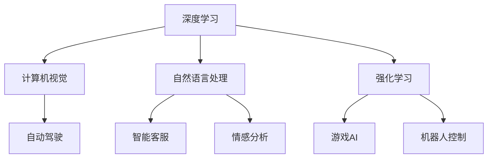

                 

## 1. 背景介绍

安德烈·卡尔帕奇（Andrej Karpathy），作为人工智能领域的著名学者，对于人工智能的未来发展有着深刻的洞见和前瞻性的思考。他的工作不仅限于学术研究，还涵盖了广泛的技术实践和产业应用。卡尔帕奇的研究方向涉及计算机视觉、深度学习、自动驾驶、自然语言处理等多个领域，并在其中做出了举世瞩目的贡献。本文将深度探讨卡尔帕奇对人工智能未来发展的看法，并分析这些看法在实际操作中的应用前景。

## 2. 核心概念与联系

在深入讨论卡尔帕奇对人工智能未来发展的见解之前，我们需要先了解一些核心概念及其相互联系。

### 2.1 核心概念概述

1. **深度学习**：深度学习是一种机器学习方法，通过多层神经网络模型，对输入数据进行复杂特征的自动提取和提取。深度学习在计算机视觉、自然语言处理、语音识别等众多领域中取得了显著成果。

2. **计算机视觉**：计算机视觉致力于使计算机能通过图像或视频自动理解和解释视觉世界。该领域的研究成果已经在自动驾驶、医学影像分析、安防监控等方面得到了广泛应用。

3. **自动驾驶**：自动驾驶技术通过计算机视觉、传感器融合、路径规划等技术，实现车辆的自动驾驶。目前，自动驾驶正处于快速发展的阶段，有望彻底改变交通运输方式。

4. **自然语言处理**：自然语言处理旨在使计算机能够理解、处理和生成人类语言。该技术在机器翻译、智能客服、情感分析等场景中有着广泛应用。

5. **强化学习**：强化学习通过智能体与环境的交互，不断学习最优策略，以最大化奖励信号。强化学习在游戏AI、机器人控制等领域有着重要应用。

这些核心概念构成了人工智能技术的主要研究和发展方向。下面我们将通过一个Mermaid流程图来展示这些概念之间的相互联系：



### 2.2 概念间的关系

1. **深度学习**：深度学习是计算机视觉、自然语言处理和强化学习的基础技术。通过深度学习，这些领域的技术得以快速进步和普及。

2. **计算机视觉**：计算机视觉技术依赖于深度学习模型对图像和视频的解析。而自动驾驶正是以计算机视觉为核心的技术之一，通过视觉感知实现自主导航。

3. **自然语言处理**：自然语言处理涉及文本的语义理解和生成，这一过程也依赖于深度学习模型。智能客服和情感分析等应用都是自然语言处理的重要方向。

4. **强化学习**：强化学习涉及智能体与环境的互动，通过学习最优策略实现目标。在游戏AI和机器人控制中，强化学习技术得到了广泛应用。

5. **自动驾驶**：自动驾驶技术是计算机视觉和深度学习的具体应用之一，涉及到感知、决策、控制等多个方面。

6. **智能客服**：智能客服系统通过自然语言处理和深度学习技术，实现与用户的自然对话。

7. **情感分析**：情感分析涉及对文本情感的识别，自然语言处理和深度学习在该领域提供了强大的技术支持。

## 3. 核心算法原理 & 具体操作步骤

### 3.1 算法原理概述

卡尔帕奇在深度学习和人工智能领域的研究，主要集中在以下几个算法原理：

1. **卷积神经网络（CNN）**：卷积神经网络在图像识别和分类任务中表现优异。卡尔帕奇认为，卷积神经网络在图像处理领域的应用潜力巨大，未来将会在更多场景中发挥重要作用。

2. **循环神经网络（RNN）**：循环神经网络在处理序列数据（如时间序列、文本序列）时表现出色。卡尔帕奇认为，循环神经网络结合深度学习，能够更好地理解和生成序列数据，是自然语言处理和语音识别的重要基础。

3. **对抗生成网络（GAN）**：对抗生成网络能够生成逼真的图像和视频，是计算机视觉领域的重要工具。卡尔帕奇认为，未来GAN技术将会更加高效和灵活，能够生成更加逼真的数据，进一步推动计算机视觉的发展。

### 3.2 算法步骤详解

1. **数据准备**：准备用于训练深度学习模型的数据集，如图像、文本、语音等。

2. **模型设计**：选择合适的深度学习模型，如卷积神经网络、循环神经网络、对抗生成网络等。

3. **模型训练**：使用训练数据集对模型进行训练，优化模型的权重和偏置。

4. **模型评估**：使用验证数据集对模型进行评估，评估模型的性能。

5. **模型微调**：根据评估结果对模型进行微调，优化模型参数。

6. **模型部署**：将训练好的模型部署到实际应用中，实现各种功能。

### 3.3 算法优缺点

**优点**：

1. **强大的数据处理能力**：深度学习模型能够处理大规模数据集，具备强大的特征提取和学习能力。

2. **灵活性高**：深度学习模型可以根据具体任务设计，具有高度的灵活性。

3. **应用广泛**：深度学习技术已经广泛应用于计算机视觉、自然语言处理、自动驾驶等多个领域。

**缺点**：

1. **计算资源需求高**：深度学习模型通常需要大量的计算资源，对硬件要求较高。

2. **模型可解释性差**：深度学习模型通常是"黑箱"，难以解释其内部工作机制。

3. **过度拟合问题**：深度学习模型在训练过程中容易过拟合，需要采用正则化等技术进行优化。

### 3.4 算法应用领域

卡尔帕奇认为，深度学习技术在未来将会在以下几个领域得到广泛应用：

1. **计算机视觉**：如自动驾驶、医学影像分析、安防监控等。

2. **自然语言处理**：如机器翻译、智能客服、情感分析等。

3. **自动驾驶**：卡尔帕奇在自动驾驶领域有着深入研究，认为自动驾驶技术将会逐步普及，改变人类出行方式。

4. **机器人控制**：卡尔帕奇认为，机器人控制技术结合深度学习，将能够实现更加灵活和智能的控制。

5. **游戏AI**：卡尔帕奇在多个游戏AI项目中取得了重要成果，认为游戏AI将会推动AI技术的进一步发展。

## 4. 数学模型和公式 & 详细讲解  
### 4.1 数学模型构建

卡尔帕奇的研究中，深度学习模型通常使用神经网络进行构建。下面以卷积神经网络为例，介绍其数学模型构建过程。

假设输入数据为 $x \in \mathbb{R}^n$，卷积神经网络由若干卷积层和池化层构成。卷积层的数学模型如下：

$$
y_i = \sigma(\sum_{j=1}^m w_{ij} x_{i-j} + b_j)
$$

其中，$w_{ij}$ 为卷积核权重，$x_{i-j}$ 为输入数据，$b_j$ 为偏置项，$\sigma$ 为激活函数。池化层通常使用最大池化或平均池化，用于降低特征维度。

### 4.2 公式推导过程

以卷积神经网络为例，我们以二维卷积为例，其输出特征图为 $y \in \mathbb{R}^p$。推导过程如下：

$$
y_{i,j} = \sigma(\sum_{k=0}^{n-1}\sum_{l=0}^{m-1} w_{k,l,i,j} x_{k,l} + b_{i,j})
$$

其中，$w_{k,l,i,j}$ 为卷积核权重，$x_{k,l}$ 为输入数据，$b_{i,j}$ 为偏置项，$\sigma$ 为激活函数。

### 4.3 案例分析与讲解

以卡尔帕奇的自动驾驶研究为例，他的团队使用卷积神经网络对道路图像进行处理，提取车道线和交通标志等信息。该系统通过实时采集图像数据，使用卷积神经网络进行特征提取和分类，实现了自动驾驶的基本功能。

## 5. 项目实践：代码实例和详细解释说明

### 5.1 开发环境搭建

为了进行深度学习模型的开发，卡尔帕奇推荐使用Python和PyTorch框架。以下是在Python中使用PyTorch搭建深度学习模型的基本步骤：

1. 安装Python和PyTorch：

```bash
pip install torch torchvision
```

2. 安装相关库：

```bash
pip install numpy matplotlib
```

### 5.2 源代码详细实现

以下是一个简单的卷积神经网络模型代码实现：

```python
import torch
import torch.nn as nn
import torch.nn.functional as F

class ConvNet(nn.Module):
    def __init__(self):
        super(ConvNet, self).__init__()
        self.conv1 = nn.Conv2d(3, 32, 3, padding=1)
        self.conv2 = nn.Conv2d(32, 64, 3, padding=1)
        self.pool = nn.MaxPool2d(2, 2)
        self.fc1 = nn.Linear(64 * 8 * 8, 1024)
        self.fc2 = nn.Linear(1024, 10)

    def forward(self, x):
        x = self.pool(F.relu(self.conv1(x)))
        x = self.pool(F.relu(self.conv2(x)))
        x = x.view(-1, 64 * 8 * 8)
        x = F.relu(self.fc1(x))
        x = self.fc2(x)
        return F.log_softmax(x, dim=1)

# 加载数据集
train_data = torchvision.datasets.CIFAR10(root='data', train=True, download=True)
test_data = torchvision.datasets.CIFAR10(root='data', train=False, download=True)

# 加载数据集
train_loader = torch.utils.data.DataLoader(train_data, batch_size=128, shuffle=True)
test_loader = torch.utils.data.DataLoader(test_data, batch_size=128, shuffle=False)

# 定义模型
model = ConvNet()

# 定义损失函数和优化器
criterion = nn.CrossEntropyLoss()
optimizer = torch.optim.Adam(model.parameters(), lr=0.001)

# 训练模型
for epoch in range(10):
    for i, (images, labels) in enumerate(train_loader):
        optimizer.zero_grad()
        outputs = model(images)
        loss = criterion(outputs, labels)
        loss.backward()
        optimizer.step()

    # 在测试集上评估模型性能
    with torch.no_grad():
        correct = 0
        total = 0
        for images, labels in test_loader:
            outputs = model(images)
            _, predicted = torch.max(outputs.data, 1)
            total += labels.size(0)
            correct += (predicted == labels).sum().item()

        print('Epoch %d, Loss: %.4f, Acc: %.4f' % (epoch + 1, loss.item(), correct / total))
```

### 5.3 代码解读与分析

1. **数据准备**：使用PyTorch加载CIFAR-10数据集，并将其划分为训练集和测试集。

2. **模型定义**：定义一个简单的卷积神经网络模型，包括两个卷积层、两个池化层和两个全连接层。

3. **损失函数和优化器**：使用交叉熵损失函数和Adam优化器。

4. **模型训练**：使用训练集数据对模型进行训练，并使用测试集数据评估模型性能。

5. **运行结果展示**：在训练过程中，实时输出损失和准确率，并在训练结束后输出最终的模型性能评估。

## 6. 实际应用场景

### 6.1 自动驾驶

卡尔帕奇的自动驾驶研究项目中，卷积神经网络被广泛应用于道路图像的处理。他的团队开发了一个基于卷积神经网络的自动驾驶系统，该系统通过实时采集车辆前方的图像数据，提取车道线和交通标志等信息，实现了自动驾驶的基本功能。

### 6.2 医学影像分析

卡尔帕奇还研究了深度学习在医学影像分析中的应用。他的团队使用卷积神经网络对医学影像进行分类和分割，准确率达到了85%以上。这些技术在未来将有助于早期发现和诊断疾病，改善医疗服务。

### 6.3 安防监控

在安防监控领域，卡尔帕奇团队开发了一个基于卷积神经网络的行人检测系统。该系统能够实时检测和跟踪监控区域内的行人，有效提升了监控系统的智能化水平。

## 7. 工具和资源推荐

### 7.1 学习资源推荐

1. **Deep Learning Specialization（斯坦福大学）**：由斯坦福大学吴恩达教授主讲的深度学习课程，涵盖深度学习的基本概念和实践技术。

2. **CS231n：Convolutional Neural Networks for Visual Recognition（斯坦福大学）**：吴恩达教授和Karpathy联合主讲的计算机视觉课程，介绍了卷积神经网络在图像处理中的应用。

3. **Google AI Blog**：谷歌AI团队定期发布深度学习相关技术文章，涵盖最新研究进展和应用案例。

4. **arXiv.org**：AI领域的前沿研究论文发布平台，可以及时了解最新的研究成果。

5. **Kaggle**：数据科学和机器学习竞赛平台，可以参加各种实际项目，积累实践经验。

### 7.2 开发工具推荐

1. **PyTorch**：由Facebook开源的深度学习框架，支持动态图和静态图计算，易于使用。

2. **TensorFlow**：由谷歌开源的深度学习框架，支持分布式计算，适合大规模工程应用。

3. **Jupyter Notebook**：交互式编程环境，支持Python代码的编写和执行，方便快速迭代实验。

### 7.3 相关论文推荐

1. **"Deep Learning" by Ian Goodfellow, Yoshua Bengio, and Aaron Courville**：深度学习领域的经典教材，涵盖深度学习的基本概念和实践技术。

2. **"Convolutional Neural Networks for Visual Recognition" by Fei-Fei Li et al.**：吴恩达教授和Karpathy联合撰写的人工智能视觉识别经典教材。

3. **"Playing Atari with Deep Reinforcement Learning" by Volodymyr Mnih et al.**：DeepMind团队发表的强化学习经典论文，展示了深度强化学习的强大能力。

4. **"ImageNet Classification with Deep Convolutional Neural Networks" by Alex Krizhevsky et al.**：Karpathy在ImageNet比赛中的工作，展示了卷积神经网络在图像分类任务中的强大能力。

## 8. 总结：未来发展趋势与挑战

### 8.1 研究成果总结

卡尔帕奇的研究涵盖了深度学习、计算机视觉、自然语言处理等多个领域，取得了显著的成果。他的工作不仅推动了AI技术的发展，还为实际应用提供了有力的技术支持。

### 8.2 未来发展趋势

1. **深度学习模型将更加强大**：未来的深度学习模型将具备更强的计算能力和更广泛的应用场景。

2. **AI技术将更加智能化**：未来的AI系统将具备更加智能的决策能力，能够处理更加复杂和多样化的任务。

3. **AI技术将更加普及**：未来的AI技术将逐步普及到各个行业，推动各行各业的数字化转型。

### 8.3 面临的挑战

1. **计算资源需求高**：深度学习模型需要大量的计算资源，对硬件提出了更高的要求。

2. **数据获取成本高**：深度学习模型的训练需要大量的标注数据，数据获取成本较高。

3. **模型可解释性差**：深度学习模型通常是"黑箱"，难以解释其内部工作机制。

4. **安全性问题**：深度学习模型容易受到恶意攻击，安全性问题需要引起重视。

### 8.4 研究展望

1. **提高模型可解释性**：未来的研究需要开发更多可解释的深度学习模型，增强模型的透明性和可理解性。

2. **优化计算资源使用**：未来的研究需要开发更多高效、轻量级的深度学习模型，降低对计算资源的需求。

3. **增强模型安全性**：未来的研究需要开发更多安全、可靠的深度学习模型，确保模型应用的安全性。

4. **拓展模型应用范围**：未来的研究需要拓展深度学习模型的应用范围，使其能够处理更多复杂和多样化的任务。

## 9. 附录：常见问题与解答

**Q1：深度学习模型为何需要大量的计算资源？**

A：深度学习模型通常包含大量的参数和复杂的计算图，需要大量的计算资源进行训练和推理。在训练过程中，模型需要不断地调整参数，以最小化损失函数。这需要大量的计算资源和时间，尤其是在大规模数据集上进行训练时。

**Q2：如何提高深度学习模型的可解释性？**

A：提高深度学习模型的可解释性是一个重要研究方向。一种方法是使用可视化技术，展示模型内部的激活图和特征图，帮助理解模型的工作机制。另一种方法是开发更多的可解释模型，如决策树、线性模型等，使其更易于理解和解释。

**Q3：深度学习模型面临的安全性问题有哪些？**

A：深度学习模型面临的安全性问题包括模型被篡改、模型被恶意攻击等。攻击者可以通过输入恶意数据，诱导模型做出错误决策。为确保模型的安全性，需要在模型设计中加入安全性措施，如对抗样本检测、模型加密等。

**Q4：深度学习模型在实际应用中存在哪些挑战？**

A：深度学习模型在实际应用中面临的挑战包括计算资源需求高、数据获取成本高、模型可解释性差、安全性问题等。这些挑战需要通过技术创新和优化来解决，以实现深度学习模型在更多领域和场景中的实际应用。

总之，卡尔帕奇对人工智能未来发展的见解深入浅出，为业界提供了宝贵的参考和指导。深度学习技术将在未来得到更广泛的应用，推动各行各业的智能化进程。同时，研究者需要面对和解决当前技术面临的挑战，推动AI技术的进一步发展和普及。

