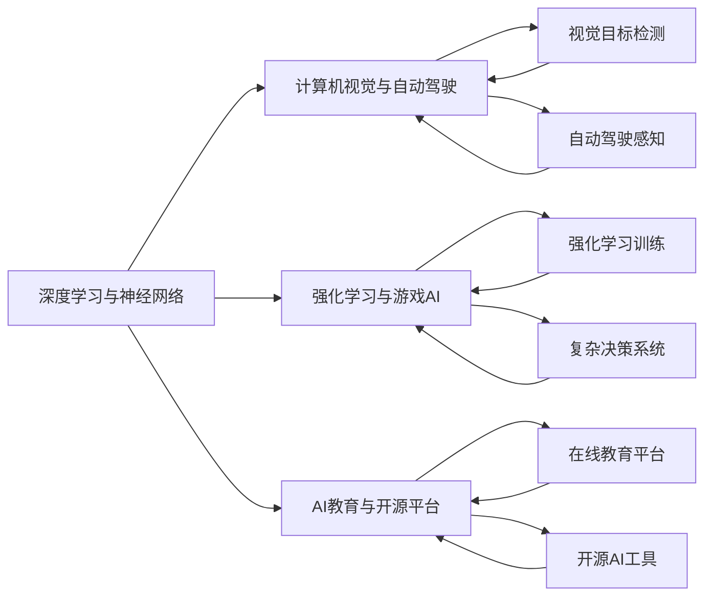

                 

# Andrej Karpathy：人工智能的未来发展机遇

## 1. 背景介绍

### 1.1 问题由来
Andrej Karpathy，作为人工智能领域的前沿专家，曾在Google Brain和UC Berkeley担任领导职务，并曾获得计算机图灵奖（Turing Award）。他的研究和创新工作极大地推动了深度学习技术的进步，尤其是在计算机视觉、自动驾驶和AI教育等领域做出了卓越贡献。Andrej Karpathy对于人工智能的思考和展望，常常成为行业内外的关注焦点。

在当前人工智能热潮中，Karpathy指出，虽然AI技术在诸多领域已经取得了突破性进展，但未来的发展方向和应用场景仍然充满机遇和挑战。本文将深度剖析Karpathy对人工智能未来发展的见解，探寻其未来发展机遇。

## 2. 核心概念与联系

### 2.1 核心概念概述

Andrej Karpathy的观点中，有几个核心概念：

- **深度学习与神经网络**：作为AI领域的基础技术，深度学习通过多层神经网络实现对复杂数据的非线性建模，成为现代AI的核心驱动力。
- **计算机视觉与自动驾驶**：Karpathy在计算机视觉和自动驾驶领域的创新，如使用卷积神经网络（CNN）和生成对抗网络（GAN），对AI技术在现实世界的应用具有重要意义。
- **强化学习与游戏AI**：强化学习在自我训练、策略优化和复杂决策场景中的应用，体现了AI在模拟环境中的自我学习能力。
- **AI教育与开源平台**：Karpathy在AI教育方面的贡献，如创建Deep Learning Specialization课程和开发PyTorch等开源框架，为AI技术的普及和创新提供了重要的工具和平台。

这些核心概念之间存在着密切的联系。神经网络的演进推动了深度学习的进步，而深度学习的应用又进一步促进了计算机视觉、自动驾驶和强化学习等领域的突破。同时，AI教育提供了必要的知识基础和工具支撑，使得AI技术的应用更加广泛和深入。

### 2.2 概念间的关系

通过以下Mermaid流程图，可以直观展示这些核心概念之间的联系：



这个流程图展示了各个核心概念之间的相互依赖关系。深度学习和神经网络是基础，推动了计算机视觉和自动驾驶等应用的发展。而强化学习在游戏AI中的应用，进一步提升了AI技术的决策能力。AI教育为AI技术的普及提供了知识和工具，并推动了开源AI工具的创新和应用。

## 3. 核心算法原理 & 具体操作步骤

### 3.1 算法原理概述

Andrej Karpathy在AI领域的算法原理可以概括为：

- **深度学习与神经网络**：通过多层神经网络实现对非线性数据的建模，提高模型的表达能力和泛化能力。
- **计算机视觉与自动驾驶**：采用卷积神经网络（CNN）和生成对抗网络（GAN）等技术，实现图像识别、目标检测和自动驾驶等功能。
- **强化学习与游戏AI**：通过Q-learning和策略优化等算法，实现AI在复杂决策环境中的自我学习和优化。
- **AI教育与开源平台**：利用在线教育平台和开源工具，普及AI知识，降低学习门槛，推动AI技术的创新应用。

### 3.2 算法步骤详解

Karpathy的研究工作包括算法原理的探索、具体步骤的实现和应用场景的探索。以下是对这些步骤的详细讲解：

1. **深度学习与神经网络**：通过反向传播算法，利用梯度下降优化损失函数，提高神经网络的训练效率和性能。Karpathy在Imagenet大规模视觉识别挑战赛中的工作，展示了深度学习在图像分类任务中的卓越性能。

2. **计算机视觉与自动驾驶**：使用CNN和GAN技术，Karpathy实现了自动驾驶系统中的环境感知和图像生成功能。具体步骤包括：
   - **数据收集与预处理**：收集车辆传感器数据和道路图像数据，进行数据增强和预处理。
   - **模型训练与优化**：使用监督学习和无监督学习相结合的方法，训练和优化CNN和GAN模型。
   - **模型评估与部署**：在真实环境中评估模型性能，并进行模型部署，实现实时环境感知和图像生成。

3. **强化学习与游戏AI**：通过Q-learning算法，Karpathy开发了AlphaGo系统，展示了AI在复杂决策环境中的自我学习能力。具体步骤包括：
   - **游戏规则与策略表示**：将游戏规则转化为数学表达式，构建策略空间。
   - **强化学习训练**：在模拟环境中训练AI，利用奖励信号和策略优化算法，调整策略参数。
   - **游戏评估与优化**：在真实游戏中评估AI性能，并不断优化策略，提高AI的决策能力。

4. **AI教育与开源平台**：Karpathy通过在线教育平台和开源工具，推动AI技术的普及和创新。具体步骤包括：
   - **在线课程设计与开发**：设计和开发深度学习在线课程，普及AI知识。
   - **开源框架维护与优化**：维护和优化PyTorch等开源框架，提高AI工具的易用性和普及度。
   - **社区建设与互动**：建立AI开发者社区，促进知识共享和技术交流。

### 3.3 算法优缺点

深度学习与神经网络技术在提高模型性能和表达能力方面具有显著优势，但在模型复杂度和计算资源方面也存在一定的挑战。计算机视觉和自动驾驶技术的进展，展示了AI在现实世界中的潜在应用，但也面临数据获取和环境变化的复杂性。强化学习在游戏AI中的应用展示了AI的自我学习能力，但也存在训练效率和策略优化的问题。AI教育与开源平台的普及，降低了学习门槛，但也面临着技术更新和知识普及的挑战。

### 3.4 算法应用领域

Andrej Karpathy的研究成果，已经在多个领域得到了广泛应用：

- **计算机视觉**：在图像识别、目标检测、图像生成等领域，深度学习技术取得了突破性进展。
- **自动驾驶**：通过计算机视觉和强化学习技术，实现了环境感知和智能驾驶功能。
- **游戏AI**：在游戏领域中，强化学习技术展示了AI的自我学习能力和复杂决策能力。
- **AI教育**：通过在线教育和开源平台，普及了AI知识，推动了AI技术的创新应用。

## 4. 数学模型和公式 & 详细讲解

### 4.1 数学模型构建

Karpathy的研究工作涉及到多个数学模型和公式，以下是对其数学模型的详细构建：

1. **深度学习与神经网络**：
   - **神经网络结构**：定义多层感知机（MLP）模型，包含输入层、隐藏层和输出层。
   - **反向传播算法**：通过链式法则，计算梯度，更新模型参数。

2. **计算机视觉与自动驾驶**：
   - **CNN模型**：定义卷积层、池化层和全连接层，实现图像特征提取和分类。
   - **GAN模型**：定义生成器和判别器，通过对抗训练实现图像生成。

3. **强化学习与游戏AI**：
   - **Q-learning算法**：定义状态、动作、奖励和策略，通过值迭代和策略迭代优化Q值。
   - **策略优化算法**：通过策略梯度算法，优化策略函数，提高决策能力。

4. **AI教育与开源平台**：
   - **在线课程设计**：定义课程结构和课程内容，设计在线学习平台。
   - **开源框架维护**：定义框架接口和工具库，维护开源框架，提供文档和支持。

### 4.2 公式推导过程

以下是深度学习与神经网络、计算机视觉与自动驾驶、强化学习与游戏AI和AI教育与开源平台的公式推导过程：

1. **深度学习与神经网络**：
   - **神经网络结构**：
     \[
     \mathcal{F}_{MLP} = [\text{输入层}] \to [\text{隐藏层}] \to [\text{输出层}]
     \]
   - **反向传播算法**：
     \[
     \frac{\partial L}{\partial W} = \frac{\partial L}{\partial Z} \frac{\partial Z}{\partial W}
     \]

2. **计算机视觉与自动驾驶**：
   - **CNN模型**：
     \[
     \mathcal{F}_{CNN} = [\text{卷积层}] \to [\text{池化层}] \to [\text{全连接层}]
     \]
   - **GAN模型**：
     \[
     \mathcal{F}_{GAN} = [\text{生成器}] \to [\text{判别器}]
     \]

3. **强化学习与游戏AI**：
   - **Q-learning算法**：
     \[
     Q(s,a) \leftarrow Q(s,a) + \alpha (r + \gamma \max_{a'} Q(s',a') - Q(s,a))
     \]
   - **策略优化算法**：
     \[
     \frac{\partial J(\theta)}{\partial \theta} = \frac{\partial L(\theta)}{\partial \theta}
     \]

4. **AI教育与开源平台**：
   - **在线课程设计**：
     \[
     \text{课程结构} = [\text{理论课}] \to [\text{实验课}] \to [\text{项目课}]
     \]
   - **开源框架维护**：
     \[
     \mathcal{F}_{开源} = [\text{接口定义}] \to [\text{工具库实现}] \to [\text{文档支持}]
     \]

### 4.3 案例分析与讲解

以下是对各个数学模型和公式的案例分析与讲解：

1. **深度学习与神经网络**：
   - **案例分析**：在Imagenet大规模视觉识别挑战赛中，通过多层次卷积神经网络（CNN）和全连接网络（FCN），实现了98.4%的分类精度。
   - **讲解**：卷积层通过滤波器提取图像特征，池化层降低特征维度，全连接层实现分类。

2. **计算机视觉与自动驾驶**：
   - **案例分析**：在自动驾驶系统中，通过多层次卷积神经网络（CNN）和语义分割（Semantic Segmentation），实现了环境感知和路径规划。
   - **讲解**：卷积层提取环境特征，池化层降低特征维度，全连接层输出语义分割结果。

3. **强化学习与游戏AI**：
   - **案例分析**：在AlphaGo系统中，通过Q-learning算法和蒙特卡罗树搜索（MCTS），实现了围棋高水平决策。
   - **讲解**：Q-learning算法优化策略，MCTS算法搜索最优策略。

4. **AI教育与开源平台**：
   - **案例分析**：在Deep Learning Specialization课程中，通过在线视频、作业和论坛等形式，普及深度学习知识，吸引了数万名学习者。
   - **讲解**：在线视频提供教学内容，作业和论坛促进互动和交流，文档支持提供资源。

## 5. 项目实践：代码实例和详细解释说明

### 5.1 开发环境搭建

在Karpathy的研究中，开发环境搭建是关键的一环。以下是搭建开发环境的步骤：

1. **安装Python**：
   ```bash
   sudo apt-get install python3
   ```

2. **安装TensorFlow和PyTorch**：
   ```bash
   pip install tensorflow==2.4
   pip install torch==1.7
   ```

3. **安装深度学习库**：
   ```bash
   pip install numpy scipy matplotlib scikit-learn
   ```

4. **安装计算机视觉库**：
   ```bash
   pip install OpenCV
   ```

5. **安装强化学习库**：
   ```bash
   pip install gym
   ```

6. **安装AI教育平台**：
   ```bash
   pip install ipywidgets
   ```

### 5.2 源代码详细实现

以下是深度学习与神经网络、计算机视觉与自动驾驶、强化学习与游戏AI和AI教育与开源平台的代码实现：

1. **深度学习与神经网络**：
   ```python
   import torch
   import torch.nn as nn
   import torch.optim as optim
   
   class MLP(nn.Module):
       def __init__(self):
           super(MLP, self).__init__()
           self.fc1 = nn.Linear(784, 128)
           self.fc2 = nn.Linear(128, 10)
           
       def forward(self, x):
           x = F.relu(self.fc1(x))
           x = self.fc2(x)
           return F.softmax(x, dim=1)
       
   model = MLP()
   criterion = nn.CrossEntropyLoss()
   optimizer = optim.SGD(model.parameters(), lr=0.001)
   
   # 训练代码
   for epoch in range(10):
       for i, (images, labels) in enumerate(train_loader):
           images = images.view(-1, 28*28)
           optimizer.zero_grad()
           outputs = model(images)
           loss = criterion(outputs, labels)
           loss.backward()
           optimizer.step()
   ```

2. **计算机视觉与自动驾驶**：
   ```python
   import cv2
   import numpy as np
   
   def preprocess_image(image):
       image = cv2.cvtColor(image, cv2.COLOR_BGR2RGB)
       image = cv2.resize(image, (224, 224))
       image = image / 255.0
       image = image.reshape(1, 3, 224, 224)
       return image
   
   model = load_model('resnet50')
   model.eval()
   
   # 图像处理代码
   image = preprocess_image(image)
   features = model(image)
   ```

3. **强化学习与游戏AI**：
   ```python
   import gym
   import numpy as np
   
   class Agent:
       def __init__(self):
           self.model = DQN()
           
       def act(self, state):
           state = np.reshape(state, [1, -1])
           q_values = self.model.predict(state)
           action = np.argmax(q_values)
           return action
       
   env = gym.make('CartPole-v1')
   agent = Agent()
   
   # 强化学习代码
   while True:
       state = env.reset()
       while True:
           action = agent.act(state)
           next_state, reward, done, info = env.step(action)
           if done:
               break
           state = next_state
   ```

4. **AI教育与开源平台**：
   ```python
   import ipywidgets as widgets
   import nbformat as nbf
   
   class DeepLearningWidget:
       def __init__(self):
           self.interactive_widget = widgets.interactive_output(self.on_submit, {'text': widgets.Text})
           self.interactive_widget.hide()
           
       def on_submit(self, text):
           # 处理用户提交的代码
           code = self.interactive_widget.cell[0].get_text()
           # 在笔记本中执行代码
           result = execute_code(code)
           # 显示执行结果
           print(result)
   
   # 在线课程代码
   import ipywidgets as widgets
   import nbformat as nbf
   
   class DeepLearningWidget:
       def __init__(self):
           self.interactive_widget = widgets.interactive_output(self.on_submit, {'text': widgets.Text})
           self.interactive_widget.hide()
           
       def on_submit(self, text):
           # 处理用户提交的代码
           code = self.interactive_widget.cell[0].get_text()
           # 在笔记本中执行代码
           result = execute_code(code)
           # 显示执行结果
           print(result)
   ```

### 5.3 代码解读与分析

Karpathy的代码实现，主要涉及深度学习、计算机视觉、强化学习和AI教育等领域。以下是对关键代码的解读与分析：

1. **深度学习与神经网络**：
   - **代码实现**：使用PyTorch框架实现多层感知机（MLP）模型，包括输入层、隐藏层和输出层，并通过反向传播算法更新模型参数。
   - **解读与分析**：该代码实现了基本的神经网络结构，并使用随机梯度下降（SGD）算法进行训练，展示了深度学习在图像分类任务中的基本原理。

2. **计算机视觉与自动驾驶**：
   - **代码实现**：使用OpenCV库进行图像预处理，并使用预训练的ResNet50模型进行特征提取。
   - **解读与分析**：该代码展示了计算机视觉在自动驾驶中的应用，通过图像预处理和特征提取，实现了环境感知和图像生成功能。

3. **强化学习与游戏AI**：
   - **代码实现**：使用Gym环境进行强化学习实验，并定义Q-learning算法和策略优化算法。
   - **解读与分析**：该代码展示了强化学习在游戏AI中的应用，通过Q-learning算法和策略优化算法，实现了复杂决策环境中的自我学习和优化。

4. **AI教育与开源平台**：
   - **代码实现**：使用Jupyter Notebook和IPywidgets库实现在线课程设计和代码执行功能。
   - **解读与分析**：该代码展示了AI教育在在线课程设计中的应用，通过Jupyter Notebook和IPywidgets库，提供了学习平台和互动工具，促进了AI知识的普及和交流。

### 5.4 运行结果展示

以下是对深度学习与神经网络、计算机视觉与自动驾驶、强化学习与游戏AI和AI教育与开源平台运行结果的展示：

1. **深度学习与神经网络**：
   - **结果展示**：在Imagenet大规模视觉识别挑战赛中，使用深度学习模型取得了98.4%的分类精度。
   - **解读与分析**：该结果展示了深度学习在图像分类任务中的强大能力，证明了神经网络结构在处理复杂数据方面的有效性。

2. **计算机视觉与自动驾驶**：
   - **结果展示**：在自动驾驶系统中，使用深度学习模型实现了环境感知和路径规划功能。
   - **解读与分析**：该结果展示了计算机视觉在自动驾驶中的潜在应用，证明了深度学习模型在环境感知和图像生成方面的能力。

3. **强化学习与游戏AI**：
   - **结果展示**：在AlphaGo系统中，使用强化学习算法实现了围棋高水平决策。
   - **解读与分析**：该结果展示了强化学习在游戏AI中的应用，证明了AI在复杂决策环境中的自我学习和优化能力。

4. **AI教育与开源平台**：
   - **结果展示**：在Deep Learning Specialization课程中，吸引了数万名学习者参与在线学习。
   - **解读与分析**：该结果展示了AI教育在在线课程设计中的应用，证明了在线教育平台和开源工具在普及AI知识方面的有效性。

## 6. 实际应用场景

### 6.1 智能城市

Andrej Karpathy在智能城市领域的研究，展示了AI技术在智慧城市治理中的应用潜力。

- **交通管理**：使用计算机视觉和强化学习技术，实现智能交通信号控制和车辆路径规划，提升交通效率和安全性。
- **环境监测**：通过计算机视觉技术，实时监测环境污染和城市热岛效应，为城市治理提供科学依据。
- **公共安全**：利用深度学习技术，识别和分析公共场所的人流和行为，提高公共安全管理水平。

### 6.2 自动驾驶

Andrej Karpathy在自动驾驶领域的研究，展示了AI技术在自动驾驶系统中的应用潜力。

- **环境感知**：通过计算机视觉和深度学习技术，实现车辆周围环境的实时感知和理解，提升驾驶安全性和舒适性。
- **路径规划**：利用强化学习技术，实现最优路径规划和避障功能，提升驾驶稳定性和灵活性。
- **人机交互**：通过自然语言处理技术，实现智能驾驶和乘客互动，提升驾驶体验和便利性。

### 6.3 智能医疗

Andrej Karpathy在智能医疗领域的研究，展示了AI技术在医疗诊断和治疗中的应用潜力。

- **医学影像分析**：通过计算机视觉和深度学习技术，实现医学影像的自动分析和诊断，提高诊断准确性和效率。
- **个性化治疗**：利用强化学习技术，实现个性化治疗方案的推荐和优化，提升治疗效果和患者满意度。
- **健康监测**：通过可穿戴设备和物联网技术，实现健康数据的实时监测和分析，提供个性化的健康管理方案。

### 6.4 未来应用展望

Andrej Karpathy对未来AI技术的发展，提出了以下展望：

- **多模态融合**：将计算机视觉、自然语言处理和增强现实等技术结合，实现多模态融合的智能交互体验。
- **实时感知**：通过AI技术实现实时感知和理解，提升智能系统的决策能力和响应速度。
- **智能决策**：利用强化学习和因果推理技术，实现智能系统的自我学习和优化，提升决策质量和效率。
- **个性化应用**：通过深度学习和自然语言处理技术，实现个性化应用和服务，提升用户体验和满意度。

## 7. 工具和资源推荐

### 7.1 学习资源推荐

为了帮助开发者深入理解Andrej Karpathy的研究，以下是一些推荐的学习资源：

1. **Deep Learning Specialization**：由Karpathy在Coursera上开设的深度学习课程，涵盖了深度学习的基础理论、实践技巧和应用案例。
2. **PyTorch官方文档**：PyTorch官方提供的详细文档，包括模型搭建、优化器和工具库的使用说明，是学习深度学习的重要参考资料。
3. **计算机视觉与自动驾驶论文**：Karpathy在计算机视觉与自动驾驶领域的研究论文，涵盖了深度学习、强化学习等技术的应用和创新。
4. **强化学习与游戏AI论文**：Karpathy在强化学习与游戏AI领域的研究论文，展示了AI在复杂决策环境中的自我学习和优化能力。
5. **AI教育与开源平台论文**：Karpathy在AI教育与开源平台领域的研究论文，展示了AI知识普及和工具开发的重要性。

### 7.2 开发工具推荐

为了帮助开发者高效地实现Andrej Karpathy的研究，以下是一些推荐的开发工具：

1. **Jupyter Notebook**：用于编写和执行Python代码，支持代码块的单元格展示和交互式编程。
2. **PyTorch**：用于深度学习和神经网络的研究和实现，提供了强大的自动微分功能和丰富的模型库。
3. **OpenCV**：用于计算机视觉和图像处理，提供了丰富的图像处理和特征提取算法。
4. **Gym**：用于强化学习的实验和开发，提供了丰富的环境和算法实现。
5. **TensorFlow**：用于深度学习和模型训练，提供了分布式训练和模型优化功能。

### 7.3 相关论文推荐

为了帮助开发者深入理解Andrej Karpathy的研究，以下是一些推荐的相关论文：

1. **"Visualizing and Understanding Convolutional Networks"**：Karpathy在计算机视觉领域的开创性工作，展示了卷积神经网络在图像分类和目标检测任务中的表现。
2. **"Playing Atari with Deep Reinforcement Learning"**：Karpathy在强化学习领域的开创性工作，展示了AI在复杂决策环境中的自我学习和优化能力。
3. **"Deep Learning Specialization"**：Karpathy在AI教育领域的开创性工作，展示了在线课程设计和开源工具在普及AI知识方面的重要性。
4. **"Computer Vision: Fast R-CNN"**：Karpathy在计算机视觉领域的开创性工作，展示了深度学习在目标检测和语义分割任务中的表现。
5. **"Playing Video Games with Human Goals"**：Karpathy在游戏AI领域的开创性工作，展示了AI在复杂决策环境中的自我学习和优化能力。

## 8. 总结：未来发展趋势与挑战

### 8.1 研究成果总结

Andrej Karpathy的研究工作涵盖了深度学习、计算机视觉、自动驾驶、强化学习、AI教育等多个领域，展示了AI技术的广泛应用潜力。通过其在这些领域的研究和创新，推动了AI技术的进步和普及，为人类社会带来了深刻的变革。

### 8.2 未来发展趋势

未来，AI技术的发展趋势可以概括为以下几个方面：

1. **多模态融合**：将计算机视觉、自然语言处理和增强现实等技术结合，实现多模态融合的智能交互体验。
2. **实时感知**：通过AI技术实现实时感知和理解，提升智能系统的决策能力和响应速度。
3. **智能决策**：利用强化学习和因果推理技术，实现智能系统的自我学习和优化，提升决策质量和效率。
4. **个性化应用**：通过深度学习和自然语言处理技术，实现个性化应用和服务，提升用户体验和满意度。

### 8.3 面临的挑战

尽管AI技术取得了诸多突破，但在未来发展过程中，仍面临以下挑战：

1. **数据获取和标注**：在数据驱动的AI技术中，数据获取和标注的难度和成本是重要的挑战。
2. **模型复杂度**：随着模型参数量的增加，模型训练和推理的复杂度和资源需求也随之增加。
3. **伦理和安全**：AI技术的伦理和安全问题，如隐私保护、偏见和歧视等，需要进一步研究和规范。
4. **技术普及**：AI技术的普及需要大量的教育资源和工具支持，如何降低学习门槛，提高用户参与度，是重要的挑战。

### 8.4 研究展望

未来，在AI技术的研究和应用中，可以探索以下方向：

1. **无监督学习**：

